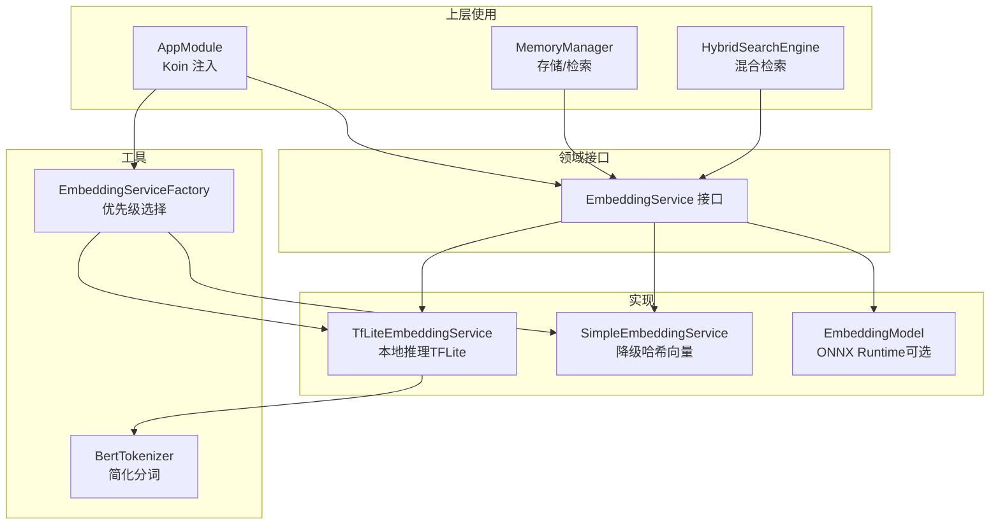
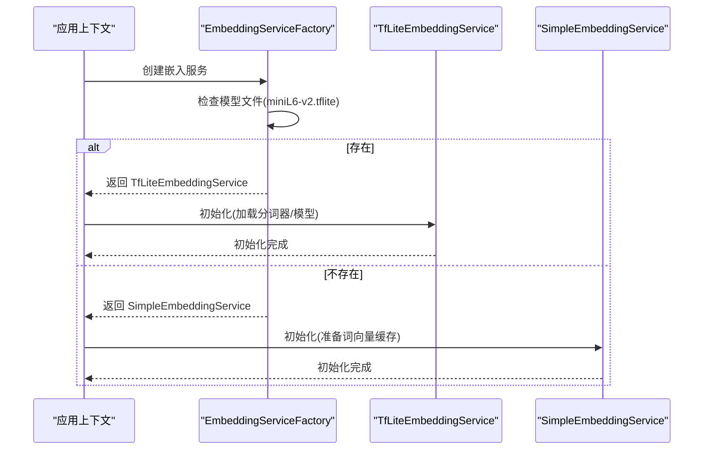
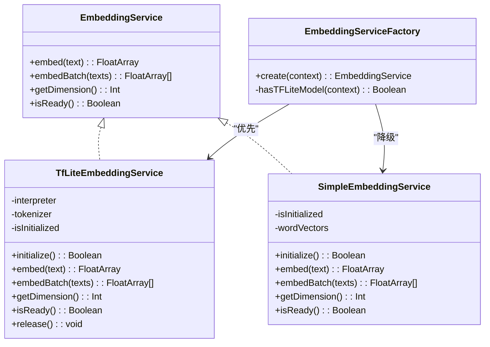
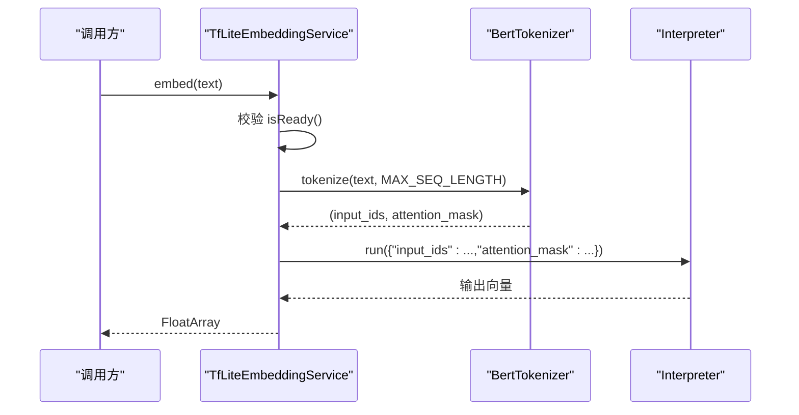
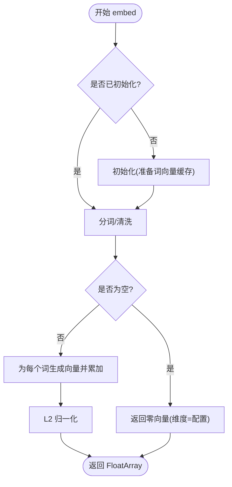
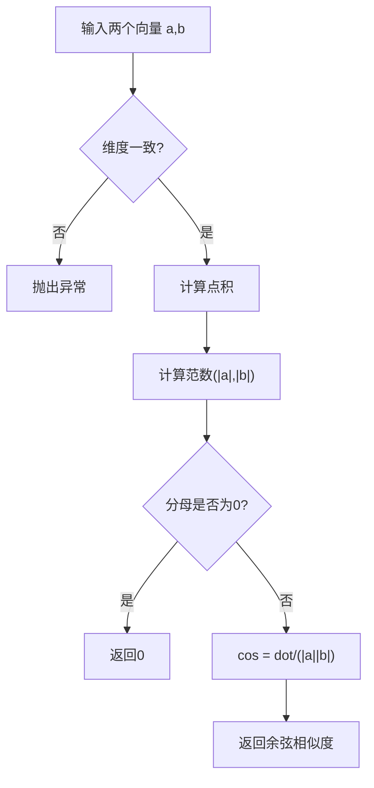
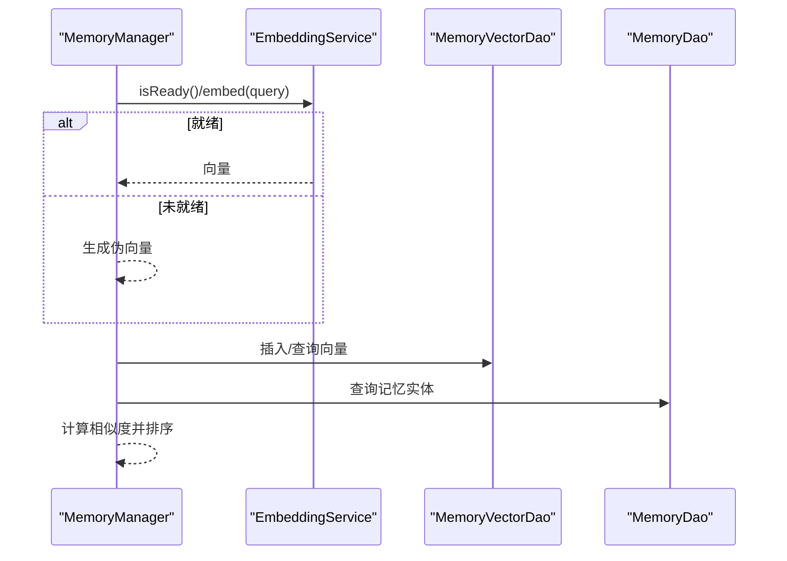
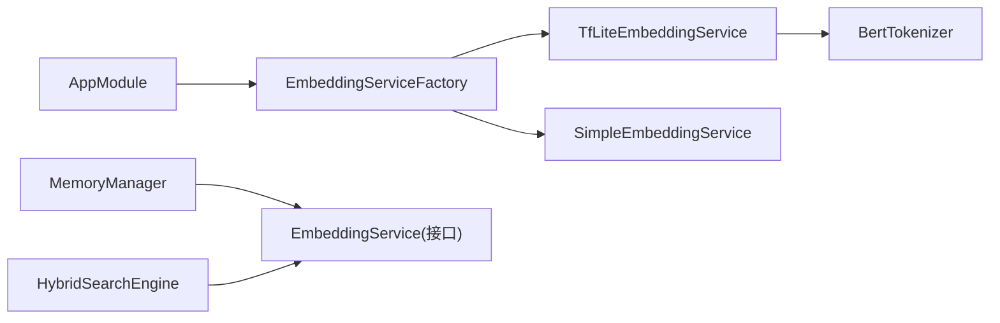

# 嵌入向量服务

<cite>
**本文引用的文件**
- [EmbeddingServiceFactory.kt](file://app/src/main/java/ai/openclaw/android/ml/EmbeddingServiceFactory.kt)
- [TfLiteEmbeddingService.kt](file://app/src/main/java/ai/openclaw/android/ml/TfLiteEmbeddingService.kt)
- [SimpleEmbeddingService.kt](file://app/src/main/java/ai/openclaw/android/ml/SimpleEmbeddingService.kt)
- [EmbeddingModel.kt](file://app/src/main/java/ai/openclaw/android/ml/EmbeddingModel.kt)
- [EmbeddingService.kt](file://app/src/main/java/ai/openclaw/android/domain/memory/EmbeddingService.kt)
- [BertTokenizer.kt](file://app/src/main/java/ai/openclaw/android/ml/BertTokenizer.kt)
- [AppModule.kt](file://app/src/main/java/ai/openclaw/android/di/AppModule.kt)
- [MemoryManager.kt](file://app/src/main/java/ai/openclaw/android/domain/memory/MemoryManager.kt)
- [HybridSearchEngine.kt（域内）](file://app/src/main/java/ai/openclaw/android/domain/memory/HybridSearchEngine.kt)
- [HybridSearchEngine.kt（内存包）](file://app/src/main/java/ai/openclaw/android/memory/HybridSearchEngine.kt)
- [VectorSearchTest.kt](file://app/src/test/java/ai/openclaw/android/domain/memory/VectorSearchTest.kt)
- [SimpleEmbeddingServiceTest.kt](file://app/src/test/java/ai/openclaw/android/ml/SimpleEmbeddingServiceTest.kt)
- [README.md（模型目录）](file://app/src/main/assets/models/README.md)
</cite>

## 目录
1. [简介](#简介)
2. [项目结构](#项目结构)
3. [核心组件](#核心组件)
4. [架构总览](#架构总览)
5. [详细组件分析](#详细组件分析)
6. [依赖关系分析](#依赖关系分析)
7. [性能考量](#性能考量)
8. [故障排查指南](#故障排查指南)
9. [结论](#结论)
10. [附录](#附录)

## 简介
本文件面向嵌入向量服务的技术文档，系统阐述以下内容：
- 嵌入向量的生成原理与数学基础（余弦相似度、向量归一化）
- 工厂模式与多实现策略（EmbeddingServiceFactory 的优先级选择）
- 本地推理机制与性能优化（TfLiteEmbeddingService 的 TensorFlow Lite 推理流程）
- 降级策略与兼容性处理（SimpleEmbeddingService 的哈希降级与 MemoryManager 的兼容逻辑）
- 嵌入维度配置、向量归一化与相似度计算
- 模型选择指南与资源消耗评估
- 错误处理与恢复机制

## 项目结构
嵌入向量服务位于应用模块中，采用“接口 + 多实现 + 工厂”的分层设计，结合依赖注入在运行时按条件选择最佳实现。

图示来源
- [EmbeddingService.kt:1-8](file://app/src/main/java/ai/openclaw/android/domain/memory/EmbeddingService.kt#L1-L8)
- [TfLiteEmbeddingService.kt:1-97](file://app/src/main/java/ai/openclaw/android/ml/TfLiteEmbeddingService.kt#L1-L97)
- [SimpleEmbeddingService.kt:1-107](file://app/src/main/java/ai/openclaw/android/ml/SimpleEmbeddingService.kt#L1-L107)
- [EmbeddingModel.kt:1-134](file://app/src/main/java/ai/openclaw/android/ml/EmbeddingModel.kt#L1-L134)
- [BertTokenizer.kt:1-44](file://app/src/main/java/ai/openclaw/android/ml/BertTokenizer.kt#L1-L44)
- [EmbeddingServiceFactory.kt:1-45](file://app/src/main/java/ai/openclaw/android/ml/EmbeddingServiceFactory.kt#L1-L45)
- [AppModule.kt:1-79](file://app/src/main/java/ai/openclaw/android/di/AppModule.kt#L1-L79)
- [MemoryManager.kt:1-116](file://app/src/main/java/ai/openclaw/android/domain/memory/MemoryManager.kt#L1-L116)
- [HybridSearchEngine.kt（域内）:1-102](file://app/src/main/java/ai/openclaw/android/domain/memory/HybridSearchEngine.kt#L1-L102)

章节来源
- [EmbeddingServiceFactory.kt:1-45](file://app/src/main/java/ai/openclaw/android/ml/EmbeddingServiceFactory.kt#L1-L45)
- [AppModule.kt:37-40](file://app/src/main/java/ai/openclaw/android/di/AppModule.kt#L37-L40)

## 核心组件
- 接口层：统一抽象 EmbeddingService，定义 embed、embedBatch、getDimension、isReady 等能力。
- 实现层：
  - TfLiteEmbeddingService：基于 TensorFlow Lite 的本地推理，支持分词与批量嵌入。
  - SimpleEmbeddingService：无模型降级方案，使用哈希生成一致向量并进行归一化。
  - EmbeddingModel（ONNX 可选）：ONNX Runtime 推理，支持外部/内置模型加载与缓存。
- 工具层：BertTokenizer 提供简化分词；EmbeddingServiceFactory 负责运行时选择最优实现。
- 使用层：MemoryManager 负责向量存储与检索；HybridSearchEngine 结合关键词与语义检索。

章节来源
- [EmbeddingService.kt:3-8](file://app/src/main/java/ai/openclaw/android/domain/memory/EmbeddingService.kt#L3-L8)
- [TfLiteEmbeddingService.kt:13-97](file://app/src/main/java/ai/openclaw/android/ml/TfLiteEmbeddingService.kt#L13-L97)
- [SimpleEmbeddingService.kt:19-107](file://app/src/main/java/ai/openclaw/android/ml/SimpleEmbeddingService.kt#L19-L107)
- [EmbeddingModel.kt:20-134](file://app/src/main/java/ai/openclaw/android/ml/EmbeddingModel.kt#L20-L134)
- [BertTokenizer.kt:5-44](file://app/src/main/java/ai/openclaw/android/ml/BertTokenizer.kt#L5-L44)

## 架构总览
嵌入服务通过工厂模式在运行时根据是否存在 TFLite 模型文件选择实现。若存在，则优先使用 TfLiteEmbeddingService；否则回退到 SimpleEmbeddingService。ONNX 版本作为独立实现存在，但当前 DI 绑定指向工厂创建的 EmbeddingService。

图示来源
- [EmbeddingServiceFactory.kt:21-32](file://app/src/main/java/ai/openclaw/android/ml/EmbeddingServiceFactory.kt#L21-L32)
- [TfLiteEmbeddingService.kt:27-48](file://app/src/main/java/ai/openclaw/android/ml/TfLiteEmbeddingService.kt#L27-L48)
- [SimpleEmbeddingService.kt:31-41](file://app/src/main/java/ai/openclaw/android/ml/SimpleEmbeddingService.kt#L31-L41)

章节来源
- [EmbeddingServiceFactory.kt:14-45](file://app/src/main/java/ai/openclaw/android/ml/EmbeddingServiceFactory.kt#L14-L45)
- [AppModule.kt:37-40](file://app/src/main/java/ai/openclaw/android/di/AppModule.kt#L37-L40)

## 详细组件分析

### 接口与工厂模式
- 接口职责：统一嵌入生成、批量处理、维度查询与就绪状态判断。
- 工厂策略：优先检测 miniL6-v2.tflite 是否存在于 assets；存在则返回 TfLite 实现，否则返回 Simple 实现。
- 依赖注入：通过 Koin 将 EmbeddingService 以单例形式注入，延迟创建，避免冷启动阻塞。

图示来源
- [EmbeddingService.kt:3-8](file://app/src/main/java/ai/openclaw/android/domain/memory/EmbeddingService.kt#L3-L8)
- [TfLiteEmbeddingService.kt:13-97](file://app/src/main/java/ai/openclaw/android/ml/TfLiteEmbeddingService.kt#L13-L97)
- [SimpleEmbeddingService.kt:19-107](file://app/src/main/java/ai/openclaw/android/ml/SimpleEmbeddingService.kt#L19-L107)
- [EmbeddingServiceFactory.kt:14-45](file://app/src/main/java/ai/openclaw/android/ml/EmbeddingServiceFactory.kt#L14-L45)

章节来源
- [EmbeddingService.kt:3-8](file://app/src/main/java/ai/openclaw/android/domain/memory/EmbeddingService.kt#L3-L8)
- [EmbeddingServiceFactory.kt:21-32](file://app/src/main/java/ai/openclaw/android/ml/EmbeddingServiceFactory.kt#L21-L32)

### TfLiteEmbeddingService：本地推理与性能优化
- 模型与分词：从 assets 加载 miniL6-v2.tflite 与 vocab.txt；使用 BertTokenizer 进行简化分词。
- 推理流程：将文本转 token，构造 input_ids 与 attention_mask，调用 Interpreter 执行，输出固定维度向量。
- 维度与批处理：固定 EMBEDDING_DIM；提供 embedBatch 并发映射。
- 性能要点：
  - 使用 IO 调度器执行耗时操作，避免阻塞主线程。
  - 初始化阶段加载模型与分词器，isReady 保障调用安全。
  - 支持 release 释放资源，便于内存回收。

图示来源
- [TfLiteEmbeddingService.kt:50-69](file://app/src/main/java/ai/openclaw/android/ml/TfLiteEmbeddingService.kt#L50-L69)
- [BertTokenizer.kt:21-43](file://app/src/main/java/ai/openclaw/android/ml/BertTokenizer.kt#L21-L43)

章节来源
- [TfLiteEmbeddingService.kt:13-97](file://app/src/main/java/ai/openclaw/android/ml/TfLiteEmbeddingService.kt#L13-L97)
- [BertTokenizer.kt:5-44](file://app/src/main/java/ai/openclaw/android/ml/BertTokenizer.kt#L5-L44)

### SimpleEmbeddingService：降级策略与兼容性
- 降级原理：当 TFLite 模型不可用时，使用哈希生成一致向量；对每个词生成固定维度向量并累加平均，最后做 L2 归一化。
- 兼容性：即使未初始化也能自动初始化；embedBatch 逐条调用。
- 适用场景：设备不支持或缺少模型文件时的最小可用能力。

图示来源
- [SimpleEmbeddingService.kt:31-78](file://app/src/main/java/ai/openclaw/android/ml/SimpleEmbeddingService.kt#L31-L78)

章节来源
- [SimpleEmbeddingService.kt:19-107](file://app/src/main/java/ai/openclaw/android/ml/SimpleEmbeddingService.kt#L19-L107)

### ONNX Runtime 实现（可选）
- 能力概述：加载 ONNX 导出的 MiniLM-L6-v2，支持外部存储与 assets 双路径加载，启用优化级别，带简单缓存。
- 与工厂的关系：当前 DI 绑定指向工厂创建的 EmbeddingService；如需切换至 ONNX，可在工厂或 DI 层调整。

章节来源
- [EmbeddingModel.kt:20-134](file://app/src/main/java/ai/openclaw/android/ml/EmbeddingModel.kt#L20-L134)
- [README.md（模型目录）:1-26](file://app/src/main/assets/models/README.md#L1-L26)

### 数学基础与相似度计算
- 向量归一化：SimpleEmbeddingService 在生成向量后进行 L2 归一化；TfLiteEmbeddingService 输出通常为单位向量（取决于模型训练方式）。
- 余弦相似度：MemoryManager 与域内 HybridSearchEngine 均使用余弦相似度比较向量相似性，支持高维向量与阈值过滤。

图示来源
- [MemoryManager.kt:101-114](file://app/src/main/java/ai/openclaw/android/domain/memory/MemoryManager.kt#L101-L114)
- [VectorSearchTest.kt:42-85](file://app/src/test/java/ai/openclaw/android/domain/memory/VectorSearchTest.kt#L42-L85)

章节来源
- [MemoryManager.kt:101-114](file://app/src/main/java/ai/openclaw/android/domain/memory/MemoryManager.kt#L101-L114)
- [VectorSearchTest.kt:42-85](file://app/src/test/java/ai/openclaw/android/domain/memory/VectorSearchTest.kt#L42-L85)

### 上层集成与检索
- MemoryManager：在存储与检索时根据服务就绪状态决定使用真实嵌入或伪向量；检索使用余弦相似度排序。
- HybridSearchEngine：结合 BM25 关键词检索与向量语义检索，融合得分并排序。

图示来源
- [MemoryManager.kt:16-61](file://app/src/main/java/ai/openclaw/android/domain/memory/MemoryManager.kt#L16-L61)
- [HybridSearchEngine.kt（域内）:83-100](file://app/src/main/java/ai/openclaw/android/domain/memory/HybridSearchEngine.kt#L83-L100)

章节来源
- [MemoryManager.kt:10-36](file://app/src/main/java/ai/openclaw/android/domain/memory/MemoryManager.kt#L10-L36)
- [HybridSearchEngine.kt（内存包）:52-75](file://app/src/main/java/ai/openclaw/android/memory/HybridSearchEngine.kt#L52-L75)

## 依赖关系分析
- 松耦合：上层仅依赖 EmbeddingService 接口，具体实现由工厂与 DI 决定。
- 循环依赖：无直接循环；各模块通过接口交互。
- 外部依赖：TFLite 与 ONNX Runtime（可选），分词器来自 assets。

图示来源
- [AppModule.kt:37-40](file://app/src/main/java/ai/openclaw/android/di/AppModule.kt#L37-L40)
- [EmbeddingServiceFactory.kt:21-32](file://app/src/main/java/ai/openclaw/android/ml/EmbeddingServiceFactory.kt#L21-L32)
- [TfLiteEmbeddingService.kt:27-48](file://app/src/main/java/ai/openclaw/android/ml/TfLiteEmbeddingService.kt#L27-L48)
- [SimpleEmbeddingService.kt:31-41](file://app/src/main/java/ai/openclaw/android/ml/SimpleEmbeddingService.kt#L31-L41)

章节来源
- [AppModule.kt:37-40](file://app/src/main/java/ai/openclaw/android/di/AppModule.kt#L37-L40)
- [EmbeddingServiceFactory.kt:21-32](file://app/src/main/java/ai/openclaw/android/ml/EmbeddingServiceFactory.kt#L21-L32)

## 性能考量
- 线程模型：所有嵌入操作在 IO 调度器执行，避免阻塞主线程。
- 初始化成本：TfLite 初始化包含模型加载与分词器构建，建议在后台尽早触发；Simple 初始化轻量。
- 批处理：提供 embedBatch 映射；ONNX 实现具备缓存，可降低重复文本的计算开销。
- 资源释放：TfLite 实现提供 release，便于在内存紧张时主动释放。
- 模型选择：MiniLM-L6-v2 维度为 384，适合移动端资源约束；ONNX 可启用优化等级提升吞吐。

章节来源
- [TfLiteEmbeddingService.kt:27-48](file://app/src/main/java/ai/openclaw/android/ml/TfLiteEmbeddingService.kt#L27-L48)
- [SimpleEmbeddingService.kt:31-41](file://app/src/main/java/ai/openclaw/android/ml/SimpleEmbeddingService.kt#L31-L41)
- [EmbeddingModel.kt:36-54](file://app/src/main/java/ai/openclaw/android/ml/EmbeddingModel.kt#L36-L54)

## 故障排查指南
- 服务未初始化：调用 embed 前检查 isReady；TfLite 初始化失败会记录错误日志；Simple 初始化异常也会被捕获并返回失败。
- 模型缺失：当 miniL6-v2.tflite 不在 assets 时，工厂自动回退到 Simple 实现；可通过日志确认回退行为。
- 相似度异常：余弦相似度要求维度一致；维度不匹配会抛出异常；零向量分母为 0 时返回 0。
- ONNX 加载失败：外部模型目录不存在时回退到 assets；均失败则初始化返回 false。
- 测试验证：单元测试覆盖维度、归一化、空文本、批处理等关键路径。

章节来源
- [TfLiteEmbeddingService.kt:44-47](file://app/src/main/java/ai/openclaw/android/ml/TfLiteEmbeddingService.kt#L44-L47)
- [SimpleEmbeddingService.kt:37-40](file://app/src/main/java/ai/openclaw/android/ml/SimpleEmbeddingService.kt#L37-L40)
- [EmbeddingServiceFactory.kt:37-44](file://app/src/main/java/ai/openclaw/android/ml/EmbeddingServiceFactory.kt#L37-L44)
- [MemoryManager.kt:101-114](file://app/src/main/java/ai/openclaw/android/domain/memory/MemoryManager.kt#L101-L114)
- [VectorSearchTest.kt:42-85](file://app/src/test/java/ai/openclaw/android/domain/memory/VectorSearchTest.kt#L42-L85)
- [SimpleEmbeddingServiceTest.kt:16-55](file://app/src/test/java/ai/openclaw/android/ml/SimpleEmbeddingServiceTest.kt#L16-L55)

## 结论
该嵌入向量服务通过接口抽象与工厂模式实现了灵活的多实现策略，既能在具备本地模型时提供高质量语义嵌入，又能在缺失模型时保证基本可用性。配合余弦相似度与混合检索策略，系统在准确性与性能之间取得平衡。建议在生产环境中优先部署 TFLite 实现，并在资源受限设备上结合 Simple 实现与 ONNX 选项以获得更广适配性。

## 附录

### 嵌入维度与配置
- 固定维度：TfLiteEmbeddingService 使用 384 维；SimpleEmbeddingService 默认 384 维，可按需配置。
- 配置入口：SimpleEmbeddingService 构造函数参数 dimension；TfLiteEmbeddingService 为常量。
- 相似度一致性：余弦相似度要求向量维度一致，确保检索稳定性。

章节来源
- [TfLiteEmbeddingService.kt:20](file://app/src/main/java/ai/openclaw/android/ml/TfLiteEmbeddingService.kt#L20)
- [SimpleEmbeddingService.kt:21](file://app/src/main/java/ai/openclaw/android/ml/SimpleEmbeddingService.kt#L21)
- [MemoryManager.kt:101-114](file://app/src/main/java/ai/openclaw/android/domain/memory/MemoryManager.kt#L101-L114)

### 模型选择指南与资源消耗评估
- TFLite（推荐）：高质量语义嵌入，适合大多数设备；初始化成本中等，推理稳定。
- Simple（降级）：极低资源占用，适合无模型或低端设备；质量略低但具备一致性。
- ONNX（可选）：可启用优化等级，适合需要更高吞吐或外部模型部署场景；需额外存储空间与加载时间。

章节来源
- [EmbeddingServiceFactory.kt:10-12](file://app/src/main/java/ai/openclaw/android/ml/EmbeddingServiceFactory.kt#L10-L12)
- [EmbeddingModel.kt:44-46](file://app/src/main/java/ai/openclaw/android/ml/EmbeddingModel.kt#L44-L46)
- [README.md（模型目录）:1-26](file://app/src/main/assets/models/README.md#L1-L26)