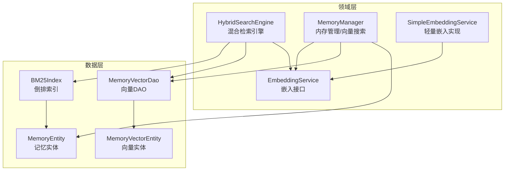
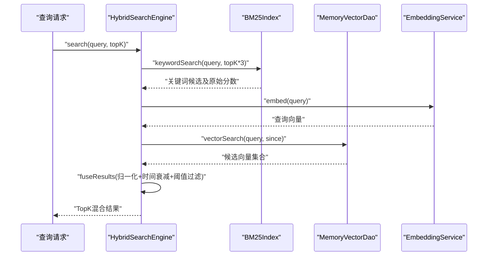
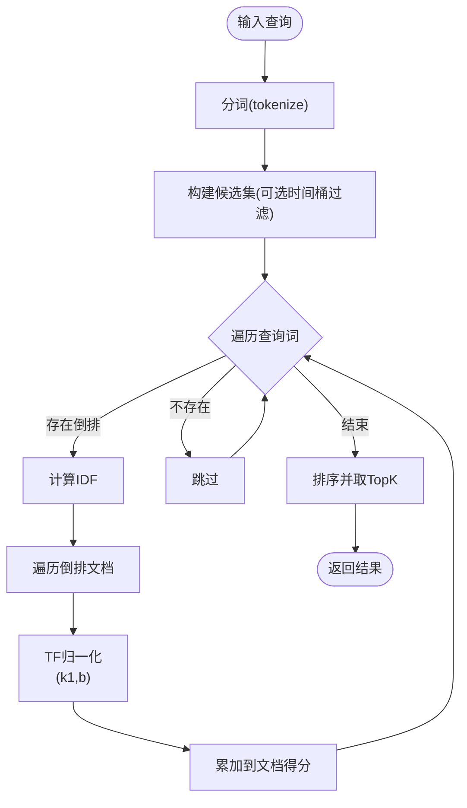
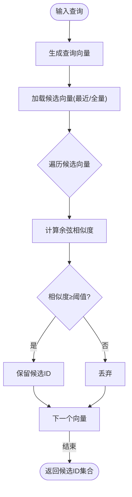
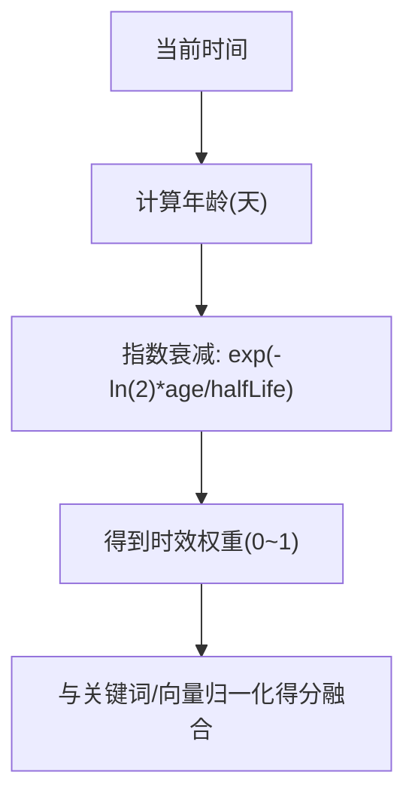
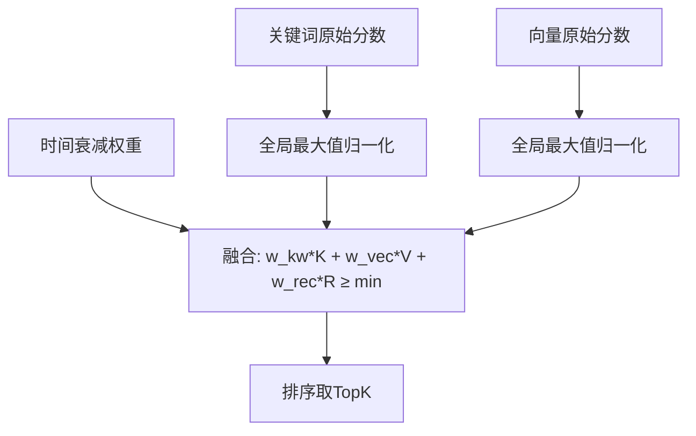
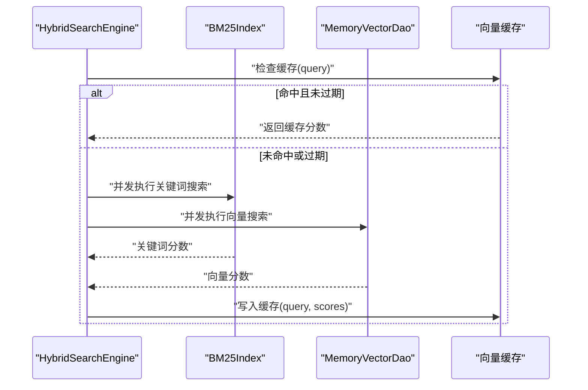
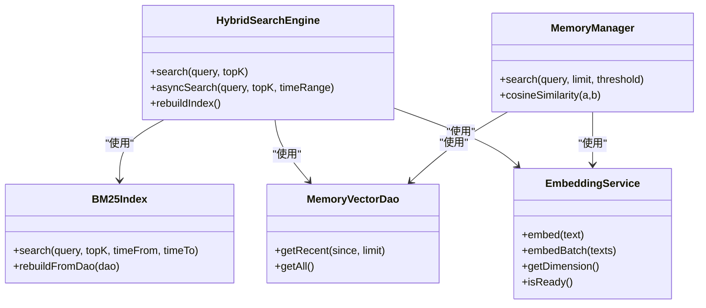

# 混合检索引擎

<cite>
**本文引用的文件**
- [HybridSearchEngine.kt](file://app/src/main/java/ai/openclaw/android/domain/memory/HybridSearchEngine.kt)
- [BM25Index.kt](file://app/src/main/java/ai/openclaw/android/data/local/BM25Index.kt)
- [MemoryVectorDao.kt](file://app/src/main/java/ai/openclaw/android/data/local/MemoryVectorDao.kt)
- [MemoryEntity.kt](file://app/src/main/java/ai/openclaw/android/data/model/MemoryEntity.kt)
- [MemoryVectorEntity.kt](file://app/src/main/java/ai/openclaw/android/data/model/MemoryVectorEntity.kt)
- [MemoryManager.kt](file://app/src/main/java/ai/openclaw/android/domain/memory/MemoryManager.kt)
- [EmbeddingService.kt](file://app/src/main/java/ai/openclaw/android/domain/memory/EmbeddingService.kt)
- [SimpleEmbeddingService.kt](file://app/src/main/java/ai/openclaw/android/ml/SimpleEmbeddingService.kt)
- [VectorSearchTest.kt](file://app/src/test/java/ai/openclaw/android/domain/memory/VectorSearchTest.kt)
- [ImportanceCalculator.kt](file://app/src/main/java/ai/openclaw/android/personalcenter/ImportanceCalculator.kt)
</cite>

## 目录
1. [简介](#简介)
2. [项目结构](#项目结构)
3. [核心组件](#核心组件)
4. [架构总览](#架构总览)
5. [组件详解](#组件详解)
6. [依赖关系分析](#依赖关系分析)
7. [性能与优化](#性能与优化)
8. [故障排查](#故障排查)
9. [结论](#结论)
10. [附录：配置与调优指南](#附录配置与调优指南)

## 简介
本文件面向混合检索引擎，系统性阐述以下能力与实现细节：
- 全文检索：基于BM25的关键词匹配与评分
- 语义检索：基于向量余弦相似度的语义匹配
- 时间衰减：基于指数衰减的时效性加权
- 混合融合：加权融合三路信号并进行阈值过滤
- 性能优化：并发执行、缓存、索引重建与批量处理
- 结果后处理：去重与排序
- 配置与调优：参数含义、权重分配、阈值设定与实践建议

## 项目结构
混合检索引擎位于领域层与数据层之间，围绕“混合检索”核心类组织，配合本地倒排索引、向量DAO与嵌入服务协同工作。

图示来源
- [HybridSearchEngine.kt:18-23](file://app/src/main/java/ai/openclaw/android/domain/memory/HybridSearchEngine.kt#L18-L23)
- [BM25Index.kt:14-17](file://app/src/main/java/ai/openclaw/android/data/local/BM25Index.kt#L14-L17)
- [MemoryVectorDao.kt:9-25](file://app/src/main/java/ai/openclaw/android/data/local/MemoryVectorDao.kt#L9-L25)
- [MemoryEntity.kt:6-18](file://app/src/main/java/ai/openclaw/android/data/model/MemoryEntity.kt#L6-L18)
- [MemoryVectorEntity.kt:6-11](file://app/src/main/java/ai/openclaw/android/data/model/MemoryVectorEntity.kt#L6-L11)
- [MemoryManager.kt:10-15](file://app/src/main/java/ai/openclaw/android/domain/memory/MemoryManager.kt#L10-L15)
- [EmbeddingService.kt:3-8](file://app/src/main/java/ai/openclaw/android/domain/memory/EmbeddingService.kt#L3-L8)
- [SimpleEmbeddingService.kt:19-26](file://app/src/main/java/ai/openclaw/android/ml/SimpleEmbeddingService.kt#L19-L26)

章节来源
- [HybridSearchEngine.kt:1-227](file://app/src/main/java/ai/openclaw/android/domain/memory/HybridSearchEngine.kt#L1-L227)
- [BM25Index.kt:1-203](file://app/src/main/java/ai/openclaw/android/data/local/BM25Index.kt#L1-L203)
- [MemoryVectorDao.kt:1-26](file://app/src/main/java/ai/openclaw/android/data/local/MemoryVectorDao.kt#L1-L26)
- [MemoryEntity.kt:1-19](file://app/src/main/java/ai/openclaw/android/data/model/MemoryEntity.kt#L1-L19)
- [MemoryVectorEntity.kt:1-19](file://app/src/main/java/ai/openclaw/android/data/model/MemoryVectorEntity.kt#L1-L19)
- [MemoryManager.kt:1-116](file://app/src/main/java/ai/openclaw/android/domain/memory/MemoryManager.kt#L1-L116)
- [EmbeddingService.kt:1-8](file://app/src/main/java/ai/openclaw/android/domain/memory/EmbeddingService.kt#L1-L8)
- [SimpleEmbeddingService.kt:1-107](file://app/src/main/java/ai/openclaw/android/ml/SimpleEmbeddingService.kt#L1-L107)

## 核心组件
- 混合检索引擎：负责并发执行关键词与向量两条召回路径，归一化评分并融合时间衰减，输出TopK结果。
- BM25倒排索引：维护词项到文档的倒排映射、文档长度统计与日粒度时间桶，支持快速检索与范围过滤。
- 向量DAO：提供最近向量与全量向量查询接口，支撑向量召回。
- 嵌入服务：抽象统一的向量生成接口，支持真实模型与轻量回退方案。
- 内存管理器：提供纯向量相似度搜索、余弦相似度计算与批量清理等能力。

章节来源
- [HybridSearchEngine.kt:18-23](file://app/src/main/java/ai/openclaw/android/domain/memory/HybridSearchEngine.kt#L18-L23)
- [BM25Index.kt:14-17](file://app/src/main/java/ai/openclaw/android/data/local/BM25Index.kt#L14-L17)
- [MemoryVectorDao.kt:9-25](file://app/src/main/java/ai/openclaw/android/data/local/MemoryVectorDao.kt#L9-L25)
- [EmbeddingService.kt:3-8](file://app/src/main/java/ai/openclaw/android/domain/memory/EmbeddingService.kt#L3-L8)
- [MemoryManager.kt:10-15](file://app/src/main/java/ai/openclaw/android/domain/memory/MemoryManager.kt#L10-L15)

## 架构总览
混合检索采用“双路径召回 + 多因子融合”的架构模式：
- 召回路径A：BM25关键词匹配，返回候选集
- 召回路径B：向量相似度匹配，返回候选集
- 融合阶段：对两条路径的得分进行归一化，叠加时间衰减因子，按阈值过滤后排序

图示来源
- [HybridSearchEngine.kt:173-219](file://app/src/main/java/ai/openclaw/android/domain/memory/HybridSearchEngine.kt#L173-L219)
- [BM25Index.kt:137-178](file://app/src/main/java/ai/openclaw/android/data/local/BM25Index.kt#L137-L178)
- [MemoryVectorDao.kt:17-24](file://app/src/main/java/ai/openclaw/android/data/local/MemoryVectorDao.kt#L17-L24)
- [EmbeddingService.kt:3-8](file://app/src/main/java/ai/openclaw/android/domain/memory/EmbeddingService.kt#L3-L8)

## 组件详解

### BM25全文检索
- 分词策略：中文按字符大二文组合并，英文转小写单词；兼顾中英混排场景
- 倒排结构：词项→文档ID列表（含词频），文档长度表，总文档数与平均长度
- 时间过滤：按天粒度时间桶快速筛选时间窗口内的候选
- 评分公式：标准BM25公式，包含IDF与TF-IDF归一化

图示来源
- [BM25Index.kt:47-86](file://app/src/main/java/ai/openclaw/android/data/local/BM25Index.kt#L47-L86)
- [BM25Index.kt:140-178](file://app/src/main/java/ai/openclaw/android/data/local/BM25Index.kt#L140-L178)

章节来源
- [BM25Index.kt:14-17](file://app/src/main/java/ai/openclaw/android/data/local/BM25Index.kt#L14-L17)
- [BM25Index.kt:47-86](file://app/src/main/java/ai/openclaw/android/data/local/BM25Index.kt#L47-L86)
- [BM25Index.kt:140-178](file://app/src/main/java/ai/openclaw/android/data/local/BM25Index.kt#L140-L178)

### 向量语义检索与相似度
- 相似度：余弦相似度，支持高维向量，具备方向不变性
- 召回策略：优先取最近N条向量，若为空则回退全量
- 阈值：过滤低相似度候选，减少无效计算

图示来源
- [HybridSearchEngine.kt:148-170](file://app/src/main/java/ai/openclaw/android/domain/memory/HybridSearchEngine.kt#L148-L170)
- [MemoryManager.kt:101-114](file://app/src/main/java/ai/openclaw/android/domain/memory/MemoryManager.kt#L101-L114)
- [MemoryVectorDao.kt:17-24](file://app/src/main/java/ai/openclaw/android/data/local/MemoryVectorDao.kt#L17-L24)

章节来源
- [MemoryManager.kt:101-114](file://app/src/main/java/ai/openclaw/android/domain/memory/MemoryManager.kt#L101-L114)
- [MemoryVectorDao.kt:17-24](file://app/src/main/java/ai/openclaw/android/data/local/MemoryVectorDao.kt#L17-L24)
- [VectorSearchTest.kt:19-85](file://app/src/test/java/ai/openclaw/android/domain/memory/VectorSearchTest.kt#L19-L85)

### 时间衰减机制
- 计算方式：以天为单位的指数衰减，半衰期固定
- 应用位置：融合阶段作为独立因子参与加权
- 影响：新近访问的记忆在最终排序中更占优

图示来源
- [HybridSearchEngine.kt:74-80](file://app/src/main/java/ai/openclaw/android/domain/memory/HybridSearchEngine.kt#L74-L80)
- [HybridSearchEngine.kt:108-109](file://app/src/main/java/ai/openclaw/android/domain/memory/HybridSearchEngine.kt#L108-L109)

章节来源
- [HybridSearchEngine.kt:25-34](file://app/src/main/java/ai/openclaw/android/domain/memory/HybridSearchEngine.kt#L25-L34)
- [HybridSearchEngine.kt:74-80](file://app/src/main/java/ai/openclaw/android/domain/memory/HybridSearchEngine.kt#L74-L80)
- [HybridSearchEngine.kt:108-109](file://app/src/main/java/ai/openclaw/android/domain/memory/HybridSearchEngine.kt#L108-L109)

### 混合权重与融合公式
- 权重构成：关键词权重 + 向量权重 + 时间权重（三者之和为1）
- 归一化策略：分别对关键词与向量得分做全局最大值归一
- 过滤策略：仅保留融合得分达到最小阈值的结果
- 输出：按融合得分降序，取TopK

图示来源
- [HybridSearchEngine.kt:83-135](file://app/src/main/java/ai/openclaw/android/domain/memory/HybridSearchEngine.kt#L83-L135)

章节来源
- [HybridSearchEngine.kt:26-29](file://app/src/main/java/ai/openclaw/android/domain/memory/HybridSearchEngine.kt#L26-L29)
- [HybridSearchEngine.kt:83-135](file://app/src/main/java/ai/openclaw/android/domain/memory/HybridSearchEngine.kt#L83-L135)

### 并发与缓存
- 并发执行：关键词与向量两条路径在不同调度器下并发运行，缩短端到端延迟
- 向量缓存：查询向量相似度结果按查询文本缓存，带TTL清理，降低重复查询开销

图示来源
- [HybridSearchEngine.kt:41-53](file://app/src/main/java/ai/openclaw/android/domain/memory/HybridSearchEngine.kt#L41-L53)
- [HybridSearchEngine.kt:208-212](file://app/src/main/java/ai/openclaw/android/domain/memory/HybridSearchEngine.kt#L208-L212)

章节来源
- [HybridSearchEngine.kt:37-39](file://app/src/main/java/ai/openclaw/android/domain/memory/HybridSearchEngine.kt#L37-L39)
- [HybridSearchEngine.kt:41-53](file://app/src/main/java/ai/openclaw/android/domain/memory/HybridSearchEngine.kt#L41-L53)
- [HybridSearchEngine.kt:208-212](file://app/src/main/java/ai/openclaw/android/domain/memory/HybridSearchEngine.kt#L208-L212)

### 结果后处理与去重
- 去重策略：候选ID集合由两个路径并集构成，天然避免重复
- 排序策略：按融合得分降序，取TopK
- 诊断信息：可选输出每条候选的原始与归一化得分明细

章节来源
- [HybridSearchEngine.kt:92-135](file://app/src/main/java/ai/openclaw/android/domain/memory/HybridSearchEngine.kt#L92-L135)
- [HybridSearchEngine.kt:63-72](file://app/src/main/java/ai/openclaw/android/domain/memory/HybridSearchEngine.kt#L63-L72)

## 依赖关系分析
- 混合检索引擎依赖：BM25索引、向量DAO、嵌入服务、记忆DAO
- 向量DAO依赖：Room实体（向量实体）
- 嵌入服务抽象：可插拔真实模型或轻量回退实现
- 内存管理器：提供纯向量搜索与余弦相似度工具

图示来源
- [HybridSearchEngine.kt:18-23](file://app/src/main/java/ai/openclaw/android/domain/memory/HybridSearchEngine.kt#L18-L23)
- [BM25Index.kt:14-17](file://app/src/main/java/ai/openclaw/android/data/local/BM25Index.kt#L14-L17)
- [MemoryVectorDao.kt:9-25](file://app/src/main/java/ai/openclaw/android/data/local/MemoryVectorDao.kt#L9-L25)
- [EmbeddingService.kt:3-8](file://app/src/main/java/ai/openclaw/android/domain/memory/EmbeddingService.kt#L3-L8)
- [MemoryManager.kt:10-15](file://app/src/main/java/ai/openclaw/android/domain/memory/MemoryManager.kt#L10-L15)

章节来源
- [HybridSearchEngine.kt:18-23](file://app/src/main/java/ai/openclaw/android/domain/memory/HybridSearchEngine.kt#L18-L23)
- [BM25Index.kt:14-17](file://app/src/main/java/ai/openclaw/android/data/local/BM25Index.kt#L14-L17)
- [MemoryVectorDao.kt:9-25](file://app/src/main/java/ai/openclaw/android/data/local/MemoryVectorDao.kt#L9-L25)
- [EmbeddingService.kt:3-8](file://app/src/main/java/ai/openclaw/android/domain/memory/EmbeddingService.kt#L3-L8)
- [MemoryManager.kt:10-15](file://app/src/main/java/ai/openclaw/android/domain/memory/MemoryManager.kt#L10-L15)

## 性能与优化
- 并发召回：关键词与向量路径并发执行，显著降低延迟
- 缓存策略：向量相似度结果按查询文本缓存，TTL控制内存占用
- 索引重建：支持从数据库批量重建BM25索引，保证检索准确性
- 时间窗口：BM25支持按天粒度时间桶快速裁剪候选，减少无效扫描
- 批量处理：向量DAO提供最近与全量两种查询，按场景选择
- 回退机制：嵌入服务不可用时使用轻量哈希回退，保障可用性

章节来源
- [HybridSearchEngine.kt:208-212](file://app/src/main/java/ai/openclaw/android/domain/memory/HybridSearchEngine.kt#L208-L212)
- [HybridSearchEngine.kt:41-53](file://app/src/main/java/ai/openclaw/android/domain/memory/HybridSearchEngine.kt#L41-L53)
- [BM25Index.kt:140-178](file://app/src/main/java/ai/openclaw/android/data/local/BM25Index.kt#L140-L178)
- [MemoryVectorDao.kt:17-24](file://app/src/main/java/ai/openclaw/android/data/local/MemoryVectorDao.kt#L17-L24)
- [SimpleEmbeddingService.kt:31-41](file://app/src/main/java/ai/openclaw/android/ml/SimpleEmbeddingService.kt#L31-L41)

## 故障排查
- 相似度异常
  - 症状：相似度为0或异常
  - 排查：确认向量维度一致、非零向量、余弦分母不为0
- 查询无结果
  - 症状：关键词/向量均无候选
  - 排查：检查索引是否重建、向量是否入库、时间窗口是否合理
- 性能抖动
  - 症状：偶发慢查询
  - 排查：观察缓存命中率、并发路径耗时、向量数量规模
- 权重失衡
  - 症状：关键词或向量主导排序
  - 排查：调整权重与阈值，核对归一化是否生效

章节来源
- [VectorSearchTest.kt:19-85](file://app/src/test/java/ai/openclaw/android/domain/memory/VectorSearchTest.kt#L19-L85)
- [MemoryManager.kt:101-114](file://app/src/main/java/ai/openclaw/android/domain/memory/MemoryManager.kt#L101-L114)
- [HybridSearchEngine.kt:173-219](file://app/src/main/java/ai/openclaw/android/domain/memory/HybridSearchEngine.kt#L173-L219)

## 结论
该混合检索引擎通过“BM25关键词 + 向量语义 + 时间衰减”的多因子融合，在准确性和实时性之间取得平衡。其设计具备良好的扩展性与可维护性，便于后续引入更复杂的语义模型与更精细的后处理策略。

## 附录：配置与调优指南
- BM25参数
  - k1/b：影响TF归一化程度，k1越大对高词频文档更敏感；b∈[0,1]控制长度归一化强度
  - 建议：先保持默认，结合召回覆盖率与准确率微调
- 向量相似度阈值
  - 建议：根据嵌入质量与业务需求设置，过高会漏召回，过低会引入噪声
- 权重分配
  - 关键词权重：强调事实性/精确性检索
  - 向量权重：强调语义一致性
  - 时间权重：强调时效性
  - 建议：以实验数据驱动，观察不同权重组合下的MRR/准确率曲线
- 时间窗口
  - 默认90天：兼顾历史覆盖与性能
  - 建议：针对不同任务动态调整时间范围
- 缓存与并发
  - 向量缓存TTL：根据查询频率与内存压力调整
  - 并发：默认已启用，确保IO密集型路径并行
- 索引与数据
  - 定期重建BM25索引，保证分词与统计最新
  - 控制向量数量规模，必要时按最近N条召回

章节来源
- [BM25Index.kt:14-17](file://app/src/main/java/ai/openclaw/android/data/local/BM25Index.kt#L14-L17)
- [HybridSearchEngine.kt:26-34](file://app/src/main/java/ai/openclaw/android/domain/memory/HybridSearchEngine.kt#L26-L34)
- [HybridSearchEngine.kt:173-219](file://app/src/main/java/ai/openclaw/android/domain/memory/HybridSearchEngine.kt#L173-L219)
- [SimpleEmbeddingService.kt:19-26](file://app/src/main/java/ai/openclaw/android/ml/SimpleEmbeddingService.kt#L19-L26)