# 内置技能

<cite>
**本文引用的文件**
- [WeatherSkill.kt](file://app/src/main/java/ai/openclaw/android/skill/builtin/WeatherSkill.kt)
- [TranslateSkill.kt](file://app/src/main/java/ai/openclaw/android/skill/builtin/TranslateSkill.kt)
- [ReminderSkill.kt](file://app/src/main/java/ai/openclaw/android/skill/builtin/ReminderSkill.kt)
- [CalendarSkill.kt](file://app/src/main/java/ai/openclaw/android/skill/builtin/CalendarSkill.kt)
- [ContactSkill.kt](file://app/src/main/java/ai/openclaw/android/skill/builtin/ContactSkill.kt)
- [SMSSkill.kt](file://app/src/main/java/ai/openclaw/android/skill/builtin/SMSSkill.kt)
- [AppLauncherSkill.kt](file://app/src/main/java/ai/openclaw/android/skill/builtin/AppLauncherSkill.kt)
- [SettingsSkill.kt](file://app/src/main/java/ai/openclaw/android/skill/builtin/SettingsSkill.kt)
- [FileSkill.kt](file://app/src/main/java/ai/openclaw/android/skill/builtin/FileSkill.kt)
- [LocationSkill.kt](file://app/src/main/java/ai/openclaw/android/skill/builtin/LocationSkill.kt)
- [MultiSearchSkill.kt](file://app/src/main/java/ai/openclaw/android/skill/builtin/MultiSearchSkill.kt)
- [NotificationSkill.kt](file://app/src/main/java/ai/openclaw/android/skill/builtin/NotificationSkill.kt)
- [ScriptSkill.kt](file://app/src/main/java/ai/openclaw/android/skill/builtin/ScriptSkill.kt)
- [GenerateSkillSkill.kt](file://app/src/main/java/ai/openclaw/android/skill/builtin/GenerateSkillSkill.kt)
- [GenerateSkillTool.kt](file://app/src/main/java/ai/openclaw/android/skill/builtin/GenerateSkillTool.kt)
- [Skill.kt](file://app/src/main/java/ai/openclaw/android/skill/Skill.kt)
- [SkillTool.kt](file://app/src/main/java/ai/openclaw/android/skill/SkillTool.kt)
- [SkillContext.kt](file://app/src/main/java/ai/openclaw/android/skill/SkillContext.kt)
- [DynamicSkillManager.kt](file://app/src/main/java/ai/openclaw/android/skill/DynamicSkillManager.kt)
- [ScriptOrchestrator.kt](file://script/src/main/java/ai/openclaw/script/ScriptOrchestrator.kt)
- [search.js](file://app/src/main/assets/scripts/search.js)
</cite>

## 目录
1. [简介](#简介)
2. [项目结构](#项目结构)
3. [核心组件](#核心组件)
4. [架构总览](#架构总览)
5. [详细组件分析](#详细组件分析)
6. [依赖关系分析](#依赖关系分析)
7. [性能考量](#性能考量)
8. [故障排查指南](#故障排查指南)
9. [结论](#结论)
10. [附录](#附录)

## 简介
本文件面向“内置技能”模块，系统梳理并说明12种内置技能的功能特性、实现原理与使用方法。技能按功能类别组织：
- 实用工具类：天气、翻译、提醒、多引擎搜索、通知管理
- 系统集成类：日历、联系人、短信
- 设备控制类：应用启动器、系统设置、文件读写、定位

文档同时解释技能间协作机制、工具调用流程、错误处理、性能优化与安全注意事项，并提供扩展与自定义开发指导。

## 项目结构
内置技能位于 app 模块的 skill/builtin 包下，每个技能以独立类实现，遵循统一的 Skill 接口规范；另有脚本执行与动态技能生成能力，位于同级包内。

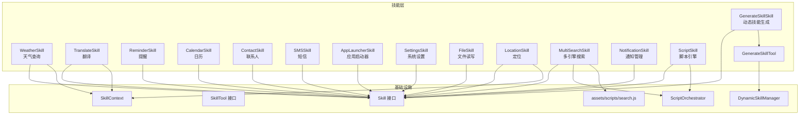

**图表来源**
- [Skill.kt](file://app/src/main/java/ai/openclaw/android/skill/Skill.kt)
- [SkillTool.kt](file://app/src/main/java/ai/openclaw/android/skill/SkillTool.kt)
- [SkillContext.kt](file://app/src/main/java/ai/openclaw/android/skill/SkillContext.kt)
- [DynamicSkillManager.kt](file://app/src/main/java/ai/openclaw/android/skill/DynamicSkillManager.kt)
- [ScriptOrchestrator.kt](file://script/src/main/java/ai/openclaw/script/ScriptOrchestrator.kt)
- [search.js](file://app/src/main/assets/scripts/search.js)

**章节来源**
- [Skill.kt](file://app/src/main/java/ai/openclaw/android/skill/Skill.kt)
- [SkillTool.kt](file://app/src/main/java/ai/openclaw/android/skill/SkillTool.kt)
- [SkillContext.kt](file://app/src/main/java/ai/openclaw/android/skill/SkillContext.kt)

## 核心组件
- Skill 接口：定义技能标识、名称、描述、版本、指令说明、工具集合、生命周期（initialize/cleanup）等。
- SkillTool 接口：定义工具名称、描述、参数Schema、异步执行方法 execute。
- SkillContext：提供应用上下文、HTTP 客户端等共享资源，用于技能初始化。
- DynamicSkillManager：动态技能注册与管理。
- ScriptOrchestrator：JS 脚本执行编排器，配合 ScriptSkill 提供扩展能力。

**章节来源**
- [Skill.kt](file://app/src/main/java/ai/openclaw/android/skill/Skill.kt)
- [SkillTool.kt](file://app/src/main/java/ai/openclaw/android/skill/SkillTool.kt)
- [SkillContext.kt](file://app/src/main/java/ai/openclaw/android/skill/SkillContext.kt)
- [DynamicSkillManager.kt](file://app/src/main/java/ai/openclaw/android/skill/DynamicSkillManager.kt)
- [ScriptOrchestrator.kt](file://script/src/main/java/ai/openclaw/script/ScriptOrchestrator.kt)

## 架构总览
内置技能采用“技能-工具”两级抽象：每个技能包含若干工具，工具通过参数Schema声明输入，执行后返回结构化结果（含 A2UI 卡片）。

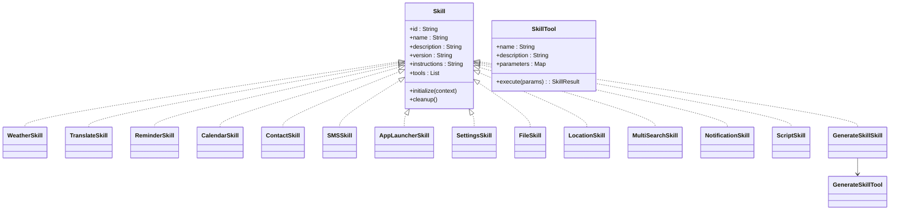

**图表来源**
- [Skill.kt](file://app/src/main/java/ai/openclaw/android/skill/Skill.kt)
- [SkillTool.kt](file://app/src/main/java/ai/openclaw/android/skill/SkillTool.kt)
- [WeatherSkill.kt](file://app/src/main/java/ai/openclaw/android/skill/builtin/WeatherSkill.kt)
- [TranslateSkill.kt](file://app/src/main/java/ai/openclaw/android/skill/builtin/TranslateSkill.kt)
- [ReminderSkill.kt](file://app/src/main/java/ai/openclaw/android/skill/builtin/ReminderSkill.kt)
- [CalendarSkill.kt](file://app/src/main/java/ai/openclaw/android/skill/builtin/CalendarSkill.kt)
- [ContactSkill.kt](file://app/src/main/java/ai/openclaw/android/skill/builtin/ContactSkill.kt)
- [SMSSkill.kt](file://app/src/main/java/ai/openclaw/android/skill/builtin/SMSSkill.kt)
- [AppLauncherSkill.kt](file://app/src/main/java/ai/openclaw/android/skill/builtin/AppLauncherSkill.kt)
- [SettingsSkill.kt](file://app/src/main/java/ai/openclaw/android/skill/builtin/SettingsSkill.kt)
- [FileSkill.kt](file://app/src/main/java/ai/openclaw/android/skill/builtin/FileSkill.kt)
- [LocationSkill.kt](file://app/src/main/java/ai/openclaw/android/skill/builtin/LocationSkill.kt)
- [MultiSearchSkill.kt](file://app/src/main/java/ai/openclaw/android/skill/builtin/MultiSearchSkill.kt)
- [NotificationSkill.kt](file://app/src/main/java/ai/openclaw/android/skill/builtin/NotificationSkill.kt)
- [ScriptSkill.kt](file://app/src/main/java/ai/openclaw/android/skill/builtin/ScriptSkill.kt)
- [GenerateSkillSkill.kt](file://app/src/main/java/ai/openclaw/android/skill/builtin/GenerateSkillSkill.kt)
- [GenerateSkillTool.kt](file://app/src/main/java/ai/openclaw/android/skill/builtin/GenerateSkillTool.kt)

## 详细组件分析

### 实用工具类

#### 天气查询（WeatherSkill）
- 功能概述
  - 查询当前天气与天气预报，支持中文城市名与英文城市名。
  - 数据源优先使用 wttr.in，失败时回退至 Open-Meteo。
  - 输出结构化 A2UI 卡片，包含天气条件、温度、体感、湿度、风力、预警与动作按钮。
- 工具与参数
  - 工具名：get_weather
  - 必填参数：location（位置名称）
  - 可选参数：无
- 执行流程
  - 校验参数与HTTP客户端
  - 先尝试 wttr.in，解析格式化文本，构建 v2 卡片
  - 若失败，回退 Open-Meteo，解析 JSON，构建 v2 卡片
- 错误处理
  - 缺少参数、网络异常、解析失败、坐标解析失败均返回明确错误信息
- 性能与安全
  - 依赖 OkHttp 客户端；注意网络超时与重试策略
  - 无敏感权限
- 使用示例
  - “查询北京天气”
  - “查询西安明天天气”

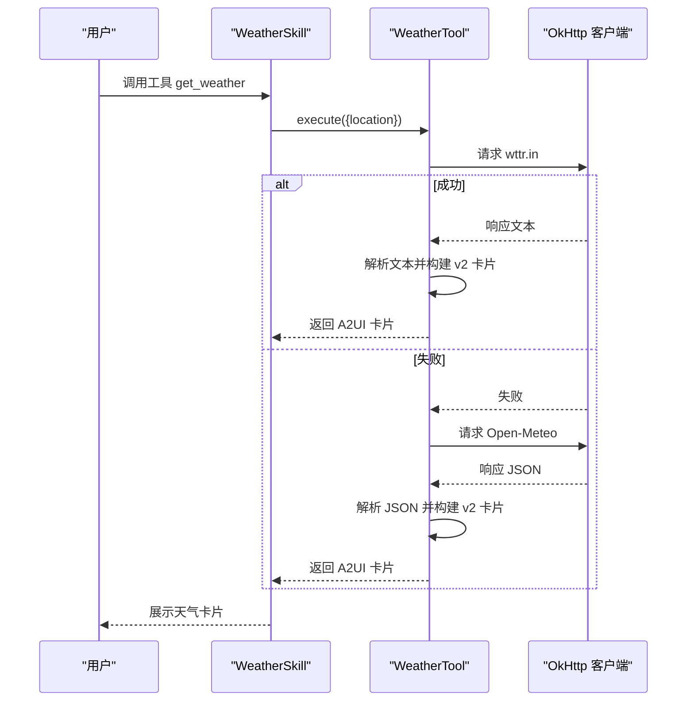

**图表来源**
- [WeatherSkill.kt](file://app/src/main/java/ai/openclaw/android/skill/builtin/WeatherSkill.kt)

**章节来源**
- [WeatherSkill.kt](file://app/src/main/java/ai/openclaw/android/skill/builtin/WeatherSkill.kt)

#### 翻译（TranslateSkill）
- 功能概述
  - 使用 MyMemory API 进行多语言翻译，支持自动语言检测
  - 输出结构化 A2UI 翻译卡片，包含原文、译文、语言对与动作
- 工具与参数
  - 工具名：translate
  - 必填参数：text、target_lang
  - 可选参数：source_lang（默认 auto）
- 执行流程
  - 校验参数与HTTP客户端
  - 构造请求，解析响应，构建 v2 翻译卡片
- 错误处理
  - 缺少参数、HTTP 错误、响应解析失败
- 性能与安全
  - 无敏感权限
- 使用示例
  - “把这段话翻译成英语”
  - “翻译成中文”

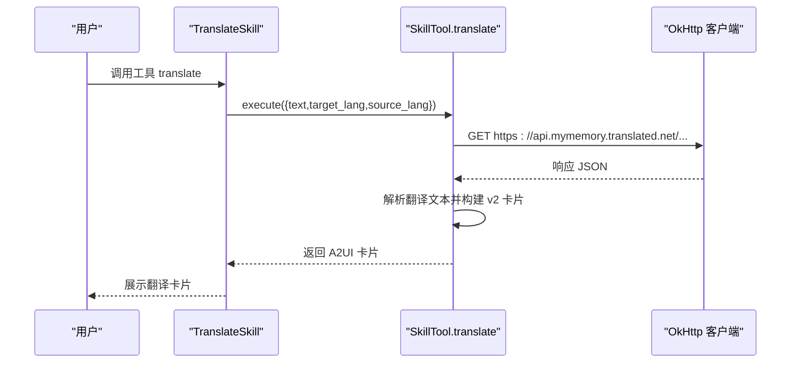

**图表来源**
- [TranslateSkill.kt](file://app/src/main/java/ai/openclaw/android/skill/builtin/TranslateSkill.kt)

**章节来源**
- [TranslateSkill.kt](file://app/src/main/java/ai/openclaw/android/skill/builtin/TranslateSkill.kt)

#### 提醒（ReminderSkill）
- 功能概述
  - 设置定时提醒，支持相对时间与绝对时间
  - 列出待处理提醒、取消提醒
  - 输出结构化 A2UI 提醒卡片（确认、列表）
- 工具与参数
  - set_reminder：title、time（相对/绝对）、message
  - list_reminders：无
  - cancel_reminder：id
- 执行流程
  - set_reminder：解析时间、调度 AlarmManager、持久化到内存映射
  - list_reminders：过滤未过期提醒并排序
  - cancel_reminder：移除 Alarm 与内存映射
- 错误处理
  - 时间格式解析失败、权限不足（精确闹钟）
- 性能与安全
  - 使用 AlarmManager 精确/近似调度；Android 13+ 需要精确闹钟权限
- 使用示例
  - “明天上午十点提醒我开会”
  - “半小时后提醒我喝水”

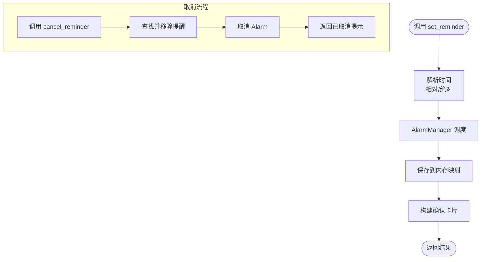

**图表来源**
- [ReminderSkill.kt](file://app/src/main/java/ai/openclaw/android/skill/builtin/ReminderSkill.kt)

**章节来源**
- [ReminderSkill.kt](file://app/src/main/java/ai/openclaw/android/skill/builtin/ReminderSkill.kt)

#### 多引擎搜索（MultiSearchSkill）
- 功能概述
  - 使用 SearXNG 搜索互联网信息，无需 API Key
  - 通过 ScriptOrchestrator 执行 search.js，解析 JS 返回的 JSON，构造文本摘要与 A2UI 卡片
- 工具与参数
  - 工具名：search
  - 必填参数：query
- 执行流程
  - 初始化 ScriptOrchestrator 与脚本内容
  - 注入查询变量，执行脚本
  - 解析结果并构建卡片
- 错误处理
  - 脚本未初始化、脚本执行失败、JSON 解析失败
- 性能与安全
  - 脚本沙箱限制、超时与大小限制
- 使用示例
  - “搜索 Kotlin 学习资料”

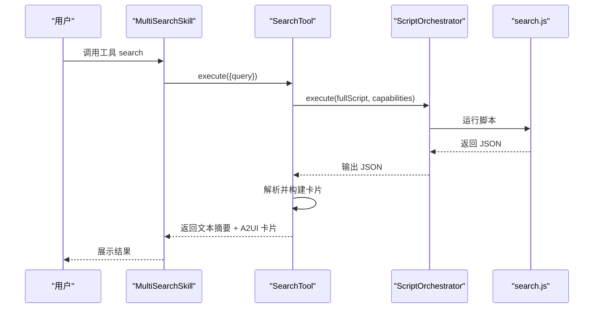

**图表来源**
- [MultiSearchSkill.kt](file://app/src/main/java/ai/openclaw/android/skill/builtin/MultiSearchSkill.kt)
- [ScriptOrchestrator.kt](file://script/src/main/java/ai/openclaw/script/ScriptOrchestrator.kt)
- [search.js](file://app/src/main/assets/scripts/search.js)

**章节来源**
- [MultiSearchSkill.kt](file://app/src/main/java/ai/openclaw/android/skill/builtin/MultiSearchSkill.kt)

#### 通知管理（NotificationSkill）
- 功能概述
  - 获取通知列表、发送本地通知、删除通知、清空通知、标记已读
  - 输出结构化文本或卡片
- 工具与参数
  - list_notifications：packageName、limit、includeRead
  - send_notification：title、text、importance
  - delete_notification：notificationId
  - clear_notifications：packageName（可选）
  - mark_notification_read：notificationId
- 执行流程
  - 通过 SmartNotificationListener 获取系统通知
  - 发送通知使用 NotificationManager 与 NotificationChannel
  - 删除/清空/标记已读分别更新系统与内存状态
- 错误处理
  - 权限不足、通知 ID 无效
- 性能与安全
  - 本地通知，无网络依赖
- 使用示例
  - “列出微信通知”
  - “发送一条高优先级通知”

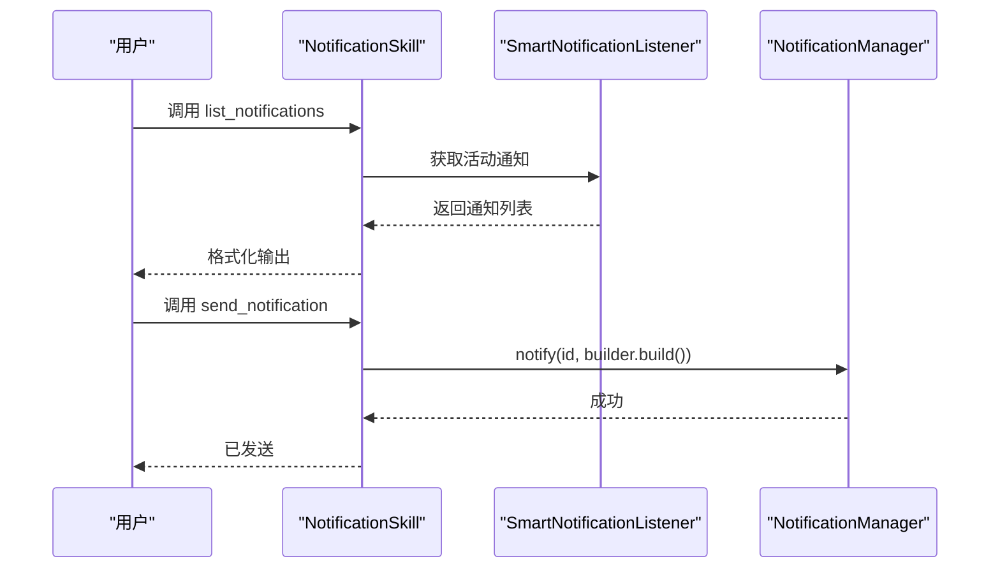

**图表来源**
- [NotificationSkill.kt](file://app/src/main/java/ai/openclaw/android/skill/builtin/NotificationSkill.kt)

**章节来源**
- [NotificationSkill.kt](file://app/src/main/java/ai/openclaw/android/skill/builtin/NotificationSkill.kt)

### 系统集成类

#### 日历（CalendarSkill）
- 功能概述
  - 列出未来 N 天的日程事件
  - 添加日历事件（标题、起止时间、描述）
- 工具与参数
  - list_events：days（默认7）
  - add_event：title、start_time、end_time、description（可选）
- 执行流程
  - 查询 ContentResolver，过滤时间范围
  - 插入事件到 CalendarContract.Events
- 错误处理
  - 缺少权限、时间格式解析失败
- 性能与安全
  - 需要日历权限
- 使用示例
  - “列出未来7天的日程”
  - “添加会议事件”

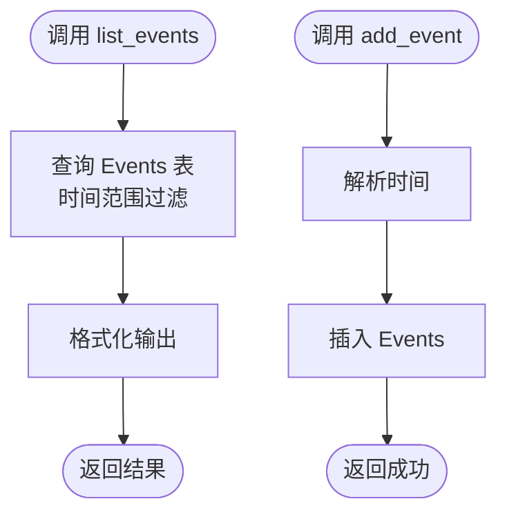

**图表来源**
- [CalendarSkill.kt](file://app/src/main/java/ai/openclaw/android/skill/builtin/CalendarSkill.kt)

**章节来源**
- [CalendarSkill.kt](file://app/src/main/java/ai/openclaw/android/skill/builtin/CalendarSkill.kt)

#### 通讯录（ContactSkill）
- 功能概述
  - 搜索联系人、获取联系人详情、拨打电话
- 工具与参数
  - search_contacts：query
  - get_contact：name
  - call_contact：phone_number 或 contact_name（二选一）
- 执行流程
  - 搜索与查询通过 ContactsContract
  - 拨打电话使用 Intent.ACTION_DIAL
- 错误处理
  - 缺少权限、未找到联系人
- 性能与安全
  - 需要通讯录权限
- 使用示例
  - “搜索张三”
  - “拨打李四的电话”

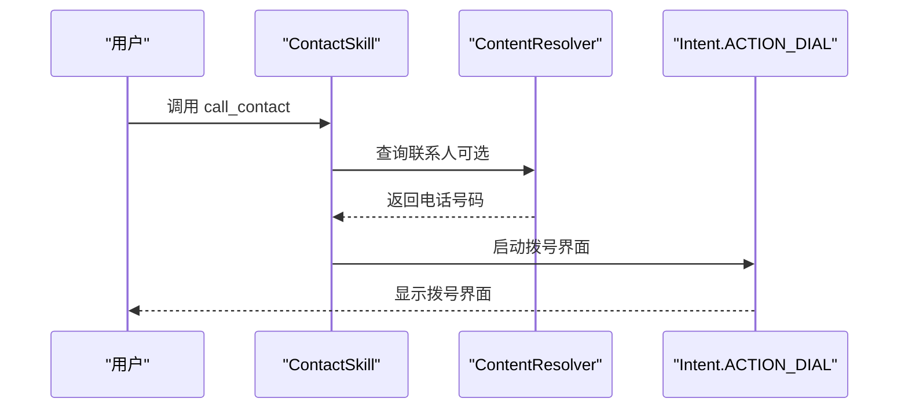

**图表来源**
- [ContactSkill.kt](file://app/src/main/java/ai/openclaw/android/skill/builtin/ContactSkill.kt)

**章节来源**
- [ContactSkill.kt](file://app/src/main/java/ai/openclaw/android/skill/builtin/ContactSkill.kt)

#### 短信（SMSSkill）
- 功能概述
  - 发送短信、读取最近短信、统计未读短信数量
- 工具与参数
  - send_sms：phone_number、message
  - read_sms：limit（默认100）、from（可选）
  - get_unread_sms：无
- 执行流程
  - 发送使用 SmsManager
  - 读取使用 ContentResolver 查询 content://sms/inbox
- 错误处理
  - 缺少权限、发送失败
- 性能与安全
  - 需要短信权限；读取短信涉及隐私
- 使用示例
  - “发送短信给张三”
  - “读取最近20条短信”

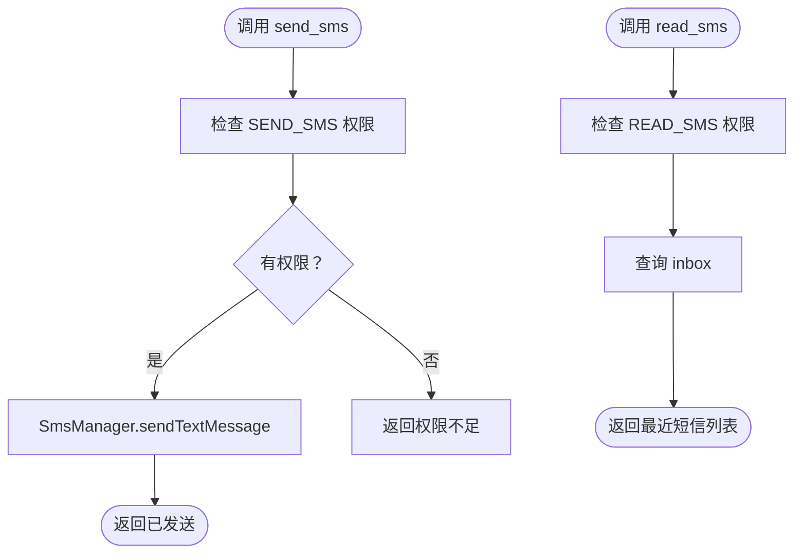

**图表来源**
- [SMSSkill.kt](file://app/src/main/java/ai/openclaw/android/skill/builtin/SMSSkill.kt)

**章节来源**
- [SMSSkill.kt](file://app/src/main/java/ai/openclaw/android/skill/builtin/SMSSkill.kt)

### 设备控制类

#### 应用启动器（AppLauncherSkill）
- 功能概述
  - 打开应用（按名称或包名）、列出已安装应用
- 工具与参数
  - open：app_name 或 package_name（二选一）
  - list_apps：filter（可选）
- 执行流程
  - 通过 PackageManager 查询可启动 Activity
  - 启动应用使用 Intent.FLAG_ACTIVITY_NEW_TASK
- 错误处理
  - 未找到应用、启动失败
- 性能与安全
  - 无敏感权限
- 使用示例
  - “打开微信”
  - “列出所有应用”

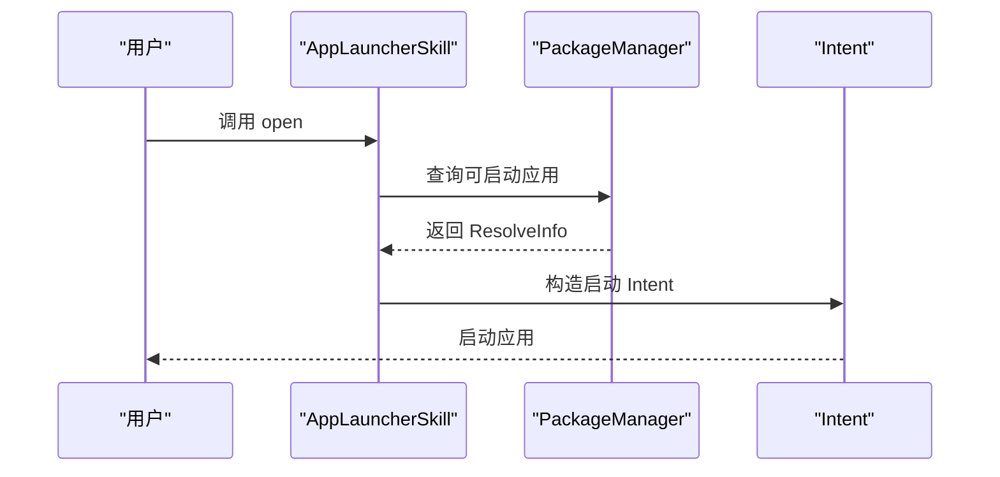

**图表来源**
- [AppLauncherSkill.kt](file://app/src/main/java/ai/openclaw/android/skill/builtin/AppLauncherSkill.kt)

**章节来源**
- [AppLauncherSkill.kt](file://app/src/main/java/ai/openclaw/android/skill/builtin/AppLauncherSkill.kt)

#### 系统设置（SettingsSkill）
- 功能概述
  - 打开系统设置页面（WiFi、蓝牙、声音、显示、关于、位置、存储、电池、开发者选项等）
  - 控制蓝牙开关（Android 13+ 退回设置页）
  - 控制音量（调高、调低、静音、设置具体音量）
- 工具与参数
  - open_settings：type（可选）
  - toggle_bluetooth：value（true/false）
  - volume：action（up/down/mute/unmute/set）、level（可选）、stream（可选）
- 执行流程
  - 打开设置：Intent ACTION_* 分支
  - 蓝牙：Android 13+ 无法直接切换，退回设置页
  - 音量：AudioManager 调整音量流
- 错误处理
  - 设备不支持蓝牙、权限不足、操作失败
- 性能与安全
  - 无敏感权限
- 使用示例
  - “打开 WiFi 设置”
  - “关闭蓝牙”
  - “调高媒体音量”

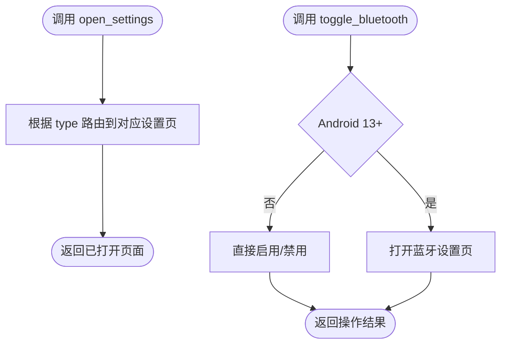

**图表来源**
- [SettingsSkill.kt](file://app/src/main/java/ai/openclaw/android/skill/builtin/SettingsSkill.kt)

**章节来源**
- [SettingsSkill.kt](file://app/src/main/java/ai/openclaw/android/skill/builtin/SettingsSkill.kt)

#### 文件读写（FileSkill）
- 功能概述
  - 在 Android 10+ Scoped Storage 兼容下进行文件读写
  - 支持外部专属目录与内部专属目录
  - 路径规则：~、~/internal、相对路径、/sdcard 重定向
- 工具与参数
  - read_file：path、max_chars（默认50000）
  - write_file：path、content、append（默认false）
  - list_dir：path（默认 ~）
- 执行流程
  - 路径解析到 externalRoot/internalRoot
  - 读取限制 500KB；写入自动创建父目录
- 错误处理
  - 权限不足、文件不存在、过大、IO 异常
- 性能与安全
  - 仅限文本文件；限制单次读取大小；避免二进制
- 使用示例
  - “读取 ~/notes.txt”
  - “写入 ~/config.json 内容”
  - “列出 ~ 目录”

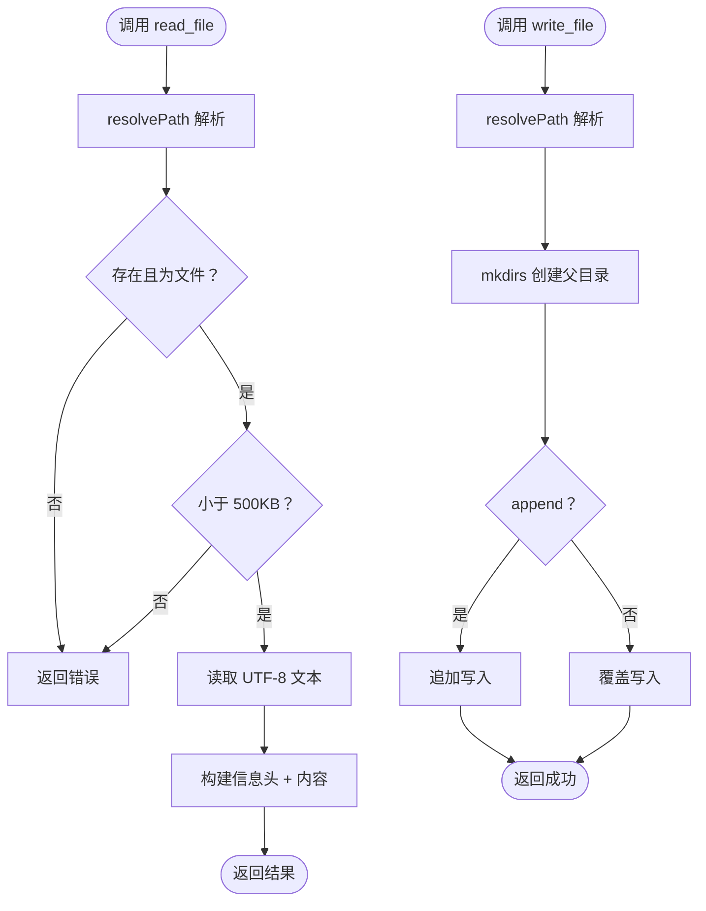

**图表来源**
- [FileSkill.kt](file://app/src/main/java/ai/openclaw/android/skill/builtin/FileSkill.kt)

**章节来源**
- [FileSkill.kt](file://app/src/main/java/ai/openclaw/android/skill/builtin/FileSkill.kt)

#### 定位（LocationSkill）
- 功能概述
  - 获取当前 GPS 位置、逆地理编码地址、搜索附近地点
- 工具与参数
  - get_location：无
  - get_address：latitude、longitude
  - search_places：query、latitude（可选）、longitude（可选）、radius（默认1000）
- 执行流程
  - 位置：LocationManager 请求更新，优先 GPS，超时回退
  - 地址：Nominatim 逆地理编码
  - 地点：Nominatim 搜索（简化版）
- 错误处理
  - 无权限、无法获取位置、HTTP 错误、解析失败
- 性能与安全
  - 需要位置权限；GPS 与网络 Provider 配合
- 使用示例
  - “获取我的位置”
  - “把坐标转换为地址”
  - “搜索附近的餐厅”

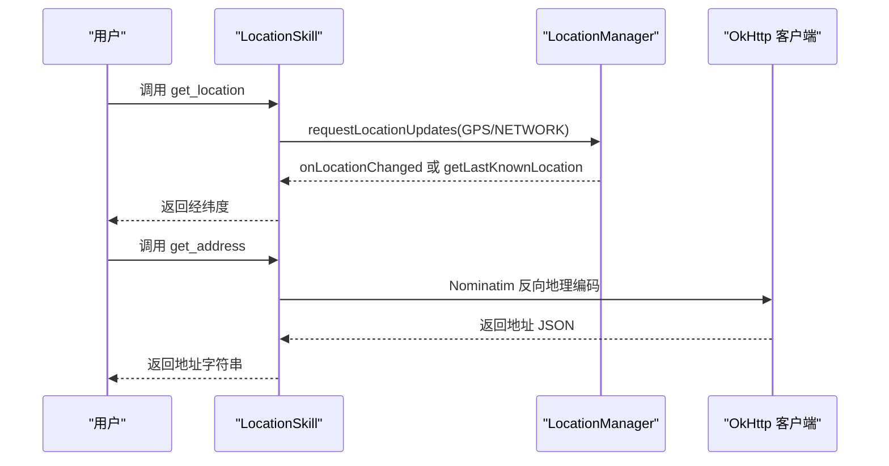

**图表来源**
- [LocationSkill.kt](file://app/src/main/java/ai/openclaw/android/skill/builtin/LocationSkill.kt)

**章节来源**
- [LocationSkill.kt](file://app/src/main/java/ai/openclaw/android/skill/builtin/LocationSkill.kt)

### 脚本与动态技能

#### 脚本引擎（ScriptSkill）
- 功能概述
  - 执行 JS 脚本，提供 fs、http、memory 等能力桥接
  - 限制：禁止 import/require/eval，沙箱目录、大小与超时限制
- 工具与参数
  - execute_script：script、capabilities（默认 fs,http）
- 执行流程
  - 构建 MemoryBridge（可选）
  - 调用 ScriptOrchestrator 执行脚本
- 错误处理
  - 未初始化、脚本执行失败、参数缺失
- 性能与安全
  - 沙箱限制、超时保护
- 使用示例
  - “执行一段 JS 脚本，读取文件并发起 HTTP 请求”

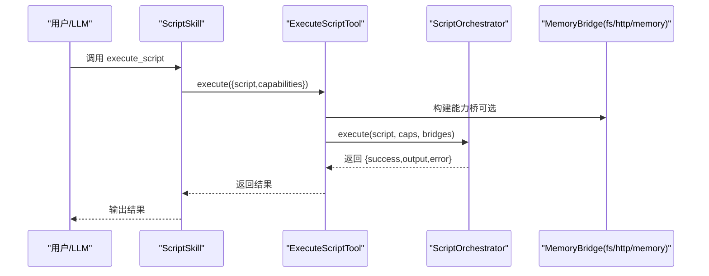

**图表来源**
- [ScriptSkill.kt](file://app/src/main/java/ai/openclaw/android/skill/builtin/ScriptSkill.kt)
- [ScriptOrchestrator.kt](file://script/src/main/java/ai/openclaw/script/ScriptOrchestrator.kt)

**章节来源**
- [ScriptSkill.kt](file://app/src/main/java/ai/openclaw/android/skill/builtin/ScriptSkill.kt)

#### 动态技能生成（GenerateSkillSkill + GenerateSkillTool）
- 功能概述
  - 通过 JSON 定义生成并注册新的动态技能
  - 要求字段：id、name、description、version、instructions、script、tools
- 工具与参数
  - generate_skill：skillJson（完整技能定义 JSON）
- 执行流程
  - 校验参数
  - 交由 DynamicSkillManager 注册
- 错误处理
  - JSON 为空、注册失败
- 性能与安全
  - 通过 DynamicSkillManager 管控注册流程
- 使用示例
  - “生成一个天气技能，包含 get_weather 工具”

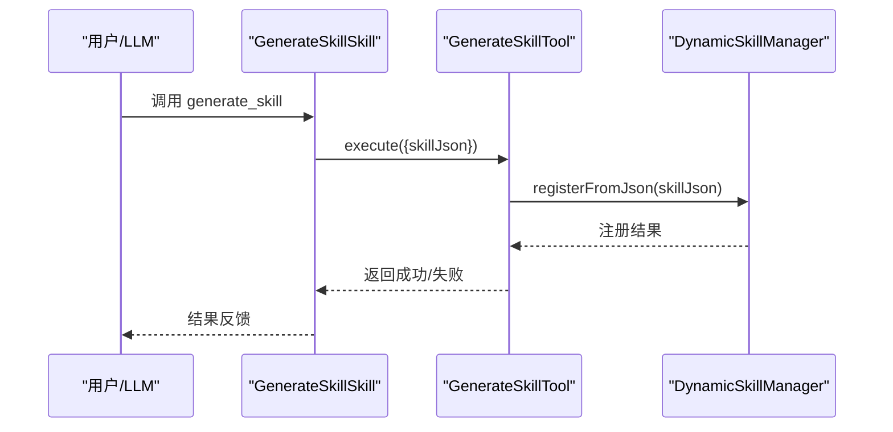

**图表来源**
- [GenerateSkillSkill.kt](file://app/src/main/java/ai/openclaw/android/skill/builtin/GenerateSkillSkill.kt)
- [GenerateSkillTool.kt](file://app/src/main/java/ai/openclaw/android/skill/builtin/GenerateSkillTool.kt)
- [DynamicSkillManager.kt](file://app/src/main/java/ai/openclaw/android/skill/DynamicSkillManager.kt)

**章节来源**
- [GenerateSkillSkill.kt](file://app/src/main/java/ai/openclaw/android/skill/builtin/GenerateSkillSkill.kt)
- [GenerateSkillTool.kt](file://app/src/main/java/ai/openclaw/android/skill/builtin/GenerateSkillTool.kt)

## 依赖关系分析

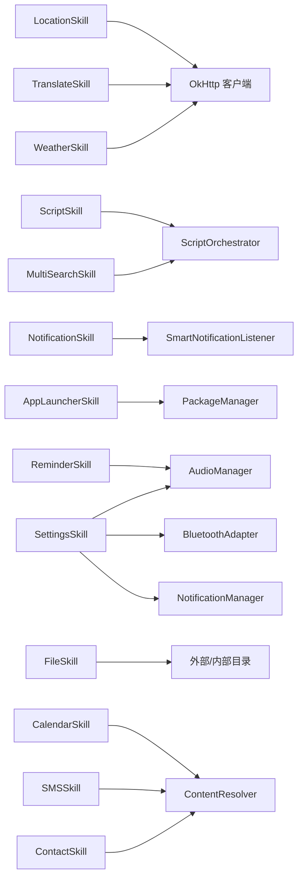

**图表来源**
- [WeatherSkill.kt](file://app/src/main/java/ai/openclaw/android/skill/builtin/WeatherSkill.kt)
- [TranslateSkill.kt](file://app/src/main/java/ai/openclaw/android/skill/builtin/TranslateSkill.kt)
- [LocationSkill.kt](file://app/src/main/java/ai/openclaw/android/skill/builtin/LocationSkill.kt)
- [MultiSearchSkill.kt](file://app/src/main/java/ai/openclaw/android/skill/builtin/MultiSearchSkill.kt)
- [ScriptSkill.kt](file://app/src/main/java/ai/openclaw/android/skill/builtin/ScriptSkill.kt)
- [NotificationSkill.kt](file://app/src/main/java/ai/openclaw/android/skill/builtin/NotificationSkill.kt)
- [ReminderSkill.kt](file://app/src/main/java/ai/openclaw/android/skill/builtin/ReminderSkill.kt)
- [AppLauncherSkill.kt](file://app/src/main/java/ai/openclaw/android/skill/builtin/AppLauncherSkill.kt)
- [SettingsSkill.kt](file://app/src/main/java/ai/openclaw/android/skill/builtin/SettingsSkill.kt)
- [FileSkill.kt](file://app/src/main/java/ai/openclaw/android/skill/builtin/FileSkill.kt)
- [ContactSkill.kt](file://app/src/main/java/ai/openclaw/android/skill/builtin/ContactSkill.kt)
- [SMSSkill.kt](file://app/src/main/java/ai/openclaw/android/skill/builtin/SMSSkill.kt)
- [CalendarSkill.kt](file://app/src/main/java/ai/openclaw/android/skill/builtin/CalendarSkill.kt)

**章节来源**
- [WeatherSkill.kt](file://app/src/main/java/ai/openclaw/android/skill/builtin/WeatherSkill.kt)
- [TranslateSkill.kt](file://app/src/main/java/ai/openclaw/android/skill/builtin/TranslateSkill.kt)
- [LocationSkill.kt](file://app/src/main/java/ai/openclaw/android/skill/builtin/LocationSkill.kt)
- [MultiSearchSkill.kt](file://app/src/main/java/ai/openclaw/android/skill/builtin/MultiSearchSkill.kt)
- [ScriptSkill.kt](file://app/src/main/java/ai/openclaw/android/skill/builtin/ScriptSkill.kt)
- [NotificationSkill.kt](file://app/src/main/java/ai/openclaw/android/skill/builtin/NotificationSkill.kt)
- [ReminderSkill.kt](file://app/src/main/java/ai/openclaw/android/skill/builtin/ReminderSkill.kt)
- [AppLauncherSkill.kt](file://app/src/main/java/ai/openclaw/android/skill/builtin/AppLauncherSkill.kt)
- [SettingsSkill.kt](file://app/src/main/java/ai/openclaw/android/skill/builtin/SettingsSkill.kt)
- [FileSkill.kt](file://app/src/main/java/ai/openclaw/android/skill/builtin/FileSkill.kt)
- [ContactSkill.kt](file://app/src/main/java/ai/openclaw/android/skill/builtin/ContactSkill.kt)
- [SMSSkill.kt](file://app/src/main/java/ai/openclaw/android/skill/builtin/SMSSkill.kt)
- [CalendarSkill.kt](file://app/src/main/java/ai/openclaw/android/skill/builtin/CalendarSkill.kt)

## 性能考量
- 网络调用
  - 使用 OkHttp 客户端，建议复用实例；对 wttr.in 与 Open-Meteo 的回退策略减少失败率
- 本地计算
  - 文件读写限制单次 500KB；路径解析与目录创建避免频繁 IO
- 系统服务
  - AlarmManager 精确/近似调度；Android 13+ 权限影响精确闹钟
  - NotificationManager 本地通知，避免频繁 notify 导致 UI 卡顿
- 脚本执行
  - 脚本大小与执行时间限制，沙箱隔离降低风险
- UI 渲染
  - A2UI 卡片结构化输出，便于 Compose 渲染与交互

[本节为通用指导，无需特定文件来源]

## 故障排查指南
- 权限问题
  - 日历、通讯录、短信、位置、通知等需相应运行时权限
- 网络问题
  - 天气、翻译、定位、搜索均依赖网络，检查网络连通与代理
- 设备兼容
  - Android 13+ 蓝牙开关退回设置页；精确闹钟需授权
- 文件系统
  - Android 10+ Scoped Storage，使用 ~、~/internal、相对路径与 /sdcard 重定向
- 脚本执行
  - 脚本超时、大小限制、能力未授权
- 动态技能
  - JSON 格式错误、字段缺失、注册失败

**章节来源**
- [CalendarSkill.kt](file://app/src/main/java/ai/openclaw/android/skill/builtin/CalendarSkill.kt)
- [ContactSkill.kt](file://app/src/main/java/ai/openclaw/android/skill/builtin/ContactSkill.kt)
- [SMSSkill.kt](file://app/src/main/java/ai/openclaw/android/skill/builtin/SMSSkill.kt)
- [LocationSkill.kt](file://app/src/main/java/ai/openclaw/android/skill/builtin/LocationSkill.kt)
- [SettingsSkill.kt](file://app/src/main/java/ai/openclaw/android/skill/builtin/SettingsSkill.kt)
- [FileSkill.kt](file://app/src/main/java/ai/openclaw/android/skill/builtin/FileSkill.kt)
- [ScriptSkill.kt](file://app/src/main/java/ai/openclaw/android/skill/builtin/ScriptSkill.kt)
- [GenerateSkillTool.kt](file://app/src/main/java/ai/openclaw/android/skill/builtin/GenerateSkillTool.kt)

## 结论
内置技能体系以统一接口抽象技能与工具，结合系统服务与脚本引擎，形成“工具-服务-脚本”的协同能力。通过 A2UI 卡片标准化输出，提升 UI 一致性与交互体验。建议在扩展新技能时遵循参数 Schema、错误处理与安全约束，充分利用动态技能与脚本引擎增强 Agent 的灵活性与可扩展性。

[本节为总结性内容，无需特定文件来源]

## 附录

### 技能清单与分类
- 实用工具类
  - 天气查询（WeatherSkill）
  - 翻译（TranslateSkill）
  - 提醒（ReminderSkill）
  - 多引擎搜索（MultiSearchSkill）
  - 通知管理（NotificationSkill）
- 系统集成类
  - 日历（CalendarSkill）
  - 通讯录（ContactSkill）
  - 短信（SMSSkill）
- 设备控制类
  - 应用启动器（AppLauncherSkill）
  - 系统设置（SettingsSkill）
  - 文件读写（FileSkill）
  - 定位（LocationSkill）

### API 接口说明（通用模板）
- 工具调用入口
  - 调用方式：Skill.tools[name].execute(params)
  - 返回：SkillResult(success, output, error)
- 参数规范
  - SkillParam(type, description, required, default?)
  - 严格校验必填与类型
- 输出规范
  - 文本结果 + A2UI 卡片（可选）
  - 卡片类型：weather、translation、reminder、search、notification 等

**章节来源**
- [SkillTool.kt](file://app/src/main/java/ai/openclaw/android/skill/SkillTool.kt)
- [Skill.kt](file://app/src/main/java/ai/openclaw/android/skill/Skill.kt)