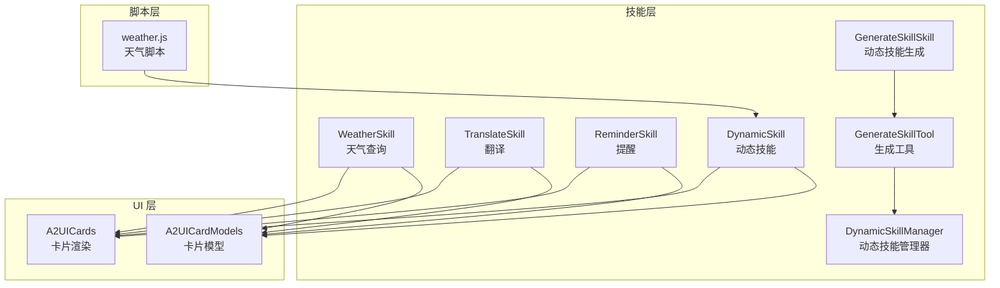
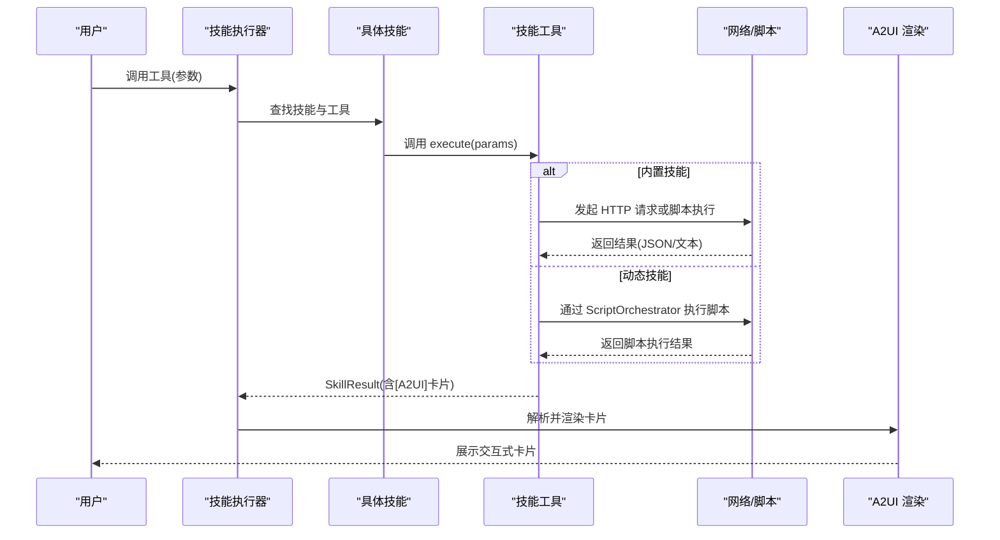
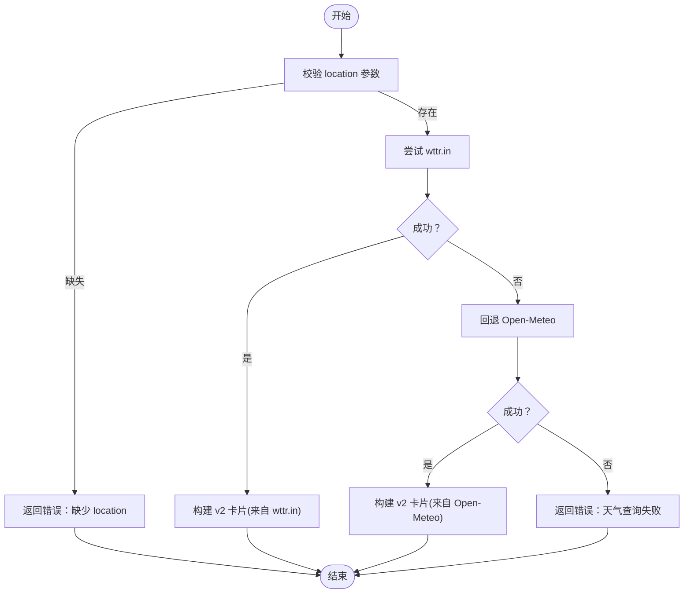
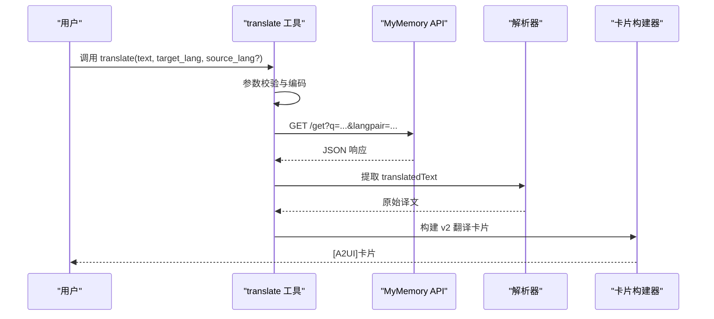
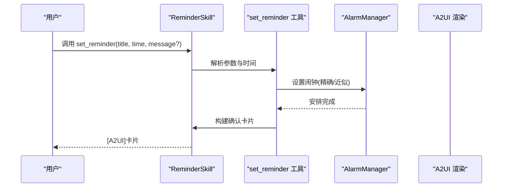
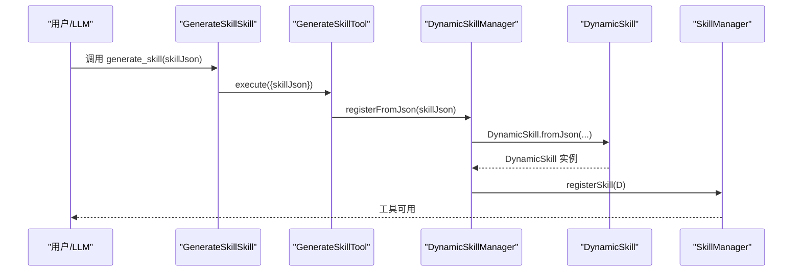
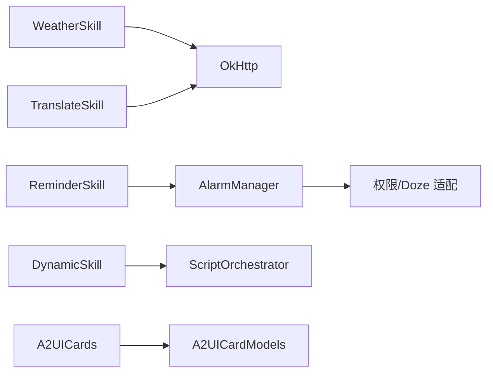

# 实用工具类技能

<cite>
**本文引用的文件**
- [WeatherSkill.kt](file://app/src/main/java/ai/openclaw/android/skill/builtin/WeatherSkill.kt)
- [TranslateSkill.kt](file://app/src/main/java/ai/openclaw/android/skill/builtin/TranslateSkill.kt)
- [ReminderSkill.kt](file://app/src/main/java/ai/openclaw/android/skill/builtin/ReminderSkill.kt)
- [GenerateSkillSkill.kt](file://app/src/main/java/ai/openclaw/android/skill/builtin/GenerateSkillSkill.kt)
- [GenerateSkillTool.kt](file://app/src/main/java/ai/openclaw/android/skill/builtin/GenerateSkillTool.kt)
- [Skill.kt](file://app/src/main/java/ai/openclaw/android/skill/Skill.kt)
- [SkillTool.kt](file://app/src/main/java/ai/openclaw/android/skill/SkillTool.kt)
- [DynamicSkillManager.kt](file://app/src/main/java/ai/openclaw/android/skill/DynamicSkillManager.kt)
- [DynamicSkill.kt](file://app/src/main/java/ai/openclaw/android/skill/DynamicSkill.kt)
- [A2UICards.kt](file://app/src/main/java/ai/openclaw/android/ui/A2UICards.kt)
- [A2UICardModels.kt](file://app/src/main/java/ai/openclaw/android/ui/A2UICardModels.kt)
- [WeatherSkillTest.kt](file://app/src/test/java/ai/openclaw/android/skill/builtin/WeatherSkillTest.kt)
- [TranslateSkillV2Test.kt](file://app/src/test/java/ai/openclaw/android/skill/builtin/TranslateSkillV2Test.kt)
- [ReminderSkillV2Test.kt](file://app/src/test/java/ai/openclaw/android/skill/builtin/ReminderSkillV2Test.kt)
- [weather.js](file://app/src/main/assets/scripts/weather.js)
</cite>

## 目录
1. [简介](#简介)
2. [项目结构](#项目结构)
3. [核心组件](#核心组件)
4. [架构总览](#架构总览)
5. [详细组件分析](#详细组件分析)
6. [依赖关系分析](#依赖关系分析)
7. [性能考量](#性能考量)
8. [故障排查指南](#故障排查指南)
9. [结论](#结论)
10. [附录](#附录)

## 简介
本文件面向实用工具类技能的技术文档，聚焦以下能力：
- 天气技能：天气查询、多数据源集成（wttr.in + Open-Meteo）、A2UI 卡片渲染
- 翻译技能：语言检测与翻译、格式保持机制、A2UI 卡片渲染
- 提醒技能：时间管理、闹钟设置、重复规则与权限适配
- 生成技能：动态技能生成机制、工具定义与参数校验

文档提供完整 API 接口说明、配置参数、使用示例与错误处理策略，并解释内部实现原理、性能优化技巧与安全考虑，同时给出扩展开发最佳实践与自定义指南。

## 项目结构
实用工具类技能位于应用模块的技能层，采用“内置技能 + 动态技能”的双轨设计：
- 内置技能：WeatherSkill、TranslateSkill、ReminderSkill、GenerateSkillSkill/GenerateSkillTool
- 动态技能：通过 JSON 定义与 JavaScript 脚本实现，由 DynamicSkillManager 管理生命周期与持久化
- UI 层：A2UICards.kt 与 A2UICardModels.kt 提供统一的卡片模型与渲染组件

图表来源
- [WeatherSkill.kt:11-399](file://app/src/main/java/ai/openclaw/android/skill/builtin/WeatherSkill.kt#L11-L399)
- [TranslateSkill.kt:11-159](file://app/src/main/java/ai/openclaw/android/skill/builtin/TranslateSkill.kt#L11-L159)
- [ReminderSkill.kt:13-304](file://app/src/main/java/ai/openclaw/android/skill/builtin/ReminderSkill.kt#L13-L304)
- [GenerateSkillSkill.kt:10-26](file://app/src/main/java/ai/openclaw/android/skill/builtin/GenerateSkillSkill.kt#L10-L26)
- [GenerateSkillTool.kt:10-88](file://app/src/main/java/ai/openclaw/android/skill/builtin/GenerateSkillTool.kt#L10-L88)
- [DynamicSkillManager.kt:22-202](file://app/src/main/java/ai/openclaw/android/skill/DynamicSkillManager.kt#L22-L202)
- [DynamicSkill.kt:22-221](file://app/src/main/java/ai/openclaw/android/skill/DynamicSkill.kt#L22-L221)
- [A2UICards.kt:175-321](file://app/src/main/java/ai/openclaw/android/ui/A2UICards.kt#L175-L321)
- [A2UICardModels.kt:83-140](file://app/src/main/java/ai/openclaw/android/ui/A2UICardModels.kt#L83-L140)
- [weather.js:1-16](file://app/src/main/assets/scripts/weather.js#L1-L16)

章节来源
- [WeatherSkill.kt:11-399](file://app/src/main/java/ai/openclaw/android/skill/builtin/WeatherSkill.kt#L11-L399)
- [TranslateSkill.kt:11-159](file://app/src/main/java/ai/openclaw/android/skill/builtin/TranslateSkill.kt#L11-L159)
- [ReminderSkill.kt:13-304](file://app/src/main/java/ai/openclaw/android/skill/builtin/ReminderSkill.kt#L13-L304)
- [GenerateSkillSkill.kt:10-26](file://app/src/main/java/ai/openclaw/android/skill/builtin/GenerateSkillSkill.kt#L10-L26)
- [GenerateSkillTool.kt:10-88](file://app/src/main/java/ai/openclaw/android/skill/builtin/GenerateSkillTool.kt#L10-L88)
- [DynamicSkillManager.kt:22-202](file://app/src/main/java/ai/openclaw/android/skill/DynamicSkillManager.kt#L22-L202)
- [DynamicSkill.kt:22-221](file://app/src/main/java/ai/openclaw/android/skill/DynamicSkill.kt#L22-L221)
- [A2UICards.kt:175-321](file://app/src/main/java/ai/openclaw/android/ui/A2UICards.kt#L175-L321)
- [A2UICardModels.kt:83-140](file://app/src/main/java/ai/openclaw/android/ui/A2UICardModels.kt#L83-L140)
- [weather.js:1-16](file://app/src/main/assets/scripts/weather.js#L1-L16)

## 核心组件
- 技能接口与工具
  - Skill：定义技能元数据与工具集合，提供初始化与清理钩子
  - SkillTool：定义工具名称、描述、参数与执行方法
  - SkillParam/SkillResult：参数与结果数据结构
- 动态技能体系
  - DynamicSkill：从 JSON 定义创建动态技能，封装工具定义与脚本
  - DynamicSkillManager：负责动态技能的注册、持久化、启用/停用/删除与定时维护
- A2UI 卡片系统
  - A2UICardModels：统一卡片数据模型与解析器
  - A2UICards：基于 Compose 的卡片渲染组件

章节来源
- [Skill.kt:3-13](file://app/src/main/java/ai/openclaw/android/skill/Skill.kt#L3-L13)
- [SkillTool.kt:3-22](file://app/src/main/java/ai/openclaw/android/skill/SkillTool.kt#L3-L22)
- [DynamicSkill.kt:22-109](file://app/src/main/java/ai/openclaw/android/skill/DynamicSkill.kt#L22-L109)
- [DynamicSkillManager.kt:22-202](file://app/src/main/java/ai/openclaw/android/skill/DynamicSkillManager.kt#L22-L202)
- [A2UICardModels.kt:83-140](file://app/src/main/java/ai/openclaw/android/ui/A2UICardModels.kt#L83-L140)
- [A2UICards.kt:175-321](file://app/src/main/java/ai/openclaw/android/ui/A2UICards.kt#L175-L321)

## 架构总览
实用工具类技能遵循“技能层 + 脚本层 + UI 层”的分层架构：
- 技能层：内置技能与动态技能共享统一接口，动态技能通过 JSON 与脚本实现
- 脚本层：JavaScript 脚本通过桥接能力调用网络与文件等资源
- UI 层：A2UI 卡片模型与渲染组件解耦展示逻辑

图表来源
- [WeatherSkill.kt:89-107](file://app/src/main/java/ai/openclaw/android/skill/builtin/WeatherSkill.kt#L89-L107)
- [TranslateSkill.kt:44-83](file://app/src/main/java/ai/openclaw/android/skill/builtin/TranslateSkill.kt#L44-L83)
- [ReminderSkill.kt:51-76](file://app/src/main/java/ai/openclaw/android/skill/builtin/ReminderSkill.kt#L51-L76)
- [DynamicSkill.kt:153-193](file://app/src/main/java/ai/openclaw/android/skill/DynamicSkill.kt#L153-L193)
- [A2UICardModels.kt:541-637](file://app/src/main/java/ai/openclaw/android/ui/A2UICardModels.kt#L541-L637)

## 详细组件分析

### 天气技能（WeatherSkill）
- 功能概述
  - 支持中文/英文城市名查询，优先使用 wttr.in，失败回退至 Open-Meteo
  - 输出 v2 A2UI 卡片，包含天气、体感温度、湿度、风力、预警与动作按钮
- 数据源与回退策略
  - wttr.in：快速响应，适合中文城市名；失败时回退 Open-Meteo
  - Open-Meteo：无需 API Key，支持全球地理编码与当前天气
- 参数与执行流程
  - 工具名称：get_weather
  - 必填参数：location（字符串）
  - 执行顺序：参数校验 → wttr.in → Open-Meteo → 构建卡片 → 返回
- A2UI 卡片结构
  - type: "weather"
  - data: title/city/condition/temperature/feelsLike/humidity/wind/forecast/alert
  - actions: 降雨提醒、7天预报、分享
- 错误处理
  - 缺少参数、HTTP 失败、解析异常均返回错误信息
- 性能与安全
  - 使用 OkHttp 客户端复用连接
  - 城市坐标映射减少地理编码次数
  - 日志记录便于问题定位

图表来源
- [WeatherSkill.kt:89-107](file://app/src/main/java/ai/openclaw/android/skill/builtin/WeatherSkill.kt#L89-L107)
- [WeatherSkill.kt:112-141](file://app/src/main/java/ai/openclaw/android/skill/builtin/WeatherSkill.kt#L112-L141)
- [WeatherSkill.kt:146-198](file://app/src/main/java/ai/openclaw/android/skill/builtin/WeatherSkill.kt#L146-L198)
- [WeatherSkill.kt:254-360](file://app/src/main/java/ai/openclaw/android/skill/builtin/WeatherSkill.kt#L254-L360)

章节来源
- [WeatherSkill.kt:11-399](file://app/src/main/java/ai/openclaw/android/skill/builtin/WeatherSkill.kt#L11-L399)
- [WeatherSkillTest.kt:28-115](file://app/src/test/java/ai/openclaw/android/skill/builtin/WeatherSkillTest.kt#L28-L115)
- [A2UICardModels.kt:164-200](file://app/src/main/java/ai/openclaw/android/ui/A2UICardModels.kt#L164-L200)
- [A2UICards.kt:175-321](file://app/src/main/java/ai/openclaw/android/ui/A2UICards.kt#L175-L321)

### 翻译技能（TranslateSkill）
- 功能概述
  - 使用 MyMemory API 进行翻译，支持自动语言检测与目标语言指定
  - 输出 v2 A2UI 翻译卡片，包含原文、译文、语言对与动作按钮
- 算法与格式保持
  - 参数解析：text/target_lang/source_lang（支持别名）
  - URL 编码与 langpair 组合
  - 响应解析：从 JSON 中提取 translatedText 并进行转义还原
- 参数与执行流程
  - 工具名称：translate
  - 必填参数：text、target_lang
  - 可选参数：source_lang（默认 auto）
  - 执行顺序：参数校验 → 构造请求 → 发送请求 → 解析响应 → 构建卡片
- A2UI 卡片结构
  - type: "translation"
  - data: sourceText/sourceLang/targetText/targetLang/pronunciation(可选)
  - actions: 朗读、复制
- 错误处理
  - 缺少参数、HTTP 错误、解析失败均返回错误信息

图表来源
- [TranslateSkill.kt:44-83](file://app/src/main/java/ai/openclaw/android/skill/builtin/TranslateSkill.kt#L44-L83)
- [TranslateSkill.kt:85-102](file://app/src/main/java/ai/openclaw/android/skill/builtin/TranslateSkill.kt#L85-L102)
- [TranslateSkill.kt:115-157](file://app/src/main/java/ai/openclaw/android/skill/builtin/TranslateSkill.kt#L115-L157)

章节来源
- [TranslateSkill.kt:11-159](file://app/src/main/java/ai/openclaw/android/skill/builtin/TranslateSkill.kt#L11-L159)
- [TranslateSkillV2Test.kt:18-150](file://app/src/test/java/ai/openclaw/android/skill/builtin/TranslateSkillV2Test.kt#L18-L150)
- [A2UICardModels.kt:246-265](file://app/src/main/java/ai/openclaw/android/ui/A2UICardModels.kt#L246-L265)
- [A2UICards.kt:442-535](file://app/src/main/java/ai/openclaw/android/ui/A2UICards.kt#L442-535)

### 提醒技能（ReminderSkill）
- 功能概述
  - 支持相对时间（如 in 5 minutes）与绝对时间（yyyy-MM-dd HH:mm）
  - 使用 AlarmManager 设置精确/近似闹钟，兼容 Android 13+ 权限
  - 提供列表与确认两种布局的 A2UI 卡片
- 参数与执行流程
  - set_reminder：title、time、message（可选）
  - list_reminders：无参数，列出待处理提醒
  - cancel_reminder：id
  - 执行顺序：参数解析 → 时间计算 → 安排闹钟 → 构建卡片
- A2UI 卡片结构
  - 确认卡片：type="reminder"，layout="reminder_confirm"，包含标题、文本、时间、相对时间与操作按钮
  - 列表卡片：type="reminder"，layout="reminder_list"，包含标题、数量与条目列表
- 错误处理
  - 时间格式错误、取消不存在的提醒、权限不足等场景返回错误信息

图表来源
- [ReminderSkill.kt:51-76](file://app/src/main/java/ai/openclaw/android/skill/builtin/ReminderSkill.kt#L51-L76)
- [ReminderSkill.kt:78-95](file://app/src/main/java/ai/openclaw/android/skill/builtin/ReminderSkill.kt#L78-L95)
- [ReminderSkill.kt:97-134](file://app/src/main/java/ai/openclaw/android/skill/builtin/ReminderSkill.kt#L97-L134)
- [ReminderSkill.kt:229-272](file://app/src/main/java/ai/openclaw/android/skill/builtin/ReminderSkill.kt#L229-L272)
- [ReminderSkill.kt:275-302](file://app/src/main/java/ai/openclaw/android/skill/builtin/ReminderSkill.kt#L275-L302)

章节来源
- [ReminderSkill.kt:13-304](file://app/src/main/java/ai/openclaw/android/skill/builtin/ReminderSkill.kt#L13-L304)
- [ReminderSkillV2Test.kt:19-260](file://app/src/test/java/ai/openclaw/android/skill/builtin/ReminderSkillV2Test.kt#L19-L260)
- [A2UICardModels.kt:269-303](file://app/src/main/java/ai/openclaw/android/ui/A2UICardModels.kt#L269-L303)
- [A2UICards.kt:539-663](file://app/src/main/java/ai/openclaw/android/ui/A2UICards.kt#L539-663)

### 生成技能（动态技能生成）
- 动态技能生成机制
  - GenerateSkillSkill：提供 generate_skill 工具
  - GenerateSkillTool：接收 skillJson，交由 DynamicSkillManager 注册
  - DynamicSkillManager：从 JSON 创建 DynamicSkill，持久化并注册到 SkillManager
- 工具定义与参数验证
  - 必须字段：id/name/description/version/instructions/script/tools
  - tools 数组：name/description/parameters(entryPoint/idempotent)
  - parameters：type/description/required/default
- 安全与权限
  - 动态工具执行前进行安全审查（自动执行/用户确认/拒绝）
  - 用户确认策略可持久化，支持“总是同意/总是拒绝/每次询问”

图表来源
- [GenerateSkillSkill.kt:10-26](file://app/src/main/java/ai/openclaw/android/skill/builtin/GenerateSkillSkill.kt#L10-L26)
- [GenerateSkillTool.kt:63-86](file://app/src/main/java/ai/openclaw/android/skill/builtin/GenerateSkillTool.kt#L63-L86)
- [DynamicSkillManager.kt:63-96](file://app/src/main/java/ai/openclaw/android/skill/DynamicSkillManager.kt#L63-L96)
- [DynamicSkill.kt:54-107](file://app/src/main/java/ai/openclaw/android/skill/DynamicSkill.kt#L54-L107)

章节来源
- [GenerateSkillSkill.kt:10-26](file://app/src/main/java/ai/openclaw/android/skill/builtin/GenerateSkillSkill.kt#L10-L26)
- [GenerateSkillTool.kt:10-88](file://app/src/main/java/ai/openclaw/android/skill/builtin/GenerateSkillTool.kt#L10-L88)
- [DynamicSkillManager.kt:22-202](file://app/src/main/java/ai/openclaw/android/skill/DynamicSkillManager.kt#L22-L202)
- [DynamicSkill.kt:22-221](file://app/src/main/java/ai/openclaw/android/skill/DynamicSkill.kt#L22-L221)

## 依赖关系分析
- 技能层依赖
  - 内置技能依赖 OkHttp 进行网络请求
  - 动态技能依赖 ScriptOrchestrator 执行脚本
- UI 层依赖
  - A2UICardModels 提供统一卡片模型，A2UICards 提供 Compose 渲染
- 测试覆盖
  - 对天气、翻译、提醒的 v2 卡片结构进行单元测试，确保 JSON 结构与字段正确性

图表来源
- [WeatherSkill.kt:33-37](file://app/src/main/java/ai/openclaw/android/skill/builtin/WeatherSkill.kt#L33-L37)
- [TranslateSkill.kt:32-33](file://app/src/main/java/ai/openclaw/android/skill/builtin/TranslateSkill.kt#L32-L33)
- [ReminderSkill.kt:98-134](file://app/src/main/java/ai/openclaw/android/skill/builtin/ReminderSkill.kt#L98-L134)
- [DynamicSkill.kt:30-33](file://app/src/main/java/ai/openclaw/android/skill/DynamicSkill.kt#L30-L33)
- [A2UICards.kt:175-321](file://app/src/main/java/ai/openclaw/android/ui/A2UICards.kt#L175-L321)
- [A2UICardModels.kt:83-140](file://app/src/main/java/ai/openclaw/android/ui/A2UICardModels.kt#L83-L140)

章节来源
- [WeatherSkillTest.kt:28-115](file://app/src/test/java/ai/openclaw/android/skill/builtin/WeatherSkillTest.kt#L28-L115)
- [TranslateSkillV2Test.kt:18-150](file://app/src/test/java/ai/openclaw/android/skill/builtin/TranslateSkillV2Test.kt#L18-L150)
- [ReminderSkillV2Test.kt:19-260](file://app/src/test/java/ai/openclaw/android/skill/builtin/ReminderSkillV2Test.kt#L19-L260)

## 性能考量
- 网络与缓存
  - OkHttp 客户端复用连接，减少握手开销
  - 城市坐标映射减少地理编码请求次数
- UI 渲染
  - A2UI 卡片采用 Compose，按需重组，避免不必要的重绘
  - 卡片内滚动区域限制在必要范围内，降低布局复杂度
- 动态技能
  - ScriptOrchestrator 生命周期外部管理，避免频繁创建销毁
  - 工具使用计数与定期维护，清理长期未使用的技能

## 故障排查指南
- 天气技能
  - 现象：返回“缺少 location 参数”或“HTTP client not initialized”
  - 排查：确认技能已通过 initialize 注入 OkHttpClient；检查参数是否为空
  - 参考测试：[WeatherSkillTest.kt:29-80](file://app/src/test/java/ai/openclaw/android/skill/builtin/WeatherSkillTest.kt#L29-L80)
- 翻译技能
  - 现象：返回“缺少 text/缺少 target_lang/翻译失败”
  - 排查：确认 text 与 target_lang 存在；检查 MyMemory API 响应结构
  - 参考测试：[TranslateSkillV2Test.kt:18-150](file://app/src/test/java/ai/openclaw/android/skill/builtin/TranslateSkillV2Test.kt#L18-L150)
- 提醒技能
  - 现象：时间格式错误或权限不足导致设置失败
  - 排查：确认时间格式为“in X minutes/hours”或“yyyy-MM-dd HH:mm”；检查 Android 13+ 权限
  - 参考测试：[ReminderSkillV2Test.kt:19-260](file://app/src/test/java/ai/openclaw/android/skill/builtin/ReminderSkillV2Test.kt#L19-L260)
- 动态技能
  - 现象：注册失败或脚本执行错误
  - 排查：确认 skillJson 结构完整；检查 ScriptOrchestrator 桥接能力；查看安全策略与用户确认

章节来源
- [WeatherSkillTest.kt:28-115](file://app/src/test/java/ai/openclaw/android/skill/builtin/WeatherSkillTest.kt#L28-L115)
- [TranslateSkillV2Test.kt:18-150](file://app/src/test/java/ai/openclaw/android/skill/builtin/TranslateSkillV2Test.kt#L18-L150)
- [ReminderSkillV2Test.kt:19-260](file://app/src/test/java/ai/openclaw/android/skill/builtin/ReminderSkillV2Test.kt#L19-L260)

## 结论
实用工具类技能通过统一的技能接口与 A2UI 卡片系统，实现了高内聚、低耦合的功能模块。内置技能提供稳定可靠的常用能力，动态技能体系则赋予系统强大的扩展性与灵活性。配合完善的测试与安全策略，能够在保证性能与用户体验的同时，满足多样化的业务需求。

## 附录

### API 接口说明与使用示例

- 天气技能（WeatherSkill）
  - 工具：get_weather
  - 参数：
    - location（必填，字符串）
  - 返回：A2UI 卡片（type="weather"），包含天气、体感温度、湿度、风力、预警与动作按钮
  - 示例：用户询问“北京天气”，调用 get_weather({"location":"北京"})
  - 参考实现：[WeatherSkill.kt:78-107](file://app/src/main/java/ai/openclaw/android/skill/builtin/WeatherSkill.kt#L78-L107)

- 翻译技能（TranslateSkill）
  - 工具：translate
  - 参数：
    - text（必填，字符串）
    - target_lang（必填，字符串）
    - source_lang（可选，默认 auto）
  - 返回：A2UI 卡片（type="translation"），包含原文、译文、语言对与动作按钮
  - 示例：将“Hello”翻译为“中文”，调用 translate({"text":"Hello","target_lang":"zh-CN","source_lang":"en"})
  - 参考实现：[TranslateSkill.kt:34-104](file://app/src/main/java/ai/openclaw/android/skill/builtin/TranslateSkill.kt#L34-L104)

- 提醒技能（ReminderSkill）
  - 工具：set_reminder
    - 参数：title（必填）、time（必填，相对或绝对时间）、message（可选）
  - 工具：list_reminders（无参数）
  - 工具：cancel_reminder
    - 参数：id（必填）
  - 返回：A2UI 卡片（type="reminder"），确认或列表布局
  - 示例：设置“下午3点开会”，调用 set_reminder({"title":"下午3点开会","time":"2026-04-13 15:00","message":"带项目资料"})
  - 参考实现：[ReminderSkill.kt:40-200](file://app/src/main/java/ai/openclaw/android/skill/builtin/ReminderSkill.kt#L40-L200)

- 动态技能生成（GenerateSkillSkill/GenerateSkillTool）
  - 工具：generate_skill
    - 参数：skillJson（必填，JSON 字符串）
  - 返回：注册成功或失败信息
  - 示例：传入符合规范的 skillJson，触发动态技能注册
  - 参考实现：[GenerateSkillTool.kt:63-86](file://app/src/main/java/ai/openclaw/android/skill/builtin/GenerateSkillTool.kt#L63-L86)，[DynamicSkillManager.kt:63-96](file://app/src/main/java/ai/openclaw/android/skill/DynamicSkillManager.kt#L63-L96)

### 配置参数与安全策略
- 天气技能
  - httpClient：通过 SkillContext 注入，用于网络请求
  - 城市坐标映射：内置常见中文城市经纬度，减少地理编码
  - 参考实现：[WeatherSkill.kt:33-61](file://app/src/main/java/ai/openclaw/android/skill/builtin/WeatherSkill.kt#L33-L61)
- 翻译技能
  - httpClient：通过 SkillContext 注入
  - 参考实现：[TranslateSkill.kt:32-108](file://app/src/main/java/ai/openclaw/android/skill/builtin/TranslateSkill.kt#L32-L108)
- 提醒技能
  - AlarmManager：根据权限选择 setExactAndAllowWhileIdle 或 setAndAllowWhileIdle
  - 参考实现：[ReminderSkill.kt:97-134](file://app/src/main/java/ai/openclaw/android/skill/builtin/ReminderSkill.kt#L97-L134)
- 动态技能
  - 安全策略：AUTO_EXECUTE/ASK_USER/DENY，支持用户偏好持久化
  - 参考实现：[DynamicSkill.kt:153-193](file://app/src/main/java/ai/openclaw/android/skill/DynamicSkill.kt#L153-L193)，[DynamicSkillManager.kt:122-147](file://app/src/main/java/ai/openclaw/android/skill/DynamicSkillManager.kt#L122-L147)

### 最佳实践与自定义指南
- 扩展内置技能
  - 遵循 Skill/SkillTool 接口规范，提供清晰的参数定义与错误处理
  - 输出标准化 A2UI 卡片，确保 UI 层渲染一致性
- 自定义动态技能
  - 使用 GenerateSkillTool 生成技能，确保 skillJson 结构完整
  - 在脚本中合理使用桥接能力（http/fs），注意安全与性能
  - 通过 UserPreferenceManager 配置安全策略，提升用户体验
- UI 适配
  - 使用 A2UICardModels 的类型安全访问器，避免运行时解析错误
  - 在 A2UICards 中按需渲染卡片，控制交互按钮样式与行为