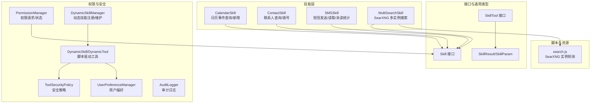
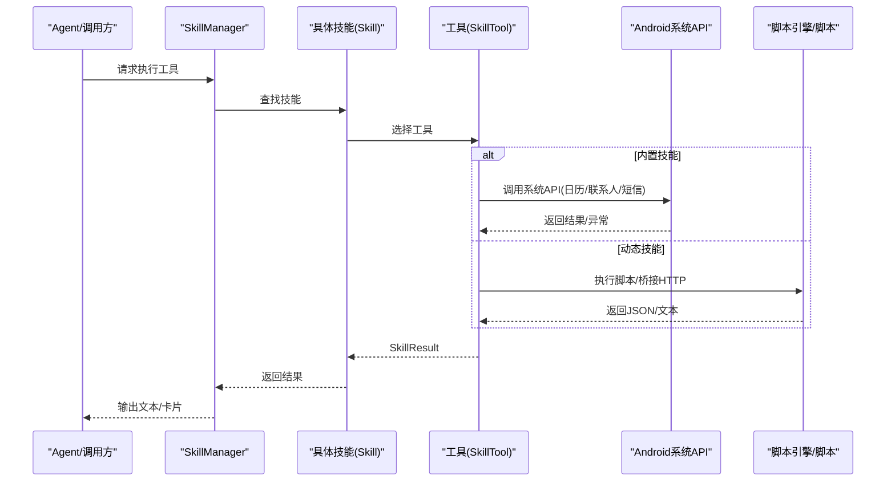
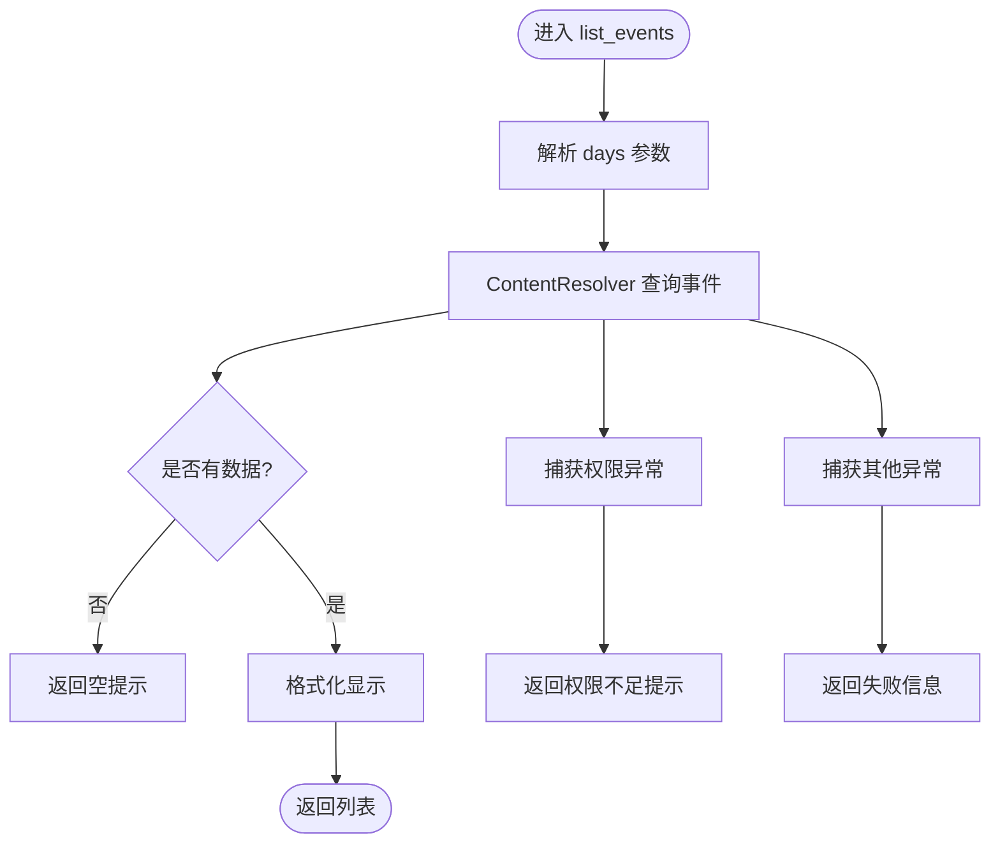
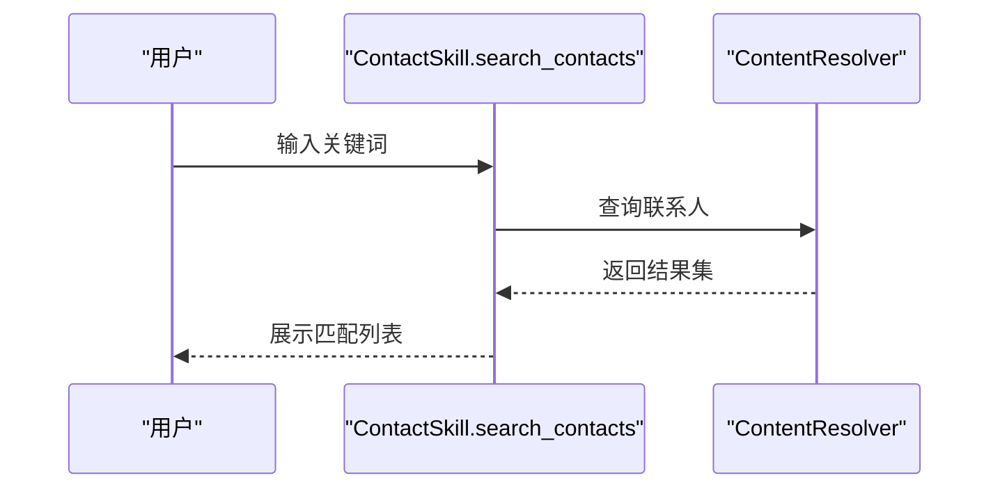
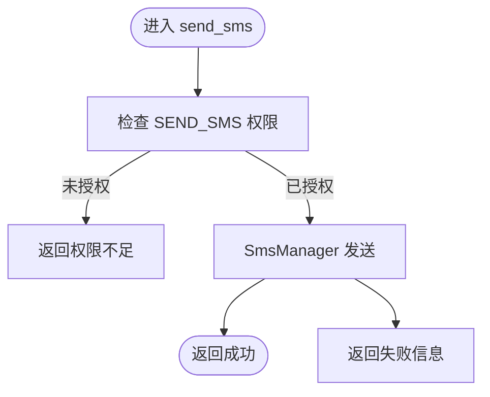
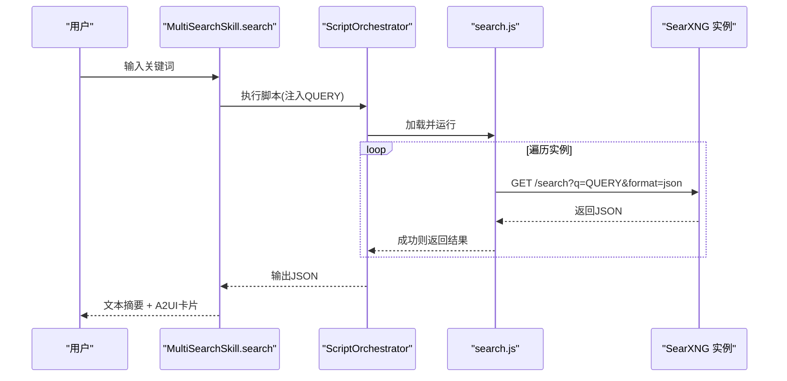
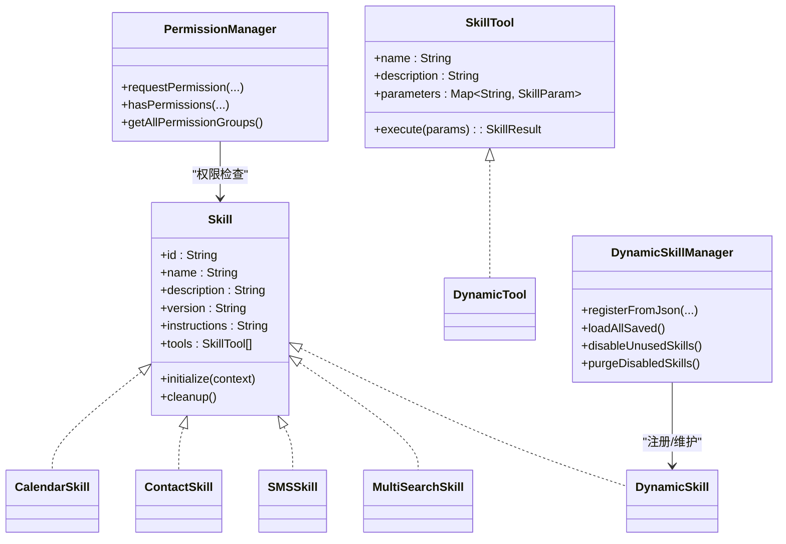

# 系统集成类技能

<cite>
**本文引用的文件**
- [CalendarSkill.kt](file://app/src/main/java/ai/openclaw/android/skill/builtin/CalendarSkill.kt)
- [ContactSkill.kt](file://app/src/main/java/ai/openclaw/android/skill/builtin/ContactSkill.kt)
- [SMSSkill.kt](file://app/src/main/java/ai/openclaw/android/skill/builtin/SMSSkill.kt)
- [MultiSearchSkill.kt](file://app/src/main/java/ai/openclaw/android/skill/builtin/MultiSearchSkill.kt)
- [Skill.kt](file://app/src/main/java/ai/openclaw/android/skill/Skill.kt)
- [SkillTool.kt](file://app/src/main/java/ai/openclaw/android/skill/SkillTool.kt)
- [PermissionManager.kt](file://app/src/main/java/ai/openclaw/android/permission/PermissionManager.kt)
- [AndroidManifest.xml](file://app/src/main/AndroidManifest.xml)
- [search.js](file://app/src/main/assets/scripts/search.js)
- [DynamicSkill.kt](file://app/src/main/java/ai/openclaw/android/skill/DynamicSkill.kt)
- [DynamicSkillManager.kt](file://app/src/main/java/ai/openclaw/android/skill/DynamicSkillManager.kt)
- [SkillManager.kt](file://app/src/main/java/ai/openclaw/android/skill/SkillManager.kt)
- [ToolSecurityPolicy.kt](file://app/src/main/java/ai/openclaw/android/skill/ToolSecurityPolicy.kt)
- [UserPreferenceManager.kt](file://app/src/main/java/ai/openclaw/android/skill/UserPreferenceManager.kt)
- [AuditLogger.kt](file://app/src/main/java/ai/openclaw/android/security/AuditLogger.kt)
- [MultiSearchSkillTest.kt](file://app/src/test/java/ai/openclaw/android/skill/builtin/MultiSearchSkillTest.kt)
</cite>

## 目录
1. [简介](#简介)
2. [项目结构](#项目结构)
3. [核心组件](#核心组件)
4. [架构总览](#架构总览)
5. [详细组件分析](#详细组件分析)
6. [依赖关系分析](#依赖关系分析)
7. [性能考量](#性能考量)
8. [故障排除指南](#故障排除指南)
9. [结论](#结论)
10. [附录](#附录)

## 简介
本文件面向系统集成类技能，围绕以下四类内置技能展开：日历技能、联系人技能、短信技能与多引擎搜索技能。文档覆盖各技能的功能边界、数据流、权限与安全策略、错误处理、用户体验与隐私保护，并给出最佳实践与排障建议。读者无需深入源码即可理解各技能如何与Android系统API交互、如何在应用中注册与调度。

## 项目结构
- 技能层位于 app/src/main/java/ai/openclaw/android/skill/builtin 下，包含 CalendarSkill、ContactSkill、SMSSkill、MultiSearchSkill 等。
- 技能接口与通用类型位于 app/src/main/java/ai/openclaw/android/skill 下，统一了技能与工具的抽象。
- 权限管理位于 app/src/main/java/ai/openclaw/android/permission 下，提供统一的权限请求与状态查询能力。
- 多引擎搜索脚本位于 app/src/main/assets/scripts/search.js，通过脚本桥接 SearXNG 实例。
- 动态技能体系位于 app/src/main/java/ai/openclaw/android/skill 下，支持运行时注册、持久化与生命周期管理。

**图表来源**
- [CalendarSkill.kt:13-182](file://app/src/main/java/ai/openclaw/android/skill/builtin/CalendarSkill.kt#L13-L182)
- [ContactSkill.kt:13-243](file://app/src/main/java/ai/openclaw/android/skill/builtin/ContactSkill.kt#L13-L243)
- [SMSSkill.kt:15-185](file://app/src/main/java/ai/openclaw/android/skill/builtin/SMSSkill.kt#L15-L185)
- [MultiSearchSkill.kt:14-131](file://app/src/main/java/ai/openclaw/android/skill/builtin/MultiSearchSkill.kt#L14-L131)
- [Skill.kt:3-13](file://app/src/main/java/ai/openclaw/android/skill/Skill.kt#L3-L13)
- [SkillTool.kt:3-22](file://app/src/main/java/ai/openclaw/android/skill/SkillTool.kt#L3-L22)
- [PermissionManager.kt:32-189](file://app/src/main/java/ai/openclaw/android/permission/PermissionManager.kt#L32-L189)
- [DynamicSkillManager.kt:22-202](file://app/src/main/java/ai/openclaw/android/skill/DynamicSkillManager.kt#L22-L202)
- [DynamicSkill.kt:22-221](file://app/src/main/java/ai/openclaw/android/skill/DynamicSkill.kt#L22-L221)
- [ToolSecurityPolicy.kt:6-72](file://app/src/main/java/ai/openclaw/android/skill/ToolSecurityPolicy.kt#L6-L72)
- [UserPreferenceManager.kt:16-100](file://app/src/main/java/ai/openclaw/android/skill/UserPreferenceManager.kt#L16-L100)
- [search.js:1-39](file://app/src/main/assets/scripts/search.js#L1-L39)

**章节来源**
- [CalendarSkill.kt:13-182](file://app/src/main/java/ai/openclaw/android/skill/builtin/CalendarSkill.kt#L13-L182)
- [ContactSkill.kt:13-243](file://app/src/main/java/ai/openclaw/android/skill/builtin/ContactSkill.kt#L13-L243)
- [SMSSkill.kt:15-185](file://app/src/main/java/ai/openclaw/android/skill/builtin/SMSSkill.kt#L15-L185)
- [MultiSearchSkill.kt:14-131](file://app/src/main/java/ai/openclaw/android/skill/builtin/MultiSearchSkill.kt#L14-L131)
- [Skill.kt:3-13](file://app/src/main/java/ai/openclaw/android/skill/Skill.kt#L3-L13)
- [SkillTool.kt:3-22](file://app/src/main/java/ai/openclaw/android/skill/SkillTool.kt#L3-L22)
- [PermissionManager.kt:32-189](file://app/src/main/java/ai/openclaw/android/permission/PermissionManager.kt#L32-L189)
- [DynamicSkillManager.kt:22-202](file://app/src/main/java/ai/openclaw/android/skill/DynamicSkillManager.kt#L22-L202)
- [DynamicSkill.kt:22-221](file://app/src/main/java/ai/openclaw/android/skill/DynamicSkill.kt#L22-L221)
- [ToolSecurityPolicy.kt:6-72](file://app/src/main/java/ai/openclaw/android/skill/ToolSecurityPolicy.kt#L6-L72)
- [UserPreferenceManager.kt:16-100](file://app/src/main/java/ai/openclaw/android/skill/UserPreferenceManager.kt#L16-L100)
- [search.js:1-39](file://app/src/main/assets/scripts/search.js#L1-L39)

## 核心组件
- 技能接口与工具抽象
  - Skill：定义技能标识、元信息、工具集合及生命周期方法。
  - SkillTool：定义工具名、参数规范与异步执行接口。
  - SkillResult/SkillParam：封装执行结果与参数定义。
- 权限管理
  - PermissionManager：统一请求权限、查询状态、识别特殊权限（如全部文件访问），并暴露当前请求状态流。
- 动态技能体系
  - DynamicSkill/DynamicTool：基于JSON定义与脚本执行的动态工具，支持安全策略与用户偏好。
  - DynamicSkillManager：动态技能的注册、持久化、启用/停用/删除与定时维护。
- 多引擎搜索
  - MultiSearchSkill：通过脚本桥接 SearXNG 实例，聚合结果并输出文本摘要与A2UI卡片。

**章节来源**
- [Skill.kt:3-13](file://app/src/main/java/ai/openclaw/android/skill/Skill.kt#L3-L13)
- [SkillTool.kt:3-22](file://app/src/main/java/ai/openclaw/android/skill/SkillTool.kt#L3-L22)
- [PermissionManager.kt:32-189](file://app/src/main/java/ai/openclaw/android/permission/PermissionManager.kt#L32-L189)
- [DynamicSkill.kt:22-221](file://app/src/main/java/ai/openclaw/android/skill/DynamicSkill.kt#L22-L221)
- [DynamicSkillManager.kt:22-202](file://app/src/main/java/ai/openclaw/android/skill/DynamicSkillManager.kt#L22-L202)
- [MultiSearchSkill.kt:14-131](file://app/src/main/java/ai/openclaw/android/skill/builtin/MultiSearchSkill.kt#L14-L131)

## 架构总览
下图展示了技能的执行路径：上层通过 SkillManager 调度具体技能工具；内置技能直接使用Android系统API；动态技能通过脚本桥接外部服务；权限与安全策略贯穿始终。

**图表来源**
- [SkillManager.kt:150-193](file://app/src/main/java/ai/openclaw/android/skill/SkillManager.kt#L150-L193)
- [CalendarSkill.kt:41-99](file://app/src/main/java/ai/openclaw/android/skill/builtin/CalendarSkill.kt#L41-L99)
- [ContactSkill.kt:39-96](file://app/src/main/java/ai/openclaw/android/skill/builtin/ContactSkill.kt#L39-L96)
- [SMSSkill.kt:44-95](file://app/src/main/java/ai/openclaw/android/skill/builtin/SMSSkill.kt#L44-L95)
- [MultiSearchSkill.kt:42-85](file://app/src/main/java/ai/openclaw/android/skill/builtin/MultiSearchSkill.kt#L42-L85)

## 详细组件分析

### 日历技能（CalendarSkill）
- 功能边界
  - 列出未来N天内的日历事件（默认7天）。
  - 新增日历事件，需指定标题、开始/结束时间与可选描述。
- Android系统API与数据流
  - 查询：使用 ContentResolver 访问 CalendarContract.Events，按时间范围过滤并排序。
  - 插入：使用 ContentResolver 向 CalendarContract.Events 插入事件，自动选择默认日历。
- 权限与兼容性
  - 需要 READ_CALENDAR 与 WRITE_CALENDAR 权限。
  - 在较新Android版本上，权限申请与运行时检查由应用负责。
- 错误处理与用户体验
  - 对 SecurityException 与通用异常分别处理，返回明确提示。
  - 时间解析失败与参数缺失时即时返回错误。
- 隐私与安全
  - 仅访问当前用户日历数据，不上传至云端。
  - 建议在UI层提示用户授权原因。

**图表来源**
- [CalendarSkill.kt:41-59](file://app/src/main/java/ai/openclaw/android/skill/builtin/CalendarSkill.kt#L41-L59)
- [CalendarSkill.kt:61-99](file://app/src/main/java/ai/openclaw/android/skill/builtin/CalendarSkill.kt#L61-L99)

**章节来源**
- [CalendarSkill.kt:13-182](file://app/src/main/java/ai/openclaw/android/skill/builtin/CalendarSkill.kt#L13-L182)
- [AndroidManifest.xml:17-19](file://app/src/main/AndroidManifest.xml#L17-L19)

### 联系人技能（ContactSkill）
- 功能边界
  - 搜索联系人（按姓名或号码模糊匹配）。
  - 获取联系人详情（姓名 -> 电话）。
  - 拨打电话（支持直接拨号或先查再拨）。
- Android系统API与数据流
  - 搜索/详情：使用 ContactsContract.CommonDataKinds.Phone 查询，避免重复项。
  - 拨号：启动 ACTION_DIAL Intent，交由系统拨号界面处理。
- 权限与兼容性
  - 需要 READ_CONTACTS 权限；拨号不需特殊权限但会触发系统界面。
- 错误处理与用户体验
  - 缺少必要参数立即返回错误。
  - 未找到联系人时返回友好提示。
- 隐私与安全
  - 仅读取设备联系人，不上传。
  - 建议在拨号前再次确认号码来源。

**图表来源**
- [ContactSkill.kt:39-96](file://app/src/main/java/ai/openclaw/android/skill/builtin/ContactSkill.kt#L39-L96)

**章节来源**
- [ContactSkill.kt:13-243](file://app/src/main/java/ai/openclaw/android/skill/builtin/ContactSkill.kt#L13-L243)
- [AndroidManifest.xml:21-22](file://app/src/main/AndroidManifest.xml#L21-L22)

### 短信技能（SMSSkill）
- 功能边界
  - 发送短信（目标号码 + 内容）。
  - 读取最近短信（可限制数量与来源过滤）。
  - 统计未读短信数量。
- Android系统API与数据流
  - 发送：使用 SmsManager.sendTextMessage。
  - 读取：通过 content://sms/inbox 查询，支持按发件人筛选与分页。
  - 未读：按 read=0 统计。
- 权限与兼容性
  - 发送短信需要 SEND_SMS；读取短信需要 READ_SMS。
  - 部分厂商对短信读取有严格限制，需在UI层提示风险。
- 错误处理与用户体验
  - 参数校验失败立即返回。
  - 异常捕获并返回可读错误信息。
- 隐私与安全
  - 读取短信涉及敏感信息，应遵循最小化原则与用户同意。

**图表来源**
- [SMSSkill.kt:44-62](file://app/src/main/java/ai/openclaw/android/skill/builtin/SMSSkill.kt#L44-L62)

**章节来源**
- [SMSSkill.kt:15-185](file://app/src/main/java/ai/openclaw/android/skill/builtin/SMSSkill.kt#L15-L185)
- [AndroidManifest.xml:24-26](file://app/src/main/AndroidManifest.xml#L24-L26)

### 多引擎搜索技能（MultiSearchSkill）
- 功能边界
  - 使用 SearXNG 多实例进行搜索，无需API Key。
  - 返回纯文本摘要与A2UI卡片，便于LLM理解与UI渲染。
- 技术实现
  - 通过 ScriptOrchestrator 执行 assets/scripts/search.js。
  - 脚本遍历多个实例，返回首个成功响应，否则报错。
  - 解析JSON并构建文本摘要与A2UI卡片数据。
- 性能与可靠性
  - 多实例轮询提升可用性，避免单点故障。
  - 限制返回结果数量，控制输出长度。
- 错误处理与用户体验
  - 脚本执行失败、参数缺失、无结果时均有明确提示。
- 隐私与安全
  - 通过HTTP桥接外部实例，避免本地存储敏感查询。

**图表来源**
- [MultiSearchSkill.kt:42-85](file://app/src/main/java/ai/openclaw/android/skill/builtin/MultiSearchSkill.kt#L42-L85)
- [search.js:10-38](file://app/src/main/assets/scripts/search.js#L10-L38)

**章节来源**
- [MultiSearchSkill.kt:14-131](file://app/src/main/java/ai/openclaw/android/skill/builtin/MultiSearchSkill.kt#L14-L131)
- [search.js:1-39](file://app/src/main/assets/scripts/search.js#L1-L39)
- [MultiSearchSkillTest.kt:65-147](file://app/src/test/java/ai/openclaw/android/skill/builtin/MultiSearchSkillTest.kt#L65-L147)

## 依赖关系分析
- 技能与工具
  - 每个技能实现 Skill 接口，提供一组 SkillTool。
  - 工具参数使用 SkillParam 定义，返回 SkillResult。
- 权限与安全
  - PermissionManager 提供统一权限请求与状态查询。
  - 动态技能通过 ToolSecurityPolicy 与 UserPreferenceManager 实现安全策略与用户偏好。
- 动态技能生命周期
  - DynamicSkillManager 负责注册、启用/停用、清理与定期维护（30天未使用停用，90天已停用删除）。
- 脚本与桥接
  - MultiSearchSkill 依赖 ScriptOrchestrator 与 search.js，通过 http 桥接外部服务。

**图表来源**
- [Skill.kt:3-13](file://app/src/main/java/ai/openclaw/android/skill/Skill.kt#L3-L13)
- [SkillTool.kt:3-22](file://app/src/main/java/ai/openclaw/android/skill/SkillTool.kt#L3-L22)
- [CalendarSkill.kt:13-182](file://app/src/main/java/ai/openclaw/android/skill/builtin/CalendarSkill.kt#L13-L182)
- [ContactSkill.kt:13-243](file://app/src/main/java/ai/openclaw/android/skill/builtin/ContactSkill.kt#L13-L243)
- [SMSSkill.kt:15-185](file://app/src/main/java/ai/openclaw/android/skill/builtin/SMSSkill.kt#L15-L185)
- [MultiSearchSkill.kt:14-131](file://app/src/main/java/ai/openclaw/android/skill/builtin/MultiSearchSkill.kt#L14-L131)
- [PermissionManager.kt:32-189](file://app/src/main/java/ai/openclaw/android/permission/PermissionManager.kt#L32-L189)
- [DynamicSkill.kt:22-221](file://app/src/main/java/ai/openclaw/android/skill/DynamicSkill.kt#L22-L221)
- [DynamicSkillManager.kt:22-202](file://app/src/main/java/ai/openclaw/android/skill/DynamicSkillManager.kt#L22-L202)

**章节来源**
- [SkillManager.kt:150-193](file://app/src/main/java/ai/openclaw/android/skill/SkillManager.kt#L150-L193)
- [DynamicSkillManager.kt:22-202](file://app/src/main/java/ai/openclaw/android/skill/DynamicSkillManager.kt#L22-L202)
- [ToolSecurityPolicy.kt:6-72](file://app/src/main/java/ai/openclaw/android/skill/ToolSecurityPolicy.kt#L6-L72)
- [UserPreferenceManager.kt:16-100](file://app/src/main/java/ai/openclaw/android/skill/UserPreferenceManager.kt#L16-L100)

## 性能考量
- 日历与联系人查询
  - 使用 ContentResolver 查询时，尽量缩小时间/范围条件，避免全量扫描。
  - 对联系人搜索使用 LIKE 查询，注意索引与去重。
- 短信读取
  - 限制读取数量与分页，避免一次性加载过多数据导致内存压力。
  - 未读统计使用简单条件查询，复杂场景可考虑缓存。
- 多引擎搜索
  - 多实例轮询提升可用性，但增加网络开销；建议设置超时与重试上限。
  - 控制返回结果数量，避免输出过长影响LLM处理效率。
- 动态技能
  - 定期维护停用/清理策略，减少运行时负担。
  - 脚本执行结果缓存（视业务需求）以降低重复调用成本。

[本节为通用指导，无需特定文件来源]

## 故障排除指南
- 权限相关
  - 现象：日历/联系人/短信工具返回“需要权限”。
  - 排查：确认 AndroidManifest 中对应权限声明；在运行时通过 PermissionManager 检查与请求。
  - 特殊权限：如全部文件访问，需引导用户到系统设置页面开启。
- 日历技能
  - 现象：查询无结果或抛异常。
  - 排查：确认时间范围参数、默认日历是否可用、是否授予读写日历权限。
- 联系人技能
  - 现象：搜索不到联系人或拨号失败。
  - 排查：确认 READ_CONTACTS 权限；拨号前检查号码有效性。
- 短信技能
  - 现象：发送/读取失败。
  - 排查：确认 SEND_SMS/READ_SMS 权限；部分厂商限制短信读取，需在UI层提示。
- 多引擎搜索
  - 现象：脚本执行失败或无结果。
  - 排查：检查 ScriptOrchestrator 初始化与脚本加载；验证网络连通性；参考单元测试断言定位问题。
- 动态技能
  - 现象：注册/启用失败或被停用/清理。
  - 排查：检查JSON字段完整性；确认用户偏好策略；查看维护日志。

**章节来源**
- [PermissionManager.kt:72-109](file://app/src/main/java/ai/openclaw/android/permission/PermissionManager.kt#L72-L109)
- [CalendarSkill.kt:54-58](file://app/src/main/java/ai/openclaw/android/skill/builtin/CalendarSkill.kt#L54-L58)
- [ContactSkill.kt:43-45](file://app/src/main/java/ai/openclaw/android/skill/builtin/ContactSkill.kt#L43-L45)
- [SMSSkill.kt:51-53](file://app/src/main/java/ai/openclaw/android/skill/builtin/SMSSkill.kt#L51-L53)
- [MultiSearchSkillTest.kt:65-147](file://app/src/test/java/ai/openclaw/android/skill/builtin/MultiSearchSkillTest.kt#L65-L147)
- [DynamicSkillManager.kt:122-147](file://app/src/main/java/ai/openclaw/android/skill/DynamicSkillManager.kt#L122-L147)

## 结论
本系统通过统一的技能接口与工具抽象，将Android系统能力（日历、联系人、短信）与外部搜索能力（SearXNG）整合为可组合、可扩展的智能体工具集。配合权限管理与动态技能体系，既保证了安全性与可控性，又提供了灵活的扩展空间。建议在实际部署中完善UI提示、错误回退与审计日志，持续优化性能与用户体验。

[本节为总结，无需特定文件来源]

## 附录
- 权限清单（摘自清单）
  - 日历：READ_CALENDAR、WRITE_CALENDAR
  - 联系人：READ_CONTACTS
  - 短信：SEND_SMS、READ_SMS
- 安全与审计
  - 动态工具执行受 ToolSecurityPolicy 与 UserPreferenceManager 管控。
  - 可选审计日志用于记录关键操作链路完整性。

**章节来源**
- [AndroidManifest.xml:17-26](file://app/src/main/AndroidManifest.xml#L17-L26)
- [ToolSecurityPolicy.kt:6-72](file://app/src/main/java/ai/openclaw/android/skill/ToolSecurityPolicy.kt#L6-L72)
- [UserPreferenceManager.kt:16-100](file://app/src/main/java/ai/openclaw/android/skill/UserPreferenceManager.kt#L16-L100)
- [AuditLogger.kt:16-100](file://app/src/main/java/ai/openclaw/android/security/AuditLogger.kt#L16-L100)