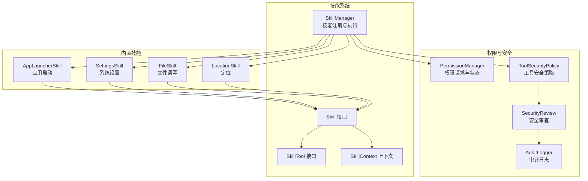
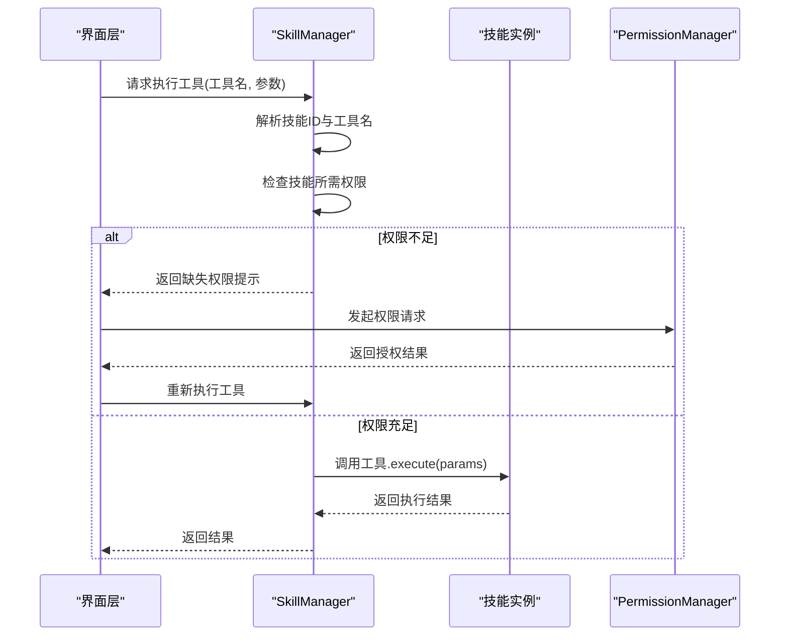
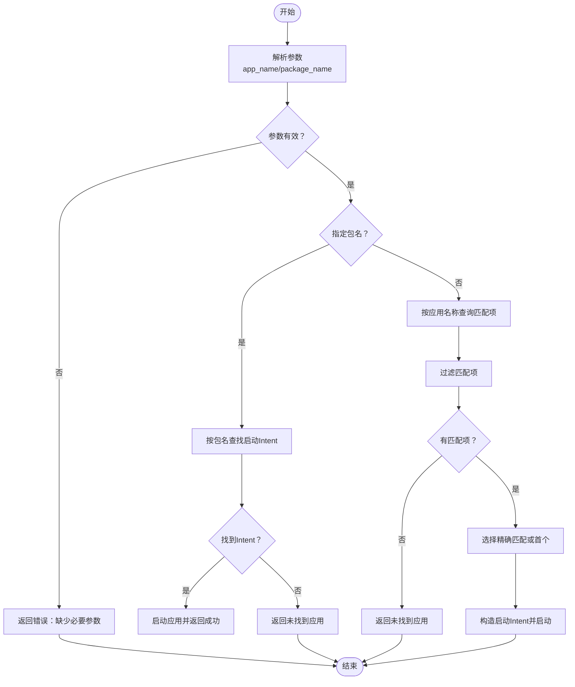
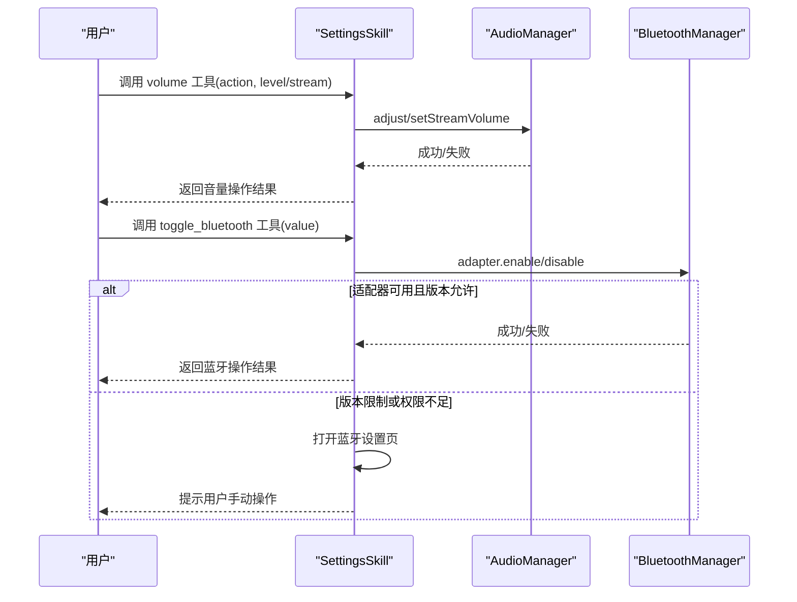
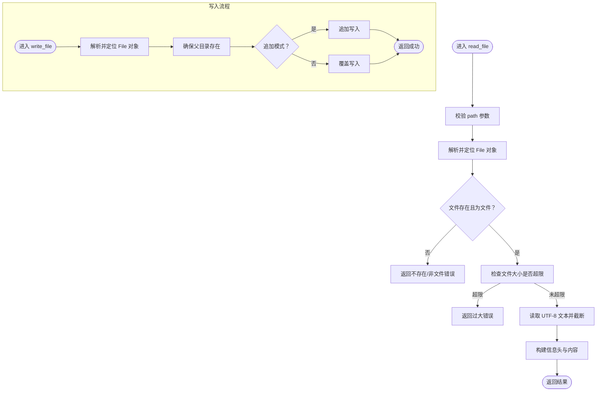
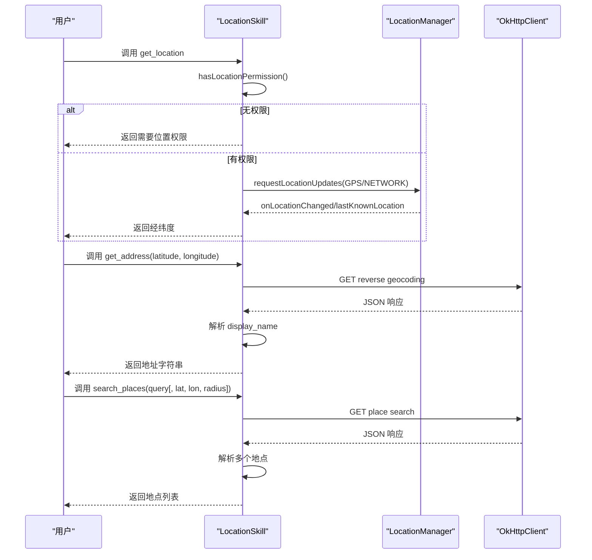
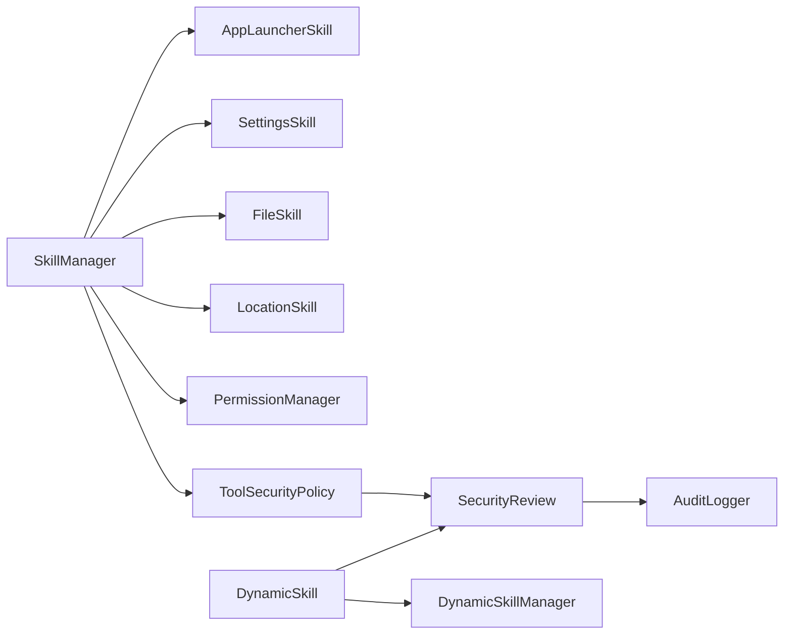

# 设备控制类技能

<cite>
**本文档引用的文件**
- [AppLauncherSkill.kt](file://app/src/main/java/ai/openclaw/android/skill/builtin/AppLauncherSkill.kt)
- [SettingsSkill.kt](file://app/src/main/java/ai/openclaw/android/skill/builtin/SettingsSkill.kt)
- [FileSkill.kt](file://app/src/main/java/ai/openclaw/android/skill/builtin/FileSkill.kt)
- [LocationSkill.kt](file://app/src/main/java/ai/openclaw/android/skill/builtin/LocationSkill.kt)
- [Skill.kt](file://app/src/main/java/ai/openclaw/android/skill/Skill.kt)
- [SkillTool.kt](file://app/src/main/java/ai/openclaw/android/skill/SkillTool.kt)
- [ToolSecurityPolicy.kt](file://app/src/main/java/ai/openclaw/android/skill/ToolSecurityPolicy.kt)
- [SkillManager.kt](file://app/src/main/java/ai/openclaw/android/skill/SkillManager.kt)
- [PermissionManager.kt](file://app/src/main/java/ai/openclaw/android/permission/PermissionManager.kt)
- [DynamicSkill.kt](file://app/src/main/java/ai/openclaw/android/skill/DynamicSkill.kt)
- [DynamicSkillManager.kt](file://app/src/main/java/ai/openclaw/android/skill/DynamicSkillManager.kt)
- [SkillContext.kt](file://app/src/main/java/ai/openclaw/android/skill/SkillContext.kt)
- [AndroidManifest.xml](file://app/src/main/AndroidManifest.xml)
- [README.md](file://README.md)
- [AuditLogger.kt](file://app/src/main/java/ai/openclaw/android/security/AuditLogger.kt)
</cite>

## 目录
1. [简介](#简介)
2. [项目结构](#项目结构)
3. [核心组件](#核心组件)
4. [架构总览](#架构总览)
5. [详细组件分析](#详细组件分析)
6. [依赖关系分析](#依赖关系分析)
7. [性能考量](#性能考量)
8. [故障排查指南](#故障排查指南)
9. [结论](#结论)
10. [附录](#附录)

## 简介
本文件聚焦设备控制类技能，围绕以下四类核心能力进行深入技术说明：
- 应用启动器：应用发现、启动流程与权限检查
- 系统设置：系统设置访问、设置项读取与修改实现
- 文件技能：文件系统操作、读写权限与目录浏览
- 位置技能：GPS定位、地址解析与地图集成

文档同时阐述技能的实现原理、Android 设备 API 调用、权限配置与安全限制、错误处理与兼容性策略，并提供扩展开发指南。

## 项目结构
设备控制类技能位于技能系统模块中，采用统一的 Skill 接口与 SkillManager 管理器进行加载与执行。权限管理由 PermissionManager 负责，安全策略通过 ToolSecurityPolicy 与 SecurityReview 实现。

**图表来源**
- [SkillManager.kt:13-33](file://app/src/main/java/ai/openclaw/android/skill/SkillManager.kt#L13-L33)
- [AppLauncherSkill.kt:8-27](file://app/src/main/java/ai/openclaw/android/skill/builtin/AppLauncherSkill.kt#L8-L27)
- [SettingsSkill.kt:14-41](file://app/src/main/java/ai/openclaw/android/skill/builtin/SettingsSkill.kt#L14-L41)
- [FileSkill.kt:30-82](file://app/src/main/java/ai/openclaw/android/skill/builtin/FileSkill.kt#L30-L82)
- [LocationSkill.kt:18-37](file://app/src/main/java/ai/openclaw/android/skill/builtin/LocationSkill.kt#L18-L37)
- [PermissionManager.kt:32-88](file://app/src/main/java/ai/openclaw/android/permission/PermissionManager.kt#L32-L88)
- [ToolSecurityPolicy.kt:44-71](file://app/src/main/java/ai/openclaw/android/skill/ToolSecurityPolicy.kt#L44-L71)
- [AuditLogger.kt:16-38](file://app/src/main/java/ai/openclaw/android/security/AuditLogger.kt#L16-L38)

**章节来源**
- [README.md:137-152](file://README.md#L137-L152)
- [SkillManager.kt:13-33](file://app/src/main/java/ai/openclaw/android/skill/SkillManager.kt#L13-L33)

## 核心组件
- Skill 接口：定义技能标识、描述、版本、工具集合及生命周期方法
- SkillTool 接口：定义工具名称、参数规范与异步执行
- SkillContext：提供应用上下文与 HTTP 客户端
- SkillManager：负责内置技能注册、工具聚合、权限检查与执行调度
- PermissionManager：统一权限请求、状态查询与特殊权限处理
- ToolSecurityPolicy/SecurityReview：基于幂等性与用户偏好的安全策略
- AuditLogger：安全审计日志，记录关键操作并维护链式哈希校验

**章节来源**
- [Skill.kt:3-12](file://app/src/main/java/ai/openclaw/android/skill/Skill.kt#L3-L12)
- [SkillTool.kt:3-22](file://app/src/main/java/ai/openclaw/android/skill/SkillTool.kt#L3-L22)
- [SkillContext.kt:6-9](file://app/src/main/java/ai/openclaw/android/skill/SkillContext.kt#L6-L9)
- [SkillManager.kt:8-33](file://app/src/main/java/ai/openclaw/android/skill/SkillManager.kt#L8-L33)
- [PermissionManager.kt:32-88](file://app/src/main/java/ai/openclaw/android/permission/PermissionManager.kt#L32-L88)
- [ToolSecurityPolicy.kt:4-13](file://app/src/main/java/ai/openclaw/android/skill/ToolSecurityPolicy.kt#L4-L13)
- [AuditLogger.kt:16-38](file://app/src/main/java/ai/openclaw/android/security/AuditLogger.kt#L16-L38)

## 架构总览
设备控制类技能遵循统一的技能框架：SkillManager 负责加载内置技能，执行时先进行权限检查，再调用具体工具的 execute 方法。权限管理由 PermissionManager 统一处理，安全策略通过 ToolSecurityPolicy 与 SecurityReview 控制工具执行。

**图表来源**
- [SkillManager.kt:62-83](file://app/src/main/java/ai/openclaw/android/skill/SkillManager.kt#L62-L83)
- [PermissionManager.kt:41-70](file://app/src/main/java/ai/openclaw/android/permission/PermissionManager.kt#L41-L70)

**章节来源**
- [SkillManager.kt:89-138](file://app/src/main/java/ai/openclaw/android/skill/SkillManager.kt#L89-L138)
- [PermissionManager.kt:32-88](file://app/src/main/java/ai/openclaw/android/permission/PermissionManager.kt#L32-L88)

## 详细组件分析

### 应用启动器技能（AppLauncherSkill）
- 功能概述
  - 打开应用：支持按应用名称或包名启动
  - 列出应用：枚举系统可启动应用，支持关键词过滤
- 关键实现点
  - 应用发现：通过 PackageManager 查询带 LAUNCHER 类别的活动
  - 启动流程：构造 Intent，设置 FLAG_ACTIVITY_NEW_TASK 启动
  - 兼容性：针对不同 SDK 版本使用 queryIntentActivities 的不同重载
  - 匹配策略：优先精确匹配，否则选择首个匹配项
- 权限与限制
  - 无需特殊权限即可查询与启动已安装应用
  - 若目标应用未提供启动入口，将返回“未找到应用”
- 错误处理
  - 输入参数校验、异常捕获与友好提示
- 性能与体验
  - 列表限制展示数量，避免一次性输出过多
  - 使用异步执行，避免阻塞主线程

**图表来源**
- [AppLauncherSkill.kt:45-125](file://app/src/main/java/ai/openclaw/android/skill/builtin/AppLauncherSkill.kt#L45-L125)
- [AppLauncherSkill.kt:139-182](file://app/src/main/java/ai/openclaw/android/skill/builtin/AppLauncherSkill.kt#L139-L182)

**章节来源**
- [AppLauncherSkill.kt:8-193](file://app/src/main/java/ai/openclaw/android/skill/builtin/AppLauncherSkill.kt#L8-L193)

### 系统设置技能（SettingsSkill）
- 功能概述
  - 打开系统设置：支持多种设置页面（WiFi、蓝牙、声音、显示、关于、位置、存储、电池、应用、无障碍、安全、日期、语言、开发者选项）
  - 蓝牙控制：Android 13+ 无法直接切换，改为打开设置页面
  - 音量控制：支持调高、调低、静音、取消静音、设置具体音量，支持多种音频流
- 关键实现点
  - 设置页面：通过 Intent ACTION_* 打开对应设置页
  - 蓝牙开关：利用 BluetoothManager/BluetoothAdapter，在高版本回退到设置页
  - 音量控制：通过 AudioManager 调整音量，兼容不同 Android 版本的静音 API
- 权限与限制
  - 音量控制通常无需权限
  - 蓝牙开关在部分版本受系统限制，需用户手动操作
- 错误处理
  - 权限不足时回退到设置页
  - 异常捕获并返回可读错误信息

**图表来源**
- [SettingsSkill.kt:171-223](file://app/src/main/java/ai/openclaw/android/skill/builtin/SettingsSkill.kt#L171-L223)
- [SettingsSkill.kt:99-147](file://app/src/main/java/ai/openclaw/android/skill/builtin/SettingsSkill.kt#L99-L147)

**章节来源**
- [SettingsSkill.kt:14-234](file://app/src/main/java/ai/openclaw/android/skill/builtin/SettingsSkill.kt#L14-L234)

### 文件技能（FileSkill）
- 功能概述
  - 读取文件：支持 UTF-8 文本读取，限制最大读取字符数
  - 写入文件：支持覆盖与追加模式，自动创建父目录
  - 列出目录：支持外部与内部存储区分，显示文件/目录与大小
- 存储策略与路径规则
  - 外部专属目录：应用专属存储，卸载时清理，用户可访问
  - 内部专属目录：应用私有存储
  - 路径映射：~ 映射到外部根；~/internal 映射到内部根；/sdcard/ 与 /storage/ 重定向到外部根
- 权限与限制
  - 无需特殊权限即可访问应用专属存储
  - 读取限制单次最多约 500KB（字符数上限）
  - 不支持二进制文件
- 错误处理
  - 文件不存在、路径非文件、权限不足、IO 异常均返回明确错误信息
- 性能与体验
  - 读取截断与字符数限制避免大文件阻塞
  - 目录排序与图标提示提升可读性

**图表来源**
- [FileSkill.kt:103-140](file://app/src/main/java/ai/openclaw/android/skill/builtin/FileSkill.kt#L103-L140)
- [FileSkill.kt:167-197](file://app/src/main/java/ai/openclaw/android/skill/builtin/FileSkill.kt#L167-L197)
- [FileSkill.kt:214-246](file://app/src/main/java/ai/openclaw/android/skill/builtin/FileSkill.kt#L214-L246)

**章节来源**
- [FileSkill.kt:30-310](file://app/src/main/java/ai/openclaw/android/skill/builtin/FileSkill.kt#L30-L310)

### 位置技能（LocationSkill）
- 功能概述
  - 获取当前位置：优先 GPS，其次网络定位
  - 地址解析：逆地理编码，使用 OpenStreetMap Nominatim
  - 地点搜索：基于 OpenStreetMap 的地点搜索（Nominatim）
- 关键实现点
  - 定位：使用 LocationManager 请求位置更新，支持超时与最后已知位置回退
  - 权限：检查 ACCESS_FINE_LOCATION 与 ACCESS_COARSE_LOCATION
  - 地图：通过 HTTP 客户端调用 Nominatim API，解析 JSON 结果
- 权限与限制
  - 需要位置权限，未授权时返回提示
  - 定位服务未启用时返回无法获取位置
- 错误处理
  - 网络异常、HTTP 错误、JSON 解析失败均有明确错误反馈

**图表来源**
- [LocationSkill.kt:44-59](file://app/src/main/java/ai/openclaw/android/skill/builtin/LocationSkill.kt#L44-L59)
- [LocationSkill.kt:117-146](file://app/src/main/java/ai/openclaw/android/skill/builtin/LocationSkill.kt#L117-L146)
- [LocationSkill.kt:178-225](file://app/src/main/java/ai/openclaw/android/skill/builtin/LocationSkill.kt#L178-L225)

**章节来源**
- [LocationSkill.kt:18-255](file://app/src/main/java/ai/openclaw/android/skill/builtin/LocationSkill.kt#L18-L255)

## 依赖关系分析
- 技能注册与执行
  - SkillManager 在初始化时注册内置技能，暴露 getAllTools 与 executeTool
  - executeTool 前先检查技能所需权限，再调用工具执行
- 权限依赖
  - SkillManager.getRequiredPermissionsForSkill 为特定技能返回所需权限数组
  - PermissionManager 提供统一权限请求与状态查询，支持特殊权限（如 MANAGE_EXTERNAL_STORAGE）
- 安全策略
  - ToolSecurityPolicy 定义三种策略：自动执行、询问用户、拒绝
  - SecurityReview 基于幂等性与用户偏好决定策略
- 动态技能
  - DynamicSkill/DynamicTool 支持从 JSON 动态注册技能，执行前进行安全审查
  - DynamicSkillManager 负责持久化、启用/停用与定期维护

**图表来源**
- [SkillManager.kt:16-33](file://app/src/main/java/ai/openclaw/android/skill/SkillManager.kt#L16-L33)
- [PermissionManager.kt:114-153](file://app/src/main/java/ai/openclaw/android/permission/PermissionManager.kt#L114-L153)
- [ToolSecurityPolicy.kt:44-71](file://app/src/main/java/ai/openclaw/android/skill/ToolSecurityPolicy.kt#L44-L71)
- [DynamicSkillManager.kt:63-96](file://app/src/main/java/ai/openclaw/android/skill/DynamicSkillManager.kt#L63-L96)

**章节来源**
- [SkillManager.kt:89-138](file://app/src/main/java/ai/openclaw/android/skill/SkillManager.kt#L89-L138)
- [PermissionManager.kt:114-153](file://app/src/main/java/ai/openclaw/android/permission/PermissionManager.kt#L114-L153)
- [DynamicSkill.kt:153-193](file://app/src/main/java/ai/openclaw/android/skill/DynamicSkill.kt#L153-L193)

## 性能考量
- 应用启动器
  - 列表查询使用分页提示（前 50 项），避免一次性输出过多
  - 匹配策略优先精确匹配，减少启动失败概率
- 系统设置
  - 音量调整使用系统 API，即时生效且无额外网络开销
  - 蓝牙开关在高版本回退到设置页，避免无效尝试
- 文件技能
  - 读取字符数上限与大小检查，防止大文件阻塞
  - 目录遍历排序与图标提示，提升可读性
- 位置技能
  - 定位优先 GPS，网络作为回退，缩短等待时间
  - HTTP 请求设置超时，避免长时间阻塞

[本节为通用性能建议，不直接分析具体文件]

## 故障排查指南
- 权限相关
  - 位置技能：确认已授予 ACCESS_FINE_LOCATION 或 ACCESS_COARSE_LOCATION
  - 文件技能：应用专属存储无需权限，若涉及外部存储请确认 MANAGE_EXTERNAL_STORAGE
  - 蓝牙控制：Android 13+ 无法直接切换，需用户手动设置
- 执行失败
  - 检查 SkillManager 返回的缺失权限信息
  - 使用 PermissionManager.resolveRequest 提供授权结果
- 审计与日志
  - 使用 AuditLogger.export 查看审计日志，verifyChain 校验链完整性
- 动态技能
  - 确认 DynamicSkillManager.runMaintenance 定期执行，避免技能被停用或删除

**章节来源**
- [SkillManager.kt:89-107](file://app/src/main/java/ai/openclaw/android/skill/SkillManager.kt#L89-L107)
- [PermissionManager.kt:64-70](file://app/src/main/java/ai/openclaw/android/permission/PermissionManager.kt#L64-L70)
- [AuditLogger.kt:62-78](file://app/src/main/java/ai/openclaw/android/security/AuditLogger.kt#L62-L78)
- [DynamicSkillManager.kt:122-147](file://app/src/main/java/ai/openclaw/android/skill/DynamicSkillManager.kt#L122-L147)

## 结论
设备控制类技能通过统一的技能框架实现了应用启动、系统设置、文件操作与位置服务的核心能力。结合权限管理与安全策略，既保证了易用性，又强化了安全性与稳定性。未来可在以下方面持续优化：
- 增强位置服务的离线能力与缓存策略
- 优化文件读写的并发与缓存机制
- 扩展动态技能的权限声明与沙箱隔离

[本节为总结性内容，不直接分析具体文件]

## 附录

### 权限清单与用途
- 互联网与网络状态：用于位置技能的地图 API 调用
- 精细/粗略位置：位置技能必须权限
- 日历读写：日历技能
- 通讯录读取：联系人技能
- 短信发送/读取：短信技能
- 精确闹钟：提醒技能
- 外部存储管理：本地模型与文件存储
- 录音与相机：语音与图像输入
- 通知监听：通知技能

**章节来源**
- [AndroidManifest.xml:13-49](file://app/src/main/AndroidManifest.xml#L13-L49)

### 扩展开发指南
- 新增技能步骤
  - 实现 Skill 接口，定义 tools 列表
  - 在 SkillManager 中注册技能
  - 如需权限，在 SkillManager.getRequiredPermissionsForSkill 中声明
  - 如需网络请求，使用 SkillContext.httpClient
- 安全策略
  - 对非幂等操作使用 ToolSecurityPolicy.ASK_USER
  - 通过 SecurityReview.reviewTool 决策执行策略
- 动态技能
  - 使用 DynamicSkill.fromJson 从 JSON 创建技能
  - 通过 DynamicSkillManager 持久化与生命周期管理

**章节来源**
- [Skill.kt:3-12](file://app/src/main/java/ai/openclaw/android/skill/Skill.kt#L3-L12)
- [SkillManager.kt:40-48](file://app/src/main/java/ai/openclaw/android/skill/SkillManager.kt#L40-L48)
- [ToolSecurityPolicy.kt:44-71](file://app/src/main/java/ai/openclaw/android/skill/ToolSecurityPolicy.kt#L44-L71)
- [DynamicSkill.kt:54-107](file://app/src/main/java/ai/openclaw/android/skill/DynamicSkill.kt#L54-L107)
- [DynamicSkillManager.kt:63-96](file://app/src/main/java/ai/openclaw/android/skill/DynamicSkillManager.kt#L63-L96)