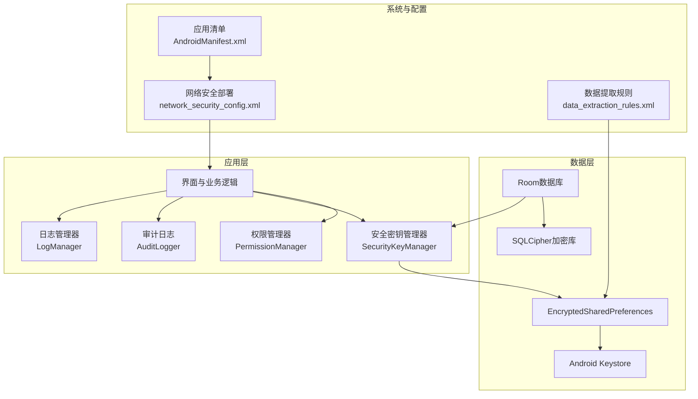
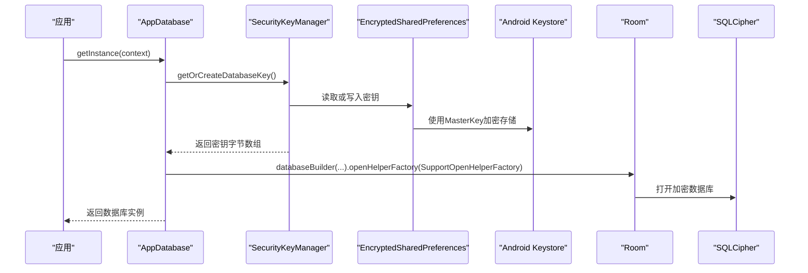
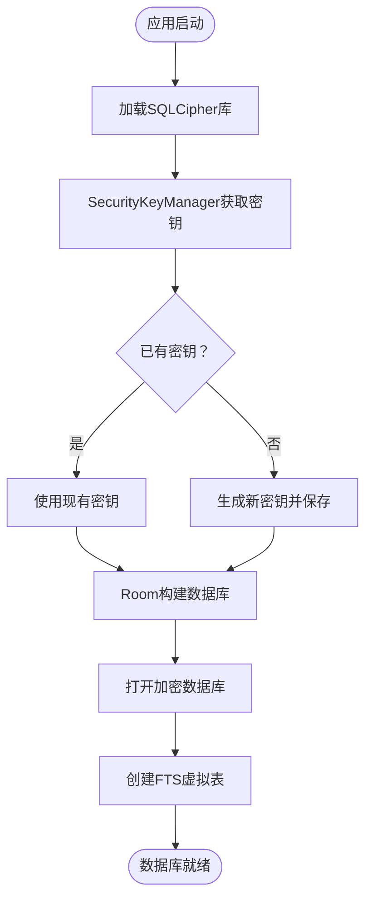
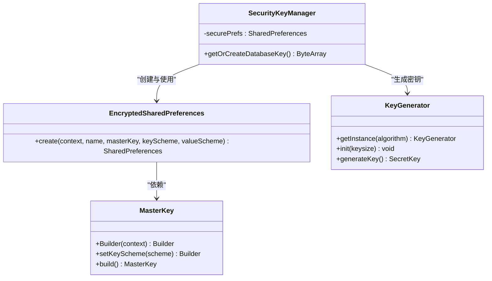
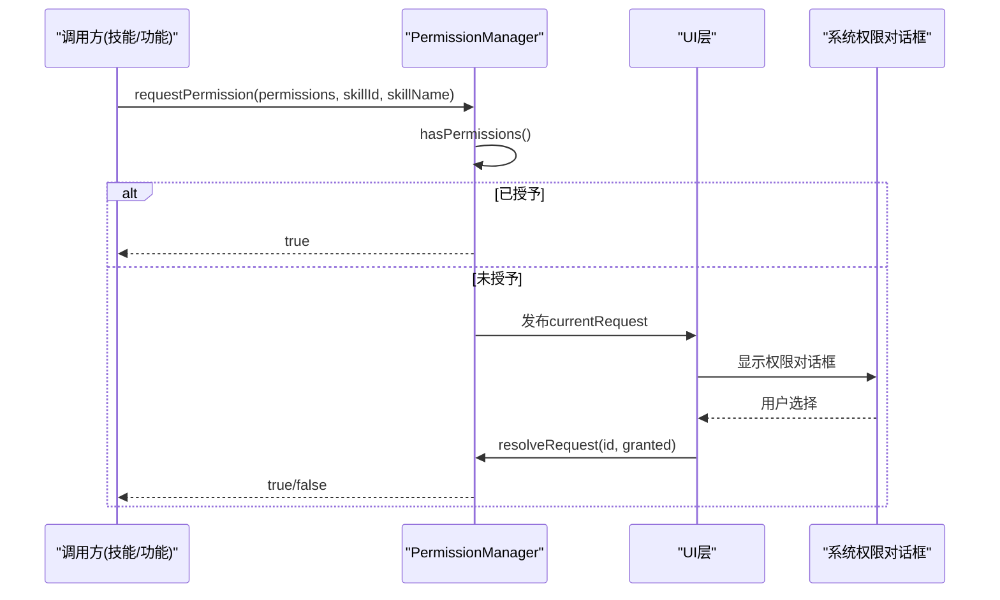
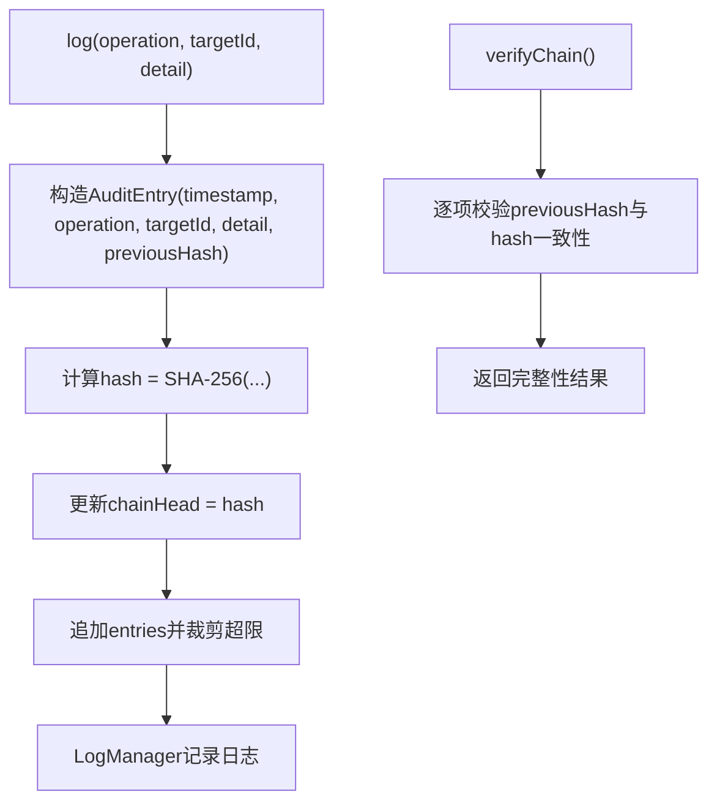
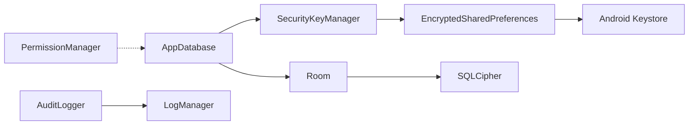

# 安全与隐私

<cite>
**本文引用的文件**
- [AppDatabase.kt](file://app/src/main/java/ai/openclaw/android/data/local/AppDatabase.kt)
- [SecurityKeyManager.kt](file://app/src/main/java/ai/openclaw/android/security/SecurityKeyManager.kt)
- [AuditLogger.kt](file://app/src/main/java/ai/openclaw/android/security/AuditLogger.kt)
- [PermissionManager.kt](file://app/src/main/java/ai/openclaw/android/permission/PermissionManager.kt)
- [LogManager.kt](file://app/src/main/java/ai/openclaw/android/LogManager.kt)
- [network_security_config.xml](file://app/src/main/res/xml/network_security_config.xml)
- [AndroidManifest.xml](file://app/src/main/AndroidManifest.xml)
- [data_extraction_rules.xml](file://app/src/main/res/xml/data_extraction_rules.xml)
- [ToolSecurityPolicy.kt](file://app/src/main/java/ai/openclaw/android/skill/ToolSecurityPolicy.kt)
- [build.gradle.kts](file://app/build.gradle.kts)
- [SecurityReviewTest.kt](file://app/src/test/java/ai/openclaw/android/skill/SecurityReviewTest.kt)
</cite>

## 目录
1. [引言](#引言)
2. [项目结构](#项目结构)
3. [核心组件](#核心组件)
4. [架构总览](#架构总览)
5. [详细组件分析](#详细组件分析)
6. [依赖关系分析](#依赖关系分析)
7. [性能考量](#性能考量)
8. [故障排查指南](#故障排查指南)
9. [结论](#结论)
10. [附录](#附录)

## 引言
本文件聚焦于OpenClaw Android应用中的“安全与隐私”模块，系统性阐述以下内容：
- SQLCipher数据库加密的实现原理、配置与使用路径
- Android Keystore与EncryptedSharedPreferences在密钥管理与安全存储中的角色
- 配置管理与敏感信息保护策略
- 权限管理系统与运行时权限处理流程
- 安全审计日志与合规性考虑
- 威胁防护与漏洞修复建议
- 隐私保护设计原则与数据最小化策略
- 安全加固与合规检查实施指南

## 项目结构
围绕安全与隐私的关键代码与资源分布如下：
- 数据库与加密：Room数据库、SQLCipher集成、密钥管理
- 权限管理：运行时权限请求与状态查询
- 审计日志：内存系统操作的链式哈希审计
- 网络与备份：网络安全配置、数据提取规则
- 日志中心：统一日志收集与输出

图表来源
- [AppDatabase.kt:132-155](file://app/src/main/java/ai/openclaw/android/data/local/AppDatabase.kt#L132-L155)
- [SecurityKeyManager.kt:31-44](file://app/src/main/java/ai/openclaw/android/security/SecurityKeyManager.kt#L31-L44)
- [network_security_config.xml:1-8](file://app/src/main/res/xml/network_security_config.xml#L1-L8)
- [data_extraction_rules.xml:1-7](file://app/src/main/res/xml/data_extraction_rules.xml#L1-L7)
- [AndroidManifest.xml:47-58](file://app/src/main/AndroidManifest.xml#L47-L58)

章节来源
- [AppDatabase.kt:132-155](file://app/src/main/java/ai/openclaw/android/data/local/AppDatabase.kt#L132-L155)
- [SecurityKeyManager.kt:31-44](file://app/src/main/java/ai/openclaw/android/security/SecurityKeyManager.kt#L31-L44)
- [network_security_config.xml:1-8](file://app/src/main/res/xml/network_security_config.xml#L1-L8)
- [data_extraction_rules.xml:1-7](file://app/src/main/res/xml/data_extraction_rules.xml#L1-L7)
- [AndroidManifest.xml:47-58](file://app/src/main/AndroidManifest.xml#L47-L58)

## 核心组件
- SQLCipher数据库加密与Room集成：通过Room的openHelperFactory注入SQLCipher工厂，并由SecurityKeyManager提供密钥。
- Android Keystore与EncryptedSharedPreferences：用于生成并安全持久化256位AES密钥，作为SQLCipher口令。
- 审计日志：对内存系统关键操作进行链式哈希记录，支持完整性校验与导出。
- 权限管理：统一的运行时权限请求、状态查询与特殊权限处理。
- 网络与备份策略：禁用明文流量、限制云端备份范围。

章节来源
- [AppDatabase.kt:132-155](file://app/src/main/java/ai/openclaw/android/data/local/AppDatabase.kt#L132-L155)
- [SecurityKeyManager.kt:51-67](file://app/src/main/java/ai/openclaw/android/security/SecurityKeyManager.kt#L51-L67)
- [AuditLogger.kt:41-78](file://app/src/main/java/ai/openclaw/android/security/AuditLogger.kt#L41-L78)
- [PermissionManager.kt:41-109](file://app/src/main/java/ai/openclaw/android/permission/PermissionManager.kt#L41-L109)
- [network_security_config.xml:1-8](file://app/src/main/res/xml/network_security_config.xml#L1-L8)

## 架构总览
下图展示从应用启动到数据库打开的端到端安全路径，包括密钥获取、数据库初始化与审计日志联动。

图表来源
- [AppDatabase.kt:132-155](file://app/src/main/java/ai/openclaw/android/data/local/AppDatabase.kt#L132-L155)
- [SecurityKeyManager.kt:51-67](file://app/src/main/java/ai/openclaw/android/security/SecurityKeyManager.kt#L51-L67)

## 详细组件分析

### 组件A：SQLCipher数据库加密与配置
- 实现要点
  - 应用启动时加载SQLCipher原生库。
  - 通过SecurityKeyManager生成或读取256位AES密钥，作为数据库口令。
  - 使用Room的openHelperFactory注入SQLCipher工厂，完成数据库打开。
  - 在数据库打开回调中创建FTS虚拟表，便于后续检索。
- 复杂度与性能
  - 密钥读取为O(1)，数据库打开涉及I/O与解密，通常在应用启动阶段异步进行。
  - 迁移脚本与索引创建在首次打开时执行，注意避免阻塞主线程。
- 错误处理
  - 若密钥损坏或被篡改，数据库无法打开；应捕获异常并提示用户重置或联系支持。
  - 迁移失败时启用降级重建策略，需配合审计日志追踪问题。

图表来源
- [AppDatabase.kt:45-47](file://app/src/main/java/ai/openclaw/android/data/local/AppDatabase.kt#L45-L47)
- [AppDatabase.kt:132-155](file://app/src/main/java/ai/openclaw/android/data/local/AppDatabase.kt#L132-L155)
- [SecurityKeyManager.kt:51-67](file://app/src/main/java/ai/openclaw/android/security/SecurityKeyManager.kt#L51-L67)

章节来源
- [AppDatabase.kt:45-47](file://app/src/main/java/ai/openclaw/android/data/local/AppDatabase.kt#L45-L47)
- [AppDatabase.kt:132-155](file://app/src/main/java/ai/openclaw/android/data/local/AppDatabase.kt#L132-L155)
- [SecurityKeyManager.kt:51-67](file://app/src/main/java/ai/openclaw/android/security/SecurityKeyManager.kt#L51-L67)

### 组件B：Android Keystore与密钥管理
- 实现要点
  - 使用MasterKey生成AES256_GCM主密钥，创建EncryptedSharedPreferences。
  - 将32字节随机AES密钥Base64编码后持久化，避免直接暴露明文。
  - 后续启动直接读取并解码，确保密钥与设备绑定且不落盘明文。
- 安全性
  - 密钥位于Keystore中，受系统安全边界保护。
  - EncryptedSharedPreferences提供键值加密方案，防止本地篡改。
- 复杂度
  - 密钥生成与存储为一次性操作，读取为常量时间。

图表来源
- [SecurityKeyManager.kt:31-44](file://app/src/main/java/ai/openclaw/android/security/SecurityKeyManager.kt#L31-L44)
- [SecurityKeyManager.kt:51-67](file://app/src/main/java/ai/openclaw/android/security/SecurityKeyManager.kt#L51-L67)

章节来源
- [SecurityKeyManager.kt:31-44](file://app/src/main/java/ai/openclaw/android/security/SecurityKeyManager.kt#L31-L44)
- [SecurityKeyManager.kt:51-67](file://app/src/main/java/ai/openclaw/android/security/SecurityKeyManager.kt#L51-L67)

### 组件C：权限管理与运行时权限处理
- 功能特性
  - 统一的权限请求接口，支持挂起等待与结果回调。
  - 特殊权限（如管理外部存储）通过专用API检测与引导。
  - 提供权限组状态查询，便于UI展示与引导。
- 流程
  - 业务模块调用requestPermission，若已授予则直接返回。
  - 未授予时通过StateFlow通知UI发起系统权限对话框。
  - UI回调resolveRequest，将结果传递给挂起函数。

图表来源
- [PermissionManager.kt:41-70](file://app/src/main/java/ai/openclaw/android/permission/PermissionManager.kt#L41-L70)

章节来源
- [PermissionManager.kt:41-70](file://app/src/main/java/ai/openclaw/android/permission/PermissionManager.kt#L41-L70)
- [PermissionManager.kt:114-153](file://app/src/main/java/ai/openclaw/android/permission/PermissionManager.kt#L114-L153)

### 组件D：安全审计日志
- 设计目标
  - 对内存系统关键操作（存储、删除、合并、同步）进行审计。
  - 采用SHA-256链式哈希，前一项哈希作为后一项输入，保证不可篡改性。
- 关键能力
  - 记录条目上限控制、完整性校验、导出为可读文本。
  - 与LogManager联动，同时输出到系统日志与内部缓冲。
- 复杂度
  - 校验链路为线性扫描，适合离线审计；实时记录为O(1)。

图表来源
- [AuditLogger.kt:41-78](file://app/src/main/java/ai/openclaw/android/security/AuditLogger.kt#L41-L78)

章节来源
- [AuditLogger.kt:41-78](file://app/src/main/java/ai/openclaw/android/security/AuditLogger.kt#L41-L78)
- [LogManager.kt:23-45](file://app/src/main/java/ai/openclaw/android/LogManager.kt#L23-L45)

### 组件E：配置管理与敏感信息保护
- 网络安全
  - 全局禁用明文HTTP，仅信任系统证书。
  - 在应用清单中声明networkSecurityConfig。
- 数据提取与备份
  - 限制云端备份范围，排除设备特定共享偏好。
  - 通过dataExtractionRules控制备份包含/排除策略。
- 构建与签名
  - 统一调试签名策略，避免跨项目差异导致的兼容问题。
  - 依赖中引入SQLCipher与安全加密库，确保编译期可用。

章节来源
- [network_security_config.xml:1-8](file://app/src/main/res/xml/network_security_config.xml#L1-L8)
- [AndroidManifest.xml:47-58](file://app/src/main/AndroidManifest.xml#L47-L58)
- [data_extraction_rules.xml:1-7](file://app/src/main/res/xml/data_extraction_rules.xml#L1-L7)
- [build.gradle.kts:162-165](file://app/build.gradle.kts#L162-L165)

### 组件F：工具安全策略与用户审批
- 设计原则
  - 幂等操作可自动执行；非幂等操作根据用户偏好决定是否询问。
  - 支持“始终批准/拒绝/每次询问”的用户偏好决策。
- 测试验证
  - 单元测试覆盖不同偏好下的策略判定，确保逻辑正确性。

章节来源
- [ToolSecurityPolicy.kt:53-70](file://app/src/main/java/ai/openclaw/android/skill/ToolSecurityPolicy.kt#L53-L70)
- [SecurityReviewTest.kt:34-47](file://app/src/test/java/ai/openclaw/android/skill/SecurityReviewTest.kt#L34-L47)

## 依赖关系分析
- 组件耦合
  - AppDatabase依赖SecurityKeyManager提供密钥；SecurityKeyManager依赖EncryptedSharedPreferences与Keystore。
  - AuditLogger依赖LogManager输出日志；权限管理独立于数据库但影响功能可用性。
- 外部依赖
  - SQLCipher、Room、AndroidX Security Crypto、OkHttp等。

图表来源
- [AppDatabase.kt:132-155](file://app/src/main/java/ai/openclaw/android/data/local/AppDatabase.kt#L132-L155)
- [SecurityKeyManager.kt:31-44](file://app/src/main/java/ai/openclaw/android/security/SecurityKeyManager.kt#L31-L44)
- [AuditLogger.kt:41-59](file://app/src/main/java/ai/openclaw/android/security/AuditLogger.kt#L41-L59)
- [LogManager.kt:23-45](file://app/src/main/java/ai/openclaw/android/LogManager.kt#L23-L45)

章节来源
- [AppDatabase.kt:132-155](file://app/src/main/java/ai/openclaw/android/data/local/AppDatabase.kt#L132-L155)
- [SecurityKeyManager.kt:31-44](file://app/src/main/java/ai/openclaw/android/security/SecurityKeyManager.kt#L31-L44)
- [AuditLogger.kt:41-59](file://app/src/main/java/ai/openclaw/android/security/AuditLogger.kt#L41-L59)
- [LogManager.kt:23-45](file://app/src/main/java/ai/openclaw/android/LogManager.kt#L23-L45)

## 性能考量
- 数据库打开与迁移
  - 将大表迁移与FTS创建放在数据库打开回调中，避免阻塞主线程。
  - 控制审计日志条目上限，减少内存占用与序列化成本。
- 密钥访问
  - 密钥读取为O(1)，建议缓存于进程内以避免重复解密。
- 网络与日志
  - 禁用明文流量降低TLS握手与中间人风险；日志缓冲大小限制防止内存膨胀。

## 故障排查指南
- 数据库无法打开
  - 检查密钥是否被篡改或丢失；查看审计日志完整性；必要时清理应用数据并重新初始化。
- 权限未生效
  - 确认UI层正确调用resolveRequest；检查特殊权限（如管理外部存储）是否需要跳转系统设置页。
- 审计日志异常
  - verifyChain返回false时，优先检查是否有截断或篡改；导出日志进行人工核验。
- 网络连接失败
  - 确认network_security_config未被覆盖；检查证书链与域名白名单。

章节来源
- [AuditLogger.kt:69-78](file://app/src/main/java/ai/openclaw/android/security/AuditLogger.kt#L69-L78)
- [PermissionManager.kt:64-70](file://app/src/main/java/ai/openclaw/android/permission/PermissionManager.kt#L64-L70)
- [network_security_config.xml:1-8](file://app/src/main/res/xml/network_security_config.xml#L1-L8)

## 结论
本项目通过SQLCipher与Android Keystore实现数据库强加密，结合EncryptedSharedPreferences与MasterKey保障密钥安全；通过统一的权限管理器与工具安全策略，实现运行时权限与用户审批的可控执行；借助审计日志与网络安全配置，形成从数据到传输的多层防护。建议持续完善自动化测试与合规检查流程，确保安全策略在版本迭代中保持一致。

## 附录
- 隐私保护设计原则
  - 最小化采集：仅收集实现功能所必需的数据。
  - 透明与可撤销：向用户清晰说明用途，并提供撤销同意的途径。
  - 加密存储与传输：默认启用加密，禁用明文。
- 合规检查清单
  - 数据最小化与目的限制
  - 权限最小化与动态申请
  - 审计日志完整性与可追溯性
  - 网络安全配置与证书固定
  - 云端备份范围与敏感数据脱敏