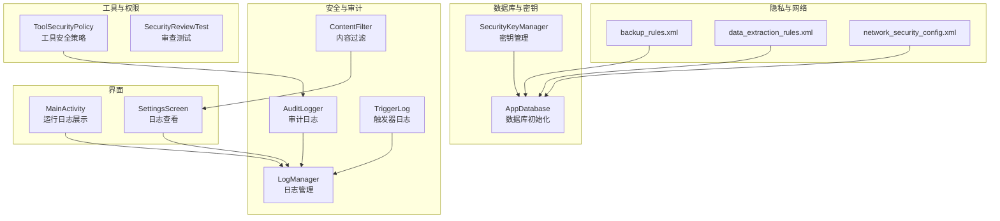
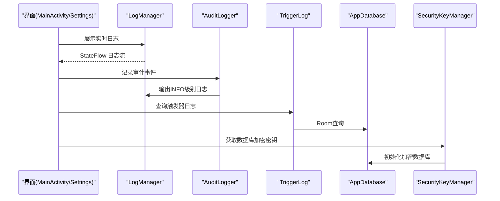
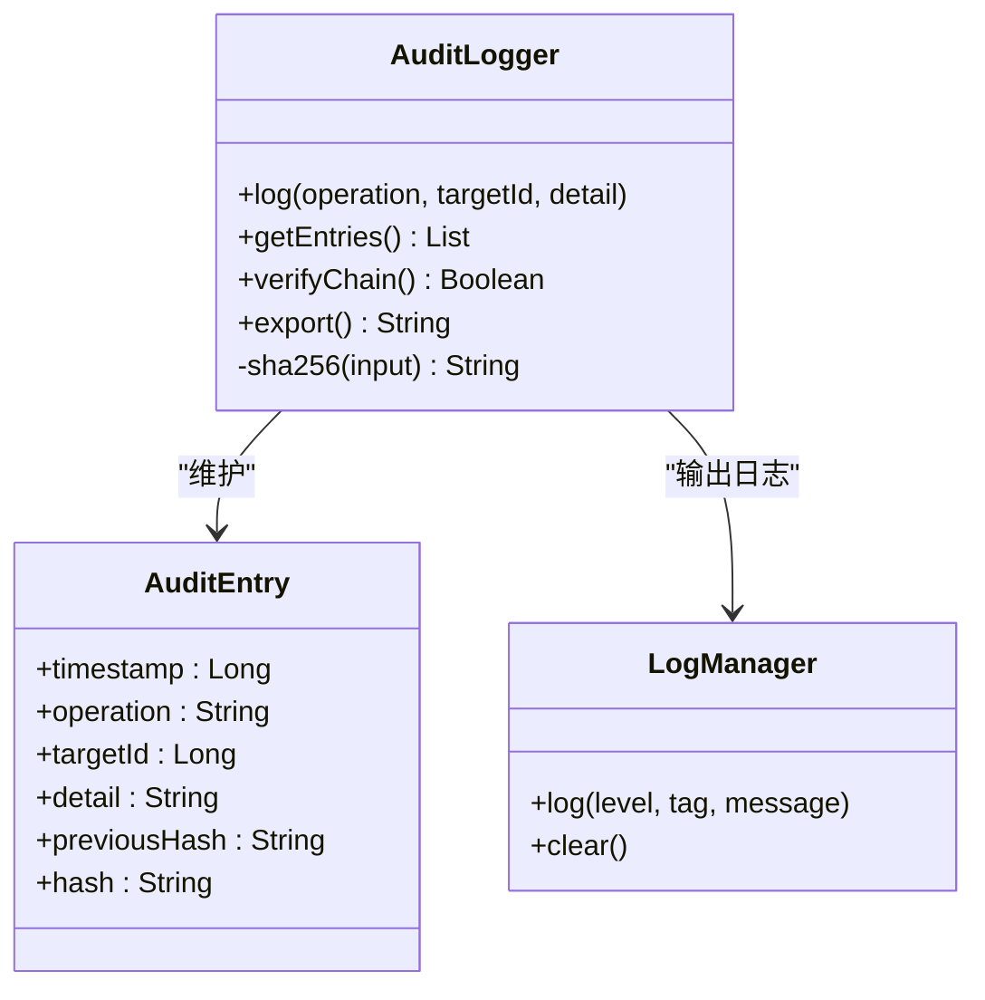
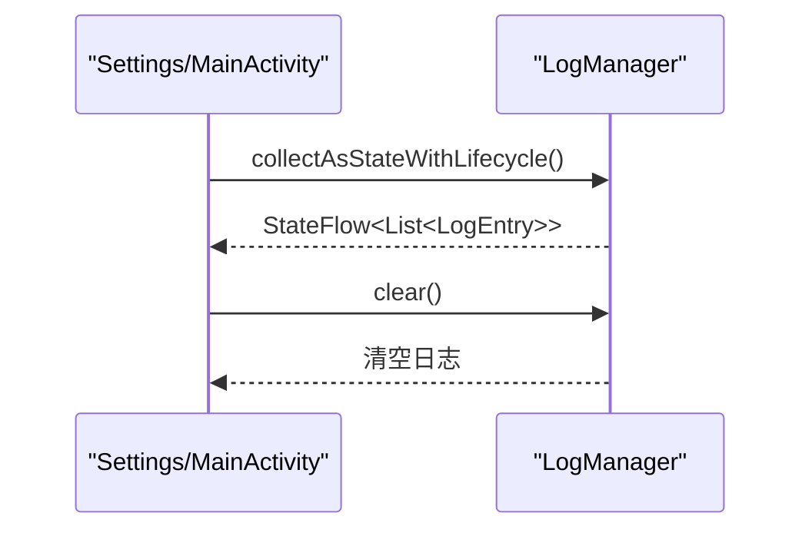
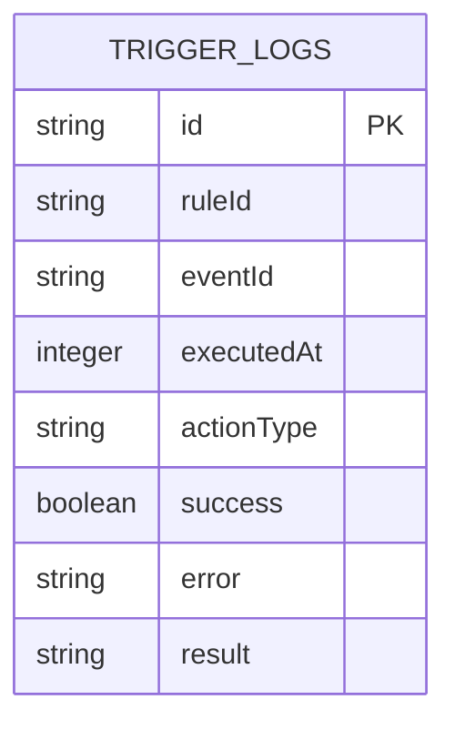
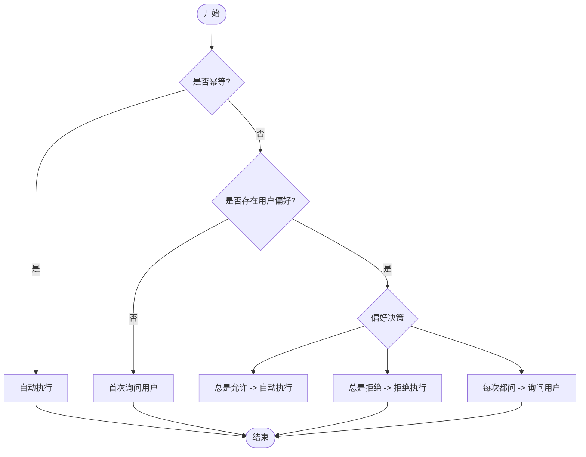
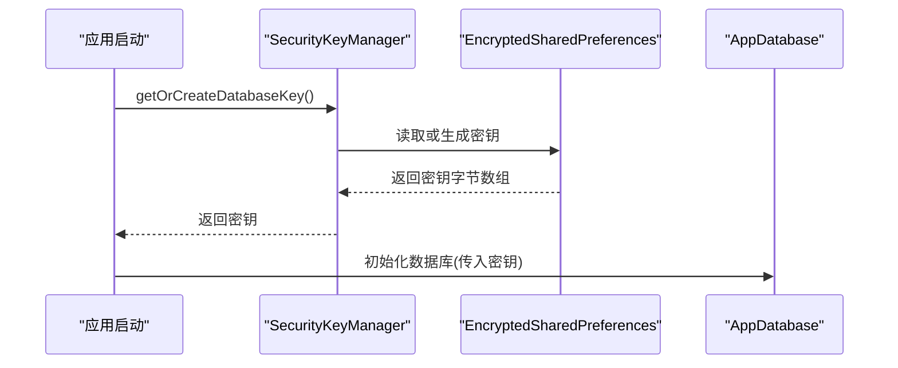
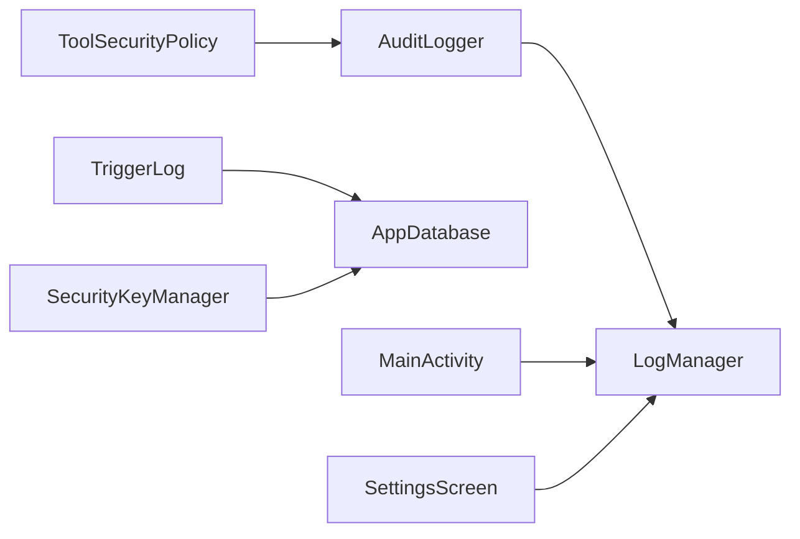

# 安全审计与合规

<cite>
**本文引用的文件**
- [AuditLogger.kt](file://app/src/main/java/ai/openclaw/android/security/AuditLogger.kt)
- [SecurityKeyManager.kt](file://app/src/main/java/ai/openclaw/android/security/SecurityKeyManager.kt)
- [ToolSecurityPolicy.kt](file://app/src/main/java/ai/openclaw/android/skill/ToolSecurityPolicy.kt)
- [SecurityReviewTest.kt](file://app/src/test/java/ai/openclaw/android/skill/SecurityReviewTest.kt)
- [LogManager.kt](file://app/src/main/java/ai/openclaw/android/LogManager.kt)
- [MainActivity.kt](file://app/src/main/java/ai/openclaw/android/MainActivity.kt)
- [SettingsScreen.kt](file://app/src/main/java/ai/openclaw/android/ui/SettingsScreen.kt)
- [TriggerLog.kt](file://app/src/main/java/ai/openclaw/android/trigger/models/TriggerLog.kt)
- [AppDatabase.kt](file://app/src/main/java/ai/openclaw/android/data/local/AppDatabase.kt)
- [ContentFilter.kt](file://app/src/main/java/ai/openclaw/android/personalcenter/ContentFilter.kt)
- [backup_rules.xml](file://app/src/main/res/xml/backup_rules.xml)
- [data_extraction_rules.xml](file://app/src/main/res/xml/data_extraction_rules.xml)
- [network_security_config.xml](file://app/src/main/res/xml/network_security_config.xml)
</cite>

## 目录
1. [引言](#引言)
2. [项目结构](#项目结构)
3. [核心组件](#核心组件)
4. [架构总览](#架构总览)
5. [详细组件分析](#详细组件分析)
6. [依赖关系分析](#依赖关系分析)
7. [性能考量](#性能考量)
8. [故障排查指南](#故障排查指南)
9. [结论](#结论)
10. [附录](#附录)

## 引言
本技术文档聚焦于安全审计与合规模块，围绕以下目标展开：  
- 安全事件的日志记录与审计机制  
- 审计日志的格式标准与存储策略  
- 敏感操作的监控与告警机制  
- 合规性检查的自动化流程与报告生成  
- 安全事件的溯源分析与取证支持  
- 合规性评估的标准与检查清单  
- 隐私保护的合规要求与数据处理规范  

通过对代码库中的审计日志、密钥管理、工具安全策略、触发器日志、日志管理器以及隐私与网络安全配置等模块进行系统化梳理，形成面向开发与运维人员的可执行指南。

## 项目结构
与安全审计与合规相关的关键模块分布如下：  
- 安全审计与日志  
  - 审计日志：[AuditLogger.kt](file://app/src/main/java/ai/openclaw/android/security/AuditLogger.kt)  
  - 日志管理：[LogManager.kt](file://app/src/main/java/ai/openclaw/android/LogManager.kt)  
  - 触发器审计：[TriggerLog.kt](file://app/src/main/java/ai/openclaw/android/trigger/models/TriggerLog.kt)  
- 数据库与密钥  
  - 数据库加密密钥管理：[SecurityKeyManager.kt](file://app/src/main/java/ai/openclaw/android/security/SecurityKeyManager.kt)  
  - 数据库初始化与加密：[AppDatabase.kt](file://app/src/main/java/ai/openclaw/android/data/local/AppDatabase.kt)  
- 工具与权限控制  
  - 工具安全策略与审查：[ToolSecurityPolicy.kt](file://app/src/main/java/ai/openclaw/android/skill/ToolSecurityPolicy.kt)  
  - 审查单元测试：[SecurityReviewTest.kt](file://app/src/test/java/ai/openclaw/android/skill/SecurityReviewTest.kt)  
- 隐私与网络安全  
  - 备份与数据提取规则：[backup_rules.xml](file://app/src/main/res/xml/backup_rules.xml)、[data_extraction_rules.xml](file://app/src/main/res/xml/data_extraction_rules.xml)  
  - 网络安全配置：[network_security_config.xml](file://app/src/main/res/xml/network_security_config.xml)  
- 用户界面与展示  
  - 运行日志展示：[MainActivity.kt](file://app/src/main/java/ai/openclaw/android/MainActivity.kt)、[SettingsScreen.kt](file://app/src/main/java/ai/openclaw/android/ui/SettingsScreen.kt)  
- 内容过滤与隐私保护  
  - 噪音内容过滤：[ContentFilter.kt](file://app/src/main/java/ai/openclaw/android/personalcenter/ContentFilter.kt)

**图表来源**
- [AuditLogger.kt:1-100](file://app/src/main/java/ai/openclaw/android/security/AuditLogger.kt#L1-L100)
- [LogManager.kt:1-65](file://app/src/main/java/ai/openclaw/android/LogManager.kt#L1-L65)
- [TriggerLog.kt:1-21](file://app/src/main/java/ai/openclaw/android/trigger/models/TriggerLog.kt#L1-L21)
- [SecurityKeyManager.kt:1-69](file://app/src/main/java/ai/openclaw/android/security/SecurityKeyManager.kt#L1-L69)
- [AppDatabase.kt:114-135](file://app/src/main/java/ai/openclaw/android/data/local/AppDatabase.kt#L114-L135)
- [ToolSecurityPolicy.kt:1-72](file://app/src/main/java/ai/openclaw/android/skill/ToolSecurityPolicy.kt#L1-L72)
- [SecurityReviewTest.kt:1-47](file://app/src/test/java/ai/openclaw/android/skill/SecurityReviewTest.kt#L1-L47)
- [backup_rules.xml:1-5](file://app/src/main/res/xml/backup_rules.xml#L1-L5)
- [data_extraction_rules.xml:1-7](file://app/src/main/res/xml/data_extraction_rules.xml#L1-L7)
- [network_security_config.xml:1-8](file://app/src/main/res/xml/network_security_config.xml#L1-L8)
- [MainActivity.kt:971-1026](file://app/src/main/java/ai/openclaw/android/MainActivity.kt#L971-L1026)
- [SettingsScreen.kt:320-348](file://app/src/main/java/ai/openclaw/android/ui/SettingsScreen.kt#L320-L348)

**章节来源**
- [AuditLogger.kt:1-100](file://app/src/main/java/ai/openclaw/android/security/AuditLogger.kt#L1-L100)
- [LogManager.kt:1-65](file://app/src/main/java/ai/openclaw/android/LogManager.kt#L1-L65)
- [TriggerLog.kt:1-21](file://app/src/main/java/ai/openclaw/android/trigger/models/TriggerLog.kt#L1-L21)
- [SecurityKeyManager.kt:1-69](file://app/src/main/java/ai/openclaw/android/security/SecurityKeyManager.kt#L1-L69)
- [AppDatabase.kt:114-135](file://app/src/main/java/ai/openclaw/android/data/local/AppDatabase.kt#L114-L135)
- [ToolSecurityPolicy.kt:1-72](file://app/src/main/java/ai/openclaw/android/skill/ToolSecurityPolicy.kt#L1-L72)
- [SecurityReviewTest.kt:1-47](file://app/src/test/java/ai/openclaw/android/skill/SecurityReviewTest.kt#L1-L47)
- [backup_rules.xml:1-5](file://app/src/main/res/xml/backup_rules.xml#L1-L5)
- [data_extraction_rules.xml:1-7](file://app/src/main/res/xml/data_extraction_rules.xml#L1-L7)
- [network_security_config.xml:1-8](file://app/src/main/res/xml/network_security_config.xml#L1-L8)
- [MainActivity.kt:971-1026](file://app/src/main/java/ai/openclaw/android/MainActivity.kt#L971-L1026)
- [SettingsScreen.kt:320-348](file://app/src/main/java/ai/openclaw/android/ui/SettingsScreen.kt#L320-L348)

## 核心组件
- 审计日志（AuditLogger）  
  - 记录内存系统的存储、删除、合并、同步等关键操作  
  - 采用链式哈希（SHA-256）确保篡改可检测  
  - 提供导出与完整性校验能力  
- 日志管理（LogManager）  
  - 统一日志收集与实时推送（StateFlow）  
  - 支持界面展示与清空  
- 触发器日志（TriggerLog）  
  - 记录规则触发、动作执行、结果与错误信息  
  - 便于事件溯源与合规审计  
- 工具安全策略（ToolSecurityPolicy）  
  - 审查工具执行策略：自动执行、询问用户、拒绝  
  - 基于幂等性与用户偏好决策  
- 密钥管理（SecurityKeyManager）  
  - 基于 Android Keystore 的数据库加密密钥生成与持久化  
  - 通过 EncryptedSharedPreferences 保障密钥安全  
- 隐私与网络安全  
  - 备份与数据提取规则限制敏感数据备份范围  
  - 网络安全配置禁止明文流量  
  - 内容过滤用于减少噪音与潜在隐私泄露风险

**章节来源**
- [AuditLogger.kt:1-100](file://app/src/main/java/ai/openclaw/android/security/AuditLogger.kt#L1-L100)
- [LogManager.kt:1-65](file://app/src/main/java/ai/openclaw/android/LogManager.kt#L1-L65)
- [TriggerLog.kt:1-21](file://app/src/main/java/ai/openclaw/android/trigger/models/TriggerLog.kt#L1-L21)
- [ToolSecurityPolicy.kt:1-72](file://app/src/main/java/ai/openclaw/android/skill/ToolSecurityPolicy.kt#L1-L72)
- [SecurityKeyManager.kt:1-69](file://app/src/main/java/ai/openclaw/android/security/SecurityKeyManager.kt#L1-L69)
- [backup_rules.xml:1-5](file://app/src/main/res/xml/backup_rules.xml#L1-L5)
- [data_extraction_rules.xml:1-7](file://app/src/main/res/xml/data_extraction_rules.xml#L1-L7)
- [network_security_config.xml:1-8](file://app/src/main/res/xml/network_security_config.xml#L1-L8)
- [ContentFilter.kt:1-76](file://app/src/main/java/ai/openclaw/android/personalcenter/ContentFilter.kt#L1-L76)

## 架构总览
下图展示了安全审计与合规相关模块之间的交互关系与数据流向：

**图表来源**
- [MainActivity.kt:971-1026](file://app/src/main/java/ai/openclaw/android/MainActivity.kt#L971-L1026)
- [SettingsScreen.kt:320-348](file://app/src/main/java/ai/openclaw/android/ui/SettingsScreen.kt#L320-L348)
- [LogManager.kt:1-65](file://app/src/main/java/ai/openclaw/android/LogManager.kt#L1-L65)
- [AuditLogger.kt:1-100](file://app/src/main/java/ai/openclaw/android/security/AuditLogger.kt#L1-L100)
- [TriggerLog.kt:1-21](file://app/src/main/java/ai/openclaw/android/trigger/models/TriggerLog.kt#L1-L21)
- [AppDatabase.kt:114-135](file://app/src/main/java/ai/openclaw/android/data/local/AppDatabase.kt#L114-L135)
- [SecurityKeyManager.kt:1-69](file://app/src/main/java/ai/openclaw/android/security/SecurityKeyManager.kt#L1-L69)

## 详细组件分析

### 审计日志模块（AuditLogger）
- 设计要点  
  - 审计条目包含时间戳、操作类型、目标ID、详情摘要与前一哈希值  
  - 采用 SHA-256 链式哈希，保证篡改可被检测  
  - 限制最大条目数量，维持性能与容量平衡  
  - 通过 LogManager 输出 INFO 级别日志，便于统一监控  
- 关键接口  
  - 记录日志：线程安全，自动裁剪过长详情  
  - 获取条目：返回快照列表  
  - 链式校验：验证哈希链完整性  
  - 导出文本：生成人类可读的审计报告草稿  
- 可靠性与取证  
  - 链式哈希可作为“证据链”用于溯源  
  - 结合触发器日志与工具执行策略，形成完整事件轨迹  
- 使用建议  
  - 对高风险操作（如删除、合并）必须调用记录接口  
  - 定期导出并归档审计日志，保留至少一个审计周期以上  

**图表来源**
- [AuditLogger.kt:1-100](file://app/src/main/java/ai/openclaw/android/security/AuditLogger.kt#L1-L100)
- [LogManager.kt:1-65](file://app/src/main/java/ai/openclaw/android/LogManager.kt#L1-L65)

**章节来源**
- [AuditLogger.kt:1-100](file://app/src/main/java/ai/openclaw/android/security/AuditLogger.kt#L1-L100)

### 日志管理模块（LogManager）
- 设计要点  
  - 使用 StateFlow 实时推送日志到界面  
  - 限制最大日志条数，避免内存膨胀  
  - 同步写入 Android Logcat，便于调试与监控  
- 界面集成  
  - MainActivity 与 SettingsScreen 提供日志折叠查看与清空功能  
- 合规意义  
  - 统一日志入口，便于合规审计与问题定位  
  - 错误与警告日志分级，支持告警阈值设置  

**图表来源**
- [LogManager.kt:1-65](file://app/src/main/java/ai/openclaw/android/LogManager.kt#L1-L65)
- [SettingsScreen.kt:320-348](file://app/src/main/java/ai/openclaw/android/ui/SettingsScreen.kt#L320-L348)
- [MainActivity.kt:971-1026](file://app/src/main/java/ai/openclaw/android/MainActivity.kt#L971-L1026)

**章节来源**
- [LogManager.kt:1-65](file://app/src/main/java/ai/openclaw/android/LogManager.kt#L1-L65)
- [SettingsScreen.kt:320-348](file://app/src/main/java/ai/openclaw/android/ui/SettingsScreen.kt#L320-L348)
- [MainActivity.kt:971-1026](file://app/src/main/java/ai/openclaw/android/MainActivity.kt#L971-L1026)

### 触发器日志模块（TriggerLog）
- 设计要点  
  - 记录规则ID、事件ID、执行时间、动作类型、成功状态、错误与结果  
  - 通过索引优化查询性能  
- 合规价值  
  - 事件驱动的可追溯性，支持对自动化行为的审计  
  - 与审计日志联动，形成“规则-事件-结果”的闭环  

**图表来源**
- [TriggerLog.kt:1-21](file://app/src/main/java/ai/openclaw/android/trigger/models/TriggerLog.kt#L1-L21)

**章节来源**
- [TriggerLog.kt:1-21](file://app/src/main/java/ai/openclaw/android/trigger/models/TriggerLog.kt#L1-L21)

### 工具安全策略与审查（ToolSecurityPolicy）
- 设计要点  
  - 幂等操作自动执行；首次非幂等操作询问用户；历史偏好决定后续策略  
  - 支持三种用户决策：总是允许、总是拒绝、每次都问  
- 测试覆盖  
  - 单元测试覆盖幂等、偏好为“总是允许/拒绝/每次都问”等场景  
- 合规意义  
  - 将敏感工具执行纳入可控流程，降低误操作与滥用风险  
  - 为合规审计提供“是否经用户授权”的证据链  

**图表来源**
- [ToolSecurityPolicy.kt:1-72](file://app/src/main/java/ai/openclaw/android/skill/ToolSecurityPolicy.kt#L1-L72)
- [SecurityReviewTest.kt:1-47](file://app/src/test/java/ai/openclaw/android/skill/SecurityReviewTest.kt#L1-L47)

**章节来源**
- [ToolSecurityPolicy.kt:1-72](file://app/src/main/java/ai/openclaw/android/skill/ToolSecurityPolicy.kt#L1-L72)
- [SecurityReviewTest.kt:1-47](file://app/src/test/java/ai/openclaw/android/skill/SecurityReviewTest.kt#L1-L47)

### 数据库加密与密钥管理（SecurityKeyManager）
- 设计要点  
  - 使用 Android Keystore 生成 AES-256-GCM 主密钥  
  - 通过 EncryptedSharedPreferences 存储与读取数据库加密密钥  
  - 将密钥传递给数据库工厂以启用透明加密  
- 合规意义  
  - 保护本地存储的敏感数据，满足隐私与数据安全要求  
  - 密钥生命周期管理符合移动平台最佳实践  

**图表来源**
- [SecurityKeyManager.kt:1-69](file://app/src/main/java/ai/openclaw/android/security/SecurityKeyManager.kt#L1-L69)
- [AppDatabase.kt:114-135](file://app/src/main/java/ai/openclaw/android/data/local/AppDatabase.kt#L114-L135)

**章节来源**
- [SecurityKeyManager.kt:1-69](file://app/src/main/java/ai/openclaw/android/security/SecurityKeyManager.kt#L1-L69)
- [AppDatabase.kt:114-135](file://app/src/main/java/ai/openclaw/android/data/local/AppDatabase.kt#L114-L135)

### 隐私与网络安全配置
- 备份与数据提取规则  
  - 限制共享偏好备份范围，排除设备特定信息  
- 网络安全配置  
  - 禁止明文 HTTP 流量，仅信任系统证书  
- 内容过滤  
  - 基于关键词黑白名单过滤噪音内容，降低隐私泄露与误判风险  

**章节来源**
- [backup_rules.xml:1-5](file://app/src/main/res/xml/backup_rules.xml#L1-L5)
- [data_extraction_rules.xml:1-7](file://app/src/main/res/xml/data_extraction_rules.xml#L1-L7)
- [network_security_config.xml:1-8](file://app/src/main/res/xml/network_security_config.xml#L1-L8)
- [ContentFilter.kt:1-76](file://app/src/main/java/ai/openclaw/android/personalcenter/ContentFilter.kt#L1-L76)

## 依赖关系分析
- 组件耦合  
  - AuditLogger 依赖 LogManager 输出日志，形成审计事件与运行日志的统一入口  
  - TriggerLog 依赖 Room 数据库，提供事件审计的数据模型  
  - SecurityKeyManager 与 AppDatabase 协作，确保数据库透明加密  
  - ToolSecurityPolicy 为工具执行提供策略依据，影响审计事件的产生  
- 外部依赖  
  - Android Keystore、EncryptedSharedPreferences、Room、Logcat  
- 潜在风险  
  - 若未在高风险路径调用审计日志，将导致审计缺失  
  - 若密钥丢失或损坏，可能导致数据库不可用，需建立密钥恢复流程  

**图表来源**
- [AuditLogger.kt:1-100](file://app/src/main/java/ai/openclaw/android/security/AuditLogger.kt#L1-L100)
- [LogManager.kt:1-65](file://app/src/main/java/ai/openclaw/android/LogManager.kt#L1-L65)
- [TriggerLog.kt:1-21](file://app/src/main/java/ai/openclaw/android/trigger/models/TriggerLog.kt#L1-L21)
- [AppDatabase.kt:114-135](file://app/src/main/java/ai/openclaw/android/data/local/AppDatabase.kt#L114-L135)
- [SecurityKeyManager.kt:1-69](file://app/src/main/java/ai/openclaw/android/security/SecurityKeyManager.kt#L1-L69)
- [ToolSecurityPolicy.kt:1-72](file://app/src/main/java/ai/openclaw/android/skill/ToolSecurityPolicy.kt#L1-L72)
- [MainActivity.kt:971-1026](file://app/src/main/java/ai/openclaw/android/MainActivity.kt#L971-L1026)
- [SettingsScreen.kt:320-348](file://app/src/main/java/ai/openclaw/android/ui/SettingsScreen.kt#L320-L348)

**章节来源**
- [AuditLogger.kt:1-100](file://app/src/main/java/ai/openclaw/android/security/AuditLogger.kt#L1-L100)
- [LogManager.kt:1-65](file://app/src/main/java/ai/openclaw/android/LogManager.kt#L1-L65)
- [TriggerLog.kt:1-21](file://app/src/main/java/ai/openclaw/android/trigger/models/TriggerLog.kt#L1-L21)
- [AppDatabase.kt:114-135](file://app/src/main/java/ai/openclaw/android/data/local/AppDatabase.kt#L114-L135)
- [SecurityKeyManager.kt:1-69](file://app/src/main/java/ai/openclaw/android/security/SecurityKeyManager.kt#L1-L69)
- [ToolSecurityPolicy.kt:1-72](file://app/src/main/java/ai/openclaw/android/skill/ToolSecurityPolicy.kt#L1-L72)
- [MainActivity.kt:971-1026](file://app/src/main/java/ai/openclaw/android/MainActivity.kt#L971-L1026)
- [SettingsScreen.kt:320-348](file://app/src/main/java/ai/openclaw/android/ui/SettingsScreen.kt#L320-L348)

## 性能考量
- 审计日志  
  - 限制最大条目数量，避免内存占用过高  
  - 链式哈希计算为 O(n)，建议在后台线程或异步上下文中调用  
- 日志管理  
  - StateFlow 推送频率应合理控制，避免频繁重组  
  - 日志条目上限与格式长度应结合设备性能调整  
- 数据库加密  
  - 密钥生成与解密为 CPU 密集型操作，建议在应用启动阶段完成  
  - 避免在主线程进行大量加密/解密操作  

[本节为通用指导，无需列出具体文件来源]

## 故障排查指南
- 审计日志缺失  
  - 检查是否在高风险操作路径调用了审计日志记录接口  
  - 确认链式哈希校验是否通过，若不通过需回溯最近修改  
- 日志无法显示  
  - 确认界面是否正确订阅了日志流  
  - 检查日志级别与过滤条件  
- 数据库无法打开  
  - 检查密钥是否正确生成与读取  
  - 确认数据库初始化流程是否传入正确的密钥  
- 触发器日志异常  
  - 检查数据库表结构与索引是否创建成功  
  - 核对查询参数与时间戳范围  

**章节来源**
- [AuditLogger.kt:69-78](file://app/src/main/java/ai/openclaw/android/security/AuditLogger.kt#L69-L78)
- [LogManager.kt:1-65](file://app/src/main/java/ai/openclaw/android/LogManager.kt#L1-L65)
- [AppDatabase.kt:114-135](file://app/src/main/java/ai/openclaw/android/data/local/AppDatabase.kt#L114-L135)
- [TriggerLog.kt:1-21](file://app/src/main/java/ai/openclaw/android/trigger/models/TriggerLog.kt#L1-L21)

## 结论
本模块通过“审计日志 + 日志管理 + 触发器日志 + 工具安全策略 + 数据库加密 + 隐私与网络安全配置”的组合，构建了从事件记录、策略控制到数据保护与合规支持的完整体系。建议在高风险路径强制审计、定期导出与校验链式哈希、完善密钥管理与备份策略，并持续优化日志与性能指标，以满足长期合规与安全运营需求。

[本节为总结性内容，无需列出具体文件来源]

## 附录

### 审计日志格式标准与存储策略
- 格式字段  
  - 时间戳：毫秒级时间戳  
  - 操作类型：字符串，如存储、删除、合并、同步等  
  - 目标ID：长整型，唯一标识被操作对象  
  - 详情摘要：字符串，长度限制为200字符以内  
  - 前一哈希：字符串，上一条审计记录的哈希值  
  - 当前哈希：SHA-256(上述字段拼接)  
- 存储策略  
  - 内存中最多保留固定数量条目，超出则移除最早条目  
  - 通过导出接口生成人类可读文本，便于归档与审阅  
  - 与触发器日志联动，形成事件全貌  

**章节来源**
- [AuditLogger.kt:21-33](file://app/src/main/java/ai/openclaw/android/security/AuditLogger.kt#L21-L33)
- [AuditLogger.kt:80-92](file://app/src/main/java/ai/openclaw/android/security/AuditLogger.kt#L80-L92)

### 敏感操作监控与告警机制
- 监控点  
  - 高风险工具执行（非幂等）需经用户确认或自动策略判定  
  - 审计日志记录与链式哈希校验  
  - 触发器日志记录执行结果与错误信息  
- 告警建议  
  - 对连续失败的触发器执行、异常高的日志级别占比、链式哈希校验失败等设置阈值告警  
  - 在界面中提供一键导出审计日志与触发器日志的功能  

**章节来源**
- [ToolSecurityPolicy.kt:1-72](file://app/src/main/java/ai/openclaw/android/skill/ToolSecurityPolicy.kt#L1-L72)
- [AuditLogger.kt:69-78](file://app/src/main/java/ai/openclaw/android/security/AuditLogger.kt#L69-L78)
- [TriggerLog.kt:1-21](file://app/src/main/java/ai/openclaw/android/trigger/models/TriggerLog.kt#L1-L21)

### 合规性检查自动化流程与报告生成
- 自动化流程  
  - 审计日志导出与完整性校验  
  - 触发器日志按时间窗口统计与异常检测  
  - 日志级别与关键事件统计  
- 报告生成  
  - 生成包含“链式哈希有效性、事件总数、失败率、关键告警”的合规报告草稿  
  - 支持导出为文本或结构化格式，便于归档与审阅  

**章节来源**
- [AuditLogger.kt:80-92](file://app/src/main/java/ai/openclaw/android/security/AuditLogger.kt#L80-L92)
- [LogManager.kt:1-65](file://app/src/main/java/ai/openclaw/android/LogManager.kt#L1-L65)

### 安全事件溯源分析与取证支持
- 溯源步骤  
  - 以时间线为主线，结合审计日志与触发器日志定位事件  
  - 校验链式哈希完整性，确认未被篡改  
  - 结合日志级别与错误信息，还原执行路径  
- 取证要点  
  - 保存导出的审计日志与触发器日志  
  - 记录密钥与数据库状态，确保可复现性  

**章节来源**
- [AuditLogger.kt:69-78](file://app/src/main/java/ai/openclaw/android/security/AuditLogger.kt#L69-L78)
- [TriggerLog.kt:1-21](file://app/src/main/java/ai/openclaw/android/trigger/models/TriggerLog.kt#L1-L21)

### 合规性评估标准与检查清单
- 评估标准  
  - 审计覆盖率：高风险操作是否均被记录  
  - 完整性：链式哈希是否始终有效  
  - 可追溯性：日志是否可按时间线还原事件  
  - 数据保护：数据库是否加密，密钥管理是否合规  
  - 隐私保护：备份与网络策略是否符合最小化原则  
- 检查清单  
  - [ ] 审计日志接口已在高风险路径调用  
  - [ ] 链式哈希校验通过  
  - [ ] 触发器日志表结构与索引存在  
  - [ ] 数据库加密密钥生成与读取流程正常  
  - [ ] 备份与网络策略已启用  
  - [ ] 日志界面可查看与导出  

**章节来源**
- [AuditLogger.kt:69-78](file://app/src/main/java/ai/openclaw/android/security/AuditLogger.kt#L69-L78)
- [AppDatabase.kt:114-135](file://app/src/main/java/ai/openclaw/android/data/local/AppDatabase.kt#L114-L135)
- [backup_rules.xml:1-5](file://app/src/main/res/xml/backup_rules.xml#L1-L5)
- [network_security_config.xml:1-8](file://app/src/main/res/xml/network_security_config.xml#L1-L8)

### 隐私保护合规要求与数据处理规范
- 数据最小化  
  - 仅备份必要共享偏好，排除设备特定信息  
- 加密与访问控制  
  - 数据库透明加密，密钥由 Keystore 管理  
- 网络安全  
  - 禁止明文传输，仅信任系统证书  
- 内容过滤  
  - 基于黑白名单过滤噪音内容，减少隐私泄露风险  

**章节来源**
- [backup_rules.xml:1-5](file://app/src/main/res/xml/backup_rules.xml#L1-L5)
- [data_extraction_rules.xml:1-7](file://app/src/main/res/xml/data_extraction_rules.xml#L1-L7)
- [network_security_config.xml:1-8](file://app/src/main/res/xml/network_security_config.xml#L1-L8)
- [SecurityKeyManager.kt:1-69](file://app/src/main/java/ai/openclaw/android/security/SecurityKeyManager.kt#L1-L69)
- [ContentFilter.kt:1-76](file://app/src/main/java/ai/openclaw/android/personalcenter/ContentFilter.kt#L1-L76)