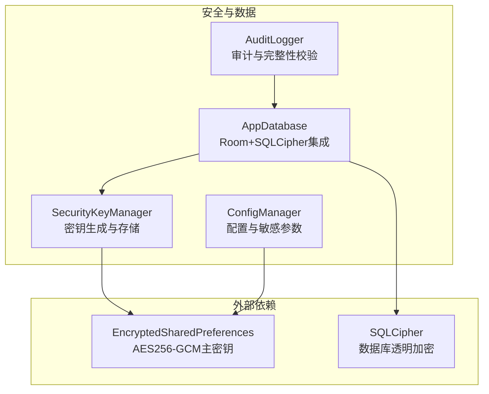
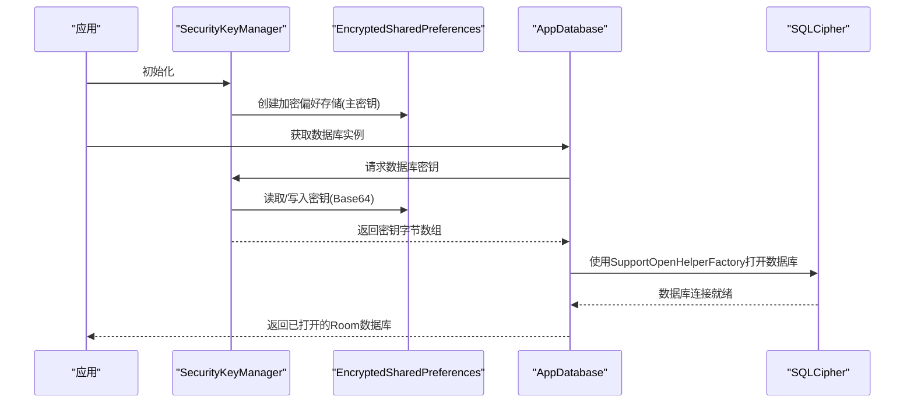
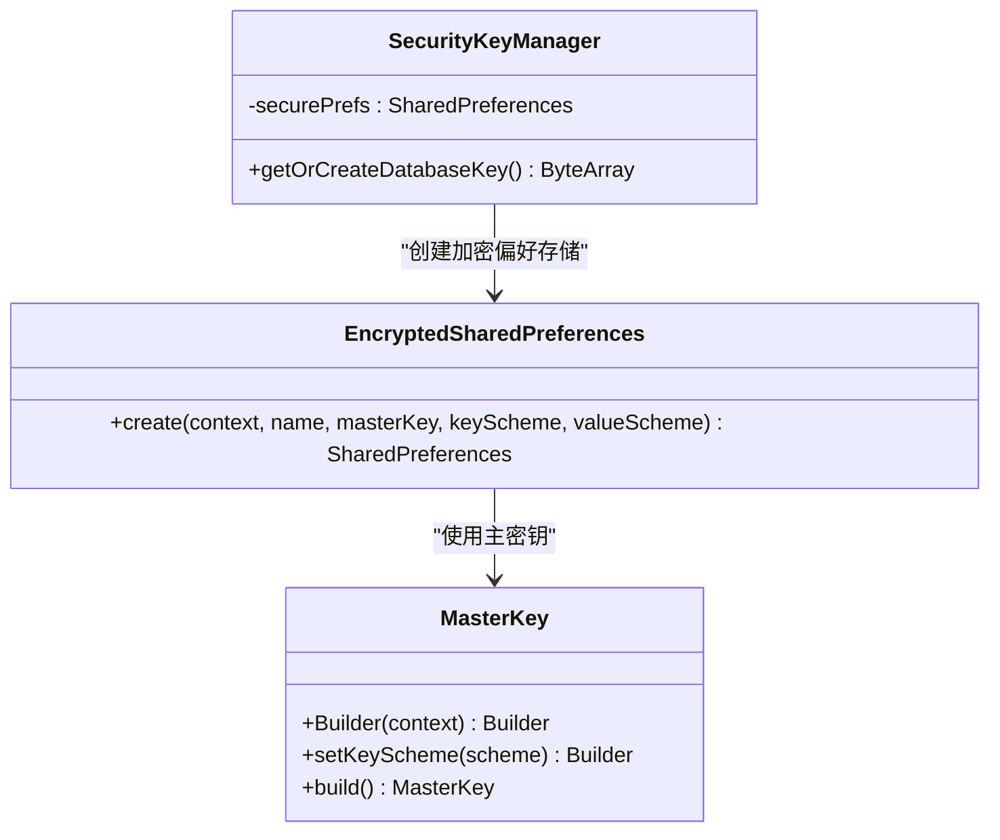
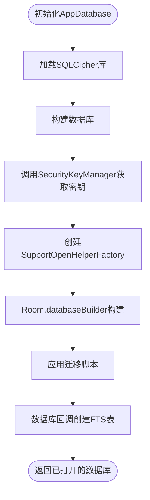
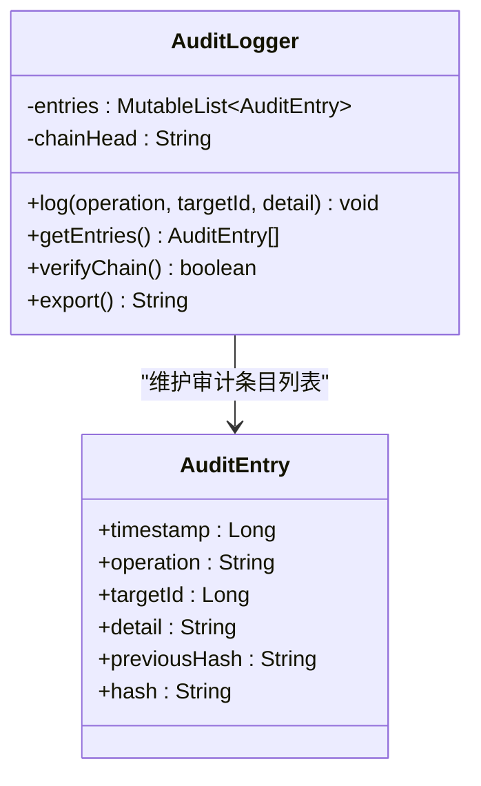
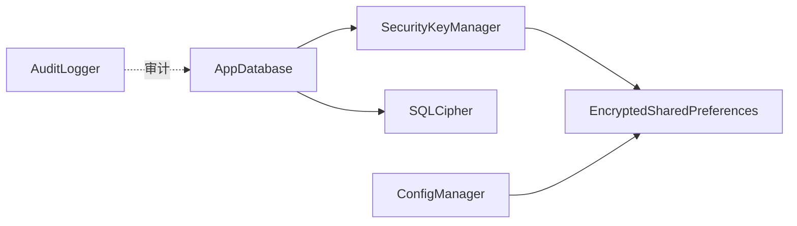

# 密钥管理

<cite>
**本文引用的文件**
- [SecurityKeyManager.kt](file://app/src/main/java/ai/openclaw/android/security/SecurityKeyManager.kt)
- [AppDatabase.kt](file://app/src/main/java/ai/openclaw/android/data/local/AppDatabase.kt)
- [AuditLogger.kt](file://app/src/main/java/ai/openclaw/android/security/AuditLogger.kt)
- [ConfigManager.kt](file://app/src/main/java/ai/openclaw/android/ConfigManager.kt)
- [build.gradle.kts](file://app/build.gradle.kts)
</cite>

## 目录
1. [简介](#简介)
2. [项目结构](#项目结构)
3. [核心组件](#核心组件)
4. [架构总览](#架构总览)
5. [详细组件分析](#详细组件分析)
6. [依赖关系分析](#依赖关系分析)
7. [性能考量](#性能考量)
8. [故障排查指南](#故障排查指南)
9. [结论](#结论)
10. [附录](#附录)

## 简介
本文件面向密钥管理模块，系统化阐述Android平台下的密钥生成、存储与使用机制，覆盖数据库加密密钥的生命周期管理、密钥别名与版本升级策略、密钥轮换与撤销方案、安全使用最佳实践以及跨Android版本兼容性处理。当前仓库中密钥管理主要围绕数据库加密密钥展开：通过Android Jetpack Security的EncryptedSharedPreferences与MasterKey保护密钥材料；数据库层采用SQLCipher进行透明加密，密钥由SecurityKeyManager提供。

## 项目结构
密钥管理相关代码集中于以下位置：
- 安全密钥管理器：ai.openclaw.android.security.SecurityKeyManager
- 数据库集成：ai.openclaw.android.data.local.AppDatabase
- 审计日志（与密钥操作关联）：ai.openclaw.android.security.AuditLogger
- 配置与敏感信息存储：ai.openclaw.android.ConfigManager
- 外部依赖声明：app/build.gradle.kts

**图表来源**
- [SecurityKeyManager.kt:15-68](file://app/src/main/java/ai/openclaw/android/security/SecurityKeyManager.kt#L15-L68)
- [AppDatabase.kt:132-155](file://app/src/main/java/ai/openclaw/android/data/local/AppDatabase.kt#L132-L155)
- [ConfigManager.kt:32-52](file://app/src/main/java/ai/openclaw/android/ConfigManager.kt#L32-L52)
- [build.gradle.kts:161-164](file://app/build.gradle.kts#L161-L164)

**章节来源**
- [SecurityKeyManager.kt:1-69](file://app/src/main/java/ai/openclaw/android/security/SecurityKeyManager.kt#L1-L69)
- [AppDatabase.kt:1-158](file://app/src/main/java/ai/openclaw/android/data/local/AppDatabase.kt#L1-L158)
- [ConfigManager.kt:1-171](file://app/src/main/java/ai/openclaw/android/ConfigManager.kt#L1-L171)
- [build.gradle.kts:161-164](file://app/build.gradle.kts#L161-L164)

## 核心组件
- SecurityKeyManager：负责生成或读取数据库加密密钥，使用EncryptedSharedPreferences持久化，密钥以Base64编码存储。
- AppDatabase：在数据库初始化时调用SecurityKeyManager获取密钥，交由SQLCipher的SupportOpenHelperFactory完成数据库打开。
- AuditLogger：提供内存操作的审计能力，记录操作时间戳、目标ID、详情与前一哈希，形成链式校验，便于检测篡改。
- ConfigManager：使用EncryptedSharedPreferences保护敏感配置项（如模型API Key、飞书凭据），与密钥管理同属“加密偏好存储”体系。

**章节来源**
- [SecurityKeyManager.kt:15-68](file://app/src/main/java/ai/openclaw/android/security/SecurityKeyManager.kt#L15-L68)
- [AppDatabase.kt:132-155](file://app/src/main/java/ai/openclaw/android/data/local/AppDatabase.kt#L132-L155)
- [AuditLogger.kt:9-99](file://app/src/main/java/ai/openclaw/android/security/AuditLogger.kt#L9-L99)
- [ConfigManager.kt:8-52](file://app/src/main/java/ai/openclaw/android/ConfigManager.kt#L8-L52)

## 架构总览
下图展示密钥管理在应用中的端到端流程：应用启动时初始化EncryptedSharedPreferences与MasterKey，随后生成或读取数据库加密密钥并传递给SQLCipher，最终由Room数据库打开使用。

**图表来源**
- [SecurityKeyManager.kt:31-67](file://app/src/main/java/ai/openclaw/android/security/SecurityKeyManager.kt#L31-L67)
- [AppDatabase.kt:132-155](file://app/src/main/java/ai/openclaw/android/data/local/AppDatabase.kt#L132-L155)

## 详细组件分析

### SecurityKeyManager 组件分析
- 职责：生成或读取数据库加密密钥，使用EncryptedSharedPreferences与MasterKey保护密钥材料。
- 关键点：
  - 使用MasterKey.KeyScheme.AES256_GCM构建主密钥。
  - EncryptedSharedPreferences采用AES256_SIV（密钥加密）与AES256_GCM（值加密）组合。
  - 密钥为256位随机AES密钥，Base64编码后存入偏好存储。
  - 若首次运行则生成新密钥并持久化，后续直接读取。

**图表来源**
- [SecurityKeyManager.kt:31-44](file://app/src/main/java/ai/openclaw/android/security/SecurityKeyManager.kt#L31-L44)
- [SecurityKeyManager.kt:51-67](file://app/src/main/java/ai/openclaw/android/security/SecurityKeyManager.kt#L51-L67)

**章节来源**
- [SecurityKeyManager.kt:15-68](file://app/src/main/java/ai/openclaw/android/security/SecurityKeyManager.kt#L15-L68)

### AppDatabase 集成分析
- 职责：数据库初始化入口，负责加载SQLCipher库、执行迁移、回调创建FTS虚拟表，并通过SecurityKeyManager提供密钥。
- 关键点：
  - 在构建数据库时调用SecurityKeyManager获取密钥，传入SQLCipher的SupportOpenHelperFactory。
  - 支持多版本迁移与降级回退策略。
  - 启动时创建memory_fts FTS5虚拟表用于全文检索。

**图表来源**
- [AppDatabase.kt:45-47](file://app/src/main/java/ai/openclaw/android/data/local/AppDatabase.kt#L45-L47)
- [AppDatabase.kt:132-155](file://app/src/main/java/ai/openclaw/android/data/local/AppDatabase.kt#L132-L155)

**章节来源**
- [AppDatabase.kt:132-155](file://app/src/main/java/ai/openclaw/android/data/local/AppDatabase.kt#L132-L155)

### AuditLogger 组件分析
- 职责：对关键内存操作进行审计，记录时间戳、操作类型、目标ID与详情，并维护SHA-256链式哈希，确保可检测篡改。
- 关键点：
  - 每条审计条目包含前一哈希，形成链式校验。
  - 提供verifyChain方法验证链完整性。
  - 提供export导出人类可读日志。

**图表来源**
- [AuditLogger.kt:16-38](file://app/src/main/java/ai/openclaw/android/security/AuditLogger.kt#L16-L38)
- [AuditLogger.kt:41-78](file://app/src/main/java/ai/openclaw/android/security/AuditLogger.kt#L41-L78)

**章节来源**
- [AuditLogger.kt:9-99](file://app/src/main/java/ai/openclaw/android/security/AuditLogger.kt#L9-L99)

### ConfigManager 组件分析
- 职责：统一管理应用配置与敏感参数，敏感项通过EncryptedSharedPreferences与MasterKey保护。
- 关键点：
  - 区分普通偏好与加密偏好两类存储。
  - 提供模型API Key、提供商、基础URL等敏感配置的读写。
  - 提供批量检查与导出能力，便于调试。

**章节来源**
- [ConfigManager.kt:8-52](file://app/src/main/java/ai/openclaw/android/ConfigManager.kt#L8-L52)
- [ConfigManager.kt:54-171](file://app/src/main/java/ai/openclaw/android/ConfigManager.kt#L54-L171)

## 依赖关系分析
- 外部依赖：
  - androidx.security:security-crypto：提供EncryptedSharedPreferences与MasterKey。
  - net.zetetic:sqlcipher-android：提供SQLCipher数据库加密能力。
- 内部耦合：
  - AppDatabase依赖SecurityKeyManager提供密钥。
  - ConfigManager与SecurityKeyManager共享EncryptedSharedPreferences保护策略。
  - AuditLogger独立于数据库，但可与内存操作配合进行审计。

**图表来源**
- [AppDatabase.kt:18-23](file://app/src/main/java/ai/openclaw/android/data/local/AppDatabase.kt#L18-L23)
- [SecurityKeyManager.kt:31-44](file://app/src/main/java/ai/openclaw/android/security/SecurityKeyManager.kt#L31-L44)
- [ConfigManager.kt:38-49](file://app/src/main/java/ai/openclaw/android/ConfigManager.kt#L38-L49)
- [build.gradle.kts:161-164](file://app/build.gradle.kts#L161-L164)

**章节来源**
- [build.gradle.kts:161-164](file://app/build.gradle.kts#L161-L164)

## 性能考量
- 密钥生成与读取：
  - 首次运行生成256位AES密钥，后续从EncryptedSharedPreferences读取，避免重复生成开销。
  - Base64编解码成本低，整体影响可忽略。
- 数据库打开：
  - SQLCipher初始化与数据库打开存在一次性开销，建议在应用启动早期完成，避免阻塞主线程。
- 审计日志：
  - AuditLogger采用固定上限列表与链式哈希，内存占用可控；verifyChain为线性扫描，适合小规模审计场景。

[本节为通用性能讨论，不涉及具体文件分析]

## 故障排查指南
- 无法打开数据库
  - 检查EncryptedSharedPreferences是否成功创建，确认MasterKey可用。
  - 核对密钥是否正确写入与读取，确认Base64编码/解码无误。
  - 确认SQLCipher库已正确加载且版本匹配。
- 密钥丢失或被清除
  - 若用户重置设备或清理应用数据，EncryptedSharedPreferences中的密钥会丢失，数据库将无法打开。
  - 建议在应用层面提供备份与恢复流程（见“密钥轮换与撤销”建议）。
- 审计链异常
  - 使用verifyChain判断链完整性，若失败需检查是否有条目被删除或篡改。
  - 导出日志进行人工核验。

**章节来源**
- [SecurityKeyManager.kt:51-67](file://app/src/main/java/ai/openclaw/android/security/SecurityKeyManager.kt#L51-L67)
- [AppDatabase.kt:132-155](file://app/src/main/java/ai/openclaw/android/data/local/AppDatabase.kt#L132-L155)
- [AuditLogger.kt:69-78](file://app/src/main/java/ai/openclaw/android/security/AuditLogger.kt#L69-L78)

## 结论
本项目采用“EncryptedSharedPreferences + MasterKey + SQLCipher”的组合实现数据库加密密钥的生成、存储与使用，流程清晰、安全可控。通过AuditLogger提供审计与完整性校验，有助于发现潜在篡改行为。建议在现有基础上完善密钥轮换与撤销机制、增强跨版本兼容性处理，并补充密钥导入导出与权限控制策略，以满足更严格的生产环境要求。

[本节为总结性内容，不涉及具体文件分析]

## 附录

### Android Keystore 与密钥别名管理
- 当前实现未使用Android Keystore的KeyPair或KeyGenParameterSpec，而是直接生成AES密钥并通过EncryptedSharedPreferences存储。
- 如需引入Keystore：
  - 使用KeyGenParameterSpec定义密钥属性（如用途、填充、随机IV等）。
  - 使用Android Keystore生成RSA/ECB密钥对，用于封装/解封主密钥。
  - 通过Alias管理不同版本密钥，支持平滑轮换。

[本节为概念性说明，不对应具体源码]

### 密钥导入导出与权限控制
- 导入：通过受控渠道将密钥材料（如Base64编码）注入EncryptedSharedPreferences，严格限制访问权限与日志记录。
- 导出：仅在合规审计或备份场景允许导出摘要信息，严禁导出明文密钥。
- 权限控制：结合应用沙箱、最小权限原则与运行时权限提示，防止越权访问。

[本节为概念性说明，不对应具体源码]

### 版本升级与密钥轮换
- 版本升级：通过AppDatabase的迁移脚本处理schema变更；密钥保持不变。
- 密钥轮换：新增密钥版本字段，旧密钥标记为不可再用于新数据，逐步迁移历史数据。
- 撤销机制：提供密钥失效开关与强制重建流程，确保受影响数据无法继续解密。

[本节为概念性说明，不对应具体源码]

### 兼容性处理（Android版本）
- EncryptedSharedPreferences与MasterKey在较新Android版本上表现稳定；低版本设备需注意：
  - 系统锁屏/生物识别解锁状态变化可能影响密钥可用性。
  - 对于需要硬件级安全的场景，建议在高版本设备启用Keystore硬件绑定。

[本节为通用兼容性讨论，不涉及具体文件分析]