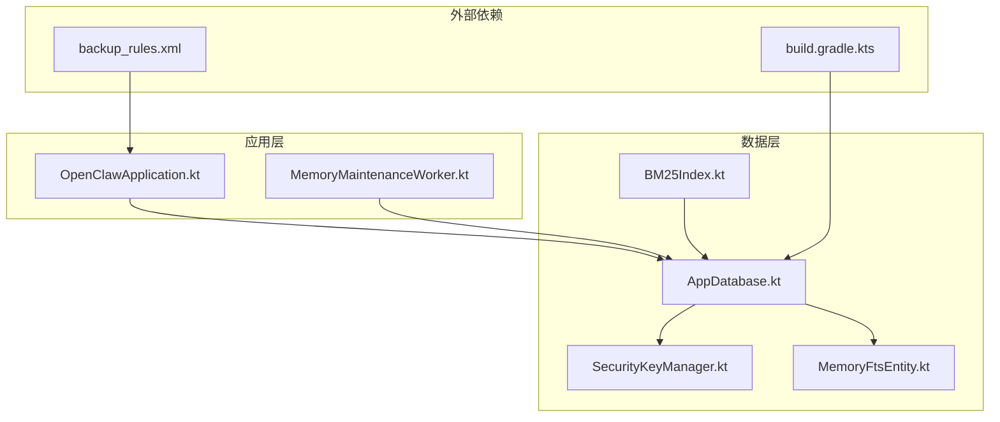
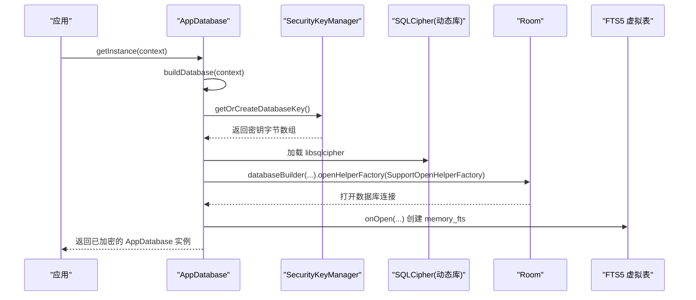
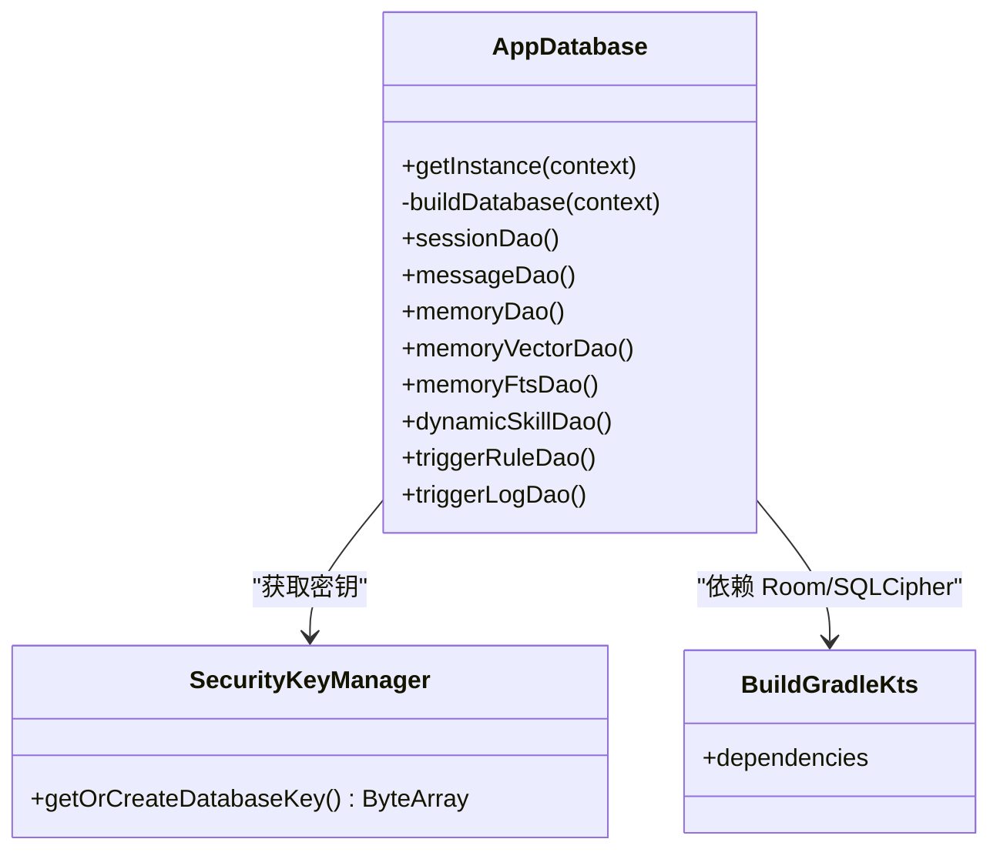

# 数据库加密

<cite>
**本文引用的文件**
- [AppDatabase.kt](file://app/src/main/java/ai/openclaw/android/data/local/AppDatabase.kt)
- [SecurityKeyManager.kt](file://app/src/main/java/ai/openclaw/android/security/SecurityKeyManager.kt)
- [build.gradle.kts](file://app/build.gradle.kts)
- [backup_rules.xml](file://app/src/main/res/xml/backup_rules.xml)
- [OpenClawApplication.kt](file://app/src/main/java/ai/openclaw/android/OpenClawApplication.kt)
- [MemoryFtsEntity.kt](file://app/src/main/java/ai/openclaw/android/data/model/MemoryFtsEntity.kt)
- [BM25Index.kt](file://docs/memory-plan-ref/BM25Index.kt)
- [MemoryMaintenanceWorker.kt](file://app/src/main/java/ai/openclaw/android/domain/memory/MemoryMaintenanceWorker.kt)
</cite>

## 目录
1. [简介](#简介)
2. [项目结构](#项目结构)
3. [核心组件](#核心组件)
4. [架构总览](#架构总览)
5. [组件详解](#组件详解)
6. [依赖关系分析](#依赖关系分析)
7. [性能考量](#性能考量)
8. [故障排除指南](#故障排除指南)
9. [结论](#结论)
10. [附录](#附录)

## 简介
本文件面向数据库加密模块，系统化阐述 SQLCipher 在 Room 数据库中的集成与配置、密钥管理、迁移与版本兼容、解密流程与内存管理、备份恢复与安全传输、最佳实践与性能优化，以及常见问题排查。该实现采用 Room + SQLCipher 的组合，并通过 Android Keystore 与 EncryptedSharedPreferences 管理数据库密钥，确保本地持久化数据在静态与传输层面的安全。

## 项目结构
围绕数据库加密的关键文件分布如下：
- Room 数据库定义与初始化：AppDatabase.kt
- 密钥管理：SecurityKeyManager.kt
- 依赖与构建配置：app/build.gradle.kts
- 备份规则：backup_rules.xml
- 应用入口：OpenClawApplication.kt
- FTS5 虚拟表实体：MemoryFtsEntity.kt
- BM25 全文检索索引：docs/memory-plan-ref/BM25Index.kt
- 定时维护任务：domain/memory/MemoryMaintenanceWorker.kt

图表来源
- [AppDatabase.kt:1-158](file://app/src/main/java/ai/openclaw/android/data/local/AppDatabase.kt#L1-L158)
- [SecurityKeyManager.kt:1-68](file://app/src/main/java/ai/openclaw/android/security/SecurityKeyManager.kt#L1-L68)
- [build.gradle.kts:164-166](file://app/build.gradle.kts#L164-L166)
- [backup_rules.xml:1-5](file://app/src/main/res/xml/backup_rules.xml#L1-L5)
- [OpenClawApplication.kt:1-19](file://app/src/main/java/ai/openclaw/android/OpenClawApplication.kt#L1-L19)
- [MemoryFtsEntity.kt:1-13](file://app/src/main/java/ai/openclaw/android/data/model/MemoryFtsEntity.kt#L1-L13)
- [BM25Index.kt:1-90](file://docs/memory-plan-ref/BM25Index.kt#L1-L90)
- [MemoryMaintenanceWorker.kt:1-69](file://app/src/main/java/ai/openclaw/android/domain/memory/MemoryMaintenanceWorker.kt#L1-L69)

章节来源
- [AppDatabase.kt:1-158](file://app/src/main/java/ai/openclaw/android/data/local/AppDatabase.kt#L1-L158)
- [SecurityKeyManager.kt:1-68](file://app/src/main/java/ai/openclaw/android/security/SecurityKeyManager.kt#L1-L68)
- [build.gradle.kts:164-166](file://app/build.gradle.kts#L164-L166)
- [backup_rules.xml:1-5](file://app/src/main/res/xml/backup_rules.xml#L1-L5)
- [OpenClawApplication.kt:1-19](file://app/src/main/java/ai/openclaw/android/OpenClawApplication.kt#L1-L19)
- [MemoryFtsEntity.kt:1-13](file://app/src/main/java/ai/openclaw/android/data/model/MemoryFtsEntity.kt#L1-L13)
- [BM25Index.kt:1-90](file://docs/memory-plan-ref/BM25Index.kt#L1-L90)
- [MemoryMaintenanceWorker.kt:1-69](file://app/src/main/java/ai/openclaw/android/domain/memory/MemoryMaintenanceWorker.kt#L1-L69)

## 核心组件
- AppDatabase：Room 数据库入口，负责加载 SQLCipher 动态库、构造支持工厂并配置迁移策略；同时在数据库打开时创建 FTS5 虚拟表。
- SecurityKeyManager：负责生成或读取 256 位 AES 密钥，使用 EncryptedSharedPreferences 存储，供 SQLCipher 初始化使用。
- 构建脚本：声明 SQLCipher 与 Room 依赖，确保运行时可用。
- 备份规则：限制共享偏好备份范围，避免敏感信息泄露。
- 应用入口：提供全局上下文，便于数据库初始化与权限管理。
- FTS5 实体与 BM25 索引：配合加密数据库进行全文检索与相关性排序。

章节来源
- [AppDatabase.kt:132-155](file://app/src/main/java/ai/openclaw/android/data/local/AppDatabase.kt#L132-L155)
- [SecurityKeyManager.kt:31-67](file://app/src/main/java/ai/openclaw/android/security/SecurityKeyManager.kt#L31-L67)
- [build.gradle.kts:164-166](file://app/build.gradle.kts#L164-L166)
- [backup_rules.xml:1-5](file://app/src/main/res/xml/backup_rules.xml#L1-L5)
- [OpenClawApplication.kt:7-14](file://app/src/main/java/ai/openclaw/android/OpenClawApplication.kt#L7-L14)
- [MemoryFtsEntity.kt:1-13](file://app/src/main/java/ai/openclaw/android/data/model/MemoryFtsEntity.kt#L1-L13)
- [BM25Index.kt:15-81](file://docs/memory-plan-ref/BM25Index.kt#L15-L81)

## 架构总览
下图展示加密数据库从启动到可用的关键交互路径，包括密钥获取、SQLCipher 加载、Room 打开数据库与 FTS5 初始化。

图表来源
- [AppDatabase.kt:45-47](file://app/src/main/java/ai/openclaw/android/data/local/AppDatabase.kt#L45-L47)
- [AppDatabase.kt:132-155](file://app/src/main/java/ai/openclaw/android/data/local/AppDatabase.kt#L132-L155)
- [SecurityKeyManager.kt:51-67](file://app/src/main/java/ai/openclaw/android/security/SecurityKeyManager.kt#L51-L67)

## 组件详解

### AppDatabase：Room + SQLCipher 集成
- 动态库加载：在静态块中加载 SQLCipher 动态库，确保 Room 可通过 SupportOpenHelperFactory 使用加密能力。
- 支持工厂：通过 SupportOpenHelperFactory(passphrase) 将密钥注入底层数据库打开流程。
- 迁移策略：定义多版本迁移，包含新增列、创建新表与索引，以及对触发器相关表的补充。
- 回退策略：向下回退时采用破坏性重建，避免不一致状态。
- 生命周期回调：数据库打开后创建 FTS5 虚拟表 memory_fts，用于全文检索与 BM25 排序。

章节来源
- [AppDatabase.kt:25-31](file://app/src/main/java/ai/openclaw/android/data/local/AppDatabase.kt#L25-L31)
- [AppDatabase.kt:45-47](file://app/src/main/java/ai/openclaw/android/data/local/AppDatabase.kt#L45-L47)
- [AppDatabase.kt:58-130](file://app/src/main/java/ai/openclaw/android/data/local/AppDatabase.kt#L58-L130)
- [AppDatabase.kt:132-155](file://app/src/main/java/ai/openclaw/android/data/local/AppDatabase.kt#L132-L155)

### SecurityKeyManager：密钥生成与存储
- 密钥来源：使用 AES-256 密钥生成器生成随机密钥，长度 32 字节。
- 存储介质：通过 EncryptedSharedPreferences 保存密钥，键值经 Base64 编码存储。
- 安全策略：基于 Android MasterKey（AES256_GCM）保护共享偏好，提升静态存储安全性。
- 重用机制：首次运行生成密钥并缓存；后续运行直接读取，保证同一设备内数据库一致性。

章节来源
- [SecurityKeyManager.kt:31-44](file://app/src/main/java/ai/openclaw/android/security/SecurityKeyManager.kt#L31-L44)
- [SecurityKeyManager.kt:51-67](file://app/src/main/java/ai/openclaw/android/security/SecurityKeyManager.kt#L51-L67)

### 构建与依赖：SQLCipher 与 Room
- 依赖声明：引入 net.zetetic:sqlcipher-android 与 androidx.room:*，确保编译期注解处理器与运行时库可用。
- ABI 策略：仅保留 arm64-v8a，减少包体并聚焦真实设备测试。
- 安全增强：引入 androidx.security:security-crypto，支撑密钥与偏好加密。

章节来源
- [build.gradle.kts:164-166](file://app/build.gradle.kts#L164-L166)
- [build.gradle.kts:161-162](file://app/build.gradle.kts#L161-L162)
- [build.gradle.kts:38-41](file://app/build.gradle.kts#L38-L41)

### 备份与恢复：备份规则与安全传输
- 备份范围：backup_rules.xml 仅包含共享偏好根目录，排除设备特定文件，降低敏感信息暴露风险。
- 恢复建议：若需跨设备迁移，应在应用层实现受控导出/导入流程，结合加密传输通道与端到端校验。

章节来源
- [backup_rules.xml:1-5](file://app/src/main/res/xml/backup_rules.xml#L1-L5)

### 解密流程与内存管理
- 解密路径：AppDatabase 打开数据库时，SQLCipher 使用传入的密钥字节数组完成解密；Room 层面透明访问已解密数据。
- 内存管理：密钥仅在内存中使用，不长期驻留；EncryptedSharedPreferences 读写发生在首次访问或密钥缺失场景，避免常驻内存。

章节来源
- [AppDatabase.kt:132-155](file://app/src/main/java/ai/openclaw/android/data/local/AppDatabase.kt#L132-L155)
- [SecurityKeyManager.kt:51-67](file://app/src/main/java/ai/openclaw/android/security/SecurityKeyManager.kt#L51-L67)

### 全文检索与索引：FTS5 与 BM25
- 虚拟表：在数据库打开回调中创建 memory_fts 虚拟表，支持 content 与 tags 的全文检索。
- BM25 排序：BM25Index 使用 FTS5 内置 bm25() 计算相关性分数，支持可选时间范围过滤与 topK 返回。
- 索引维护：MemoryMaintenanceWorker 在后台周期性重建索引，保障检索质量与性能。

章节来源
- [AppDatabase.kt:146-152](file://app/src/main/java/ai/openclaw/android/data/local/AppDatabase.kt#L146-L152)
- [MemoryFtsEntity.kt:1-13](file://app/src/main/java/ai/openclaw/android/data/model/MemoryFtsEntity.kt#L1-L13)
- [BM25Index.kt:15-81](file://docs/memory-plan-ref/BM25Index.kt#L15-L81)
- [MemoryMaintenanceWorker.kt:25-69](file://app/src/main/java/ai/openclaw/android/domain/memory/MemoryMaintenanceWorker.kt#L25-L69)

## 依赖关系分析
- AppDatabase 依赖 SecurityKeyManager 获取密钥，并通过 SupportOpenHelperFactory 注入 SQLCipher。
- 构建脚本提供 Room 与 SQLCipher 的运行时支持。
- 备份规则影响数据可移植性与恢复策略。
- 应用入口提供上下文，贯穿数据库初始化与权限管理。

图表来源
- [AppDatabase.kt:132-155](file://app/src/main/java/ai/openclaw/android/data/local/AppDatabase.kt#L132-L155)
- [SecurityKeyManager.kt:51-67](file://app/src/main/java/ai/openclaw/android/security/SecurityKeyManager.kt#L51-L67)
- [build.gradle.kts:164-166](file://app/build.gradle.kts#L164-L166)

章节来源
- [AppDatabase.kt:132-155](file://app/src/main/java/ai/openclaw/android/data/local/AppDatabase.kt#L132-L155)
- [SecurityKeyManager.kt:51-67](file://app/src/main/java/ai/openclaw/android/security/SecurityKeyManager.kt#L51-L67)
- [build.gradle.kts:164-166](file://app/build.gradle.kts#L164-L166)

## 性能考量
- 加密开销：SQLCipher 引入 CPU 加密/解密成本，通常在现代设备上可忽略；建议在后台线程执行批量操作。
- I/O 与索引：FTS5 虚拟表与 BM25 排序可能增加写入与维护成本；通过定时重建与合理 topK 限制控制开销。
- 线程模型：Room 默认在 IO 线程池执行数据库操作；BM25Index 已显式使用 Dispatchers.IO，避免阻塞主线程。
- 依赖优化：仅保留 arm64-v8a，减少二进制大小与加载时间；混淆与资源压缩按需开启。

章节来源
- [BM25Index.kt:24-30](file://docs/memory-plan-ref/BM25Index.kt#L24-L30)
- [BM25Index.kt:36-42](file://docs/memory-plan-ref/BM25Index.kt#L36-L42)
- [MemoryMaintenanceWorker.kt:25-69](file://app/src/main/java/ai/openclaw/android/domain/memory/MemoryMaintenanceWorker.kt#L25-L69)
- [build.gradle.kts:38-41](file://app/build.gradle.kts#L38-L41)

## 故障排除指南
- 数据库无法打开
  - 检查是否正确加载 SQLCipher 动态库与传入密钥。
  - 确认密钥来源一致且未被篡改。
  - 若发生回退重建，确认迁移脚本与目标版本一致。
- 密钥丢失或损坏
  - 重新生成密钥并确保 EncryptedSharedPreferences 正常读写。
  - 避免在多进程或多实例环境下共享密钥存储。
- 备份异常
  - 检查 backup_rules.xml 是否正确配置，避免敏感数据被备份。
  - 跨设备迁移需自定义受控导出/导入流程。
- 性能问题
  - 控制 BM25 查询 topK 与时间范围，减少排序与扫描开销。
  - 合理安排索引重建频率，避免频繁写放大。

章节来源
- [AppDatabase.kt:45-47](file://app/src/main/java/ai/openclaw/android/data/local/AppDatabase.kt#L45-L47)
- [AppDatabase.kt:132-155](file://app/src/main/java/ai/openclaw/android/data/local/AppDatabase.kt#L132-L155)
- [SecurityKeyManager.kt:51-67](file://app/src/main/java/ai/openclaw/android/security/SecurityKeyManager.kt#L51-L67)
- [backup_rules.xml:1-5](file://app/src/main/res/xml/backup_rules.xml#L1-L5)
- [BM25Index.kt:53-81](file://docs/memory-plan-ref/BM25Index.kt#L53-L81)

## 结论
本实现将 SQLCipher 无缝集成至 Room，借助 Android Keystore 与 EncryptedSharedPreferences 管理密钥，既满足静态数据保护需求，又保持了 Room 的易用性与类型安全。配合 FTS5 与 BM25 的全文检索能力，可在加密前提下实现高效内容检索。通过合理的迁移策略、备份规则与性能优化，可进一步提升系统的可靠性与用户体验。

## 附录

### 迁移策略与版本兼容
- 版本升级：通过 Migration 列表逐版本迁移，确保 schema 一致性。
- 新增表与索引：在回调中创建虚拟表与索引，避免 Room 自动检测冲突。
- 回退策略：向下回退时采用破坏性重建，防止不一致状态。

章节来源
- [AppDatabase.kt:58-130](file://app/src/main/java/ai/openclaw/android/data/local/AppDatabase.kt#L58-L130)
- [AppDatabase.kt:146-152](file://app/src/main/java/ai/openclaw/android/data/local/AppDatabase.kt#L146-L152)

### 备份恢复机制与安全传输
- 备份范围：仅包含共享偏好根目录，排除设备特定文件。
- 跨设备迁移：建议在应用层实现受控导出/导入流程，结合加密传输与端到端校验。

章节来源
- [backup_rules.xml:1-5](file://app/src/main/res/xml/backup_rules.xml#L1-L5)

### 最佳实践
- 密钥管理：使用 EncryptedSharedPreferences 与 MasterKey 保护密钥；避免硬编码或明文存储。
- 迁移验证：在迁移脚本中预留冗余列与索引，确保 Room schema 校验通过。
- 性能优化：控制查询范围与返回条数；定期重建索引；在后台线程执行批量操作。
- 安全传输：导出/导入数据时采用加密通道与完整性校验。

章节来源
- [SecurityKeyManager.kt:31-44](file://app/src/main/java/ai/openclaw/android/security/SecurityKeyManager.kt#L31-L44)
- [AppDatabase.kt:132-155](file://app/src/main/java/ai/openclaw/android/data/local/AppDatabase.kt#L132-L155)
- [BM25Index.kt:53-81](file://docs/memory-plan-ref/BM25Index.kt#L53-L81)