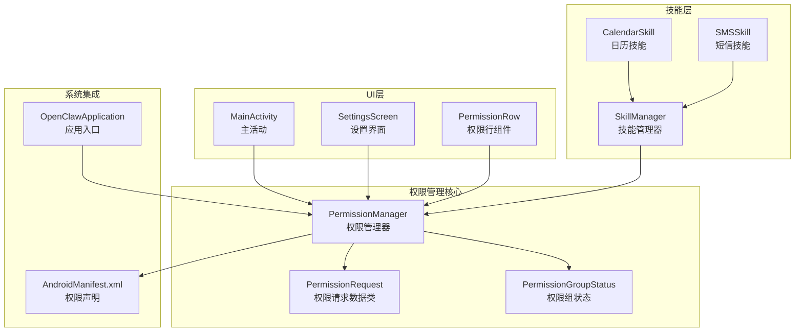
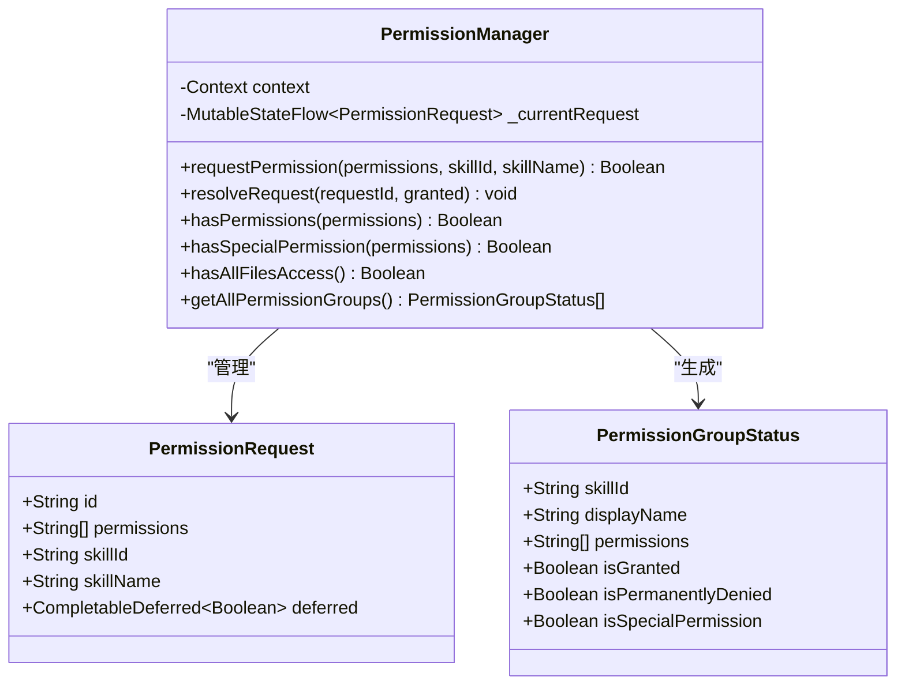
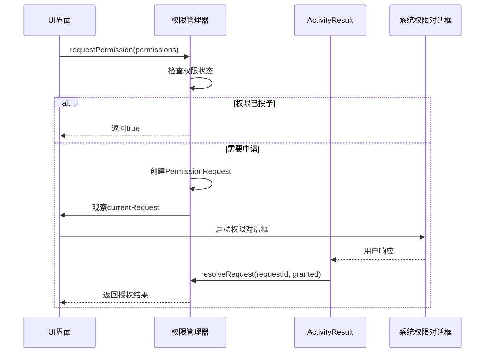
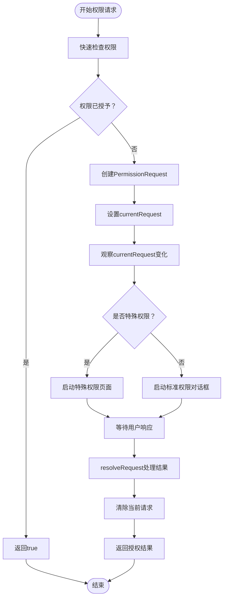
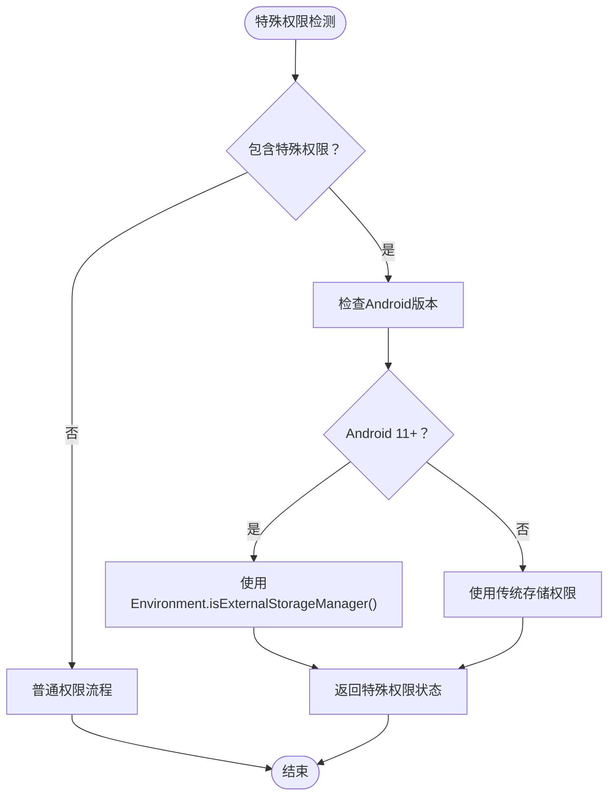
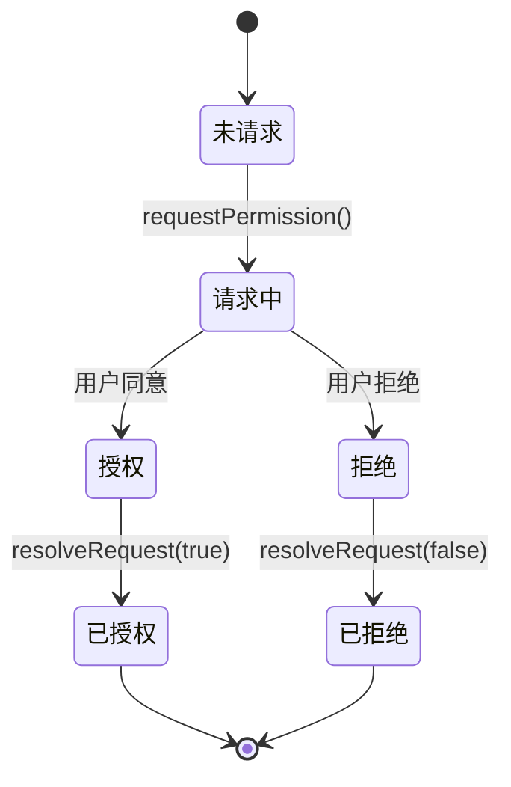
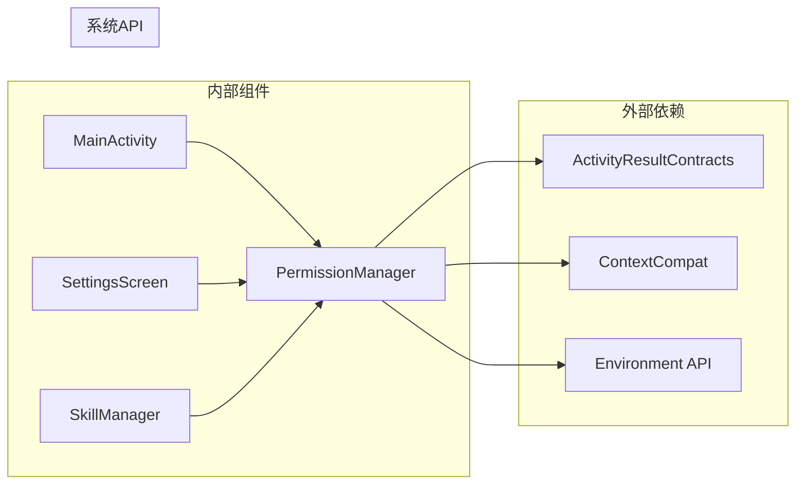

# 权限管理系统

<cite>
**本文档引用的文件**
- [PermissionManager.kt](file://app/src/main/java/ai/openclaw/android/permission/PermissionManager.kt)
- [MainActivity.kt](file://app/src/main/java/ai/openclaw/android/MainActivity.kt)
- [AndroidManifest.xml](file://app/src/main/AndroidManifest.xml)
- [SkillManager.kt](file://app/src/main/java/ai/openclaw/android/skill/SkillManager.kt)
- [CalendarSkill.kt](file://app/src/main/java/ai/openclaw/android/skill/builtin/CalendarSkill.kt)
- [SMSSkill.kt](file://app/src/main/java/ai/openclaw/android/skill/builtin/SMSSkill.kt)
- [OpenClawApplication.kt](file://app/src/main/java/ai/openclaw/android/OpenClawApplication.kt)
- [SettingsScreen.kt](file://app/src/main/java/ai/openclaw/android/ui/SettingsScreen.kt)
</cite>

## 目录
1. [简介](#简介)
2. [项目结构](#项目结构)
3. [核心组件](#核心组件)
4. [架构概览](#架构概览)
5. [详细组件分析](#详细组件分析)
6. [依赖关系分析](#依赖关系分析)
7. [性能考虑](#性能考虑)
8. [故障排除指南](#故障排除指南)
9. [结论](#结论)

## 简介

OpenClaw Android 应用程序的权限管理系统是一个基于 Android Jetpack Compose 的现代化权限管理解决方案。该系统实现了完整的运行时权限申请和管理机制，支持多技能权限的统一管理和批量操作。

本系统的核心特点包括：
- 基于协程的异步权限请求机制
- 支持特殊权限（如文件存储管理）的专门处理
- 完整的权限状态跟踪和UI同步
- 跨平台的权限组分类管理
- 用户友好的权限申请体验

## 项目结构

权限管理系统主要分布在以下模块中：

**图表来源**
- [PermissionManager.kt:1-189](file://app/src/main/java/ai/openclaw/android/permission/PermissionManager.kt#L1-L189)
- [MainActivity.kt:211-399](file://app/src/main/java/ai/openclaw/android/MainActivity.kt#L211-L399)
- [AndroidManifest.xml:1-123](file://app/src/main/AndroidManifest.xml#L1-L123)

**章节来源**
- [PermissionManager.kt:1-189](file://app/src/main/java/ai/openclaw/android/permission/PermissionManager.kt#L1-L189)
- [MainActivity.kt:1-200](file://app/src/main/java/ai/openclaw/android/MainActivity.kt#L1-L200)

## 核心组件

### PermissionManager - 权限管理器

PermissionManager 是整个权限系统的核心，负责权限的申请、验证和状态管理。

**主要功能特性：**
- 异步权限请求机制
- 权限状态实时跟踪
- 特殊权限的专门处理
- 权限组的批量管理

**关键数据结构：**

**图表来源**
- [PermissionManager.kt:14-30](file://app/src/main/java/ai/openclaw/android/permission/PermissionManager.kt#L14-L30)
- [PermissionManager.kt:32-189](file://app/src/main/java/ai/openclaw/android/permission/PermissionManager.kt#L32-L189)

**章节来源**
- [PermissionManager.kt:32-189](file://app/src/main/java/ai/openclaw/android/permission/PermissionManager.kt#L32-L189)

### 权限组分类体系

系统实现了五种主要权限组的分类管理：

| 权限组 | 技能ID | 权限集合 | 特殊属性 |
|--------|--------|----------|----------|
| 定位 | location | ACCESS_FINE_LOCATION, ACCESS_COARSE_LOCATION | 普通权限 |
| 通讯录 | contact | READ_CONTACTS | 普通权限 |
| 短信 | sms | SEND_SMS, READ_SMS | 普通权限 |
| 日程 | calendar | READ_CALENDAR, WRITE_CALENDAR | 普通权限 |
| 文件存储 | storage | MANAGE_EXTERNAL_STORAGE | 特殊权限 |

**章节来源**
- [PermissionManager.kt:114-153](file://app/src/main/java/ai/openclaw/android/permission/PermissionManager.kt#L114-L153)

## 架构概览

权限管理系统采用分层架构设计，确保了良好的模块分离和可维护性。

**图表来源**
- [PermissionManager.kt:41-70](file://app/src/main/java/ai/openclaw/android/permission/PermissionManager.kt#L41-L70)
- [MainActivity.kt:330-346](file://app/src/main/java/ai/openclaw/android/MainActivity.kt#L330-L346)

**章节来源**
- [MainActivity.kt:276-355](file://app/src/main/java/ai/openclaw/android/MainActivity.kt#L276-L355)

## 详细组件分析

### 权限请求流程

权限请求流程是系统的核心机制，实现了从UI触发到系统响应的完整闭环。

**图表来源**
- [PermissionManager.kt:41-70](file://app/src/main/java/ai/openclaw/android/permission/PermissionManager.kt#L41-L70)
- [MainActivity.kt:330-355](file://app/src/main/java/ai/openclaw/android/MainActivity.kt#L330-L355)

**章节来源**
- [PermissionManager.kt:41-70](file://app/src/main/java/ai/openclaw/android/permission/PermissionManager.kt#L41-L70)
- [MainActivity.kt:330-355](file://app/src/main/java/ai/openclaw/android/MainActivity.kt#L330-L355)

### 特殊权限处理机制

系统对特殊权限（主要是文件存储管理权限）提供了专门的处理机制。

**图表来源**
- [PermissionManager.kt:95-109](file://app/src/main/java/ai/openclaw/android/permission/PermissionManager.kt#L95-L109)

**章节来源**
- [PermissionManager.kt:95-109](file://app/src/main/java/ai/openclaw/android/permission/PermissionManager.kt#L95-L109)

### 权限状态跟踪与UI同步

系统通过StateFlow实现了权限状态的实时跟踪和UI同步。

**图表来源**
- [PermissionManager.kt:34-35](file://app/src/main/java/ai/openclaw/android/permission/PermissionManager.kt#L34-L35)
- [MainActivity.kt:330-355](file://app/src/main/java/ai/openclaw/android/MainActivity.kt#L330-L355)

**章节来源**
- [PermissionManager.kt:34-35](file://app/src/main/java/ai/openclaw/android/permission/PermissionManager.kt#L34-L35)

### 权限变更监听机制

系统实现了多层次的权限变更监听机制，确保权限状态的实时更新。

**章节来源**
- [MainActivity.kt:348-355](file://app/src/main/java/ai/openclaw/android/MainActivity.kt#L348-L355)

## 依赖关系分析

权限管理系统与其他组件的依赖关系如下：

**图表来源**
- [PermissionManager.kt:3-12](file://app/src/main/java/ai/openclaw/android/permission/PermissionManager.kt#L3-L12)
- [MainActivity.kt:20-22](file://app/src/main/java/ai/openclaw/android/MainActivity.kt#L20-L22)

**章节来源**
- [PermissionManager.kt:3-12](file://app/src/main/java/ai/openclaw/android/permission/PermissionManager.kt#L3-L12)
- [MainActivity.kt:20-22](file://app/src/main/java/ai/openclaw/android/MainActivity.kt#L20-L22)

## 性能考虑

权限管理系统在设计时充分考虑了性能优化：

### 协程异步处理
- 使用CompletableDeferred实现非阻塞的权限请求
- 基于StateFlow的状态管理，避免不必要的UI重建
- 合理的内存管理，及时清理已完成的权限请求

### 缓存机制
- 权限状态的快速路径检查，避免重复的系统调用
- 权限组状态的批量获取，减少UI刷新频率

### 内存优化
- 使用轻量级的数据类存储权限信息
- 及时清理已完成的权限请求，防止内存泄漏

## 故障排除指南

### 常见问题及解决方案

**问题1：权限请求无响应**
- 检查Activity Result Launcher是否正确初始化
- 确认currentRequest状态流是否被正确观察
- 验证resolveRequest方法是否被调用

**问题2：特殊权限无法获取**
- 确认设备Android版本是否满足要求
- 检查MANAGE_EXTERNAL_STORAGE权限声明
- 验证用户是否选择了"始终允许"

**问题3：权限状态显示异常**
- 检查PermissionGroupStatus的isGranted字段计算
- 确认hasAllFilesAccess方法的版本兼容性
- 验证UI组件的重新渲染逻辑

**章节来源**
- [MainActivity.kt:330-355](file://app/src/main/java/ai/openclaw/android/MainActivity.kt#L330-L355)
- [PermissionManager.kt:114-153](file://app/src/main/java/ai/openclaw/android/permission/PermissionManager.kt#L114-L153)

## 结论

OpenClaw Android 应用程序的权限管理系统展现了现代Android开发的最佳实践。通过精心设计的架构和完善的错误处理机制，该系统为用户提供了流畅的权限申请体验，同时为开发者提供了清晰的扩展接口。

**主要优势：**
- 完整的权限生命周期管理
- 良好的用户体验设计
- 强大的错误处理和重试机制
- 优秀的代码组织和模块化设计

**未来改进方向：**
- 增加更多权限组的支持
- 实现权限使用历史追踪
- 提供更详细的权限使用说明
- 增强权限变更的通知机制

该权限管理系统为Android应用的权限管理提供了一个可靠的参考实现，具有良好的可维护性和扩展性。