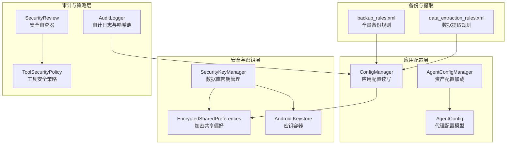
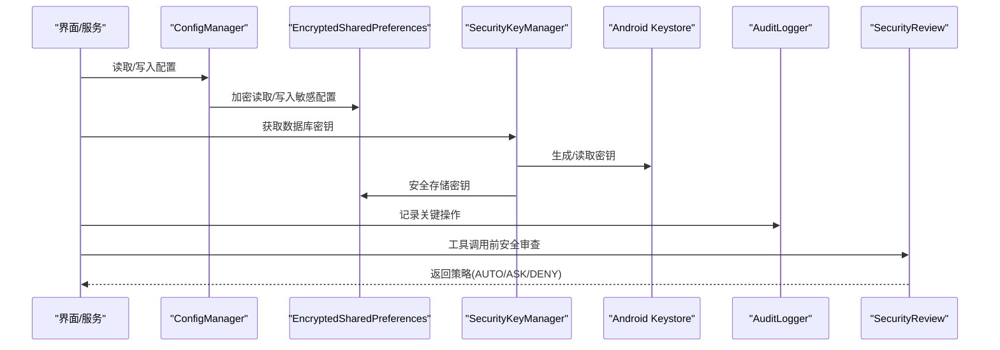
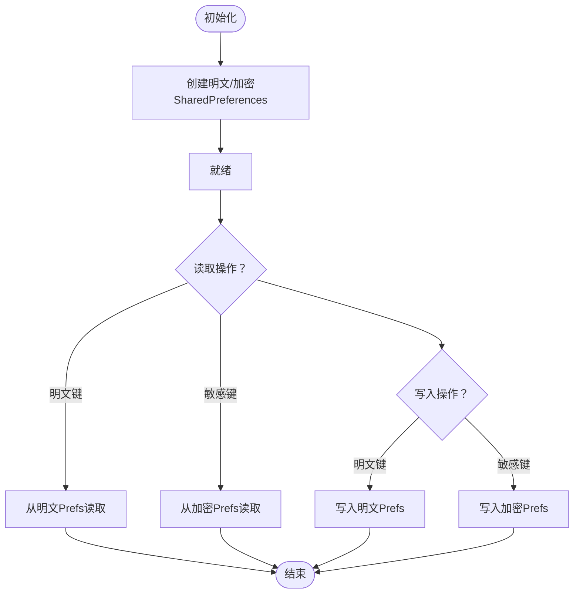
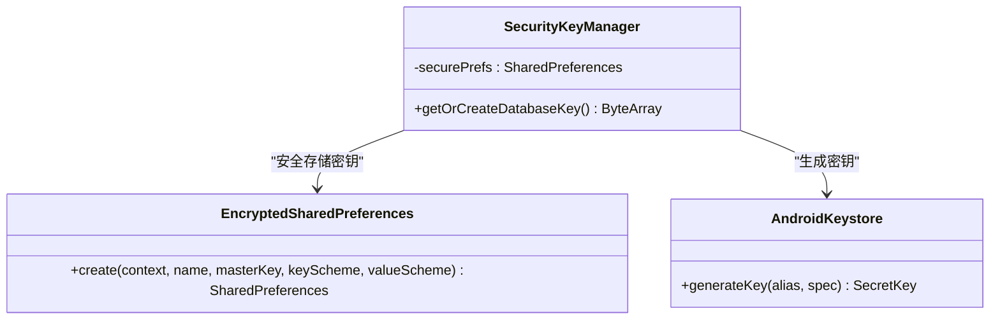
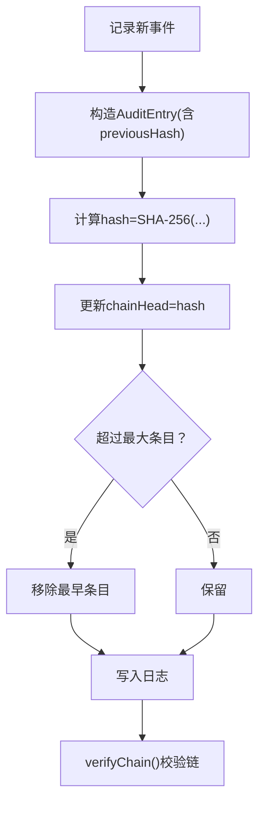
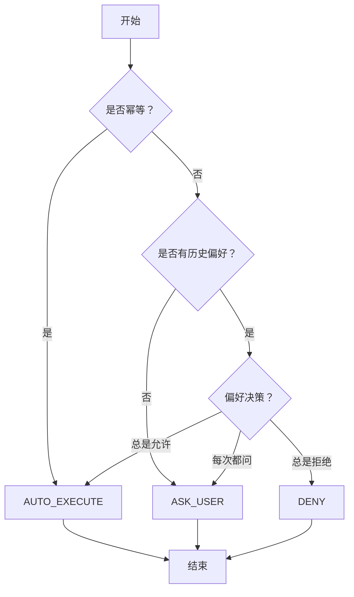
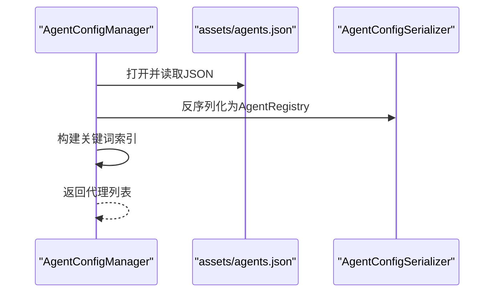
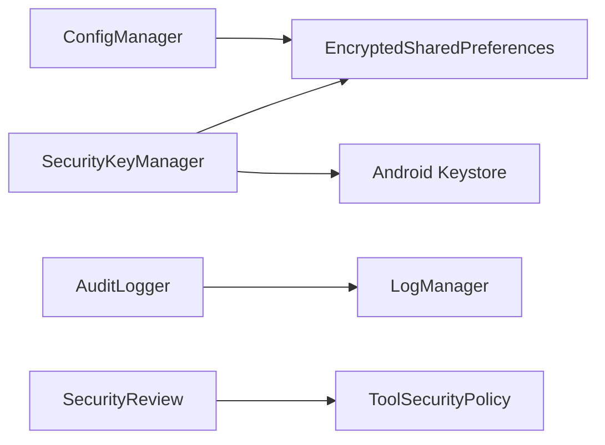

# 配置安全管理

<cite>
**本文引用的文件**
- [ConfigManager.kt](file://app/src/main/java/ai/openclaw/android/ConfigManager.kt)
- [SecurityKeyManager.kt](file://app/src/main/java/ai/openclaw/android/security/SecurityKeyManager.kt)
- [AuditLogger.kt](file://app/src/main/java/ai/openclaw/android/security/AuditLogger.kt)
- [ToolSecurityPolicy.kt](file://app/src/main/java/ai/openclaw/android/skill/ToolSecurityPolicy.kt)
- [AgentConfigManager.kt](file://app/src/main/java/ai/openclaw/android/domain/agent/AgentConfigManager.kt)
- [AgentConfig.kt](file://app/src/main/java/ai/openclaw/android/config/AgentConfig.kt)
- [backup_rules.xml](file://app/src/main/res/xml/backup_rules.xml)
- [data_extraction_rules.xml](file://app/src/main/res/xml/data_extraction_rules.xml)
</cite>

## 目录
1. [简介](#简介)
2. [项目结构](#项目结构)
3. [核心组件](#核心组件)
4. [架构总览](#架构总览)
5. [详细组件分析](#详细组件分析)
6. [依赖关系分析](#依赖关系分析)
7. [性能考量](#性能考量)
8. [故障排查指南](#故障排查指南)
9. [结论](#结论)
10. [附录](#附录)

## 简介
本技术文档聚焦于配置安全管理模块，系统性阐述以下方面：
- 敏感配置信息的安全存储与访问控制机制
- 配置文件的加密存储与解密流程
- 配置项的权限分级与访问限制策略
- 配置热更新的安全验证与完整性校验
- 配置备份恢复的安全性与一致性保障
- 配置安全的审计日志与监控机制
- 多用户环境下的隔离与保护措施

该模块通过分层存储（明文与加密）、基于Android Keystore的密钥管理、哈希链审计与工具调用安全策略，构建了从数据到行为的全方位安全防线。

## 项目结构
配置安全管理涉及以下关键位置：
- 应用配置管理：ConfigManager 负责模型参数、服务开关、第三方凭据等配置的读写与导出
- 数据库密钥管理：SecurityKeyManager 基于Android Keystore生成并持久化数据库加密密钥
- 审计日志：AuditLogger 提供带哈希链的不可篡改审计记录
- 工具安全策略：ToolSecurityPolicy 与 SecurityReview 对工具调用进行权限分级
- 资产配置加载：AgentConfigManager 从assets加载代理配置，配合路由规则
- 备份与提取规则：backup_rules.xml 与 data_extraction_rules.xml 控制备份范围

**图表来源**
- [ConfigManager.kt:11-171](file://app/src/main/java/ai/openclaw/android/ConfigManager.kt#L11-L171)
- [SecurityKeyManager.kt:23-68](file://app/src/main/java/ai/openclaw/android/security/SecurityKeyManager.kt#L23-L68)
- [AuditLogger.kt:16-100](file://app/src/main/java/ai/openclaw/android/security/AuditLogger.kt#L16-L100)
- [ToolSecurityPolicy.kt:6-72](file://app/src/main/java/ai/openclaw/android/skill/ToolSecurityPolicy.kt#L6-L72)
- [AgentConfigManager.kt:12-88](file://app/src/main/java/ai/openclaw/android/domain/agent/AgentConfigManager.kt#L12-L88)
- [AgentConfig.kt:5-21](file://app/src/main/java/ai/openclaw/android/config/AgentConfig.kt#L5-L21)
- [backup_rules.xml:1-5](file://app/src/main/res/xml/backup_rules.xml#L1-L5)
- [data_extraction_rules.xml:1-7](file://app/src/main/res/xml/data_extraction_rules.xml#L1-L7)

**章节来源**
- [ConfigManager.kt:11-171](file://app/src/main/java/ai/openclaw/android/ConfigManager.kt#L11-L171)
- [SecurityKeyManager.kt:23-68](file://app/src/main/java/ai/openclaw/android/security/SecurityKeyManager.kt#L23-L68)
- [AuditLogger.kt:16-100](file://app/src/main/java/ai/openclaw/android/security/AuditLogger.kt#L16-L100)
- [ToolSecurityPolicy.kt:6-72](file://app/src/main/java/ai/openclaw/android/skill/ToolSecurityPolicy.kt#L6-L72)
- [AgentConfigManager.kt:12-88](file://app/src/main/java/ai/openclaw/android/domain/agent/AgentConfigManager.kt#L12-L88)
- [AgentConfig.kt:5-21](file://app/src/main/java/ai/openclaw/android/config/AgentConfig.kt#L5-L21)
- [backup_rules.xml:1-5](file://app/src/main/res/xml/backup_rules.xml#L1-L5)
- [data_extraction_rules.xml:1-7](file://app/src/main/res/xml/data_extraction_rules.xml#L1-L7)

## 核心组件
- 应用配置管理（ConfigManager）
  - 分离明文与敏感配置：普通设置存明文SharedPreferences，敏感凭据存EncryptedSharedPreferences
  - 提供统一的读写接口与有效性校验（如是否配置完整、有效基础URL）
  - 支持导出非敏感配置用于调试
- 数据库密钥管理（SecurityKeyManager）
  - 使用Android Keystore与MasterKey生成256位AES密钥
  - 将密钥以Base64形式安全存储于EncryptedSharedPreferences
  - 为SQLCipher提供数据库级加密密钥
- 审计日志（AuditLogger）
  - 记录关键操作（如存储、删除、合并、同步）并生成SHA-256哈希链
  - 提供完整性校验与人类可读导出
- 工具安全策略（ToolSecurityPolicy + SecurityReview）
  - 幂等操作自动放行；非幂等操作按用户偏好决定是否询问或拒绝
  - 支持“总是允许/总是拒绝/每次都问”的用户偏好
- 资产配置加载（AgentConfigManager + AgentConfig）
  - 从assets加载代理配置，构建关键词索引，支持路由与默认代理
- 备份与提取规则（backup_rules.xml + data_extraction_rules.xml）
  - 控制备份范围，排除设备特定文件，确保敏感信息不被备份

**章节来源**
- [ConfigManager.kt:11-171](file://app/src/main/java/ai/openclaw/android/ConfigManager.kt#L11-L171)
- [SecurityKeyManager.kt:23-68](file://app/src/main/java/ai/openclaw/android/security/SecurityKeyManager.kt#L23-L68)
- [AuditLogger.kt:16-100](file://app/src/main/java/ai/openclaw/android/security/AuditLogger.kt#L16-L100)
- [ToolSecurityPolicy.kt:6-72](file://app/src/main/java/ai/openclaw/android/skill/ToolSecurityPolicy.kt#L6-L72)
- [AgentConfigManager.kt:12-88](file://app/src/main/java/ai/openclaw/android/domain/agent/AgentConfigManager.kt#L12-L88)
- [AgentConfig.kt:5-21](file://app/src/main/java/ai/openclaw/android/config/AgentConfig.kt#L5-L21)
- [backup_rules.xml:1-5](file://app/src/main/res/xml/backup_rules.xml#L1-L5)
- [data_extraction_rules.xml:1-7](file://app/src/main/res/xml/data_extraction_rules.xml#L1-L7)

## 架构总览
下图展示配置安全管理的整体交互：应用配置与数据库密钥由安全组件统一管理，审计日志贯穿关键操作，工具调用受安全策略约束，备份规则保障数据隐私。

**图表来源**
- [ConfigManager.kt:32-52](file://app/src/main/java/ai/openclaw/android/ConfigManager.kt#L32-L52)
- [SecurityKeyManager.kt:51-67](file://app/src/main/java/ai/openclaw/android/security/SecurityKeyManager.kt#L51-L67)
- [AuditLogger.kt:42-59](file://app/src/main/java/ai/openclaw/android/security/AuditLogger.kt#L42-L59)
- [ToolSecurityPolicy.kt:53-70](file://app/src/main/java/ai/openclaw/android/skill/ToolSecurityPolicy.kt#L53-L70)

## 详细组件分析

### 应用配置管理（ConfigManager）
- 存储分离
  - 明文配置：模型名称、提供方、基础URL、服务开关等
  - 敏感配置：模型API Key、飞书App ID/Secret等
- 初始化与加密
  - 使用MasterKey与AES256_GCM方案初始化EncryptedSharedPreferences
  - 双命名空间SharedPreferences分别承载明文与加密配置
- 读写与校验
  - 提供键值读写方法与存在性校验
  - 统一的“是否配置完成”判断与“有效基础URL”推导
- 导出与清理
  - 导出非敏感配置用于诊断
  - 清理所有配置（谨慎使用）

**图表来源**
- [ConfigManager.kt:32-52](file://app/src/main/java/ai/openclaw/android/ConfigManager.kt#L32-L52)
- [ConfigManager.kt:56-122](file://app/src/main/java/ai/openclaw/android/ConfigManager.kt#L56-L122)

**章节来源**
- [ConfigManager.kt:11-171](file://app/src/main/java/ai/openclaw/android/ConfigManager.kt#L11-L171)

### 数据库密钥管理（SecurityKeyManager）
- 密钥生成与存储
  - 通过Android Keystore生成256位AES密钥
  - 将密钥字节数组Base64编码后存入EncryptedSharedPreferences
- 生命周期
  - 首次运行生成并保存；后续启动直接读取
- 与数据库集成
  - 为SQLCipher提供数据库级加密密钥，确保静态数据安全

**图表来源**
- [SecurityKeyManager.kt:23-68](file://app/src/main/java/ai/openclaw/android/security/SecurityKeyManager.kt#L23-L68)

**章节来源**
- [SecurityKeyManager.kt:23-68](file://app/src/main/java/ai/openclaw/android/security/SecurityKeyManager.kt#L23-L68)

### 审计日志（AuditLogger）
- 结构化记录
  - 包含时间戳、操作类型、目标ID、详情摘要与前一哈希
- 哈希链完整性
  - 每条记录的哈希基于字段拼接与SHA-256计算
  - 通过链头与逐条校验检测篡改
- 输出与监控
  - 提供导出文本与最大条目限制
  - 通过LogManager输出日志便于监控

**图表来源**
- [AuditLogger.kt:21-78](file://app/src/main/java/ai/openclaw/android/security/AuditLogger.kt#L21-L78)

**章节来源**
- [AuditLogger.kt:16-100](file://app/src/main/java/ai/openclaw/android/security/AuditLogger.kt#L16-L100)

### 工具安全策略（ToolSecurityPolicy + SecurityReview）
- 策略枚举
  - AUTO_EXECUTE：幂等操作自动执行
  - ASK_USER：非幂等且无历史偏好时提示用户
  - DENY：用户已拒绝
- 用户偏好
  - ALWAYS_APPROVE / ALWAYS_DENY / ASK_EVERY_TIME
- 审查流程
  - 若幂等则自动执行
  - 否则根据用户偏好决定是否询问或拒绝

**图表来源**
- [ToolSecurityPolicy.kt:53-70](file://app/src/main/java/ai/openclaw/android/skill/ToolSecurityPolicy.kt#L53-L70)

**章节来源**
- [ToolSecurityPolicy.kt:6-72](file://app/src/main/java/ai/openclaw/android/skill/ToolSecurityPolicy.kt#L6-L72)

### 资产配置加载（AgentConfigManager + AgentConfig）
- 资产加载
  - 从assets读取agents.json并反序列化为AgentConfig列表
- 关键词索引
  - 构建关键词到代理ID的映射，支持路由
- 默认代理与校验
  - 提供默认代理与存在性检查

**图表来源**
- [AgentConfigManager.kt:25-36](file://app/src/main/java/ai/openclaw/android/domain/agent/AgentConfigManager.kt#L25-L36)
- [AgentConfigManager.kt:73-86](file://app/src/main/java/ai/openclaw/android/domain/agent/AgentConfigManager.kt#L73-L86)
- [AgentConfig.kt:5-21](file://app/src/main/java/ai/openclaw/android/config/AgentConfig.kt#L5-L21)

**章节来源**
- [AgentConfigManager.kt:12-88](file://app/src/main/java/ai/openclaw/android/domain/agent/AgentConfigManager.kt#L12-L88)
- [AgentConfig.kt:5-21](file://app/src/main/java/ai/openclaw/android/config/AgentConfig.kt#L5-L21)

### 备份与提取规则
- 全量备份
  - 包含sharedpref目录，但排除device.xml
- 云数据提取
  - cloud-backup同样遵循包含sharedpref并排除device.xml
- 安全意义
  - 降低敏感配置泄露风险，避免备份中携带密钥

**章节来源**
- [backup_rules.xml:1-5](file://app/src/main/res/xml/backup_rules.xml#L1-L5)
- [data_extraction_rules.xml:1-7](file://app/src/main/res/xml/data_extraction_rules.xml#L1-L7)

## 依赖关系分析
- 组件耦合
  - ConfigManager依赖EncryptedSharedPreferences与MasterKey
  - SecurityKeyManager依赖Android Keystore与EncryptedSharedPreferences
  - AuditLogger独立于业务，仅依赖日志框架
  - ToolSecurityPolicy为纯逻辑，依赖用户偏好数据结构
- 外部依赖
  - AndroidX Security Crypto库（EncryptedSharedPreferences、MasterKey）
  - Android Keystore（密钥生成与存储）
  - 日志管理器（LogManager）

**图表来源**
- [ConfigManager.kt:5-6](file://app/src/main/java/ai/openclaw/android/ConfigManager.kt#L5-L6)
- [SecurityKeyManager.kt:9-13](file://app/src/main/java/ai/openclaw/android/security/SecurityKeyManager.kt#L9-L13)
- [AuditLogger.kt:3](file://app/src/main/java/ai/openclaw/android/security/AuditLogger.kt#L3)

**章节来源**
- [ConfigManager.kt:5-6](file://app/src/main/java/ai/openclaw/android/ConfigManager.kt#L5-L6)
- [SecurityKeyManager.kt:9-13](file://app/src/main/java/ai/openclaw/android/security/SecurityKeyManager.kt#L9-L13)
- [AuditLogger.kt:3](file://app/src/main/java/ai/openclaw/android/security/AuditLogger.kt#L3)

## 性能考量
- 加密成本
  - EncryptedSharedPreferences与MasterKey初始化仅在首次使用时发生，后续读写为常规SharedPreferences性能
- 哈希链计算
  - SHA-256计算开销极低，对高频操作影响可忽略
- 备份范围控制
  - 通过规则排除敏感文件，减少备份体积与IO开销

[本节为通用指导，无需具体文件分析]

## 故障排查指南
- 配置读取为空
  - 检查ConfigManager是否正确初始化
  - 确认键名与命名空间一致（明文vs加密）
- 密钥获取失败
  - 确认Android Keystore可用且未被系统重置
  - 检查EncryptedSharedPreferences命名空间与密钥字段
- 审计链校验失败
  - 检查entries是否被外部修改
  - 确认链头与每条记录的previousHash一致
- 工具调用被拒绝
  - 检查用户偏好设置与工具幂等性
  - 确认SecurityReview输入参数正确

**章节来源**
- [ConfigManager.kt:32-52](file://app/src/main/java/ai/openclaw/android/ConfigManager.kt#L32-L52)
- [SecurityKeyManager.kt:51-67](file://app/src/main/java/ai/openclaw/android/security/SecurityKeyManager.kt#L51-L67)
- [AuditLogger.kt:69-78](file://app/src/main/java/ai/openclaw/android/security/AuditLogger.kt#L69-L78)
- [ToolSecurityPolicy.kt:53-70](file://app/src/main/java/ai/openclaw/android/skill/ToolSecurityPolicy.kt#L53-L70)

## 结论
本配置安全管理模块通过“明文/加密分离存储、基于Keystore的密钥管理、哈希链审计与工具调用策略”，实现了从数据到行为的多层防护。结合备份规则控制，有效降低了敏感信息泄露风险，并为配置热更新与多用户隔离提供了安全基线。

[本节为总结性内容，无需具体文件分析]

## 附录
- 配置项清单与分类
  - 明文配置：模型名称、提供方、基础URL、服务开关
  - 敏感配置：模型API Key、飞书App ID/Secret
- 审计事件建议
  - 在关键配置变更处插入AuditLogger记录
  - 对工具调用前后增加审计点
- 备份与恢复
  - 使用现有备份规则进行全量备份
  - 恢复后验证密钥与配置完整性

[本节为概要性内容，无需具体文件分析]