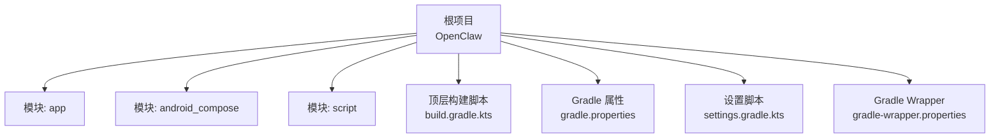
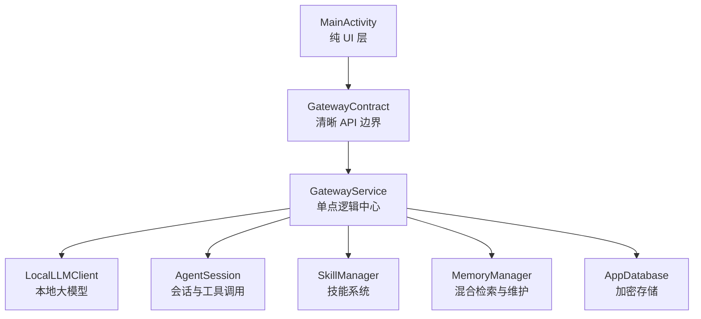
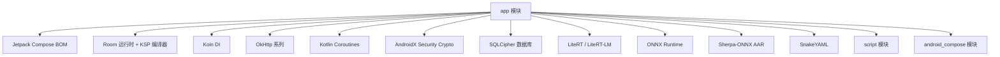

# 快速开始

<cite>
**本文引用的文件**
- [README.md](file://README.md)
- [build.gradle.kts](file://build.gradle.kts)
- [gradle.properties](file://gradle.properties)
- [settings.gradle.kts](file://settings.gradle.kts)
- [gradle-wrapper.properties](file://gradle/rapper/gradle-wrapper.properties)
- [app/build.gradle.kts](file://app/build.gradle.kts)
- [local.properties](file://local.properties)
- [scripts/download-sherpa-onnx.sh](file://scripts/download-sherpa-onnx.sh)
- [scripts/auto-fix-compilation-errors.ps1](file://scripts/auto-fix-compilation-errors.ps1)
</cite>

## 目录
1. [简介](#简介)
2. [项目结构](#项目结构)
3. [核心组件](#核心组件)
4. [架构总览](#架构总览)
5. [详细组件分析](#详细组件分析)
6. [依赖分析](#依赖分析)
7. [性能考虑](#性能考虑)
8. [故障排除指南](#故障排除指南)
9. [结论](#结论)
10. [附录](#附录)

## 简介
本指南面向首次接触 OpenClaw-Android 的开发者，帮助你在最短时间内完成环境准备、项目克隆、依赖安装与首次构建，并掌握统一调试签名的使用方法。项目采用 Android SDK 35、Kotlin 1.9.25、Gradle 8.9 的组合，最低支持 Android 10（API 29），目标 SDK 为 35。

## 项目结构
OpenClaw-Android 采用多模块结构，核心模块包括应用层 app、Compose 组件库 android_compose、脚本沙箱模块 script，以及顶层构建脚本与仓库配置。

图表来源
- [settings.gradle.kts:21-24](file://settings.gradle.kts#L21-L24)
- [build.gradle.kts:1-9](file://build.gradle.kts#L1-L9)
- [gradle.properties:1-11](file://gradle.properties#L1-L11)
- [gradle-wrapper.properties:1-5](file://gradle/wrapper/gradle-wrapper.properties#L1-L5)

章节来源
- [settings.gradle.kts:1-24](file://settings.gradle.kts#L1-L24)
- [README.md:89-152](file://README.md#L89-L152)

## 核心组件
- 应用模块 app：包含主业务逻辑、UI、数据层、领域模型、技能系统、语音交互、通知与安全等子系统。
- Compose 组件库 android_compose：提供可复用的 UI 组件与主题，用于 app 中的界面渲染。
- 脚本模块 script：提供沙箱化脚本执行能力，支持文件、HTTP、内存桥接与策略控制。
- 顶层构建脚本：统一管理插件版本与仓库源，确保 Kotlin 与 Compose 插件版本一致。
- Gradle 属性与 Wrapper：统一 JVM 参数、并行与缓存配置，使用 Gradle 8.9 包装器分发。

章节来源
- [README.md:89-152](file://README.md#L89-L152)
- [build.gradle.kts:1-9](file://build.gradle.kts#L1-L9)
- [gradle.properties:1-11](file://gradle.properties#L1-L11)
- [gradle-wrapper.properties:1-5](file://gradle/wrapper/gradle-wrapper.properties#L1-L5)

## 架构总览
应用遵循“单一真实来源”的服务化架构：GatewayService 作为唯一逻辑中心，持有核心组件实例；Activity 仅为 UI 层，通过 GatewayContract 与服务交互，实现模型生命周期与 UI 解耦。

图表来源
- [README.md:7-41](file://README.md#L7-L41)

章节来源
- [README.md:7-48](file://README.md#L7-L48)

## 详细组件分析

### 环境与工具链要求
- Android SDK：35（对应 Android 16）
- Kotlin：1.9.25
- Gradle：8.9
- 最低 SDK：29（Android 10）
- 目标 SDK：35
- NDK 版本：27.0.12077973
- Java/Kotlin 编译目标：JVM 17

章节来源
- [README.md:154-160](file://README.md#L154-L160)
- [app/build.gradle.kts:26-47](file://app/build.gradle.kts#L26-L47)
- [app/build.gradle.kts:92-100](file://app/build.gradle.kts#L92-L100)

### Gradle 与插件版本一致性
- 顶层 build.gradle.kts 声明了 Android 应用插件、Kotlin Android 插件、序列化与 Compose 插件版本。
- app/build.gradle.kts 使用 Kotlin 2.3.0 对应的 Compose 插件版本，确保编译期兼容性。
- settings.gradle.kts 配置了阿里云与 Google 仓库镜像，提升依赖解析速度。

章节来源
- [build.gradle.kts:1-9](file://build.gradle.kts#L1-L9)
- [app/build.gradle.kts:3-9](file://app/build.gradle.kts#L3-L9)
- [settings.gradle.kts:1-19](file://settings.gradle.kts#L1-L19)

### 依赖与第三方库
- Jetpack Compose（BOM 2025.03.00）、OkHttp、Koin、Room、WorkManager、LiteRT/LiteRT-LM、ONNX Runtime、Sherpa-ONNX、SQLCipher、YAML 解析等。
- 语音相关依赖（Sherpa-ONNX AAR）需先下载到 app/libs 并在构建前执行脚本。

章节来源
- [app/build.gradle.kts:126-216](file://app/build.gradle.kts#L126-L216)

### 构建与打包配置
- Debug 与 Release 构建类型分别配置混淆、资源收缩与签名。
- Debug 构建默认使用统一调试签名（unifiedDebug），以保证跨平台一致性。
- Release 构建支持从 local.properties 或环境变量加载签名参数。

章节来源
- [app/build.gradle.kts:74-91](file://app/build.gradle.kts#L74-L91)
- [app/build.gradle.kts:49-72](file://app/build.gradle.kts#L49-L72)

### 语音与本地推理依赖准备
- Sherpa-ONNX AAR 需要预先下载至 app/libs/sherpa-onnx.aar，可通过脚本自动下载。
- 脚本会检测已存在文件并提示重新下载或直接构建。

章节来源
- [scripts/download-sherpa-onnx.sh:1-63](file://scripts/download-sherpa-onnx.sh#L1-L63)
- [app/build.gradle.kts:127-128](file://app/build.gradle.kts#L127-L128)

### 统一调试签名与 keystore
- unifiedDebug 签名配置位于 app/build.gradle.kts，支持 Windows 与 WSL2 的 keystore 路径映射。
- SHA-256 指纹与 keystore 共享位置在 README.md 中给出，便于跨环境一致性。

章节来源
- [app/build.gradle.kts:60-71](file://app/build.gradle.kts#L60-L71)
- [README.md:172-179](file://README.md#L172-L179)

### 构建流程与命令
- 调试构建：使用 Gradle Wrapper 执行 app 模块的 assembleDebug。
- 清理后构建：先 clean 再 assembleDebug。
- 自动修复脚本：PowerShell 脚本可捕获编译错误并交由 Claude Code 分析修复建议。

章节来源
- [README.md:162-170](file://README.md#L162-L170)
- [scripts/auto-fix-compilation-errors.ps1:1-27](file://scripts/auto-fix-compilation-errors.ps1#L1-L27)

## 依赖分析
本节展示 app 模块的关键依赖关系与版本约束，帮助理解模块间耦合与外部集成点。

图表来源
- [app/build.gradle.kts:126-216](file://app/build.gradle.kts#L126-L216)

章节来源
- [app/build.gradle.kts:126-216](file://app/build.gradle.kts#L126-L216)

## 性能考虑
- 启用 Gradle 并行、缓存与配置缓存，显著缩短构建时间。
- Debug 构建保持最小化优化，避免过度混淆影响调试体验。
- 语音与本地推理依赖较大，建议在开发机上预下载 AAR 并清理不必要的 ABI 以减少包体与构建时间。
- 使用统一调试签名避免重复签名导致的增量构建失败。

章节来源
- [gradle.properties:8-11](file://gradle.properties#L8-L11)
- [app/build.gradle.kts:74-91](file://app/build.gradle.kts#L74-L91)
- [app/build.gradle.kts:38-41](file://app/build.gradle.kts#L38-L41)

## 故障排除指南
- 无法找到 Android SDK
  - 检查 local.properties 中 sdk.dir 是否指向有效路径。
  - 若未配置，请在项目根目录创建 local.properties 并写入 sdk.dir=你的 Android SDK 路径。
  - 参考路径定义与示例值。
  
  章节来源
  - [local.properties:1-1](file://local.properties#L1-L1)

- 语音依赖缺失导致构建失败
  - 执行脚本下载 sherpa-onnx AAR 至 app/libs/sherpa-onnx.aar。
  - 若已存在，按脚本提示删除后重试下载。
  
  章节来源
  - [scripts/download-sherpa-onnx.sh:24-30](file://scripts/download-sherpa-onnx.sh#L24-L30)
  - [app/build.gradle.kts:127-128](file://app/build.gradle.kts#L127-L128)

- 统一调试签名不一致导致签名冲突
  - 确保 unifiedDebug 签名路径与 README 中共享 keystore 位置一致。
  - Windows 与 WSL2 路径映射已在构建脚本中处理，无需手动修改。
  
  章节来源
  - [app/build.gradle.kts:60-71](file://app/build.gradle.kts#L60-L71)
  - [README.md:172-179](file://README.md#L172-L179)

- 构建失败且难以定位错误
  - 使用 PowerShell 自动修复脚本捕获构建输出并交由 Claude Code 分析。
  - 该脚本会生成 build-errors.log 供分析。
  
  章节来源
  - [scripts/auto-fix-compilation-errors.ps1:6-25](file://scripts/auto-fix-compilation-errors.ps1#L6-L25)

- 依赖解析缓慢或失败
  - settings.gradle.kts 已配置阿里云与 Google 仓库镜像，若仍失败请检查网络代理。
  - 清理 Gradle 缓存后重试。
  
  章节来源
  - [settings.gradle.kts:11-19](file://settings.gradle.kts#L11-L19)

## 结论
按照本指南完成环境准备、依赖安装与首次构建后，你将能够稳定运行 OpenClaw-Android 的调试版本。统一调试签名与脚本化的依赖准备流程可显著降低新开发者的上手门槛。遇到问题时，优先检查 SDK 路径、语音依赖与签名配置，并利用自动修复脚本辅助定位。

## 附录

### 快速开始步骤清单
- 安装 Android Studio（含 Android SDK 35、NDK 27.0.12077973）与 JDK 17
- 安装 Gradle 8.9（或使用项目自带的 Wrapper）
- 安装 Git 并克隆项目
- 在项目根目录创建 local.properties，写入 sdk.dir 指向你的 Android SDK
- 下载语音依赖 AAR：执行 scripts/download-sherpa-onnx.sh
- 执行 Gradle Wrapper 构建：./gradlew :app:assembleDebug
- 如需清理：./gradlew clean :app:assembleDebug

章节来源
- [README.md:154-170](file://README.md#L154-L170)
- [scripts/download-sherpa-onnx.sh:1-63](file://scripts/download-sherpa-onnx.sh#L1-L63)
- [local.properties:1-1](file://local.properties#L1-L1)