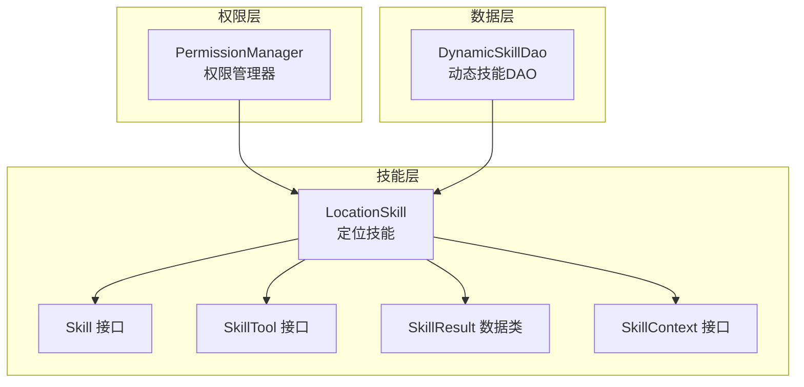
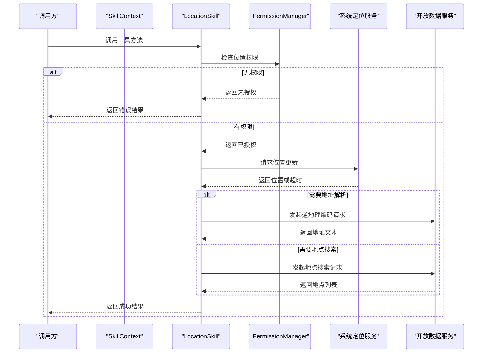
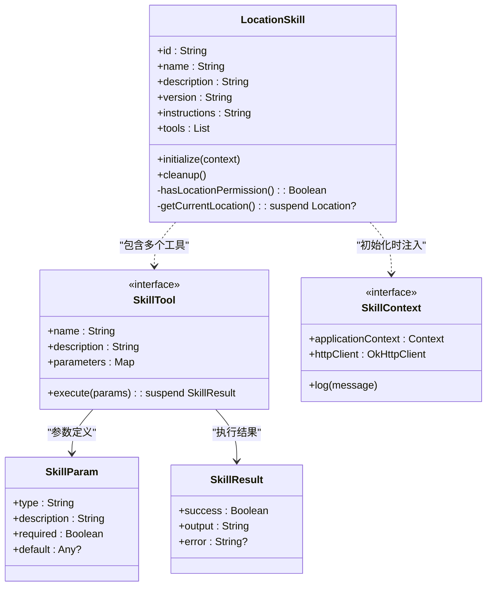
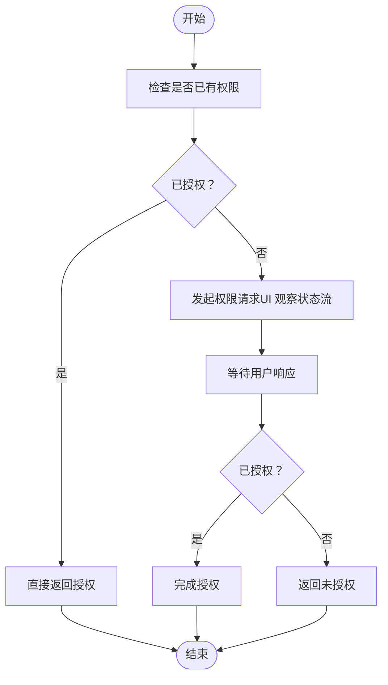
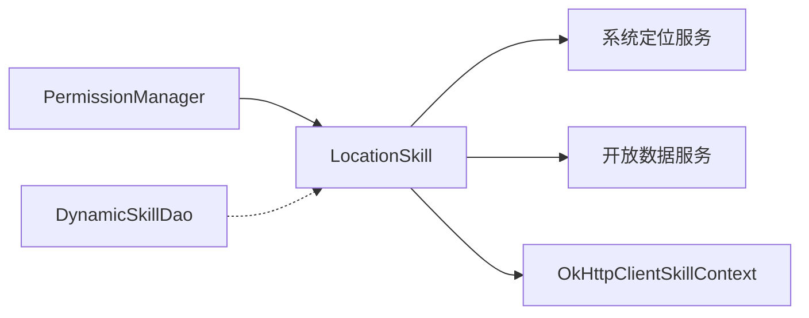

# 位置技能

<cite>
**本文引用的文件**
- [LocationSkill.kt](file://app/src/main/java/ai/openclaw/android/skill/builtin/LocationSkill.kt)
- [PermissionManager.kt](file://app/src/main/java/ai/openclaw/android/permission/PermissionManager.kt)
- [Skill.kt](file://app/src/main/java/ai/openclaw/android/skill/Skill.kt)
- [SkillTool.kt](file://app/src/main/java/ai/openclaw/android/skill/SkillTool.kt)
- [SkillContext.kt](file://app/src/main/java/ai/openclaw/android/skill/SkillContext.kt)
- [DynamicSkillDao.kt](file://app/src/main/java/ai/openclaw/android/data/local/DynamicSkillDao.kt)
</cite>

## 目录
1. [简介](#简介)
2. [项目结构](#项目结构)
3. [核心组件](#核心组件)
4. [架构总览](#架构总览)
5. [详细组件分析](#详细组件分析)
6. [依赖关系分析](#依赖关系分析)
7. [性能考量](#性能考量)
8. [故障排查指南](#故障排查指南)
9. [结论](#结论)
10. [附录](#附录)

## 简介
本文件面向“位置技能”的技术实现与使用，围绕以下目标展开：  
- GPS 定位与地址解析（逆地理编码）  
- 位置权限管理与用户授权流程  
- 定位精度与电池优化策略  
- 地图与导航能力集成现状与建议  
- 位置历史记录与地理围栏功能的扩展建议  
- 使用示例与隐私保护措施  

该技能通过 Android 原生 LocationManager 获取当前位置，结合免费开放数据服务完成地址解析与周边地点检索，并以技能框架统一暴露工具接口。

## 项目结构
位置技能位于内置技能模块中，遵循统一的技能接口规范；权限管理由独立的权限管理器负责；数据库层提供动态技能的持久化支持。

**图表来源**
- [LocationSkill.kt:18-255](file://app/src/main/java/ai/openclaw/android/skill/builtin/LocationSkill.kt#L18-L255)
- [Skill.kt:3-13](file://app/src/main/java/ai/openclaw/android/skill/Skill.kt#L3-L13)
- [SkillTool.kt:3-22](file://app/src/main/java/ai/openclaw/android/skill/SkillTool.kt#L3-L22)
- [SkillContext.kt:6-10](file://app/src/main/java/ai/openclaw/android/skill/SkillContext.kt#L6-L10)
- [PermissionManager.kt:32-189](file://app/src/main/java/ai/openclaw/android/permission/PermissionManager.kt#L32-L189)
- [DynamicSkillDao.kt:7-47](file://app/src/main/java/ai/openclaw/android/data/local/DynamicSkillDao.kt#L7-L47)

**章节来源**
- [LocationSkill.kt:18-255](file://app/src/main/java/ai/openclaw/android/skill/builtin/LocationSkill.kt#L18-L255)
- [PermissionManager.kt:32-189](file://app/src/main/java/ai/openclaw/android/permission/PermissionManager.kt#L32-L189)
- [DynamicSkillDao.kt:7-47](file://app/src/main/java/ai/openclaw/android/data/local/DynamicSkillDao.kt#L7-L47)

## 核心组件
- 定位技能（LocationSkill）：实现三个工具方法，分别用于获取当前位置、逆地理编码地址、搜索附近地点。
- 技能接口体系：Skill、SkillTool、SkillResult、SkillContext 提供统一的技能定义与执行上下文。
- 权限管理器（PermissionManager）：集中处理权限请求、状态查询与特殊权限（如全部文件访问）的判定。
- 动态技能 DAO：为动态启用/禁用、使用统计等场景提供持久化支持。

**章节来源**
- [LocationSkill.kt:37-241](file://app/src/main/java/ai/openclaw/android/skill/builtin/LocationSkill.kt#L37-L241)
- [Skill.kt:3-13](file://app/src/main/java/ai/openclaw/android/skill/Skill.kt#L3-L13)
- [SkillTool.kt:3-22](file://app/src/main/java/ai/openclaw/android/skill/SkillTool.kt#L3-L22)
- [SkillContext.kt:6-10](file://app/src/main/java/ai/openclaw/android/skill/SkillContext.kt#L6-L10)
- [PermissionManager.kt:32-189](file://app/src/main/java/ai/openclaw/android/permission/PermissionManager.kt#L32-L189)
- [DynamicSkillDao.kt:7-47](file://app/src/main/java/ai/openclaw/android/data/local/DynamicSkillDao.kt#L7-L47)

## 架构总览
位置技能在运行时通过 SkillContext 注入 HTTP 客户端，使用系统定位服务与开放数据 API 完成定位与地址解析。权限管理器负责前置校验与授权流程，动态技能 DAO 支持技能生命周期管理。

**图表来源**
- [LocationSkill.kt:44-105](file://app/src/main/java/ai/openclaw/android/skill/builtin/LocationSkill.kt#L44-L105)
- [LocationSkill.kt:117-146](file://app/src/main/java/ai/openclaw/android/skill/builtin/LocationSkill.kt#L117-L146)
- [LocationSkill.kt:178-225](file://app/src/main/java/ai/openclaw/android/skill/builtin/LocationSkill.kt#L178-L225)
- [PermissionManager.kt:72-80](file://app/src/main/java/ai/openclaw/android/permission/PermissionManager.kt#L72-L80)

## 详细组件分析

### 定位技能（LocationSkill）
- 工具一：获取当前位置
  - 权限检查：使用细粒度与粗略位置权限任一满足即视为已授权。
  - 定位策略：优先使用 GPS 提供者，若不可用则回退到网络提供者；同时尝试读取最近一次已知位置作为快速返回。
  - 超时与取消：采用挂起协程与取消回调，避免长时间占用资源。
  - 错误处理：捕获安全异常与业务异常，返回明确的错误信息。
- 工具二：逆地理编码（地址解析）
  - 输入参数：纬度、经度。
  - 实现方式：调用 Nominatim（OpenStreetMap）逆地理编码接口，解析返回 JSON 中的显示名称字段。
  - 输出格式：标准化后的地址字符串。
- 工具三：附近地点搜索
  - 输入参数：关键词、中心点经纬度（可选）、搜索半径（可选，默认 1000 米）。
  - 实现方式：使用 Nominatim 的搜索接口进行关键词检索（简化版），或可扩展为 Overpass API 查询 POI。
  - 输出格式：地点名称列表汇总。

**图表来源**
- [LocationSkill.kt:18-255](file://app/src/main/java/ai/openclaw/android/skill/builtin/LocationSkill.kt#L18-L255)
- [SkillTool.kt:3-22](file://app/src/main/java/ai/openclaw/android/skill/SkillTool.kt#L3-L22)
- [SkillContext.kt:6-10](file://app/src/main/java/ai/openclaw/android/skill/SkillContext.kt#L6-L10)

**章节来源**
- [LocationSkill.kt:37-241](file://app/src/main/java/ai/openclaw/android/skill/builtin/LocationSkill.kt#L37-L241)

### 权限管理（PermissionManager）
- 统一权限请求：通过状态流与挂起函数协调 UI 层弹出系统权限对话框，并等待用户响应。
- 特殊权限处理：对“全部文件访问”等特殊权限提供专用判断逻辑。
- 位置权限映射：将技能 ID 与具体权限数组关联，便于按技能维度查询与展示权限组状态。

**图表来源**
- [PermissionManager.kt:41-70](file://app/src/main/java/ai/openclaw/android/permission/PermissionManager.kt#L41-L70)
- [PermissionManager.kt:114-153](file://app/src/main/java/ai/openclaw/android/permission/PermissionManager.kt#L114-L153)

**章节来源**
- [PermissionManager.kt:32-189](file://app/src/main/java/ai/openclaw/android/permission/PermissionManager.kt#L32-L189)

### 技能接口与上下文
- Skill：定义技能标识、描述、版本、工具集合及生命周期钩子。
- SkillTool：定义工具名称、描述、参数与执行方法。
- SkillResult：封装执行结果与错误信息。
- SkillContext：提供应用上下文、HTTP 客户端与日志能力，供技能初始化与执行使用。

**章节来源**
- [Skill.kt:3-13](file://app/src/main/java/ai/openclaw/android/skill/Skill.kt#L3-L13)
- [SkillTool.kt:3-22](file://app/src/main/java/ai/openclaw/android/skill/SkillTool.kt#L3-L22)
- [SkillContext.kt:6-10](file://app/src/main/java/ai/openclaw/android/skill/SkillContext.kt#L6-L10)

### 动态技能持久化（DynamicSkillDao）
- 提供启用/禁用、最后使用时间更新、按阈值清理等能力，支撑位置技能的动态管理与生命周期维护。

**章节来源**
- [DynamicSkillDao.kt:7-47](file://app/src/main/java/ai/openclaw/android/data/local/DynamicSkillDao.kt#L7-L47)

## 依赖关系分析
- 位置技能依赖系统定位服务与开放数据 API；通过 SkillContext 注入 HTTP 客户端。
- 权限管理器与位置技能解耦，仅通过权限常量与状态查询交互。
- 动态技能 DAO 与位置技能在数据层面解耦，前者负责技能元数据持久化。

**图表来源**
- [LocationSkill.kt:35-35](file://app/src/main/java/ai/openclaw/android/skill/builtin/LocationSkill.kt#L35-L35)
- [LocationSkill.kt:250-252](file://app/src/main/java/ai/openclaw/android/skill/builtin/LocationSkill.kt#L250-L252)
- [PermissionManager.kt:166-173](file://app/src/main/java/ai/openclaw/android/permission/PermissionManager.kt#L166-L173)
- [DynamicSkillDao.kt:7-47](file://app/src/main/java/ai/openclaw/android/data/local/DynamicSkillDao.kt#L7-L47)

**章节来源**
- [LocationSkill.kt:35-35](file://app/src/main/java/ai/openclaw/android/skill/builtin/LocationSkill.kt#L35-L35)
- [LocationSkill.kt:250-252](file://app/src/main/java/ai/openclaw/android/skill/builtin/LocationSkill.kt#L250-L252)
- [PermissionManager.kt:166-173](file://app/src/main/java/ai/openclaw/android/permission/PermissionManager.kt#L166-L173)
- [DynamicSkillDao.kt:7-47](file://app/src/main/java/ai/openclaw/android/data/local/DynamicSkillDao.kt#L7-L47)

## 性能考量
- 定位策略
  - 优先 GPS 提供者，提升精度；在网络不可用时回退至网络提供者，保证可用性。
  - 使用最近一次已知位置作为快速路径，减少等待时间。
- 超时与取消
  - 采用挂起协程与取消回调，避免长时间监听导致的资源浪费。
- 网络请求
  - 使用统一的 OkHttpClient，复用连接池；设置合理的 User-Agent 与超时策略。
- 电池优化
  - 当前实现为一次性定位与短时网络请求，符合低功耗场景；若需持续定位，应引入更精细的频率与模式控制（见扩展建议）。

[本节为通用性能讨论，不直接分析具体文件]

## 故障排查指南
- 无位置权限
  - 现象：工具执行返回“需要位置权限”。
  - 处理：通过权限管理器发起授权流程，确保细粒度或粗略位置权限至少一项已授予。
- 无法获取位置
  - 现象：返回“无法获取位置，请确保 GPS 已开启”。
  - 处理：确认设备定位开关已开启，GPS 与网络提供者至少一项可用；检查定位权限状态。
- 地址解析失败
  - 现象：返回“地址解析失败”或空结果。
  - 处理：检查网络连通性与 Nominatim 服务可用性；确认传入经纬度有效。
- 地点搜索失败
  - 现象：返回“搜索失败”或空列表。
  - 处理：检查网络连通性与 Nominatim 搜索接口可用性；确认关键词与半径参数合理。

**章节来源**
- [LocationSkill.kt:45-58](file://app/src/main/java/ai/openclaw/android/skill/builtin/LocationSkill.kt#L45-L58)
- [LocationSkill.kt:135-145](file://app/src/main/java/ai/openclaw/android/skill/builtin/LocationSkill.kt#L135-L145)
- [LocationSkill.kt:207-224](file://app/src/main/java/ai/openclaw/android/skill/builtin/LocationSkill.kt#L207-L224)

## 结论
位置技能以简洁清晰的方式实现了定位、地址解析与地点搜索三大核心能力，具备良好的权限隔离与错误处理机制。通过统一的技能接口与上下文，可与其他技能协同工作。后续可在持续定位、地理围栏、位置历史与导航集成等方面进一步增强。

[本节为总结性内容，不直接分析具体文件]

## 附录

### 使用示例（步骤说明）
- 获取当前位置
  - 步骤：调用工具“get_location”，若提示需要权限则先完成授权；等待结果返回经纬度。
  - 参考路径：[LocationSkill.kt:44-105](file://app/src/main/java/ai/openclaw/android/skill/builtin/LocationSkill.kt#L44-L105)
- 地址解析
  - 步骤：调用工具“get_address”，传入 latitude 与 longitude；等待返回标准化地址。
  - 参考路径：[LocationSkill.kt:117-146](file://app/src/main/java/ai/openclaw/android/skill/builtin/LocationSkill.kt#L117-L146)
- 附近地点搜索
  - 步骤：调用工具“search_places”，传入 query；可选传入 latitude、longitude、radius；等待返回地点列表。
  - 参考路径：[LocationSkill.kt:178-225](file://app/src/main/java/ai/openclaw/android/skill/builtin/LocationSkill.kt#L178-L225)

### 隐私保护措施
- 最小权限原则：仅申请必要的位置权限（细粒度或粗略）。
- 明确用途：在技能说明中清晰告知定位与地址解析的用途。
- 数据最小化：仅传输必要参数（经纬度或关键词），避免收集无关信息。
- 用户同意：通过权限管理器在 UI 层展示权限请求与拒绝选项，尊重用户选择。
- 传输安全：使用 HTTPS 与合理的超时配置，避免敏感数据泄露。

**章节来源**
- [LocationSkill.kt:24-33](file://app/src/main/java/ai/openclaw/android/skill/builtin/LocationSkill.kt#L24-L33)
- [PermissionManager.kt:41-70](file://app/src/main/java/ai/openclaw/android/permission/PermissionManager.kt#L41-L70)

### 扩展建议（概念性）
- 地图与导航
  - 集成第三方地图 SDK（如高德/百度/Google Maps）以提供更丰富的地图与导航能力。
  - 导航路线规划与实时导航可作为新工具扩展。
- 位置历史与地理围栏
  - 引入 Room 或本地数据库保存历史轨迹与围栏事件。
  - 基于 Geofencing API 实现地理围栏，结合通知与自动化规则。
- 电池优化
  - 对持续定位场景，采用合适的定位频率与模式（如高精准/低功耗）。
  - 在后台任务中限制定位频率，避免频繁唤醒 CPU。

[本节为概念性建议，不直接分析具体文件]