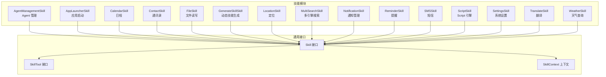
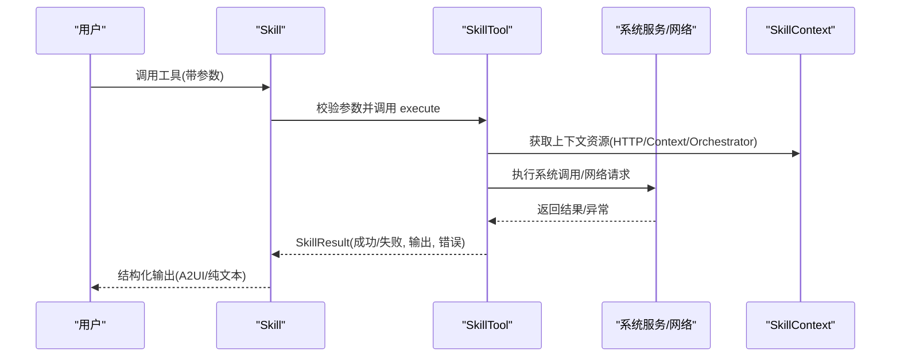
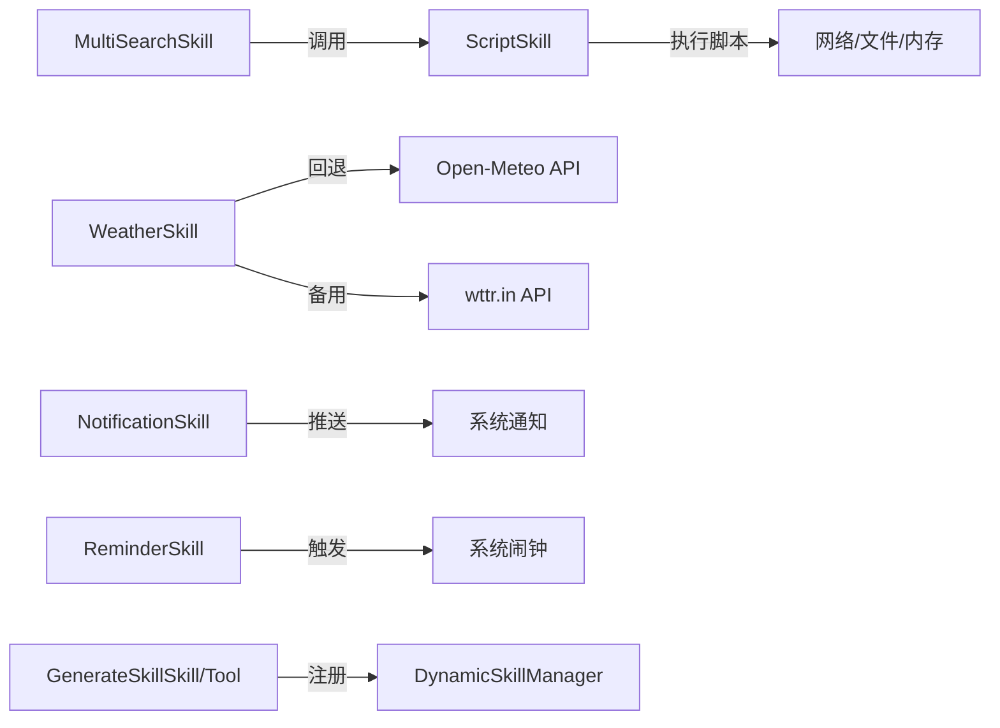

# 内置技能实现

<cite>
**本文档引用的文件**
- [AgentManagementSkill.kt](file://app/src/main/java/ai/openclaw/android/skill/builtin/AgentManagementSkill.kt)
- [AppLauncherSkill.kt](file://app/src/main/java/ai/openclaw/android/skill/builtin/AppLauncherSkill.kt)
- [CalendarSkill.kt](file://app/src/main/java/ai/openclaw/android/skill/builtin/CalendarSkill.kt)
- [ContactSkill.kt](file://app/src/main/java/ai/openclaw/android/skill/builtin/ContactSkill.kt)
- [FileSkill.kt](file://app/src/main/java/ai/openclaw/android/skill/builtin/FileSkill.kt)
- [GenerateSkillSkill.kt](file://app/src/main/java/ai/openclaw/android/skill/builtin/GenerateSkillSkill.kt)
- [GenerateSkillTool.kt](file://app/src/main/java/ai/openclaw/android/skill/builtin/GenerateSkillTool.kt)
- [LocationSkill.kt](file://app/src/main/java/ai/openclaw/android/skill/builtin/LocationSkill.kt)
- [MultiSearchSkill.kt](file://app/src/main/java/ai/openclaw/android/skill/builtin/MultiSearchSkill.kt)
- [NotificationSkill.kt](file://app/src/main/java/ai/openclaw/android/skill/builtin/NotificationSkill.kt)
- [ReminderSkill.kt](file://app/src/main/java/ai/openclaw/android/skill/builtin/ReminderSkill.kt)
- [SMSSkill.kt](file://app/src/main/java/ai/openclaw/android/skill/builtin/SMSSkill.kt)
- [ScriptSkill.kt](file://app/src/main/java/ai/openclaw/android/skill/builtin/ScriptSkill.kt)
- [SettingsSkill.kt](file://app/src/main/java/ai/openclaw/android/skill/builtin/SettingsSkill.kt)
- [TranslateSkill.kt](file://app/src/main/java/ai/openclaw/android/skill/builtin/TranslateSkill.kt)
- [WeatherSkill.kt](file://app/src/main/java/ai/openclaw/android/skill/builtin/WeatherSkill.kt)
</cite>

## 目录
1. [简介](#简介)
2. [项目结构](#项目结构)
3. [核心组件](#核心组件)
4. [架构总览](#架构总览)
5. [详细组件分析](#详细组件分析)
6. [依赖分析](#依赖分析)
7. [性能考量](#性能考量)
8. [故障排查指南](#故障排查指南)
9. [结论](#结论)
10. [附录](#附录)

## 简介
本文件系统性梳理 OpenClaw Android 项目中的 12 类内置技能，涵盖功能特性、实现原理、参数校验、执行逻辑、权限与安全、技能协作与依赖、性能优化与错误处理策略，并提供实际使用案例与扩展开发指导。目标读者包括工程师、产品与测试人员。

## 项目结构
内置技能位于 skill/builtin 包下，每个技能以类的形式组织，统一实现 Skill 接口；每个技能包含若干 SkillTool，用于具体能力执行。技能通过 SkillContext 注入运行时资源（如 Context、OkHttpClient、ScriptOrchestrator 等）。

图表来源
- [AgentManagementSkill.kt:6-34](file://app/src/main/java/ai/openclaw/android/skill/builtin/AgentManagementSkill.kt#L6-L34)
- [AppLauncherSkill.kt:8-193](file://app/src/main/java/ai/openclaw/android/skill/builtin/AppLauncherSkill.kt#L8-L193)
- [CalendarSkill.kt:13-182](file://app/src/main/java/ai/openclaw/android/skill/builtin/CalendarSkill.kt#L13-L182)
- [ContactSkill.kt:13-243](file://app/src/main/java/ai/openclaw/android/skill/builtin/ContactSkill.kt#L13-L243)
- [FileSkill.kt:30-310](file://app/src/main/java/ai/openclaw/android/skill/builtin/FileSkill.kt#L30-L310)
- [GenerateSkillSkill.kt:10-27](file://app/src/main/java/ai/openclaw/android/skill/builtin/GenerateSkillSkill.kt#L10-L27)
- [GenerateSkillTool.kt:10-88](file://app/src/main/java/ai/openclaw/android/skill/builtin/GenerateSkillTool.kt#L10-L88)
- [LocationSkill.kt:18-255](file://app/src/main/java/ai/openclaw/android/skill/builtin/LocationSkill.kt#L18-L255)
- [MultiSearchSkill.kt:14-131](file://app/src/main/java/ai/openclaw/android/skill/builtin/MultiSearchSkill.kt#L14-L131)
- [NotificationSkill.kt:14-216](file://app/src/main/java/ai/openclaw/android/skill/builtin/NotificationSkill.kt#L14-L216)
- [ReminderSkill.kt:13-304](file://app/src/main/java/ai/openclaw/android/skill/builtin/ReminderSkill.kt#L13-L304)
- [SMSSkill.kt:15-185](file://app/src/main/java/ai/openclaw/android/skill/builtin/SMSSkill.kt#L15-L185)
- [ScriptSkill.kt:19-134](file://app/src/main/java/ai/openclaw/android/skill/builtin/ScriptSkill.kt#L19-L134)
- [SettingsSkill.kt:14-234](file://app/src/main/java/ai/openclaw/android/skill/builtin/SettingsSkill.kt#L14-L234)
- [TranslateSkill.kt:11-159](file://app/src/main/java/ai/openclaw/android/skill/builtin/TranslateSkill.kt#L11-L159)
- [WeatherSkill.kt:11-399](file://app/src/main/java/ai/openclaw/android/skill/builtin/WeatherSkill.kt#L11-L399)

章节来源
- [AgentManagementSkill.kt:6-34](file://app/src/main/java/ai/openclaw/android/skill/builtin/AgentManagementSkill.kt#L6-L34)
- [AppLauncherSkill.kt:8-193](file://app/src/main/java/ai/openclaw/android/skill/builtin/AppLauncherSkill.kt#L8-L193)
- [CalendarSkill.kt:13-182](file://app/src/main/java/ai/openclaw/android/skill/builtin/CalendarSkill.kt#L13-L182)
- [ContactSkill.kt:13-243](file://app/src/main/java/ai/openclaw/android/skill/builtin/ContactSkill.kt#L13-L243)
- [FileSkill.kt:30-310](file://app/src/main/java/ai/openclaw/android/skill/builtin/FileSkill.kt#L30-L310)
- [GenerateSkillSkill.kt:10-27](file://app/src/main/java/ai/openclaw/android/skill/builtin/GenerateSkillSkill.kt#L10-L27)
- [GenerateSkillTool.kt:10-88](file://app/src/main/java/ai/openclaw/android/skill/builtin/GenerateSkillTool.kt#L10-L88)
- [LocationSkill.kt:18-255](file://app/src/main/java/ai/openclaw/android/skill/builtin/LocationSkill.kt#L18-L255)
- [MultiSearchSkill.kt:14-131](file://app/src/main/java/ai/openclaw/android/skill/builtin/MultiSearchSkill.kt#L14-L131)
- [NotificationSkill.kt:14-216](file://app/src/main/java/ai/openclaw/android/skill/builtin/NotificationSkill.kt#L14-L216)
- [ReminderSkill.kt:13-304](file://app/src/main/java/ai/openclaw/android/skill/builtin/ReminderSkill.kt#L13-L304)
- [SMSSkill.kt:15-185](file://app/src/main/java/ai/openclaw/android/skill/builtin/SMSSkill.kt#L15-L185)
- [ScriptSkill.kt:19-134](file://app/src/main/java/ai/openclaw/android/skill/builtin/ScriptSkill.kt#L19-L134)
- [SettingsSkill.kt:14-234](file://app/src/main/java/ai/openclaw/android/skill/builtin/SettingsSkill.kt#L14-L234)
- [TranslateSkill.kt:11-159](file://app/src/main/java/ai/openclaw/android/skill/builtin/TranslateSkill.kt#L11-L159)
- [WeatherSkill.kt:11-399](file://app/src/main/java/ai/openclaw/android/skill/builtin/WeatherSkill.kt#L11-L399)

## 核心组件
- Skill 接口：定义技能的唯一标识、名称、描述、版本、指令说明、工具集合以及生命周期回调 initialize/cleanup。
- SkillTool 接口：定义工具的名称、描述、参数定义（SkillParam）、执行函数 execute。
- SkillContext：提供应用上下文、HTTP 客户端、应用级资源等，技能在 initialize 中注入所需依赖。
- 动态技能：通过 GenerateSkillSkill/GenerateSkillTool 注册由 LLM 生成的 JSON 定义技能，实现“自动生成技能”的能力。

章节来源
- [GenerateSkillSkill.kt:10-27](file://app/src/main/java/ai/openclaw/android/skill/builtin/GenerateSkillSkill.kt#L10-L27)
- [GenerateSkillTool.kt:10-88](file://app/src/main/java/ai/openclaw/android/skill/builtin/GenerateSkillTool.kt#L10-L88)

## 架构总览
内置技能围绕 Skill/SkillTool 体系组织，各技能通过 Context 注入系统服务（PackageManager、ContentResolver、AlarmManager、OkHttpClient 等），并在工具执行时进行参数校验与异常捕获。动态技能通过 ScriptOrchestrator 执行 JS 脚本，实现灵活扩展。

图表来源
- [ScriptSkill.kt:64-87](file://app/src/main/java/ai/openclaw/android/skill/builtin/ScriptSkill.kt#L64-L87)
- [WeatherSkill.kt:78-107](file://app/src/main/java/ai/openclaw/android/skill/builtin/WeatherSkill.kt#L78-L107)
- [LocationSkill.kt:39-59](file://app/src/main/java/ai/openclaw/android/skill/builtin/LocationSkill.kt#L39-L59)

## 详细组件分析

### AgentManagementSkill（Agent 管理）
- 功能：管理多 Agent 配置，支持列出、创建、删除、查看配置。
- 工具：
  - list_agents：枚举 Agent 并格式化输出。
  - create_agent：校验必填参数 id/name/model，调用 AgentRegistry 创建并返回配置路径。
  - delete_agent：禁止删除默认 Agent，返回删除结果。
  - get_agent_config：读取并格式化输出指定 Agent 的配置。
- 参数验证：严格检查必填字段，缺失时报错。
- 安全与权限：无敏感权限要求，但涉及文件系统写入。
- 性能与错误：异常捕获并返回友好错误信息。

章节来源
- [AgentManagementSkill.kt:6-128](file://app/src/main/java/ai/openclaw/android/skill/builtin/AgentManagementSkill.kt#L6-L128)

### AppLauncherSkill（应用启动）
- 功能：打开应用或列出已安装应用。
- 工具：
  - open：支持按包名或应用名启动；若包名存在优先包名匹配。
  - list_apps：列出系统可启动应用，支持关键词过滤与数量限制。
- 参数验证：至少提供 app_name 或 package_name；list_apps 支持可选 filter。
- 权限与兼容：使用 PackageManager 查询，注意不同 Android 版本 API 差异。
- 错误处理：未找到应用、权限问题、异常均返回明确错误。

章节来源
- [AppLauncherSkill.kt:8-193](file://app/src/main/java/ai/openclaw/android/skill/builtin/AppLauncherSkill.kt#L8-L193)

### CalendarSkill（日程）
- 功能：查询未来 N 天日历事件、添加事件。
- 工具：
  - list_events：默认 7 天范围，返回事件标题与时间。
  - add_event：解析时间字符串，插入 CalendarContract 事件。
- 参数验证：校验标题、起止时间格式；默认 days=7。
- 权限：需要日历读写权限；异常捕获并提示权限缺失。
- 数据结构：EventInfo 数据类封装事件字段。

章节来源
- [CalendarSkill.kt:13-182](file://app/src/main/java/ai/openclaw/android/skill/builtin/CalendarSkill.kt#L13-L182)

### ContactSkill（通讯录）
- 功能：搜索联系人、获取联系人详情、拨打电话。
- 工具：
  - search_contacts：模糊匹配姓名或号码，避免重复。
  - get_contact：按姓名精确查找。
  - call_contact：支持直接拨号或先查再拨。
- 权限：READ_CONTACTS；拨号使用 ACTION_DIAL。
- 错误处理：权限不足、未找到联系人、异常均返回错误。

章节来源
- [ContactSkill.kt:13-243](file://app/src/main/java/ai/openclaw/android/skill/builtin/ContactSkill.kt#L13-L243)

### FileSkill（文件读写）
- 功能：在应用专属存储中读写文件、列出目录。
- 路径策略：支持 ~、~/internal、绝对路径重定向至外部目录；限制单次读取最大字符数、不支持二进制。
- 工具：
  - read_file：校验路径、文件存在性、大小限制，返回文件元信息与内容。
  - write_file：自动创建父目录，支持覆盖/追加。
  - list_dir：列出目录项，区分文件与目录，标注存储位置。
- 安全：Scoped Storage 兼容，避免直接访问根目录。
- 错误处理：权限不足、IO 异常、路径解析错误均有明确反馈。

章节来源
- [FileSkill.kt:30-310](file://app/src/main/java/ai/openclaw/android/skill/builtin/FileSkill.kt#L30-L310)

### GenerateSkillSkill / GenerateSkillTool（动态技能生成）
- 功能：接收 JSON 定义，注册新的动态技能，使 LLM 能“自动生成技能”。
- 参数：skillJson 必填，需包含 id、name、description、version、instructions、script、tools 等字段。
- 安全：通过 DynamicSkillManager 注册，遵循技能定义规范。
- 错误处理：参数缺失、JSON 无效、注册失败均返回错误。

章节来源
- [GenerateSkillSkill.kt:10-27](file://app/src/main/java/ai/openclaw/android/skill/builtin/GenerateSkillSkill.kt#L10-L27)
- [GenerateSkillTool.kt:10-88](file://app/src/main/java/ai/openclaw/android/skill/builtin/GenerateSkillTool.kt#L10-L88)

### LocationSkill（定位）
- 功能：获取当前位置、逆地理编码、搜索附近地点。
- 工具：
  - get_location：优先 GPS，回退网络；10 秒超时。
  - get_address：Nominatim 逆地理编码。
  - search_places：Nominatim 搜索（简化版）。
- 权限：ACCESS_FINE_LOCATION/ACCESS_COARSE_LOCATION。
- 错误处理：权限缺失、网络异常、解析失败均返回错误。

章节来源
- [LocationSkill.kt:18-255](file://app/src/main/java/ai/openclaw/android/skill/builtin/LocationSkill.kt#L18-L255)

### MultiSearchSkill（多引擎搜索）
- 功能：基于 SearXNG 的互联网搜索，返回文本摘要与 A2UI 卡片。
- 工具：
  - search：拼装 JS 脚本，注入查询变量，执行后解析 JSON。
- 依赖：ScriptOrchestrator、assets/scripts/search.js。
- 输出：纯文本摘要 + [A2UI] 卡片 JSON。

章节来源
- [MultiSearchSkill.kt:14-131](file://app/src/main/java/ai/openclaw/android/skill/builtin/MultiSearchSkill.kt#L14-L131)

### NotificationSkill（通知管理）
- 功能：获取通知列表、发送本地通知、删除/清空通知、标记已读。
- 工具：
  - list_notifications：支持包名过滤、数量限制、是否包含已读。
  - send_notification：构建通知并 notify。
  - delete_notification/clear_notifications/mark_notification_read：系统与内存状态同步。
- 依赖：SmartNotificationListener、NotificationManager。
- 输出：格式化通知列表或成功提示。

章节来源
- [NotificationSkill.kt:14-216](file://app/src/main/java/ai/openclaw/android/skill/builtin/NotificationSkill.kt#L14-L216)

### ReminderSkill（提醒）
- 功能：设置/列出/取消提醒，支持相对时间与绝对时间。
- 工具：
  - set_reminder：解析时间、调度 AlarmManager、构建 A2UI 确认卡片。
  - list_reminders：构建提醒列表卡片。
  - cancel_reminder：移除 Alarm 并更新内存状态。
- 安全：Android 13+ 检测精确闹钟权限，必要时降级为允许在 Doze 模式下的闹钟。
- 输出：A2UI 卡片 JSON。

章节来源
- [ReminderSkill.kt:13-304](file://app/src/main/java/ai/openclaw/android/skill/builtin/ReminderSkill.kt#L13-L304)

### SMSSkill（短信）
- 功能：发送短信、读取短信、统计未读数。
- 工具：
  - send_sms：SEND_SMS 权限校验。
  - read_sms：按条件查询短信，限制数量。
  - get_unread_sms：查询未读计数。
- 权限：SEND_SMS、READ_SMS。
- 错误处理：权限不足、查询异常返回错误。

章节来源
- [SMSSkill.kt:15-185](file://app/src/main/java/ai/openclaw/android/skill/builtin/SMSSkill.kt#L15-L185)

### ScriptSkill（Script 引擎）
- 功能：执行 JS 脚本，桥接文件系统、HTTP、内存检索等能力。
- 工具：
  - execute_script：支持 fs、http、memory 能力选择，构建 MemoryBridge。
- 限制：禁用导入/求值，脚本大小与执行时间限制，沙箱目录限制。
- 输出：脚本执行结果或错误。

章节来源
- [ScriptSkill.kt:19-134](file://app/src/main/java/ai/openclaw/android/skill/builtin/ScriptSkill.kt#L19-L134)

### SettingsSkill（系统设置）
- 功能：打开系统设置页面、切换蓝牙、控制音量。
- 工具：
  - open_settings：按类型打开对应设置页。
  - toggle_bluetooth：Android 13+ 无法直接切换，改打开设置页。
  - volume：支持 up/down/mute/unmute/set，按流类型调节。
- 兼容性：针对不同 Android 版本的权限与行为差异进行降级处理。

章节来源
- [SettingsSkill.kt:14-234](file://app/src/main/java/ai/openclaw/android/skill/builtin/SettingsSkill.kt#L14-L234)

### TranslateSkill（翻译）
- 功能：使用 MyMemory API 进行多语言翻译，支持自动语言检测。
- 工具：
  - translate：构造请求，解析响应，构建 A2UI 翻译卡片。
- 输出：A2UI 卡片 JSON，含源语言、目标语言、文本与操作按钮。

章节来源
- [TranslateSkill.kt:11-159](file://app/src/main/java/ai/openclaw/android/skill/builtin/TranslateSkill.kt#L11-L159)

### WeatherSkill（天气查询）
- 功能：查询当前天气与天气预报，支持中文城市名与英文城市名，双数据源回退。
- 工具：
  - get_weather：优先 wttr.in，失败回退 Open-Meteo；构建 A2UI 天气卡片。
- 数据：内置常见城市坐标映射，WMO 天气代码映射中文描述。
- 输出：A2UI 卡片 JSON，含温度、体感、湿度、风力、动作按钮。

章节来源
- [WeatherSkill.kt:11-399](file://app/src/main/java/ai/openclaw/android/skill/builtin/WeatherSkill.kt#L11-L399)

## 依赖分析
- 技能间协作：
  - ScriptSkill 与 MultiSearchSkill：前者提供脚本执行能力，后者提供搜索能力，二者可组合完成复杂任务。
  - WeatherSkill 与 ReminderSkill：天气变化可触发提醒（如降雨提醒）。
  - NotificationSkill 与 ScriptSkill：脚本可生成通知内容并由通知技能推送。
- 外部依赖：
  - OkHttp：网络请求（LocationSkill、TranslateSkill、WeatherSkill、MultiSearchSkill）。
  - Android 系统服务：PackageManager、ContentResolver、AlarmManager、NotificationManager、SmsManager、LocationManager 等。
- 动态技能：GenerateSkillSkill/Tool 依赖 DynamicSkillManager 注册新技能。

图表来源
- [ScriptSkill.kt:64-87](file://app/src/main/java/ai/openclaw/android/skill/builtin/ScriptSkill.kt#L64-L87)
- [MultiSearchSkill.kt:54-84](file://app/src/main/java/ai/openclaw/android/skill/builtin/MultiSearchSkill.kt#L54-L84)
- [WeatherSkill.kt:98-107](file://app/src/main/java/ai/openclaw/android/skill/builtin/WeatherSkill.kt#L98-L107)
- [NotificationSkill.kt:106-139](file://app/src/main/java/ai/openclaw/android/skill/builtin/NotificationSkill.kt#L106-L139)
- [ReminderSkill.kt:97-134](file://app/src/main/java/ai/openclaw/android/skill/builtin/ReminderSkill.kt#L97-L134)
- [GenerateSkillSkill.kt:10-27](file://app/src/main/java/ai/openclaw/android/skill/builtin/GenerateSkillSkill.kt#L10-L27)

## 性能考量
- I/O 限制：FileSkill 限制单次读取字符数，避免大文件阻塞。
- 网络超时：LocationSkill 10 秒超时，防止长时间等待；WeatherSkill 双数据源回退减少失败影响。
- UI 卡片渲染：多技能输出 A2UI 卡片，前端可并行渲染，提升交互体验。
- 电池与后台：ReminderSkill 在 Android 13+ 采用允许在 Doze 模式的闹钟，兼顾准确性与能耗。
- 脚本沙箱：ScriptSkill 限制脚本能力与大小，避免滥用导致性能问题。

## 故障排查指南
- 权限问题：
  - 日历：CalendarSkill 需日历权限；异常捕获返回“需要日历权限”。
  - 通讯录：ContactSkill 需 READ_CONTACTS；拨号使用 ACTION_DIAL。
  - 短信：SMSSkill 需 SEND_SMS/READ_SMS。
  - 定位：LocationSkill 需 ACCESS_FINE_LOCATION/ACCESS_COARSE_LOCATION。
- 网络错误：
  - TranslateSkill/WeatherSkill/LocationSkill：HTTP 请求失败返回错误码或解析失败提示。
- 文件系统：
  - FileSkill：路径不存在、非文件、超出读取限制、权限不足均返回明确错误。
- 动态技能：
  - GenerateSkillTool：JSON 缺失字段、注册失败均返回错误信息。
- 通知与提醒：
  - NotificationSkill：删除/清空通知后同步内存状态；ReminderSkill：权限不足时降级为设置页。

章节来源
- [CalendarSkill.kt:54-58](file://app/src/main/java/ai/openclaw/android/skill/builtin/CalendarSkill.kt#L54-L58)
- [ContactSkill.kt:43-45](file://app/src/main/java/ai/openclaw/android/skill/builtin/ContactSkill.kt#L43-L45)
- [SMSSkill.kt:51-53](file://app/src/main/java/ai/openclaw/android/skill/builtin/SMSSkill.kt#L51-L53)
- [LocationSkill.kt:45-47](file://app/src/main/java/ai/openclaw/android/skill/builtin/LocationSkill.kt#L45-L47)
- [TranslateSkill.kt:66-68](file://app/src/main/java/ai/openclaw/android/skill/builtin/TranslateSkill.kt#L66-L68)
- [WeatherSkill.kt:121-129](file://app/src/main/java/ai/openclaw/android/skill/builtin/WeatherSkill.kt#L121-L129)
- [FileSkill.kt:113-122](file://app/src/main/java/ai/openclaw/android/skill/builtin/FileSkill.kt#L113-L122)
- [GenerateSkillTool.kt:64-69](file://app/src/main/java/ai/openclaw/android/skill/builtin/GenerateSkillTool.kt#L64-L69)
- [NotificationSkill.kt:153-159](file://app/src/main/java/ai/openclaw/android/skill/builtin/NotificationSkill.kt#L153-L159)
- [ReminderSkill.kt:117-130](file://app/src/main/java/ai/openclaw/android/skill/builtin/ReminderSkill.kt#L117-L130)

## 结论
内置技能体系以 Skill/SkillTool 为核心，结合 Android 系统服务与网络 API，提供从设备控制、系统设置、文件管理、通讯录、日程、通知、提醒、定位、天气、翻译到动态扩展的完整能力谱系。通过参数校验、权限控制、错误处理与 A2UI 卡片输出，既保证安全性与稳定性，又提升了用户体验。建议在生产环境中持续完善权限提示、网络回退策略与脚本沙箱安全边界。

## 附录
- 使用案例与集成示例（概念性说明）
  - 动态技能生成：通过 LLM 生成 JSON 定义，调用 generate_skill 注册新工具，随后在对话中直接使用。
  - 组合场景：用户询问天气并设置“降雨提醒”，先调用 WeatherSkill，再调用 ReminderSkill。
  - 脚本扩展：ScriptSkill 执行 JS 脚本，结合 fs/http/memory 能力完成复杂流程。
- 扩展开发指导
  - 新增技能：实现 Skill 接口，定义工具与参数，必要时在 initialize 中注入 Context/HTTP 客户端。
  - 参数设计：使用 SkillParam 描述类型、必填、默认值与说明，便于 LLM 正确调用。
  - 安全与合规：严格校验输入、最小权限原则、异常捕获与错误提示。
  - 性能优化：限制 I/O 与网络开销，合理使用缓存与降级策略，输出结构化卡片提升前端渲染效率。