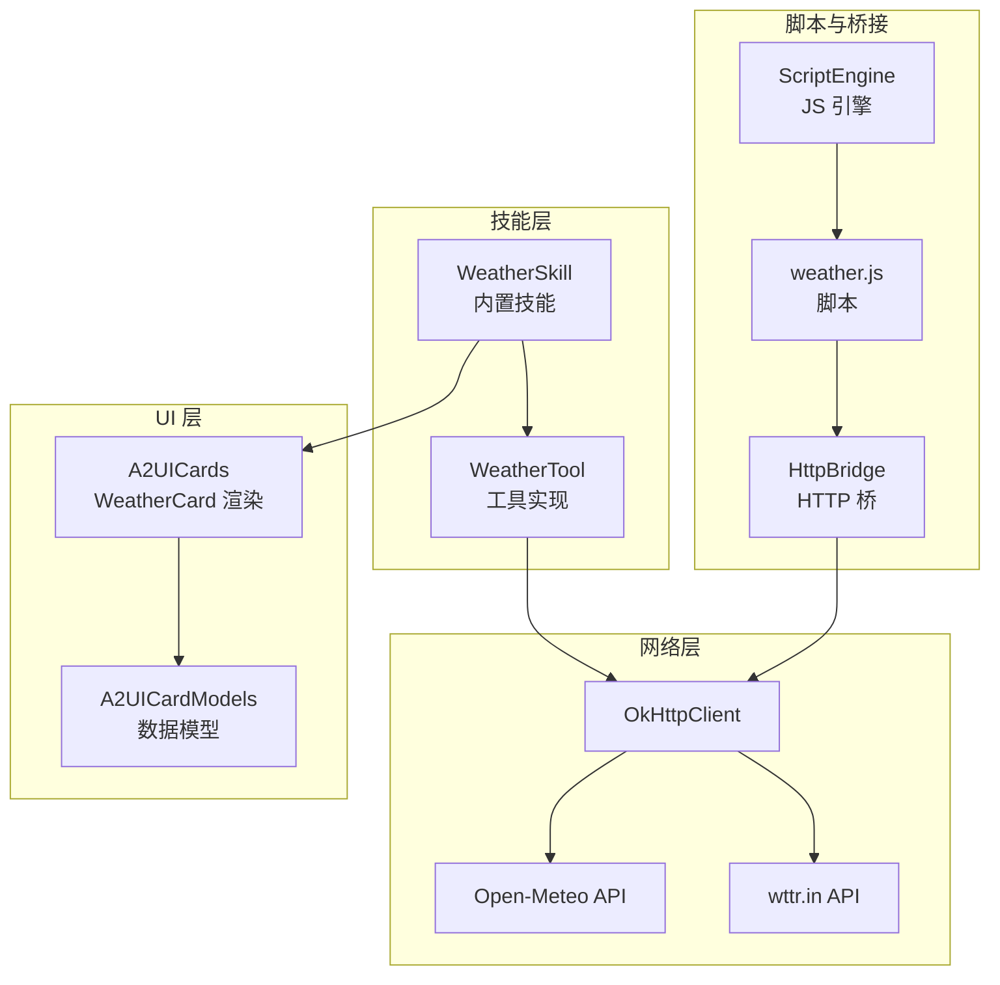
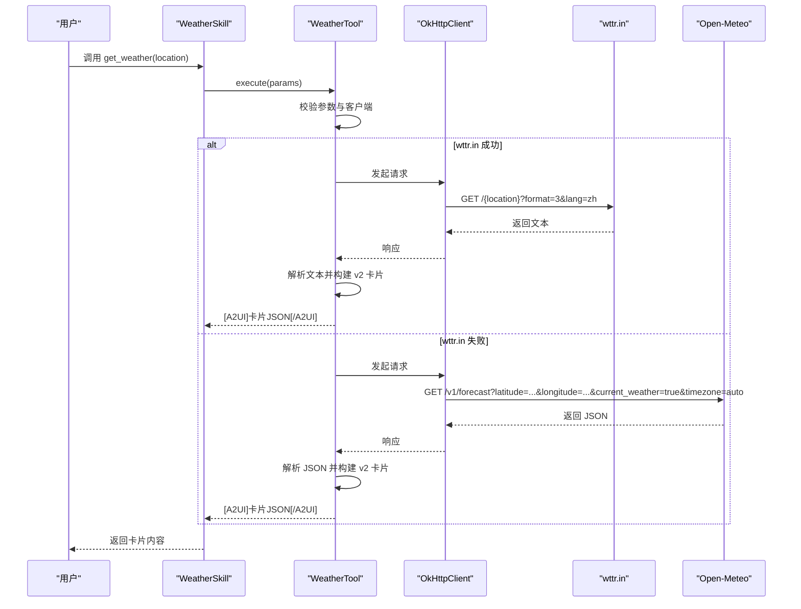
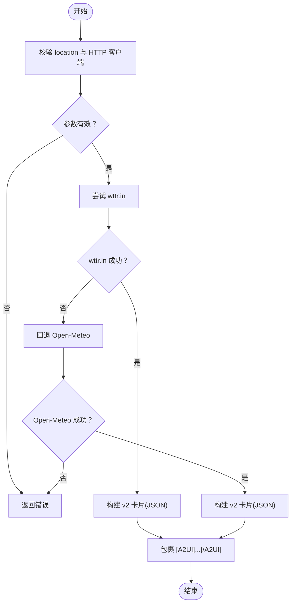
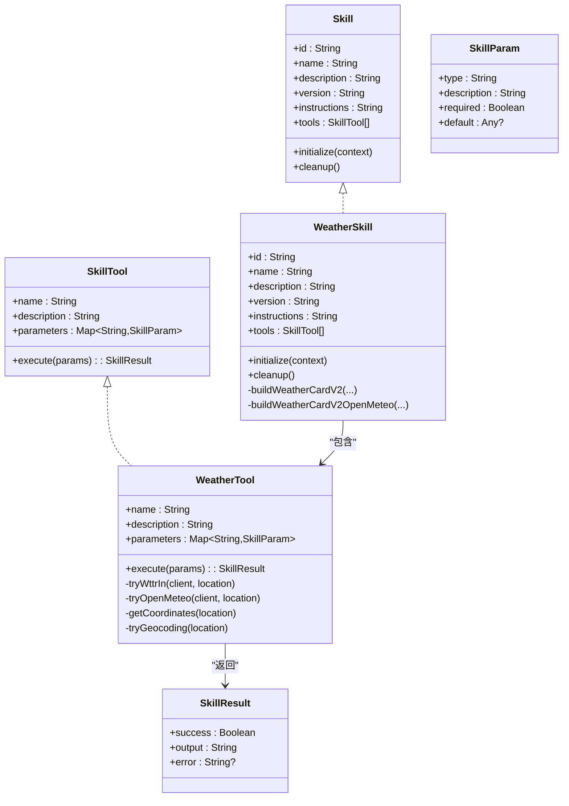

# 天气技能

<cite>
**本文引用的文件**
- [WeatherSkill.kt](file://app/src/main/java/ai/openclaw/android/skill/builtin/WeatherSkill.kt)
- [Skill.kt](file://app/src/main/java/ai/openclaw/android/skill/Skill.kt)
- [SkillTool.kt](file://app/src/main/java/ai/openclaw/android/skill/SkillTool.kt)
- [SkillContext.kt](file://app/src/main/java/ai/openclaw/android/skill/SkillContext.kt)
- [A2UICards.kt](file://app/src/main/java/ai/openclaw/android/ui/A2UICards.kt)
- [A2UICardModels.kt](file://app/src/main/java/ai/openclaw/android/ui/A2UICardModels.kt)
- [weather.js](file://app/src/main/assets/scripts/weather.js)
- [ScriptEngine.kt](file://script/src/main/java/ai/openclaw/script/ScriptEngine.kt)
- [HttpBridge.kt](file://script/src/main/java/ai/openclaw/script/bridge/HttpBridge.kt)
- [WeatherSkillTest.kt](file://app/src/test/java/ai/openclaw/android/skill/builtin/WeatherSkillTest.kt)
- [WeatherSkillV2Test.kt](file://app/src/test/java/ai/openclaw/android/skill/builtin/WeatherSkillV2Test.kt)
</cite>

## 目录
1. [简介](#简介)
2. [项目结构](#项目结构)
3. [核心组件](#核心组件)
4. [架构总览](#架构总览)
5. [详细组件分析](#详细组件分析)
6. [依赖关系分析](#依赖关系分析)
7. [性能考量](#性能考量)
8. [故障排查指南](#故障排查指南)
9. [结论](#结论)
10. [附录](#附录)

## 简介
本文件系统性阐述天气技能的实现与使用方法，覆盖以下关键点：
- 多数据源回退机制：优先使用 wttr.in，失败时自动回退至 Open-Meteo
- 工具定义、参数校验与执行流程
- 城市坐标映射、天气代码转换与 A2UI 卡片构建
- 地理位置解析、网络请求处理与错误恢复策略
- 实际使用示例与集成指导

## 项目结构
天气技能位于应用模块的内置技能目录下，并与 A2UI 卡片渲染系统、脚本沙箱与 HTTP 桥接紧密协作。

图表来源
- [WeatherSkill.kt:11-399](file://app/src/main/java/ai/openclaw/android/skill/builtin/WeatherSkill.kt#L11-L399)
- [A2UICards.kt:175-321](file://app/src/main/java/ai/openclaw/android/ui/A2UICards.kt#L175-L321)
- [A2UICardModels.kt:83-140](file://app/src/main/java/ai/openclaw/android/ui/A2UICardModels.kt#L83-L140)
- [ScriptEngine.kt:45-99](file://script/src/main/java/ai/openclaw/script/ScriptEngine.kt#L45-L99)
- [HttpBridge.kt:18-87](file://script/src/main/java/ai/openclaw/script/bridge/HttpBridge.kt#L18-L87)
- [weather.js:1-16](file://app/src/main/assets/scripts/weather.js#L1-L16)

章节来源
- [WeatherSkill.kt:11-399](file://app/src/main/java/ai/openclaw/android/skill/builtin/WeatherSkill.kt#L11-L399)

## 核心组件
- 技能接口与工具接口：定义技能元数据、工具参数与执行结果
- WeatherSkill：实现“天气查询”技能，包含工具定义、参数校验、回退策略与卡片构建
- A2UI 卡片系统：统一的数据模型与渲染组件，支持天气卡片展示
- 脚本与桥接：通过 JS 脚本与 HTTP 桥访问外部 API（可选路径）

章节来源
- [Skill.kt:3-13](file://app/src/main/java/ai/openclaw/android/skill/Skill.kt#L3-L13)
- [SkillTool.kt:3-22](file://app/src/main/java/ai/openclaw/android/skill/SkillTool.kt#L3-L22)
- [WeatherSkill.kt:11-399](file://app/src/main/java/ai/openclaw/android/skill/builtin/WeatherSkill.kt#L11-L399)
- [A2UICardModels.kt:83-140](file://app/src/main/java/ai/openclaw/android/ui/A2UICardModels.kt#L83-L140)

## 架构总览
天气技能采用“工具驱动 + 多数据源回退”的设计：
- 工具入口：get_weather，参数 location 必填
- 优先级：wttr.in → Open-Meteo
- 输出：标准化 A2UI 卡片 JSON，包裹在 [A2UI]...[/A2UI] 中
- UI 渲染：A2UICards 中的 WeatherCard 组件消费卡片数据模型

图表来源
- [WeatherSkill.kt:89-107](file://app/src/main/java/ai/openclaw/android/skill/builtin/WeatherSkill.kt#L89-L107)
- [WeatherSkill.kt:112-141](file://app/src/main/java/ai/openclaw/android/skill/builtin/WeatherSkill.kt#L112-L141)
- [WeatherSkill.kt:146-198](file://app/src/main/java/ai/openclaw/android/skill/builtin/WeatherSkill.kt#L146-L198)

## 详细组件分析

### 工具定义与参数校验
- 工具名称：get_weather
- 参数：
  - location: string, 必填
- 执行前校验：
  - location 不能为空
  - HTTP 客户端必须初始化（由 SkillContext 注入）

章节来源
- [WeatherSkill.kt:78-87](file://app/src/main/java/ai/openclaw/android/skill/builtin/WeatherSkill.kt#L78-L87)
- [WeatherSkill.kt:89-96](file://app/src/main/java/ai/openclaw/android/skill/builtin/WeatherSkill.kt#L89-L96)
- [SkillTool.kt:11-16](file://app/src/main/java/ai/openclaw/android/skill/SkillTool.kt#L11-L16)

### 多数据源回退机制
- 优先使用 wttr.in：请求格式化文本，解析城市名、温度与天气状况
- 回退策略：当 wttr.in 返回未知位置或 HTTP 错误时，改用 Open-Meteo 获取经纬度并查询当前天气
- Open-Meteo 数据：包含温度、风向与风速；风向转换为中文描述；天气代码映射为中文

章节来源
- [WeatherSkill.kt:98-107](file://app/src/main/java/ai/openclaw/android/skill/builtin/WeatherSkill.kt#L98-L107)
- [WeatherSkill.kt:112-141](file://app/src/main/java/ai/openclaw/android/skill/builtin/WeatherSkill.kt#L112-L141)
- [WeatherSkill.kt:146-198](file://app/src/main/java/ai/openclaw/android/skill/builtin/WeatherSkill.kt#L146-L198)

### 城市坐标映射与地理编码
- 内置中文城市坐标映射（经纬度）
- 英文城市名映射（大小写不敏感）
- 无法映射时，调用 Open-Meteo 地理编码 API 获取坐标

章节来源
- [WeatherSkill.kt:40-61](file://app/src/main/java/ai/openclaw/android/skill/builtin/WeatherSkill.kt#L40-L61)
- [WeatherSkill.kt:203-243](file://app/src/main/java/ai/openclaw/android/skill/builtin/WeatherSkill.kt#L203-L243)

### 天气代码转换
- WMO 天气代码映射为中文描述（如晴、多云、小雨等）
- Open-Meteo 返回的 weathercode 与中文描述对应

章节来源
- [WeatherSkill.kt:63-76](file://app/src/main/java/ai/openclaw/android/skill/builtin/WeatherSkill.kt#L63-L76)
- [WeatherSkill.kt:172-173](file://app/src/main/java/ai/openclaw/android/skill/builtin/WeatherSkill.kt#L172-L173)

### A2UI 卡片构建（v2）
- 结构：type、data、actions
- data 字段包含：title、city、condition、temperature、feelsLike、humidity、wind、forecast、alert
- actions 包含三个按钮：降雨提醒、7天预报、分享
- 两种构建路径：
  - wttr.in 文本解析后构建卡片
  - Open-Meteo JSON 解析后构建卡片

章节来源
- [WeatherSkill.kt:254-305](file://app/src/main/java/ai/openclaw/android/skill/builtin/WeatherSkill.kt#L254-L305)
- [WeatherSkill.kt:309-360](file://app/src/main/java/ai/openclaw/android/skill/builtin/WeatherSkill.kt#L309-L360)
- [A2UICardModels.kt:164-200](file://app/src/main/java/ai/openclaw/android/ui/A2UICardModels.kt#L164-L200)

### UI 渲染与消息解析
- A2UICards 中的 WeatherCard 组件负责渲染卡片
- A2UICardParser 支持 v2 JSON 与 v1 旧格式解析，优先尝试 v2

章节来源
- [A2UICards.kt:175-321](file://app/src/main/java/ai/openclaw/android/ui/A2UICards.kt#L175-L321)
- [A2UICardModels.kt:541-637](file://app/src/main/java/ai/openclaw/android/ui/A2UICardModels.kt#L541-L637)

### 脚本与桥接（可选路径）
- weather.js 通过 http 桥访问 wttr.in
- ScriptEngine 与 HttpBridge 提供 JS 脚本执行能力
- 当前 WeatherSkill 直接使用 OkHttpClient，不依赖该路径；但脚本与桥接可用于其他场景

章节来源
- [weather.js:1-16](file://app/src/main/assets/scripts/weather.js#L1-L16)
- [ScriptEngine.kt:45-99](file://script/src/main/java/ai/openclaw/script/ScriptEngine.kt#L45-L99)
- [HttpBridge.kt:18-87](file://script/src/main/java/ai/openclaw/script/bridge/HttpBridge.kt#L18-L87)

### 执行流程与错误处理
- 参数缺失或 HTTP 客户端未初始化：立即返回错误
- wttr.in 失败：记录日志并回退 Open-Meteo
- Open-Meteo 失败：捕获异常并返回错误信息
- 解析失败：返回错误信息

图表来源
- [WeatherSkill.kt:89-107](file://app/src/main/java/ai/openclaw/android/skill/builtin/WeatherSkill.kt#L89-L107)
- [WeatherSkill.kt:112-141](file://app/src/main/java/ai/openclaw/android/skill/builtin/WeatherSkill.kt#L112-L141)
- [WeatherSkill.kt:146-198](file://app/src/main/java/ai/openclaw/android/skill/builtin/WeatherSkill.kt#L146-L198)

## 依赖关系分析
- WeatherSkill 依赖：
  - Skill 接口（元数据与生命周期）
  - SkillTool 接口（工具定义）
  - SkillContext（注入 OkHttpClient）
  - OkHttp（网络请求）
  - A2UICardModels 与 A2UICards（卡片模型与渲染）
- 可选依赖：
  - ScriptEngine 与 HttpBridge（JS 脚本执行与 HTTP 访问）

图表来源
- [Skill.kt:3-13](file://app/src/main/java/ai/openclaw/android/skill/Skill.kt#L3-L13)
- [SkillTool.kt:3-22](file://app/src/main/java/ai/openclaw/android/skill/SkillTool.kt#L3-L22)
- [WeatherSkill.kt:11-399](file://app/src/main/java/ai/openclaw/android/skill/builtin/WeatherSkill.kt#L11-L399)

章节来源
- [Skill.kt:3-13](file://app/src/main/java/ai/openclaw/android/skill/Skill.kt#L3-L13)
- [SkillTool.kt:3-22](file://app/src/main/java/ai/openclaw/android/skill/SkillTool.kt#L3-L22)
- [WeatherSkill.kt:11-399](file://app/src/main/java/ai/openclaw/android/skill/builtin/WeatherSkill.kt#L11-L399)

## 性能考量
- 网络请求超时与重试：OkHttp 默认超时设置需结合业务需求评估
- 卡片构建为纯内存 JSON 序列化，开销较低
- 日志记录有助于定位问题，但应避免在高频路径中产生过多日志
- 建议对热点城市坐标进行缓存，减少地理编码调用

## 故障排查指南
- 常见错误类型与原因：
  - 缺少 location 参数或为空字符串
  - HTTP 客户端未初始化
  - wttr.in 返回未知位置或 HTTP 错误
  - Open-Meteo 请求失败或无结果
- 建议排查步骤：
  - 确认工具参数与上下文初始化
  - 查看日志中的响应状态码与错误信息
  - 验证网络连通性与代理设置
  - 在测试用例中复现问题，参考单元测试断言

章节来源
- [WeatherSkillTest.kt:28-80](file://app/src/test/java/ai/openclaw/android/skill/builtin/WeatherSkillTest.kt#L28-L80)
- [WeatherSkillV2Test.kt:20-181](file://app/src/test/java/ai/openclaw/android/skill/builtin/WeatherSkillV2Test.kt#L20-L181)

## 结论
天气技能通过清晰的工具定义、稳健的参数校验与多数据源回退机制，实现了高可用的天气查询能力。其标准化的 A2UI 卡片输出与完善的 UI 渲染体系，使得结果在界面中具备一致且美观的呈现。建议在生产环境中关注网络超时、错误日志与坐标缓存策略，以进一步提升稳定性与性能。

## 附录

### 使用示例与集成指导
- 调用方式
  - 工具：get_weather
  - 参数：location（必填）
  - 示例：查询“北京”天气
- 输出格式
  - 返回 [A2UI] 包裹的 v2 卡片 JSON，包含天气信息与操作按钮
- 集成要点
  - 初始化技能上下文并注入 OkHttpClient
  - 在 UI 中使用 A2UICards.WeatherCard 渲染卡片
  - 若需要扩展更多城市或自定义天气图标，可在卡片模型与渲染组件中扩展

章节来源
- [WeatherSkill.kt:17-31](file://app/src/main/java/ai/openclaw/android/skill/builtin/WeatherSkill.kt#L17-L31)
- [WeatherSkill.kt:78-87](file://app/src/main/java/ai/openclaw/android/skill/builtin/WeatherSkill.kt#L78-L87)
- [A2UICards.kt:175-321](file://app/src/main/java/ai/openclaw/android/ui/A2UICards.kt#L175-L321)