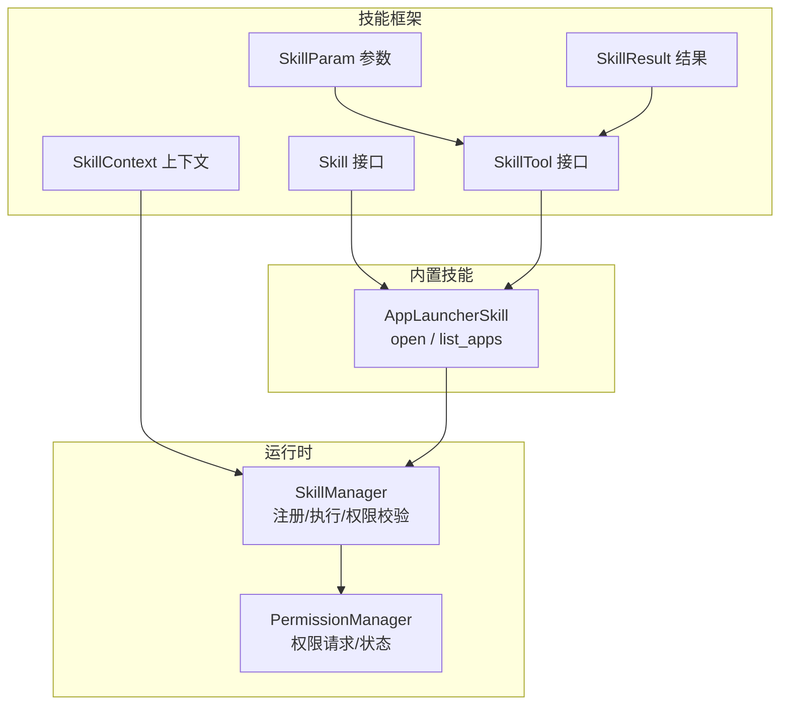
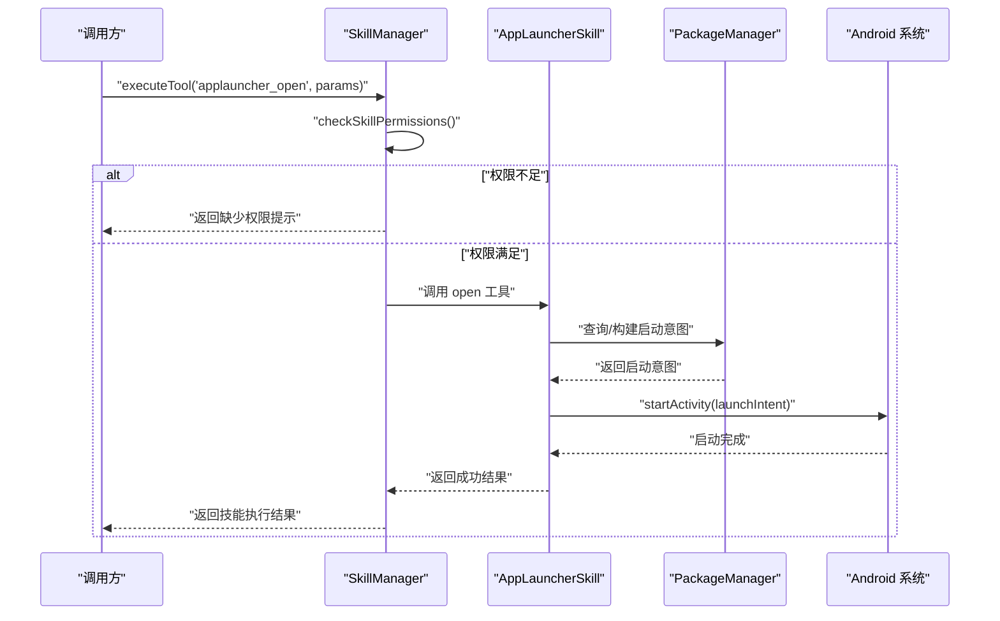
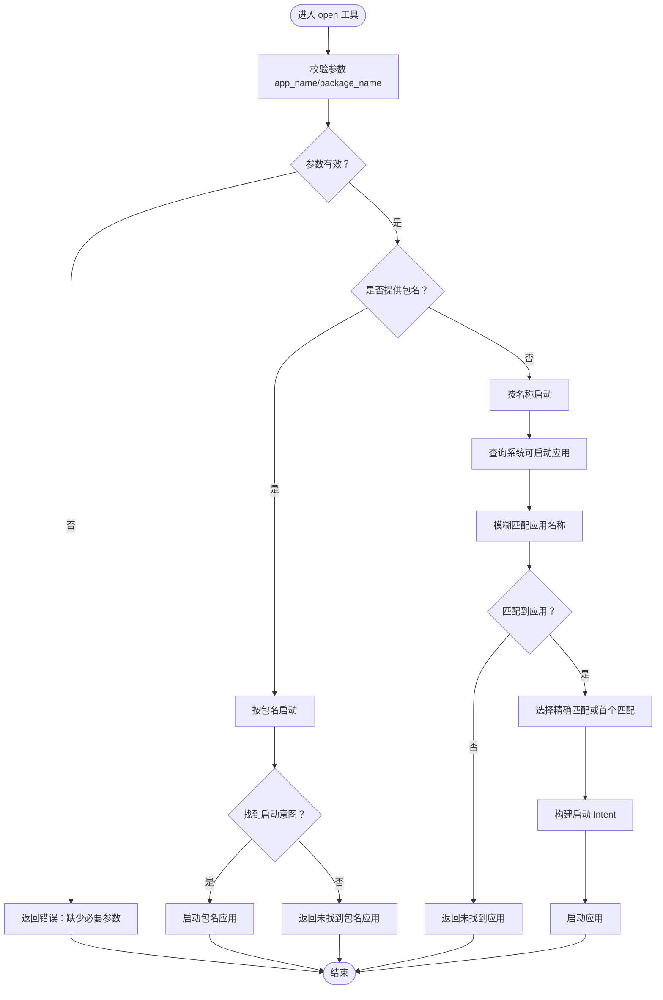
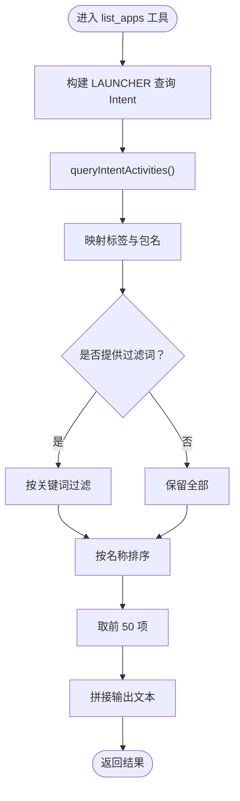
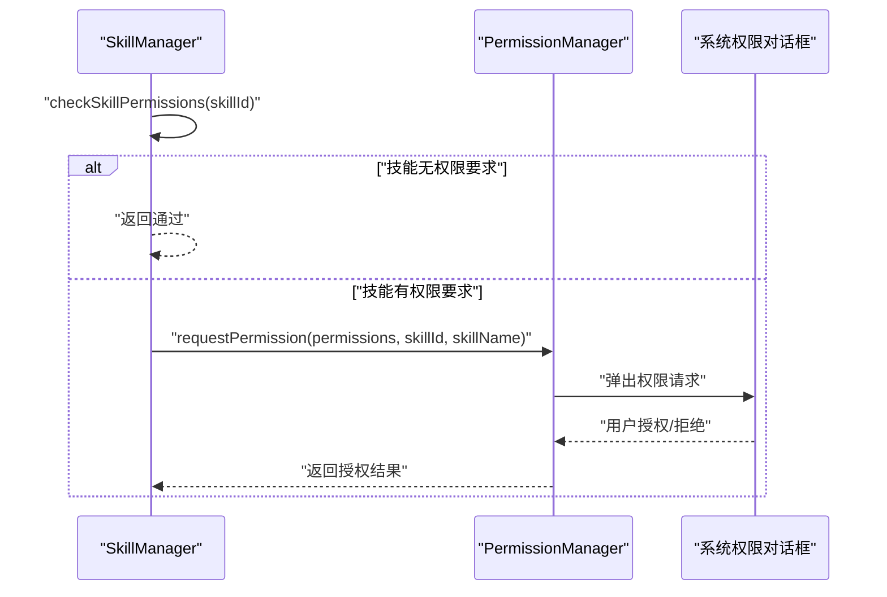
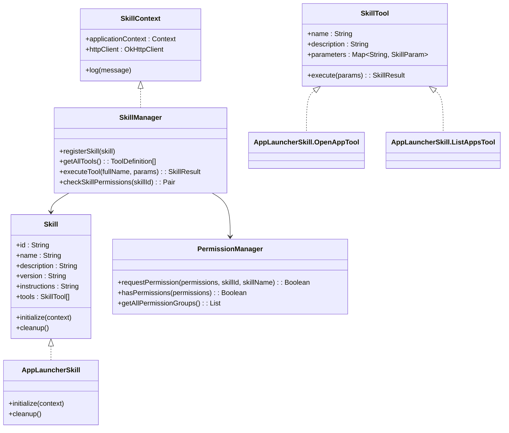

# 应用启动器技能

<cite>
**本文引用的文件**
- [AppLauncherSkill.kt](file://app/src/main/java/ai/openclaw/android/skill/builtin/AppLauncherSkill.kt)
- [Skill.kt](file://app/src/main/java/ai/openclaw/android/skill/Skill.kt)
- [SkillTool.kt](file://app/src/main/java/ai/openclaw/android/skill/SkillTool.kt)
- [SkillContext.kt](file://app/src/main/java/ai/openclaw/android/skill/SkillContext.kt)
- [SkillManager.kt](file://app/src/main/java/ai/openclaw/android/skill/SkillManager.kt)
- [PermissionManager.kt](file://app/src/main/java/ai/openclaw/android/permission/PermissionManager.kt)
- [MainActivity.kt](file://app/src/main/java/ai/openclaw/android/MainActivity.kt)
- [GatewayService.kt](file://app/src/main/java/ai/openclaw/android/GatewayService.kt)
- [GatewayManager.kt](file://app/src/main/java/ai/openclaw/android/GatewayManager.kt)
- [GatewayContract.kt](file://app/src/main/java/ai/openclaw/android/GatewayContract.kt)
- [AndroidManifest.xml](file://app/src/main/AndroidManifest.xml)
</cite>

## 目录
1. [简介](#简介)
2. [项目结构](#项目结构)
3. [核心组件](#核心组件)
4. [架构总览](#架构总览)
5. [详细组件分析](#详细组件分析)
6. [依赖关系分析](#依赖关系分析)
7. [性能考量](#性能考量)
8. [故障排查指南](#故障排查指南)
9. [结论](#结论)
10. [附录：使用示例与权限配置](#附录使用示例与权限配置)

## 简介
本文件为“应用启动器技能”的技术文档，聚焦于应用发现与启动、应用包管理、启动意图构建、权限检查机制、应用列表获取与展示、启动状态监控与错误处理等关键能力。文档同时提供使用示例与权限配置指导，帮助开发者在不直接阅读源码的情况下理解并正确集成该技能。

## 项目结构
应用启动器技能位于技能系统中，采用“技能接口 + 内置技能实现 + 技能管理器 + 权限管理”的分层设计：
- 技能接口与工具定义：Skill、SkillTool、SkillParam、SkillResult、SkillContext
- 内置技能实现：AppLauncherSkill（包含 open 与 list_apps 两个工具）
- 技能管理器：SkillManager（注册、执行、权限校验、工具聚合）
- 权限管理：PermissionManager（权限请求、状态查询、特殊权限处理）

图表来源
- [Skill.kt:1-13](file://app/src/main/java/ai/openclaw/android/skill/Skill.kt#L1-L13)
- [SkillTool.kt:1-22](file://app/src/main/java/ai/openclaw/android/skill/SkillTool.kt#L1-L22)
- [SkillContext.kt:1-10](file://app/src/main/java/ai/openclaw/android/skill/SkillContext.kt#L1-L10)
- [AppLauncherSkill.kt:1-193](file://app/src/main/java/ai/openclaw/android/skill/builtin/AppLauncherSkill.kt#L1-L193)
- [SkillManager.kt:1-193](file://app/src/main/java/ai/openclaw/android/skill/SkillManager.kt#L1-L193)
- [PermissionManager.kt:1-189](file://app/src/main/java/ai/openclaw/android/permission/PermissionManager.kt#L1-L189)

章节来源
- [Skill.kt:1-13](file://app/src/main/java/ai/openclaw/android/skill/Skill.kt#L1-L13)
- [SkillTool.kt:1-22](file://app/src/main/java/ai/openclaw/android/skill/SkillTool.kt#L1-L22)
- [SkillContext.kt:1-10](file://app/src/main/java/ai/openclaw/android/skill/SkillContext.kt#L1-L10)
- [SkillManager.kt:1-193](file://app/src/main/java/ai/openclaw/android/skill/SkillManager.kt#L1-L193)
- [PermissionManager.kt:1-189](file://app/src/main/java/ai/openclaw/android/permission/PermissionManager.kt#L1-L189)

## 核心组件
- 技能接口与工具定义
  - Skill：定义技能标识、名称、描述、版本、指令说明、工具集合及生命周期方法
  - SkillTool：定义工具名称、描述、参数规范与异步执行接口
  - SkillParam/SkillResult：参数类型与结果封装
  - SkillContext：提供应用上下文、HTTP 客户端与日志能力
- AppLauncherSkill
  - open 工具：支持按应用名称或包名启动应用；内部通过 PackageManager 构建启动意图并启动
  - list_apps 工具：枚举可启动应用并按关键词过滤、排序与截断输出
- SkillManager
  - 负责内置技能注册、工具聚合、执行调度与权限校验
  - 提供工具执行入口 executeTool，并在执行前进行权限检查
- PermissionManager
  - 统一的权限请求与状态查询接口，支持特殊权限（如存储全文件访问）检测

章节来源
- [AppLauncherSkill.kt:1-193](file://app/src/main/java/ai/openclaw/android/skill/builtin/AppLauncherSkill.kt#L1-L193)
- [Skill.kt:1-13](file://app/src/main/java/ai/openclaw/android/skill/Skill.kt#L1-L13)
- [SkillTool.kt:1-22](file://app/src/main/java/ai/openclaw/android/skill/SkillTool.kt#L1-L22)
- [SkillContext.kt:1-10](file://app/src/main/java/ai/openclaw/android/skill/SkillContext.kt#L1-L10)
- [SkillManager.kt:1-193](file://app/src/main/java/ai/openclaw/android/skill/SkillManager.kt#L1-L193)
- [PermissionManager.kt:1-189](file://app/src/main/java/ai/openclaw/android/permission/PermissionManager.kt#L1-L189)

## 架构总览
应用启动器技能在系统中的调用链路如下：

图表来源
- [SkillManager.kt:62-83](file://app/src/main/java/ai/openclaw/android/skill/SkillManager.kt#L62-L83)
- [AppLauncherSkill.kt:45-66](file://app/src/main/java/ai/openclaw/android/skill/builtin/AppLauncherSkill.kt#L45-L66)
- [AppLauncherSkill.kt:68-80](file://app/src/main/java/ai/openclaw/android/skill/builtin/AppLauncherSkill.kt#L68-L80)

章节来源
- [SkillManager.kt:62-83](file://app/src/main/java/ai/openclaw/android/skill/SkillManager.kt#L62-L83)
- [AppLauncherSkill.kt:45-66](file://app/src/main/java/ai/openclaw/android/skill/builtin/AppLauncherSkill.kt#L45-L66)
- [AppLauncherSkill.kt:68-80](file://app/src/main/java/ai/openclaw/android/skill/builtin/AppLauncherSkill.kt#L68-L80)

## 详细组件分析

### AppLauncherSkill：应用发现与启动
- 工具一：open
  - 支持两种输入：应用名称（app_name）或包名（package_name）
  - 包名优先：若提供包名则直接查询并启动
  - 名称匹配：若仅提供应用名称，则通过查询系统可启动 Activity 并按标签模糊匹配，优先精确匹配
  - 启动意图：使用 PackageManager 的 getLaunchIntentForPackage 或手动构造 Intent，设置 FLAG_ACTIVITY_NEW_TASK 后启动
- 工具二：list_apps
  - 枚举所有带 LAUNCHER 分类的 Activity，读取应用标签与包名
  - 可选过滤关键词，大小写不敏感
  - 输出限制：最多返回前 50 项，超出部分给出总数提示
- 错误处理
  - 缺少必要参数、查询异常、未找到应用等均以 SkillResult 返回错误信息

图表来源
- [AppLauncherSkill.kt:45-66](file://app/src/main/java/ai/openclaw/android/skill/builtin/AppLauncherSkill.kt#L45-L66)
- [AppLauncherSkill.kt:68-80](file://app/src/main/java/ai/openclaw/android/skill/builtin/AppLauncherSkill.kt#L68-L80)
- [AppLauncherSkill.kt:82-125](file://app/src/main/java/ai/openclaw/android/skill/builtin/AppLauncherSkill.kt#L82-L125)

章节来源
- [AppLauncherSkill.kt:29-126](file://app/src/main/java/ai/openclaw/android/skill/builtin/AppLauncherSkill.kt#L29-L126)
- [AppLauncherSkill.kt:128-182](file://app/src/main/java/ai/openclaw/android/skill/builtin/AppLauncherSkill.kt#L128-L182)

### 列表获取与展示：list_apps
- 查询策略
  - 使用 ACTION_MAIN + CATEGORY_LAUNCHER 过滤系统可启动应用
  - 兼容不同 Android 版本的 queryIntentActivities API
- 展示逻辑
  - 过滤关键词（可选），大小写不敏感
  - 按应用名称排序，取前 50 项
  - 输出格式为“应用名（包名）”列表，并附带总数说明

图表来源
- [AppLauncherSkill.kt:139-182](file://app/src/main/java/ai/openclaw/android/skill/builtin/AppLauncherSkill.kt#L139-L182)

章节来源
- [AppLauncherSkill.kt:128-182](file://app/src/main/java/ai/openclaw/android/skill/builtin/AppLauncherSkill.kt#L128-L182)

### 权限检查机制
- 技能级权限
  - SkillManager 在执行工具前调用 checkSkillPermissions，判断技能所需权限是否满足
  - 对于 AppLauncherSkill，当前实现未声明额外权限需求，因此默认放行
- 运行时权限
  - 若技能需要权限，SkillManager 将返回缺失权限列表，由上层流程触发 PermissionManager 请求
  - PermissionManager 支持普通权限与特殊权限（如 MANAGE_EXTERNAL_STORAGE）的检测与请求

图表来源
- [SkillManager.kt:89-107](file://app/src/main/java/ai/openclaw/android/skill/SkillManager.kt#L89-L107)
- [PermissionManager.kt:41-59](file://app/src/main/java/ai/openclaw/android/permission/PermissionManager.kt#L41-L59)

章节来源
- [SkillManager.kt:89-107](file://app/src/main/java/ai/openclaw/android/skill/SkillManager.kt#L89-L107)
- [PermissionManager.kt:41-59](file://app/src/main/java/ai/openclaw/android/permission/PermissionManager.kt#L41-L59)

### 启动意图构建与包管理
- 包管理器使用
  - 通过 PackageManager 查询可启动应用与启动意图
  - 兼容 Android T 及以上版本的 ResolveInfoFlags
- 启动意图
  - 使用 FLAG_ACTIVITY_NEW_TASK 标记确保从非 Activity 上下文启动
  - 通过 ComponentName 指定目标 Activity，保证精确启动

章节来源
- [AppLauncherSkill.kt:68-80](file://app/src/main/java/ai/openclaw/android/skill/builtin/AppLauncherSkill.kt#L68-L80)
- [AppLauncherSkill.kt:82-125](file://app/src/main/java/ai/openclaw/android/skill/builtin/AppLauncherSkill.kt#L82-L125)

### 启动状态监控与错误处理
- 成功路径
  - open：返回“已打开应用 + 应用名/包名”
  - list_apps：返回“应用总数 + 列表（最多 50 项）”
- 失败路径
  - 缺少参数、未找到应用、查询异常等均以 SkillResult.error 字段返回错误信息
- 异常捕获
  - open/list_apps 均包裹 try/catch，统一返回错误字符串

章节来源
- [AppLauncherSkill.kt:45-66](file://app/src/main/java/ai/openclaw/android/skill/builtin/AppLauncherSkill.kt#L45-L66)
- [AppLauncherSkill.kt:139-182](file://app/src/main/java/ai/openclaw/android/skill/builtin/AppLauncherSkill.kt#L139-L182)

## 依赖关系分析
- 组件耦合
  - AppLauncherSkill 依赖 Skill 接口与 SkillTool 规范，便于统一管理
  - SkillManager 聚合技能与工具，负责执行与权限校验
  - PermissionManager 独立于具体技能，提供通用权限能力
- 外部依赖
  - Android PackageManager 用于应用查询与启动意图构建
  - AndroidX Core 提供权限检查工具

图表来源
- [Skill.kt:1-13](file://app/src/main/java/ai/openclaw/android/skill/Skill.kt#L1-L13)
- [SkillTool.kt:1-22](file://app/src/main/java/ai/openclaw/android/skill/SkillTool.kt#L1-L22)
- [SkillContext.kt:1-10](file://app/src/main/java/ai/openclaw/android/skill/SkillContext.kt#L1-L10)
- [AppLauncherSkill.kt:1-193](file://app/src/main/java/ai/openclaw/android/skill/builtin/AppLauncherSkill.kt#L1-L193)
- [SkillManager.kt:1-193](file://app/src/main/java/ai/openclaw/android/skill/SkillManager.kt#L1-L193)
- [PermissionManager.kt:1-189](file://app/src/main/java/ai/openclaw/android/permission/PermissionManager.kt#L1-L189)

章节来源
- [Skill.kt:1-13](file://app/src/main/java/ai/openclaw/android/skill/Skill.kt#L1-L13)
- [SkillTool.kt:1-22](file://app/src/main/java/ai/openclaw/android/skill/SkillTool.kt#L1-L22)
- [SkillContext.kt:1-10](file://app/src/main/java/ai/openclaw/android/skill/SkillContext.kt#L1-L10)
- [SkillManager.kt:1-193](file://app/src/main/java/ai/openclaw/android/skill/SkillManager.kt#L1-L193)
- [PermissionManager.kt:1-189](file://app/src/main/java/ai/openclaw/android/permission/PermissionManager.kt#L1-L189)

## 性能考量
- 查询开销
  - list_apps 需要遍历系统可启动应用，建议配合关键词过滤减少结果集
  - 过滤与排序在内存中完成，数据量较大时注意 UI 线程阻塞风险
- 输出截断
  - 最多返回前 50 项，避免超长文本导致渲染压力
- 启动意图构建
  - open 工具优先包名路径，避免不必要的查询与匹配

章节来源
- [AppLauncherSkill.kt:168-176](file://app/src/main/java/ai/openclaw/android/skill/builtin/AppLauncherSkill.kt#L168-L176)
- [AppLauncherSkill.kt:99-112](file://app/src/main/java/ai/openclaw/android/skill/builtin/AppLauncherSkill.kt#L99-L112)

## 故障排查指南
- 打不开应用
  - 检查包名是否正确；可通过 list_apps 获取准确包名
  - 确认目标应用存在启动入口（CATEGORY_LAUNCHER）
- 未找到应用
  - app_name 与系统标签不一致时需使用包名
  - 注意大小写与空格差异
- 权限问题
  - 当前 AppLauncherSkill 不需要特殊权限；若其他技能出现权限不足，请通过 PermissionManager 触发授权流程
- 列表为空
  - 某些设备或定制系统可能隐藏部分应用；尝试移除过滤词或更换关键词

章节来源
- [AppLauncherSkill.kt:50-52](file://app/src/main/java/ai/openclaw/android/skill/builtin/AppLauncherSkill.kt#L50-L52)
- [AppLauncherSkill.kt:105-107](file://app/src/main/java/ai/openclaw/android/skill/builtin/AppLauncherSkill.kt#L105-L107)
- [SkillManager.kt:89-107](file://app/src/main/java/ai/openclaw/android/skill/SkillManager.kt#L89-L107)

## 结论
应用启动器技能通过标准化的技能接口与工具规范，实现了“按名称/包名启动应用”和“列出已安装应用”的核心能力。其设计遵循“低耦合、高内聚”的原则，结合 SkillManager 的权限校验与 PermissionManager 的统一权限处理，为后续扩展更多内置技能提供了清晰的范式。

## 附录：使用示例与权限配置

### 使用示例
- 打开应用
  - 输入：app_name 或 package_name 至少提供其一
  - 输出：成功时返回“已打开应用 + 应用名/包名”，失败时返回错误信息
- 列出应用
  - 输入：可选 filter 关键词
  - 输出：应用总数 + 列表（最多 50 项），超出部分提示总数

章节来源
- [AppLauncherSkill.kt:29-43](file://app/src/main/java/ai/openclaw/android/skill/builtin/AppLauncherSkill.kt#L29-L43)
- [AppLauncherSkill.kt:128-137](file://app/src/main/java/ai/openclaw/android/skill/builtin/AppLauncherSkill.kt#L128-L137)
- [AppLauncherSkill.kt:168-176](file://app/src/main/java/ai/openclaw/android/skill/builtin/AppLauncherSkill.kt#L168-L176)

### 权限配置指导
- AppLauncherSkill
  - 当前无需特殊权限，可直接使用
- 其他技能（如联系人、短信、日历等）
  - 由 SkillManager 统一校验所需权限，返回缺失权限列表
  - 通过 PermissionManager 触发系统权限对话框，UI 层监听 currentRequest 并在用户授权后回调 resolveRequest
- 特殊权限
  - 如 MANAGE_EXTERNAL_STORAGE（全文件访问），需引导至系统设置页面

章节来源
- [SkillManager.kt:89-107](file://app/src/main/java/ai/openclaw/android/skill/SkillManager.kt#L89-L107)
- [PermissionManager.kt:41-59](file://app/src/main/java/ai/openclaw/android/permission/PermissionManager.kt#L41-L59)
- [PermissionManager.kt:95-109](file://app/src/main/java/ai/openclaw/android/permission/PermissionManager.kt#L95-L109)