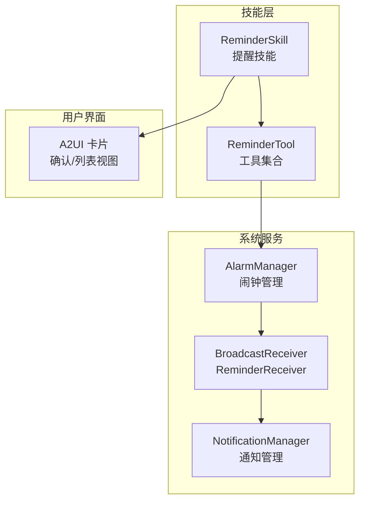
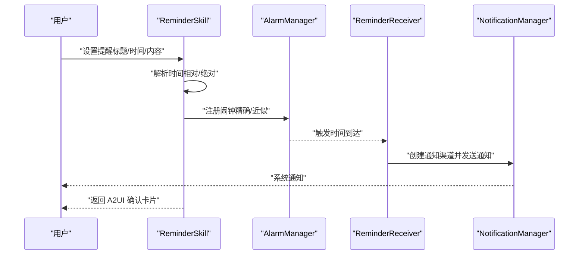
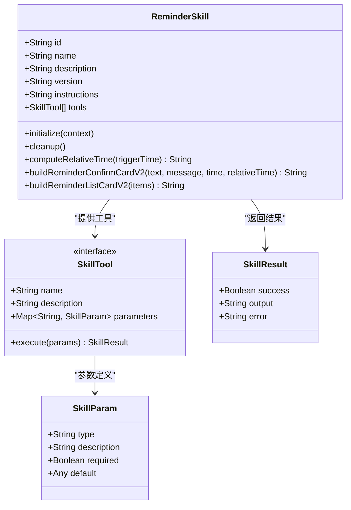
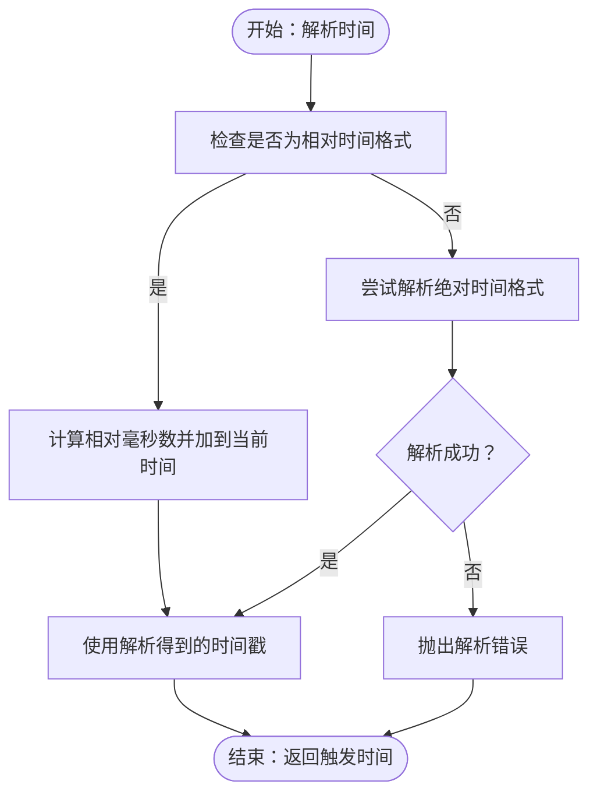
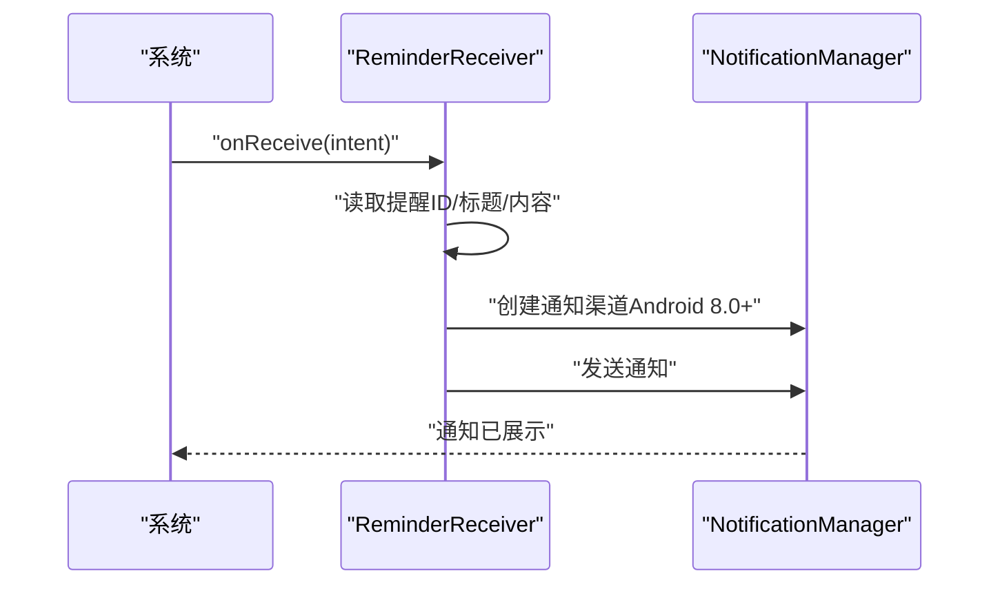
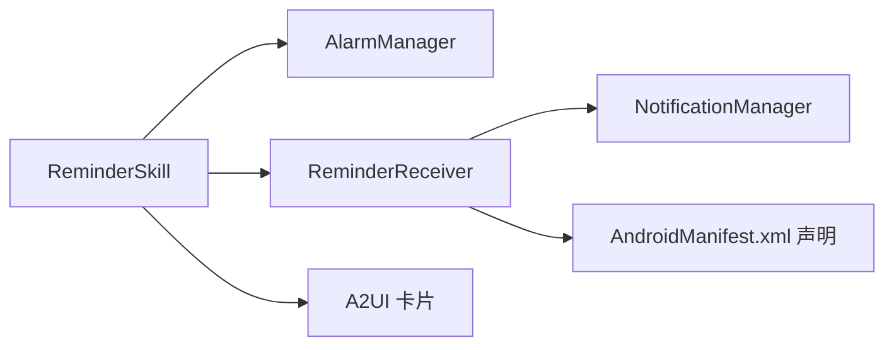

# 提醒技能

<cite>
**本文引用的文件**
- [ReminderSkill.kt](file://app/src/main/java/ai/openclaw/android/skill/builtin/ReminderSkill.kt)
- [ReminderReceiver.kt](file://app/src/main/java/ai/openclaw/android/skill/builtin/ReminderReceiver.kt)
- [Skill.kt](file://app/src/main/java/ai/openclaw/android/skill/Skill.kt)
- [SkillTool.kt](file://app/src/main/java/ai/openclaw/android/skill/SkillTool.kt)
- [AndroidManifest.xml](file://app/src/main/AndroidManifest.xml)
</cite>

## 目录
1. [简介](#简介)
2. [项目结构](#项目结构)
3. [核心组件](#核心组件)
4. [架构总览](#架构总览)
5. [详细组件分析](#详细组件分析)
6. [依赖关系分析](#依赖关系分析)
7. [性能考虑](#性能考虑)
8. [故障排除指南](#故障排除指南)
9. [结论](#结论)
10. [附录](#附录)

## 简介
本文件为 OpenClaw Android 项目中“提醒技能”的技术文档，聚焦于时间管理功能的实现细节，包括提醒创建、调度与通知机制；工具参数定义、时间解析与相对/绝对时间处理；系统闹钟集成与提醒状态管理；提醒生命周期与用户交互流程；以及使用示例与配置指导。该技能以内置技能形式提供，支持通过语音或对话界面进行提醒设置、查询与取消。

## 项目结构
提醒技能位于应用模块的内置技能包内，核心代码由以下两个文件组成：
- ReminderSkill.kt：实现提醒技能接口、定义工具参数、执行提醒创建/查询/取消逻辑，并负责构建 A2UI 卡片用于用户交互。
- ReminderReceiver.kt：广播接收器，在触发时间到达时展示系统通知。

图表来源
- [ReminderSkill.kt:13-200](file://app/src/main/java/ai/openclaw/android/skill/builtin/ReminderSkill.kt#L13-L200)
- [ReminderReceiver.kt:11-43](file://app/src/main/java/ai/openclaw/android/skill/builtin/ReminderReceiver.kt#L11-L43)

章节来源
- [ReminderSkill.kt:13-200](file://app/src/main/java/ai/openclaw/android/skill/builtin/ReminderSkill.kt#L13-L200)
- [ReminderReceiver.kt:11-43](file://app/src/main/java/ai/openclaw/android/skill/builtin/ReminderReceiver.kt#L11-L43)

## 核心组件
- 技能接口与工具接口
  - Skill：定义技能标识、名称、描述、版本、指令说明与工具集合等。
  - SkillTool：定义工具名称、描述、参数规范与异步执行方法。
  - SkillParam/SkillResult：参数类型定义与执行结果封装。
- 提醒技能（ReminderSkill）
  - 实现 Skill 接口，提供三个工具：
    - set_reminder：设置提醒（支持相对时间与绝对时间）。
    - list_reminders：列出所有待处理提醒。
    - cancel_reminder：按 ID 取消提醒。
  - 内部维护内存映射存储当前活动提醒，用于列表与取消操作。
  - 提供 A2UI 卡片构建方法，用于向用户反馈设置结果与列表展示。
- 广播接收器（ReminderReceiver）
  - 在触发时间到达时，创建通知渠道并在系统通知栏显示提醒通知。

章节来源
- [Skill.kt:3-13](file://app/src/main/java/ai/openclaw/android/skill/Skill.kt#L3-L13)
- [SkillTool.kt:3-22](file://app/src/main/java/ai/openclaw/android/skill/SkillTool.kt#L3-L22)
- [ReminderSkill.kt:13-200](file://app/src/main/java/ai/openclaw/android/skill/builtin/ReminderSkill.kt#L13-L200)
- [ReminderReceiver.kt:11-43](file://app/src/main/java/ai/openclaw/android/skill/builtin/ReminderReceiver.kt#L11-L43)

## 架构总览
提醒技能采用“技能工具 + 系统闹钟 + 广播接收器 + 系统通知”的分层架构：
- 技能层：定义工具与参数，负责业务逻辑与用户交互卡片生成。
- 调度层：通过 AlarmManager 将提醒事件注册到系统闹钟，支持精确与近似两种模式。
- 触发层：广播接收器在触发时刻被系统回调，负责通知展示。
- 展示层：A2UI 卡片用于设置确认与列表展示，提升用户体验。

图表来源
- [ReminderSkill.kt:51-134](file://app/src/main/java/ai/openclaw/android/skill/builtin/ReminderSkill.kt#L51-L134)
- [ReminderReceiver.kt:12-42](file://app/src/main/java/ai/openclaw/android/skill/builtin/ReminderReceiver.kt#L12-L42)

## 详细组件分析

### 组件一：提醒技能（ReminderSkill）
- 角色与职责
  - 实现 Skill 接口，提供三个工具：set_reminder、list_reminders、cancel_reminder。
  - 维护内存中的提醒映射，用于列表与取消操作。
  - 构建 A2UI 卡片，向用户反馈设置结果与列表项。
- 工具参数与执行流程
  - set_reminder
    - 参数：title（必填）、time（必填，支持相对时间 in X minutes/hours 或绝对时间 yyyy-MM-dd HH:mm）、message（可选）。
    - 执行：解析时间字符串 → 生成唯一 ID → 注册系统闹钟 → 构建确认卡片 → 返回成功结果。
  - list_reminders
    - 参数：无。
    - 执行：过滤未来待处理提醒 → 按触发时间排序 → 构建列表卡片 → 返回结果。
  - cancel_reminder
    - 参数：id（必填）。
    - 执行：从内存移除 → 取消对应闹钟 → 返回成功结果。
- 时间解析与相对时间处理
  - 支持相对时间格式：in X minute(s)/hour(s)，按分钟或小时换算为毫秒后加到当前时间。
  - 支持绝对时间格式：yyyy-MM-dd HH:mm，使用本地日期格式解析。
  - 解析失败时抛出异常，错误信息包含支持格式提示。
- 闹钟调度策略
  - Android 13+：优先使用精确闹钟；若无权限则回退到允许在节电模式下唤醒的近似闹钟。
  - Android 13 以下：直接使用精确闹钟。
  - 使用 PendingIntent 的请求码为提醒 ID 的哈希值，确保唯一性。
- 相对时间计算与卡片构建
  - computeRelativeTime：根据触发时间与当前时间计算相对描述（秒/分钟/小时/天后）。
  - buildReminderConfirmCardV2/buildReminderListCardV2：生成 A2UI 卡片 JSON，包含标题、文本、时间、相对时间、消息与操作按钮。

图表来源
- [ReminderSkill.kt:13-200](file://app/src/main/java/ai/openclaw/android/skill/builtin/ReminderSkill.kt#L13-L200)
- [SkillTool.kt:3-22](file://app/src/main/java/ai/openclaw/android/skill/SkillTool.kt#L3-L22)

图表来源
- [ReminderSkill.kt:78-95](file://app/src/main/java/ai/openclaw/android/skill/builtin/ReminderSkill.kt#L78-L95)

章节来源
- [ReminderSkill.kt:13-200](file://app/src/main/java/ai/openclaw/android/skill/builtin/ReminderSkill.kt#L13-L200)
- [SkillTool.kt:3-22](file://app/src/main/java/ai/openclaw/android/skill/SkillTool.kt#L3-L22)

### 组件二：广播接收器（ReminderReceiver）
- 角色与职责
  - 在系统闹钟触发时被回调，读取提醒 ID、标题与内容，创建通知渠道并发送系统通知。
- 通知渠道与展示
  - Android 8.0+ 创建高优先级通知渠道“reminders”。
  - 使用通知兼容构建器设置小图标、标题、内容文本、自动取消等属性。
  - 通知 ID 使用提醒 ID 的哈希值，避免冲突。
- 生命周期
  - 仅在 onReceive 中执行通知发送，无持久状态，无需清理。

图表来源
- [ReminderReceiver.kt:12-42](file://app/src/main/java/ai/openclaw/android/skill/builtin/ReminderReceiver.kt#L12-L42)

章节来源
- [ReminderReceiver.kt:11-43](file://app/src/main/java/ai/openclaw/android/skill/builtin/ReminderReceiver.kt#L11-L43)

### 组件三：技能接口与工具接口
- Skill 接口
  - 定义技能的基本元数据与工具集合，以及初始化与清理方法。
- SkillTool 接口
  - 定义工具的名称、描述、参数规范与异步执行方法。
- SkillParam/SkillResult
  - 参数类型定义与执行结果封装，便于统一处理工具调用的输入输出。

章节来源
- [Skill.kt:3-13](file://app/src/main/java/ai/openclaw/android/skill/Skill.kt#L3-L13)
- [SkillTool.kt:3-22](file://app/src/main/java/ai/openclaw/android/skill/SkillTool.kt#L3-L22)

## 依赖关系分析
- 内部依赖
  - ReminderSkill 依赖 AlarmManager 进行闹钟调度，依赖 NotificationManager 进行通知展示（通过 ReminderReceiver 间接使用）。
  - ReminderSkill 内部维护内存映射存储提醒信息，用于列表与取消操作。
- 外部依赖
  - Android 系统服务：AlarmManager、NotificationManager、BroadcastReceiver。
  - A2UI 卡片系统：用于构建用户可见的交互卡片。
- 权限与配置
  - 需要在应用清单中声明广播接收器，以便系统在触发时刻回调。
  - Android 13+ 需要精确闹钟权限，若未授予则回退到近似闹钟但仍可在节电模式下工作。

图表来源
- [ReminderSkill.kt:97-134](file://app/src/main/java/ai/openclaw/android/skill/builtin/ReminderSkill.kt#L97-L134)
- [ReminderReceiver.kt:12-42](file://app/src/main/java/ai/openclaw/android/skill/builtin/ReminderReceiver.kt#L12-L42)
- [AndroidManifest.xml](file://app/src/main/AndroidManifest.xml)

章节来源
- [ReminderSkill.kt:97-134](file://app/src/main/java/ai/openclaw/android/skill/builtin/ReminderSkill.kt#L97-L134)
- [ReminderReceiver.kt:12-42](file://app/src/main/java/ai/openclaw/android/skill/builtin/ReminderReceiver.kt#L12-L42)

## 性能考虑
- 闹钟调度
  - 精确闹钟优先，降低抖动；在 Android 13+ 无权限时回退到近似闹钟，仍保证在节电模式下可用。
  - 使用 PendingIntent 的请求码基于提醒 ID 的哈希，避免重复注册导致的资源浪费。
- 内存状态管理
  - 仅在内存中保存活动提醒，避免持久化开销；适合短期提醒场景。
- 通知性能
  - 通知通道一次性创建，减少重复创建成本；通知自动取消，避免堆积。

## 故障排除指南
- 设置提醒失败
  - 检查时间字符串格式是否正确（相对时间：in X minutes/hours；绝对时间：yyyy-MM-dd HH:mm）。
  - 确认应用具有必要的系统权限（特别是 Android 13+ 的精确闹钟权限）。
- 闹钟未触发
  - 确认设备未处于深度省电模式且未被系统限制后台运行。
  - 检查 PendingIntent 的请求码与提醒 ID 是否一致。
- 通知未显示
  - 确认 Android 8.0+ 上的通知渠道已创建。
  - 检查通知优先级与自动取消设置。
- 列表为空
  - 确认提醒时间在未来；已过期的提醒不会出现在列表中。

章节来源
- [ReminderSkill.kt:78-95](file://app/src/main/java/ai/openclaw/android/skill/builtin/ReminderSkill.kt#L78-L95)
- [ReminderReceiver.kt:24-41](file://app/src/main/java/ai/openclaw/android/skill/builtin/ReminderReceiver.kt#L24-L41)

## 结论
提醒技能通过清晰的工具化接口、灵活的时间解析与系统级闹钟调度，实现了可靠的提醒功能。配合 A2UI 卡片，提供了良好的用户交互体验。其设计兼顾了易用性与性能，适用于日常任务提醒场景。建议在生产环境中关注权限与系统限制，确保在不同设备与系统版本上稳定运行。

## 附录

### 使用示例与配置指导
- 设置提醒
  - 参数：title（提醒标题）、time（相对时间 in X minutes/hours 或绝对时间 yyyy-MM-dd HH:mm）、message（可选提醒内容）。
  - 示例：设置“会议”提醒，时间为“in 10 minutes”，内容为“准备开始”。
- 查看提醒
  - 调用 list_reminders，查看所有待处理提醒及其相对时间。
- 取消提醒
  - 调用 cancel_reminder，传入提醒 ID 完成取消。
- 清单配置
  - 在 AndroidManifest.xml 中声明 ReminderReceiver，确保系统能在触发时刻回调。

章节来源
- [ReminderSkill.kt:40-200](file://app/src/main/java/ai/openclaw/android/skill/builtin/ReminderSkill.kt#L40-L200)
- [AndroidManifest.xml](file://app/src/main/AndroidManifest.xml)