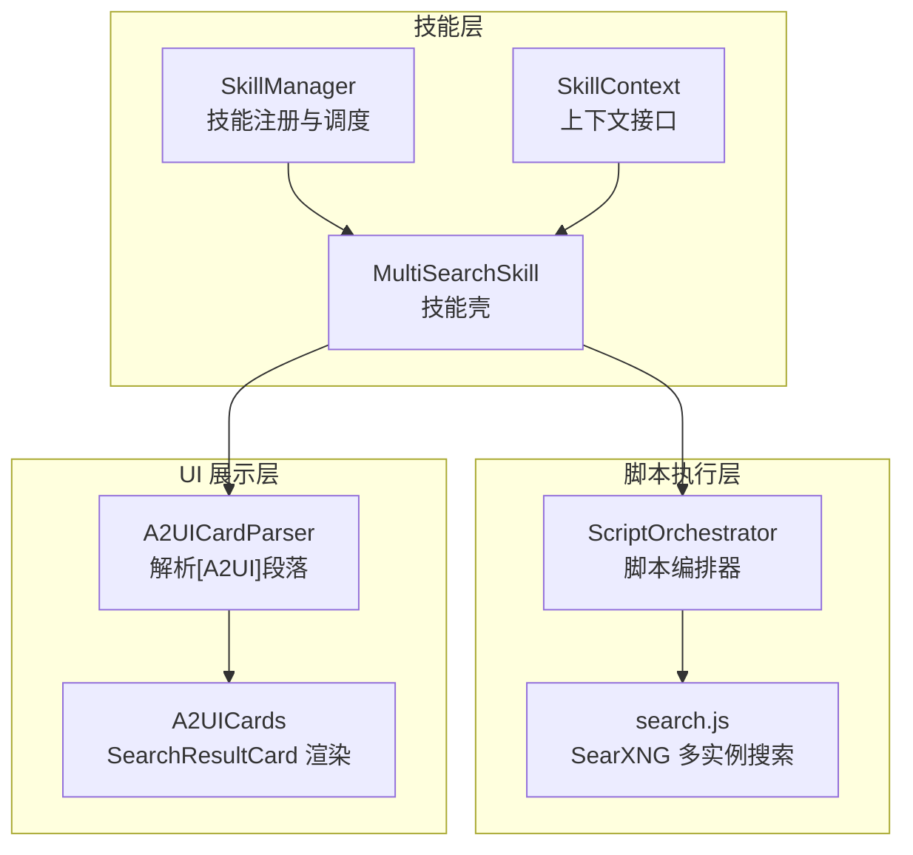
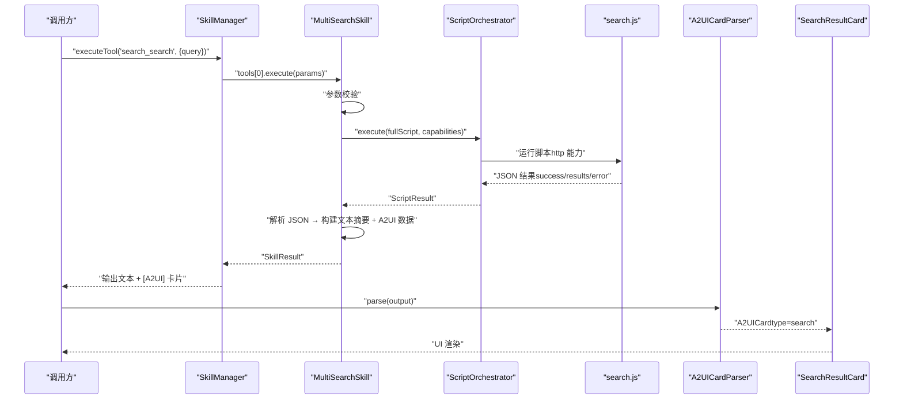
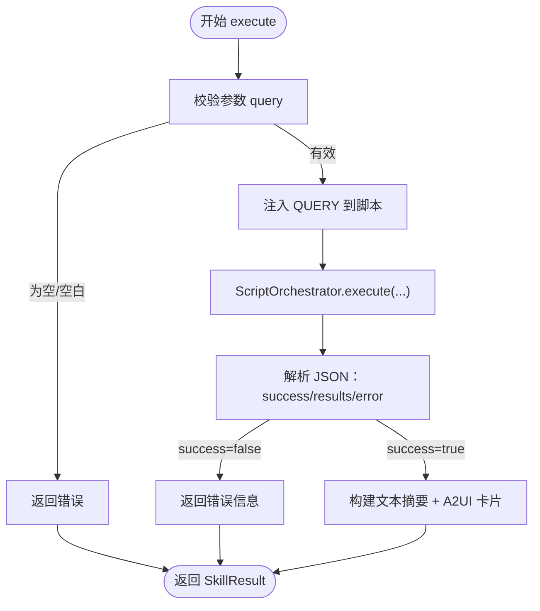
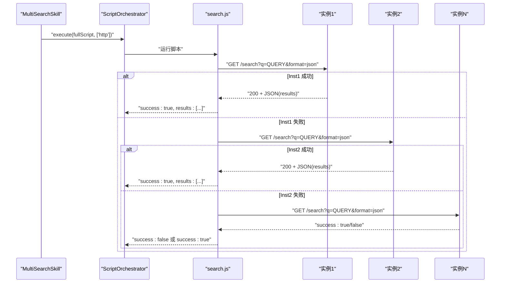
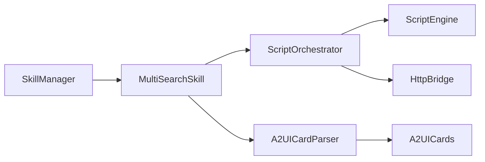

# 搜索技能

<cite>
**本文引用的文件**
- [MultiSearchSkill.kt](file://app/src/main/java/ai/openclaw/android/skill/builtin/MultiSearchSkill.kt)
- [SkillTool.kt](file://app/src/main/java/ai/openclaw/android/skill/SkillTool.kt)
- [SkillManager.kt](file://app/src/main/java/ai/openclaw/android/skill/SkillManager.kt)
- [SkillContext.kt](file://app/src/main/java/ai/openclaw/android/skill/SkillContext.kt)
- [search.js](file://app/src/main/assets/scripts/search.js)
- [ScriptOrchestrator.kt](file://script/src/main/java/ai/openclaw/script/ScriptOrchestrator.kt)
- [A2UICards.kt](file://app/src/main/java/ai/openclaw/android/ui/A2UICards.kt)
- [A2UICardModels.kt](file://app/src/main/java/ai/openclaw/android/ui/A2UICardModels.kt)
- [MultiSearchSkillTest.kt](file://app/src/test/java/ai/openclaw/android/skill/builtin/MultiSearchSkillTest.kt)
- [DeduplicationEngine.kt](file://app/src/main/java/ai/openclaw/android/personalcenter/DeduplicationEngine.kt)
- [HybridSearchEngine.kt](file://app/src/main/java/ai/openclaw/android/domain/memory/HybridSearchEngine.kt)
</cite>

## 目录
1. [简介](#简介)
2. [项目结构](#项目结构)
3. [核心组件](#核心组件)
4. [架构总览](#架构总览)
5. [详细组件分析](#详细组件分析)
6. [依赖关系分析](#依赖关系分析)
7. [性能考量](#性能考量)
8. [故障排查指南](#故障排查指南)
9. [结论](#结论)
10. [附录](#附录)

## 简介
本文件面向“搜索技能”的全面技术文档，聚焦于多搜索引擎集成（SearXNG）、搜索结果聚合与去重、工具参数定义、搜索策略与结果排序、性能优化与缓存策略、以及搜索结果在 A2UI 卡片系统中的数据结构与渲染流程。文档同时提供使用示例与最佳实践，帮助开发者快速理解与扩展搜索能力。

## 项目结构
搜索技能位于应用模块的技能体系中，采用“Kotlin 技能壳 + QuickJS 脚本桥接”的设计：技能壳负责参数校验、结果封装与 A2UI 卡片生成；脚本桥接负责网络请求与多实例容错；UI 层通过 A2UI 卡片系统进行渲染。



图示来源
- [MultiSearchSkill.kt:14-130](file://app/src/main/java/ai/openclaw/android/skill/builtin/MultiSearchSkill.kt#L14-L130)
- [SkillManager.kt:8-38](file://app/src/main/java/ai/openclaw/android/skill/SkillManager.kt#L8-L38)
- [SkillContext.kt:6-10](file://app/src/main/java/ai/openclaw/android/skill/SkillContext.kt#L6-L10)
- [ScriptOrchestrator.kt:13-39](file://script/src/main/java/ai/openclaw/script/ScriptOrchestrator.kt#L13-L39)
- [search.js:1-39](file://app/src/main/assets/scripts/search.js#L1-L39)
- [A2UICardModels.kt:541-637](file://app/src/main/java/ai/openclaw/android/ui/A2UICardModels.kt#L541-L637)
- [A2UICards.kt:325-440](file://app/src/main/java/ai/openclaw/android/ui/A2UICards.kt#L325-L440)

章节来源
- [MultiSearchSkill.kt:14-130](file://app/src/main/java/ai/openclaw/android/skill/builtin/MultiSearchSkill.kt#L14-L130)
- [SkillManager.kt:8-38](file://app/src/main/java/ai/openclaw/android/skill/SkillManager.kt#L8-L38)
- [ScriptOrchestrator.kt:13-39](file://script/src/main/java/ai/openclaw/script/ScriptOrchestrator.kt#L13-L39)
- [search.js:1-39](file://app/src/main/assets/scripts/search.js#L1-L39)
- [A2UICardModels.kt:541-637](file://app/src/main/java/ai/openclaw/android/ui/A2UICardModels.kt#L541-L637)
- [A2UICards.kt:325-440](file://app/src/main/java/ai/openclaw/android/ui/A2UICards.kt#L325-L440)

## 核心组件
- 多引擎搜索技能（MultiSearchSkill）
  - 定义工具：search（参数：query，必填）
  - 执行流程：参数校验 → 注入查询到脚本 → 调用脚本执行 → 解析 JSON → 构建纯文本摘要与 A2UI 卡片
- 脚本执行器（ScriptOrchestrator）
  - 负责加载脚本、注入能力（http 网络等）、执行并返回结果
- SearXNG 搜索脚本（search.js）
  - 多实例轮询（INSTANCES）→ 请求 /search?q=...&format=json → 成功即返回前 N 条结果
- A2UI 卡片系统
  - 解析 [A2UI] 段落 → 反序列化为 A2UICard → 渲染为 SearchResultCard

章节来源
- [MultiSearchSkill.kt:35-116](file://app/src/main/java/ai/openclaw/android/skill/builtin/MultiSearchSkill.kt#L35-L116)
- [SkillTool.kt:3-22](file://app/src/main/java/ai/openclaw/android/skill/SkillTool.kt#L3-L22)
- [ScriptOrchestrator.kt:31-39](file://script/src/main/java/ai/openclaw/script/ScriptOrchestrator.kt#L31-L39)
- [search.js:10-38](file://app/src/main/assets/scripts/search.js#L10-L38)
- [A2UICardModels.kt:83-140](file://app/src/main/java/ai/openclaw/android/ui/A2UICardModels.kt#L83-L140)
- [A2UICards.kt:325-440](file://app/src/main/java/ai/openclaw/android/ui/A2UICards.kt#L325-L440)

## 架构总览
下图展示了从技能调用到 UI 渲染的完整链路，包括参数校验、脚本执行、结果聚合与卡片渲染。



图示来源
- [SkillManager.kt:62-83](file://app/src/main/java/ai/openclaw/android/skill/SkillManager.kt#L62-L83)
- [MultiSearchSkill.kt:42-85](file://app/src/main/java/ai/openclaw/android/skill/builtin/MultiSearchSkill.kt#L42-L85)
- [ScriptOrchestrator.kt:31-39](file://script/src/main/java/ai/openclaw/script/ScriptOrchestrator.kt#L31-L39)
- [search.js:10-38](file://app/src/main/assets/scripts/search.js#L10-L38)
- [A2UICardModels.kt:541-637](file://app/src/main/java/ai/openclaw/android/ui/A2UICardModels.kt#L541-L637)
- [A2UICards.kt:325-440](file://app/src/main/java/ai/openclaw/android/ui/A2UICards.kt#L325-L440)

## 详细组件分析

### 多引擎搜索技能（MultiSearchSkill）
- 工具定义
  - 名称：search
  - 描述：搜索互联网信息
  - 参数：query（字符串，必填）
- 执行逻辑
  - 参数校验：空或空白返回错误
  - 注入查询：将 query 注入脚本全局变量
  - 脚本执行：通过 ScriptOrchestrator 执行，启用 http 能力
  - 结果解析：成功标志 + results 数组；若为空返回“未找到”
  - 输出构建：纯文本摘要 + A2UI 卡片（flat-key 格式）
- 初始化与清理
  - 读取 assets 中的 search.js 并缓存
  - cleanup 释放资源



图示来源
- [MultiSearchSkill.kt:42-85](file://app/src/main/java/ai/openclaw/android/skill/builtin/MultiSearchSkill.kt#L42-L85)
- [search.js:10-38](file://app/src/main/assets/scripts/search.js#L10-L38)

章节来源
- [MultiSearchSkill.kt:35-116](file://app/src/main/java/ai/openclaw/android/skill/builtin/MultiSearchSkill.kt#L35-L116)
- [SkillTool.kt:11-22](file://app/src/main/java/ai/openclaw/android/skill/SkillTool.kt#L11-L22)

### 脚本执行器（ScriptOrchestrator）与 SearXNG 脚本（search.js）
- ScriptOrchestrator
  - 负责能力解析（默认 http），创建沙箱目录，执行脚本并返回 ScriptResult
- search.js
  - INSTANCES 多实例数组，依次尝试请求 /search?q=...&format=json
  - 成功条件：状态码 200 且存在 results，取前 N 条（脚本内限制）
  - 容错：当前实例失败继续下一个，全部失败返回统一错误



图示来源
- [ScriptOrchestrator.kt:31-39](file://script/src/main/java/ai/openclaw/script/ScriptOrchestrator.kt#L31-L39)
- [search.js:4-38](file://app/src/main/assets/scripts/search.js#L4-L38)

章节来源
- [ScriptOrchestrator.kt:13-54](file://script/src/main/java/ai/openclaw/script/ScriptOrchestrator.kt#L13-L54)
- [search.js:1-39](file://app/src/main/assets/scripts/search.js#L1-L39)

### A2UI 卡片系统与渲染
- 数据模型
  - A2UICard：包含 type、data、actions
  - SearchResultCardData：包含 title、query、items、total、time
  - SearchResultItem：包含 title、url、snippet、source
- 解析流程
  - A2UICardParser.parse：扫描 [A2UI]...[/A2UI]，优先 v2 JSON，失败回退 v1
- 渲染流程
  - A2UICards.SearchResultCard：根据 data 渲染查询词、统计与结果列表

```mermaid
classDiagram
class A2UICard {
+string type
+map rawData
+list actions
+toJsonString()
}
class SearchResultCardData {
+string title
+string query
+list items
+int total
+string time
}
class SearchResultItem {
+string title
+string url
+string snippet
+string source
}
class A2UICardParser {
+parse(content) list
}
class SearchResultCard
A2UICard --> SearchResultCardData : "asSearchResultCard()"
SearchResultCardData --> SearchResultItem : "items"
A2UICardParser --> A2UICard : "decode"
SearchResultCard -.-> A2UICard : "接收并渲染"
```

图示来源
- [A2UICardModels.kt:83-140](file://app/src/main/java/ai/openclaw/android/ui/A2UICardModels.kt#L83-L140)
- [A2UICardModels.kt:210-244](file://app/src/main/java/ai/openclaw/android/ui/A2UICardModels.kt#L210-L244)
- [A2UICardModels.kt:541-637](file://app/src/main/java/ai/openclaw/android/ui/A2UICardModels.kt#L541-L637)
- [A2UICards.kt:325-440](file://app/src/main/java/ai/openclaw/android/ui/A2UICards.kt#L325-L440)

章节来源
- [A2UICardModels.kt:83-140](file://app/src/main/java/ai/openclaw/android/ui/A2UICardModels.kt#L83-L140)
- [A2UICardModels.kt:210-244](file://app/src/main/java/ai/openclaw/android/ui/A2UICardModels.kt#L210-L244)
- [A2UICardModels.kt:541-637](file://app/src/main/java/ai/openclaw/android/ui/A2UICardModels.kt#L541-L637)
- [A2UICards.kt:325-440](file://app/src/main/java/ai/openclaw/android/ui/A2UICards.kt#L325-L440)

### 工具参数定义与技能元数据
- MultiSearchSkill
  - id: "search"
  - name: "多引擎搜索"
  - version: "2.0.0"
  - tools: [SearchTool]
- SkillTool 接口
  - name、description、parameters（Map<String, SkillParam>）
  - SkillParam：type、description、required、default

章节来源
- [MultiSearchSkill.kt:14-40](file://app/src/main/java/ai/openclaw/android/skill/builtin/MultiSearchSkill.kt#L14-L40)
- [SkillTool.kt:3-22](file://app/src/main/java/ai/openclaw/android/skill/SkillTool.kt#L3-L22)

### 搜索策略与结果排序
- 多实例容错
  - INSTANCES 顺序尝试，任一成功即返回；全部失败返回统一错误
- 结果截断
  - 脚本内对 results 仅取前 N 条（示例脚本中限制为 5）
- 排序与聚合
  - 当前搜索技能返回的 results 由脚本直接提供，未在 Kotlin 侧做二次排序/聚合
  - 若需跨源去重，可参考个人中心的 DeduplicationEngine（时间窗口 + 关键词指纹）

章节来源
- [search.js:10-38](file://app/src/main/assets/scripts/search.js#L10-L38)
- [DeduplicationEngine.kt:18-55](file://app/src/main/java/ai/openclaw/android/personalcenter/DeduplicationEngine.kt#L18-L55)

### 结果数据结构与 A2UI 卡片渲染
- Flat-key 格式
  - MultiSearchSkill 构建 A2UI 时使用 result1、snippet1、url1 等扁平键
  - A2UICards.SearchResultCard 以固定字段渲染（title/snippet/url）
- 卡片类型
  - type:"search" 的 A2UICard 由 SearchResultCard 渲染

章节来源
- [MultiSearchSkill.kt:102-115](file://app/src/main/java/ai/openclaw/android/skill/builtin/MultiSearchSkill.kt#L102-L115)
- [A2UICards.kt:325-440](file://app/src/main/java/ai/openclaw/android/ui/A2UICards.kt#L325-L440)

## 依赖关系分析
- 技能层依赖
  - MultiSearchSkill 依赖 SkillContext（上下文）、ScriptOrchestrator（脚本执行）
  - SkillManager 负责注册与调度技能
- 脚本层依赖
  - ScriptOrchestrator 依赖 ScriptEngine 与能力桥（HttpBridge）
- UI 层依赖
  - A2UICardParser 解析 A2UI 卡片
  - A2UICards 渲染具体卡片



图示来源
- [SkillManager.kt:40-83](file://app/src/main/java/ai/openclaw/android/skill/SkillManager.kt#L40-L83)
- [MultiSearchSkill.kt:118-129](file://app/src/main/java/ai/openclaw/android/skill/builtin/MultiSearchSkill.kt#L118-L129)
- [ScriptOrchestrator.kt:41-53](file://script/src/main/java/ai/openclaw/script/ScriptOrchestrator.kt#L41-L53)
- [A2UICardModels.kt:541-637](file://app/src/main/java/ai/openclaw/android/ui/A2UICardModels.kt#L541-L637)
- [A2UICards.kt:325-440](file://app/src/main/java/ai/openclaw/android/ui/A2UICards.kt#L325-L440)

章节来源
- [SkillManager.kt:8-38](file://app/src/main/java/ai/openclaw/android/skill/SkillManager.kt#L8-L38)
- [ScriptOrchestrator.kt:13-54](file://script/src/main/java/ai/openclaw/script/ScriptOrchestrator.kt#L13-L54)
- [A2UICardModels.kt:541-637](file://app/src/main/java/ai/openclaw/android/ui/A2UICardModels.kt#L541-L637)
- [A2UICards.kt:325-440](file://app/src/main/java/ai/openclaw/android/ui/A2UICards.kt#L325-L440)

## 性能考量
- 脚本执行与网络
  - ScriptOrchestrator 默认启用 http 能力，脚本内并发性由脚本自身控制
  - 多实例轮询具备容错能力，避免单点失败导致整体失败
- 结果截断
  - 脚本内限制返回数量，减少后续处理与渲染开销
- 缓存策略
  - 内存域混合检索（HybridSearchEngine）具备向量结果缓存（30 秒 TTL），可借鉴其缓存与清理策略
  - 搜索技能当前未实现缓存，可在脚本层或技能壳层引入查询指纹缓存（需注意隐私与一致性）

章节来源
- [ScriptOrchestrator.kt:31-39](file://script/src/main/java/ai/openclaw/script/ScriptOrchestrator.kt#L31-L39)
- [search.js:10-38](file://app/src/main/assets/scripts/search.js#L10-L38)
- [HybridSearchEngine.kt:41-53](file://app/src/main/java/ai/openclaw/android/domain/memory/HybridSearchEngine.kt#L41-L53)

## 故障排查指南
- 常见错误与定位
  - 缺少 query 参数：返回“缺少 query 参数”
  - ScriptOrchestrator 未初始化：返回“未初始化”提示
  - search.js 未加载：返回“未加载”
  - 脚本执行失败：返回错误信息或超时提示
  - 全部搜索实例不可用：脚本返回统一错误
- 测试覆盖点
  - 参数缺失/为空/仅空格
  - 脚本执行失败（超时等）
  - 多条结果正确拼接到输出
  - A2UI 卡片键名符合 flat-key 格式

章节来源
- [MultiSearchSkill.kt:42-85](file://app/src/main/java/ai/openclaw/android/skill/builtin/MultiSearchSkill.kt#L42-L85)
- [MultiSearchSkillTest.kt:65-210](file://app/src/test/java/ai/openclaw/android/skill/builtin/MultiSearchSkillTest.kt#L65-L210)

## 结论
搜索技能通过“技能壳 + 脚本桥接 + A2UI 卡片”的分层设计，实现了多搜索引擎的无 API Key 集成与容错。技能壳负责参数与输出规范，脚本层负责网络与多实例容错，UI 层负责卡片渲染。当前未实现跨源去重与缓存，建议在脚本层引入查询指纹缓存，并在需要时复用个人中心的去重策略。

## 附录

### 使用示例与最佳实践
- 调用方式
  - 工具名称：search_search（技能ID_search）
  - 参数：{ "query": "Kotlin 语言特性" }
- 输出结构
  - 文本摘要 + [A2UI] 卡片（type:"search"）
- 最佳实践
  - 在脚本层增加查询指纹缓存，避免重复请求
  - 对返回结果进行去重（基于标题/URL 的哈希或相似度阈值）
  - 控制每页结果数量，提升渲染性能
  - 在 UI 层对长文本进行截断与折叠显示

章节来源
- [SkillManager.kt:62-83](file://app/src/main/java/ai/openclaw/android/skill/SkillManager.kt#L62-L83)
- [MultiSearchSkill.kt:102-115](file://app/src/main/java/ai/openclaw/android/skill/builtin/MultiSearchSkill.kt#L102-L115)
- [A2UICards.kt:325-440](file://app/src/main/java/ai/openclaw/android/ui/A2UICards.kt#L325-L440)