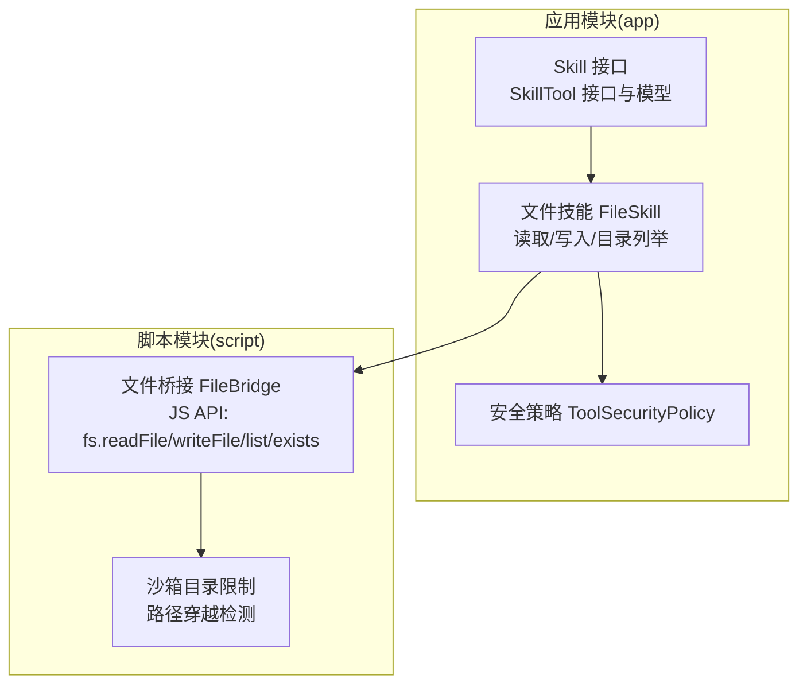
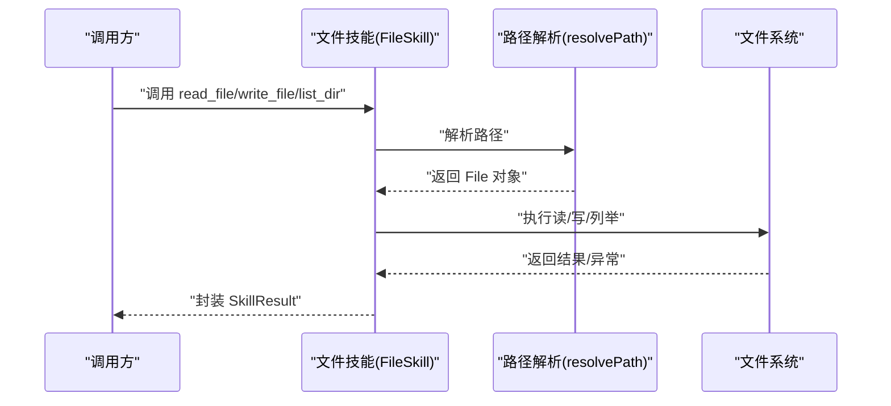
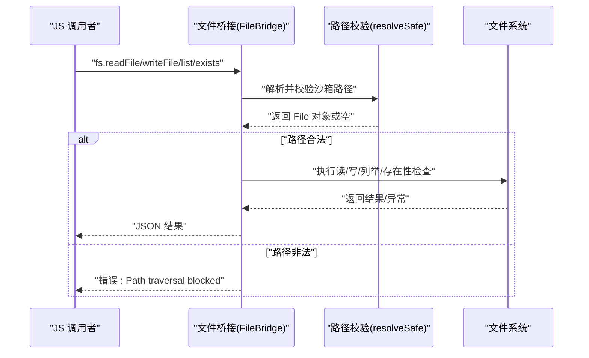
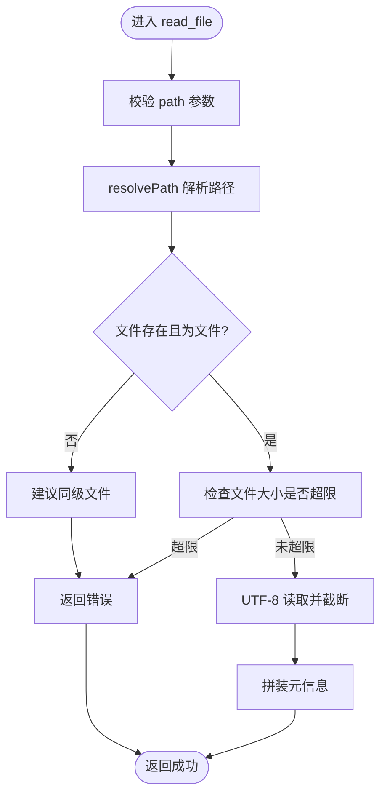
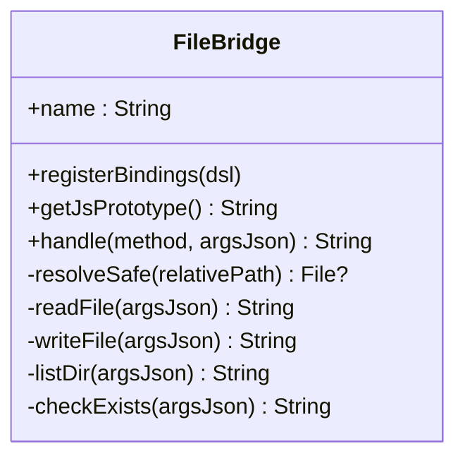
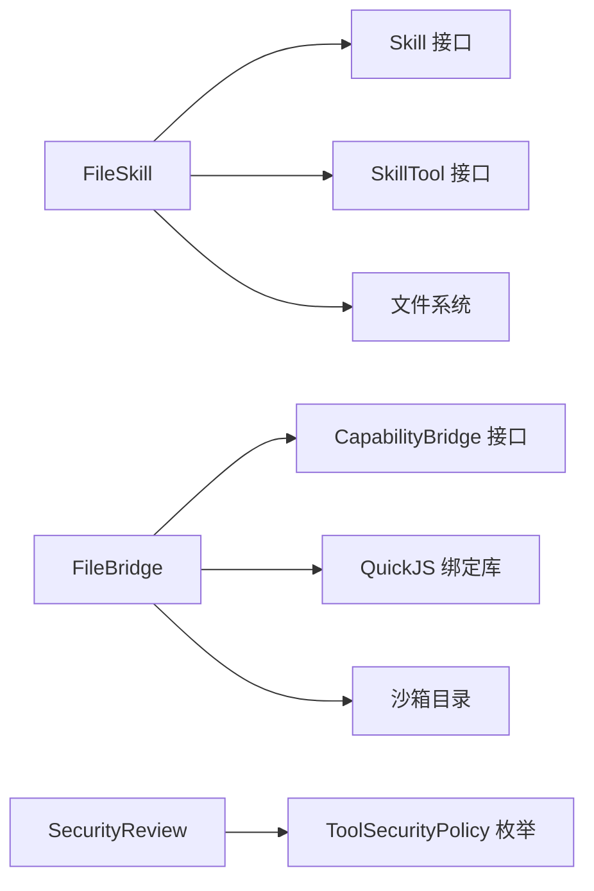

# 文件技能

<cite>
**本文引用的文件**
- [FileSkill.kt](file://app/src/main/java/ai/openclaw/android/skill/builtin/FileSkill.kt)
- [FileBridge.kt](file://script/src/main/java/ai/openclaw/script/bridge/FileBridge.kt)
- [Skill.kt](file://app/src/main/java/ai/openclaw/android/skill/Skill.kt)
- [SkillTool.kt](file://app/src/main/java/ai/openclaw/android/skill/SkillTool.kt)
- [ToolSecurityPolicy.kt](file://app/src/main/java/ai/openclaw/android/skill/ToolSecurityPolicy.kt)
- [FileBridgeTest.kt](file://script/src/test/java/ai/openclaw/script/bridge/FileBridgeTest.kt)
</cite>

## 目录
1. [简介](#简介)
2. [项目结构](#项目结构)
3. [核心组件](#核心组件)
4. [架构总览](#架构总览)
5. [详细组件分析](#详细组件分析)
6. [依赖关系分析](#依赖关系分析)
7. [性能考量](#性能考量)
8. [故障排查指南](#故障排查指南)
9. [结论](#结论)
10. [附录：使用示例与安全注意事项](#附录使用示例与安全注意事项)

## 简介
本文件技能提供在 Android 设备上的文件系统读写能力，兼容 Android 10+ 的作用域存储（Scoped Storage）。它通过两类入口实现文件操作：
- 应用内技能接口：面向内置技能系统，提供读取、写入、目录列举等工具。
- 脚本沙箱桥接：面向脚本引擎（QuickJS）的文件能力桥接，限定在沙箱目录内进行安全访问。

该技能同时关注路径解析、权限处理、安全限制、错误恢复与性能约束，并提供清晰的使用示例与安全注意事项。

## 项目结构
文件技能相关代码分布于两个模块：
- app 模块：内置技能实现，包含技能接口、参数/结果模型、安全策略以及文件技能的具体实现。
- script 模块：脚本桥接层，提供 JS API 以供脚本引擎调用，所有操作被限制在沙箱目录内。

图表来源
- [FileSkill.kt:30-82](file://app/src/main/java/ai/openclaw/android/skill/builtin/FileSkill.kt#L30-L82)
- [Skill.kt:3-13](file://app/src/main/java/ai/openclaw/android/skill/Skill.kt#L3-L13)
- [SkillTool.kt:3-22](file://app/src/main/java/ai/openclaw/android/skill/SkillTool.kt#L3-L22)
- [ToolSecurityPolicy.kt:6-13](file://app/src/main/java/ai/openclaw/android/skill/ToolSecurityPolicy.kt#L6-L13)
- [FileBridge.kt:20-51](file://script/src/main/java/ai/openclaw/script/bridge/FileBridge.kt#L20-L51)

章节来源
- [FileSkill.kt:1-310](file://app/src/main/java/ai/openclaw/android/skill/builtin/FileSkill.kt#L1-L310)
- [FileBridge.kt:1-157](file://script/src/main/java/ai/openclaw/script/bridge/FileBridge.kt#L1-L157)
- [Skill.kt:1-13](file://app/src/main/java/ai/openclaw/android/skill/Skill.kt#L1-L13)
- [SkillTool.kt:1-22](file://app/src/main/java/ai/openclaw/android/skill/SkillTool.kt#L1-L22)
- [ToolSecurityPolicy.kt:1-72](file://app/src/main/java/ai/openclaw/android/skill/ToolSecurityPolicy.kt#L1-L72)

## 核心组件
- 技能接口与模型
  - 技能接口：定义技能标识、描述、版本、指令说明、工具集合及生命周期钩子。
  - 工具接口与模型：定义工具名称、描述、参数规范（含类型、是否必填、默认值）与异步执行结果。
- 文件技能
  - 读取文件：限制单次读取字符数、UTF-8 编码、存在性与类型校验、提示建议。
  - 写入文件：自动创建父目录、支持覆盖或追加模式、统一 UTF-8 编码。
  - 列举目录：排序展示、区分目录/文件、标注存储位置（外部/内部）、空目录提示。
  - 路径解析：支持“~”前缀、内部/外部目录映射、绝对路径重定向至外部目录、相对路径默认外部根。
- 脚本桥接
  - JS API：readFile、writeFile、list、exists；参数通过 JSON 字符串传递。
  - 沙箱限制：路径穿越检测，仅允许在指定沙箱目录内访问。

章节来源
- [Skill.kt:3-13](file://app/src/main/java/ai/openclaw/android/skill/Skill.kt#L3-L13)
- [SkillTool.kt:3-22](file://app/src/main/java/ai/openclaw/android/skill/SkillTool.kt#L3-L22)
- [FileSkill.kt:78-310](file://app/src/main/java/ai/openclaw/android/skill/builtin/FileSkill.kt#L78-L310)
- [FileBridge.kt:68-120](file://script/src/main/java/ai/openclaw/script/bridge/FileBridge.kt#L68-L120)

## 架构总览
文件技能的执行流分为两条主线：
- 应用内主线：技能管理器调度工具 → 路径解析 → 文件系统操作 → 结果封装。
- 脚本主线：JS 调用 fs.* → 桥接层解析参数 → 沙箱路径校验 → 文件系统操作 → 返回 JSON。

图表来源
- [FileSkill.kt:103-140](file://app/src/main/java/ai/openclaw/android/skill/builtin/FileSkill.kt#L103-L140)
- [FileSkill.kt:167-197](file://app/src/main/java/ai/openclaw/android/skill/builtin/FileSkill.kt#L167-L197)
- [FileSkill.kt:214-246](file://app/src/main/java/ai/openclaw/android/skill/builtin/FileSkill.kt#L214-L246)
- [FileSkill.kt:254-280](file://app/src/main/java/ai/openclaw/android/skill/builtin/FileSkill.kt#L254-L280)

图表来源
- [FileBridge.kt:31-51](file://script/src/main/java/ai/openclaw/script/bridge/FileBridge.kt#L31-L51)
- [FileBridge.kt:68-80](file://script/src/main/java/ai/openclaw/script/bridge/FileBridge.kt#L68-L80)
- [FileBridge.kt:82-86](file://script/src/main/java/ai/openclaw/script/bridge/FileBridge.kt#L82-L86)
- [FileBridge.kt:88-119](file://script/src/main/java/ai/openclaw/script/bridge/FileBridge.kt#L88-L119)

## 详细组件分析

### 文件技能（FileSkill）
- 角色定位
  - 实现 Skill 接口，提供三个工具：read_file、write_file、list_dir。
  - 初始化时确保外部与内部存储根目录存在。
- 路径解析策略
  - “~/internal/...” → 内部存储根目录（应用私有）。
  - “~/...” → 外部存储根目录（用户可访问）。
  - “/sdcard/...” 或 “/storage/...” → 重定向到外部存储根目录。
  - 其他绝对/相对路径 → 默认映射到外部存储根目录。
- 读取流程
  - 参数校验（路径必填、最大字符数）。
  - 解析路径并校验存在性与类型。
  - 限制单次读取不超过配置上限（按字节计算）。
  - UTF-8 读取并截断到最大字符数，输出包含文件名、路径、大小、字符数等元信息。
- 写入流程
  - 参数校验（路径与内容必填）。
  - 自动创建父目录。
  - 追加或覆盖模式切换。
  - 输出包含写入模式、路径、大小、内容长度等信息。
- 列举流程
  - 默认列出外部根目录。
  - 校验目录存在性与类型。
  - 排序：先目录后文件，再按名称大小写不敏感排序。
  - 标注存储位置（外部/内部）与条目数量。
- 错误处理
  - 权限不足、IO 异常、通用异常均捕获并返回结构化错误信息。
  - 文件不存在时提供同级文件建议。
- 性能与限制
  - 单次读取字符数上限（按字节计算）。
  - 不支持二进制文件（统一 UTF-8 编码）。
  - 目录列举排序与格式化输出。

图表来源
- [FileSkill.kt:103-140](file://app/src/main/java/ai/openclaw/android/skill/builtin/FileSkill.kt#L103-L140)
- [FileSkill.kt:254-280](file://app/src/main/java/ai/openclaw/android/skill/builtin/FileSkill.kt#L254-L280)

章节来源
- [FileSkill.kt:30-310](file://app/src/main/java/ai/openclaw/android/skill/builtin/FileSkill.kt#L30-L310)

### 脚本桥接（FileBridge）
- JS API
  - fs.readFile(path) → {content, path}
  - fs.writeFile(path, content) → {success, bytes}
  - fs.list(dir) → {entries: [{name, isDirectory, size}]}
  - fs.exists(path) → {exists}
- 路径安全
  - resolveSafe 基于沙箱目录进行规范化与前缀校验，阻止路径穿越。
  - 任何越界尝试都会返回错误。
- 参数与返回
  - 参数通过 JSON 字符串传递，内部解析并转为原生类型。
  - 返回值序列化为 JSON 字符串，便于 JS 调用。
- 与应用内技能的关系
  - 脚本桥接的路径解析与安全策略独立于应用内技能，但二者共享“外部/内部”存储概念（由应用侧初始化）。

图表来源
- [FileBridge.kt:20-120](file://script/src/main/java/ai/openclaw/script/bridge/FileBridge.kt#L20-L120)

章节来源
- [FileBridge.kt:1-157](file://script/src/main/java/ai/openclaw/script/bridge/FileBridge.kt#L1-L157)

### 技能接口与模型
- Skill 接口：定义技能的基本属性与生命周期。
- SkillTool 接口：定义工具的参数规范与异步执行结果。
- SkillParam/SkillResult：参数类型、默认值与执行结果封装。

章节来源
- [Skill.kt:3-13](file://app/src/main/java/ai/openclaw/android/skill/Skill.kt#L3-L13)
- [SkillTool.kt:3-22](file://app/src/main/java/ai/openclaw/android/skill/SkillTool.kt#L3-L22)

### 安全策略（ToolSecurityPolicy）
- 工具安全策略枚举：自动执行、询问用户、拒绝执行。
- 用户审批偏好：支持“总是允许/总是拒绝/每次都问”三种模式。
- 安全审查器：根据工具幂等性与用户偏好决定策略。

章节来源
- [ToolSecurityPolicy.kt:6-71](file://app/src/main/java/ai/openclaw/android/skill/ToolSecurityPolicy.kt#L6-L71)

## 依赖关系分析
- FileSkill 依赖
  - 技能接口与模型：实现 Skill 与 SkillTool。
  - Android 上下文：获取外部与内部存储根目录。
  - 文件系统：读写与列举。
- FileBridge 依赖
  - 能力桥接接口：统一注册与调用方式。
  - 快速 JS 绑定库：将 Kotlin 方法暴露为 JS 可调用函数。
  - 沙箱目录：限制文件操作范围。
- 安全策略
  - 与工具执行流程耦合，影响是否需要用户授权。

图表来源
- [FileSkill.kt:30-82](file://app/src/main/java/ai/openclaw/android/skill/builtin/FileSkill.kt#L30-L82)
- [FileBridge.kt:20-51](file://script/src/main/java/ai/openclaw/script/bridge/FileBridge.kt#L20-L51)
- [ToolSecurityPolicy.kt:6-13](file://app/src/main/java/ai/openclaw/android/skill/ToolSecurityPolicy.kt#L6-L13)

章节来源
- [FileSkill.kt:30-310](file://app/src/main/java/ai/openclaw/android/skill/builtin/FileSkill.kt#L30-L310)
- [FileBridge.kt:1-157](file://script/src/main/java/ai/openclaw/script/bridge/FileBridge.kt#L1-L157)
- [ToolSecurityPolicy.kt:1-72](file://app/src/main/java/ai/openclaw/android/skill/ToolSecurityPolicy.kt#L1-L72)

## 性能考量
- 读取限制
  - 单次读取字符数上限，避免大文件导致内存压力。
  - 文件大小检查基于字节数（考虑 UTF-8 编码特性）。
- 写入优化
  - 自动创建父目录减少 IO 失败概率。
  - 追加模式与覆盖模式分别处理，降低不必要的写放大。
- 目录列举
  - 排序与格式化输出，便于前端渲染；空目录给出引导提示。
- 脚本桥接
  - 路径穿越检测与规范化开销较小，但能显著提升安全性。

章节来源
- [FileSkill.kt:54-58](file://app/src/main/java/ai/openclaw/android/skill/builtin/FileSkill.kt#L54-L58)
- [FileSkill.kt:120-122](file://app/src/main/java/ai/openclaw/android/skill/builtin/FileSkill.kt#L120-L122)
- [FileSkill.kt:227-232](file://app/src/main/java/ai/openclaw/android/skill/builtin/FileSkill.kt#L227-L232)

## 故障排查指南
- 常见错误与原因
  - 文件不存在：检查路径是否正确，参考同级文件建议。
  - 路径不是文件：确认目标为文件而非目录。
  - 文件过大：超过读取限制，需拆分或改用其他方式。
  - 权限不足：检查应用存储权限与作用域存储策略。
  - 脚本路径穿越：沙箱外访问被拦截，修正相对路径。
- 建议排查步骤
  - 确认路径解析结果与预期一致。
  - 检查文件是否存在、是否为文件、是否可读。
  - 对于脚本调用，验证相对路径是否位于沙箱目录内。
  - 查看日志输出中的错误信息与建议提示。

章节来源
- [FileSkill.kt:113-122](file://app/src/main/java/ai/openclaw/android/skill/builtin/FileSkill.kt#L113-L122)
- [FileSkill.kt:133-139](file://app/src/main/java/ai/openclaw/android/skill/builtin/FileSkill.kt#L133-L139)
- [FileBridge.kt:82-86](file://script/src/main/java/ai/openclaw/script/bridge/FileBridge.kt#L82-L86)
- [FileBridge.kt:88-94](file://script/src/main/java/ai/openclaw/script/bridge/FileBridge.kt#L88-L94)

## 结论
文件技能在 Android 10+ 作用域存储环境下提供了安全、可控的文件读写能力。通过明确的路径解析策略、严格的权限与安全限制、完善的错误处理与性能约束，既满足了日常文件管理需求，又保障了系统的稳定性与安全性。脚本桥接进一步将能力安全地暴露给脚本环境，配合沙箱机制有效防止路径穿越等风险。

## 附录：使用示例与安全注意事项
- 使用示例（应用内）
  - 读取文件：提供路径与最大字符数，接收包含元信息与内容的结果。
  - 写入文件：提供路径与内容，选择覆盖或追加模式，接收写入结果与路径信息。
  - 列举目录：默认列出外部根目录，查看条目数量与存储位置。
- 使用示例（脚本）
  - 通过 fs.readFile/fs.writeFile/fs.list/fs.exists 访问文件，参数为 JSON 字符串。
  - 所有操作受限于沙箱目录，越界将返回错误。
- 安全注意事项
  - 遵循路径解析规则，优先使用“~”前缀指向外部/内部存储。
  - 避免直接传入绝对路径或上级目录跳转。
  - 注意读取限制与二进制文件限制，避免内存与编码问题。
  - 在脚本中严格限定相对路径，防止路径穿越。
  - 对非幂等操作（如写入）结合安全策略与用户审批。

章节来源
- [FileSkill.kt:36-58](file://app/src/main/java/ai/openclaw/android/skill/builtin/FileSkill.kt#L36-L58)
- [FileBridge.kt:59-66](file://script/src/main/java/ai/openclaw/script/bridge/FileBridge.kt#L59-L66)
- [FileBridgeTest.kt](file://script/src/test/java/ai/openclaw/script/bridge/FileBridgeTest.kt)