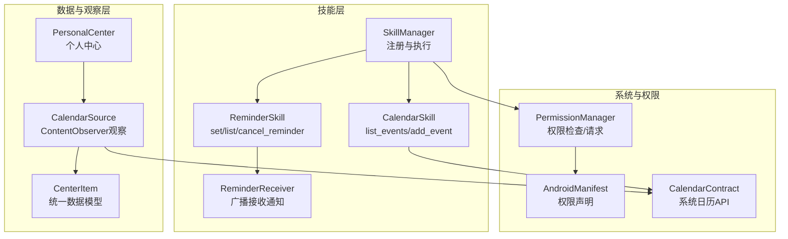
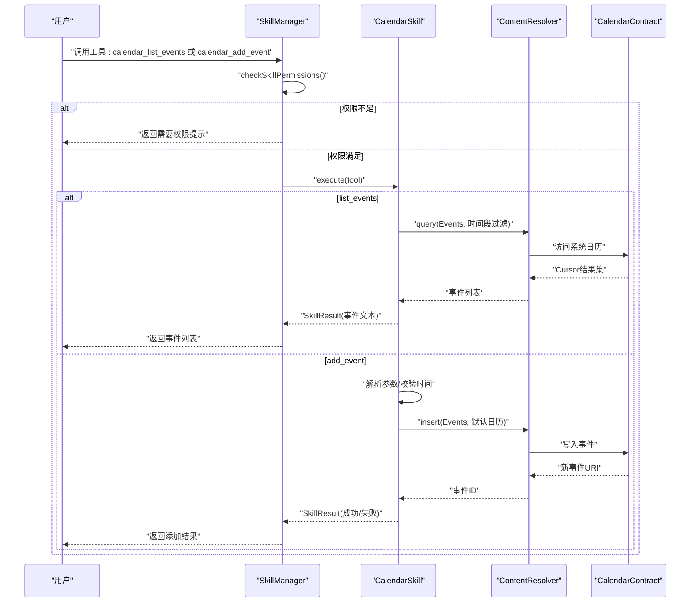
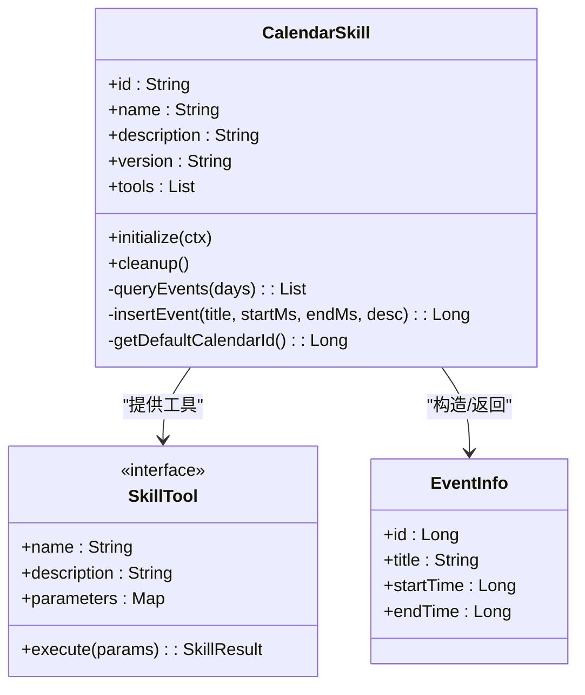
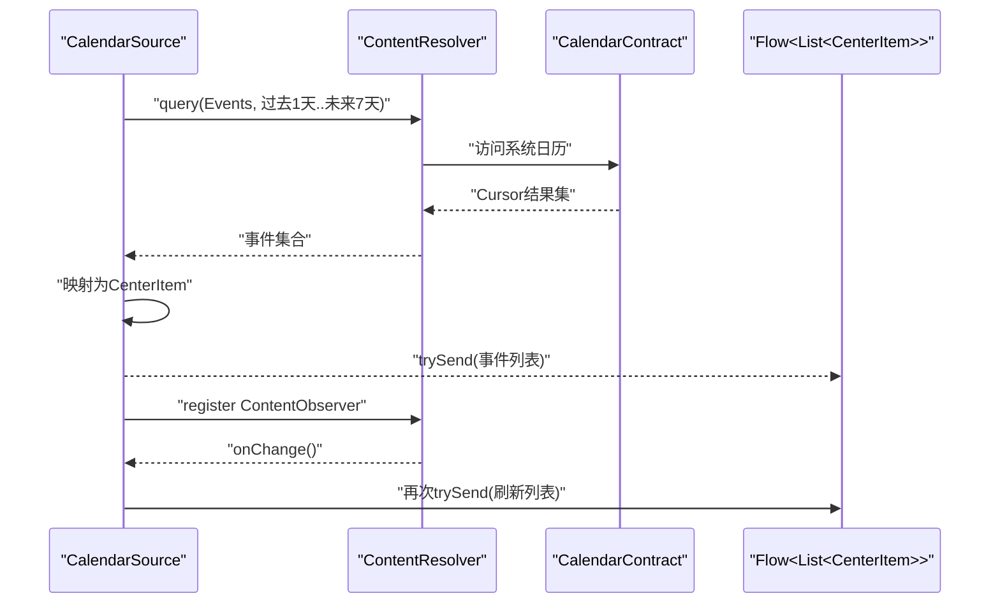
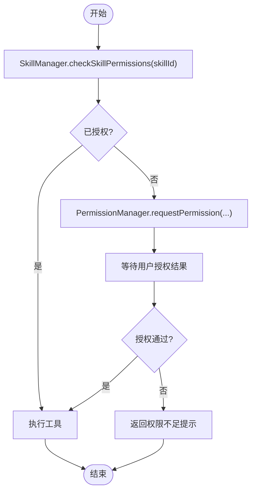
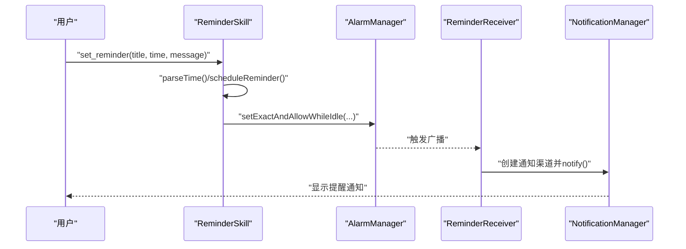
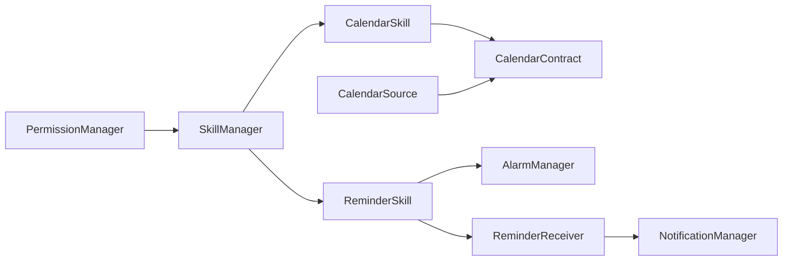

# 日历技能

<cite>
**本文引用的文件**
- [CalendarSkill.kt](file://app/src/main/java/ai/openclaw/android/skill/builtin/CalendarSkill.kt)
- [CalendarSource.kt](file://app/src/main/java/ai/openclaw/android/personalcenter/sources/CalendarSource.kt)
- [SkillManager.kt](file://app/src/main/java/ai/openclaw/android/skill/SkillManager.kt)
- [PermissionManager.kt](file://app/src/main/java/ai/openclaw/android/permission/PermissionManager.kt)
- [ReminderSkill.kt](file://app/src/main/java/ai/openclaw/android/skill/builtin/ReminderSkill.kt)
- [ReminderReceiver.kt](file://app/src/main/java/ai/openclaw/android/skill/builtin/ReminderReceiver.kt)
- [Skill.kt](file://app/src/main/java/ai/openclaw/android/skill/Skill.kt)
- [SkillTool.kt](file://app/src/main/java/ai/openclaw/android/skill/SkillTool.kt)
- [AndroidManifest.xml](file://app/src/main/AndroidManifest.xml)
- [CenterItem.kt](file://app/src/main/java/ai/openclaw/android/personalcenter/models/CenterItem.kt)
</cite>

## 目录
1. [简介](#简介)
2. [项目结构](#项目结构)
3. [核心组件](#核心组件)
4. [架构总览](#架构总览)
5. [详细组件分析](#详细组件分析)
6. [依赖关系分析](#依赖关系分析)
7. [性能与可靠性](#性能与可靠性)
8. [故障排查指南](#故障排查指南)
9. [结论](#结论)
10. [附录：使用示例与权限配置](#附录使用示例与权限配置)

## 简介
本技术文档围绕“日历技能”展开，系统性介绍其在OpenClaw Android项目中的实现与使用方式。重点覆盖以下方面：
- 事件管理能力：事件创建、查询与展示
- 权限处理：运行时权限检查与请求流程
- 数据同步与变更监听：基于ContentObserver的实时更新
- 冲突与并发：当前实现未显式处理写入冲突，建议遵循Android日历API并发约束
- 事件提醒与通知：结合提醒技能与通知通道
- API集成与数据模型：基于Android CalendarContract的事件模型
- 使用示例与权限配置：面向开发者与用户的实操指导

## 项目结构
日历技能位于技能体系中，作为内置技能之一被SkillManager统一加载与调度；同时，个人中心模块复用日历查询逻辑以实现事件流的观察与展示。

图示来源
- [SkillManager.kt:13-33](file://app/src/main/java/ai/openclaw/android/skill/SkillManager.kt#L13-L33)
- [CalendarSkill.kt:13-182](file://app/src/main/java/ai/openclaw/android/skill/builtin/CalendarSkill.kt#L13-L182)
- [CalendarSource.kt:21-129](file://app/src/main/java/ai/openclaw/android/personalcenter/sources/CalendarSource.kt#L21-L129)
- [CenterItem.kt:10-24](file://app/src/main/java/ai/openclaw/android/personalcenter/models/CenterItem.kt#L10-L24)
- [AndroidManifest.xml:17-19](file://app/src/main/AndroidManifest.xml#L17-L19)
- [PermissionManager.kt:132-153](file://app/src/main/java/ai/openclaw/android/permission/PermissionManager.kt#L132-L153)

章节来源
- [SkillManager.kt:13-33](file://app/src/main/java/ai/openclaw/android/skill/SkillManager.kt#L13-L33)
- [CalendarSkill.kt:13-182](file://app/src/main/java/ai/openclaw/android/skill/builtin/CalendarSkill.kt#L13-L182)
- [CalendarSource.kt:21-129](file://app/src/main/java/ai/openclaw/android/personalcenter/sources/CalendarSource.kt#L21-L129)
- [CenterItem.kt:10-24](file://app/src/main/java/ai/openclaw/android/personalcenter/models/CenterItem.kt#L10-L24)
- [AndroidManifest.xml:17-19](file://app/src/main/AndroidManifest.xml#L17-L19)
- [PermissionManager.kt:132-153](file://app/src/main/java/ai/openclaw/android/permission/PermissionManager.kt#L132-L153)

## 核心组件
- 日历技能（CalendarSkill）
  - 提供两个工具：list_events（查询未来N天内的事件）、add_event（新增事件）
  - 查询基于ContentResolver与CalendarContract.Events，支持按时间段过滤与排序
  - 新增事件时自动选择默认日历并写入
- 个人中心日历数据源（CalendarSource）
  - 复用日历查询逻辑，封装为Flow，通过ContentObserver监听事件变化
  - 将事件转换为CenterItem，便于个人中心统一展示
- 技能管理器（SkillManager）
  - 负责内置技能注册、工具聚合、权限校验与执行分发
- 权限管理（PermissionManager）
  - 统一管理各技能所需权限，提供状态查询与请求接口
- 提醒技能（ReminderSkill）与广播接收器（ReminderReceiver）
  - 支持设置/列出/取消提醒，使用AlarmManager与PendingIntent触发
  - 广播接收器负责创建通知渠道并推送提醒通知

章节来源
- [CalendarSkill.kt:32-171](file://app/src/main/java/ai/openclaw/android/skill/builtin/CalendarSkill.kt#L32-L171)
- [CalendarSource.kt:25-128](file://app/src/main/java/ai/openclaw/android/personalcenter/sources/CalendarSource.kt#L25-L128)
- [SkillManager.kt:40-107](file://app/src/main/java/ai/openclaw/android/skill/SkillManager.kt#L40-L107)
- [PermissionManager.kt:32-153](file://app/src/main/java/ai/openclaw/android/permission/PermissionManager.kt#L32-L153)
- [ReminderSkill.kt:40-200](file://app/src/main/java/ai/openclaw/android/skill/builtin/ReminderSkill.kt#L40-L200)
- [ReminderReceiver.kt:11-43](file://app/src/main/java/ai/openclaw/android/skill/builtin/ReminderReceiver.kt#L11-43)

## 架构总览
日历技能在系统中的位置与交互如下：

图示来源
- [SkillManager.kt:62-83](file://app/src/main/java/ai/openclaw/android/skill/SkillManager.kt#L62-L83)
- [CalendarSkill.kt:41-99](file://app/src/main/java/ai/openclaw/android/skill/builtin/CalendarSkill.kt#L41-L99)
- [CalendarSkill.kt:113-155](file://app/src/main/java/ai/openclaw/android/skill/builtin/CalendarSkill.kt#L113-L155)

## 详细组件分析

### 日历技能（CalendarSkill）
- 工具定义
  - list_events：支持参数days（默认7天），返回未来指定天数内的事件摘要
  - add_event：必填参数title、start_time、end_time；可选description；写入默认日历
- 数据模型
  - EventInfo：包含事件ID、标题、起止时间
- 错误处理
  - 安全异常（权限不足）与通用异常分别捕获并返回明确错误信息
- 性能与复杂度
  - 查询为单次游标遍历，时间复杂度O(n)，空间复杂度O(n)
- 并发与冲突
  - 当前实现未显式处理写入冲突；建议遵循Android日历API的并发约束与事务策略

图示来源
- [CalendarSkill.kt:13-182](file://app/src/main/java/ai/openclaw/android/skill/builtin/CalendarSkill.kt#L13-L182)
- [SkillTool.kt:3-9](file://app/src/main/java/ai/openclaw/android/skill/SkillTool.kt#L3-L9)

章节来源
- [CalendarSkill.kt:32-171](file://app/src/main/java/ai/openclaw/android/skill/builtin/CalendarSkill.kt#L32-L171)
- [SkillTool.kt:3-22](file://app/src/main/java/ai/openclaw/android/skill/SkillTool.kt#L3-L22)

### 个人中心日历数据源（CalendarSource）
- 观察机制
  - 使用callbackFlow与ContentObserver监听系统日历变更，自动刷新事件流
  - 查询范围：过去1天至未来7天
- 数据映射
  - 将事件映射为CenterItem，包含来源、标题、正文、时间戳、打开意图等
- 异常处理
  - 权限不足时返回空列表；异常记录日志并安全返回

图示来源
- [CalendarSource.kt:25-128](file://app/src/main/java/ai/openclaw/android/personalcenter/sources/CalendarSource.kt#L25-L128)
- [CenterItem.kt:10-24](file://app/src/main/java/ai/openclaw/android/personalcenter/models/CenterItem.kt#L10-L24)

章节来源
- [CalendarSource.kt:25-128](file://app/src/main/java/ai/openclaw/android/personalcenter/sources/CalendarSource.kt#L25-L128)
- [CenterItem.kt:10-24](file://app/src/main/java/ai/openclaw/android/personalcenter/models/CenterItem.kt#L10-L24)

### 权限处理与配置
- 必需权限
  - 日历读写：READ_CALENDAR、WRITE_CALENDAR
- 运行时检查与请求
  - SkillManager在执行工具前进行权限校验
  - PermissionManager提供统一的权限状态查询与请求流程
- 清单声明
  - AndroidManifest中声明了READ_CALENDAR与WRITE_CALENDAR

图示来源
- [SkillManager.kt:89-107](file://app/src/main/java/ai/openclaw/android/skill/SkillManager.kt#L89-L107)
- [PermissionManager.kt:41-70](file://app/src/main/java/ai/openclaw/android/permission/PermissionManager.kt#L41-L70)

章节来源
- [SkillManager.kt:89-107](file://app/src/main/java/ai/openclaw/android/skill/SkillManager.kt#L89-L107)
- [PermissionManager.kt:132-153](file://app/src/main/java/ai/openclaw/android/permission/PermissionManager.kt#L132-L153)
- [AndroidManifest.xml:17-19](file://app/src/main/AndroidManifest.xml#L17-L19)

### 事件提醒与通知（结合ReminderSkill）
- 提醒技能
  - 支持相对时间（如“in 5 minutes”）与绝对时间（yyyy-MM-dd HH:mm）
  - 使用AlarmManager与PendingIntent调度，必要时回退到非精确闹钟
- 广播接收器
  - 在onReceive中创建通知渠道并推送通知
- 与日历的协同
  - 可通过提醒技能对日历事件进行补充提醒；或在日历事件变更时联动提醒策略

图示来源
- [ReminderSkill.kt:51-134](file://app/src/main/java/ai/openclaw/android/skill/builtin/ReminderSkill.kt#L51-L134)
- [ReminderReceiver.kt:12-42](file://app/src/main/java/ai/openclaw/android/skill/builtin/ReminderReceiver.kt#L12-L42)

章节来源
- [ReminderSkill.kt:51-134](file://app/src/main/java/ai/openclaw/android/skill/builtin/ReminderSkill.kt#L51-L134)
- [ReminderReceiver.kt:12-42](file://app/src/main/java/ai/openclaw/android/skill/builtin/ReminderReceiver.kt#L12-L42)

## 依赖关系分析
- 组件耦合
  - CalendarSkill直接依赖ContentResolver与CalendarContract
  - CalendarSource复用日历查询逻辑，依赖ContentObserver实现增量刷新
  - SkillManager统一编排技能与权限，解耦上层调用方
- 外部依赖
  - Android系统日历API（CalendarContract）
  - AlarmManager与通知服务（用于提醒）
  - 权限框架（AndroidX Core）

图示来源
- [SkillManager.kt:13-33](file://app/src/main/java/ai/openclaw/android/skill/SkillManager.kt#L13-L33)
- [CalendarSkill.kt:63-80](file://app/src/main/java/ai/openclaw/android/skill/builtin/CalendarSkill.kt#L63-L80)
- [CalendarSource.kt:40-48](file://app/src/main/java/ai/openclaw/android/personalcenter/sources/CalendarSource.kt#L40-L48)
- [ReminderSkill.kt:97-134](file://app/src/main/java/ai/openclaw/android/skill/builtin/ReminderSkill.kt#L97-L134)
- [ReminderReceiver.kt:20-42](file://app/src/main/java/ai/openclaw/android/skill/builtin/ReminderReceiver.kt#L20-L42)

章节来源
- [SkillManager.kt:13-33](file://app/src/main/java/ai/openclaw/android/skill/SkillManager.kt#L13-L33)
- [CalendarSkill.kt:63-80](file://app/src/main/java/ai/openclaw/android/skill/builtin/CalendarSkill.kt#L63-L80)
- [CalendarSource.kt:40-48](file://app/src/main/java/ai/openclaw/android/personalcenter/sources/CalendarSource.kt#L40-L48)
- [ReminderSkill.kt:97-134](file://app/src/main/java/ai/openclaw/android/skill/builtin/ReminderSkill.kt#L97-L134)
- [ReminderReceiver.kt:20-42](file://app/src/main/java/ai/openclaw/android/skill/builtin/ReminderReceiver.kt#L20-L42)

## 性能与可靠性
- 查询性能
  - 单次查询为线性扫描，建议限制查询天数与结果集大小
- 内存与资源
  - Cursor使用with块确保关闭，避免泄漏
- 可靠性
  - 对权限异常与通用异常分别处理，保证稳定性
  - 建议在高并发场景下增加重试与幂等控制（当前未实现）

[本节为通用性能讨论，不直接分析具体文件]

## 故障排查指南
- 权限相关
  - 现象：调用失败并提示需要权限
  - 排查：确认清单已声明READ_CALENDAR/WRITE_CALENDAR；运行时权限已授予
- 查询为空
  - 现象：list_events返回空列表
  - 排查：确认设备日历中存在目标时间段内的事件；检查日期格式与时区
- 写入失败
  - 现象：add_event返回失败
  - 排查：检查输入参数格式；确认默认日历可用；查看异常日志
- 通知/提醒无效
  - 现象：设置提醒后无通知
  - 排查：检查POST_NOTIFICATIONS与SCHEDULE_EXACT_ALARM权限；Android版本对精确闹钟的限制

章节来源
- [AndroidManifest.xml:17-19](file://app/src/main/AndroidManifest.xml#L17-L19)
- [SkillManager.kt:89-107](file://app/src/main/java/ai/openclaw/android/skill/SkillManager.kt#L89-L107)
- [CalendarSkill.kt:44-58](file://app/src/main/java/ai/openclaw/android/skill/builtin/CalendarSkill.kt#L44-L58)
- [ReminderSkill.kt:112-130](file://app/src/main/java/ai/openclaw/android/skill/builtin/ReminderSkill.kt#L112-L130)

## 结论
日历技能提供了简洁可靠的事件查询与新增能力，配合个人中心的数据源与权限管理，形成从数据到展示的一体化方案。提醒技能进一步增强了事件生命周期管理。建议后续增强写入冲突处理、批量操作与更丰富的事件属性支持。

[本节为总结性内容，不直接分析具体文件]

## 附录：使用示例与权限配置

- 使用示例
  - 查询未来7天日程：调用工具 calendar_list_events
  - 查询未来N天日程：传入days参数
  - 新增日程事件：调用工具 calendar_add_event，提供title、start_time、end_time、description（可选）
- 权限配置
  - 清单声明：READ_CALENDAR、WRITE_CALENDAR
  - 运行时请求：由PermissionManager与SkillManager协作完成
  - 提醒相关：如需精确闹钟，确保SCHEDULE_EXACT_ALARM权限可用

章节来源
- [CalendarSkill.kt:19-27](file://app/src/main/java/ai/openclaw/android/skill/builtin/CalendarSkill.kt#L19-L27)
- [CalendarSkill.kt:37-39](file://app/src/main/java/ai/openclaw/android/skill/builtin/CalendarSkill.kt#L37-L39)
- [CalendarSkill.kt:106-111](file://app/src/main/java/ai/openclaw/android/skill/builtin/CalendarSkill.kt#L106-L111)
- [AndroidManifest.xml:17-19](file://app/src/main/AndroidManifest.xml#L17-L19)
- [PermissionManager.kt:162-163](file://app/src/main/java/ai/openclaw/android/permission/PermissionManager.kt#L162-L163)
- [SkillManager.kt:119-138](file://app/src/main/java/ai/openclaw/android/skill/SkillManager.kt#L119-L138)