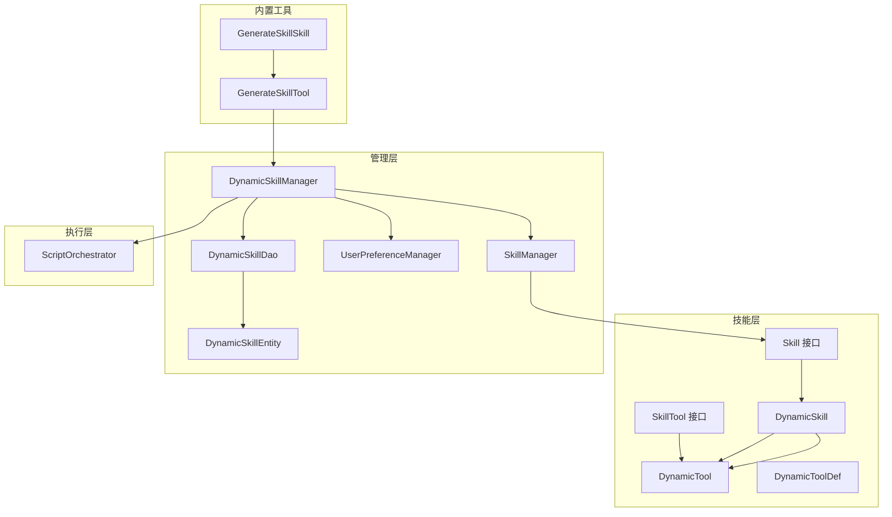
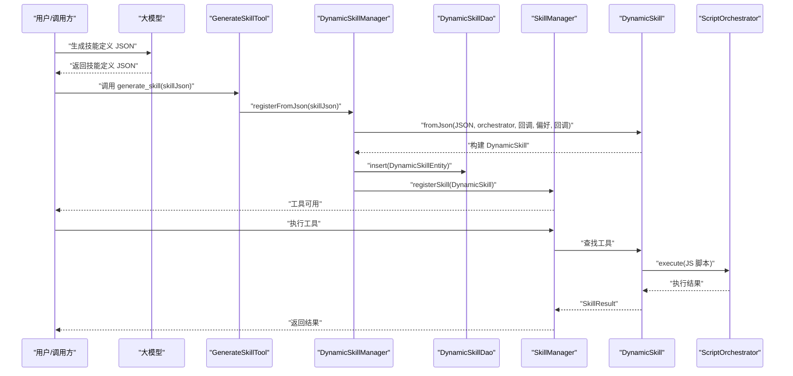
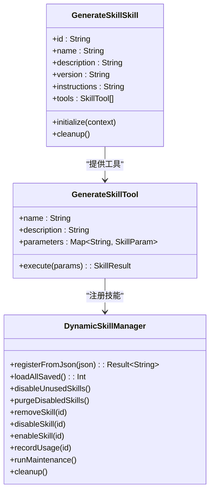
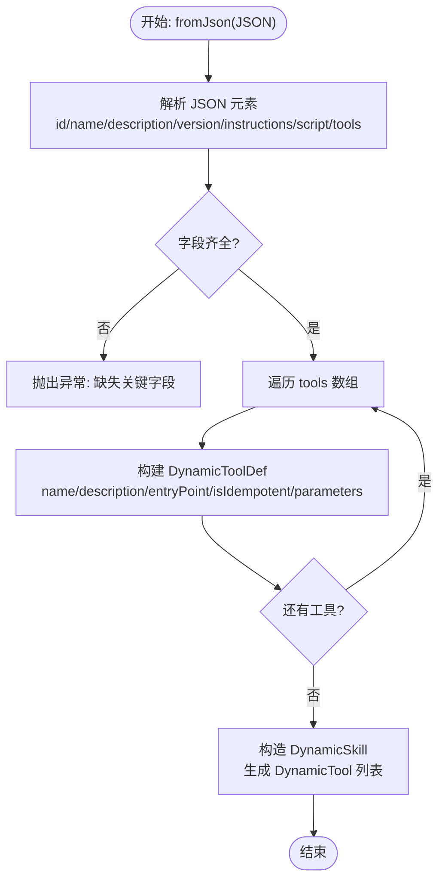
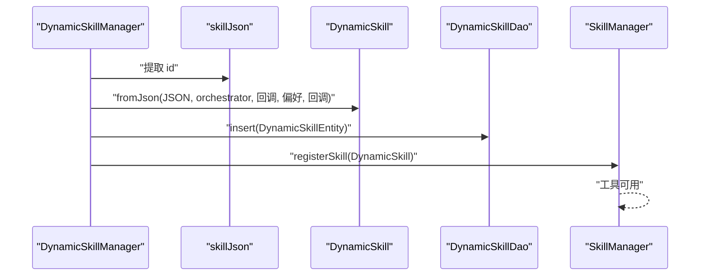
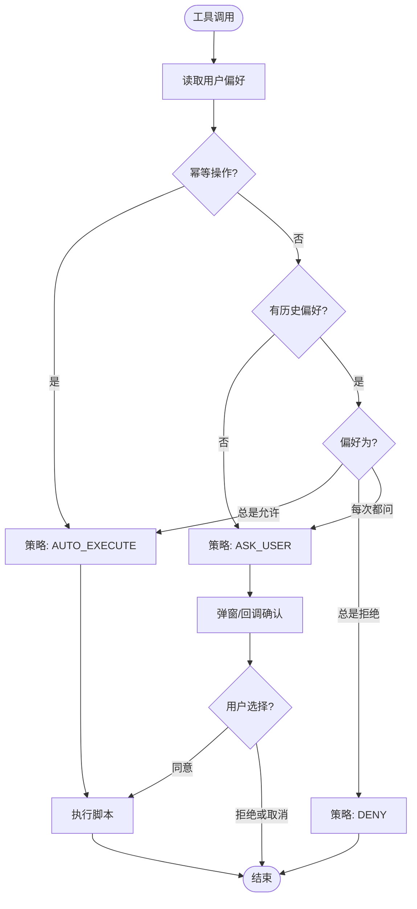
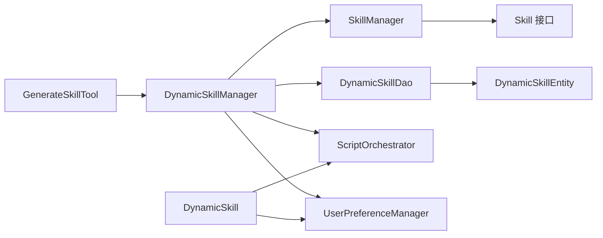

# 生成技能

<cite>
**本文引用的文件**
- [GenerateSkillSkill.kt](file://app/src/main/java/ai/openclaw/android/skill/builtin/GenerateSkillSkill.kt)
- [GenerateSkillTool.kt](file://app/src/main/java/ai/openclaw/android/skill/builtin/GenerateSkillTool.kt)
- [DynamicSkill.kt](file://app/src/main/java/ai/openclaw/android/skill/DynamicSkill.kt)
- [DynamicSkillManager.kt](file://app/src/main/java/ai/openclaw/android/skill/DynamicSkillManager.kt)
- [Skill.kt](file://app/src/main/java/ai/openclaw/android/skill/Skill.kt)
- [SkillManager.kt](file://app/src/main/java/ai/openclaw/android/skill/SkillManager.kt)
- [ToolSecurityPolicy.kt](file://app/src/main/java/ai/openclaw/android/skill/ToolSecurityPolicy.kt)
- [UserPreferenceManager.kt](file://app/src/main/java/ai/openclaw/android/skill/UserPreferenceManager.kt)
- [DynamicSkillEntity.kt](file://app/src/main/java/ai/openclaw/android/data/model/DynamicSkillEntity.kt)
- [DynamicSkillDao.kt](file://app/src/main/java/ai/openclaw/android/data/local/DynamicSkillDao.kt)
- [ScriptOrchestrator.kt](file://script/src/main/java/ai/openclaw/script/ScriptOrchestrator.kt)
- [DynamicSkillTest.kt](file://app/src/test/java/ai/openclaw/android/skill/DynamicSkillTest.kt)
- [GenerateSkillToolTest.kt](file://app/src/test/java/ai/openclaw/android/skill/builtin/GenerateSkillToolTest.kt)
- [skill-schema-v1.md](file://docs/skill-schema-v1.md)
</cite>

## 目录
1. [简介](#简介)
2. [项目结构](#项目结构)
3. [核心组件](#核心组件)
4. [架构总览](#架构总览)
5. [详细组件分析](#详细组件分析)
6. [依赖关系分析](#依赖关系分析)
7. [性能考量](#性能考量)
8. [故障排查指南](#故障排查指南)
9. [结论](#结论)
10. [附录](#附录)

## 简介
本文件围绕“生成技能”能力进行系统化技术说明，涵盖动态技能生成的完整流程：从技能定义解析、工具生成与参数验证，到代码生成机制、运行时加载与持久化，再到安全性评估与权限控制、调试与测试方法，以及使用示例与开发指导。目标是帮助开发者快速理解并安全地扩展与集成动态技能。

## 项目结构
生成技能功能主要分布在以下模块：
- 技能接口与基础模型：Skill、SkillTool、SkillParam、SkillResult
- 动态技能实现：DynamicSkill、DynamicTool、DynamicToolDef
- 管理与生命周期：DynamicSkillManager、SkillManager
- 安全与偏好：ToolSecurityPolicy、UserPreferenceManager、SecurityReview
- 数据持久化：DynamicSkillEntity、DynamicSkillDao
- 脚本执行：ScriptOrchestrator
- 内置生成工具：GenerateSkillSkill、GenerateSkillTool
- 测试与文档：单元测试、技能 Schema 文档

图表来源
- [Skill.kt:1-13](file://app/src/main/java/ai/openclaw/android/skill/Skill.kt#L1-L13)
- [DynamicSkill.kt:22-109](file://app/src/main/java/ai/openclaw/android/skill/DynamicSkill.kt#L22-L109)
- [DynamicSkillManager.kt:22-202](file://app/src/main/java/ai/openclaw/android/skill/DynamicSkillManager.kt#L22-L202)
- [SkillManager.kt:8-193](file://app/src/main/java/ai/openclaw/android/skill/SkillManager.kt#L8-L193)
- [UserPreferenceManager.kt:16-100](file://app/src/main/java/ai/openclaw/android/skill/UserPreferenceManager.kt#L16-L100)
- [DynamicSkillDao.kt:7-47](file://app/src/main/java/ai/openclaw/android/data/local/DynamicSkillDao.kt#L7-L47)
- [DynamicSkillEntity.kt:6-22](file://app/src/main/java/ai/openclaw/android/data/model/DynamicSkillEntity.kt#L6-L22)
- [ScriptOrchestrator.kt:13-55](file://script/src/main/java/ai/openclaw/script/ScriptOrchestrator.kt#L13-L55)
- [GenerateSkillSkill.kt:10-26](file://app/src/main/java/ai/openclaw/android/skill/builtin/GenerateSkillSkill.kt#L10-L26)
- [GenerateSkillTool.kt:10-88](file://app/src/main/java/ai/openclaw/android/skill/builtin/GenerateSkillTool.kt#L10-L88)

章节来源
- [Skill.kt:1-13](file://app/src/main/java/ai/openclaw/android/skill/Skill.kt#L1-L13)
- [DynamicSkill.kt:22-109](file://app/src/main/java/ai/openclaw/android/skill/DynamicSkill.kt#L22-L109)
- [DynamicSkillManager.kt:22-202](file://app/src/main/java/ai/openclaw/android/skill/DynamicSkillManager.kt#L22-L202)
- [SkillManager.kt:8-193](file://app/src/main/java/ai/openclaw/android/skill/SkillManager.kt#L8-L193)
- [UserPreferenceManager.kt:16-100](file://app/src/main/java/ai/openclaw/android/skill/UserPreferenceManager.kt#L16-L100)
- [DynamicSkillDao.kt:7-47](file://app/src/main/java/ai/openclaw/android/data/local/DynamicSkillDao.kt#L7-L47)
- [DynamicSkillEntity.kt:6-22](file://app/src/main/java/ai/openclaw/android/data/model/DynamicSkillEntity.kt#L6-L22)
- [ScriptOrchestrator.kt:13-55](file://script/src/main/java/ai/openclaw/script/ScriptOrchestrator.kt#L13-L55)
- [GenerateSkillSkill.kt:10-26](file://app/src/main/java/ai/openclaw/android/skill/builtin/GenerateSkillSkill.kt#L10-L26)
- [GenerateSkillTool.kt:10-88](file://app/src/main/java/ai/openclaw/android/skill/builtin/GenerateSkillTool.kt#L10-L88)

## 核心组件
- 技能接口与模型
  - Skill：统一技能抽象，包含元数据与工具集合，支持初始化与清理。
  - SkillTool：统一工具抽象，定义名称、描述、参数与异步执行。
  - SkillParam/SkillResult：参数与结果模型。
- 动态技能实现
  - DynamicSkill：从 JSON 构建技能，解析工具定义，生成 DynamicTool 列表。
  - DynamicTool：将工具调用路由至 ScriptOrchestrator 执行 JS 脚本。
  - DynamicToolDef：从 JSON 解析得到的工具定义。
- 管理与生命周期
  - DynamicSkillManager：负责从 JSON 注册技能、持久化、加载、停用/删除、定时维护。
  - SkillManager：全局技能注册与工具执行分发，含权限检查。
- 安全与偏好
  - ToolSecurityPolicy/ApprovalDecision：安全策略与用户审批决策枚举。
  - SecurityReview：基于幂等性与用户偏好的安全审查逻辑。
  - UserPreferenceManager：用户审批偏好持久化（JSON 文件）。
- 数据持久化
  - DynamicSkillEntity：Room 实体，记录技能元数据、脚本、工具定义、权限、使用时间与启用状态。
  - DynamicSkillDao：Room DAO，提供 CRUD、启用/停用、按阈值查询、更新 lastUsedAt。
- 脚本执行
  - ScriptOrchestrator：脚本执行入口，解析能力桥接与沙箱策略，委派给 ScriptEngine 执行。

章节来源
- [Skill.kt:1-13](file://app/src/main/java/ai/openclaw/android/skill/Skill.kt#L1-L13)
- [DynamicSkill.kt:22-109](file://app/src/main/java/ai/openclaw/android/skill/DynamicSkill.kt#L22-L109)
- [DynamicSkillManager.kt:22-202](file://app/src/main/java/ai/openclaw/android/skill/DynamicSkillManager.kt#L22-L202)
- [SkillManager.kt:8-193](file://app/src/main/java/ai/openclaw/android/skill/SkillManager.kt#L8-L193)
- [ToolSecurityPolicy.kt:6-72](file://app/src/main/java/ai/openclaw/android/skill/ToolSecurityPolicy.kt#L6-L72)
- [UserPreferenceManager.kt:16-100](file://app/src/main/java/ai/openclaw/android/skill/UserPreferenceManager.kt#L16-L100)
- [DynamicSkillEntity.kt:6-22](file://app/src/main/java/ai/openclaw/android/data/model/DynamicSkillEntity.kt#L6-L22)
- [DynamicSkillDao.kt:7-47](file://app/src/main/java/ai/openclaw/android/data/local/DynamicSkillDao.kt#L7-L47)
- [ScriptOrchestrator.kt:13-55](file://script/src/main/java/ai/openclaw/script/ScriptOrchestrator.kt#L13-L55)

## 架构总览
动态技能生成的端到端流程如下：

图表来源
- [GenerateSkillTool.kt:63-86](file://app/src/main/java/ai/openclaw/android/skill/builtin/GenerateSkillTool.kt#L63-L86)
- [DynamicSkillManager.kt:63-96](file://app/src/main/java/ai/openclaw/android/skill/DynamicSkillManager.kt#L63-L96)
- [DynamicSkill.kt:54-107](file://app/src/main/java/ai/openclaw/android/skill/DynamicSkill.kt#L54-L107)
- [SkillManager.kt:62-83](file://app/src/main/java/ai/openclaw/android/skill/SkillManager.kt#L62-L83)
- [ScriptOrchestrator.kt:31-39](file://script/src/main/java/ai/openclaw/script/ScriptOrchestrator.kt#L31-L39)

## 详细组件分析

### 组件一：动态技能生成器（内置技能）
- GenerateSkillSkill：封装 generate_skill 工具，向 LLM 暴露“生成并注册动态技能”的能力。
- GenerateSkillTool：接收 skillJson 参数，调用 DynamicSkillManager 完成注册，返回结果。

图表来源
- [GenerateSkillSkill.kt:10-26](file://app/src/main/java/ai/openclaw/android/skill/builtin/GenerateSkillSkill.kt#L10-L26)
- [GenerateSkillTool.kt:10-88](file://app/src/main/java/ai/openclaw/android/skill/builtin/GenerateSkillTool.kt#L10-L88)
- [DynamicSkillManager.kt:22-202](file://app/src/main/java/ai/openclaw/android/skill/DynamicSkillManager.kt#L22-L202)

章节来源
- [GenerateSkillSkill.kt:10-26](file://app/src/main/java/ai/openclaw/android/skill/builtin/GenerateSkillSkill.kt#L10-L26)
- [GenerateSkillTool.kt:10-88](file://app/src/main/java/ai/openclaw/android/skill/builtin/GenerateSkillTool.kt#L10-L88)
- [DynamicSkillManager.kt:22-202](file://app/src/main/java/ai/openclaw/android/skill/DynamicSkillManager.kt#L22-L202)

### 组件二：动态技能定义解析与工具生成
- DynamicSkill.fromJson：从 JSON 解析技能元数据与工具数组，构建 DynamicToolDef 列表。
- DynamicTool：根据工具定义与脚本，执行安全审查并调用 ScriptOrchestrator 执行 JS。

图表来源
- [DynamicSkill.kt:54-107](file://app/src/main/java/ai/openclaw/android/skill/DynamicSkill.kt#L54-L107)

章节来源
- [DynamicSkill.kt:54-107](file://app/src/main/java/ai/openclaw/android/skill/DynamicSkill.kt#L54-L107)

### 组件三：代码生成机制与运行时加载
- DynamicSkillManager.registerFromJson：先从 JSON 提取 id，再构建 DynamicSkill，持久化到数据库，最后注册到 SkillManager。
- SkillManager.getAllTools/executeTool：统一暴露工具清单与执行入口，含权限检查。

图表来源
- [DynamicSkillManager.kt:63-96](file://app/src/main/java/ai/openclaw/android/skill/DynamicSkillManager.kt#L63-L96)
- [DynamicSkill.kt:54-107](file://app/src/main/java/ai/openclaw/android/skill/DynamicSkill.kt#L54-L107)
- [SkillManager.kt:40-83](file://app/src/main/java/ai/openclaw/android/skill/SkillManager.kt#L40-L83)

章节来源
- [DynamicSkillManager.kt:63-96](file://app/src/main/java/ai/openclaw/android/skill/DynamicSkillManager.kt#L63-L96)
- [SkillManager.kt:40-83](file://app/src/main/java/ai/openclaw/android/skill/SkillManager.kt#L40-L83)

### 组件四：安全性评估与权限控制
- SecurityReview.reviewTool：基于幂等性与用户偏好决定策略（自动执行/询问用户/拒绝）。
- UserPreferenceManager：以 JSON 文件持久化用户审批偏好。
- SkillManager.checkSkillPermissions：按技能 ID 查询所需权限并检查授予情况。

图表来源
- [ToolSecurityPolicy.kt:44-71](file://app/src/main/java/ai/openclaw/android/skill/ToolSecurityPolicy.kt#L44-L71)
- [UserPreferenceManager.kt:16-100](file://app/src/main/java/ai/openclaw/android/skill/UserPreferenceManager.kt#L16-L100)
- [SkillManager.kt:89-107](file://app/src/main/java/ai/openclaw/android/skill/SkillManager.kt#L89-L107)

章节来源
- [ToolSecurityPolicy.kt:44-71](file://app/src/main/java/ai/openclaw/android/skill/ToolSecurityPolicy.kt#L44-L71)
- [UserPreferenceManager.kt:16-100](file://app/src/main/java/ai/openclaw/android/skill/UserPreferenceManager.kt#L16-L100)
- [SkillManager.kt:89-107](file://app/src/main/java/ai/openclaw/android/skill/SkillManager.kt#L89-L107)

### 组件五：调试与测试方法
- 单元测试覆盖
  - DynamicSkillTest：验证 fromJson 的元数据、默认值、参数解析、缺失字段抛错。
  - GenerateSkillToolTest：验证工具元数据、参数校验、成功/失败路径与 DAO/SkillManager 的交互。
- 调试建议
  - 关注 GenerateSkillTool.execute 的参数校验与异常日志。
  - 关注 DynamicSkillManager.registerFromJson 的 JSON 解析与持久化。
  - 关注 DynamicTool.execute 的安全策略分支与 ScriptOrchestrator 执行结果。
  - 使用 SkillManager.getAllTools 查看工具清单，定位工具未出现的问题。

章节来源
- [DynamicSkillTest.kt:14-184](file://app/src/test/java/ai/openclaw/android/skill/DynamicSkillTest.kt#L14-L184)
- [GenerateSkillToolTest.kt:52-124](file://app/src/test/java/ai/openclaw/android/skill/builtin/GenerateSkillToolTest.kt#L52-L124)

### 组件六：使用示例与开发指导
- 示例步骤
  1) 准备技能定义 JSON：包含 id、name、description、version、instructions、script、tools。
  2) 在 LLM 中生成 skillJson 并调用 generate_skill。
  3) 系统完成注册后，工具即刻可用；后续可直接通过工具名调用。
- 开发指导
  - 工具定义规范参考技能 Schema v1.0，确保字段齐全且符合类型约束。
  - 脚本中 entryPoint 必须与工具定义一致，参数会自动序列化传入。
  - 对非幂等工具，建议配合用户确认策略，提升安全性。
  - 若涉及设备权限，确保技能声明所需权限并在调用前检查。

章节来源
- [GenerateSkillTool.kt:18-53](file://app/src/main/java/ai/openclaw/android/skill/builtin/GenerateSkillTool.kt#L18-L53)
- [skill-schema-v1.md:1-40](file://docs/skill-schema-v1.md#L1-L40)

## 依赖关系分析
- 组件耦合
  - GenerateSkillTool 依赖 DynamicSkillManager；DynamicSkillManager 依赖 SkillManager、DynamicSkillDao、ScriptOrchestrator、UserPreferenceManager。
  - DynamicSkill 依赖 ScriptOrchestrator；DynamicTool 依赖 DynamicSkillManager 的回调与偏好管理。
  - SkillManager 依赖 Android 上下文与 OkHttp 客户端，负责权限检查与工具分发。
- 外部依赖
  - ScriptOrchestrator 依赖 QuickJS 引擎与能力桥接（fs/http），并受沙箱策略限制。
  - Room DAO 提供持久化能力，实体包含脚本与工具定义 JSON，便于重启后恢复。

图表来源
- [GenerateSkillTool.kt:10-12](file://app/src/main/java/ai/openclaw/android/skill/builtin/GenerateSkillTool.kt#L10-L12)
- [DynamicSkillManager.kt:22-29](file://app/src/main/java/ai/openclaw/android/skill/DynamicSkillManager.kt#L22-L29)
- [SkillManager.kt:8-12](file://app/src/main/java/ai/openclaw/android/skill/SkillManager.kt#L8-L12)
- [DynamicSkillDao.kt:7-47](file://app/src/main/java/ai/openclaw/android/data/local/DynamicSkillDao.kt#L7-L47)
- [DynamicSkillEntity.kt:6-22](file://app/src/main/java/ai/openclaw/android/data/model/DynamicSkillEntity.kt#L6-L22)
- [ScriptOrchestrator.kt:13-55](file://script/src/main/java/ai/openclaw/script/ScriptOrchestrator.kt#L13-L55)

章节来源
- [GenerateSkillTool.kt:10-12](file://app/src/main/java/ai/openclaw/android/skill/builtin/GenerateSkillTool.kt#L10-L12)
- [DynamicSkillManager.kt:22-29](file://app/src/main/java/ai/openclaw/android/skill/DynamicSkillManager.kt#L22-L29)
- [SkillManager.kt:8-12](file://app/src/main/java/ai/openclaw/android/skill/SkillManager.kt#L8-L12)
- [DynamicSkillDao.kt:7-47](file://app/src/main/java/ai/openclaw/android/data/local/DynamicSkillDao.kt#L7-L47)
- [DynamicSkillEntity.kt:6-22](file://app/src/main/java/ai/openclaw/android/data/model/DynamicSkillEntity.kt#L6-L22)
- [ScriptOrchestrator.kt:13-55](file://script/src/main/java/ai/openclaw/script/ScriptOrchestrator.kt#L13-L55)

## 性能考量
- JSON 解析与序列化
  - DynamicSkill.fromJson 使用 Json 解析，注意字段缺失时的异常开销。
  - DynamicTool.execute 将参数序列化为 JSON 字符串，避免复杂对象导致的体积膨胀。
- 协程与 IO
  - DynamicSkillManager 使用 IO 线程池与 SupervisorJob，降低阻塞风险。
- 脚本执行
  - ScriptOrchestrator 采用懒加载引擎与沙箱隔离，避免频繁初始化成本。
- 数据持久化
  - DAO 提供批量查询与阈值查询，减少不必要的扫描。

## 故障排查指南
- 注册失败
  - 检查 skillJson 是否包含 id/name/description/script/tools。
  - 查看日志中的异常堆栈，定位具体字段缺失或解析错误。
- 工具不可用
  - 使用 SkillManager.getAllTools 确认工具是否已注册。
  - 检查 DynamicSkillManager.loadAllSaved 是否正确加载数据库中的技能。
- 权限不足
  - 使用 SkillManager.getRequiredPermissionsForSkill 获取所需权限。
  - 通过 SkillManager.checkSkillPermissions 检查当前授予状态。
- 安全策略导致拒绝
  - 检查 UserPreferenceManager 中的偏好设置。
  - 确认工具是否幂等，或用户是否选择了“每次都询问”。

章节来源
- [GenerateSkillToolTest.kt:74-104](file://app/src/test/java/ai/openclaw/android/skill/builtin/GenerateSkillToolTest.kt#L74-L104)
- [DynamicSkillTest.kt:106-143](file://app/src/test/java/ai/openclaw/android/skill/DynamicSkillTest.kt#L106-L143)
- [SkillManager.kt:89-107](file://app/src/main/java/ai/openclaw/android/skill/SkillManager.kt#L89-L107)
- [UserPreferenceManager.kt:34-52](file://app/src/main/java/ai/openclaw/android/skill/UserPreferenceManager.kt#L34-L52)

## 结论
生成技能功能通过“定义 JSON + 动态解析 + 脚本执行 + 安全策略 + 权限控制 + 持久化”的闭环，实现了灵活、可扩展且安全的技能扩展能力。开发者可通过标准的技能 Schema 定义技能，借助内置生成工具一键注册，系统自动完成运行时加载与权限校验，同时提供完善的调试与测试支持。

## 附录
- 技能 Schema v1.0：定义了技能元数据、工具描述与执行器类型，强调模板语法、自描述与安全沙盒。
- 能力桥接与沙箱：ScriptOrchestrator 支持 fs/http 等能力，通过 SandboxPolicy 限制访问范围。

章节来源
- [skill-schema-v1.md:1-40](file://docs/skill-schema-v1.md#L1-L40)
- [ScriptOrchestrator.kt:41-53](file://script/src/main/java/ai/openclaw/script/ScriptOrchestrator.kt#L41-L53)