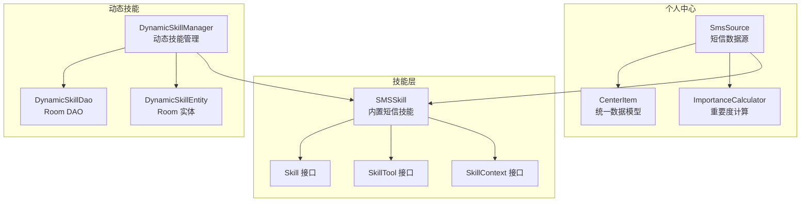
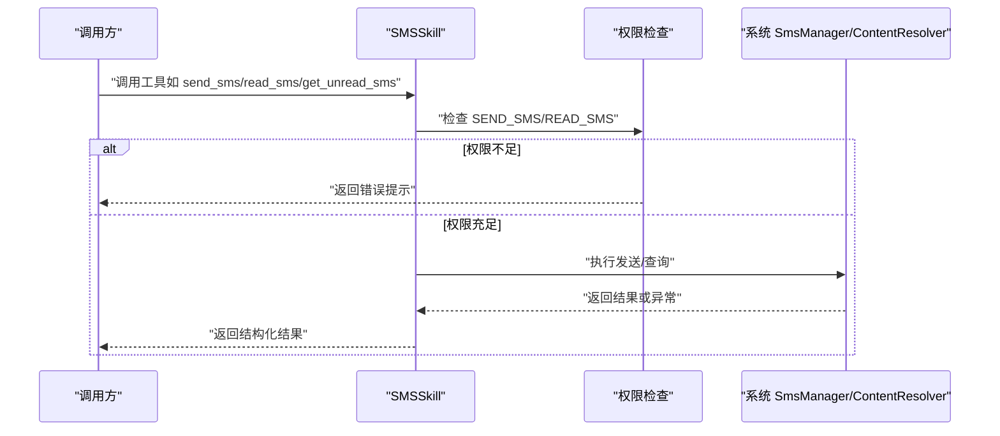
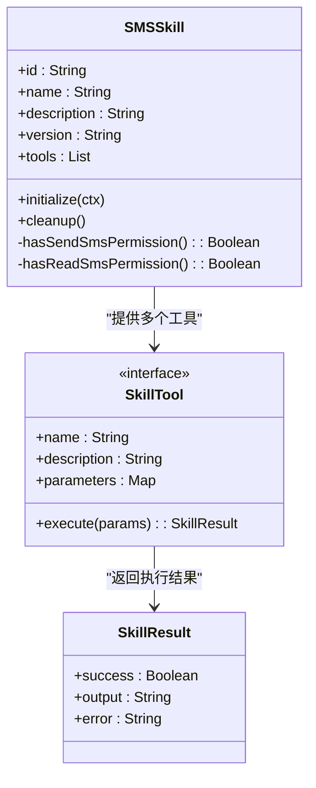
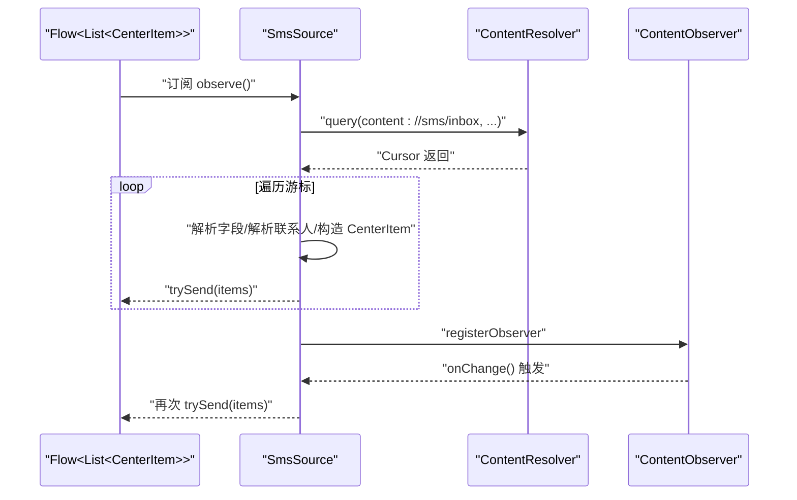
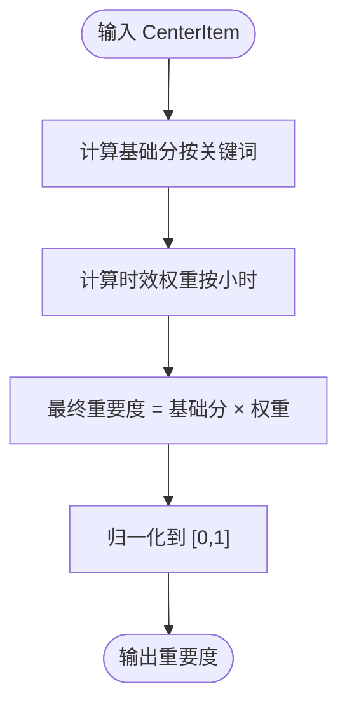
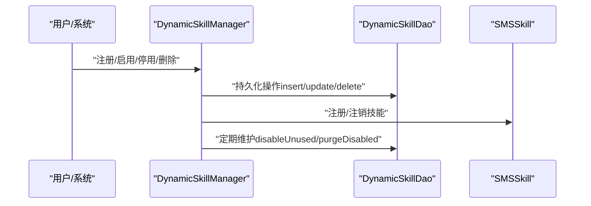
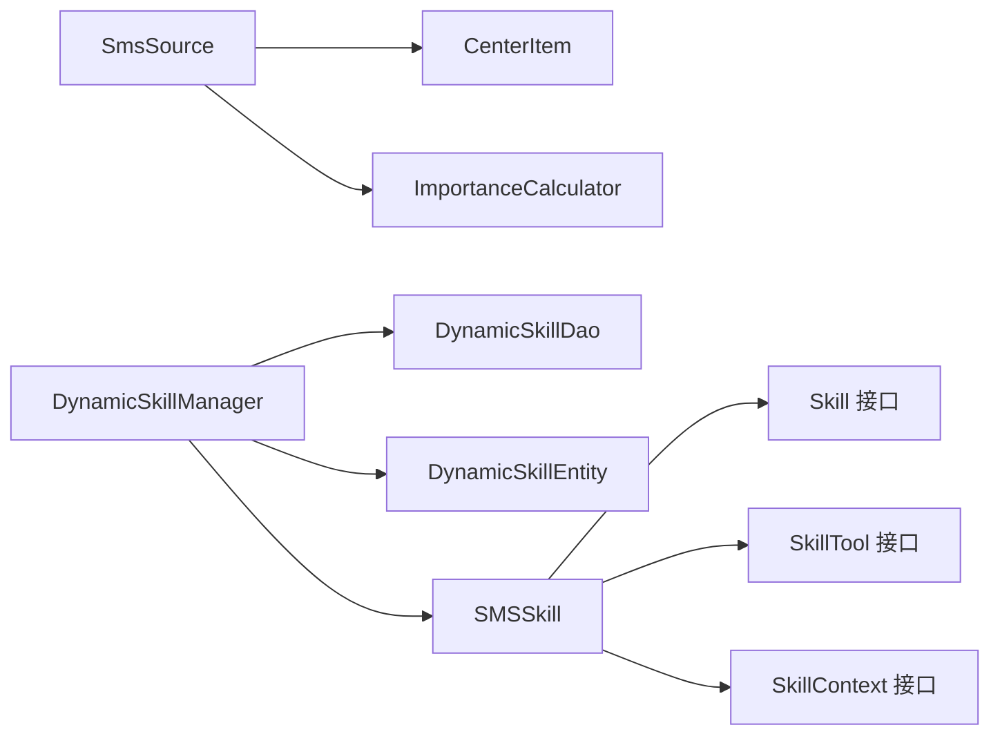

# 短信技能

<cite>
**本文引用的文件**
- [SMSSkill.kt](file://app/src/main/java/ai/openclaw/android/skill/builtin/SMSSkill.kt)
- [SmsSource.kt](file://app/src/main/java/ai/openclaw/android/personalcenter/sources/SmsSource.kt)
- [Skill.kt](file://app/src/main/java/ai/openclaw/android/skill/Skill.kt)
- [SkillTool.kt](file://app/src/main/java/ai/openclaw/android/skill/SkillTool.kt)
- [SkillContext.kt](file://app/src/main/java/ai/openclaw/android/skill/SkillContext.kt)
- [DynamicSkillDao.kt](file://app/src/main/java/ai/openclaw/android/data/local/DynamicSkillDao.kt)
- [DynamicSkillEntity.kt](file://app/src/main/java/ai/openclaw/android/data/model/DynamicSkillEntity.kt)
- [CenterItem.kt](file://app/src/main/java/ai/openclaw/android/personalcenter/models/CenterItem.kt)
- [ImportanceCalculator.kt](file://app/src/main/java/ai/openclaw/android/personalcenter/ImportanceCalculator.kt)
- [DynamicSkillManager.kt](file://app/src/main/java/ai/openclaw/android/skill/DynamicSkillManager.kt)
</cite>

## 目录
1. [简介](#简介)
2. [项目结构](#项目结构)
3. [核心组件](#核心组件)
4. [架构总览](#架构总览)
5. [详细组件分析](#详细组件分析)
6. [依赖关系分析](#依赖关系分析)
7. [性能考量](#性能考量)
8. [故障排查指南](#故障排查指南)
9. [结论](#结论)
10. [附录](#附录)

## 简介
本文件面向“短信技能”的技术实现与使用，覆盖以下能力：
- 短信发送：基于系统 SmsManager 的文本短信发送
- 短信接收：读取收件箱短信，支持限制数量与发件人过滤
- 未读短信查询：统计收件箱未读数量
- 权限管理：运行时检查 SEND_SMS 与 READ_SMS 权限
- 消息格式处理：统一输出为结构化文本，包含发件人、正文片段与时间
- 发送状态跟踪：返回成功/失败与错误信息
- 数据库与持久化：动态技能的启用/停用、使用时间记录与清理策略
- 个人中心集成：短信流式观察、去重与重要度计算
- 安全与合规：权限校验、异常捕获与日志记录

## 项目结构
短信技能位于技能体系的内置技能模块，同时与个人中心的数据源、重要度计算以及动态技能管理协同工作。

图表来源
- [SMSSkill.kt:15-185](file://app/src/main/java/ai/openclaw/android/skill/builtin/SMSSkill.kt#L15-L185)
- [Skill.kt:3-13](file://app/src/main/java/ai/openclaw/android/skill/Skill.kt#L3-L13)
- [SkillTool.kt:3-22](file://app/src/main/java/ai/openclaw/android/skill/SkillTool.kt#L3-L22)
- [SkillContext.kt:6-10](file://app/src/main/java/ai/openclaw/android/skill/SkillContext.kt#L6-L10)
- [SmsSource.kt:22-137](file://app/src/main/java/ai/openclaw/android/personalcenter/sources/SmsSource.kt#L22-L137)
- [CenterItem.kt:10-24](file://app/src/main/java/ai/openclaw/android/personalcenter/models/CenterItem.kt#L10-L24)
- [ImportanceCalculator.kt:10-110](file://app/src/main/java/ai/openclaw/android/personalcenter/ImportanceCalculator.kt#L10-L110)
- [DynamicSkillManager.kt:22-202](file://app/src/main/java/ai/openclaw/android/skill/DynamicSkillManager.kt#L22-L202)
- [DynamicSkillDao.kt:7-47](file://app/src/main/java/ai/openclaw/android/data/local/DynamicSkillDao.kt#L7-L47)
- [DynamicSkillEntity.kt:6-22](file://app/src/main/java/ai/openclaw/android/data/model/DynamicSkillEntity.kt#L6-L22)

章节来源
- [SMSSkill.kt:15-185](file://app/src/main/java/ai/openclaw/android/skill/builtin/SMSSkill.kt#L15-L185)
- [SmsSource.kt:22-137](file://app/src/main/java/ai/openclaw/android/personalcenter/sources/SmsSource.kt#L22-L137)
- [DynamicSkillManager.kt:22-202](file://app/src/main/java/ai/openclaw/android/skill/DynamicSkillManager.kt#L22-L202)

## 核心组件
- SMSSkill：实现短信发送、读取与未读统计三大工具，封装权限检查与内容查询。
- SmsSource：将短信内容转换为个人中心统一模型，并提供内容观察与联系人名称解析。
- ImportanceCalculator：对短信项按关键词与时效进行重要度评分。
- DynamicSkillManager：动态技能生命周期管理，含启用/停用、使用时间记录与清理策略。
- Skill/SkillTool/SkillContext：技能框架接口，定义工具参数、执行结果与上下文能力。

章节来源
- [SMSSkill.kt:15-185](file://app/src/main/java/ai/openclaw/android/skill/builtin/SMSSkill.kt#L15-L185)
- [SmsSource.kt:22-137](file://app/src/main/java/ai/openclaw/android/personalcenter/sources/SmsSource.kt#L22-L137)
- [ImportanceCalculator.kt:10-110](file://app/src/main/java/ai/openclaw/android/personalcenter/ImportanceCalculator.kt#L10-L110)
- [DynamicSkillManager.kt:22-202](file://app/src/main/java/ai/openclaw/android/skill/DynamicSkillManager.kt#L22-L202)
- [Skill.kt:3-13](file://app/src/main/java/ai/openclaw/android/skill/Skill.kt#L3-L13)
- [SkillTool.kt:3-22](file://app/src/main/java/ai/openclaw/android/skill/SkillTool.kt#L3-L22)
- [SkillContext.kt:6-10](file://app/src/main/java/ai/openclaw/android/skill/SkillContext.kt#L6-L10)

## 架构总览
短信技能在系统层面通过 Android 平台 API 完成短信收发；在应用层面通过技能框架抽象出工具化接口，并与个人中心、动态技能管理协同，形成“查询—展示—交互—治理”的闭环。

图表来源
- [SMSSkill.kt:44-62](file://app/src/main/java/ai/openclaw/android/skill/builtin/SMSSkill.kt#L44-L62)
- [SMSSkill.kt:74-95](file://app/src/main/java/ai/openclaw/android/skill/builtin/SMSSkill.kt#L74-L95)
- [SMSSkill.kt:140-151](file://app/src/main/java/ai/openclaw/android/skill/builtin/SMSSkill.kt#L140-L151)

## 详细组件分析

### 组件 A：SMSSkill（短信技能）
- 职责
  - 提供 send_sms、read_sms、get_unread_sms 三个工具
  - 统一参数校验、权限检查与异常处理
  - 使用系统 API 进行短信发送与内容查询
- 工具实现要点
  - send_sms：校验手机号与短信内容，检查 SEND_SMS 权限，调用系统 SmsManager 发送
  - read_sms：校验 READ_SMS 权限，查询 content://sms/inbox，支持 limit 与 from 过滤
  - get_unread_sms：校验 READ_SMS 权限，统计 read=0 的记录数
- 输出格式
  - 成功返回结构化文本，包含概要信息；失败返回错误信息
- 权限与异常
  - 通过 ContextCompat 检查权限；捕获异常并返回错误信息

图表来源
- [SMSSkill.kt:15-185](file://app/src/main/java/ai/openclaw/android/skill/builtin/SMSSkill.kt#L15-L185)
- [SkillTool.kt:3-22](file://app/src/main/java/ai/openclaw/android/skill/SkillTool.kt#L3-L22)

章节来源
- [SMSSkill.kt:15-185](file://app/src/main/java/ai/openclaw/android/skill/builtin/SMSSkill.kt#L15-L185)

### 组件 B：SmsSource（短信数据源）
- 职责
  - 将短信内容转换为个人中心统一模型 CenterItem
  - 提供 Flow<List<CenterItem>> 流式观察，自动推送新增/变更
  - 解析联系人名称，生成打开短信对话的 PendingIntent
- 查询与过滤
  - 查询最近 7 天的短信，按时间倒序
  - 过滤空正文，避免无效项
- 异常与权限
  - 无权限时返回空集合并记录日志
  - 查询异常被捕获并记录日志

图表来源
- [SmsSource.kt:26-116](file://app/src/main/java/ai/openclaw/android/personalcenter/sources/SmsSource.kt#L26-L116)

章节来源
- [SmsSource.kt:22-137](file://app/src/main/java/ai/openclaw/android/personalcenter/sources/SmsSource.kt#L22-L137)

### 组件 C：ImportanceCalculator（重要度计算）
- 职责
  - 对短信项按关键词与时效计算重要度分数
  - 采用基础分 × 时效权重的方式
- 关键词库
  - 短信重要关键词涵盖验证码、银行、快递、支付、密码等
- 时效权重
  - 新内容权重更高，随小时衰减

图表来源
- [ImportanceCalculator.kt:41-74](file://app/src/main/java/ai/openclaw/android/personalcenter/ImportanceCalculator.kt#L41-L74)

章节来源
- [ImportanceCalculator.kt:10-110](file://app/src/main/java/ai/openclaw/android/personalcenter/ImportanceCalculator.kt#L10-L110)

### 组件 D：动态技能管理（DynamicSkillManager）
- 职责
  - 注册/加载动态技能（JSON），持久化至 Room
  - 记录技能使用时间，30 天未使用自动停用，90 天已停用彻底删除
  - 支持手动启用/停用/删除
- 与短信技能的关系
  - 可将 SMSSkill 作为动态技能注册，纳入统一生命周期管理

图表来源
- [DynamicSkillManager.kt:63-96](file://app/src/main/java/ai/openclaw/android/skill/DynamicSkillManager.kt#L63-L96)
- [DynamicSkillManager.kt:122-147](file://app/src/main/java/ai/openclaw/android/skill/DynamicSkillManager.kt#L122-L147)
- [DynamicSkillDao.kt:7-47](file://app/src/main/java/ai/openclaw/android/data/local/DynamicSkillDao.kt#L7-L47)

章节来源
- [DynamicSkillManager.kt:22-202](file://app/src/main/java/ai/openclaw/android/skill/DynamicSkillManager.kt#L22-L202)
- [DynamicSkillDao.kt:7-47](file://app/src/main/java/ai/openclaw/android/data/local/DynamicSkillDao.kt#L7-L47)
- [DynamicSkillEntity.kt:6-22](file://app/src/main/java/ai/openclaw/android/data/model/DynamicSkillEntity.kt#L6-L22)

## 依赖关系分析
- 技能框架
  - SMSSkill 实现 Skill 接口，提供多个 SkillTool
  - SkillTool 定义参数与执行结果，SkillContext 提供应用上下文与日志能力
- 数据与存储
  - DynamicSkillManager 依赖 DynamicSkillDao 与 DynamicSkillEntity 进行持久化
- 个人中心
  - SmsSource 依赖 ContentResolver 查询短信，转换为 CenterItem
  - ImportanceCalculator 用于统一评分

图表来源
- [SMSSkill.kt:15-185](file://app/src/main/java/ai/openclaw/android/skill/builtin/SMSSkill.kt#L15-L185)
- [Skill.kt:3-13](file://app/src/main/java/ai/openclaw/android/skill/Skill.kt#L3-L13)
- [SkillTool.kt:3-22](file://app/src/main/java/ai/openclaw/android/skill/SkillTool.kt#L3-L22)
- [SkillContext.kt:6-10](file://app/src/main/java/ai/openclaw/android/skill/SkillContext.kt#L6-L10)
- [SmsSource.kt:22-137](file://app/src/main/java/ai/openclaw/android/personalcenter/sources/SmsSource.kt#L22-L137)
- [CenterItem.kt:10-24](file://app/src/main/java/ai/openclaw/android/personalcenter/models/CenterItem.kt#L10-L24)
- [ImportanceCalculator.kt:10-110](file://app/src/main/java/ai/openclaw/android/personalcenter/ImportanceCalculator.kt#L10-L110)
- [DynamicSkillManager.kt:22-202](file://app/src/main/java/ai/openclaw/android/skill/DynamicSkillManager.kt#L22-L202)
- [DynamicSkillDao.kt:7-47](file://app/src/main/java/ai/openclaw/android/data/local/DynamicSkillDao.kt#L7-L47)
- [DynamicSkillEntity.kt:6-22](file://app/src/main/java/ai/openclaw/android/data/model/DynamicSkillEntity.kt#L6-L22)

章节来源
- [SMSSkill.kt:15-185](file://app/src/main/java/ai/openclaw/android/skill/builtin/SMSSkill.kt#L15-L185)
- [SmsSource.kt:22-137](file://app/src/main/java/ai/openclaw/android/personalcenter/sources/SmsSource.kt#L22-L137)
- [DynamicSkillManager.kt:22-202](file://app/src/main/java/ai/openclaw/android/skill/DynamicSkillManager.kt#L22-L202)

## 性能考量
- 查询优化
  - read_sms 使用 LIMIT 控制返回数量，默认 100 条，避免一次性加载过多数据
  - SmsSource 限定最近 7 天，减少扫描范围
- IO 与线程
  - 动态技能管理使用 IO 协程调度器与 SupervisorJob，避免主线程阻塞
- 内存与资源
  - 游标查询后及时关闭，避免内存泄漏
  - 重要度计算为纯函数，避免额外状态持有

## 故障排查指南
- 权限问题
  - 症状：工具返回“需要权限”
  - 排查：确认应用具备 SEND_SMS/READ_SMS 权限；在设备设置中检查权限状态
- 查询异常
  - 症状：读取失败或未读统计异常
  - 排查：检查 content://sms/inbox 是否可用；确认未安装第三方短信管理器导致冲突
- 发送失败
  - 症状：发送失败并返回错误信息
  - 排查：检查手机号格式、短信内容长度、运营商限制与系统短信应用状态
- 个人中心无数据
  - 症状：短信未出现在个人中心
  - 排查：确认 READ_SMS 权限；检查是否出现空正文被过滤；查看日志中“无权限”或“查询失败”

章节来源
- [SMSSkill.kt:44-62](file://app/src/main/java/ai/openclaw/android/skill/builtin/SMSSkill.kt#L44-L62)
- [SMSSkill.kt:74-95](file://app/src/main/java/ai/openclaw/android/skill/builtin/SMSSkill.kt#L74-L95)
- [SMSSkill.kt:140-151](file://app/src/main/java/ai/openclaw/android/skill/builtin/SMSSkill.kt#L140-L151)
- [SmsSource.kt:91-98](file://app/src/main/java/ai/openclaw/android/personalcenter/sources/SmsSource.kt#L91-L98)

## 结论
短信技能以简洁稳定的接口实现了短信发送、接收与未读统计，并通过权限检查与异常处理保障安全性与可靠性。结合个人中心的数据源与重要度计算，短信内容可被统一展示与智能排序。动态技能管理进一步完善了技能的生命周期治理，便于后续扩展与维护。

## 附录

### 使用示例（路径指引）
- 发送短信
  - 工具名称：send_sms
  - 必填参数：phone_number、message
  - 参考路径：[SMSSkill.kt:36-63](file://app/src/main/java/ai/openclaw/android/skill/builtin/SMSSkill.kt#L36-L63)
- 读取短信
  - 工具名称：read_sms
  - 可选参数：limit（默认 100）、from（发件人号码筛选）
  - 参考路径：[SMSSkill.kt:66-132](file://app/src/main/java/ai/openclaw/android/skill/builtin/SMSSkill.kt#L66-L132)
- 未读短信
  - 工具名称：get_unread_sms
  - 参考路径：[SMSSkill.kt:134-165](file://app/src/main/java/ai/openclaw/android/skill/builtin/SMSSkill.kt#L134-L165)

### 安全注意事项
- 权限声明与运行时申请：确保在清单与运行时均完成权限申请
- 输入校验：对手机号与短信内容进行必要校验，避免注入与超长内容
- 日志与隐私：避免在日志中打印敏感信息（如完整短信内容）
- 异常隔离：工具内部捕获异常并返回结构化错误信息，避免崩溃传播