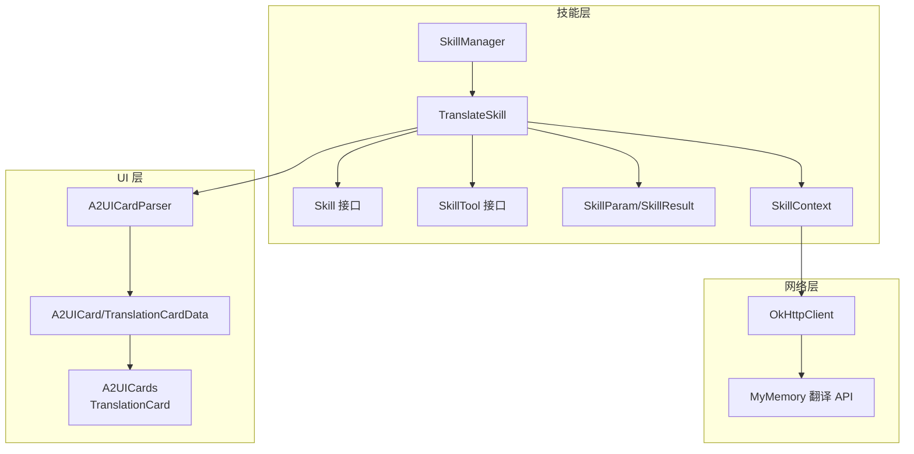
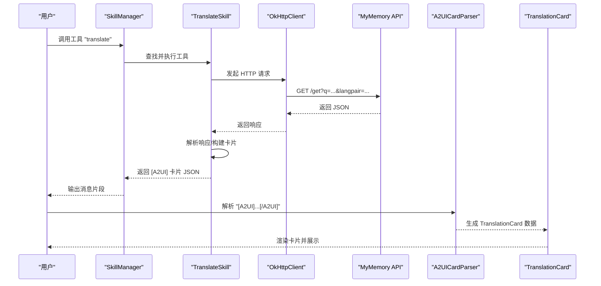
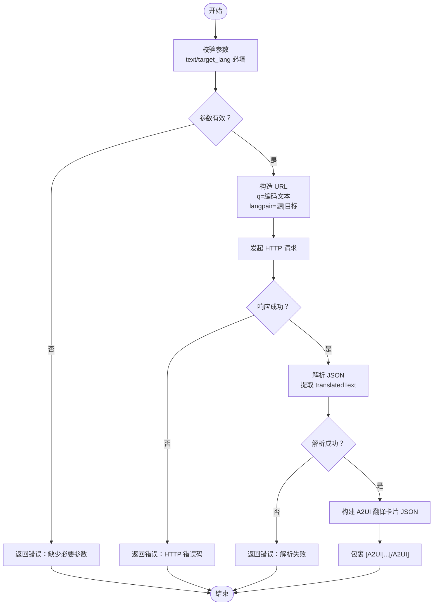
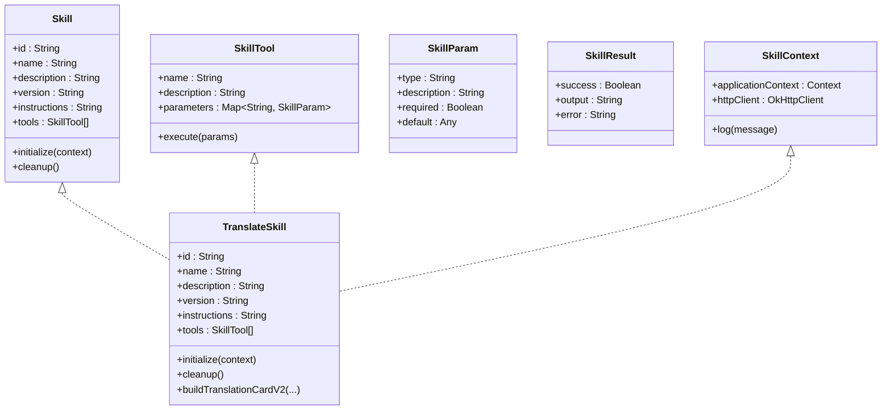

# 翻译技能

<cite>
**本文引用的文件**
- [TranslateSkill.kt](file://app/src/main/java/ai/openclaw/android/skill/builtin/TranslateSkill.kt)
- [Skill.kt](file://app/src/main/java/ai/openclaw/android/skill/Skill.kt)
- [SkillTool.kt](file://app/src/main/java/ai/openclaw/android/skill/SkillTool.kt)
- [SkillContext.kt](file://app/src/main/java/ai/openclaw/android/skill/SkillContext.kt)
- [SkillManager.kt](file://app/src/main/java/ai/openclaw/android/skill/SkillManager.kt)
- [A2UICards.kt](file://app/src/main/java/ai/openclaw/android/ui/A2UICards.kt)
- [A2UICardModels.kt](file://app/src/main/java/ai/openclaw/android/ui/A2UICardModels.kt)
- [TranslateSkillV2Test.kt](file://app/src/test/java/ai/openclaw/android/skill/builtin/TranslateSkillV2Test.kt)
</cite>

## 目录
1. [简介](#简介)
2. [项目结构](#项目结构)
3. [核心组件](#核心组件)
4. [架构总览](#架构总览)
5. [详细组件分析](#详细组件分析)
6. [依赖关系分析](#依赖关系分析)
7. [性能考量](#性能考量)
8. [故障排查指南](#故障排查指南)
9. [结论](#结论)
10. [附录](#附录)

## 简介
本文件面向“翻译技能”的技术文档，系统阐述其在 OpenClaw Android 应用中的实现机制与使用方式。内容涵盖：
- 翻译功能的实现机制：语言自动检测与多语言支持策略
- 工具参数配置与输入校验
- 翻译质量与格式保持策略
- 翻译 API 集成与错误处理机制
- 翻译结果的 A2UI 卡片构建与用户体验优化
- 使用场景与配置示例

## 项目结构
翻译技能位于技能体系中，采用“内置技能”形式注册与执行；其输出以 A2UI 卡片协议承载，由 UI 层渲染为可交互卡片。

图表来源
- [SkillManager.kt:13-33](file://app/src/main/java/ai/openclaw/android/skill/SkillManager.kt#L13-L33)
- [TranslateSkill.kt:11-108](file://app/src/main/java/ai/openclaw/android/skill/builtin/TranslateSkill.kt#L11-L108)
- [Skill.kt:3-12](file://app/src/main/java/ai/openclaw/android/skill/Skill.kt#L3-L12)
- [SkillTool.kt:3-22](file://app/src/main/java/ai/openclaw/android/skill/SkillTool.kt#L3-L22)
- [SkillContext.kt:6-9](file://app/src/main/java/ai/openclaw/android/skill/SkillContext.kt#L6-L9)
- [A2UICardModels.kt:83-140](file://app/src/main/java/ai/openclaw/android/ui/A2UICardModels.kt#L83-L140)
- [A2UICards.kt:442-535](file://app/src/main/java/ai/openclaw/android/ui/A2UICards.kt#L442-L535)

章节来源
- [SkillManager.kt:13-33](file://app/src/main/java/ai/openclaw/android/skill/SkillManager.kt#L13-L33)
- [TranslateSkill.kt:11-108](file://app/src/main/java/ai/openclaw/android/skill/builtin/TranslateSkill.kt#L11-L108)

## 核心组件
- 技能接口与工具接口
  - Skill：定义技能标识、名称、描述、版本、工具集合及生命周期方法
  - SkillTool：定义工具名称、描述、参数定义与异步执行方法
  - SkillParam/SkillResult：参数类型、必填与默认值，以及执行结果封装
- 上下文接口
  - SkillContext：提供应用上下文、HTTP 客户端与日志能力
- 翻译技能实现
  - TranslateSkill：实现翻译工具，对接 MyMemory API，构建 A2UI 翻译卡片
- UI 协议与渲染
  - A2UICard/A2UICardParser：统一卡片协议与解析器
  - TranslationCard/TranslationCardData：翻译卡片 UI 组件与数据模型

章节来源
- [Skill.kt:3-12](file://app/src/main/java/ai/openclaw/android/skill/Skill.kt#L3-L12)
- [SkillTool.kt:3-22](file://app/src/main/java/ai/openclaw/android/skill/SkillTool.kt#L3-L22)
- [SkillContext.kt:6-9](file://app/src/main/java/ai/openclaw/android/skill/SkillContext.kt#L6-L9)
- [TranslateSkill.kt:11-159](file://app/src/main/java/ai/openclaw/android/skill/builtin/TranslateSkill.kt#L11-L159)
- [A2UICardModels.kt:83-140](file://app/src/main/java/ai/openclaw/android/ui/A2UICardModels.kt#L83-L140)
- [A2UICards.kt:442-535](file://app/src/main/java/ai/openclaw/android/ui/A2UICards.kt#L442-L535)

## 架构总览
翻译技能的调用链路如下：

图表来源
- [SkillManager.kt:62-83](file://app/src/main/java/ai/openclaw/android/skill/SkillManager.kt#L62-L83)
- [TranslateSkill.kt:44-83](file://app/src/main/java/ai/openclaw/android/skill/builtin/TranslateSkill.kt#L44-L83)
- [A2UICardModels.kt:541-599](file://app/src/main/java/ai/openclaw/android/ui/A2UICardModels.kt#L541-L599)
- [A2UICards.kt:442-535](file://app/src/main/java/ai/openclaw/android/ui/A2UICards.kt#L442-L535)

## 详细组件分析

### 翻译工具参数与执行流程
- 工具名称与描述
  - 名称："translate"
  - 描述："翻译文本到目标语言"
- 参数定义
  - text：string，必填，待翻译文本
  - target_lang：string，必填，目标语言代码（如 zh、en、ja、ko）
  - source_lang：string，可选，默认 "auto"，源语言代码（支持自动检测）
- 执行逻辑要点
  - 输入校验：text 与 target_lang 缺一不可；source_lang 可省略，默认 "auto"
  - URL 构造：q=编码后的文本，langpair=源语言|目标语言
  - 响应解析：从 JSON 中提取 translatedText 字段，进行必要的转义还原
  - 成功时：构建 v2 A2UI 翻译卡片 JSON 并包裹 "[A2UI]...[/A2UI]"
  - 失败时：返回错误信息（HTTP 错误码、空响应、解析失败、异常）

图表来源
- [TranslateSkill.kt:44-102](file://app/src/main/java/ai/openclaw/android/skill/builtin/TranslateSkill.kt#L44-L102)

章节来源
- [TranslateSkill.kt:34-104](file://app/src/main/java/ai/openclaw/android/skill/builtin/TranslateSkill.kt#L34-L104)

### 语言自动检测与多语言支持
- 自动检测
  - source_lang 默认 "auto"，通过 langpair=auto|target_lang 的形式交由 MyMemory API 处理
- 常见语言代码
  - zh（中文）、en（英文）、ja（日语）、ko（韩语）、fr（法语）、de（德语）
- 语言对组合
  - 支持双向或多语言组合，具体可用性取决于 MyMemory API 的覆盖范围

章节来源
- [TranslateSkill.kt:17-30](file://app/src/main/java/ai/openclaw/android/skill/builtin/TranslateSkill.kt#L17-L30)
- [TranslateSkill.kt:52-54](file://app/src/main/java/ai/openclaw/android/skill/builtin/TranslateSkill.kt#L52-L54)

### 翻译质量与格式保持策略
- 文本转义还原
  - 对响应中的换行符、引号与反斜杠进行还原，确保显示正确
- 卡片字段设计
  - sourceText/sourceLang/targetText/targetLang 为核心字段
  - pronunciation 可选，用于音标等附加信息
- 卡片动作
  - 朗读（speak_target）
  - 复制（copy_translation）
- UI 展示
  - 原文区域与译文区域分隔，箭头指示方向
  - 支持音标展示与最大行数限制，避免溢出

章节来源
- [TranslateSkill.kt:85-102](file://app/src/main/java/ai/openclaw/android/skill/builtin/TranslateSkill.kt#L85-L102)
- [TranslateSkill.kt:114-157](file://app/src/main/java/ai/openclaw/android/skill/builtin/TranslateSkill.kt#L114-L157)
- [A2UICards.kt:442-535](file://app/src/main/java/ai/openclaw/android/ui/A2UICards.kt#L442-L535)

### 翻译 API 集成与错误处理
- API 选择
  - MyMemory 翻译 API（免费，无需密钥）
- 请求与响应
  - 使用 OkHttp 发送 GET 请求，解析 JSON 中的 translatedText 字段
- 错误分类
  - 参数缺失、HTTP 失败、响应为空、JSON 解析失败、运行时异常
- 处理策略
  - 统一包装为 SkillResult，包含 success、output、error 字段
  - UI 层通过 A2UICardParser 解析卡片或回退文本

章节来源
- [TranslateSkill.kt:58-82](file://app/src/main/java/ai/openclaw/android/skill/builtin/TranslateSkill.kt#L58-L82)
- [A2UICardModels.kt:541-599](file://app/src/main/java/ai/openclaw/android/ui/A2UICardModels.kt#L541-L599)

### A2UI 卡片构建与用户体验优化
- 协议与解析
  - v2 协议：{"type":"translation","data":{...},"actions": [...]}
  - 解析器支持 v2 JSON 与旧版回退
- 卡片渲染
  - TranslationCard 以科幻风格卡片呈现，包含源语言→目标语言标题、原文与译文区域、操作按钮
- 用户体验
  - 一键朗读与复制，提升交互效率
  - 最大行数与省略处理，保证卡片整洁

章节来源
- [A2UICardModels.kt:83-140](file://app/src/main/java/ai/openclaw/android/ui/A2UICardModels.kt#L83-L140)
- [A2UICards.kt:442-535](file://app/src/main/java/ai/openclaw/android/ui/A2UICards.kt#L442-L535)

### 技能注册与调用
- 注册
  - SkillManager 在初始化时注册 TranslateSkill 等内置技能
- 调用
  - 通过工具名 "translate" 触发；SkillManager 解析工具归属技能与工具，执行并返回结果
- 权限
  - 翻译技能不涉及系统敏感权限

章节来源
- [SkillManager.kt:13-33](file://app/src/main/java/ai/openclaw/android/skill/SkillManager.kt#L13-L33)
- [SkillManager.kt:62-83](file://app/src/main/java/ai/openclaw/android/skill/SkillManager.kt#L62-L83)

## 依赖关系分析
- 组件耦合
  - TranslateSkill 依赖 Skill 接口、SkillTool 接口、SkillContext 提供的 OkHttpClient
  - UI 层通过 A2UICardParser 与 A2UICards 解耦卡片渲染
- 外部依赖
  - OkHttp 作为 HTTP 客户端
  - MyMemory API 作为翻译服务
- 可能的循环依赖
  - 未发现直接循环依赖；各模块职责清晰

图表来源
- [Skill.kt:3-12](file://app/src/main/java/ai/openclaw/android/skill/Skill.kt#L3-L12)
- [SkillTool.kt:3-22](file://app/src/main/java/ai/openclaw/android/skill/SkillTool.kt#L3-L22)
- [SkillContext.kt:6-9](file://app/src/main/java/ai/openclaw/android/skill/SkillContext.kt#L6-L9)
- [TranslateSkill.kt:11-159](file://app/src/main/java/ai/openclaw/android/skill/builtin/TranslateSkill.kt#L11-L159)

## 性能考量
- 网络请求
  - 使用单次同步请求获取翻译结果，避免频繁连接开销
- JSON 解析
  - 采用字符串切片与转义还原，避免引入重型解析库
- UI 渲染
  - 卡片内文本设置最大行数与省略，减少布局计算复杂度
- 建议
  - 对高频查询可考虑本地缓存（当前实现未包含缓存逻辑）

## 故障排查指南
- 常见问题与定位
  - 缺少参数：检查 text 与 target_lang 是否传入
  - HTTP 错误：查看响应状态码，确认网络连通与 API 可用性
  - 空响应：确认请求 URL 正确与编码无误
  - 解析失败：确认返回 JSON 结构符合预期
  - 异常：捕获并记录异常信息，便于定位
- 测试验证
  - 单元测试覆盖 v2 卡片结构、数据字段、动作按钮与 JSON 合法性

章节来源
- [TranslateSkill.kt:44-82](file://app/src/main/java/ai/openclaw/android/skill/builtin/TranslateSkill.kt#L44-L82)
- [TranslateSkillV2Test.kt:18-150](file://app/src/test/java/ai/openclaw/android/skill/builtin/TranslateSkillV2Test.kt#L18-L150)

## 结论
翻译技能通过简洁的参数设计与稳定的 API 集成，实现了跨语言文本转换，并以 A2UI 卡片协议提供一致的渲染与交互体验。其错误处理与格式保持策略确保了在不同语言与设备上的可靠性。后续可在缓存与离线能力方面进一步增强。

## 附录

### 使用场景与配置示例
- 场景
  - 用户请求将一段文本翻译为目标语言
  - 支持自动检测源语言，常见语言包括中文、英文、日语、韩语、法语、德语
- 工具调用
  - 工具名："translate"
  - 参数：
    - text：待翻译文本
    - target_lang：目标语言代码
    - source_lang：可选，缺省为 "auto"
- 输出
  - 成功：返回 "[A2UI]...[/A2UI]" 包裹的 v2 翻译卡片 JSON
  - 失败：返回错误信息

章节来源
- [TranslateSkill.kt:17-30](file://app/src/main/java/ai/openclaw/android/skill/builtin/TranslateSkill.kt#L17-L30)
- [TranslateSkill.kt:34-54](file://app/src/main/java/ai/openclaw/android/skill/builtin/TranslateSkill.kt#L34-L54)