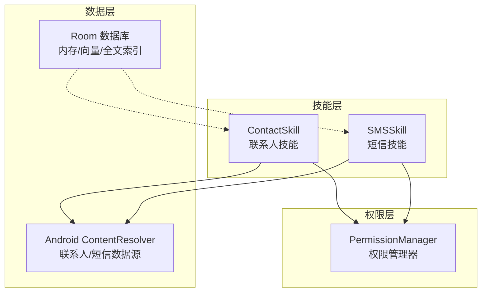
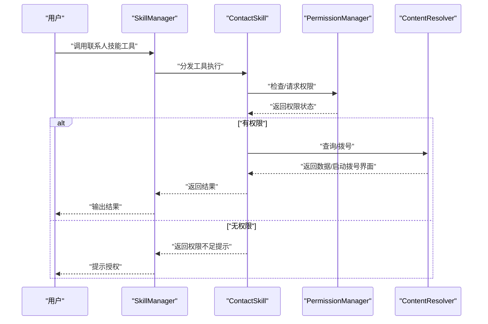
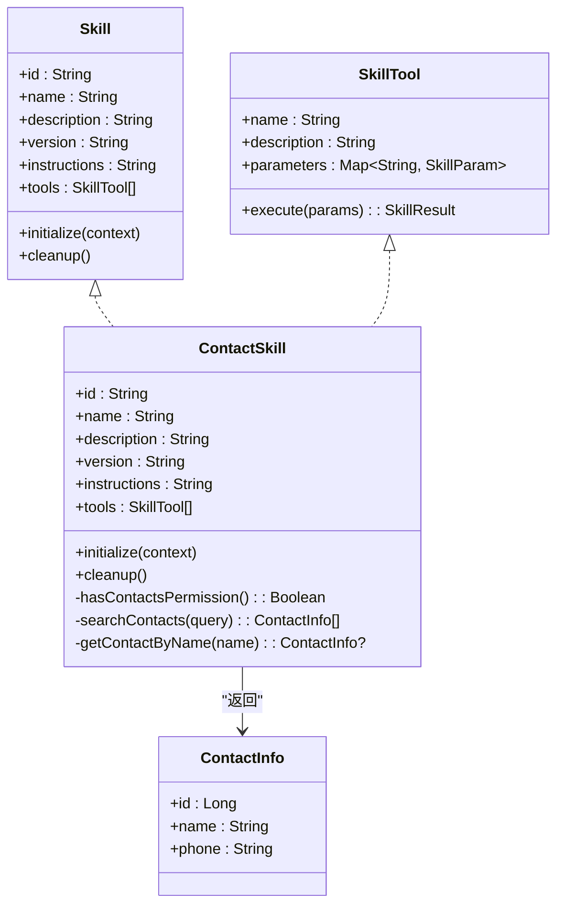
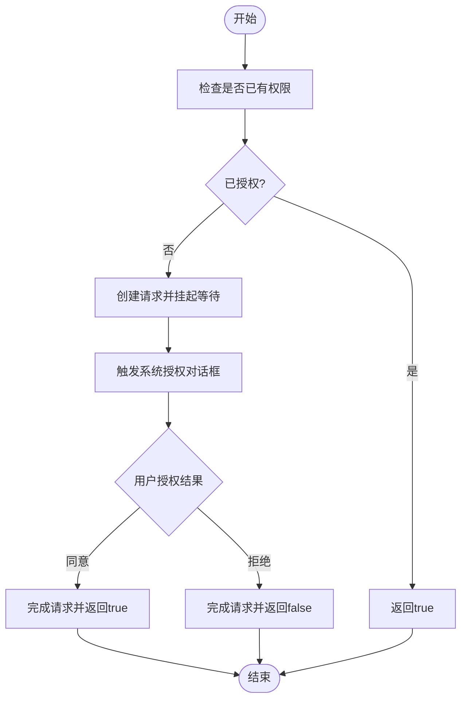
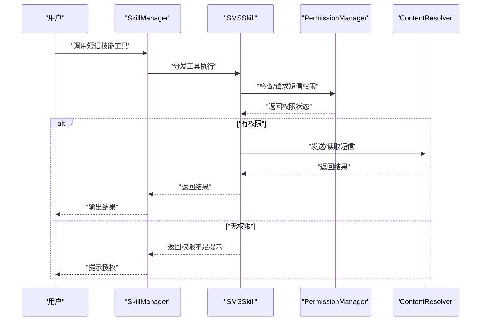
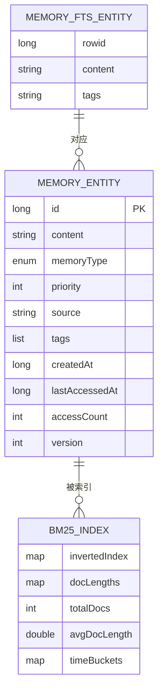
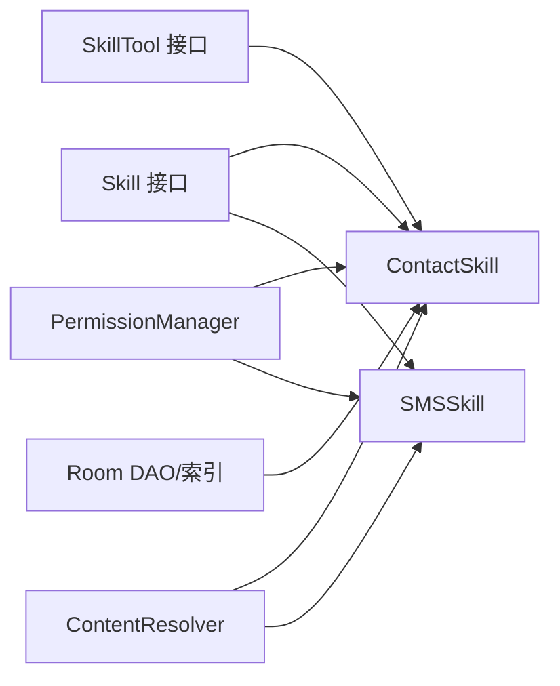

# 联系人技能

<cite>
**本文引用的文件**
- [ContactSkill.kt](file://app/src/main/java/ai/openclaw/android/skill/builtin/ContactSkill.kt)
- [PermissionManager.kt](file://app/src/main/java/ai/openclaw/android/permission/PermissionManager.kt)
- [Skill.kt](file://app/src/main/java/ai/openclaw/android/skill/Skill.kt)
- [SkillTool.kt](file://app/src/main/java/ai/openclaw/android/skill/SkillTool.kt)
- [SMSSkill.kt](file://app/src/main/java/ai/openclaw/android/skill/builtin/SMSSkill.kt)
- [MemoryEntity.kt](file://app/src/main/java/ai/openclaw/android/data/model/MemoryEntity.kt)
- [BM25Index.kt](file://app/src/main/java/ai/openclaw/android/data/local/BM25Index.kt)
- [MemoryFtsEntity.kt](file://app/src/main/java/ai/openclaw/android/data/model/MemoryFtsEntity.kt)
- [MemoryFtsDao.kt](file://app/src/main/java/ai/openclaw/android/data/local/MemoryFtsDao.kt)
</cite>

## 目录
1. [简介](#简介)
2. [项目结构](#项目结构)
3. [核心组件](#核心组件)
4. [架构总览](#架构总览)
5. [详细组件分析](#详细组件分析)
6. [依赖关系分析](#依赖关系分析)
7. [性能考量](#性能考量)
8. [故障排查指南](#故障排查指南)
9. [结论](#结论)
10. [附录](#附录)

## 简介
本技术文档围绕“联系人技能”展开，系统性介绍联系人查询、添加与编辑能力，以及权限处理、数据同步机制、联系人数据模型与搜索索引、电话拨打与信息发送等关键功能。文档同时提供使用示例与权限配置指导，帮助开发者快速集成与扩展。

## 项目结构
联系人技能位于内置技能模块中，遵循统一的技能接口规范；权限管理由独立的权限管理器负责；联系人数据访问通过Android原生ContentProvider进行；短信能力作为对比参考，展示相似的权限与数据访问模式。

**图表来源**
- [ContactSkill.kt:13-243](file://app/src/main/java/ai/openclaw/android/skill/builtin/ContactSkill.kt#L13-L243)
- [SMSSkill.kt:15-185](file://app/src/main/java/ai/openclaw/android/skill/builtin/SMSSkill.kt#L15-L185)
- [PermissionManager.kt:32-189](file://app/src/main/java/ai/openclaw/android/permission/PermissionManager.kt#L32-L189)

**章节来源**
- [ContactSkill.kt:1-243](file://app/src/main/java/ai/openclaw/android/skill/builtin/ContactSkill.kt#L1-L243)
- [SMSSkill.kt:1-185](file://app/src/main/java/ai/openclaw/android/skill/builtin/SMSSkill.kt#L1-L185)
- [PermissionManager.kt:1-189](file://app/src/main/java/ai/openclaw/android/permission/PermissionManager.kt#L1-L189)

## 核心组件
- 技能接口与工具抽象：定义技能与工具的标准结构、参数与结果格式，确保不同技能的一致性与可组合性。
- 联系人技能：提供联系人查询、详情获取、拨打电话等工具，封装权限检查与数据访问。
- 权限管理器：集中管理各技能所需的权限组状态、请求流程与特殊权限处理。
- 短信技能：作为权限与数据访问的对照样例，便于理解联系人技能的权限与数据流差异。
- 内存与索引：为后续联系人数据的检索与融合提供基础，包含BM25倒排索引与FTS虚拟表支持。

**章节来源**
- [Skill.kt:3-13](file://app/src/main/java/ai/openclaw/android/skill/Skill.kt#L3-L13)
- [SkillTool.kt:3-22](file://app/src/main/java/ai/openclaw/android/skill/SkillTool.kt#L3-L22)
- [ContactSkill.kt:13-243](file://app/src/main/java/ai/openclaw/android/skill/builtin/ContactSkill.kt#L13-L243)
- [PermissionManager.kt:32-189](file://app/src/main/java/ai/openclaw/android/permission/PermissionManager.kt#L32-L189)
- [SMSSkill.kt:15-185](file://app/src/main/java/ai/openclaw/android/skill/builtin/SMSSkill.kt#L15-L185)
- [MemoryEntity.kt:6-18](file://app/src/main/java/ai/openclaw/android/data/model/MemoryEntity.kt#L6-L18)
- [BM25Index.kt:14-203](file://app/src/main/java/ai/openclaw/android/data/local/BM25Index.kt#L14-L203)
- [MemoryFtsEntity.kt:9-13](file://app/src/main/java/ai/openclaw/android/data/model/MemoryFtsEntity.kt#L9-L13)
- [MemoryFtsDao.kt:8-12](file://app/src/main/java/ai/openclaw/android/data/local/MemoryFtsDao.kt#L8-L12)

## 架构总览
联系人技能通过ContentResolver访问系统联系人数据，结合权限管理器进行权限校验；短信技能采用类似的数据访问与权限模式，便于横向对比与一致性设计。内存与索引模块为未来联系人数据的检索与融合提供支撑。

**图表来源**
- [ContactSkill.kt:39-60](file://app/src/main/java/ai/openclaw/android/skill/builtin/ContactSkill.kt#L39-L60)
- [PermissionManager.kt:41-70](file://app/src/main/java/ai/openclaw/android/permission/PermissionManager.kt#L41-L70)

## 详细组件分析

### 联系人技能 ContactSkill
- 技能标识与描述：唯一id、名称、描述、版本与工具说明。
- 工具集合：
  - 查询联系人：按姓名或号码模糊匹配，限制返回数量，避免重复。
  - 获取联系人详情：按姓名精确匹配，返回联系人基本信息。
  - 拨打电话：支持直接拨号或通过联系人姓名查找号码后拨号。
- 权限处理：统一检查读取联系人权限，未授权时返回明确提示。
- 数据访问：通过ContentResolver访问系统联系人Provider，使用游标遍历与投影字段提取。

**图表来源**
- [Skill.kt:3-13](file://app/src/main/java/ai/openclaw/android/skill/Skill.kt#L3-L13)
- [SkillTool.kt:3-22](file://app/src/main/java/ai/openclaw/android/skill/SkillTool.kt#L3-L22)
- [ContactSkill.kt:13-243](file://app/src/main/java/ai/openclaw/android/skill/builtin/ContactSkill.kt#L13-L243)

**章节来源**
- [ContactSkill.kt:13-243](file://app/src/main/java/ai/openclaw/android/skill/builtin/ContactSkill.kt#L13-L243)

### 权限管理器 PermissionManager
- 统一权限请求：以协程挂起的方式等待用户授权结果，通过状态流暴露当前请求。
- 权限组状态：提供位置、通讯录、短信、日程、存储等权限组的当前状态与显示名。
- 特殊权限处理：针对“所有文件访问”等特殊权限提供专门检测逻辑。
- 技能权限映射：根据技能id返回所需权限数组，便于在技能初始化阶段统一授权。

**图表来源**
- [PermissionManager.kt:41-70](file://app/src/main/java/ai/openclaw/android/permission/PermissionManager.kt#L41-L70)

**章节来源**
- [PermissionManager.kt:32-189](file://app/src/main/java/ai/openclaw/android/permission/PermissionManager.kt#L32-L189)

### 短信技能 SMSSkill（对比参考）
- 工具集合：发送短信、读取最近短信、获取未读短信数。
- 权限处理：分别检查发送与读取短信权限。
- 数据访问：通过短信Content URI读取与发送短信。

**图表来源**
- [SMSSkill.kt:44-62](file://app/src/main/java/ai/openclaw/android/skill/builtin/SMSSkill.kt#L44-L62)
- [PermissionManager.kt:41-70](file://app/src/main/java/ai/openclaw/android/permission/PermissionManager.kt#L41-L70)

**章节来源**
- [SMSSkill.kt:15-185](file://app/src/main/java/ai/openclaw/android/skill/builtin/SMSSkill.kt#L15-L185)

### 内存与搜索索引（为联系人数据检索提供基础）
- 内存实体：记录内容、类型、优先级、来源、标签、时间戳等元数据。
- BM25倒排索引：支持中文（双字符）+英文词元的分词、TF-IDF归一化、时间桶过滤与批量重建。
- FTS虚拟表：通过Room原生支持的原生SQL查询接口对接全文检索结果。

**图表来源**
- [MemoryEntity.kt:6-18](file://app/src/main/java/ai/openclaw/android/data/model/MemoryEntity.kt#L6-L18)
- [MemoryFtsEntity.kt:9-13](file://app/src/main/java/ai/openclaw/android/data/model/MemoryFtsEntity.kt#L9-L13)
- [BM25Index.kt:14-203](file://app/src/main/java/ai/openclaw/android/data/local/BM25Index.kt#L14-L203)

**章节来源**
- [MemoryEntity.kt:6-18](file://app/src/main/java/ai/openclaw/android/data/model/MemoryEntity.kt#L6-L18)
- [BM25Index.kt:14-203](file://app/src/main/java/ai/openclaw/android/data/local/BM25Index.kt#L14-L203)
- [MemoryFtsEntity.kt:9-13](file://app/src/main/java/ai/openclaw/android/data/model/MemoryFtsEntity.kt#L9-L13)
- [MemoryFtsDao.kt:8-12](file://app/src/main/java/ai/openclaw/android/data/local/MemoryFtsDao.kt#L8-L12)

## 依赖关系分析
- 联系人技能依赖技能接口与工具抽象，实现统一的工具执行模型。
- 权限管理器为技能提供一致的授权体验，避免在各技能中重复实现授权逻辑。
- 数据访问层通过ContentResolver与数据库DAO协作，支撑联系人与内存数据的读写与检索。
- 短信技能与联系人技能共享类似的权限与数据访问模式，便于复用与维护。

**图表来源**
- [Skill.kt:3-13](file://app/src/main/java/ai/openclaw/android/skill/Skill.kt#L3-L13)
- [SkillTool.kt:3-22](file://app/src/main/java/ai/openclaw/android/skill/SkillTool.kt#L3-L22)
- [ContactSkill.kt:13-243](file://app/src/main/java/ai/openclaw/android/skill/builtin/ContactSkill.kt#L13-L243)
- [SMSSkill.kt:15-185](file://app/src/main/java/ai/openclaw/android/skill/builtin/SMSSkill.kt#L15-L185)
- [PermissionManager.kt:32-189](file://app/src/main/java/ai/openclaw/android/permission/PermissionManager.kt#L32-L189)

**章节来源**
- [Skill.kt:3-13](file://app/src/main/java/ai/openclaw/android/skill/Skill.kt#L3-L13)
- [SkillTool.kt:3-22](file://app/src/main/java/ai/openclaw/android/skill/SkillTool.kt#L3-L22)
- [ContactSkill.kt:13-243](file://app/src/main/java/ai/openclaw/android/skill/builtin/ContactSkill.kt#L13-L243)
- [SMSSkill.kt:15-185](file://app/src/main/java/ai/openclaw/android/skill/builtin/SMSSkill.kt#L15-L185)
- [PermissionManager.kt:32-189](file://app/src/main/java/ai/openclaw/android/permission/PermissionManager.kt#L32-L189)

## 性能考量
- 查询性能：联系人查询使用模糊匹配与游标遍历，建议限制返回条数并避免重复项；对于大量联系人的场景，可考虑引入分页或缓存策略。
- 权限检查：在执行敏感操作前进行权限检查，减少异常开销；对特殊权限（如“所有文件访问”）采用专用检测路径。
- 索引与检索：BM25索引支持时间范围过滤与批量重建，适合在应用启动或数据变更后进行索引重建；FTS虚拟表提供高效的全文检索能力。

[本节为通用性能建议，不直接分析具体文件]

## 故障排查指南
- 权限不足：当返回“需要通讯录权限”或“需要发送短信权限”时，请确认已在运行时请求授权并通过权限管理器完成授权流程。
- 查询无结果：检查输入的关键字是否为空，确认联系人数据是否存在；对于模糊查询，建议尝试更精确的姓名或号码。
- 拨号失败：确认目标号码有效且设备具备通话能力；若通过联系人姓名查找号码，请先确保已授权读取联系人权限。
- 短信发送失败：检查短信权限与网络状态；确保短信内容与号码格式正确。

**章节来源**
- [ContactSkill.kt:40-45](file://app/src/main/java/ai/openclaw/android/skill/builtin/ContactSkill.kt#L40-L45)
- [SMSSkill.kt:51-53](file://app/src/main/java/ai/openclaw/android/skill/builtin/SMSSkill.kt#L51-L53)

## 结论
联系人技能通过标准化的技能接口与工具抽象，实现了联系人查询、详情获取与拨号的核心能力，并与权限管理器协同保障授权流程的一致性与安全性。配合内存与索引模块，为未来的联系人数据检索与融合提供了坚实基础。短信技能作为对比参考，展示了相似的权限与数据访问模式，便于整体架构的一致性维护。

[本节为总结性内容，不直接分析具体文件]

## 附录

### 使用示例与权限配置指导
- 查询联系人
  - 工具：search_contacts
  - 参数：query（字符串，必填）
  - 步骤：确保已授权“通讯录”权限；调用工具并传入查询关键字；查看返回的联系人列表摘要。
- 获取联系人详情
  - 工具：get_contact
  - 参数：name（字符串，必填）
  - 步骤：确保已授权“通讯录”权限；调用工具并传入联系人姓名；查看返回的联系人详情。
- 拨打电话
  - 工具：call_contact
  - 参数：phone_number（字符串，可选）或 contact_name（字符串，可选，二选一）
  - 步骤：若仅提供联系人姓名，需先授权“通讯录”权限；调用工具后系统将打开拨号界面。
- 权限配置
  - 通讯录权限：READ_CONTACTS
  - 短信权限：SEND_SMS、READ_SMS
  - 配置方式：在技能初始化时通过权限管理器请求授权；对于特殊权限（如“所有文件访问”），需引导用户至系统设置页面。

**章节来源**
- [ContactSkill.kt:30-228](file://app/src/main/java/ai/openclaw/android/skill/builtin/ContactSkill.kt#L30-L228)
- [SMSSkill.kt:34-165](file://app/src/main/java/ai/openclaw/android/skill/builtin/SMSSkill.kt#L34-L165)
- [PermissionManager.kt:155-187](file://app/src/main/java/ai/openclaw/android/permission/PermissionManager.kt#L155-L187)