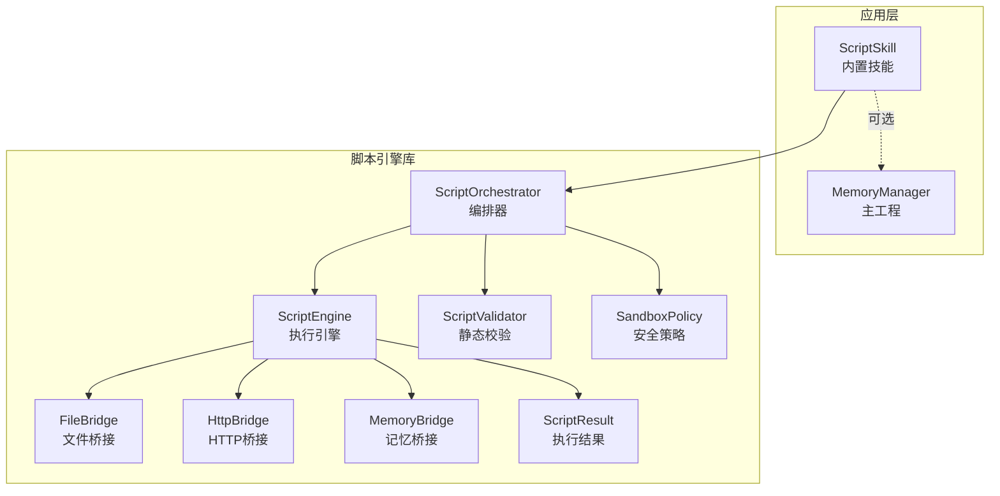
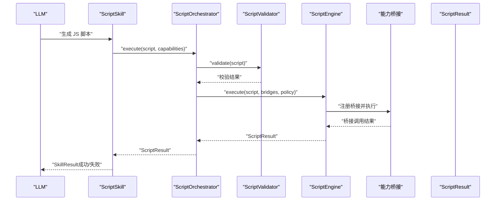
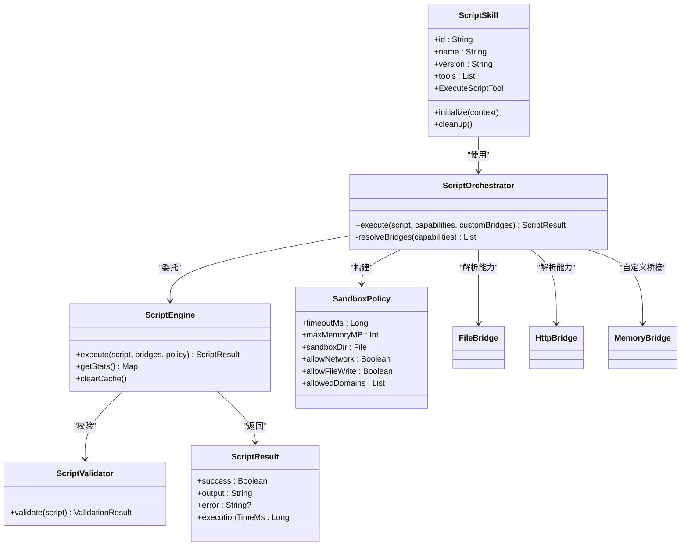
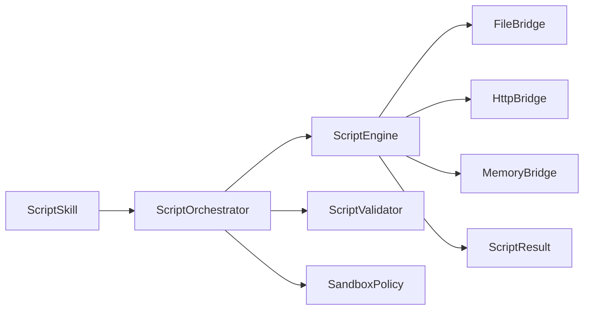

# 脚本技能

<cite>
**本文引用的文件**
- [ScriptSkill.kt](file://app/src/main/java/ai/openclaw/android/skill/builtin/ScriptSkill.kt)
- [ScriptOrchestrator.kt](file://script/src/main/java/ai/openclaw/script/ScriptOrchestrator.kt)
- [ScriptEngine.kt](file://script/src/main/java/ai/openclaw/script/ScriptEngine.kt)
- [ScriptValidator.kt](file://script/src/main/java/ai/openclaw/script/ScriptValidator.kt)
- [SandboxPolicy.kt](file://script/src/main/java/ai/openclaw/script/SandboxPolicy.kt)
- [ScriptResult.kt](file://script/src/main/java/ai/openclaw/script/ScriptResult.kt)
- [FileBridge.kt](file://script/src/main/java/ai/openclaw/script/bridge/FileBridge.kt)
- [HttpBridge.kt](file://script/src/main/java/ai/openclaw/script/bridge/HttpBridge.kt)
- [MemoryBridge.kt](file://script/src/main/java/ai/openclaw/script/bridge/MemoryBridge.kt)
- [weather.js](file://app/src/main/assets/scripts/weather.js)
- [ScriptSkillQuickJsTest.kt](file://app/src/test/java/ai/openclaw/android/skill/builtin/ScriptSkillQuickJsTest.kt)
- [ScriptSkillMemoryTest.kt](file://app/src/test/java/ai/openclaw/android/skill/builtin/ScriptSkillMemoryTest.kt)
- [SandboxPolicyTest.kt](file://script/src/test/java/ai/openclaw/script/SandboxPolicyTest.kt)
- [script-engine.md](file://docs/script-engine.md)
- [design-weather-script-sandbox.md](file://docs/design-weather-script-sandbox.md)
</cite>

## 目录
1. [简介](#简介)
2. [项目结构](#项目结构)
3. [核心组件](#核心组件)
4. [架构总览](#架构总览)
5. [详细组件分析](#详细组件分析)
6. [依赖关系分析](#依赖关系分析)
7. [性能考量](#性能考量)
8. [故障排查指南](#故障排查指南)
9. [结论](#结论)
10. [附录](#附录)

## 简介
本技术文档围绕“脚本技能”展开，系统阐述动态脚本执行功能的实现方式，涵盖脚本引擎集成、沙箱安全机制、参数传递、结果处理与错误捕获、权限控制与资源限制、安全策略与审计日志建议，以及使用示例与最佳实践。该能力由内置技能 ScriptSkill 提供，底层通过 ScriptOrchestrator 与 ScriptEngine 驱动，配合多种 CapabilityBridge（文件、HTTP、记忆等）实现能力扩展，并以 ScriptValidator 与 SandboxPolicy 构建静态与运行时双重安全防线。

## 项目结构
脚本技能相关代码主要分布在两个模块：
- 应用层内置技能模块：提供 Skill 接口实现与工具参数定义，负责与主工程的 MemoryManager 等组件对接。
- 脚本引擎库模块：提供脚本编排、执行引擎、安全策略与能力桥接。

图示来源
- [ScriptSkill.kt:1-134](file://app/src/main/java/ai/openclaw/android/skill/builtin/ScriptSkill.kt#L1-L134)
- [ScriptOrchestrator.kt:1-55](file://script/src/main/java/ai/openclaw/script/ScriptOrchestrator.kt#L1-L55)
- [ScriptEngine.kt:1-231](file://script/src/main/java/ai/openclaw/script/ScriptEngine.kt#L1-L231)
- [ScriptValidator.kt:1-60](file://script/src/main/java/ai/openclaw/script/ScriptValidator.kt#L1-L60)
- [SandboxPolicy.kt:1-16](file://script/src/main/java/ai/openclaw/script/SandboxPolicy.kt#L1-L16)
- [FileBridge.kt:1-157](file://script/src/main/java/ai/openclaw/script/bridge/FileBridge.kt#L1-L157)
- [HttpBridge.kt:1-88](file://script/src/main/java/ai/openclaw/script/bridge/HttpBridge.kt#L1-L88)
- [MemoryBridge.kt:1-55](file://script/src/main/java/ai/openclaw/script/bridge/MemoryBridge.kt#L1-L55)
- [ScriptResult.kt:1-20](file://script/src/main/java/ai/openclaw/script/ScriptResult.kt#L1-L20)

章节来源
- [ScriptSkill.kt:1-134](file://app/src/main/java/ai/openclaw/android/skill/builtin/ScriptSkill.kt#L1-L134)
- [ScriptOrchestrator.kt:1-55](file://script/src/main/java/ai/openclaw/script/ScriptOrchestrator.kt#L1-L55)
- [script-engine.md:1-315](file://docs/script-engine.md#L1-L315)

## 核心组件
- ScriptSkill：实现 Skill 接口，提供 execute_script 工具，负责参数解析、能力选择与结果封装；可选注入 MemoryManager 并通过 MemoryBridge 暴露记忆能力。
- ScriptOrchestrator：脚本执行入口，负责能力桥接解析、安全策略构建与引擎调度。
- ScriptEngine：脚本执行引擎，支持 QuickJS（正式）与 Rhino（回退），提供超时控制、执行统计与缓存。
- ScriptValidator：静态校验器，禁止危险模式与超长脚本。
- SandboxPolicy：安全策略数据类，定义超时、内存、网络与文件写入等限制。
- CapabilityBridge：能力桥接接口，具体实现包括 FileBridge、HttpBridge、MemoryBridge 等。
- ScriptResult：统一的执行结果模型，包含成功标志、输出、错误信息与耗时。

章节来源
- [ScriptSkill.kt:1-134](file://app/src/main/java/ai/openclaw/android/skill/builtin/ScriptSkill.kt#L1-L134)
- [ScriptOrchestrator.kt:1-55](file://script/src/main/java/ai/openclaw/script/ScriptOrchestrator.kt#L1-L55)
- [ScriptEngine.kt:1-231](file://script/src/main/java/ai/openclaw/script/ScriptEngine.kt#L1-L231)
- [ScriptValidator.kt:1-60](file://script/src/main/java/ai/openclaw/script/ScriptValidator.kt#L1-L60)
- [SandboxPolicy.kt:1-16](file://script/src/main/java/ai/openclaw/script/SandboxPolicy.kt#L1-L16)
- [ScriptResult.kt:1-20](file://script/src/main/java/ai/openclaw/script/ScriptResult.kt#L1-L20)

## 架构总览
脚本技能的执行流程如下：LLM 生成 JS 脚本，Skill 通过 ScriptOrchestrator 调用 ScriptEngine，在 SandboxPolicy 与 ScriptValidator 的约束下，将所需能力桥接注入 JS 环境，执行完成后返回 ScriptResult 并由 Skill 封装为 SkillResult。

图示来源
- [ScriptSkill.kt:64-87](file://app/src/main/java/ai/openclaw/android/skill/builtin/ScriptSkill.kt#L64-L87)
- [ScriptOrchestrator.kt:31-39](file://script/src/main/java/ai/openclaw/script/ScriptOrchestrator.kt#L31-L39)
- [ScriptEngine.kt:45-99](file://script/src/main/java/ai/openclaw/script/ScriptEngine.kt#L45-L99)
- [ScriptValidator.kt:42-58](file://script/src/main/java/ai/openclaw/script/ScriptValidator.kt#L42-L58)

## 详细组件分析

### ScriptSkill（内置技能）
- 职责：作为 Skill 接口实现，提供 execute_script 工具；支持延迟注入 MemoryManager 并构建 MemoryBridge；将 ScriptResult 封装为 SkillResult 返回。
- 参数：
  - script：必填，JavaScript 代码字符串。
  - capabilities：可选，逗号分隔的能力列表，默认 "fs,http"，可选 "memory"（需注入 MemoryManager）。
- 结果：成功返回输出，失败返回错误信息与耗时。
- 安全：依赖上层 Orchestrator 与引擎的安全策略；未初始化或缺少参数时返回明确错误。

章节来源
- [ScriptSkill.kt:33-87](file://app/src/main/java/ai/openclaw/android/skill/builtin/ScriptSkill.kt#L33-L87)
- [ScriptSkillQuickJsTest.kt:16-60](file://app/src/test/java/ai/openclaw/android/skill/builtin/ScriptSkillQuickJsTest.kt#L16-L60)
- [ScriptSkillMemoryTest.kt:57-90](file://app/src/test/java/ai/openclaw/android/skill/builtin/ScriptSkillMemoryTest.kt#L57-L90)

### ScriptOrchestrator（脚本编排器）
- 职责：创建沙箱目录、初始化 ScriptEngine、解析能力桥接、组装 SandboxPolicy 并委派执行。
- 能力解析：根据 capabilities 列表自动装配 FileBridge、HttpBridge；自定义桥接通过 customBridges 注入。
- 策略：默认超时 10 秒，允许网络与文件写入，沙箱目录位于应用私有存储。

章节来源
- [ScriptOrchestrator.kt:13-54](file://script/src/main/java/ai/openclaw/script/ScriptOrchestrator.kt#L13-L54)

### ScriptEngine（脚本执行引擎）
- 引擎：优先使用 QuickJS（协程友好），异常时回退至 Rhino；支持执行统计与缓存。
- 超时：基于 withTimeoutOrNull 控制单次执行时间；Rhino 使用线程池与超时控制。
- 桥接：将桥接注册为 JS 全局对象或通过 __nativeCall 分发调用。
- 统计：记录总执行次数、成功/失败次数与平均耗时；缓存成功脚本的执行耗时。

章节来源
- [ScriptEngine.kt:22-231](file://script/src/main/java/ai/openclaw/script/ScriptEngine.kt#L22-L231)

### ScriptValidator（静态校验）
- 禁止模式：import/require/eval/new Function、定时器、原型污染、Java/Android/系统对象访问等。
- 限制：脚本长度不超过 50KB；空脚本直接拒绝。
- 输出：返回校验结果与错误信息。

章节来源
- [ScriptValidator.kt:8-59](file://script/src/main/java/ai/openclaw/script/ScriptValidator.kt#L8-L59)

### SandboxPolicy（安全策略）
- 默认：超时 10 秒、最大内存 16MB、允许网络与文件写入、不限制域名。
- 可定制：可通过构造函数传入超时、内存、沙箱目录、网络开关、写入开关与允许域名列表。

章节来源
- [SandboxPolicy.kt:8-15](file://script/src/main/java/ai/openclaw/script/SandboxPolicy.kt#L8-L15)
- [SandboxPolicyTest.kt:8-22](file://script/src/test/java/ai/openclaw/script/SandboxPolicyTest.kt#L8-L22)

### 能力桥接（Bridge）

#### FileBridge（文件桥接）
- JS API：readFile、writeFile、list、exists。
- 安全：所有操作限制在沙箱目录；路径穿越检测（canonicalPath 校验）；父目录不存在时自动创建。
- 错误：路径越界、文件不存在、目录不存在等均返回结构化错误。

章节来源
- [FileBridge.kt:20-120](file://script/src/main/java/ai/openclaw/script/bridge/FileBridge.kt#L20-L120)

#### HttpBridge（HTTP 桥接）
- JS API：http.get(url)、http.post(url, body)。
- 安全：基于 OkHttp，连接与读取超时均为 10 秒；仅允许发起 HTTP 请求。
- 错误：网络异常、状态码非 200 等返回结构化错误。

章节来源
- [HttpBridge.kt:18-87](file://script/src/main/java/ai/openclaw/script/bridge/HttpBridge.kt#L18-L87)

#### MemoryBridge（记忆桥接）
- JS API：memory.recall(query, limit)、memory.store(content)。
- 实现：通过 MemoryProvider 回调注入实际能力；主工程负责实现检索与存储逻辑。
- 错误：参数缺失、空内容、内部异常均返回结构化错误。

章节来源
- [MemoryBridge.kt:14-49](file://script/src/main/java/ai/openclaw/script/bridge/MemoryBridge.kt#L14-L49)

### ScriptResult（执行结果）
- 字段：success、output、error、executionTimeMs。
- 工厂：提供 success/failure 快捷方法，便于统一构造。

章节来源
- [ScriptResult.kt:6-18](file://script/src/main/java/ai/openclaw/script/ScriptResult.kt#L6-L18)

### 类关系图（代码级）

图示来源
- [ScriptSkill.kt:19-134](file://app/src/main/java/ai/openclaw/android/skill/builtin/ScriptSkill.kt#L19-L134)
- [ScriptOrchestrator.kt:13-54](file://script/src/main/java/ai/openclaw/script/ScriptOrchestrator.kt#L13-L54)
- [ScriptEngine.kt:22-231](file://script/src/main/java/ai/openclaw/script/ScriptEngine.kt#L22-L231)
- [ScriptValidator.kt:8-59](file://script/src/main/java/ai/openclaw/script/ScriptValidator.kt#L8-L59)
- [SandboxPolicy.kt:8-15](file://script/src/main/java/ai/openclaw/script/SandboxPolicy.kt#L8-L15)
- [ScriptResult.kt:6-18](file://script/src/main/java/ai/openclaw/script/ScriptResult.kt#L6-L18)
- [FileBridge.kt:20-120](file://script/src/main/java/ai/openclaw/script/bridge/FileBridge.kt#L20-L120)
- [HttpBridge.kt:18-87](file://script/src/main/java/ai/openclaw/script/bridge/HttpBridge.kt#L18-L87)
- [MemoryBridge.kt:14-49](file://script/src/main/java/ai/openclaw/script/bridge/MemoryBridge.kt#L14-L49)

## 依赖关系分析
- 内部依赖：ScriptSkill 依赖 ScriptOrchestrator；ScriptOrchestrator 依赖 ScriptEngine、ScriptValidator、SandboxPolicy；ScriptEngine 依赖各 Bridge。
- 外部依赖：QuickJS（JNI）、OkHttp（HTTP）、Rhino（回退）、kotlinx-coroutines（异步）。
- 集成点：主工程通过 MemoryManager 注入 MemoryBridge；UiBridge 用于动态卡片渲染（见设计文档）。

图示来源
- [ScriptSkill.kt:1-134](file://app/src/main/java/ai/openclaw/android/skill/builtin/ScriptSkill.kt#L1-L134)
- [ScriptOrchestrator.kt:1-55](file://script/src/main/java/ai/openclaw/script/ScriptOrchestrator.kt#L1-L55)
- [ScriptEngine.kt:1-231](file://script/src/main/java/ai/openclaw/script/ScriptEngine.kt#L1-L231)
- [ScriptValidator.kt:1-60](file://script/src/main/java/ai/openclaw/script/ScriptValidator.kt#L1-L60)
- [SandboxPolicy.kt:1-16](file://script/src/main/java/ai/openclaw/script/SandboxPolicy.kt#L1-L16)
- [FileBridge.kt:1-157](file://script/src/main/java/ai/openclaw/script/bridge/FileBridge.kt#L1-L157)
- [HttpBridge.kt:1-88](file://script/src/main/java/ai/openclaw/script/bridge/HttpBridge.kt#L1-L88)
- [MemoryBridge.kt:1-55](file://script/src/main/java/ai/openclaw/script/bridge/MemoryBridge.kt#L1-L55)
- [ScriptResult.kt:1-20](file://script/src/main/java/ai/openclaw/script/ScriptResult.kt#L1-L20)

## 性能考量
- 引擎选择：QuickJS 作为正式引擎，相较 Rhino 具备更小体积与更高性能；异常时自动回退 Rhino。
- 执行统计：记录总执行次数、成功/失败次数与平均耗时，便于监控与优化。
- 缓存策略：对成功执行的脚本进行结果耗时缓存，减少重复执行开销。
- 资源限制：通过超时与内存上限控制脚本执行风险；文件操作限制在沙箱目录避免 IO 放大。
- 并发模型：QuickJS 使用协程与 Dispatchers.Default；Rhino 使用单线程执行器并设置超时。

章节来源
- [ScriptEngine.kt:28-118](file://script/src/main/java/ai/openclaw/script/ScriptEngine.kt#L28-L118)
- [script-engine.md:245-246](file://docs/script-engine.md#L245-L246)

## 故障排查指南
- 未初始化错误：若未调用 initialize 或未注入 MemoryManager，execute_script 会返回“未初始化”错误。
- 参数缺失：缺少 script 参数或 capabilities 格式错误会导致参数校验失败。
- 超时错误：超过 SandboxPolicy.timeoutMs 未完成执行将返回超时错误。
- 静态校验失败：包含禁止模式或脚本过长将被拒绝执行。
- 文件越界：尝试访问沙箱目录外路径会被拦截并返回错误。
- HTTP 失败：网络异常或非 200 状态码返回结构化错误。
- 记忆能力异常：recall/store 内部异常或空内容将返回错误信息。

章节来源
- [ScriptSkill.kt:72-87](file://app/src/main/java/ai/openclaw/android/skill/builtin/ScriptSkill.kt#L72-L87)
- [ScriptEngine.kt:61-98](file://script/src/main/java/ai/openclaw/script/ScriptEngine.kt#L61-L98)
- [FileBridge.kt:82-119](file://script/src/main/java/ai/openclaw/script/bridge/FileBridge.kt#L82-L119)
- [HttpBridge.kt:66-86](file://script/src/main/java/ai/openclaw/script/bridge/HttpBridge.kt#L66-L86)
- [ScriptSkillQuickJsTest.kt:43-60](file://app/src/test/java/ai/openclaw/android/skill/builtin/ScriptSkillQuickJsTest.kt#L43-L60)
- [ScriptSkillMemoryTest.kt:58-81](file://app/src/test/java/ai/openclaw/android/skill/builtin/ScriptSkillMemoryTest.kt#L58-L81)

## 结论
脚本技能通过“内置技能 + 脚本引擎库”的分层设计，实现了灵活、安全且可扩展的动态脚本执行能力。ScriptSkill 提供统一的工具接口与参数规范，ScriptOrchestrator 负责编排与安全策略落地，ScriptEngine 保障执行效率与稳定性，多类 Bridge 将 Android 能力以最小暴露面注入 JS 环境。整体方案兼顾易用性与安全性，适合在主工程中推广使用。

## 附录

### 使用示例与最佳实践
- 示例：天气查询脚本（通过 http 桥接调用外部服务）
  - 脚本位置：assets/scripts/weather.js
  - 调用方式：在脚本中注入全局变量 LOCATION，通过 http.get 发起请求并返回 JSON
  - 参考文档：[design-weather-script-sandbox.md:21-26](file://docs/design-weather-script-sandbox.md#L21-L26)

- 最佳实践
  - 严格限定 capabilities：仅启用必要的能力，避免过度授权。
  - 使用沙箱目录：文件读写限制在沙箱内，防止越权访问。
  - 控制脚本大小与复杂度：遵循 50KB 限制，避免长时间运行脚本。
  - 参数校验：在调用前对 script 与 capabilities 进行必要校验。
  - 错误处理：统一捕获 ScriptResult 的 error 字段并转换为 SkillResult。
  - 安全审计：建议在主工程中记录脚本执行日志（输入摘要、输出摘要、耗时、错误码），便于审计与追踪。

章节来源
- [weather.js:1-16](file://app/src/main/assets/scripts/weather.js#L1-L16)
- [design-weather-script-sandbox.md:1-41](file://docs/design-weather-script-sandbox.md#L1-L41)
- [script-engine.md:169-203](file://docs/script-engine.md#L169-L203)