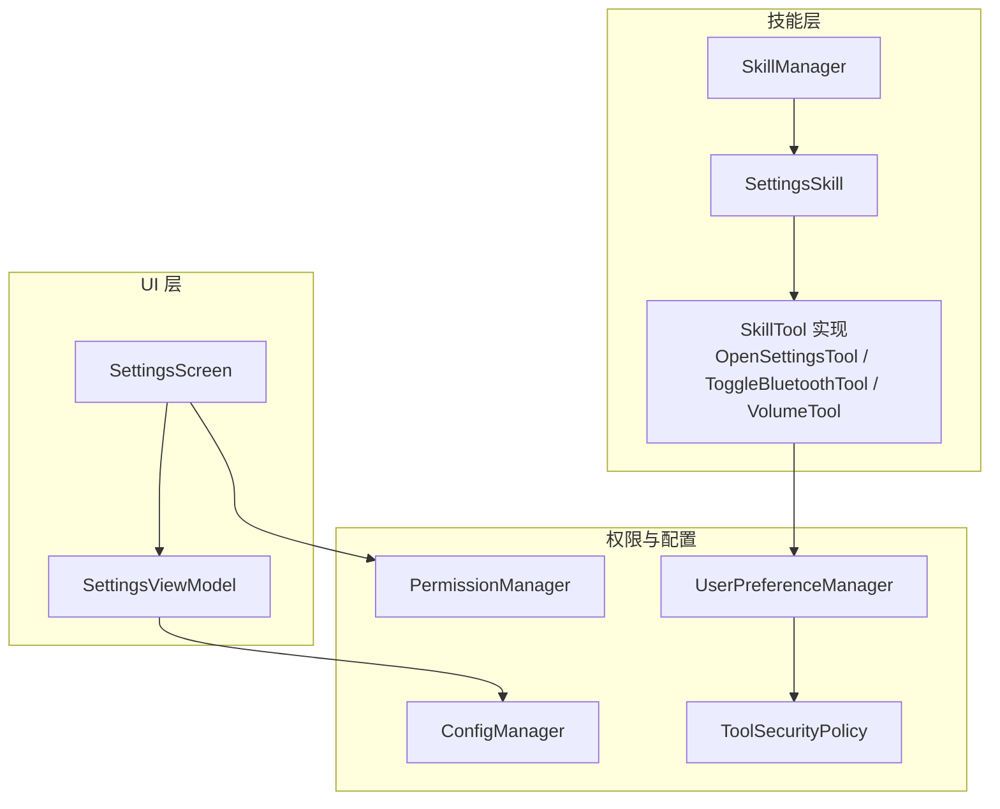
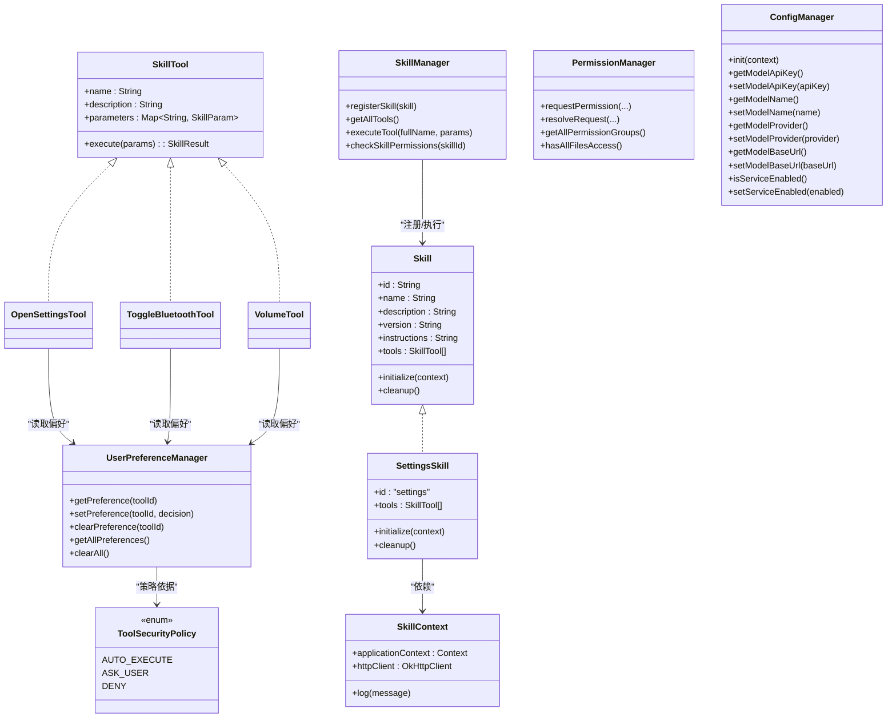
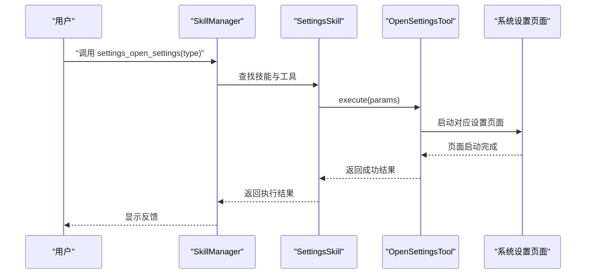
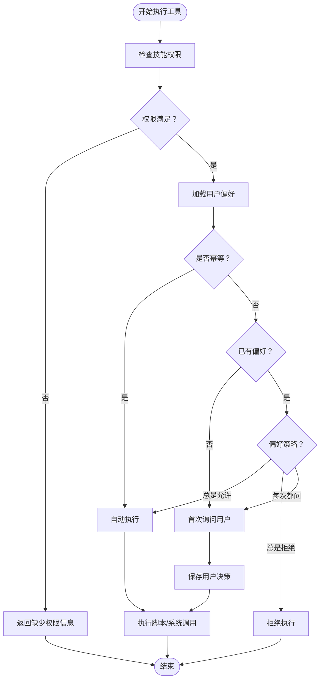
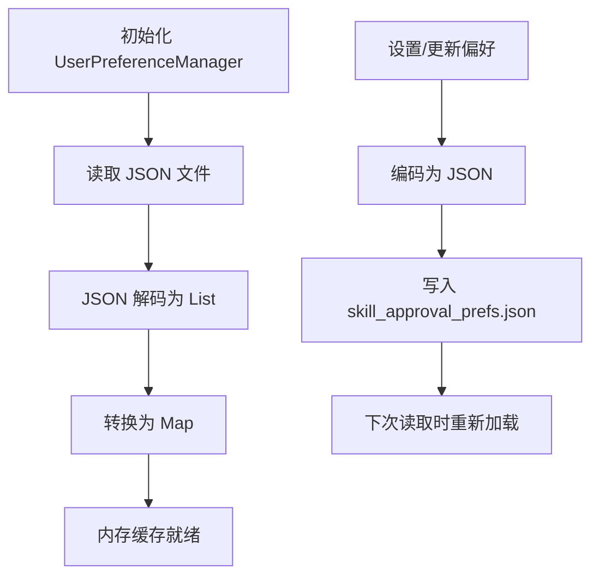
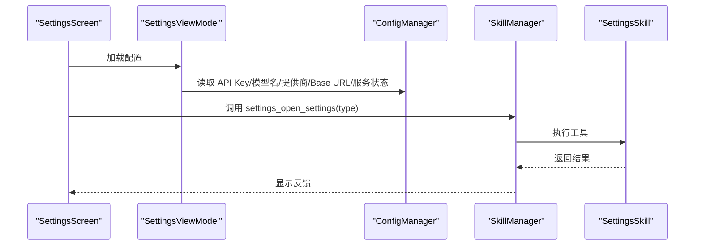
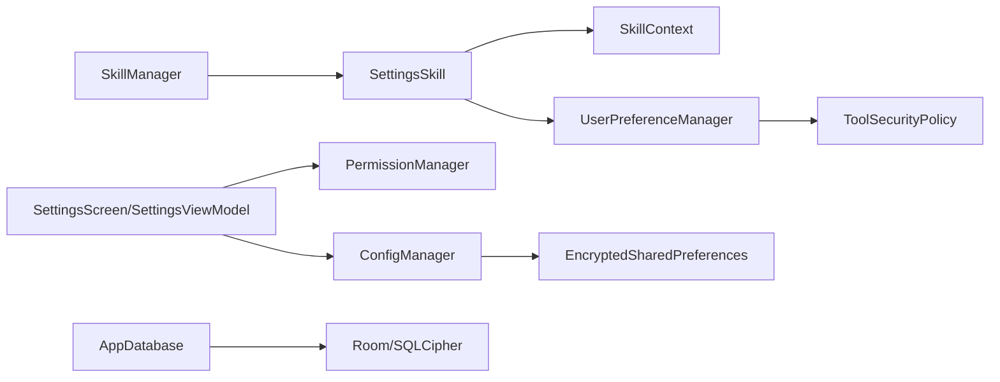

# 设置技能

<cite>
**本文档引用的文件**
- [SettingsSkill.kt](file://app/src/main/java/ai/openclaw/android/skill/builtin/SettingsSkill.kt)
- [UserPreferenceManager.kt](file://app/src/main/java/ai/openclaw/android/skill/UserPreferenceManager.kt)
- [ToolSecurityPolicy.kt](file://app/src/main/java/ai/openclaw/android/skill/ToolSecurityPolicy.kt)
- [Skill.kt](file://app/src/main/java/ai/openclaw/android/skill/Skill.kt)
- [SkillTool.kt](file://app/src/main/java/ai/openclaw/android/skill/SkillTool.kt)
- [SkillContext.kt](file://app/src/main/java/ai/openclaw/android/skill/SkillContext.kt)
- [SkillManager.kt](file://app/src/main/java/ai/openclaw/android/skill/SkillManager.kt)
- [SettingsScreen.kt](file://app/src/main/java/ai/openclaw/android/ui/SettingsScreen.kt)
- [SettingsViewModel.kt](file://app/src/main/java/ai/openclaw/android/viewmodel/SettingsViewModel.kt)
- [ConfigManager.kt](file://app/src/main/java/ai/openclaw/android/ConfigManager.kt)
- [PermissionManager.kt](file://app/src/main/java/ai/openclaw/android/permission/PermissionManager.kt)
- [AppDatabase.kt](file://app/src/main/java/ai/openclaw/android/data/local/AppDatabase.kt)
</cite>

## 目录
1. [简介](#简介)
2. [项目结构](#项目结构)
3. [核心组件](#核心组件)
4. [架构总览](#架构总览)
5. [详细组件分析](#详细组件分析)
6. [依赖关系分析](#依赖关系分析)
7. [性能考虑](#性能考虑)
8. [故障排查指南](#故障排查指南)
9. [结论](#结论)
10. [附录](#附录)

## 简介
本文件面向“设置技能”的技术文档，系统性阐述系统设置访问功能的实现方式与扩展能力。内容涵盖：
- 设置项读取与修改流程
- 设置权限管理与安全控制
- 设置数据的序列化与持久化
- 设置技能的使用示例与配置指导
- 与 UI 层、权限层、配置层的集成关系

## 项目结构
设置技能位于技能体系中，作为内置技能之一，与其他技能共享统一的接口与生命周期管理；同时与 UI 层、权限层、配置层协同工作。

**图表来源**
- [SkillManager.kt:13-33](file://app/src/main/java/ai/openclaw/android/skill/SkillManager.kt#L13-L33)
- [SettingsSkill.kt:14-41](file://app/src/main/java/ai/openclaw/android/skill/builtin/SettingsSkill.kt#L14-L41)
- [SettingsScreen.kt:41-62](file://app/src/main/java/ai/openclaw/android/ui/SettingsScreen.kt#L41-L62)
- [SettingsViewModel.kt:16-81](file://app/src/main/java/ai/openclaw/android/viewmodel/SettingsViewModel.kt#L16-L81)
- [PermissionManager.kt:32-113](file://app/src/main/java/ai/openclaw/android/permission/PermissionManager.kt#L32-L113)
- [ConfigManager.kt:11-52](file://app/src/main/java/ai/openclaw/android/ConfigManager.kt#L11-L52)
- [UserPreferenceManager.kt:16-31](file://app/src/main/java/ai/openclaw/android/skill/UserPreferenceManager.kt#L16-L31)
- [ToolSecurityPolicy.kt:44-71](file://app/src/main/java/ai/openclaw/android/skill/ToolSecurityPolicy.kt#L44-L71)

**章节来源**
- [SkillManager.kt:13-33](file://app/src/main/java/ai/openclaw/android/skill/SkillManager.kt#L13-L33)
- [SettingsSkill.kt:14-41](file://app/src/main/java/ai/openclaw/android/skill/builtin/SettingsSkill.kt#L14-L41)
- [SettingsScreen.kt:41-62](file://app/src/main/java/ai/openclaw/android/ui/SettingsScreen.kt#L41-L62)
- [SettingsViewModel.kt:16-81](file://app/src/main/java/ai/openclaw/android/viewmodel/SettingsViewModel.kt#L16-L81)
- [PermissionManager.kt:32-113](file://app/src/main/java/ai/openclaw/android/permission/PermissionManager.kt#L32-L113)
- [ConfigManager.kt:11-52](file://app/src/main/java/ai/openclaw/android/ConfigManager.kt#L11-L52)
- [UserPreferenceManager.kt:16-31](file://app/src/main/java/ai/openclaw/android/skill/UserPreferenceManager.kt#L16-L31)
- [ToolSecurityPolicy.kt:44-71](file://app/src/main/java/ai/openclaw/android/skill/ToolSecurityPolicy.kt#L44-L71)

## 核心组件
- 设置技能（SettingsSkill）：提供打开系统设置、切换蓝牙、音量控制等工具。
- 技能工具（SkillTool）：封装参数校验、执行逻辑与结果返回。
- 技能上下文（SkillContext）：提供应用上下文与网络客户端。
- 技能管理器（SkillManager）：注册、解析与执行工具。
- 用户偏好管理（UserPreferenceManager）：以 JSON 文件持久化工具审批偏好。
- 安全策略（ToolSecurityPolicy）：定义自动执行、询问用户、拒绝三种策略。
- 权限管理（PermissionManager）：统一管理权限组状态与请求流程。
- 配置管理（ConfigManager）：加密存储模型配置与服务状态。
- UI 层（SettingsScreen/SettingsViewModel）：展示与编辑配置，驱动权限与日志查看。

**章节来源**
- [SettingsSkill.kt:14-234](file://app/src/main/java/ai/openclaw/android/skill/builtin/SettingsSkill.kt#L14-L234)
- [Skill.kt:3-13](file://app/src/main/java/ai/openclaw/android/skill/Skill.kt#L3-L13)
- [SkillTool.kt:3-22](file://app/src/main/java/ai/openclaw/android/skill/SkillTool.kt#L3-L22)
- [SkillContext.kt:6-10](file://app/src/main/java/ai/openclaw/android/skill/SkillContext.kt#L6-L10)
- [SkillManager.kt:8-187](file://app/src/main/java/ai/openclaw/android/skill/SkillManager.kt#L8-L187)
- [UserPreferenceManager.kt:16-99](file://app/src/main/java/ai/openclaw/android/skill/UserPreferenceManager.kt#L16-L99)
- [ToolSecurityPolicy.kt:6-71](file://app/src/main/java/ai/openclaw/android/skill/ToolSecurityPolicy.kt#L6-L71)
- [PermissionManager.kt:32-189](file://app/src/main/java/ai/openclaw/android/permission/PermissionManager.kt#L32-L189)
- [ConfigManager.kt:11-171](file://app/src/main/java/ai/openclaw/android/ConfigManager.kt#L11-L171)
- [SettingsScreen.kt:41-479](file://app/src/main/java/ai/openclaw/android/ui/SettingsScreen.kt#L41-L479)
- [SettingsViewModel.kt:16-81](file://app/src/main/java/ai/openclaw/android/viewmodel/SettingsViewModel.kt#L16-L81)

## 架构总览
设置技能采用“内置技能 + 工具 + 安全策略 + 权限与配置”的分层设计，通过 SkillManager 统一调度，UI 层负责呈现与交互。

**图表来源**
- [Skill.kt:3-13](file://app/src/main/java/ai/openclaw/android/skill/Skill.kt#L3-L13)
- [SkillTool.kt:3-22](file://app/src/main/java/ai/openclaw/android/skill/SkillTool.kt#L3-L22)
- [SkillContext.kt:6-10](file://app/src/main/java/ai/openclaw/android/skill/SkillContext.kt#L6-L10)
- [SettingsSkill.kt:14-234](file://app/src/main/java/ai/openclaw/android/skill/builtin/SettingsSkill.kt#L14-L234)
- [SkillManager.kt:40-83](file://app/src/main/java/ai/openclaw/android/skill/SkillManager.kt#L40-L83)
- [UserPreferenceManager.kt:16-99](file://app/src/main/java/ai/openclaw/android/skill/UserPreferenceManager.kt#L16-L99)
- [ToolSecurityPolicy.kt:6-71](file://app/src/main/java/ai/openclaw/android/skill/ToolSecurityPolicy.kt#L6-L71)
- [PermissionManager.kt:32-189](file://app/src/main/java/ai/openclaw/android/permission/PermissionManager.kt#L32-L189)
- [ConfigManager.kt:11-171](file://app/src/main/java/ai/openclaw/android/ConfigManager.kt#L11-L171)

## 详细组件分析

### 设置技能（SettingsSkill）
- 职责：提供打开系统设置、切换蓝牙、音量控制等工具。
- 工具清单：
  - open_settings：按类型打开系统设置页面（如 WiFi、蓝牙、声音、显示、关于、位置、存储、电池、应用、无障碍、安全、日期、语言、开发者选项等）。
  - toggle_bluetooth：在 Android 13+ 无法直接开关蓝牙时，转而打开设置页面提示用户手动操作；否则尝试启用/禁用并回退到设置页面。
  - volume：支持调高、调低、静音、取消静音、设置具体音量，并根据流类型（铃声/媒体/闹钟/通知）调整。
- 生命周期：initialize 接收 SkillContext，保存应用上下文；cleanup 清理上下文引用。

**图表来源**
- [SkillManager.kt:62-83](file://app/src/main/java/ai/openclaw/android/skill/SkillManager.kt#L62-L83)
- [SettingsSkill.kt:54-85](file://app/src/main/java/ai/openclaw/android/skill/builtin/SettingsSkill.kt#L54-L85)

**章节来源**
- [SettingsSkill.kt:14-234](file://app/src/main/java/ai/openclaw/android/skill/builtin/SettingsSkill.kt#L14-L234)

### 权限管理与安全控制
- 权限检查：SkillManager 在执行工具前检查技能所需权限，若缺失则返回权限需求信息。
- 特殊权限：对于需要系统设置页面授权的权限（如全部文件访问），PermissionManager 提供专门处理。
- 安全策略：ToolSecurityPolicy 定义三类策略；UserPreferenceManager 以 JSON 文件持久化用户对工具的审批偏好（总是允许/总是拒绝/每次都问）。
- 审查流程：DynamicSkill 的工具执行前进行安全审查，依据幂等性与用户偏好决定策略。

**图表来源**
- [SkillManager.kt:89-107](file://app/src/main/java/ai/openclaw/android/skill/SkillManager.kt#L89-L107)
- [PermissionManager.kt:41-70](file://app/src/main/java/ai/openclaw/android/permission/PermissionManager.kt#L41-L70)
- [UserPreferenceManager.kt:40-52](file://app/src/main/java/ai/openclaw/android/skill/UserPreferenceManager.kt#L40-L52)
- [ToolSecurityPolicy.kt:53-70](file://app/src/main/java/ai/openclaw/android/skill/ToolSecurityPolicy.kt#L53-L70)

**章节来源**
- [SkillManager.kt:89-107](file://app/src/main/java/ai/openclaw/android/skill/SkillManager.kt#L89-L107)
- [PermissionManager.kt:32-189](file://app/src/main/java/ai/openclaw/android/permission/PermissionManager.kt#L32-L189)
- [UserPreferenceManager.kt:16-99](file://app/src/main/java/ai/openclaw/android/skill/UserPreferenceManager.kt#L16-L99)
- [ToolSecurityPolicy.kt:44-71](file://app/src/main/java/ai/openclaw/android/skill/ToolSecurityPolicy.kt#L44-L71)

### 设置数据的序列化与持久化
- 用户偏好持久化：UserPreferenceManager 使用 Kotlinx Serialization 将 UserApprovalPreference 列表编码为 JSON，写入 dataDir/skill_approval_prefs.json，支持读取、新增、清除与批量清理。
- 配置持久化：ConfigManager 使用 SharedPreferences 存储非敏感配置，使用 EncryptedSharedPreferences 存储敏感配置（如 API Key），提供读取、设置、导出与清理能力。
- 数据库：AppDatabase 通过 Room 管理会话、消息、记忆体、动态技能等实体，包含迁移与加密支持。

**图表来源**
- [UserPreferenceManager.kt:67-93](file://app/src/main/java/ai/openclaw/android/skill/UserPreferenceManager.kt#L67-L93)
- [ToolSecurityPolicy.kt:34-39](file://app/src/main/java/ai/openclaw/android/skill/ToolSecurityPolicy.kt#L34-L39)

**章节来源**
- [UserPreferenceManager.kt:16-99](file://app/src/main/java/ai/openclaw/android/skill/UserPreferenceManager.kt#L16-L99)
- [ConfigManager.kt:11-171](file://app/src/main/java/ai/openclaw/android/ConfigManager.kt#L11-L171)
- [AppDatabase.kt:25-41](file://app/src/main/java/ai/openclaw/android/data/local/AppDatabase.kt#L25-L41)

### UI 层集成与使用示例
- UI 组件：SettingsScreen 提供 Gateway 服务控制、模型配置（提供商、API Key、模型名、Base URL）、权限管理卡片、运行日志查看。
- VM：SettingsViewModel 管理配置状态与 UI 展开状态，从 ConfigManager 加载配置。
- 使用示例：
  - “打开设置”：调用 settings_open_settings，不传 type 打开主设置页，传 type 可打开特定设置页。
  - “打开 WiFi 设置”：settings_open_settings，type="wifi"。
  - “关闭蓝牙”：settings_toggle_bluetooth，value=false；Android 13+ 将转到设置页面。
  - “调高音量”：settings_volume，action="up"；“设置音量到 8”：action="set"，level=8，stream 可选。

**图表来源**
- [SettingsScreen.kt:41-62](file://app/src/main/java/ai/openclaw/android/ui/SettingsScreen.kt#L41-L62)
- [SettingsViewModel.kt:54-64](file://app/src/main/java/ai/openclaw/android/viewmodel/SettingsViewModel.kt#L54-L64)
- [ConfigManager.kt:56-100](file://app/src/main/java/ai/openclaw/android/ConfigManager.kt#L56-L100)
- [SkillManager.kt:62-83](file://app/src/main/java/ai/openclaw/android/skill/SkillManager.kt#L62-L83)
- [SettingsSkill.kt:54-85](file://app/src/main/java/ai/openclaw/android/skill/builtin/SettingsSkill.kt#L54-L85)

**章节来源**
- [SettingsScreen.kt:41-479](file://app/src/main/java/ai/openclaw/android/ui/SettingsScreen.kt#L41-L479)
- [SettingsViewModel.kt:16-81](file://app/src/main/java/ai/openclaw/android/viewmodel/SettingsViewModel.kt#L16-L81)
- [ConfigManager.kt:56-100](file://app/src/main/java/ai/openclaw/android/ConfigManager.kt#L56-L100)
- [SkillManager.kt:62-83](file://app/src/main/java/ai/openclaw/android/skill/SkillManager.kt#L62-L83)
- [SettingsSkill.kt:20-33](file://app/src/main/java/ai/openclaw/android/skill/builtin/SettingsSkill.kt#L20-L33)

## 依赖关系分析
- 组件耦合：
  - SettingsSkill 依赖 SkillContext 获取应用上下文与网络客户端。
  - SkillManager 统一注册与执行技能，负责权限检查与工具解析。
  - UserPreferenceManager 与 ToolSecurityPolicy 独立于具体工具，便于复用。
  - UI 层通过 SettingsViewModel 与 ConfigManager 交互，避免直接依赖底层实现细节。
- 外部依赖：
  - Android 系统设置 Intent、蓝牙管理器、音频管理器。
  - Kotlinx Serialization 用于偏好持久化。
  - Room/SQLCipher 用于数据库持久化。

**图表来源**
- [SettingsScreen.kt:41-62](file://app/src/main/java/ai/openclaw/android/ui/SettingsScreen.kt#L41-L62)
- [SettingsViewModel.kt:16-81](file://app/src/main/java/ai/openclaw/android/viewmodel/SettingsViewModel.kt#L16-L81)
- [SkillManager.kt:8-187](file://app/src/main/java/ai/openclaw/android/skill/SkillManager.kt#L8-L187)
- [SettingsSkill.kt:35-41](file://app/src/main/java/ai/openclaw/android/skill/builtin/SettingsSkill.kt#L35-L41)
- [UserPreferenceManager.kt:16-31](file://app/src/main/java/ai/openclaw/android/skill/UserPreferenceManager.kt#L16-L31)
- [ToolSecurityPolicy.kt:44-71](file://app/src/main/java/ai/openclaw/android/skill/ToolSecurityPolicy.kt#L44-L71)
- [ConfigManager.kt:25-52](file://app/src/main/java/ai/openclaw/android/ConfigManager.kt#L25-L52)
- [AppDatabase.kt:132-156](file://app/src/main/java/ai/openclaw/android/data/local/AppDatabase.kt#L132-L156)

**章节来源**
- [SkillManager.kt:8-187](file://app/src/main/java/ai/openclaw/android/skill/SkillManager.kt#L8-L187)
- [SettingsSkill.kt:35-41](file://app/src/main/java/ai/openclaw/android/skill/builtin/SettingsSkill.kt#L35-L41)
- [UserPreferenceManager.kt:16-31](file://app/src/main/java/ai/openclaw/android/skill/UserPreferenceManager.kt#L16-L31)
- [ToolSecurityPolicy.kt:44-71](file://app/src/main/java/ai/openclaw/android/skill/ToolSecurityPolicy.kt#L44-L71)
- [ConfigManager.kt:25-52](file://app/src/main/java/ai/openclaw/android/ConfigManager.kt#L25-L52)
- [AppDatabase.kt:132-156](file://app/src/main/java/ai/openclaw/android/data/local/AppDatabase.kt#L132-L156)

## 性能考虑
- 工具执行为轻量 I/O 或系统调用，延迟主要受系统页面启动与权限弹窗影响。
- 偏好持久化采用同步写入，建议在后台线程或协程中执行，避免阻塞主线程。
- 音量控制与蓝牙切换在部分机型上可能因权限或系统限制回退到设置页面，需在 UI 中提示用户。

## 故障排查指南
- 打开设置失败：检查 Intent 是否正确、目标页面是否存在；捕获异常并返回错误信息。
- 蓝牙开关失败：Android 13+ 无法直接开关蓝牙，会回退到设置页面；检查权限异常并提示用户手动操作。
- 音量控制异常：确认音频流类型与系统版本差异（静音 API 在不同版本存在差异）。
- 权限不足：通过 SkillManager 的权限检查返回缺失权限列表，引导用户前往系统设置授权。
- 偏好持久化失败：检查 JSON 编解码与文件写入异常，确保目录存在且具备写权限。

**章节来源**
- [SettingsSkill.kt:82-146](file://app/src/main/java/ai/openclaw/android/skill/builtin/SettingsSkill.kt#L82-L146)
- [SkillManager.kt:89-107](file://app/src/main/java/ai/openclaw/android/skill/SkillManager.kt#L89-L107)
- [UserPreferenceManager.kt:84-93](file://app/src/main/java/ai/openclaw/android/skill/UserPreferenceManager.kt#L84-L93)

## 结论
设置技能通过统一的技能接口与工具抽象，实现了系统设置访问、蓝牙开关与音量控制等常用能力。结合权限管理与安全策略，既保证了易用性，又兼顾了安全性与可扩展性。配合 UI 层与配置层，形成完整的设置与控制闭环。

## 附录
- 配置项说明
  - 模型提供商：OPENAI、ANTHROPIC、LOCAL
  - Base URL：根据提供商默认值或自定义覆盖
  - API Key：加密存储
  - 服务状态：是否启用 Gateway 服务
- 使用建议
  - 对于 Android 13+ 的蓝牙控制，优先引导用户在设置页面手动操作
  - 音量控制建议提供流类型选择与范围校验
  - 偏好持久化建议在应用启动时加载，避免重复 IO