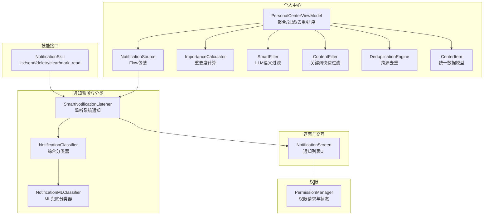
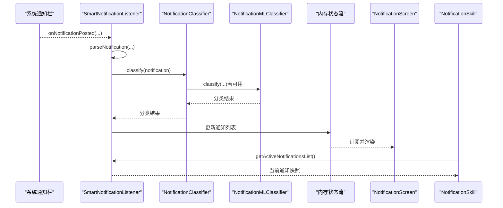
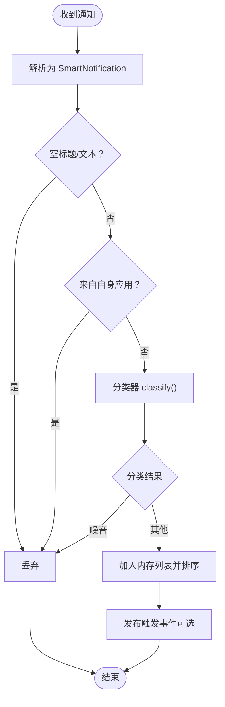
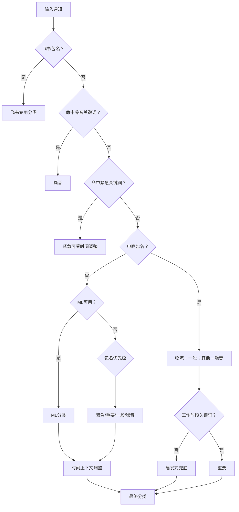
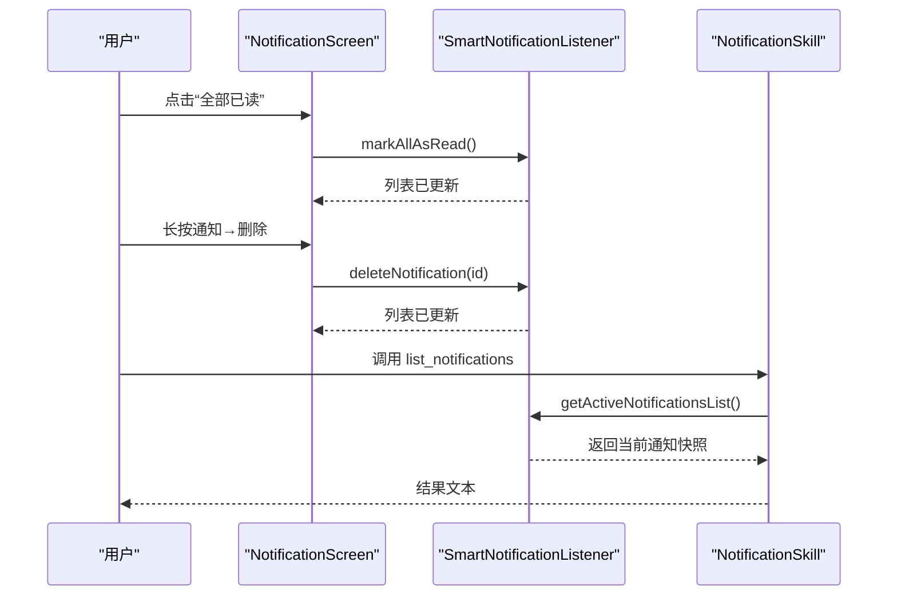
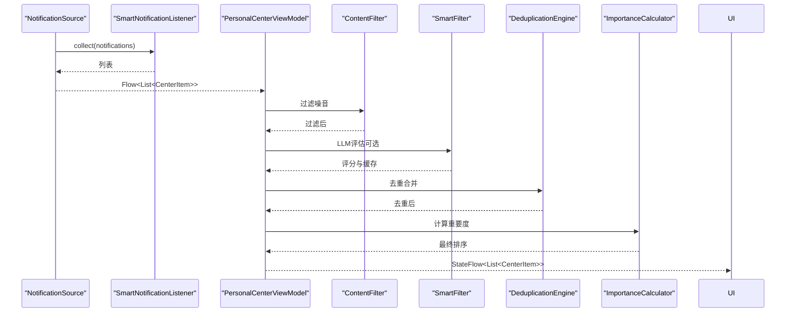
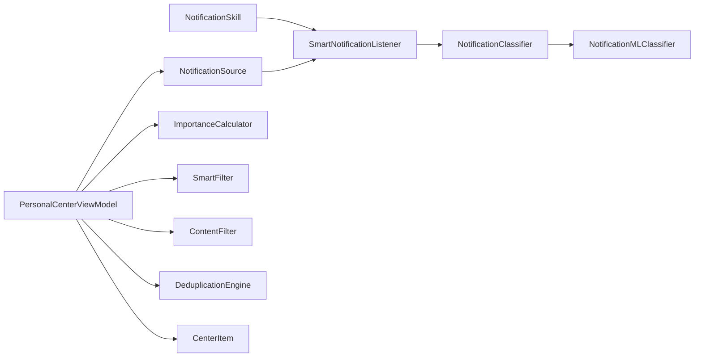

# 通知技能

<cite>
**本文引用的文件**
- [SmartNotificationListener.kt](file://app/src/main/java/ai/openclaw/android/notification/SmartNotificationListener.kt)
- [NotificationClassifier.kt](file://app/src/main/java/ai/openclaw/android/notification/NotificationClassifier.kt)
- [NotificationMLClassifier.kt](file://app/src/main/java/ai/openclaw/android/notification/NotificationMLClassifier.kt)
- [NotificationScreen.kt](file://app/src/main/java/ai/openclaw/android/notification/NotificationScreen.kt)
- [NotificationSkill.kt](file://app/src/main/java/ai/openclaw/android/skill/builtin/NotificationSkill.kt)
- [NotificationSource.kt](file://app/src/main/java/ai/openclaw/android/personalcenter/sources/NotificationSource.kt)
- [PersonalCenterViewModel.kt](file://app/src/main/java/ai/openclaw/android/personalcenter/PersonalCenterViewModel.kt)
- [ImportanceCalculator.kt](file://app/src/main/java/ai/openclaw/android/personalcenter/ImportanceCalculator.kt)
- [SmartFilter.kt](file://app/src/main/java/ai/openclaw/android/personalcenter/SmartFilter.kt)
- [ContentFilter.kt](file://app/src/main/java/ai/openclaw/android/personalcenter/ContentFilter.kt)
- [DeduplicationEngine.kt](file://app/src/main/java/ai/openclaw/android/personalcenter/DeduplicationEngine.kt)
- [CenterItem.kt](file://app/src/main/java/ai/openclaw/android/personalcenter/models/CenterItem.kt)
- [PermissionManager.kt](file://app/src/main/java/ai/openclaw/android/permission/PermissionManager.kt)
- [NotificationSkillTest.kt](file://app/src/test/java/ai/openclaw/android/skill/builtin/NotificationSkillTest.kt)
</cite>

## 目录
1. [简介](#简介)
2. [项目结构](#项目结构)
3. [核心组件](#核心组件)
4. [架构总览](#架构总览)
5. [详细组件分析](#详细组件分析)
6. [依赖关系分析](#依赖关系分析)
7. [性能考量](#性能考量)
8. [故障排查指南](#故障排查指南)
9. [结论](#结论)
10. [附录](#附录)

## 简介
本技术文档围绕“通知技能”展开，系统阐述通知监听与处理、权限管理、分类算法与智能处理机制、通知数据提取与内容解析、通知操作与用户交互流程，并提供使用示例与隐私保护措施。目标是帮助开发者与产品人员全面理解通知系统的实现方式与扩展路径。

## 项目结构
通知技能相关代码主要分布在以下模块：
- 通知监听与分类：SmartNotificationListener、NotificationClassifier、NotificationMLClassifier
- 通知界面与交互：NotificationScreen
- 通知技能工具：NotificationSkill（list/send/delete/clear/mark_read）
- 个人中心集成：NotificationSource、PersonalCenterViewModel、ImportanceCalculator、SmartFilter、ContentFilter、DeduplicationEngine
- 权限管理：PermissionManager
- 测试：NotificationSkillTest

图表来源
- [SmartNotificationListener.kt:19-432](file://app/src/main/java/ai/openclaw/android/notification/SmartNotificationListener.kt#L19-L432)
- [NotificationClassifier.kt:20-475](file://app/src/main/java/ai/openclaw/android/notification/NotificationClassifier.kt#L20-L475)
- [NotificationMLClassifier.kt:14-217](file://app/src/main/java/ai/openclaw/android/notification/NotificationMLClassifier.kt#L14-L217)
- [NotificationScreen.kt:35-407](file://app/src/main/java/ai/openclaw/android/notification/NotificationScreen.kt#L35-L407)
- [NotificationSkill.kt:14-215](file://app/src/main/java/ai/openclaw/android/skill/builtin/NotificationSkill.kt#L14-L215)
- [NotificationSource.kt:22-73](file://app/src/main/java/ai/openclaw/android/personalcenter/sources/NotificationSource.kt#L22-L73)
- [PersonalCenterViewModel.kt:25-279](file://app/src/main/java/ai/openclaw/android/personalcenter/PersonalCenterViewModel.kt#L25-L279)
- [ImportanceCalculator.kt:10-110](file://app/src/main/java/ai/openclaw/android/personalcenter/ImportanceCalculator.kt#L10-L110)
- [SmartFilter.kt:15-152](file://app/src/main/java/ai/openclaw/android/personalcenter/SmartFilter.kt#L15-L152)
- [ContentFilter.kt:9-76](file://app/src/main/java/ai/openclaw/android/personalcenter/ContentFilter.kt#L9-L76)
- [DeduplicationEngine.kt:12-88](file://app/src/main/java/ai/openclaw/android/personalcenter/DeduplicationEngine.kt#L12-L88)
- [CenterItem.kt:10-24](file://app/src/main/java/ai/openclaw/android/personalcenter/models/CenterItem.kt#L10-L24)
- [PermissionManager.kt:32-189](file://app/src/main/java/ai/openclaw/android/permission/PermissionManager.kt#L32-L189)

章节来源
- [SmartNotificationListener.kt:19-432](file://app/src/main/java/ai/openclaw/android/notification/SmartNotificationListener.kt#L19-L432)
- [NotificationSkill.kt:14-215](file://app/src/main/java/ai/openclaw/android/skill/builtin/NotificationSkill.kt#L14-L215)

## 核心组件
- 通知监听服务：负责监听系统通知、解析、分类、存储与事件发布。
- 分类器：结合包名优先级、关键词、时间上下文、ML模型与启发式规则进行分类。
- UI 层：显示通知列表、状态栏、权限请求卡片与交互菜单。
- 技能工具：提供列出、发送、删除、清空、标记已读等能力。
- 个人中心：将通知与其他来源（日历、短信）统一聚合，进行过滤、去重、排序与重要度计算。
- 权限管理：统一管理权限请求、状态与特殊权限处理。

章节来源
- [NotificationClassifier.kt:20-475](file://app/src/main/java/ai/openclaw/android/notification/NotificationClassifier.kt#L20-L475)
- [NotificationScreen.kt:35-407](file://app/src/main/java/ai/openclaw/android/notification/NotificationScreen.kt#L35-L407)
- [NotificationSkill.kt:14-215](file://app/src/main/java/ai/openclaw/android/skill/builtin/NotificationSkill.kt#L14-L215)
- [PersonalCenterViewModel.kt:25-279](file://app/src/main/java/ai/openclaw/android/personalcenter/PersonalCenterViewModel.kt#L25-L279)

## 架构总览
通知技能采用“监听-分类-存储-展示-交互”的闭环架构。系统通知经监听服务解析后进入分类器，随后写入内存状态流供 UI 与技能使用；同时通过个人中心进行统一聚合与智能处理。

图表来源
- [SmartNotificationListener.kt:190-292](file://app/src/main/java/ai/openclaw/android/notification/SmartNotificationListener.kt#L190-L292)
- [NotificationClassifier.kt:298-356](file://app/src/main/java/ai/openclaw/android/notification/NotificationClassifier.kt#L298-L356)
- [NotificationMLClassifier.kt:121-169](file://app/src/main/java/ai/openclaw/android/notification/NotificationMLClassifier.kt#L121-L169)

## 详细组件分析

### 通知监听与处理（SmartNotificationListener）
- 职责：监听系统通知、解析为内部模型、分类、存储、事件发布、权限检查与兜底刷新。
- 关键点：
  - 使用状态流暴露通知列表，支持 UI 订阅与技能调用。
  - 启动时延迟拉取系统通知，避免空列表。
  - onNotificationPosted/onNotificationRemoved 两种模式更新内存列表。
  - 提供伴生方法用于非实例上下文的删除、清空、标记已读与刷新。
  - 解析时过滤空标题/文本与自身应用通知，避免循环。
  - 分类后根据类别决定是否存储与后续处理。

图表来源
- [SmartNotificationListener.kt:297-353](file://app/src/main/java/ai/openclaw/android/notification/SmartNotificationListener.kt#L297-L353)

章节来源
- [SmartNotificationListener.kt:19-432](file://app/src/main/java/ai/openclaw/android/notification/SmartNotificationListener.kt#L19-L432)

### 分类算法与智能处理（NotificationClassifier + NotificationMLClassifier）
- 综合分类流程：
  1) 飞书专用分类（@提及、审批、会议、文档协作等）。
  2) 噪音关键词检测（广告、推广、抽奖等）。
  3) 紧急关键词检测（紧急、重要、报警、故障等）。
  4) 电商通知特殊处理（物流升级为一般，其他降噪）。
  5) ML 模型分类（兜底）。
  6) 包名优先级（紧急/重要/一般/噪音）。
  7) 工作时段关键词提升。
  8) 启发式规则兜底。
  9) 时间上下文调整（免打扰时段降级）。
- ML 分类器：基于包名与关键词映射，快速分类，作为 TFLite 模型的兜底实现。

图表来源
- [NotificationClassifier.kt:298-356](file://app/src/main/java/ai/openclaw/android/notification/NotificationClassifier.kt#L298-L356)
- [NotificationMLClassifier.kt:121-169](file://app/src/main/java/ai/openclaw/android/notification/NotificationMLClassifier.kt#L121-L169)

章节来源
- [NotificationClassifier.kt:20-475](file://app/src/main/java/ai/openclaw/android/notification/NotificationClassifier.kt#L20-L475)
- [NotificationMLClassifier.kt:14-217](file://app/src/main/java/ai/openclaw/android/notification/NotificationMLClassifier.kt#L14-L217)

### 通知数据提取与内容解析
- 解析字段：包名、标题、正文、大文本、时间戳、附加信息（Bundle 转 Map，限制长度）。
- 过滤策略：空标题/文本丢弃；自身应用通知丢弃；噪音关键词过滤。
- 存储策略：最多保留 100 条，按时间倒序。

章节来源
- [SmartNotificationListener.kt:297-328](file://app/src/main/java/ai/openclaw/android/notification/SmartNotificationListener.kt#L297-L328)

### 通知操作与用户交互（NotificationScreen + NotificationSkill）
- UI 交互：
  - 顶部状态栏显示未读计数与紧急计数，支持“全部已读”“清空”。
  - 列表项支持点击标记已读、长按菜单删除。
  - 权限不足时显示“前往设置”卡片。
- 技能工具：
  - list_notifications：支持包名过滤、限制数量、是否包含已读。
  - send_notification：发送本地通知（高/默认/低重要性）。
  - delete_notification：删除系统通知与内存列表。
  - clear_notifications：清空所有通知。
  - mark_notification_read：标记已读。

图表来源
- [NotificationScreen.kt:80-136](file://app/src/main/java/ai/openclaw/android/notification/NotificationScreen.kt#L80-L136)
- [SmartNotificationListener.kt:398-431](file://app/src/main/java/ai/openclaw/android/notification/SmartNotificationListener.kt#L398-L431)
- [NotificationSkill.kt:71-103](file://app/src/main/java/ai/openclaw/android/skill/builtin/NotificationSkill.kt#L71-L103)

章节来源
- [NotificationScreen.kt:35-407](file://app/src/main/java/ai/openclaw/android/notification/NotificationScreen.kt#L35-L407)
- [NotificationSkill.kt:14-215](file://app/src/main/java/ai/openclaw/android/skill/builtin/NotificationSkill.kt#L14-L215)

### 个人中心集成与智能处理
- 数据源包装：NotificationSource 将 SmartNotificationListener 的状态流转换为统一的 CenterItem 流。
- 聚合与处理：
  - 合并通知、日历、短信三源。
  - ContentFilter 快速关键词过滤。
  - SmartFilter 优先使用 LLM 语义评估，降级为关键词模式。
  - DeduplicationEngine 跨源去重（30 分钟时间窗 + 关键词指纹）。
  - ImportanceCalculator 计算重要度并参与排序。
- 输出：按 importance 降序的统一列表。

图表来源
- [NotificationSource.kt:26-45](file://app/src/main/java/ai/openclaw/android/personalcenter/sources/NotificationSource.kt#L26-L45)
- [PersonalCenterViewModel.kt:138-206](file://app/src/main/java/ai/openclaw/android/personalcenter/PersonalCenterViewModel.kt#L138-L206)
- [ContentFilter.kt:60-75](file://app/src/main/java/ai/openclaw/android/personalcenter/ContentFilter.kt#L60-L75)
- [SmartFilter.kt:63-108](file://app/src/main/java/ai/openclaw/android/personalcenter/SmartFilter.kt#L63-L108)
- [DeduplicationEngine.kt:35-55](file://app/src/main/java/ai/openclaw/android/personalcenter/DeduplicationEngine.kt#L35-L55)
- [ImportanceCalculator.kt:70-74](file://app/src/main/java/ai/openclaw/android/personalcenter/ImportanceCalculator.kt#L70-L74)

章节来源
- [NotificationSource.kt:22-73](file://app/src/main/java/ai/openclaw/android/personalcenter/sources/NotificationSource.kt#L22-L73)
- [PersonalCenterViewModel.kt:25-279](file://app/src/main/java/ai/openclaw/android/personalcenter/PersonalCenterViewModel.kt#L25-L279)
- [CenterItem.kt:10-24](file://app/src/main/java/ai/openclaw/android/personalcenter/models/CenterItem.kt#L10-L24)

### 权限管理
- 通知监听权限：SmartNotificationListener 在连接时检查 enabled_notification_listeners，确保权限已授予。
- 通用权限管理：PermissionManager 提供统一的权限请求、状态查询与特殊权限处理（如 MANAGE_EXTERNAL_STORAGE）。
- UI 集成：当权限不足时，NotificationScreen 展示“前往设置”卡片引导用户授权。

章节来源
- [SmartNotificationListener.kt:157-182](file://app/src/main/java/ai/openclaw/android/notification/SmartNotificationListener.kt#L157-L182)
- [PermissionManager.kt:32-189](file://app/src/main/java/ai/openclaw/android/permission/PermissionManager.kt#L32-L189)
- [NotificationScreen.kt:357-407](file://app/src/main/java/ai/openclaw/android/notification/NotificationScreen.kt#L357-L407)

## 依赖关系分析
- 组件耦合：
  - SmartNotificationListener 依赖 NotificationClassifier；NotificationClassifier 依赖 NotificationMLClassifier。
  - NotificationSkill 依赖 SmartNotificationListener 的伴生方法与系统 NotificationManager。
  - PersonalCenterViewModel 依赖 NotificationSource、ImportanceCalculator、SmartFilter、ContentFilter、DeduplicationEngine。
- 外部依赖：
  - Android 系统通知服务、NotificationManager。
  - LLM 评估器（通过 GatewayContract 注入）。

图表来源
- [SmartNotificationListener.kt:19-432](file://app/src/main/java/ai/openclaw/android/notification/SmartNotificationListener.kt#L19-L432)
- [NotificationSkill.kt:14-215](file://app/src/main/java/ai/openclaw/android/skill/builtin/NotificationSkill.kt#L14-L215)
- [PersonalCenterViewModel.kt:25-279](file://app/src/main/java/ai/openclaw/android/personalcenter/PersonalCenterViewModel.kt#L25-L279)

章节来源
- [SmartNotificationListener.kt:19-432](file://app/src/main/java/ai/openclaw/android/notification/SmartNotificationListener.kt#L19-L432)
- [NotificationSkill.kt:14-215](file://app/src/main/java/ai/openclaw/android/skill/builtin/NotificationSkill.kt#L14-L215)
- [PersonalCenterViewModel.kt:25-279](file://app/src/main/java/ai/openclaw/android/personalcenter/PersonalCenterViewModel.kt#L25-L279)

## 性能考量
- 内存限制：通知列表最多保留 100 条，避免内存膨胀。
- 异步处理：监听与刷新均在协程中执行，避免阻塞主线程。
- 兜底策略：启动时延迟拉取与多次重试，提高首次加载成功率。
- UI 渲染：Compose 列表懒加载与动画优化，减少卡顿。
- LLM 降级：SmartFilter 在 LLM 不可用时自动降级为关键词模式，保证稳定性与性能。

## 故障排查指南
- 无通知显示：
  - 检查通知监听权限是否授予（系统设置中启用）。
  - 查看 SmartNotificationListener 的日志，确认是否连接成功与是否返回空列表。
  - 使用技能的 list_notifications 获取系统通知快照进行比对。
- 分类异常：
  - 检查 NotificationClassifier 的包名/关键词配置是否覆盖目标应用。
  - 若 ML 可用，确认模型初始化与资源释放逻辑。
- UI 交互无效：
  - 确认 UI 是否处于权限不足状态（显示“前往设置”卡片）。
  - 检查 NotificationSkill 的参数校验与 NotificationManager 的通知通道创建。
- 个人中心噪音过多：
  - 调整 ContentFilter/SmartFilter 的关键词与阈值。
  - 检查 DeduplicationEngine 的去重键生成逻辑与时间窗口。

章节来源
- [SmartNotificationListener.kt:157-182](file://app/src/main/java/ai/openclaw/android/notification/SmartNotificationListener.kt#L157-L182)
- [NotificationSkill.kt:106-140](file://app/src/main/java/ai/openclaw/android/skill/builtin/NotificationSkill.kt#L106-L140)
- [SmartFilter.kt:78-108](file://app/src/main/java/ai/openclaw/android/personalcenter/SmartFilter.kt#L78-L108)

## 结论
通知技能通过“监听-分类-存储-展示-交互”的完整链路，实现了对系统通知的智能管理。结合关键词、时间上下文与 ML 模型的综合分类，配合个人中心的统一聚合与智能处理，显著提升了信息价值密度与用户体验。权限管理与 UI 交互设计确保了易用性与可控性。

## 附录

### 使用示例
- 列出通知（支持包名过滤、限制数量、包含已读）
  - 调用路径：[NotificationSkill.kt:71-103](file://app/src/main/java/ai/openclaw/android/skill/builtin/NotificationSkill.kt#L71-L103)
- 发送本地通知（高/默认/低重要性）
  - 调用路径：[NotificationSkill.kt:115-140](file://app/src/main/java/ai/openclaw/android/skill/builtin/NotificationSkill.kt#L115-L140)
- 删除通知（系统通知与内存列表）
  - 调用路径：[NotificationSkill.kt:149-166](file://app/src/main/java/ai/openclaw/android/skill/builtin/NotificationSkill.kt#L149-L166)
- 清空所有通知
  - 调用路径：[NotificationSkill.kt:175-180](file://app/src/main/java/ai/openclaw/android/skill/builtin/NotificationSkill.kt#L175-L180)
- 标记已读
  - 调用路径：[NotificationSkill.kt:189-196](file://app/src/main/java/ai/openclaw/android/skill/builtin/NotificationSkill.kt#L189-L196)

章节来源
- [NotificationSkill.kt:62-196](file://app/src/main/java/ai/openclaw/android/skill/builtin/NotificationSkill.kt#L62-L196)
- [NotificationSkillTest.kt:25-71](file://app/src/test/java/ai/openclaw/android/skill/builtin/NotificationSkillTest.kt#L25-L71)

### 隐私保护措施
- 仅在必要范围内解析通知内容（标题、正文、大文本、附加信息），并对长度进行限制。
- 不存储敏感信息（如验证码、密码），并通过关键词白名单控制保留范围。
- 个人中心支持一键清空与去重，降低信息留存与泄露风险。
- 权限最小化：仅在 UI 或技能调用时请求必要权限，并提供“前往设置”引导。

章节来源
- [SmartNotificationListener.kt:383-391](file://app/src/main/java/ai/openclaw/android/notification/SmartNotificationListener.kt#L383-L391)
- [ContentFilter.kt:35-47](file://app/src/main/java/ai/openclaw/android/personalcenter/ContentFilter.kt#L35-L47)
- [SmartFilter.kt:47-53](file://app/src/main/java/ai/openclaw/android/personalcenter/SmartFilter.kt#L47-L53)