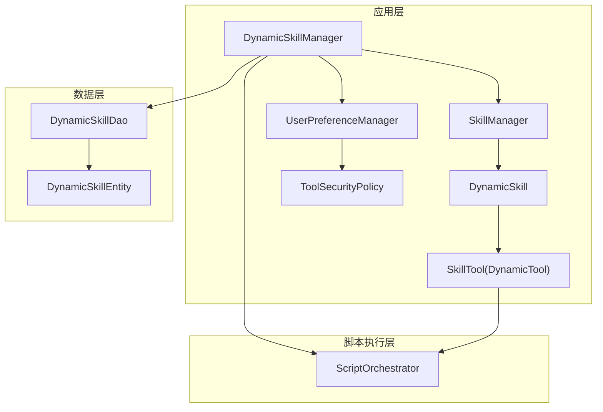
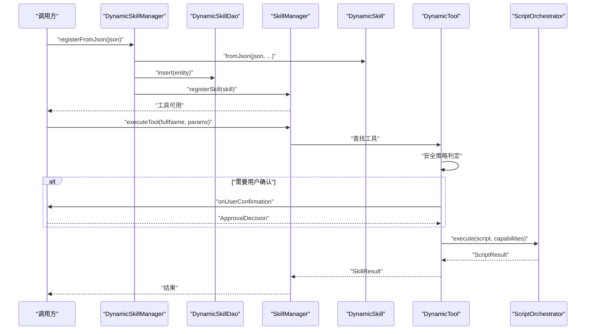
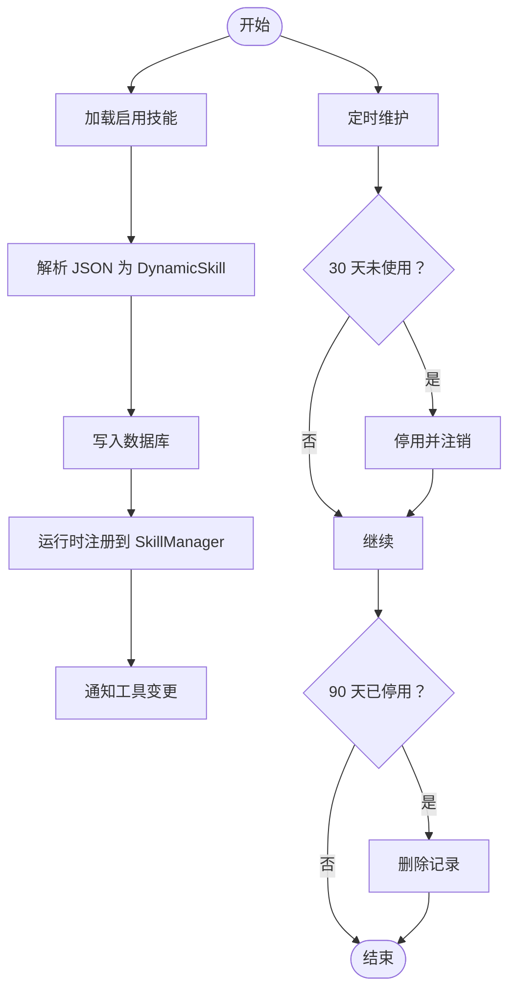
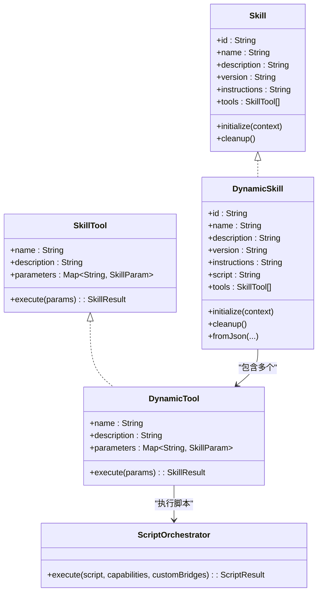
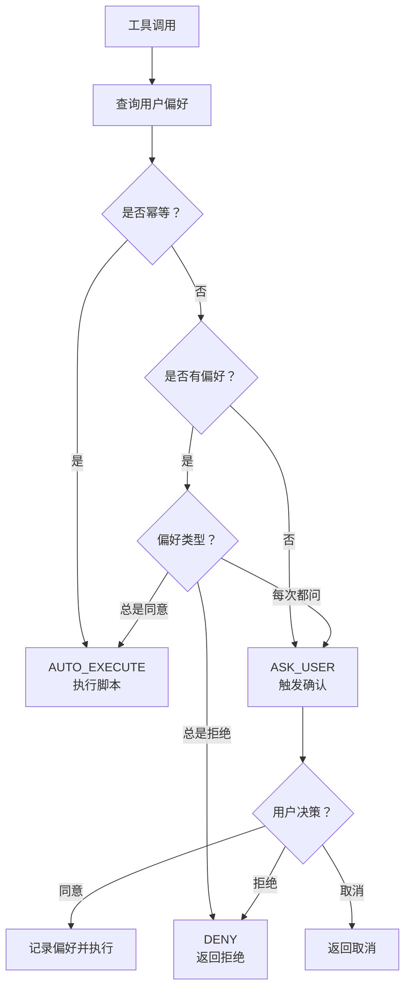
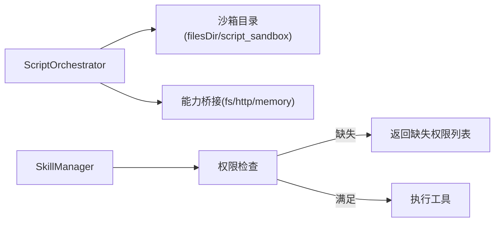
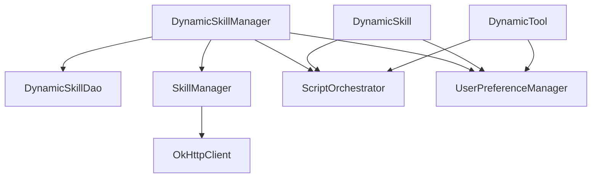

# 动态技能扩展

<cite>
**本文引用的文件**
- [DynamicSkillManager.kt](file://app/src/main/java/ai/openclaw/android/skill/DynamicSkillManager.kt)
- [DynamicSkill.kt](file://app/src/main/java/ai/openclaw/android/skill/DynamicSkill.kt)
- [UserPreferenceManager.kt](file://app/src/main/java/ai/openclaw/android/skill/UserPreferenceManager.kt)
- [ToolSecurityPolicy.kt](file://app/src/main/java/ai/openclaw/android/skill/ToolSecurityPolicy.kt)
- [DynamicSkillEntity.kt](file://app/src/main/java/ai/openclaw/android/data/model/DynamicSkillEntity.kt)
- [Skill.kt](file://app/src/main/java/ai/openclaw/android/skill/Skill.kt)
- [SkillTool.kt](file://app/src/main/java/ai/openclaw/android/skill/SkillTool.kt)
- [SkillManager.kt](file://app/src/main/java/ai/openclaw/android/skill/SkillManager.kt)
- [ScriptOrchestrator.kt](file://script/src/main/java/ai/openclaw/script/ScriptOrchestrator.kt)
- [DynamicSkillDao.kt](file://app/src/main/java/ai/openclaw/android/data/local/DynamicSkillDao.kt)
- [DynamicSkillIntegrationTest.kt](file://app/src/test/java/ai/openclaw/android/skill/DynamicSkillIntegrationTest.kt)
- [DynamicSkillManagerTest.kt](file://app/src/test/java/ai/openclaw/android/skill/DynamicSkillManagerTest.kt)
- [weather.js](file://app/src/main/assets/scripts/weather.js)
- [search.js](file://app/src/main/assets/scripts/search.js)
</cite>

## 目录
1. [简介](#简介)
2. [项目结构](#项目结构)
3. [核心组件](#核心组件)
4. [架构总览](#架构总览)
5. [详细组件分析](#详细组件分析)
6. [依赖关系分析](#依赖关系分析)
7. [性能考量](#性能考量)
8. [故障排查指南](#故障排查指南)
9. [结论](#结论)
10. [附录](#附录)

## 简介
本技术文档围绕动态技能扩展能力展开，重点解释 DynamicSkillManager 的动态技能加载与生命周期管理机制，深入分析 DynamicSkill 的实现原理与扩展点，阐述用户偏好管理对动态技能行为的影响，说明动态技能的安全沙箱机制与权限控制，解释动态技能的热加载与卸载流程，并提供完整的开发工作流程、最佳实践、实际集成示例与调试技巧。

## 项目结构
动态技能相关代码主要分布在以下模块与包中：
- 应用层技能框架：ai.openclaw.android.skill（Skill 接口族、DynamicSkill、DynamicSkillManager、UserPreferenceManager、ToolSecurityPolicy、SkillManager）
- 数据持久化：ai.openclaw.android.data.model 与 ai.openclaw.android.data.local（DynamicSkillEntity、DynamicSkillDao）
- 脚本执行：script.ai.openclaw.script（ScriptOrchestrator 及其桥接能力）
- 示例脚本：app/src/main/assets/scripts（weather.js、search.js）

图表来源
- [SkillManager.kt:1-193](file://app/src/main/java/ai/openclaw/android/skill/SkillManager.kt#L1-L193)
- [DynamicSkillManager.kt:1-202](file://app/src/main/java/ai/openclaw/android/skill/DynamicSkillManager.kt#L1-L202)
- [DynamicSkill.kt:1-221](file://app/src/main/java/ai/openclaw/android/skill/DynamicSkill.kt#L1-L221)
- [UserPreferenceManager.kt:1-100](file://app/src/main/java/ai/openclaw/android/skill/UserPreferenceManager.kt#L1-L100)
- [ToolSecurityPolicy.kt:1-72](file://app/src/main/java/ai/openclaw/android/skill/ToolSecurityPolicy.kt#L1-L72)
- [DynamicSkillDao.kt:1-47](file://app/src/main/java/ai/openclaw/android/data/local/DynamicSkillDao.kt#L1-L47)
- [DynamicSkillEntity.kt:1-22](file://app/src/main/java/ai/openclaw/android/data/model/DynamicSkillEntity.kt#L1-L22)
- [ScriptOrchestrator.kt:1-55](file://script/src/main/java/ai/openclaw/script/ScriptOrchestrator.kt#L1-L55)

章节来源
- [SkillManager.kt:1-193](file://app/src/main/java/ai/openclaw/android/skill/SkillManager.kt#L1-L193)
- [DynamicSkillManager.kt:1-202](file://app/src/main/java/ai/openclaw/android/skill/DynamicSkillManager.kt#L1-L202)
- [DynamicSkill.kt:1-221](file://app/src/main/java/ai/openclaw/android/skill/DynamicSkill.kt#L1-L221)
- [UserPreferenceManager.kt:1-100](file://app/src/main/java/ai/openclaw/android/skill/UserPreferenceManager.kt#L1-L100)
- [ToolSecurityPolicy.kt:1-72](file://app/src/main/java/ai/openclaw/android/skill/ToolSecurityPolicy.kt#L1-L72)
- [DynamicSkillDao.kt:1-47](file://app/src/main/java/ai/openclaw/android/data/local/DynamicSkillDao.kt#L1-L47)
- [DynamicSkillEntity.kt:1-22](file://app/src/main/java/ai/openclaw/android/data/model/DynamicSkillEntity.kt#L1-L22)
- [ScriptOrchestrator.kt:1-55](file://script/src/main/java/ai/openclaw/script/ScriptOrchestrator.kt#L1-L55)

## 核心组件
- DynamicSkillManager：负责动态技能的注册、持久化、启动时加载、生命周期维护（停用/清理）、手动启停删以及使用记录；提供工具变更通知回调。
- DynamicSkill：从 JSON 构建技能，解析工具定义，封装为 DynamicTool 列表；提供 initialize/cleanup 生命周期钩子。
- DynamicTool：将工具调用路由至 ScriptOrchestrator 执行；内置安全策略与用户确认流程。
- UserPreferenceManager：以本地 JSON 文件存储用户对工具的审批偏好，支持增删改查与批量清除。
- ToolSecurityPolicy：定义安全策略枚举与用户审批决策枚举，配合 SecurityReview 进行策略判定。
- SkillManager：统一管理内置与动态技能，提供工具发现、权限检查与执行入口。
- ScriptOrchestrator：脚本执行编排器，负责能力桥接与沙箱策略，隔离文件系统与网络访问。
- DynamicSkillDao/DynamicSkillEntity：Room 数据访问接口与实体，支撑动态技能的持久化与维护阈值查询。

章节来源
- [DynamicSkillManager.kt:1-202](file://app/src/main/java/ai/openclaw/android/skill/DynamicSkillManager.kt#L1-L202)
- [DynamicSkill.kt:1-221](file://app/src/main/java/ai/openclaw/android/skill/DynamicSkill.kt#L1-L221)
- [DynamicSkill.kt:130-221](file://app/src/main/java/ai/openclaw/android/skill/DynamicSkill.kt#L130-L221)
- [UserPreferenceManager.kt:1-100](file://app/src/main/java/ai/openclaw/android/skill/UserPreferenceManager.kt#L1-L100)
- [ToolSecurityPolicy.kt:1-72](file://app/src/main/java/ai/openclaw/android/skill/ToolSecurityPolicy.kt#L1-L72)
- [SkillManager.kt:1-193](file://app/src/main/java/ai/openclaw/android/skill/SkillManager.kt#L1-L193)
- [ScriptOrchestrator.kt:1-55](file://script/src/main/java/ai/openclaw/script/ScriptOrchestrator.kt#L1-L55)
- [DynamicSkillDao.kt:1-47](file://app/src/main/java/ai/openclaw/android/data/local/DynamicSkillDao.kt#L1-L47)
- [DynamicSkillEntity.kt:1-22](file://app/src/main/java/ai/openclaw/android/data/model/DynamicSkillEntity.kt#L1-L22)

## 架构总览
动态技能从“JSON 描述 + JS 脚本”出发，经由 DynamicSkillManager 注册并持久化，再由 SkillManager 统一调度。工具调用时，DynamicTool 依据用户偏好与幂等性进行安全策略判定，必要时触发用户确认，最终通过 ScriptOrchestrator 在受限沙箱内执行脚本。

图表来源
- [DynamicSkillManager.kt:63-96](file://app/src/main/java/ai/openclaw/android/skill/DynamicSkillManager.kt#L63-L96)
- [DynamicSkill.kt:54-107](file://app/src/main/java/ai/openclaw/android/skill/DynamicSkill.kt#L54-L107)
- [DynamicSkill.kt:153-193](file://app/src/main/java/ai/openclaw/android/skill/DynamicSkill.kt#L153-L193)
- [DynamicSkill.kt:195-219](file://app/src/main/java/ai/openclaw/android/skill/DynamicSkill.kt#L195-L219)
- [SkillManager.kt:62-83](file://app/src/main/java/ai/openclaw/android/skill/SkillManager.kt#L62-L83)
- [ScriptOrchestrator.kt:31-39](file://script/src/main/java/ai/openclaw/script/ScriptOrchestrator.kt#L31-L39)

## 详细组件分析

### DynamicSkillManager：动态技能生命周期与管理
- 注册流程：从 JSON 提取 id，构建 DynamicSkill，持久化到数据库，运行时注册到 SkillManager，并触发工具变更回调。
- 启动加载：读取所有启用的技能实体，重建 DynamicSkill 并注册，异常技能会被跳过。
- 生命周期维护：
  - 30 天未使用 → 停用（lastUsedAt=0 的新建技能跳过）
  - 90 天已停用 → 删除
- 手动管理：启用/停用/删除技能，删除时同步清理用户偏好。
- 使用记录：recordUsage 更新 lastUsedAt。
- 清理：取消内部协程作用域，释放资源。

图表来源
- [DynamicSkillManager.kt:101-116](file://app/src/main/java/ai/openclaw/android/skill/DynamicSkillManager.kt#L101-L116)
- [DynamicSkillManager.kt:122-147](file://app/src/main/java/ai/openclaw/android/skill/DynamicSkillManager.kt#L122-L147)
- [DynamicSkillManager.kt:152-178](file://app/src/main/java/ai/openclaw/android/skill/DynamicSkillManager.kt#L152-L178)

章节来源
- [DynamicSkillManager.kt:1-202](file://app/src/main/java/ai/openclaw/android/skill/DynamicSkillManager.kt#L1-L202)
- [DynamicSkillDao.kt:27-45](file://app/src/main/java/ai/openclaw/android/data/local/DynamicSkillDao.kt#L27-L45)

### DynamicSkill 与 DynamicTool：实现原理与扩展点
- DynamicSkill.fromJson：从 JSON 中提取 id/name/description/version/instructions/script/tools，解析每个工具的参数定义，构建 DynamicTool 列表。
- DynamicTool.execute：
  - 生成完整工具 ID（skillId_toolName）
  - 查询用户偏好并进行安全策略判定（幂等自动执行、无偏好首次询问、已有偏好按策略）
  - 用户确认策略：总是同意、总是拒绝、每次询问
  - 执行脚本：将参数序列化为 JSON，拼接调用入口函数，交由 ScriptOrchestrator 执行
  - 结果包装：成功返回输出，失败返回错误信息
- 扩展点：
  - 脚本能力：通过 ScriptOrchestrator 的 capabilities 注入 fs/http/memory 等桥接能力
  - 安全策略：通过 UserPreferenceManager 与 SecurityReview 控制执行路径
  - 工具参数：支持字符串/数字/布尔/对象等参数类型

图表来源
- [Skill.kt:1-13](file://app/src/main/java/ai/openclaw/android/skill/Skill.kt#L1-L13)
- [DynamicSkill.kt:22-108](file://app/src/main/java/ai/openclaw/android/skill/DynamicSkill.kt#L22-L108)
- [SkillTool.kt:1-22](file://app/src/main/java/ai/openclaw/android/skill/SkillTool.kt#L1-L22)
- [DynamicSkill.kt:130-221](file://app/src/main/java/ai/openclaw/android/skill/DynamicSkill.kt#L130-L221)
- [ScriptOrchestrator.kt:31-39](file://script/src/main/java/ai/openclaw/script/ScriptOrchestrator.kt#L31-L39)

章节来源
- [DynamicSkill.kt:1-221](file://app/src/main/java/ai/openclaw/android/skill/DynamicSkill.kt#L1-L221)
- [SkillTool.kt:1-22](file://app/src/main/java/ai/openclaw/android/skill/SkillTool.kt#L1-L22)
- [ScriptOrchestrator.kt:1-55](file://script/src/main/java/ai/openclaw/script/ScriptOrchestrator.kt#L1-L55)

### 用户偏好管理：影响动态技能行为
- UserPreferenceManager：
  - 以 JSON 文件存储 UserApprovalPreference（toolId、decision、lastUsedAt）
  - 支持按工具设置/清除偏好，批量导出/清空
  - 读写线程安全（保存时加锁）
- SecurityReview：
  - 幂等工具：AUTO_EXECUTE
  - 无历史偏好：ASK_USER
  - 有偏好：ALWAYS_APPROVE→AUTO_EXECUTE；ALWAYS_DENY→DENY；ASK_EVERY_TIME→ASK_USER
- DynamicTool.execute：根据策略决定是否直接执行或触发用户确认

图表来源
- [ToolSecurityPolicy.kt:44-71](file://app/src/main/java/ai/openclaw/android/skill/ToolSecurityPolicy.kt#L44-L71)
- [UserPreferenceManager.kt:16-99](file://app/src/main/java/ai/openclaw/android/skill/UserPreferenceManager.kt#L16-L99)
- [DynamicSkill.kt:153-193](file://app/src/main/java/ai/openclaw/android/skill/DynamicSkill.kt#L153-L193)

章节来源
- [ToolSecurityPolicy.kt:1-72](file://app/src/main/java/ai/openclaw/android/skill/ToolSecurityPolicy.kt#L1-L72)
- [UserPreferenceManager.kt:1-100](file://app/src/main/java/ai/openclaw/android/skill/UserPreferenceManager.kt#L1-L100)
- [DynamicSkill.kt:153-193](file://app/src/main/java/ai/openclaw/android/skill/DynamicSkill.kt#L153-L193)

### 安全沙箱机制与权限控制
- 脚本沙箱：
  - ScriptOrchestrator 在应用私有目录创建沙箱目录，限制文件系统访问范围
  - 仅在 capabilities 列表中显式授权的能力才被注入（如 fs/http），默认包含 fs 与 http
- 动态技能权限：
  - SkillManager 对技能执行前进行权限检查，返回缺失权限列表
  - 内置技能示例：日历、位置、联系人、短信等权限映射
- 动态技能 JSON 中预留 permissions 字段，便于后续扩展

图表来源
- [ScriptOrchestrator.kt:16-53](file://script/src/main/java/ai/openclaw/script/ScriptOrchestrator.kt#L16-L53)
- [SkillManager.kt:89-107](file://app/src/main/java/ai/openclaw/android/skill/SkillManager.kt#L89-L107)
- [SkillManager.kt:119-138](file://app/src/main/java/ai/openclaw/android/skill/SkillManager.kt#L119-L138)

章节来源
- [ScriptOrchestrator.kt:1-55](file://script/src/main/java/ai/openclaw/script/ScriptOrchestrator.kt#L1-L55)
- [SkillManager.kt:1-193](file://app/src/main/java/ai/openclaw/android/skill/SkillManager.kt#L1-L193)
- [DynamicSkillEntity.kt:1-22](file://app/src/main/java/ai/openclaw/android/data/model/DynamicSkillEntity.kt#L1-L22)

### 热加载与卸载流程
- 热加载：应用启动时，DynamicSkillManager 从数据库读取启用的技能，重建 DynamicSkill 并注册到 SkillManager，无需重启进程。
- 卸载：手动停用或 30 天未使用自动停用，SkillManager 注销技能；90 天后彻底删除数据库记录。
- 使用记录：每次工具调用都会更新 lastUsedAt，避免被误判为未使用。

章节来源
- [DynamicSkillManager.kt:101-116](file://app/src/main/java/ai/openclaw/android/skill/DynamicSkillManager.kt#L101-L116)
- [DynamicSkillManager.kt:122-147](file://app/src/main/java/ai/openclaw/android/skill/DynamicSkillManager.kt#L122-L147)
- [DynamicSkillDao.kt:27-45](file://app/src/main/java/ai/openclaw/android/data/local/DynamicSkillDao.kt#L27-L45)

### 开发工作流程与最佳实践
- 技能设计
  - JSON 结构：id/name/description/version/instructions/script/tools（每个工具含 name/description/entryPoint/parameters/idempotent）
  - 幂等性：对可重复执行且无副作用的操作标记为幂等，减少用户确认
- 脚本编写
  - 使用 assets/scripts 下的模板（如 weather.js、search.js）作为参考
  - 明确注入的全局变量（如 LOCATION、QUERY），并在脚本中进行错误处理
  - 仅声明所需能力（capabilities），避免过度授权
- 安全与隐私
  - 优先使用幂等工具
  - 对敏感操作配置 ALWAYS_DENY 或 ALWAYS_APPROVE，结合用户偏好引导
- 生命周期管理
  - 启动时加载：确保数据库中存在启用技能
  - 定时维护：周期性执行 disableUnusedSkills 与 purgeDisabledSkills
- 集成步骤
  - 生成技能 JSON
  - 调用 DynamicSkillManager.registerFromJson 注册
  - 通过 SkillManager.getAllTools 查看工具清单
  - 使用 SkillManager.executeTool(fullName, params) 执行

章节来源
- [DynamicSkill.kt:54-107](file://app/src/main/java/ai/openclaw/android/skill/DynamicSkill.kt#L54-L107)
- [DynamicSkillManager.kt:63-96](file://app/src/main/java/ai/openclaw/android/skill/DynamicSkillManager.kt#L63-L96)
- [SkillManager.kt:50-83](file://app/src/main/java/ai/openclaw/android/skill/SkillManager.kt#L50-L83)
- [weather.js:1-16](file://app/src/main/assets/scripts/weather.js#L1-L16)
- [search.js:1-39](file://app/src/main/assets/scripts/search.js#L1-L39)

### 实际集成示例与调试技巧
- 示例：天气查询
  - JSON 中 script 指向 weather.js，entryPoint 为脚本主函数名
  - 调用时注入 LOCATION 全局变量，脚本通过 http 桥接访问外部服务
- 示例：多引擎搜索
  - JSON 中 script 指向 search.js，entryPoint 为 search(query)
  - 调用时注入 QUERY 全局变量，脚本遍历多个实例并聚合结果
- 调试技巧
  - 使用单元测试验证注册与加载流程（参考 DynamicSkillIntegrationTest 与 DynamicSkillManagerTest）
  - 在 DynamicSkillManager 中设置工具变更监听器，观察注册/删除后的回调次数
  - 通过 SkillManager.getAllTools 输出工具清单，确认命名规则（skillId_toolName）
  - 检查 UserPreferenceManager 的 JSON 文件是否存在与内容是否正确
  - 若脚本执行失败，查看 ScriptResult 的 error 字段并核对 capabilities 与全局变量注入

章节来源
- [DynamicSkillIntegrationTest.kt:1-66](file://app/src/test/java/ai/openclaw/android/skill/DynamicSkillIntegrationTest.kt#L1-L66)
- [DynamicSkillManagerTest.kt:1-311](file://app/src/test/java/ai/openclaw/android/skill/DynamicSkillManagerTest.kt#L1-L311)
- [weather.js:1-16](file://app/src/main/assets/scripts/weather.js#L1-L16)
- [search.js:1-39](file://app/src/main/assets/scripts/search.js#L1-L39)

## 依赖关系分析
- DynamicSkillManager 依赖：
  - DynamicSkillDao：持久化与维护阈值查询
  - SkillManager：运行时注册/注销与工具执行
  - ScriptOrchestrator：脚本执行编排
  - UserPreferenceManager：用户偏好读写
- DynamicSkill 依赖：
  - ScriptOrchestrator：脚本执行
  - UserPreferenceManager：安全策略判定
  - ToolSecurityPolicy：策略枚举
- SkillManager 依赖：
  - OkHttpClient：HTTP 请求（用于工具执行）
  - 权限常量：内置技能所需权限映射

图表来源
- [DynamicSkillManager.kt:3-28](file://app/src/main/java/ai/openclaw/android/skill/DynamicSkillManager.kt#L3-L28)
- [DynamicSkill.kt:3-33](file://app/src/main/java/ai/openclaw/android/skill/DynamicSkill.kt#L3-L33)
- [SkillManager.kt:8-11](file://app/src/main/java/ai/openclaw/android/skill/SkillManager.kt#L8-L11)

章节来源
- [DynamicSkillManager.kt:1-202](file://app/src/main/java/ai/openclaw/android/skill/DynamicSkillManager.kt#L1-L202)
- [DynamicSkill.kt:1-221](file://app/src/main/java/ai/openclaw/android/skill/DynamicSkill.kt#L1-L221)
- [SkillManager.kt:1-193](file://app/src/main/java/ai/openclaw/android/skill/SkillManager.kt#L1-L193)

## 性能考量
- 协程与 IO：DynamicSkillManager 使用 IO 调度器与 SupervisorJob，避免阻塞主线程，降低注册/维护操作的 UI 延迟风险。
- 数据库访问：批量加载与更新 lastUsedAt 使用同步 DAO 方法，建议在后台线程调用，避免频繁写入导致抖动。
- 脚本执行：ScriptOrchestrator 为挂起函数，避免阻塞调用方线程；建议在 UI 层使用协程调度器切换。
- 缓存与偏好：UserPreferenceManager 采用内存缓存 + 文件持久化，保存时加锁，保证一致性与性能平衡。

## 故障排查指南
- 注册失败
  - 检查 JSON 是否包含 id/script/tools 等必需字段
  - 查看 DynamicSkillManager 日志与异常堆栈
- 加载失败
  - 确认数据库中 enabled=true 的技能 JSON 是否有效
  - 检查 DynamicSkill.fromJson 解析过程中的字段缺失
- 安全策略问题
  - 核对工具是否幂等
  - 检查 UserPreferenceManager 中对应 toolId 的偏好设置
- 权限不足
  - 使用 SkillManager.checkSkillPermissions 获取缺失权限列表
  - 在应用设置中授予相应权限
- 脚本执行失败
  - 确认 capabilities 列表包含所需能力（fs/http/memory）
  - 核对全局变量注入（如 LOCATION/QUERY）是否正确传递
  - 查看 ScriptResult 的 error 信息定位问题

章节来源
- [DynamicSkillManager.kt:93-96](file://app/src/main/java/ai/openclaw/android/skill/DynamicSkillManager.kt#L93-L96)
- [DynamicSkillManager.kt:110-113](file://app/src/main/java/ai/openclaw/android/skill/DynamicSkillManager.kt#L110-L113)
- [SkillManager.kt:89-107](file://app/src/main/java/ai/openclaw/android/skill/SkillManager.kt#L89-L107)
- [DynamicSkill.kt:195-219](file://app/src/main/java/ai/openclaw/android/skill/DynamicSkill.kt#L195-L219)

## 结论
动态技能扩展通过“JSON 描述 + JS 脚本 + 沙箱执行”的组合，实现了灵活、可扩展且安全的工具体系。DynamicSkillManager 提供完善的生命周期管理与维护机制，DynamicSkill/DynamicTool 将安全策略与用户偏好无缝融合，UserPreferenceManager 与 ToolSecurityPolicy 构建了可演进的权限控制模型。配合 SkillManager 的统一调度与 ScriptOrchestrator 的沙箱能力，开发者可以快速构建高质量的动态技能并安全地集成到应用中。

## 附录
- 示例脚本参考
  - 天气查询：[weather.js:1-16](file://app/src/main/assets/scripts/weather.js#L1-L16)
  - 多引擎搜索：[search.js:1-39](file://app/src/main/assets/scripts/search.js#L1-L39)
- 测试用例参考
  - 动态技能集成测试：[DynamicSkillIntegrationTest.kt:1-66](file://app/src/test/java/ai/openclaw/android/skill/DynamicSkillIntegrationTest.kt#L1-L66)
  - 动态技能管理器测试：[DynamicSkillManagerTest.kt:1-311](file://app/src/test/java/ai/openclaw/android/skill/DynamicSkillManagerTest.kt#L1-L311)