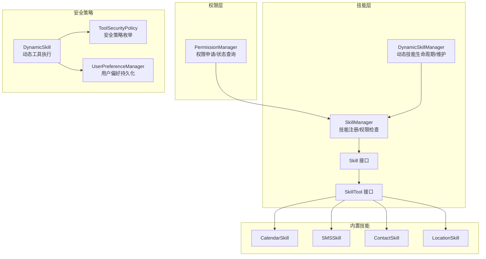
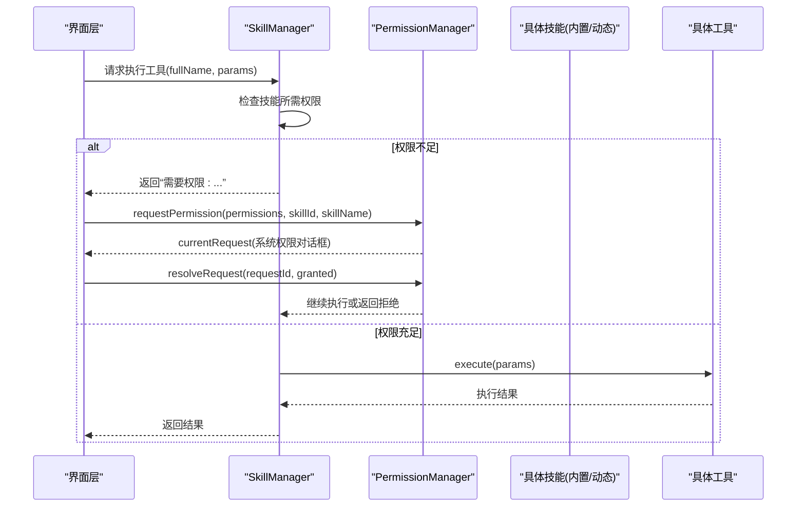
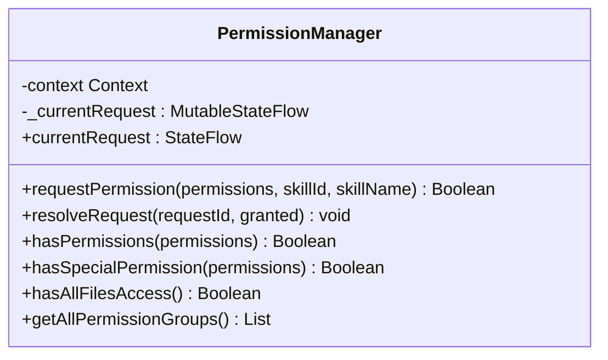
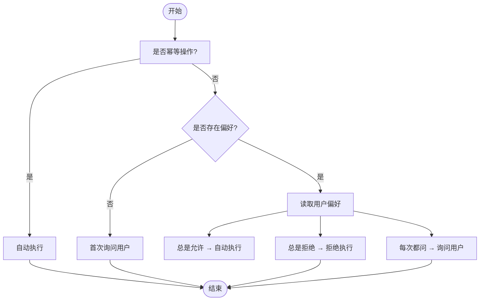
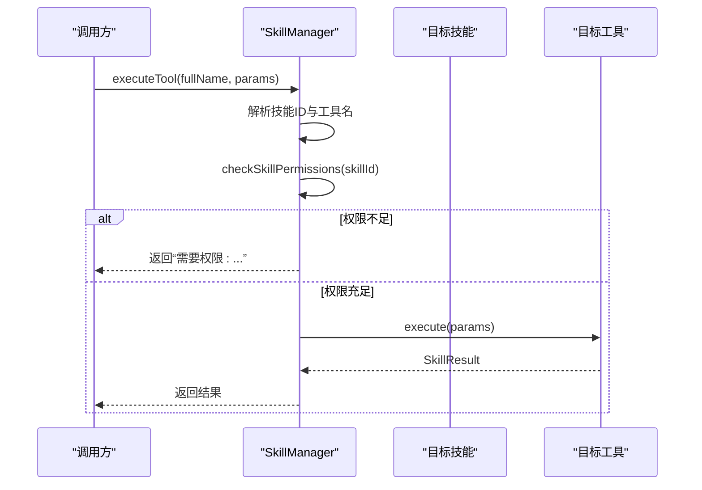
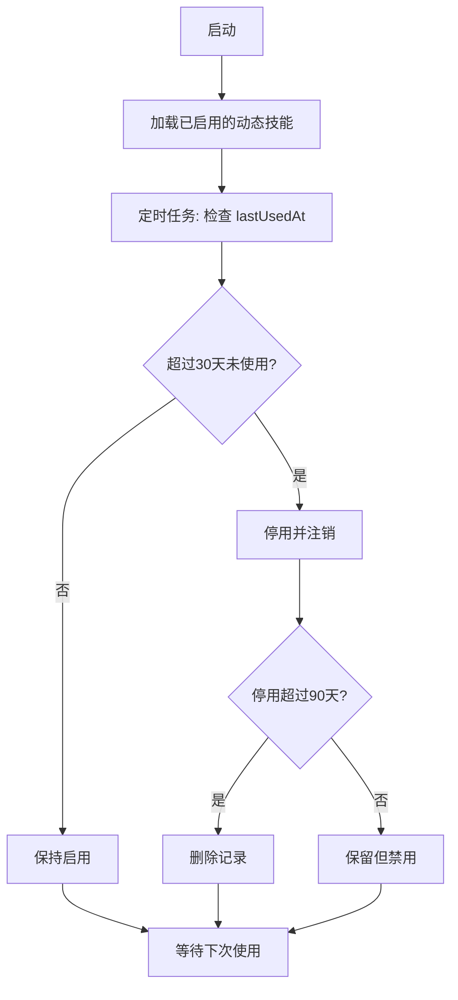
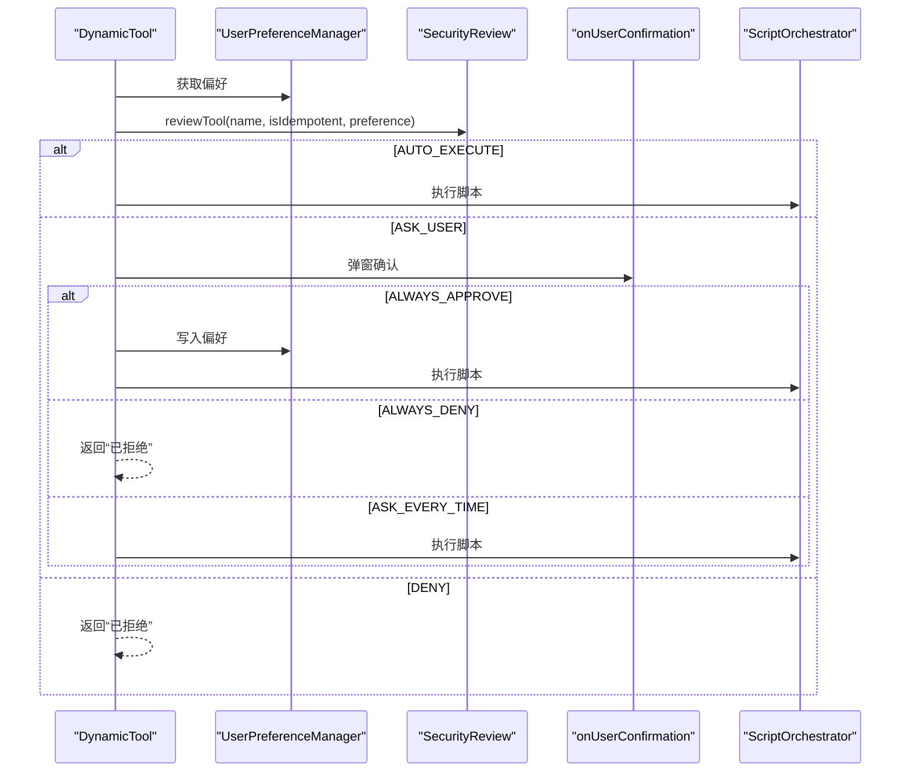
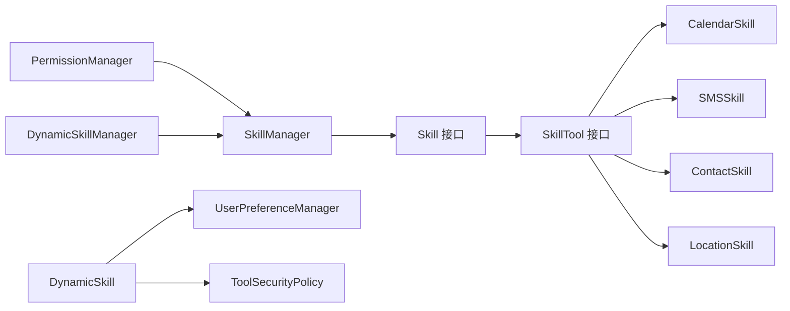

# 技能权限管理

<cite>
**本文引用的文件**
- [PermissionManager.kt](file://app/src/main/java/ai/openclaw/android/permission/PermissionManager.kt)
- [ToolSecurityPolicy.kt](file://app/src/main/java/ai/openclaw/android/skill/ToolSecurityPolicy.kt)
- [SkillManager.kt](file://app/src/main/java/ai/openclaw/android/skill/SkillManager.kt)
- [DynamicSkillManager.kt](file://app/src/main/java/ai/openclaw/android/skill/DynamicSkillManager.kt)
- [Skill.kt](file://app/src/main/java/ai/openclaw/android/skill/Skill.kt)
- [SkillTool.kt](file://app/src/main/java/ai/openclaw/android/skill/SkillTool.kt)
- [CalendarSkill.kt](file://app/src/main/java/ai/openclaw/android/skill/builtin/CalendarSkill.kt)
- [SMSSkill.kt](file://app/src/main/java/ai/openclaw/android/skill/builtin/SMSSkill.kt)
- [ContactSkill.kt](file://app/src/main/java/ai/openclaw/android/skill/builtin/ContactSkill.kt)
- [LocationSkill.kt](file://app/src/main/java/ai/openclaw/android/skill/builtin/LocationSkill.kt)
- [UserPreferenceManager.kt](file://app/src/main/java/ai/openclaw/android/skill/UserPreferenceManager.kt)
- [DynamicSkill.kt](file://app/src/main/java/ai/openclaw/android/skill/DynamicSkill.kt)
</cite>

## 目录
1. [简介](#简介)
2. [项目结构](#项目结构)
3. [核心组件](#核心组件)
4. [架构总览](#架构总览)
5. [详细组件分析](#详细组件分析)
6. [依赖关系分析](#依赖关系分析)
7. [性能考量](#性能考量)
8. [故障排查指南](#故障排查指南)
9. [结论](#结论)
10. [附录](#附录)

## 简介
本文件系统性梳理 OpenClaw-Android 的“技能权限管理”体系，覆盖以下主题：
- 技能权限检查机制与权限验证流程
- ToolSecurityPolicy 的安全策略与防护措施
- PermissionManager 的权限申请与管理能力
- 不同技能的权限需求与权限组合策略
- 权限拒绝时的用户体验设计与降级处理
- 权限管理最佳实践与安全考虑
- 权限问题诊断与解决方案
- 权限升级与权限撤销的处理机制

## 项目结构
围绕权限管理的关键模块分布于 skill 与 permission 包中，并与内置技能、动态技能及脚本引擎协同工作。

图示来源
- [PermissionManager.kt:32-189](file://app/src/main/java/ai/openclaw/android/permission/PermissionManager.kt#L32-L189)
- [SkillManager.kt:8-187](file://app/src/main/java/ai/openclaw/android/skill/SkillManager.kt#L8-L187)
- [DynamicSkillManager.kt:22-201](file://app/src/main/java/ai/openclaw/android/skill/DynamicSkillManager.kt#L22-L201)
- [Skill.kt:3-13](file://app/src/main/java/ai/openclaw/android/skill/Skill.kt#L3-L13)
- [SkillTool.kt:3-22](file://app/src/main/java/ai/openclaw/android/skill/SkillTool.kt#L3-L22)
- [CalendarSkill.kt:13-182](file://app/src/main/java/ai/openclaw/android/skill/builtin/CalendarSkill.kt#L13-L182)
- [SMSSkill.kt:15-185](file://app/src/main/java/ai/openclaw/android/skill/builtin/SMSSkill.kt#L15-L185)
- [ContactSkill.kt:13-243](file://app/src/main/java/ai/openclaw/android/skill/builtin/ContactSkill.kt#L13-L243)
- [LocationSkill.kt:18-255](file://app/src/main/java/ai/openclaw/android/skill/builtin/LocationSkill.kt#L18-L255)
- [ToolSecurityPolicy.kt:6-72](file://app/src/main/java/ai/openclaw/android/skill/ToolSecurityPolicy.kt#L6-L72)
- [UserPreferenceManager.kt:16-100](file://app/src/main/java/ai/openclaw/android/skill/UserPreferenceManager.kt#L16-L100)
- [DynamicSkill.kt:22-221](file://app/src/main/java/ai/openclaw/android/skill/DynamicSkill.kt#L22-L221)

章节来源
- [PermissionManager.kt:32-189](file://app/src/main/java/ai/openclaw/android/permission/PermissionManager.kt#L32-L189)
- [SkillManager.kt:8-187](file://app/src/main/java/ai/openclaw/android/skill/SkillManager.kt#L8-L187)
- [DynamicSkillManager.kt:22-201](file://app/src/main/java/ai/openclaw/android/skill/DynamicSkillManager.kt#L22-L201)

## 核心组件
- PermissionManager：负责权限申请、状态查询、特殊权限识别与系统设置跳转支持；提供 UI 可观察的当前请求状态。
- SkillManager：负责内置技能注册、工具执行前的权限检查、权限缺失时的错误反馈。
- ToolSecurityPolicy：定义工具安全策略（自动执行、询问用户、拒绝），并结合用户偏好进行决策。
- UserPreferenceManager：持久化用户对工具的审批偏好（总是允许/总是拒绝/每次都问）。
- DynamicSkill/DynamicTool：动态技能与工具的封装，集成安全审查与脚本执行。
- 内置技能：CalendarSkill、SMSSkill、ContactSkill、LocationSkill 等，各自声明所需权限并在工具执行前进行校验。

章节来源
- [PermissionManager.kt:32-189](file://app/src/main/java/ai/openclaw/android/permission/PermissionManager.kt#L32-L189)
- [SkillManager.kt:8-187](file://app/src/main/java/ai/openclaw/android/skill/SkillManager.kt#L8-L187)
- [ToolSecurityPolicy.kt:6-72](file://app/src/main/java/ai/openclaw/android/skill/ToolSecurityPolicy.kt#L6-L72)
- [UserPreferenceManager.kt:16-100](file://app/src/main/java/ai/openclaw/android/skill/UserPreferenceManager.kt#L16-L100)
- [DynamicSkill.kt:22-221](file://app/src/main/java/ai/openclaw/android/skill/DynamicSkill.kt#L22-L221)

## 架构总览
权限管理贯穿“技能加载—工具执行—权限检查—用户授权—执行结果”的完整链路。动态技能与内置技能共享统一的权限与安全策略接口。

图示来源
- [SkillManager.kt:62-107](file://app/src/main/java/ai/openclaw/android/skill/SkillManager.kt#L62-L107)
- [PermissionManager.kt:41-70](file://app/src/main/java/ai/openclaw/android/permission/PermissionManager.kt#L41-L70)

## 详细组件分析

### PermissionManager 权限申请与管理
- 当前请求状态：通过 StateFlow 暴露 currentRequest，供 UI 层弹出系统权限对话框。
- 权限申请：requestPermission 支持挂起等待用户响应；resolveRequest 用于回传授权结果。
- 权限判断：hasPermissions 统一校验常规权限；hasAllFilesAccess 处理 MANAGE_EXTERNAL_STORAGE 的特殊路径。
- 特殊权限：hasSpecialPermission 识别需跳转系统设置的权限组（如全部文件访问）。
- 权限组状态：getAllPermissionGroups 提供“定位/通讯录/短信/日程/存储”等分组的状态与显示名映射。

图示来源
- [PermissionManager.kt:32-189](file://app/src/main/java/ai/openclaw/android/permission/PermissionManager.kt#L32-L189)

章节来源
- [PermissionManager.kt:32-189](file://app/src/main/java/ai/openclaw/android/permission/PermissionManager.kt#L32-L189)

### ToolSecurityPolicy 安全策略与用户偏好
- 安全策略：
  - 自动执行：幂等操作直接执行
  - 询问用户：首次或按偏好“每次都问”时弹窗确认
  - 拒绝执行：用户已明确拒绝
- 用户审批偏好：
  - ALWAYS_APPROVE：总是允许
  - ALWAYS_DENY：总是拒绝
  - ASK_EVERY_TIME：每次都问
- 审查流程：reviewTool 结合工具幂等性与用户偏好决定策略。

图示来源
- [ToolSecurityPolicy.kt:53-71](file://app/src/main/java/ai/openclaw/android/skill/ToolSecurityPolicy.kt#L53-L71)

章节来源
- [ToolSecurityPolicy.kt:6-72](file://app/src/main/java/ai/openclaw/android/skill/ToolSecurityPolicy.kt#L6-L72)

### SkillManager 技能权限检查与工具执行
- 注册内置技能：集中注册天气、多搜索、翻译、提醒、日历、定位、通讯录、短信、通知、应用启动器、设置、文件、脚本等。
- 工具执行：executeTool 解析工具名，定位技能与工具，先做权限检查再执行。
- 权限检查：checkSkillPermissions 获取技能所需权限并逐项校验，返回“是否具备权限 + 缺失权限列表”。

图示来源
- [SkillManager.kt:62-107](file://app/src/main/java/ai/openclaw/android/skill/SkillManager.kt#L62-L107)

章节来源
- [SkillManager.kt:8-187](file://app/src/main/java/ai/openclaw/android/skill/SkillManager.kt#L8-L187)

### 动态技能管理与生命周期
- 注册/加载：registerFromJson 与 loadAllSaved 将动态技能持久化并运行时注册。
- 维护：disableUnusedSkills 与 purgeDisabledSkills 实现“30 天未使用停用，90 天已停用删除”的策略。
- 启用/停用/删除：提供手动控制接口。
- 使用记录：recordUsage 更新 lastUsedAt，配合偏好与安全策略使用。

图示来源
- [DynamicSkillManager.kt:101-193](file://app/src/main/java/ai/openclaw/android/skill/DynamicSkillManager.kt#L101-L193)

章节来源
- [DynamicSkillManager.kt:22-201](file://app/src/main/java/ai/openclaw/android/skill/DynamicSkillManager.kt#L22-L201)

### 内置技能的权限需求与实现要点
- 日历技能（CalendarSkill）
  - 权限：READ_CALENDAR、WRITE_CALENDAR
  - 实现：在工具执行中捕获 SecurityException 并返回“需要日历权限”的提示
- 短信技能（SMSSkill）
  - 权限：SEND_SMS、READ_SMS
  - 实现：分别在发送/读取工具中校验对应权限，异常时返回相应提示
- 通讯录技能（ContactSkill）
  - 权限：READ_CONTACTS
  - 实现：搜索/查询/拨号工具均校验权限，拨号通过 Intent 启动系统界面
- 定位技能（LocationSkill）
  - 权限：ACCESS_FINE_LOCATION 或 ACCESS_COARSE_LOCATION
  - 实现：通过 LocationManager 获取位置，网络/卫星双通道回退

章节来源
- [CalendarSkill.kt:13-182](file://app/src/main/java/ai/openclaw/android/skill/builtin/CalendarSkill.kt#L13-L182)
- [SMSSkill.kt:15-185](file://app/src/main/java/ai/openclaw/android/skill/builtin/SMSSkill.kt#L15-L185)
- [ContactSkill.kt:13-243](file://app/src/main/java/ai/openclaw/android/skill/builtin/ContactSkill.kt#L13-L243)
- [LocationSkill.kt:18-255](file://app/src/main/java/ai/openclaw/android/skill/builtin/LocationSkill.kt#L18-L255)

### 动态技能与脚本引擎的安全执行
- 动态工具执行流程：先进行安全审查（幂等性 + 用户偏好），再决定是否执行脚本。
- 用户确认回调：ASK_USER 策略下触发 onUserConfirmation，支持“总是允许/总是拒绝/每次都问”三种决策。
- 脚本执行：通过 ScriptOrchestrator 执行，返回成功/失败与输出/错误信息。

图示来源
- [DynamicSkill.kt:153-193](file://app/src/main/java/ai/openclaw/android/skill/DynamicSkill.kt#L153-L193)
- [ToolSecurityPolicy.kt:53-71](file://app/src/main/java/ai/openclaw/android/skill/ToolSecurityPolicy.kt#L53-L71)
- [UserPreferenceManager.kt:35-52](file://app/src/main/java/ai/openclaw/android/skill/UserPreferenceManager.kt#L35-L52)

章节来源
- [DynamicSkill.kt:22-221](file://app/src/main/java/ai/openclaw/android/skill/DynamicSkill.kt#L22-L221)
- [UserPreferenceManager.kt:16-100](file://app/src/main/java/ai/openclaw/android/skill/UserPreferenceManager.kt#L16-L100)

## 依赖关系分析
- PermissionManager 与 SkillManager 的耦合点在于“权限检查前置”，SkillManager 在工具执行前调用权限判定。
- ToolSecurityPolicy 与 UserPreferenceManager 的耦合点在于“策略决策依赖偏好”，动态工具执行时读取并写回偏好。
- DynamicSkillManager 与 SkillManager 的耦合点在于“动态技能的启用/停用/删除会直接影响工具可用性”。
- 内置技能与 Android 框架的耦合体现在 ContentResolver、SmsManager、LocationManager 等系统 API 的使用。

图示来源
- [PermissionManager.kt:32-189](file://app/src/main/java/ai/openclaw/android/permission/PermissionManager.kt#L32-L189)
- [SkillManager.kt:8-187](file://app/src/main/java/ai/openclaw/android/skill/SkillManager.kt#L8-L187)
- [DynamicSkillManager.kt:22-201](file://app/src/main/java/ai/openclaw/android/skill/DynamicSkillManager.kt#L22-L201)
- [DynamicSkill.kt:22-221](file://app/src/main/java/ai/openclaw/android/skill/DynamicSkill.kt#L22-L221)
- [ToolSecurityPolicy.kt:6-72](file://app/src/main/java/ai/openclaw/android/skill/ToolSecurityPolicy.kt#L6-L72)
- [UserPreferenceManager.kt:16-100](file://app/src/main/java/ai/openclaw/android/skill/UserPreferenceManager.kt#L16-L100)

章节来源
- [Skill.kt:3-13](file://app/src/main/java/ai/openclaw/android/skill/Skill.kt#L3-L13)
- [SkillTool.kt:3-22](file://app/src/main/java/ai/openclaw/android/skill/SkillTool.kt#L3-L22)

## 性能考量
- 权限检查开销：PermissionManager 的 hasPermissions 与 SkillManager 的 hasPermissions 采用批量检查，避免重复 IO。
- UI 响应：PermissionManager 使用 StateFlow 暴露 currentRequest，降低 UI 与权限流程的耦合度。
- 动态技能维护：disableUnusedSkills/purgeDisabledSkills 以阈值时间驱动，减少无效技能占用资源。
- 脚本执行：DynamicTool 将参数序列化为 JSON，避免复杂对象传递带来的序列化成本。

## 故障排查指南
- 权限未授予导致工具失败
  - 现象：工具返回“需要权限: ...”或抛出 SecurityException
  - 排查：确认技能所需权限集合与设备授予情况；对于 MANAGE_EXTERNAL_STORAGE，需走系统设置页
  - 处理：调用 PermissionManager.requestPermission 并在 UI 层监听 currentRequest
- 用户偏好影响动态工具执行
  - 现象：ASK_USER 策略下反复弹窗或直接拒绝
  - 排查：检查 UserPreferenceManager 中的偏好记录
  - 处理：引导用户在设置中调整偏好或清除偏好重试
- 动态技能被停用/删除
  - 现象：工具不可见或执行时报技能不存在
  - 排查：确认 DynamicSkillManager 的启用状态与 lastUsedAt
  - 处理：重新启用或重新注册动态技能
- 特殊权限（全部文件访问）
  - 现象：hasAllFilesAccess 返回 false
  - 排查：Android 版本差异与系统设置页跳转
  - 处理：引导用户前往系统设置授予 MANAGE_EXTERNAL_STORAGE

章节来源
- [PermissionManager.kt:72-109](file://app/src/main/java/ai/openclaw/android/permission/PermissionManager.kt#L72-L109)
- [SkillManager.kt:89-107](file://app/src/main/java/ai/openclaw/android/skill/SkillManager.kt#L89-L107)
- [DynamicSkillManager.kt:122-147](file://app/src/main/java/ai/openclaw/android/skill/DynamicSkillManager.kt#L122-L147)
- [UserPreferenceManager.kt:67-93](file://app/src/main/java/ai/openclaw/android/skill/UserPreferenceManager.kt#L67-L93)

## 结论
本权限管理体系通过“前置权限检查 + 用户偏好 + 特殊权限处理 + 动态技能生命周期”的组合，实现了对内置与动态技能的细粒度权限控制与安全执行。建议在实际部署中：
- 明确各技能的最小权限集合并进行单元测试覆盖
- 对动态技能实施严格的沙箱与超时限制
- 在 UI 层提供清晰的权限说明与一键跳转入口
- 定期清理长期未使用的动态技能，降低攻击面

## 附录

### 不同技能的权限需求与组合策略
- 定位：ACCESS_FINE_LOCATION 或 ACCESS_COARSE_LOCATION
- 通讯录：READ_CONTACTS
- 短信：SEND_SMS、READ_SMS
- 日历：READ_CALENDAR、WRITE_CALENDAR
- 存储：MANAGE_EXTERNAL_STORAGE（特殊权限，需系统设置）

章节来源
- [PermissionManager.kt:155-187](file://app/src/main/java/ai/openclaw/android/permission/PermissionManager.kt#L155-L187)
- [SkillManager.kt:119-138](file://app/src/main/java/ai/openclaw/android/skill/SkillManager.kt#L119-L138)

### 权限升级与撤销处理机制
- 权限升级：当工具执行发现权限不足时，调用 PermissionManager.requestPermission 并等待用户授权；授权后继续执行。
- 权限撤销：若用户永久拒绝或在系统设置中撤销，hasPermissions 将返回 false；此时需引导用户重新授权或在 UI 层提供降级提示。

章节来源
- [PermissionManager.kt:41-70](file://app/src/main/java/ai/openclaw/android/permission/PermissionManager.kt#L41-L70)
- [PermissionManager.kt:72-88](file://app/src/main/java/ai/openclaw/android/permission/PermissionManager.kt#L72-L88)