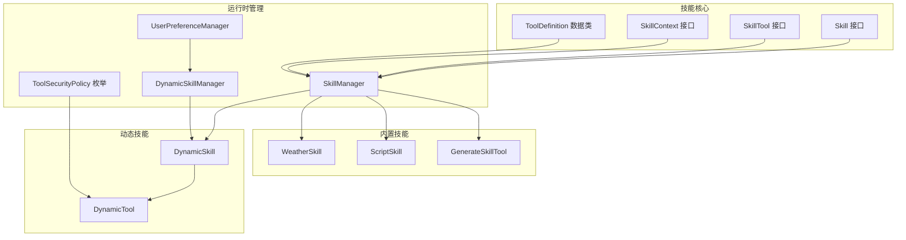
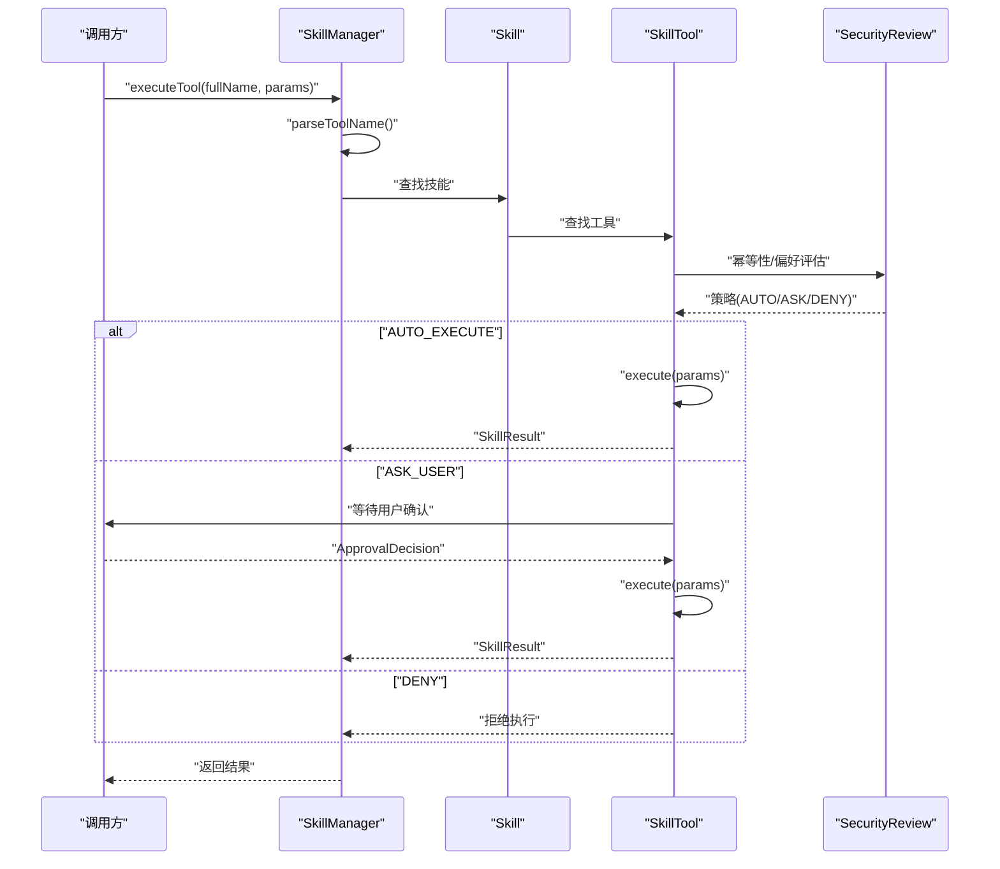
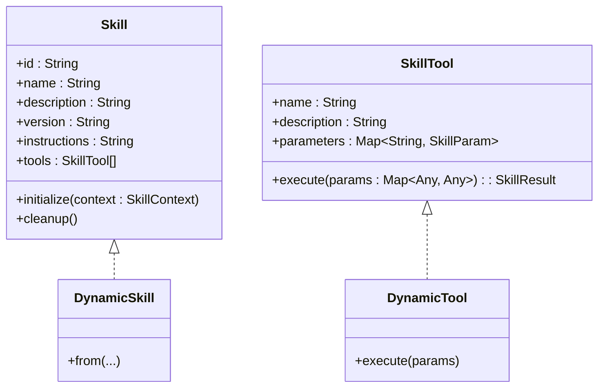
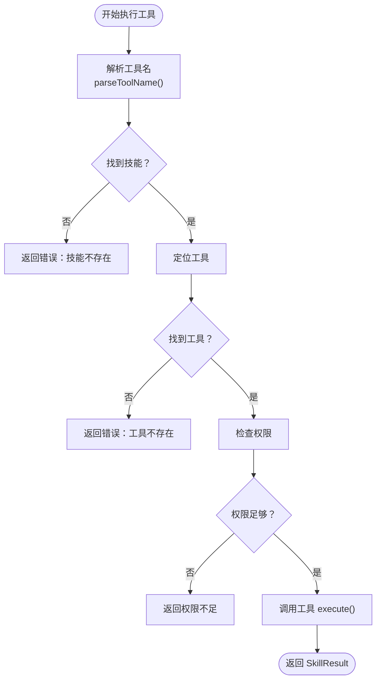
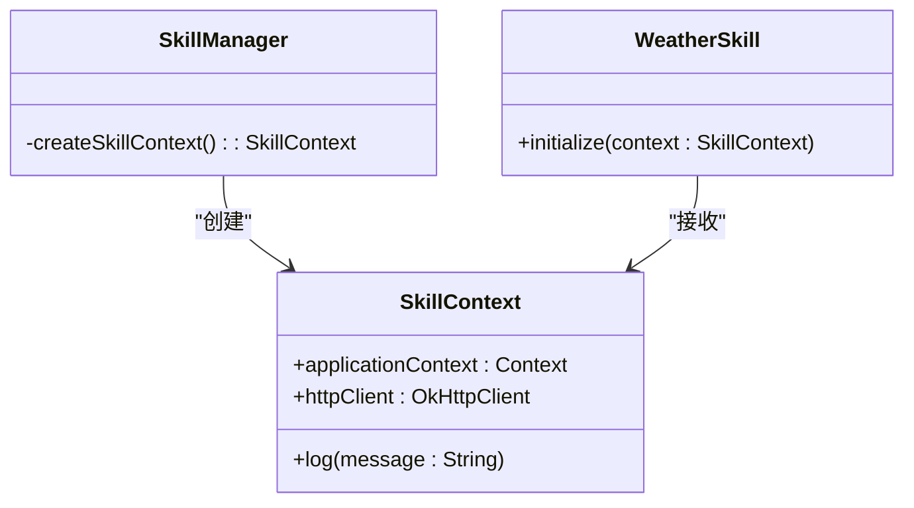
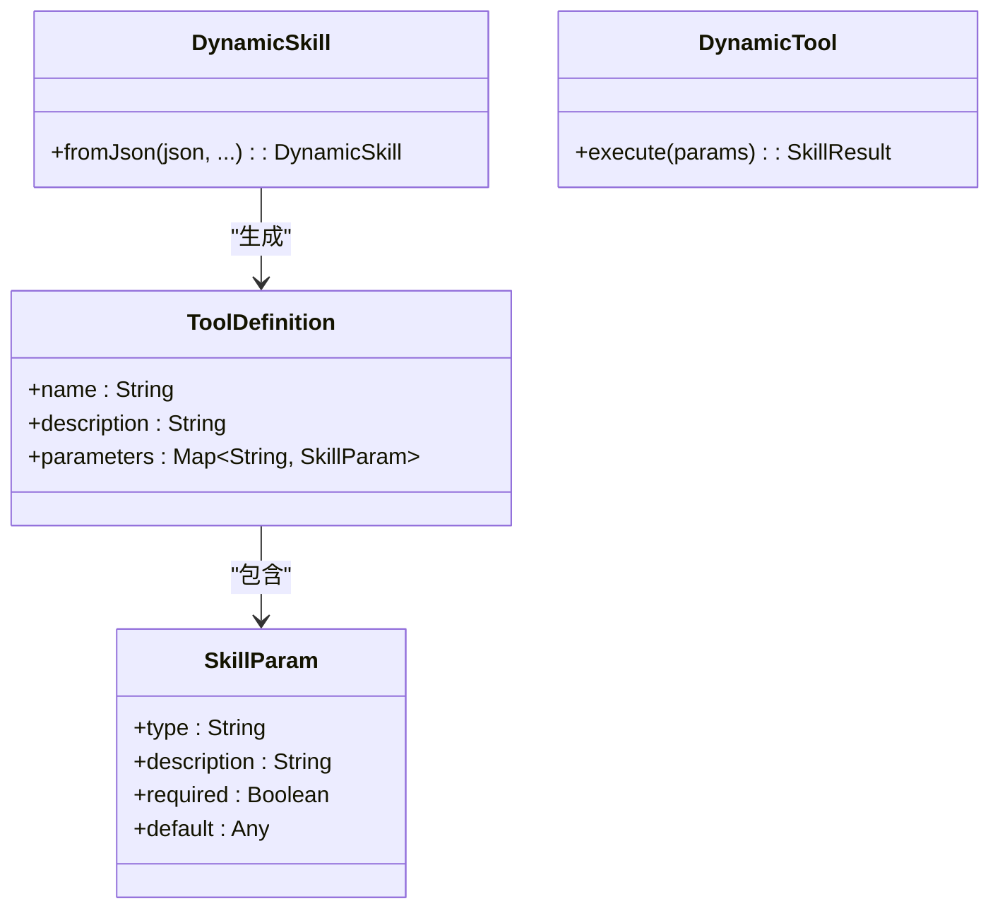
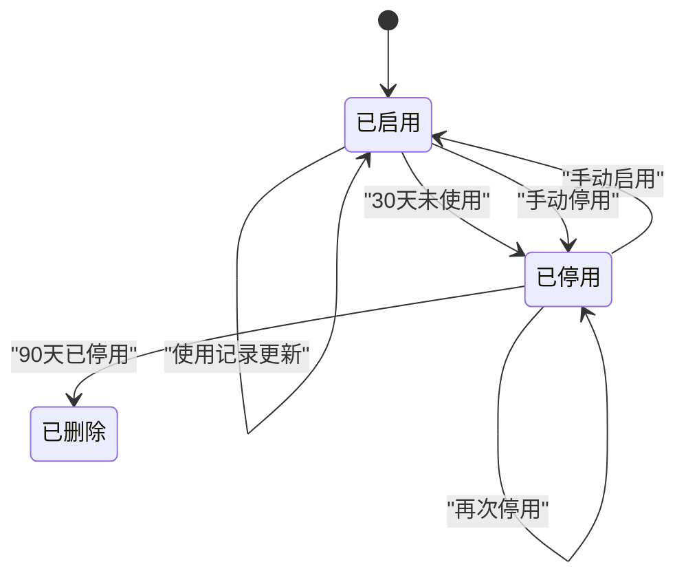
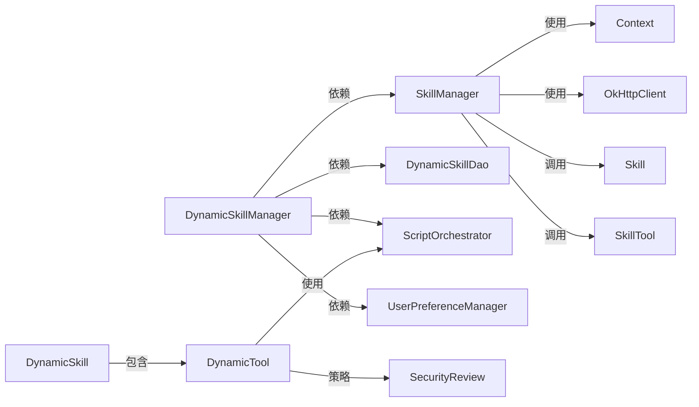

# 技能架构设计

<cite>
**本文引用的文件**
- [Skill.kt](file://app/src/main/java/ai/openclaw/android/skill/Skill.kt)
- [SkillManager.kt](file://app/src/main/java/ai/openclaw/android/skill/SkillManager.kt)
- [SkillContext.kt](file://app/src/main/java/ai/openclaw/android/skill/SkillContext.kt)
- [SkillTool.kt](file://app/src/main/java/ai/openclaw/android/skill/SkillTool.kt)
- [DynamicSkillManager.kt](file://app/src/main/java/ai/openclaw/android/skill/DynamicSkillManager.kt)
- [DynamicSkill.kt](file://app/src/main/java/ai/openclaw/android/skill/DynamicSkill.kt)
- [ToolSecurityPolicy.kt](file://app/src/main/java/ai/openclaw/android/skill/ToolSecurityPolicy.kt)
- [UserPreferenceManager.kt](file://app/src/main/java/ai/openclaw/android/skill/UserPreferenceManager.kt)
- [WeatherSkill.kt](file://app/src/main/java/ai/openclaw/android/skill/builtin/WeatherSkill.kt)
- [ScriptSkill.kt](file://app/src/main/java/ai/openclaw/android/skill/builtin/ScriptSkill.kt)
- [GenerateSkillTool.kt](file://app/src/main/java/ai/openclaw/android/skill/builtin/GenerateSkillTool.kt)
- [SkillManagerTest.kt](file://app/src/test/java/ai/openclaw/android/skill/SkillManagerTest.kt)
- [DynamicSkillManagerTest.kt](file://app/src/test/java/ai/openclaw/android/skill/DynamicSkillManagerTest.kt)
- [skill-schema-v1.md](file://docs/skill-schema-v1.md)
</cite>

## 目录
1. [简介](#简介)
2. [项目结构](#项目结构)
3. [核心组件](#核心组件)
4. [架构总览](#架构总览)
5. [详细组件分析](#详细组件分析)
6. [依赖关系分析](#依赖关系分析)
7. [性能考量](#性能考量)
8. [故障排查指南](#故障排查指南)
9. [结论](#结论)
10. [附录](#附录)

## 简介
本文件系统性阐述 OpenClaw-Android 的技能架构设计，围绕 Skill 接口、SkillManager 技能注册与执行、SkillContext 上下文传递、工具定义与参数校验、动态技能生命周期与安全策略、以及版本兼容与扩展策略展开。文档同时提供开发模板与最佳实践，帮助开发者快速、安全地扩展智能体能力。

## 项目结构
技能相关代码主要位于 app 模块的 ai.openclaw.android.skill 包及其子包 builtin 中，配合脚本引擎模块 script 实现动态技能执行；测试用例覆盖静态与动态技能管理的关键行为。

**图表来源**
- [Skill.kt:1-13](file://app/src/main/java/ai/openclaw/android/skill/Skill.kt#L1-L13)
- [SkillTool.kt:1-22](file://app/src/main/java/ai/openclaw/android/skill/SkillTool.kt#L1-L22)
- [SkillContext.kt:1-10](file://app/src/main/java/ai/openclaw/android/skill/SkillContext.kt#L1-L10)
- [SkillManager.kt:1-193](file://app/src/main/java/ai/openclaw/android/skill/SkillManager.kt#L1-L193)
- [DynamicSkillManager.kt:1-202](file://app/src/main/java/ai/openclaw/android/skill/DynamicSkillManager.kt#L1-L202)
- [DynamicSkill.kt:1-221](file://app/src/main/java/ai/openclaw/android/skill/DynamicSkill.kt#L1-L221)
- [ToolSecurityPolicy.kt:1-72](file://app/src/main/java/ai/openclaw/android/skill/ToolSecurityPolicy.kt#L1-L72)
- [UserPreferenceManager.kt:1-100](file://app/src/main/java/ai/openclaw/android/skill/UserPreferenceManager.kt#L1-L100)
- [WeatherSkill.kt:1-399](file://app/src/main/java/ai/openclaw/android/skill/builtin/WeatherSkill.kt#L1-L399)
- [ScriptSkill.kt:1-134](file://app/src/main/java/ai/openclaw/android/skill/builtin/ScriptSkill.kt#L1-L134)
- [GenerateSkillTool.kt:1-88](file://app/src/main/java/ai/openclaw/android/skill/builtin/GenerateSkillTool.kt#L1-L88)

**章节来源**
- [SkillManager.kt:1-193](file://app/src/main/java/ai/openclaw/android/skill/SkillManager.kt#L1-L193)
- [DynamicSkillManager.kt:1-202](file://app/src/main/java/ai/openclaw/android/skill/DynamicSkillManager.kt#L1-L202)

## 核心组件
- Skill 接口：统一技能元数据与生命周期（初始化、清理），声明工具集合。
- SkillTool 接口：统一工具元数据与异步执行协议。
- SkillContext 接口：向技能注入应用上下文、HTTP 客户端与日志能力。
- ToolDefinition：对外暴露工具清单的标准化描述。
- SkillManager：内置技能注册、工具聚合、权限检查、工具执行与注销。
- DynamicSkillManager：动态技能的持久化、加载、启用/停用/删除、使用统计与定时维护。
- DynamicSkill/DynamicTool：从 JSON 定义动态创建技能与工具，集成安全策略与用户确认。
- ToolSecurityPolicy/UserPreferenceManager：基于幂等性与用户偏好的安全策略与持久化偏好。

**章节来源**
- [Skill.kt:1-13](file://app/src/main/java/ai/openclaw/android/skill/Skill.kt#L1-L13)
- [SkillTool.kt:1-22](file://app/src/main/java/ai/openclaw/android/skill/SkillTool.kt#L1-L22)
- [SkillContext.kt:1-10](file://app/src/main/java/ai/openclaw/android/skill/SkillContext.kt#L1-L10)
- [SkillManager.kt:1-193](file://app/src/main/java/ai/openclaw/android/skill/SkillManager.kt#L1-L193)
- [DynamicSkillManager.kt:1-202](file://app/src/main/java/ai/openclaw/android/skill/DynamicSkillManager.kt#L1-L202)
- [DynamicSkill.kt:1-221](file://app/src/main/java/ai/openclaw/android/skill/DynamicSkill.kt#L1-L221)
- [ToolSecurityPolicy.kt:1-72](file://app/src/main/java/ai/openclaw/android/skill/ToolSecurityPolicy.kt#L1-L72)
- [UserPreferenceManager.kt:1-100](file://app/src/main/java/ai/openclaw/android/skill/UserPreferenceManager.kt#L1-L100)

## 架构总览
技能体系采用“接口抽象 + 管理器编排 + 动态扩展”的分层设计。SkillManager 负责内置技能的注册与执行；DynamicSkillManager 负责动态技能的持久化与生命周期维护；SkillContext 为技能提供运行时依赖；DynamicSkill/DynamicTool 通过 ScriptOrchestrator 在沙箱中执行 JS 脚本，并结合 ToolSecurityPolicy 与 UserPreferenceManager 实现安全策略。

**图表来源**
- [SkillManager.kt:62-83](file://app/src/main/java/ai/openclaw/android/skill/SkillManager.kt#L62-L83)
- [DynamicSkill.kt:153-193](file://app/src/main/java/ai/openclaw/android/skill/DynamicSkill.kt#L153-L193)
- [ToolSecurityPolicy.kt:44-71](file://app/src/main/java/ai/openclaw/android/skill/ToolSecurityPolicy.kt#L44-L71)

## 详细组件分析

### Skill 接口与扩展机制
- 设计理念：以最小接口承载技能元数据与生命周期，便于内置与动态技能统一管理。
- 核心方法：
  - 元数据：id、name、description、version、instructions、tools
  - 生命周期：initialize(context)、cleanup()
- 扩展机制：
  - 内置技能：直接实现 Skill 接口，由 SkillManager 注册。
  - 动态技能：通过 DynamicSkill.from(...) 从 JSON 构造，内部包装 DynamicTool 列表。

**图表来源**
- [Skill.kt:1-13](file://app/src/main/java/ai/openclaw/android/skill/Skill.kt#L1-L13)
- [SkillTool.kt:1-22](file://app/src/main/java/ai/openclaw/android/skill/SkillTool.kt#L1-L22)
- [DynamicSkill.kt:22-46](file://app/src/main/java/ai/openclaw/android/skill/DynamicSkill.kt#L22-L46)
- [DynamicSkill.kt:130-138](file://app/src/main/java/ai/openclaw/android/skill/DynamicSkill.kt#L130-L138)

**章节来源**
- [Skill.kt:1-13](file://app/src/main/java/ai/openclaw/android/skill/Skill.kt#L1-L13)
- [DynamicSkill.kt:48-108](file://app/src/main/java/ai/openclaw/android/skill/DynamicSkill.kt#L48-L108)

### SkillManager：技能注册、发现与执行
- 注册与加载：
  - loadBuiltinSkills(context)：批量注册内置技能，调用各技能 initialize(context)。
  - registerSkill(skill)：对单个技能进行初始化并加入内存缓存。
- 工具发现：
  - getAllTools()：将技能 id 与工具名拼接为“skillId_toolName”，形成全局唯一工具名。
- 执行流程：
  - executeTool(fullName, params)：解析工具名、定位技能与工具、权限检查、调用工具执行。
- 权限管理：
  - checkSkillPermissions(skillId)：按技能映射检查 Android 权限，返回缺失权限列表。
- 生命周期：
  - unregisterSkill(skillId)：从内存移除并调用 cleanup()。

**图表来源**
- [SkillManager.kt:62-83](file://app/src/main/java/ai/openclaw/android/skill/SkillManager.kt#L62-L83)
- [SkillManager.kt:89-107](file://app/src/main/java/ai/openclaw/android/skill/SkillManager.kt#L89-L107)
- [SkillManager.kt:149-163](file://app/src/main/java/ai/openclaw/android/skill/SkillManager.kt#L149-L163)

**章节来源**
- [SkillManager.kt:13-38](file://app/src/main/java/ai/openclaw/android/skill/SkillManager.kt#L13-L38)
- [SkillManager.kt:40-48](file://app/src/main/java/ai/openclaw/android/skill/SkillManager.kt#L40-L48)
- [SkillManager.kt:50-60](file://app/src/main/java/ai/openclaw/android/skill/SkillManager.kt#L50-L60)
- [SkillManager.kt:62-83](file://app/src/main/java/ai/openclaw/android/skill/SkillManager.kt#L62-L83)
- [SkillManager.kt:89-107](file://app/src/main/java/ai/openclaw/android/skill/SkillManager.kt#L89-L107)
- [SkillManager.kt:119-138](file://app/src/main/java/ai/openclaw/android/skill/SkillManager.kt#L119-L138)
- [SkillManager.kt:182-186](file://app/src/main/java/ai/openclaw/android/skill/SkillManager.kt#L182-L186)

### SkillContext：上下文传递与依赖注入
- 提供：
  - 应用上下文：applicationContext
  - HTTP 客户端：OkHttpClient
  - 日志：log(message)
- 作用：
  - Skill.initialize(context) 时注入依赖（如 WeatherSkill 将 HTTP 客户端注入工具）。
  - SkillManager.createSkillContext() 以匿名对象形式提供统一实现。

**图表来源**
- [SkillContext.kt:1-10](file://app/src/main/java/ai/openclaw/android/skill/SkillContext.kt#L1-L10)
- [SkillManager.kt:165-173](file://app/src/main/java/ai/openclaw/android/skill/SkillManager.kt#L165-L173)
- [WeatherSkill.kt:389-394](file://app/src/main/java/ai/openclaw/android/skill/builtin/WeatherSkill.kt#L389-L394)

**章节来源**
- [SkillContext.kt:1-10](file://app/src/main/java/ai/openclaw/android/skill/SkillContext.kt#L1-L10)
- [SkillManager.kt:165-173](file://app/src/main/java/ai/openclaw/android/skill/SkillManager.kt#L165-L173)
- [WeatherSkill.kt:389-394](file://app/src/main/java/ai/openclaw/android/skill/builtin/WeatherSkill.kt#L389-L394)

### 工具定义与参数验证
- 工具定义结构：
  - ToolDefinition：name、description、parameters（Map<String, SkillParam>）
  - SkillParam：type、description、required、default
- 参数验证：
  - DynamicSkill.fromJson() 对工具参数进行解析与默认值填充。
  - DynamicTool.execute() 在执行前将参数序列化为 JS 可接受格式。
- 输出约定：
  - SkillResult：success、output、error，便于上层统一处理。

**图表来源**
- [SkillManager.kt:189-193](file://app/src/main/java/ai/openclaw/android/skill/SkillManager.kt#L189-L193)
- [SkillTool.kt:11-16](file://app/src/main/java/ai/openclaw/android/skill/SkillTool.kt#L11-L16)
- [DynamicSkill.kt:54-107](file://app/src/main/java/ai/openclaw/android/skill/DynamicSkill.kt#L54-L107)
- [DynamicSkill.kt:153-193](file://app/src/main/java/ai/openclaw/android/skill/DynamicSkill.kt#L153-L193)

**章节来源**
- [SkillManager.kt:189-193](file://app/src/main/java/ai/openclaw/android/skill/SkillManager.kt#L189-L193)
- [SkillTool.kt:11-16](file://app/src/main/java/ai/openclaw/android/skill/SkillTool.kt#L11-L16)
- [DynamicSkill.kt:54-107](file://app/src/main/java/ai/openclaw/android/skill/DynamicSkill.kt#L54-L107)
- [DynamicSkill.kt:153-193](file://app/src/main/java/ai/openclaw/android/skill/DynamicSkill.kt#L153-L193)

### 动态技能生命周期与安全策略
- 生命周期管理：
  - 注册：registerFromJson(json) → 持久化 + 运行时注册
  - 加载：loadAllSaved() → 启动时恢复
  - 维护：disableUnusedSkills()/purgeDisabledSkills()（30/90 天阈值）
  - 手动：enableSkill()/disableSkill()/removeSkill()
  - 使用记录：recordUsage(id) 更新 lastUsedAt
- 安全策略：
  - 幂等性优先：isIdempotent=true 自动执行
  - 首次询问：无偏好时 ASK_USER
  - 偏好持久化：UserPreferenceManager 持久化用户决策
  - 用户确认：onUserConfirmation 回调决定是否执行

**图表来源**
- [DynamicSkillManager.kt:122-147](file://app/src/main/java/ai/openclaw/android/skill/DynamicSkillManager.kt#L122-L147)
- [DynamicSkillManager.kt:171-178](file://app/src/main/java/ai/openclaw/android/skill/DynamicSkillManager.kt#L171-L178)
- [ToolSecurityPolicy.kt:44-71](file://app/src/main/java/ai/openclaw/android/skill/ToolSecurityPolicy.kt#L44-L71)
- [UserPreferenceManager.kt:34-52](file://app/src/main/java/ai/openclaw/android/skill/UserPreferenceManager.kt#L34-L52)

**章节来源**
- [DynamicSkillManager.kt:63-96](file://app/src/main/java/ai/openclaw/android/skill/DynamicSkillManager.kt#L63-L96)
- [DynamicSkillManager.kt:101-116](file://app/src/main/java/ai/openclaw/android/skill/DynamicSkillManager.kt#L101-L116)
- [DynamicSkillManager.kt:122-147](file://app/src/main/java/ai/openclaw/android/skill/DynamicSkillManager.kt#L122-L147)
- [DynamicSkillManager.kt:171-178](file://app/src/main/java/ai/openclaw/android/skill/DynamicSkillManager.kt#L171-L178)
- [ToolSecurityPolicy.kt:44-71](file://app/src/main/java/ai/openclaw/android/skill/ToolSecurityPolicy.kt#L44-L71)
- [UserPreferenceManager.kt:34-52](file://app/src/main/java/ai/openclaw/android/skill/UserPreferenceManager.kt#L34-L52)

### 版本兼容性与向后兼容策略
- 内置技能版本：
  - WeatherSkill.version = "2.0.0"，体现语义化版本管理，便于演进与迁移。
- 动态技能版本：
  - DynamicSkill.fromJson() 默认 version 缺省为 "1.0.0"，保证兼容性。
- 工具命名空间：
  - getAllTools() 生成 “skillId_toolName” 命名，避免同名冲突，提升向后兼容性。
- 权限映射：
  - SkillManager.getRequiredPermissionsForSkill(skillId) 以集中映射管理权限需求，便于未来扩展或变更。

**章节来源**
- [WeatherSkill.kt](file://app/src/main/java/ai/openclaw/android/skill/builtin/WeatherSkill.kt#L15)
- [DynamicSkill.kt](file://app/src/main/java/ai/openclaw/android/skill/DynamicSkill.kt#L68)
- [SkillManager.kt:50-60](file://app/src/main/java/ai/openclaw/android/skill/SkillManager.kt#L50-L60)
- [SkillManager.kt:119-138](file://app/src/main/java/ai/openclaw/android/skill/SkillManager.kt#L119-L138)

### 开发标准模板与最佳实践
- 内置技能模板要点：
  - 明确 id/name/description/version/instructions/tools
  - 在 initialize(context) 中注入依赖（如 HTTP 客户端）
  - 工具参数使用 SkillParam 描述，必要时提供默认值
  - 工具执行返回 SkillResult，确保成功/失败与错误信息清晰
- 动态技能模板要点：
  - JSON 定义包含 id/name/description/version/instructions/script/tools
  - tools[].parameters 使用 SkillParam 结构，entryPoint 指定 JS 函数名
  - 使用 isIdempotent 标注幂等操作，减少用户确认
  - 通过 UserPreferenceManager 与 onUserConfirmation 实现安全策略
- 最佳实践：
  - 优先幂等工具，减少交互成本
  - 严格参数校验与错误处理，输出结构化结果
  - 使用命名空间工具名，避免冲突
  - 权限最小化，仅在必要时申请敏感权限
  - 动态技能脚本遵循沙箱限制，避免高危操作

**章节来源**
- [WeatherSkill.kt:11-38](file://app/src/main/java/ai/openclaw/android/skill/builtin/WeatherSkill.kt#L11-L38)
- [WeatherSkill.kt:78-107](file://app/src/main/java/ai/openclaw/android/skill/builtin/WeatherSkill.kt#L78-L107)
- [DynamicSkill.kt:54-107](file://app/src/main/java/ai/openclaw/android/skill/DynamicSkill.kt#L54-L107)
- [GenerateSkillTool.kt:18-53](file://app/src/main/java/ai/openclaw/android/skill/builtin/GenerateSkillTool.kt#L18-L53)
- [ToolSecurityPolicy.kt:44-71](file://app/src/main/java/ai/openclaw/android/skill/ToolSecurityPolicy.kt#L44-L71)

## 依赖关系分析
- 组件耦合：
  - SkillManager 依赖 Android Context、OkHttpClient、权限检查工具
  - DynamicSkillManager 依赖 DAO、SkillManager、ScriptOrchestrator、UserPreferenceManager
  - DynamicSkill/DynamicTool 依赖 ScriptOrchestrator 与安全策略
- 外部依赖：
  - okhttp3：网络请求
  - kotlinx.serialization：JSON 解析与编码
  - 脚本引擎模块 script：JS 脚本执行与桥接

**图表来源**
- [SkillManager.kt:8-11](file://app/src/main/java/ai/openclaw/android/skill/SkillManager.kt#L8-L11)
- [DynamicSkillManager.kt:3-28](file://app/src/main/java/ai/openclaw/android/skill/DynamicSkillManager.kt#L3-L28)
- [DynamicSkill.kt:3-6](file://app/src/main/java/ai/openclaw/android/skill/DynamicSkill.kt#L3-L6)
- [ToolSecurityPolicy.kt:44-71](file://app/src/main/java/ai/openclaw/android/skill/ToolSecurityPolicy.kt#L44-L71)

**章节来源**
- [SkillManager.kt:8-11](file://app/src/main/java/ai/openclaw/android/skill/SkillManager.kt#L8-L11)
- [DynamicSkillManager.kt:3-28](file://app/src/main/java/ai/openclaw/android/skill/DynamicSkillManager.kt#L3-L28)
- [DynamicSkill.kt:3-6](file://app/src/main/java/ai/openclaw/android/skill/DynamicSkill.kt#L3-L6)

## 性能考量
- 工具解析优化：SkillManager.parseToolName() 优先最长匹配，避免短 ID 前缀误判。
- 权限检查：集中映射与一次性检查，减少重复 IO。
- 动态技能维护：定时任务批量停用/清理，降低运行时开销。
- 网络请求：共享 OkHttpClient，复用连接池。
- 脚本执行：限制脚本大小与执行超时，避免阻塞主线程。

[本节为通用建议，不直接分析具体文件]

## 故障排查指南
- 工具名解析失败：
  - 确认工具名为“skillId_toolName”格式，且 skillId 与已注册技能一致
  - 参考测试用例验证长 ID 前缀场景
- 权限不足：
  - 使用 checkSkillPermissions(skillId) 获取缺失权限列表
  - 为敏感技能（日历、联系人、短信、位置）申请相应权限
- 动态技能未生效：
  - 检查 registerFromJson() 返回值与数据库插入
  - 确认 loadAllSaved() 成功恢复
- 安全策略导致拒绝：
  - 检查 UserPreferenceManager 中的决策
  - 首次执行可能触发用户确认流程

**章节来源**
- [SkillManagerTest.kt:114-147](file://app/src/test/java/ai/openclaw/android/skill/SkillManagerTest.kt#L114-L147)
- [SkillManagerTest.kt:177-222](file://app/src/test/java/ai/openclaw/android/skill/SkillManagerTest.kt#L177-L222)
- [DynamicSkillManagerTest.kt:65-98](file://app/src/test/java/ai/openclaw/android/skill/DynamicSkillManagerTest.kt#L65-L98)
- [DynamicSkillManagerTest.kt:102-142](file://app/src/test/java/ai/openclaw/android/skill/DynamicSkillManagerTest.kt#L102-L142)

## 结论
该技能架构以 Skill/SkillTool/SkillContext 为核心抽象，结合 SkillManager 与 DynamicSkillManager 实现“内置技能 + 动态技能”的双轨运行模式。通过命名空间工具名、集中权限管理与安全策略，既保证了扩展性，又确保了安全性与可维护性。版本化与向后兼容策略使技能演进可控，测试用例覆盖关键路径，为稳定交付提供了保障。

[本节为总结性内容，不直接分析具体文件]

## 附录
- 技能 JSON Schema v1.0：定义了技能元数据、工具描述与执行器类型，支持 HTTP、Intent、ContentResolver、Location、Alarm、SMS、File 等执行器类型，为动态技能提供规范化的输入格式。

**章节来源**
- [skill-schema-v1.md:1-40](file://docs/skill-schema-v1.md#L1-L40)