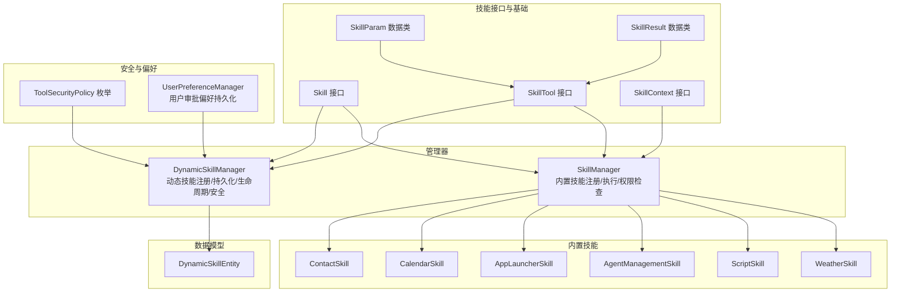
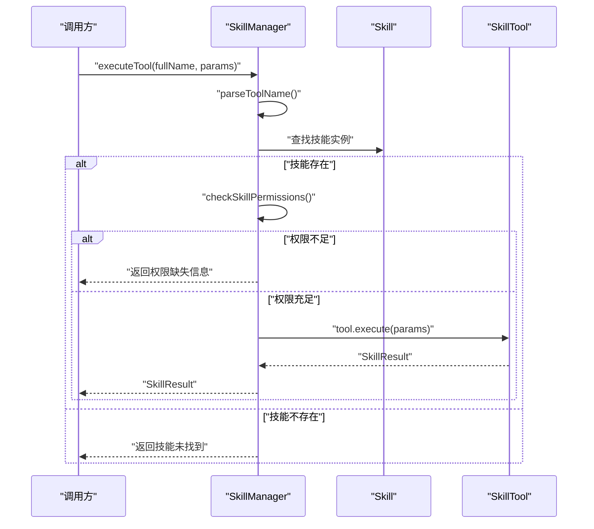
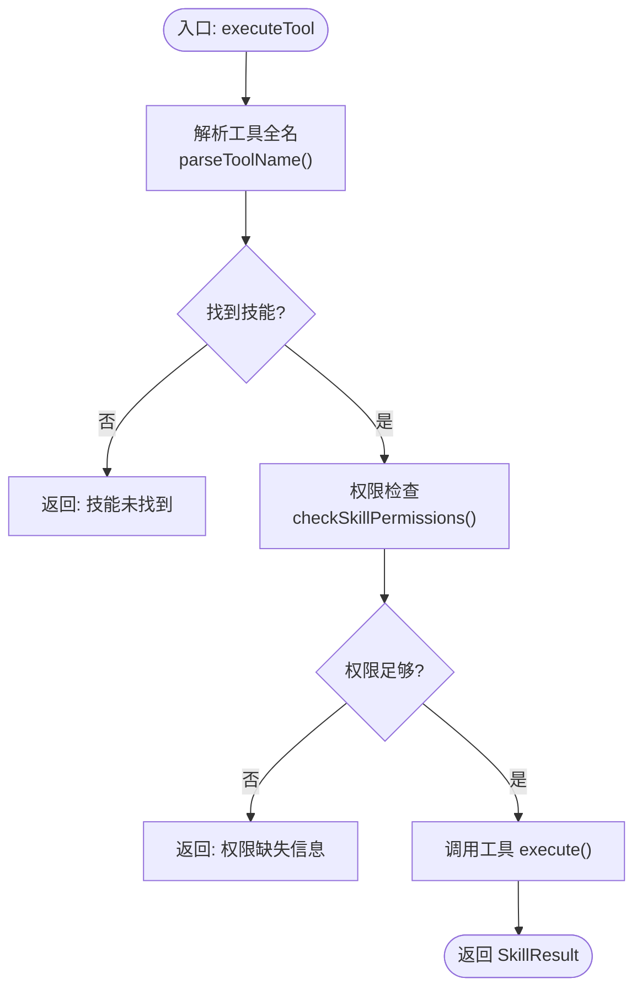
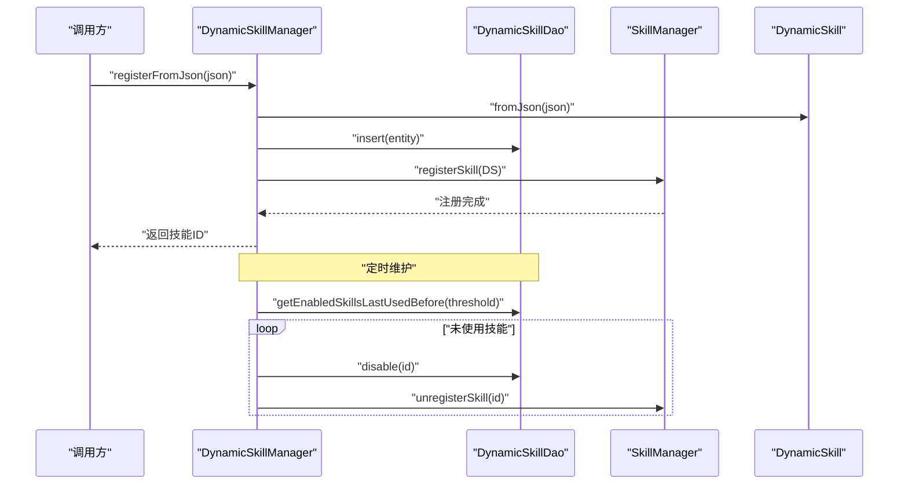
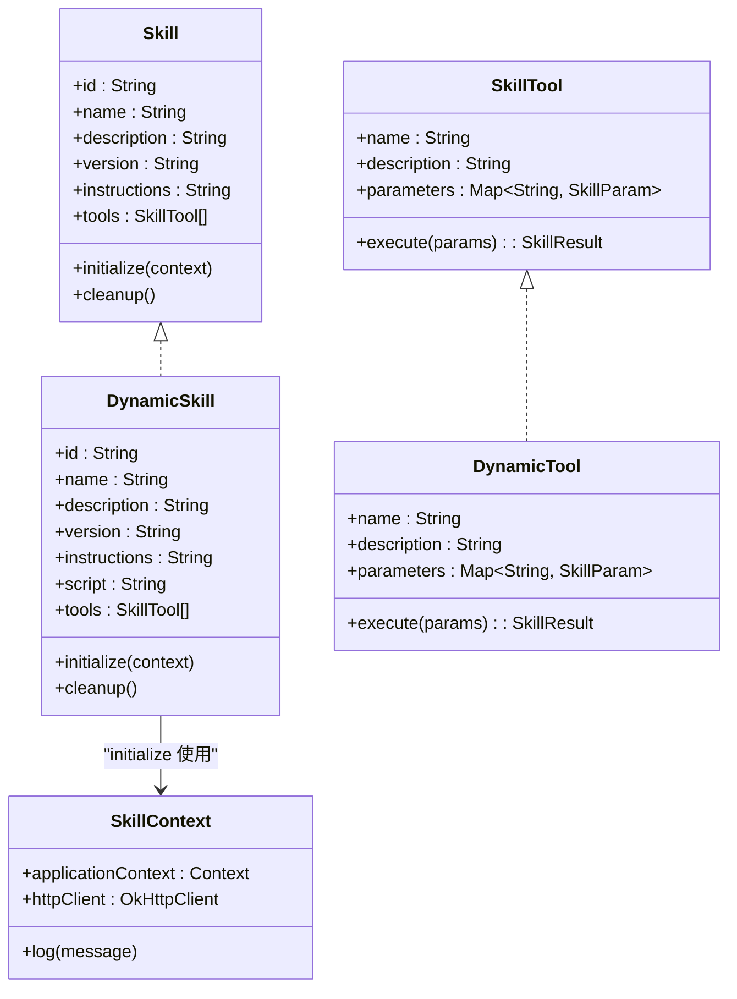
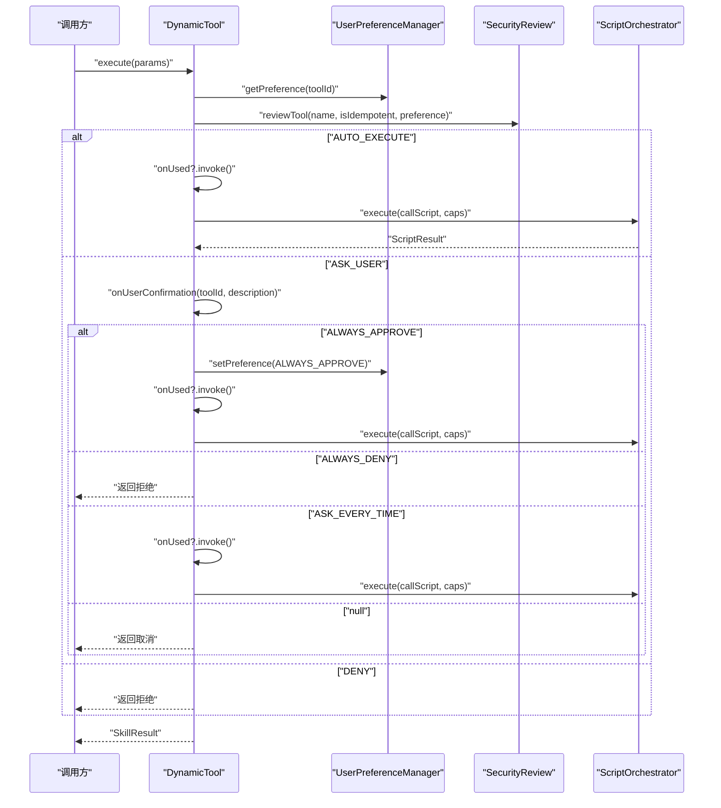
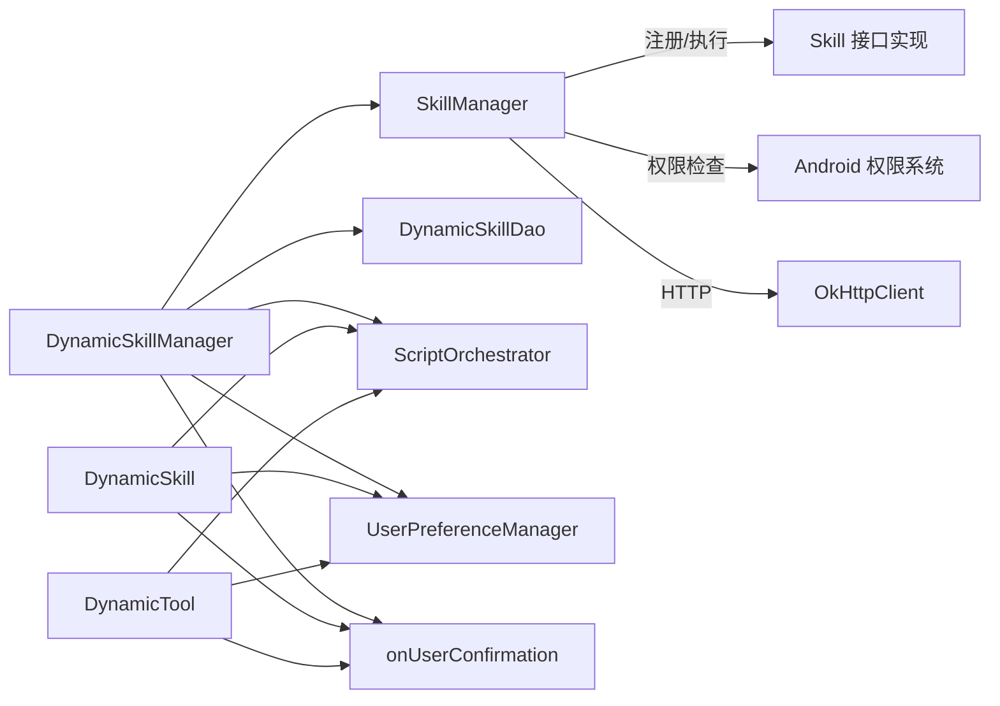

# 技能管理系统

<cite>
**本文引用的文件**
- [SkillManager.kt](file://app/src/main/java/ai/openclaw/android/skill/SkillManager.kt)
- [DynamicSkillManager.kt](file://app/src/main/java/ai/openclaw/android/skill/DynamicSkillManager.kt)
- [Skill.kt](file://app/src/main/java/ai/openclaw/android/skill/Skill.kt)
- [SkillTool.kt](file://app/src/main/java/ai/openclaw/android/skill/SkillTool.kt)
- [SkillContext.kt](file://app/src/main/java/ai/openclaw/android/skill/SkillContext.kt)
- [ToolSecurityPolicy.kt](file://app/src/main/java/ai/openclaw/android/skill/ToolSecurityPolicy.kt)
- [UserPreferenceManager.kt](file://app/src/main/java/ai/openclaw/android/skill/UserPreferenceManager.kt)
- [DynamicSkill.kt](file://app/src/main/java/ai/openclaw/android/skill/DynamicSkill.kt)
- [DynamicSkillEntity.kt](file://app/src/main/java/ai/openclaw/android/data/model/DynamicSkillEntity.kt)
- [WeatherSkill.kt](file://app/src/main/java/ai/openclaw/android/skill/builtin/WeatherSkill.kt)
- [ScriptSkill.kt](file://app/src/main/java/ai/openclaw/android/skill/builtin/ScriptSkill.kt)
- [AgentManagementSkill.kt](file://app/src/main/java/ai/openclaw/android/skill/builtin/AgentManagementSkill.kt)
- [AppLauncherSkill.kt](file://app/src/main/java/ai/openclaw/android/skill/builtin/AppLauncherSkill.kt)
- [CalendarSkill.kt](file://app/src/main/java/ai/openclaw/android/skill/builtin/CalendarSkill.kt)
- [ContactSkill.kt](file://app/src/main/java/ai/openclaw/android/skill/builtin/ContactSkill.kt)
</cite>

## 目录
1. [引言](#引言)
2. [项目结构](#项目结构)
3. [核心组件](#核心组件)
4. [架构总览](#架构总览)
5. [详细组件分析](#详细组件分析)
6. [依赖关系分析](#依赖关系分析)
7. [性能考量](#性能考量)
8. [故障排查指南](#故障排查指南)
9. [结论](#结论)
10. [附录](#附录)

## 引言
本文件面向技能管理系统的开发者与维护者，系统性阐述 Skill 接口设计理念、SkillManager 的技能注册/发现/执行机制、DynamicSkillManager 的动态技能加载与生命周期管理、12类内置技能的实现原理与使用方法，并深入解析权限管理、安全策略与沙箱机制。同时提供最佳实践、扩展指导、集成示例与调试技巧，帮助读者快速上手并构建稳定、可维护的技能生态。

## 项目结构
技能系统位于应用模块的 skill 包及其子包 builtin 中，配合数据层实体与脚本引擎模块协同工作。核心文件包括：
- 接口与基础类型：Skill、SkillTool、SkillContext、SkillParam、SkillResult
- 管理器：SkillManager（内置技能）、DynamicSkillManager（动态技能）
- 安全与偏好：ToolSecurityPolicy、UserPreferenceManager
- 内置技能：WeatherSkill、ScriptSkill、AgentManagementSkill、AppLauncherSkill、CalendarSkill、ContactSkill 等
- 数据模型：DynamicSkillEntity（Room 实体）

图表来源
- [SkillManager.kt:1-193](file://app/src/main/java/ai/openclaw/android/skill/SkillManager.kt#L1-L193)
- [DynamicSkillManager.kt:1-202](file://app/src/main/java/ai/openclaw/android/skill/DynamicSkillManager.kt#L1-L202)
- [Skill.kt:1-13](file://app/src/main/java/ai/openclaw/android/skill/Skill.kt#L1-L13)
- [SkillTool.kt:1-22](file://app/src/main/java/ai/openclaw/android/skill/SkillTool.kt#L1-L22)
- [SkillContext.kt:1-10](file://app/src/main/java/ai/openclaw/android/skill/SkillContext.kt#L1-L10)
- [ToolSecurityPolicy.kt:1-72](file://app/src/main/java/ai/openclaw/android/skill/ToolSecurityPolicy.kt#L1-L72)
- [UserPreferenceManager.kt:1-100](file://app/src/main/java/ai/openclaw/android/skill/UserPreferenceManager.kt#L1-L100)
- [DynamicSkillEntity.kt:1-22](file://app/src/main/java/ai/openclaw/android/data/model/DynamicSkillEntity.kt#L1-L22)

章节来源
- [SkillManager.kt:1-193](file://app/src/main/java/ai/openclaw/android/skill/SkillManager.kt#L1-L193)
- [DynamicSkillManager.kt:1-202](file://app/src/main/java/ai/openclaw/android/skill/DynamicSkillManager.kt#L1-L202)

## 核心组件
- Skill 接口：统一技能的标识、元信息、工具集合与生命周期钩子（initialize/cleanup），便于统一管理与扩展。
- SkillTool 接口：抽象工具的名称、描述、参数与异步执行能力。
- SkillContext：为技能提供应用上下文、HTTP 客户端与日志能力。
- SkillManager：负责内置技能的注册、工具发现、权限校验与执行调度。
- DynamicSkillManager：负责动态技能的 JSON 注册、持久化、启用/停用/删除、使用统计与定时维护。
- ToolSecurityPolicy：定义工具安全策略（自动执行、用户确认、拒绝）与用户审批偏好（总是允许/总是拒绝/每次都问）。
- UserPreferenceManager：以本地 JSON 文件持久化用户对工具的审批偏好。
- DynamicSkill/DynamicTool：将 LLM 生成的工具定义与脚本桥接到 Skill 体系，结合 ScriptOrchestrator 执行 JS 脚本。

章节来源
- [Skill.kt:1-13](file://app/src/main/java/ai/openclaw/android/skill/Skill.kt#L1-L13)
- [SkillTool.kt:1-22](file://app/src/main/java/ai/openclaw/android/skill/SkillTool.kt#L1-L22)
- [SkillContext.kt:1-10](file://app/src/main/java/ai/openclaw/android/skill/SkillContext.kt#L1-L10)
- [SkillManager.kt:1-193](file://app/src/main/java/ai/openclaw/android/skill/SkillManager.kt#L1-L193)
- [DynamicSkillManager.kt:1-202](file://app/src/main/java/ai/openclaw/android/skill/DynamicSkillManager.kt#L1-L202)
- [ToolSecurityPolicy.kt:1-72](file://app/src/main/java/ai/openclaw/android/skill/ToolSecurityPolicy.kt#L1-L72)
- [UserPreferenceManager.kt:1-100](file://app/src/main/java/ai/openclaw/android/skill/UserPreferenceManager.kt#L1-L100)
- [DynamicSkill.kt:1-221](file://app/src/main/java/ai/openclaw/android/skill/DynamicSkill.kt#L1-L221)

## 架构总览
技能系统采用“接口抽象 + 管理器编排 + 动态扩展 + 安全策略”的分层设计。SkillManager 负责内置技能的集中管理；DynamicSkillManager 负责动态技能的生命周期与安全控制；内置技能与动态技能均通过 Skill 接口统一暴露工具集，SkillManager 在执行前进行权限检查与工具解析，DynamicSkill 在执行前进行安全审查与用户确认。

图表来源
- [SkillManager.kt:62-83](file://app/src/main/java/ai/openclaw/android/skill/SkillManager.kt#L62-L83)

章节来源
- [SkillManager.kt:1-193](file://app/src/main/java/ai/openclaw/android/skill/SkillManager.kt#L1-L193)

## 详细组件分析

### SkillManager：技能注册、发现与执行
- 注册内置技能：在初始化阶段批量注册 12 类内置技能，统一调用 registerSkill 完成初始化与入库。
- 工具发现：getAllTools 将技能与其工具映射为 ToolDefinition，便于上层展示与路由。
- 执行流程：executeTool 解析工具全名（skillId_toolName），定位技能与工具，进行权限检查后执行。
- 权限管理：checkSkillPermissions 基于技能 ID 查询所需权限，结合 Context 检查实际授权状态，返回缺失权限列表。
- 上下文创建：createSkillContext 提供应用上下文、HTTP 客户端与日志能力给技能初始化。

图表来源
- [SkillManager.kt:62-83](file://app/src/main/java/ai/openclaw/android/skill/SkillManager.kt#L62-L83)
- [SkillManager.kt:89-107](file://app/src/main/java/ai/openclaw/android/skill/SkillManager.kt#L89-L107)

章节来源
- [SkillManager.kt:1-193](file://app/src/main/java/ai/openclaw/android/skill/SkillManager.kt#L1-L193)

### DynamicSkillManager：动态技能加载与安全管理
- JSON 注册：registerFromJson 从 JSON 解析技能定义，创建 DynamicSkill，持久化到数据库，再注册到 SkillManager。
- 启动加载：loadAllSaved 从数据库读取启用的动态技能，重建 DynamicSkill 并注册。
- 生命周期管理：disableUnusedSkills 与 purgeDisabledSkills 实现“30 天未使用停用”“90 天已停用删除”，记录 lastUsedAt。
- 手动控制：enableSkill/disableSkill/removeSkill 支持手动启用/停用/删除。
- 定时维护：runMaintenance 统一调度停用与清理。
- 安全联动：DynamicSkill 在执行前通过 SecurityReview 与 UserPreferenceManager 决策是否自动执行或弹窗确认。

图表来源
- [DynamicSkillManager.kt:63-96](file://app/src/main/java/ai/openclaw/android/skill/DynamicSkillManager.kt#L63-L96)
- [DynamicSkillManager.kt:122-147](file://app/src/main/java/ai/openclaw/android/skill/DynamicSkillManager.kt#L122-L147)

章节来源
- [DynamicSkillManager.kt:1-202](file://app/src/main/java/ai/openclaw/android/skill/DynamicSkillManager.kt#L1-L202)
- [DynamicSkillEntity.kt:1-22](file://app/src/main/java/ai/openclaw/android/data/model/DynamicSkillEntity.kt#L1-L22)

### Skill 接口与扩展点
- 设计理念：以最小接口承载技能元信息与工具集合，通过 initialize/cleanup 钩子注入外部依赖（如 HTTP 客户端、上下文）。
- 扩展点：
  - 新增内置技能：实现 Skill 接口，提供 tools 列表与 initialize/cleanup。
  - 新增动态技能：提供符合规范的 JSON（含 id/name/description/version/instructions/script/tools），由 DynamicSkill.fromJson 解析。
  - 新增工具：实现 SkillTool 接口，声明参数 Schema（SkillParam）与执行逻辑。

图表来源
- [Skill.kt:1-13](file://app/src/main/java/ai/openclaw/android/skill/Skill.kt#L1-L13)
- [SkillTool.kt:1-22](file://app/src/main/java/ai/openclaw/android/skill/SkillTool.kt#L1-L22)
- [SkillContext.kt:1-10](file://app/src/main/java/ai/openclaw/android/skill/SkillContext.kt#L1-L10)
- [DynamicSkill.kt:22-46](file://app/src/main/java/ai/openclaw/android/skill/DynamicSkill.kt#L22-L46)
- [DynamicSkill.kt:130-138](file://app/src/main/java/ai/openclaw/android/skill/DynamicSkill.kt#L130-L138)

章节来源
- [Skill.kt:1-13](file://app/src/main/java/ai/openclaw/android/skill/Skill.kt#L1-L13)
- [SkillTool.kt:1-22](file://app/src/main/java/ai/openclaw/android/skill/SkillTool.kt#L1-L22)
- [SkillContext.kt:1-10](file://app/src/main/java/ai/openclaw/android/skill/SkillContext.kt#L1-L10)
- [DynamicSkill.kt:1-221](file://app/src/main/java/ai/openclaw/android/skill/DynamicSkill.kt#L1-L221)

### 动态技能与脚本执行（ScriptSkill 与 DynamicSkill）
- ScriptSkill：提供 execute_script 工具，支持 fs/http/memory 能力，通过 ScriptOrchestrator 执行 JS 脚本，具备沙箱限制与超时控制。
- DynamicSkill：从 JSON 解析工具定义与脚本，封装为 DynamicTool，执行前进行安全审查与用户确认，必要时调用 onUserConfirmation 回调。

图表来源
- [DynamicSkill.kt:153-193](file://app/src/main/java/ai/openclaw/android/skill/DynamicSkill.kt#L153-L193)
- [ToolSecurityPolicy.kt:44-71](file://app/src/main/java/ai/openclaw/android/skill/ToolSecurityPolicy.kt#L44-L71)
- [ScriptSkill.kt:72-87](file://app/src/main/java/ai/openclaw/android/skill/builtin/ScriptSkill.kt#L72-L87)

章节来源
- [DynamicSkill.kt:1-221](file://app/src/main/java/ai/openclaw/android/skill/DynamicSkill.kt#L1-L221)
- [ToolSecurityPolicy.kt:1-72](file://app/src/main/java/ai/openclaw/android/skill/ToolSecurityPolicy.kt#L1-L72)
- [ScriptSkill.kt:1-134](file://app/src/main/java/ai/openclaw/android/skill/builtin/ScriptSkill.kt#L1-L134)

### 12 类内置技能实现概览与使用要点
- 天气查询（WeatherSkill）：支持中文/英文城市名，优先 wttr.in，失败回退 Open-Meteo，输出 A2UI 卡片。
- 应用启动（AppLauncherSkill）：按名称或包名启动应用，列出已安装应用。
- 日程管理（CalendarSkill）：查询与添加日历事件，依赖日历权限。
- 通讯录（ContactSkill）：搜索联系人、获取详情、拨打电话，依赖通讯录权限。
- 脚本引擎（ScriptSkill）：执行 JS 脚本，提供 fs/http/memory 能力桥接。
- Agent 管理（AgentManagementSkill）：列出、创建、删除、查看 Agent 配置。
- 其他内置技能（文件、通知、短信、设置、翻译、多搜索、提醒、位置等）：均遵循 Skill 接口，提供明确的工具参数与执行逻辑。

章节来源
- [WeatherSkill.kt:1-399](file://app/src/main/java/ai/openclaw/android/skill/builtin/WeatherSkill.kt#L1-L399)
- [AppLauncherSkill.kt:1-193](file://app/src/main/java/ai/openclaw/android/skill/builtin/AppLauncherSkill.kt#L1-L193)
- [CalendarSkill.kt:1-182](file://app/src/main/java/ai/openclaw/android/skill/builtin/CalendarSkill.kt#L1-L182)
- [ContactSkill.kt:1-243](file://app/src/main/java/ai/openclaw/android/skill/builtin/ContactSkill.kt#L1-L243)
- [ScriptSkill.kt:1-134](file://app/src/main/java/ai/openclaw/android/skill/builtin/ScriptSkill.kt#L1-L134)
- [AgentManagementSkill.kt:1-128](file://app/src/main/java/ai/openclaw/android/skill/builtin/AgentManagementSkill.kt#L1-L128)

### 权限管理、安全策略与沙箱机制
- 权限管理：SkillManager 对特定技能（日历、位置、联系人、短信）进行权限检查，返回缺失权限列表。
- 安全策略：ToolSecurityPolicy 定义自动执行、用户确认、拒绝三种策略；SecurityReview 结合幂等性与用户偏好决定策略。
- 用户偏好：UserPreferenceManager 以 JSON 文件持久化用户对工具的审批偏好，支持清除与批量清空。
- 沙箱机制：ScriptSkill 与 DynamicTool 通过 ScriptOrchestrator 执行 JS 脚本，限制导入/访问敏感对象，限制脚本大小与执行超时，限定文件操作范围。

章节来源
- [SkillManager.kt:89-138](file://app/src/main/java/ai/openclaw/android/skill/SkillManager.kt#L89-L138)
- [ToolSecurityPolicy.kt:1-72](file://app/src/main/java/ai/openclaw/android/skill/ToolSecurityPolicy.kt#L1-L72)
- [UserPreferenceManager.kt:1-100](file://app/src/main/java/ai/openclaw/android/skill/UserPreferenceManager.kt#L1-L100)
- [ScriptSkill.kt:37-52](file://app/src/main/java/ai/openclaw/android/skill/builtin/ScriptSkill.kt#L37-L52)
- [DynamicSkill.kt:195-219](file://app/src/main/java/ai/openclaw/android/skill/DynamicSkill.kt#L195-L219)

## 依赖关系分析
- SkillManager 依赖：
  - Android 上下文与权限系统（权限检查）
  - OkHttpClient（网络工具）
  - 内置技能实现（Weather、Calendar、Contact、AppLauncher、Script、AgentManagement 等）
- DynamicSkillManager 依赖：
  - DynamicSkillDao（Room 持久化）
  - SkillManager（运行时注册/注销）
  - ScriptOrchestrator（动态脚本执行）
  - UserPreferenceManager（用户偏好）
  - onUserConfirmation 回调（用户交互）
- DynamicSkill/DynamicTool 依赖：
  - ScriptOrchestrator（脚本执行）
  - UserPreferenceManager（偏好读取）
  - onUserConfirmation（首次确认）

图表来源
- [SkillManager.kt:1-193](file://app/src/main/java/ai/openclaw/android/skill/SkillManager.kt#L1-L193)
- [DynamicSkillManager.kt:1-202](file://app/src/main/java/ai/openclaw/android/skill/DynamicSkillManager.kt#L1-L202)
- [DynamicSkill.kt:1-221](file://app/src/main/java/ai/openclaw/android/skill/DynamicSkill.kt#L1-L221)

章节来源
- [SkillManager.kt:1-193](file://app/src/main/java/ai/openclaw/android/skill/SkillManager.kt#L1-L193)
- [DynamicSkillManager.kt:1-202](file://app/src/main/java/ai/openclaw/android/skill/DynamicSkillManager.kt#L1-L202)
- [DynamicSkill.kt:1-221](file://app/src/main/java/ai/openclaw/android/skill/DynamicSkill.kt#L1-L221)

## 性能考量
- 网络与 I/O：
  - SkillManager 的 HTTP 客户端复用，减少连接开销。
  - 动态技能维护在 IO 协程作用域执行，避免阻塞主线程。
- 内存与对象：
  - DynamicSkillManager 使用协程 SupervisorJob 管理生命周期，异常不影响其他任务。
  - UserPreferenceManager 采用内存缓存 Map，序列化写盘，降低频繁 IO。
- 执行效率：
  - 工具解析优先最长前缀匹配 skillId，避免歧义。
  - 动态技能按需启用，未使用技能定期停用/清理，降低常驻内存占用。

## 故障排查指南
- 技能未找到：
  - 检查工具全名格式（skillId_toolName），确认 SkillManager 已注册对应技能。
  - 参考路径：[SkillManager.kt:62-83](file://app/src/main/java/ai/openclaw/android/skill/SkillManager.kt#L62-L83)
- 权限不足：
  - 检查 getRequiredPermissionsForSkill 返回的权限数组，确认应用已授予相应权限。
  - 参考路径：[SkillManager.kt:119-138](file://app/src/main/java/ai/openclaw/android/skill/SkillManager.kt#L119-L138)
- 动态技能注册失败：
  - 核对 JSON 是否包含 id/name/description/script/tools 等字段。
  - 参考路径：[DynamicSkillManager.kt:63-96](file://app/src/main/java/ai/openclaw/android/skill/DynamicSkillManager.kt#L63-L96)
- 脚本执行错误：
  - 检查 capabilities 与沙箱限制，确认脚本大小与超时设置。
  - 参考路径：[ScriptSkill.kt:37-52](file://app/src/main/java/ai/openclaw/android/skill/builtin/ScriptSkill.kt#L37-L52)
- 用户偏好异常：
  - 检查 skill_approval_prefs.json 是否损坏或权限问题。
  - 参考路径：[UserPreferenceManager.kt:67-93](file://app/src/main/java/ai/openclaw/android/skill/UserPreferenceManager.kt#L67-L93)

章节来源
- [SkillManager.kt:62-138](file://app/src/main/java/ai/openclaw/android/skill/SkillManager.kt#L62-L138)
- [DynamicSkillManager.kt:63-96](file://app/src/main/java/ai/openclaw/android/skill/DynamicSkillManager.kt#L63-L96)
- [ScriptSkill.kt:37-52](file://app/src/main/java/ai/openclaw/android/skill/builtin/ScriptSkill.kt#L37-L52)
- [UserPreferenceManager.kt:67-93](file://app/src/main/java/ai/openclaw/android/skill/UserPreferenceManager.kt#L67-L93)

## 结论
技能管理系统通过清晰的接口抽象与分层设计，实现了内置技能与动态技能的统一管理。SkillManager 提供稳定的注册/发现/执行与权限控制，DynamicSkillManager 提供灵活的动态扩展与生命周期管理，配合安全策略与沙箱机制，确保系统在开放扩展的同时保持可控与安全。内置技能覆盖常用场景，为上层智能体提供即插即用的能力。

## 附录
- 最佳实践
  - 新增工具时，严格定义 SkillParam 的 type/description/required/default，提升 LLM 生成 JSON 的准确性。
  - 动态技能 JSON 必须包含 id/name/description/version/instructions/script/tools，确保可解析与可审计。
  - 对涉及敏感权限的工具，优先在 Skill.initialize 中注入 Context，并在执行前进行权限检查。
  - 使用 UserPreferenceManager 记录用户偏好，避免重复弹窗确认，提升用户体验。
- 扩展指导
  - 新增内置技能：实现 Skill 接口，提供 tools 列表与 initialize/cleanup。
  - 新增动态技能：提供符合规范的 JSON，交由 DynamicSkill.fromJson 解析。
  - 新增脚本工具：在 ScriptSkill 或 DynamicSkill 中扩展能力桥接（如 fs/http/memory）。
- 集成示例（步骤说明）
  - 注册内置技能：调用 SkillManager.loadBuiltinSkills()，内部会批量注册 12 类内置技能。
  - 注册动态技能：调用 DynamicSkillManager.registerFromJson(json)，返回技能 ID。
  - 执行工具：调用 SkillManager.executeTool("skillId_toolName", params)，等待 SkillResult。
  - 安全确认：若工具策略为 ASK_USER，需提供 onUserConfirmation 回调以处理用户决策。
- 调试技巧
  - 使用 SkillManager.createSkillContext 提供的日志接口，定位工具执行链路。
  - 检查 DynamicSkillEntity 的 lastUsedAt 字段，确认动态技能是否被正确启用与使用。
  - 在 UserPreferenceManager 中查看 skill_approval_prefs.json，核对用户偏好状态。