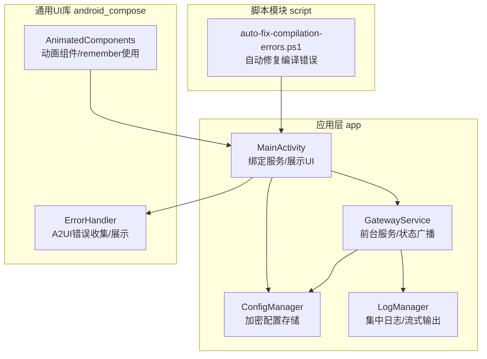
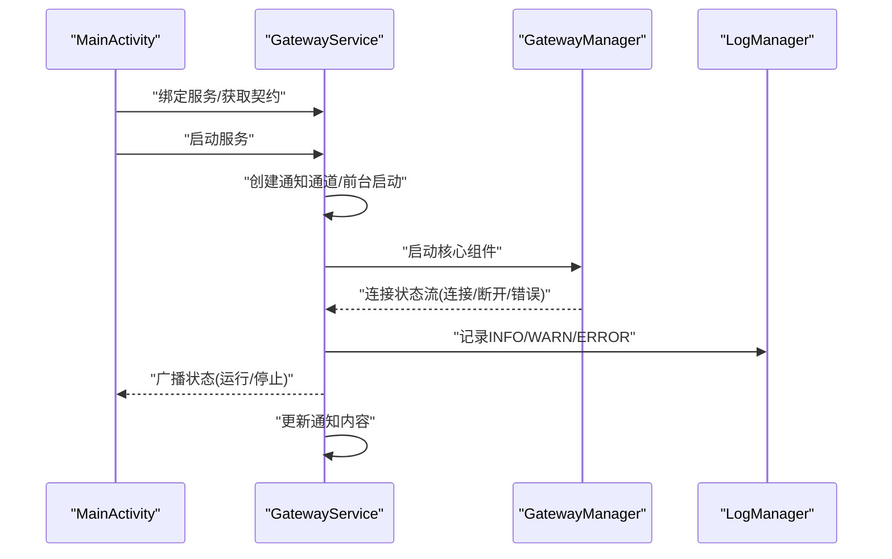
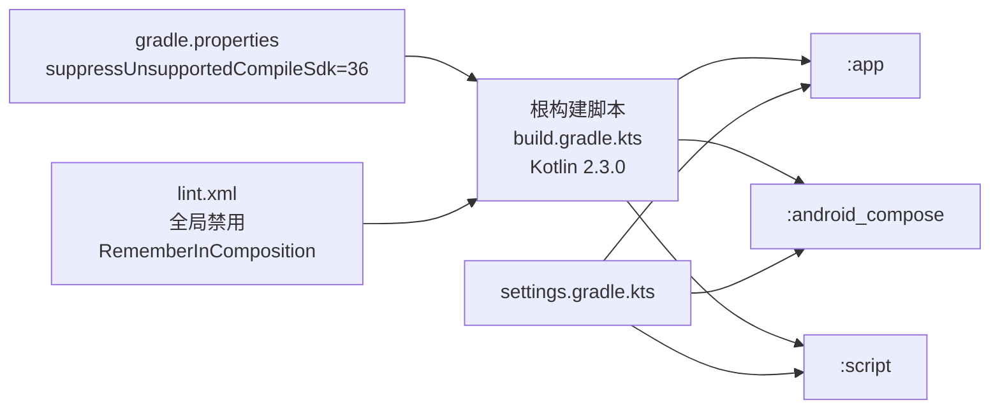
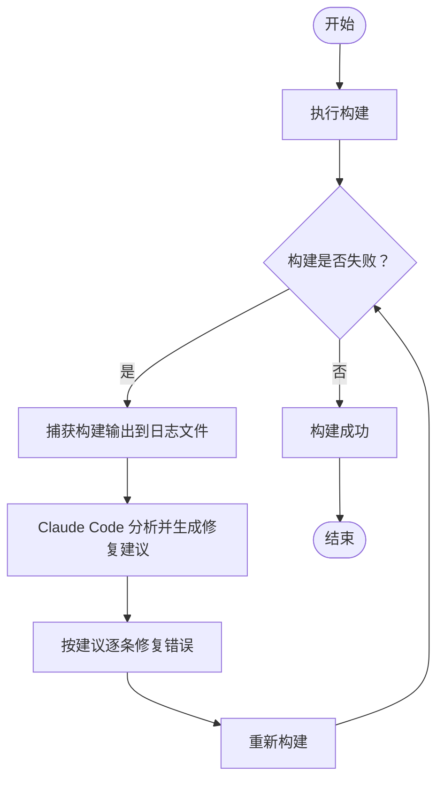

# 故障排除

<cite>
**本文引用的文件**
- [README.md](file://README.md)
- [build.gradle.kts](file://build.gradle.kts)
- [settings.gradle.kts](file://settings.gradle.kts)
- [android_compose/build.gradle.kts](file://android_compose/build.gradle.kts)
- [app/build.gradle.kts](file://app/build.gradle.kts)
- [gradle.properties](file://gradle.properties)
- [lint.xml](file://lint.xml)
- [android_compose/src/main/java/org/a2ui/compose/error/ErrorHandler.kt](file://android_compose/src/main/java/org/a2ui/compose/error/ErrorHandler.kt)
- [app/src/main/java/ai/openclaw/android/LogManager.kt](file://app/src/main/java/ai/openclaw/android/LogManager.kt)
- [app/src/main/java/ai/openclaw/android/GatewayService.kt](file://app/src/main/java/ai/openclaw/android/GatewayService.kt)
- [app/src/main/java/ai/openclaw/android/MainActivity.kt](file://app/src/main/java/ai/openclaw/android/MainActivity.kt)
- [scripts/auto-fix-compilation-errors.ps1](file://scripts/auto-fix-compilation-errors.ps1)
- [build_output.log](file://build_output.log)
- [app/src/main/java/ai/openclaw/android/ConfigManager.kt](file://app/src/main/java/ai/openclaw/android/ConfigManager.kt)
- [android_compose/src/main/java/org/a2ui/compose/animation/AnimatedComponents.kt](file://android_compose/src/main/java/org/a2ui/compose/animation/AnimatedComponents.kt)
- [app/src/main/java/ai/openclaw/android/ui/A2UICards.kt](file://app/src/main/java/ai/openclaw/android/ui/A2UICards.kt)
- [app/src/main/java/ai/openclaw/android/ui/SettingsScreen.kt](file://app/src/main/java/ai/openclaw/android/ui/SettingsScreen.kt)
</cite>

## 目录
1. [简介](#简介)
2. [项目结构](#项目结构)
3. [核心组件](#核心组件)
4. [架构总览](#架构总览)
5. [详细组件分析](#详细组件分析)
6. [依赖关系分析](#依赖关系分析)
7. [性能考虑](#性能考虑)
8. [故障排除指南](#故障排除指南)
9. [结论](#结论)
10. [附录](#附录)

## 简介
本指南面向开发者与运维人员，系统化梳理 OpenClaw-Android 在开发、构建、运行与维护阶段可能遇到的常见问题，覆盖编译错误、运行时异常、性能问题、日志分析、环境配置与依赖冲突等主题，并提供可操作的诊断步骤、修复方案与自动化辅助手段。文档同时给出架构视角下的定位方法与最佳实践，帮助快速恢复服务与稳定交付。

## 项目结构
项目采用多模块结构，核心模块包括应用层 app、通用 UI 组件库 android_compose、脚本模块 script，以及 GitHub Actions CI 流水线。应用层以"前台服务 + 绑定接口"的单源真相架构组织核心能力（LLM、会话、技能、记忆），UI 通过 GatewayContract 与服务交互，实现解耦与可扩展。

**图示来源**
- [README.md:1-191](file://README.md#L1-L191)
- [settings.gradle.kts:21-24](file://settings.gradle.kts#L21-L24)
- [build.gradle.kts:1-9](file://build.gradle.kts#L1-L9)
- [android_compose/src/main/java/org/a2ui/compose/animation/AnimatedComponents.kt:17-61](file://android_compose/src/main/java/org/a2ui/compose/animation/AnimatedComponents.kt#L17-L61)

**章节来源**
- [README.md:89-152](file://README.md#L89-L152)
- [settings.gradle.kts:1-24](file://settings.gradle.kts#L1-L24)
- [build.gradle.kts:1-9](file://build.gradle.kts#L1-L9)

## 核心组件
- 日志中枢：LogManager 提供统一日志入口，支持 UI 实时订阅与 Android Logcat 输出，便于端到端追踪。
- 错误处理：A2UI 错误体系与 DefaultErrorHandler 支持错误分类、严重级别、回收策略与 UI 展示。
- 服务与契约：GatewayService 作为前台服务承载核心状态；MainActivity 通过 GatewayContract 与之交互。
- 配置管理：ConfigManager 使用加密 SharedPreferences 存储敏感配置，提供初始化、校验与导出能力。
- 动画组件：AnimatedComponents 提供丰富的 Compose 动画组件，内部使用 remember 状态管理。

**章节来源**
- [app/src/main/java/ai/openclaw/android/LogManager.kt:1-65](file://app/src/main/java/ai/openclaw/android/LogManager.kt#L1-L65)
- [android_compose/src/main/java/org/a2ui/compose/error/ErrorHandler.kt:17-108](file://android_compose/src/main/java/org/a2ui/compose/error/ErrorHandler.kt#L17-L108)
- [app/src/main/java/ai/openclaw/android/GatewayService.kt:31-234](file://app/src/main/java/ai/openclaw/android/GatewayService.kt#L31-L234)
- [app/src/main/java/ai/openclaw/android/MainActivity.kt:75-207](file://app/src/main/java/ai/openclaw/android/MainActivity.kt#L75-L207)
- [app/src/main/java/ai/openclaw/android/ConfigManager.kt:11-171](file://app/src/main/java/ai/openclaw/android/ConfigManager.kt#L11-L171)
- [android_compose/src/main/java/org/a2ui/compose/animation/AnimatedComponents.kt:17-61](file://android_compose/src/main/java/org/a2ui/compose/animation/AnimatedComponents.kt#L17-L61)

## 架构总览
从架构角度，UI 仅负责展示与输入，核心逻辑集中在 GatewayService 的 GatewayManager 中，二者通过 Binder 与 GatewayContract 解耦。服务启动、状态变化与通知更新均在服务内完成，配置缺失或异常会通过日志与通知反馈给用户。

**图示来源**
- [app/src/main/java/ai/openclaw/android/MainActivity.kt:122-141](file://app/src/main/java/ai/openclaw/android/MainActivity.kt#L122-L141)
- [app/src/main/java/ai/openclaw/android/GatewayService.kt:75-234](file://app/src/main/java/ai/openclaw/android/GatewayService.kt#L75-L234)
- [app/src/main/java/ai/openclaw/android/LogManager.kt:23-45](file://app/src/main/java/ai/openclaw/android/LogManager.kt#L23-L45)

## 详细组件分析

### 日志系统（LogManager）
- 功能要点
  - 维护固定长度的日志队列，支持 FIFO 淘汰。
  - 通过 StateFlow 对外暴露日志流，供 UI 订阅。
  - 同步写入 Android Logcat，便于 adb/logcat 分析。
- 典型问题
  - 日志丢失：检查是否正确订阅 logs StateFlow 或未及时消费导致被淘汰。
  - 性能影响：大量高频日志可能导致 UI 卡顿，应降低日志粒度或频率。
- 诊断建议
  - 使用 adb logcat 过滤 TAG 与级别，结合时间戳定位问题。
  - 在关键路径（服务启动/停止、网络请求、内存操作）增加日志埋点。

**章节来源**
- [app/src/main/java/ai/openclaw/android/LogManager.kt:16-65](file://app/src/main/java/ai/openclaw/android/LogManager.kt#L16-L65)

### 错误处理（A2UI ErrorHandler）
- 错误类型与恢复策略
  - 网络错误：标记可恢复，但 UI 不直接提供重试按钮，需由上层提供重试逻辑。
  - 解析/验证/组件/状态/未知错误：分别映射严重级别与可恢复性。
- UI 表现
  - ErrorBanner/ErrorScreen 提供分级图标、颜色与可选重试按钮。
- 诊断建议
  - 优先查看错误列表与严重级别，再根据类型决定是重试还是引导用户检查配置。

**章节来源**
- [android_compose/src/main/java/org/a2ui/compose/error/ErrorHandler.kt:17-108](file://android_compose/src/main/java/org/a2ui/compose/error/ErrorHandler.kt#L17-L108)
- [android_compose/src/main/java/org/a2ui/compose/error/ErrorHandler.kt:110-245](file://android_compose/src/main/java/org/a2ui/compose/error/ErrorHandler.kt#L110-L245)

### 服务与契约（GatewayService / GatewayContract）
- 关键行为
  - 前台服务启动/停止、通知更新、状态广播。
  - 启动前检查配置完整性，异常时更新通知并保持安全状态。
- 诊断建议
  - 若服务未运行：检查通知栏状态、广播接收与 ConfigManager 初始化。
  - 若连接失败：查看日志中的 ERROR 级别消息与状态广播。

**章节来源**
- [app/src/main/java/ai/openclaw/android/GatewayService.kt:31-234](file://app/src/main/java/ai/openclaw/android/GatewayService.kt#L31-L234)
- [app/src/main/java/ai/openclaw/android/MainActivity.kt:122-141](file://app/src/main/java/ai/openclaw/android/MainActivity.kt#L122-L141)

### 配置管理（ConfigManager）
- 加密存储
  - 使用 AndroidX EncryptedSharedPreferences 存储敏感信息（如 API Key）。
- 校验与导出
  - isConfigured 用于判断是否具备有效凭据；exportConfig 便于问题排查时导出非敏感配置。
- 诊断建议
  - 若服务提示"配置不完整"，优先检查加密偏好是否成功初始化与凭据是否为空。

**章节来源**
- [app/src/main/java/ai/openclaw/android/ConfigManager.kt:11-171](file://app/src/main/java/ai/openclaw/android/ConfigManager.kt#L11-L171)

### 动画组件（AnimatedComponents）
- 功能要点
  - 提供 AnimatedCard、AnimatedText、AnimatedButton 等动画组件。
  - 内部使用 remember 状态管理实现流畅的动画效果。
- 典型问题
  - RememberInComposition lint 错误：在 Kotlin 2.3.0 中，rememberInComposition lint 检测器可能报告状态管理相关的错误。
- 诊断与修复
  - 该问题已在 app 模块的 lint 配置中通过禁用 "RememberInComposition" 检测器解决。
  - 开发者无需手动修复，构建系统会自动跳过该检测器。
  - 项目中还通过 lint.xml 文件全局禁用了该检测器，确保所有模块的一致性。

**章节来源**
- [android_compose/src/main/java/org/a2ui/compose/animation/AnimatedComponents.kt:17-61](file://android_compose/src/main/java/org/a2ui/compose/animation/AnimatedComponents.kt#L17-L61)
- [app/build.gradle.kts:96-99](file://app/build.gradle.kts#L96-L99)
- [android_compose/build.gradle.kts:39-43](file://android_compose/build.gradle.kts#L39-L43)
- [lint.xml:1-6](file://lint.xml#L1-L6)

## 依赖关系分析
- 模块依赖
  - settings.gradle.kts 声明 app、android_compose、script 三个模块。
  - build.gradle.kts 统一声明 Android/Kotlin/Compose/KSP 插件版本。
- 仓库与解析
  - pluginManagement 与 dependencyResolutionManagement 明确仓库优先级与 FAIL_ON_PROJECT_REPOS 策略，有助于避免依赖漂移。
- Kotlin 2.3.0 兼容性
  - 根 build.gradle.kts 指定 Kotlin 版本为 2.3.0。
  - gradle.properties 设置 suppressUnsupportedCompileSdk=36 以兼容更高版本的 Android SDK。
  - 通过多种方式禁用 RememberInComposition lint 检测器，确保构建稳定性。
- 诊断建议
  - 依赖冲突：优先使用统一插件版本与仓库镜像，必要时启用 --info/--debug 获取详细依赖树。

**图示来源**
- [build.gradle.kts:1-8](file://build.gradle.kts#L1-L8)
- [settings.gradle.kts:11-24](file://settings.gradle.kts#L11-L24)
- [gradle.properties:7](file://gradle.properties#L7)
- [lint.xml:1-6](file://lint.xml#L1-L6)

**章节来源**
- [build.gradle.kts:1-8](file://build.gradle.kts#L1-L8)
- [settings.gradle.kts:11-24](file://settings.gradle.kts#L11-L24)
- [gradle.properties:7](file://gradle.properties#L7)
- [lint.xml:1-6](file://lint.xml#L1-L6)

## 性能考虑
- UI 渲染与资源
  - android_compose 提供渲染性能监控与内存压力检测工具，可用于识别帧率下降与 GC 压力。
  - AnimatedComponents 使用 remember 优化动画性能，减少不必要的重组。
- 建议
  - 在高负载场景（语音/大模型响应）降低日志频率、合并 UI 更新批次。
  - 定期观察内存使用比率，必要时触发系统 GC 并复位计数。

**章节来源**
- [android_compose/src/main/java/org/a2ui/compose/charts/performance/RenderOptimization.kt:471-523](file://android_compose/src/main/java/org/a2ui/compose/charts/performance/RenderOptimization.kt#L471-L523)
- [android_compose/src/main/java/org/a2ui/compose/animation/AnimatedComponents.kt:73-88](file://android_compose/src/main/java/org/a2ui/compose/animation/AnimatedComponents.kt#L73-L88)

## 故障排除指南

### 一、编译错误（Kotlin/Gradle）
- 常见症状
  - 编译任务失败，Gradle 报错并输出详细日志。
- 根因定位
  - build_output.log 展示了具体的 Kotlin 编译错误（如 unresolved reference、suspend 函数调用位置、类未实现抽象成员等）。
- 解决步骤
  - 清理缓存并重新构建：执行清理后再次构建。
  - 逐条修正错误：对照日志逐项修复未解析引用、函数签名与注解标注问题。
  - 使用自动化脚本：通过 PowerShell 脚本自动捕获构建输出并交由 Claude Code 分析修复建议。
- 自动化辅助
  - 脚本会保存构建错误到 build-errors.log 并调用 Claude Code 进行分析，便于快速定位修复方向。

**图示来源**
- [scripts/auto-fix-compilation-errors.ps1:1-27](file://scripts/auto-fix-compilation-errors.ps1#L1-L27)
- [build_output.log:115-193](file://build_output.log#L115-L193)

**章节来源**
- [build_output.log:115-193](file://build_output.log#L115-L193)
- [scripts/auto-fix-compilation-errors.ps1:1-27](file://scripts/auto-fix-compilation-errors.ps1#L1-L27)

### 二、运行时异常与服务状态问题
- 症状
  - UI 显示服务未就绪、聊天无响应、通知栏显示"配置不完整"或"错误"。
- 根因定位
  - GatewayService 在启动时检查 ConfigManager 是否配置完整，若不完整则记录警告并保持停止状态。
  - 日志中包含 INFO/WARN/ERROR 级别消息，可据此判断是配置缺失还是网络/模型加载异常。
- 处理步骤
  - 检查配置：确保已设置有效的模型提供商、名称与 API Key（或选择本地模式）。
  - 查看通知与日志：确认服务状态广播与通知文本是否一致。
  - 重启服务：在设置页切换服务开关，或通过代码调用启动/停止。
  - 导出配置：使用 ConfigManager.exportConfig 导出非敏感配置用于问题排查。

**章节来源**
- [app/src/main/java/ai/openclaw/android/GatewayService.kt:170-211](file://app/src/main/java/ai/openclaw/android/GatewayService.kt#L170-L211)
- [app/src/main/java/ai/openclaw/android/ConfigManager.kt:129-136](file://app/src/main/java/ai/openclaw/android/ConfigManager.kt#L129-L136)
- [app/src/main/java/ai/openclaw/android/LogManager.kt:23-45](file://app/src/main/java/ai/openclaw/android/LogManager.kt#L23-L45)

### 三、Kotlin 2.3.0 兼容性问题
- 症状
  - 构建过程中出现 RememberInComposition lint 检测器错误，特别是在使用 remember 状态管理的 Compose 组件时。
- 根因定位
  - Kotlin 2.3.0 引入了更严格的 rememberInComposition lint 规则，可能对现有的 remember 使用方式产生误报。
  - 项目中的 AnimatedComponents 等组件使用了 remember 状态管理，触发了该 lint 检测器。
  - 该问题是由于 Kotlin 2.3.0 内部 API 变化导致 lint 检测器崩溃。
- 解决步骤
  - **临时解决方案**：已在多个层面禁用了 "RememberInComposition" 检测器。
    - 在 app 模块的 lint 配置中禁用：`disable += "RememberInComposition"`
    - 在 android_compose 模块的 lint 配置中禁用：`disable += "RememberInComposition"`
    - 通过 lint.xml 文件全局禁用：`<issue id="RememberInComposition" severity="ignore" />`
  - **长期解决方案**：根据 Kotlin 官方文档和最佳实践，重构 remember 使用方式，确保状态管理符合新的 lint 规范。
  - **验证修复**：重新构建项目，确认 lint 错误已消失。
  - **监控升级**：关注 Kotlin 2.3.0 的后续版本，如果官方修复了该问题，可以移除禁用配置。

**更新** 新增了针对 Kotlin 2.3.0 RememberInComposition lint 检测器错误的专门章节，详细说明了多层禁用策略和长期迁移方案。

**章节来源**
- [app/build.gradle.kts:96-99](file://app/build.gradle.kts#L96-L99)
- [android_compose/build.gradle.kts:39-43](file://android_compose/build.gradle.kts#L39-L43)
- [lint.xml:1-6](file://lint.xml#L1-L6)
- [android_compose/src/main/java/org/a2ui/compose/animation/AnimatedComponents.kt:73-88](file://android_compose/src/main/java/org/a2ui/compose/animation/AnimatedComponents.kt#L73-L88)

### 四、日志分析与调试技巧
- 日志采集
  - 使用 adb logcat 过滤 TAG 与级别，结合时间戳定位问题发生时刻。
  - 在 UI 中订阅 LogManager.logs，实时观察服务端日志。
- 分析流程
  - 识别错误级别：ERROR 优先，WARM 次之，INFO 用于上下文。
  - 关联服务状态：关注服务启动/停止、连接状态变化与通知更新。
  - 结合错误处理器：查看 A2UI 错误列表与严重级别，指导下一步操作。
- 建议
  - 在关键路径增加日志埋点，避免过度日志导致性能问题。
  - 对高频事件进行采样或聚合，减少日志风暴。

**章节来源**
- [app/src/main/java/ai/openclaw/android/LogManager.kt:16-65](file://app/src/main/java/ai/openclaw/android/LogManager.kt#L16-L65)
- [android_compose/src/main/java/org/a2ui/compose/error/ErrorHandler.kt:17-108](file://android_compose/src/main/java/org/a2ui/compose/error/ErrorHandler.kt#L17-L108)

### 五、环境配置与依赖冲突
- 症状
  - 依赖解析失败、插件版本不匹配、仓库访问超时。
- 根因定位
  - settings.gradle.kts 中的仓库与解析策略可能引发冲突。
  - build.gradle.kts 中插件版本与项目实际需求不一致。
- 处理步骤
  - 统一插件版本：确保 Android/Kotlin/Compose/KSP 版本与项目兼容。
  - 明确仓库顺序：优先使用国内镜像，保证稳定性。
  - 启用详细日志：使用 --info/--debug 获取依赖树与冲突详情。
- 验证
  - 成功同步后执行一次干净构建，确认无重复依赖与版本漂移。

**章节来源**
- [settings.gradle.kts:11-24](file://settings.gradle.kts#L11-L24)
- [build.gradle.kts:1-8](file://build.gradle.kts#L1-L8)

### 六、性能问题（卡顿/掉帧/内存压力）
- 症状
  - UI 卡顿、帧率骤降、语音/模型处理延迟明显。
- 根因定位
  - android_compose 的性能监控工具可检测 FPS 与帧时间方差。
  - 内存压力检测器可评估当前内存使用比率并建议触发 GC。
  - AnimatedComponents 使用 remember 优化动画性能，但仍需注意状态管理开销。
- 处理步骤
  - 降低日志频率与 UI 更新频率，合并状态变更。
  - 在高负载场景主动触发 GC 并复位计数，观察内存使用回落。
  - 优化数据模型与渲染路径，减少不必要的重组与绘制。
  - 定期审查 remember 使用方式，确保符合 Kotlin 2.3.0 的 lint 规范。

**章节来源**
- [android_compose/src/main/java/org/a2ui/compose/charts/performance/RenderOptimization.kt:471-523](file://android_compose/src/main/java/org/a2ui/compose/charts/performance/RenderOptimization.kt#L471-L523)
- [android_compose/src/main/java/org/a2ui/compose/animation/AnimatedComponents.kt:73-88](file://android_compose/src/main/java/org/a2ui/compose/animation/AnimatedComponents.kt#L73-L88)

### 七、自动化故障检测与恢复
- 自动化脚本
  - PowerShell 脚本自动构建、捕获错误并调用 Claude Code 分析修复建议。
- 建议
  - 将脚本集成到 CI/本地开发流水线，实现"构建失败即分析"的闭环。
  - 在 PR 中强制执行脚本，确保编译错误在提交前被发现与修复。

**章节来源**
- [scripts/auto-fix-compilation-errors.ps1:1-27](file://scripts/auto-fix-compilation-errors.ps1#L1-L27)

### 八、社区支持与问题反馈
- 文档与计划
  - 项目包含多份设计文档与计划，便于理解系统演进与设计权衡。
- 建议
  - 在提交问题前先查阅相关文档与历史问题，避免重复。
  - 提供最小可复现步骤、日志片段与导出的配置信息，提高修复效率。

**章节来源**
- [README.md:1-191](file://README.md#L1-L191)

## 结论
通过统一的日志中枢、完善的错误处理、清晰的服务契约与加密配置管理，OpenClaw-Android 在开发与运行阶段具备良好的可观测性与可维护性。随着 Kotlin 2.3.0 的引入，项目已针对 RememberInComposition lint 检测器错误提供了多层防护措施，包括模块级禁用、全局配置和 XML 级别的禁用策略，确保构建稳定性。同时，项目还通过 lint.xml 文件提供了统一的 lint 配置管理，便于维护和升级。遵循本指南的诊断流程与最佳实践，可快速定位并修复编译、运行与性能问题，保障服务稳定与用户体验。

## 附录
- 快速检查清单
  - 构建：clean + assembleDebug，确认无 unresolved reference/suspend 调用错误。
  - 配置：isConfigured 返回 true，API Key/Provider 正确。
  - 服务：通知显示"已连接"，广播状态为运行。
  - 日志：ERROR/WARN 有明确上下文，INFO 有关键路径埋点。
  - 性能：FPS 稳定，内存使用比率合理，必要时触发 GC。
  - Kotlin 2.3.0：RememberInComposition lint 错误已通过多层禁用策略解决。
- 工具推荐
  - adb logcat：实时日志采集与过滤。
  - Gradle --info/--debug：依赖与构建细节。
  - PowerShell + Claude Code：自动化编译错误分析与修复建议。
- Kotlin 2.3.0 迁移建议
  - 监控官方更新，及时移除禁用配置。
  - 逐步重构 remember 使用方式，提升代码质量。
  - 建立 lint 规范检查，预防类似问题再次发生。