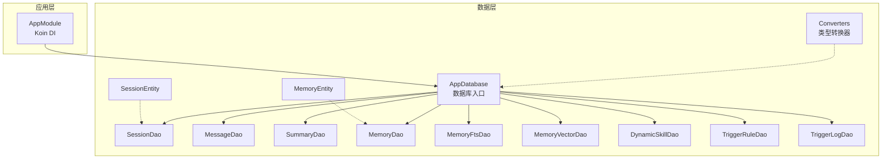
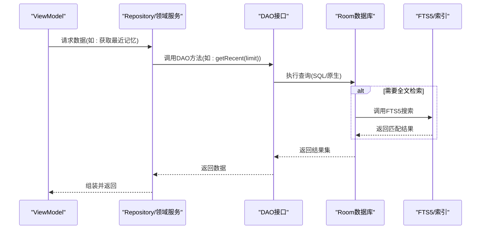
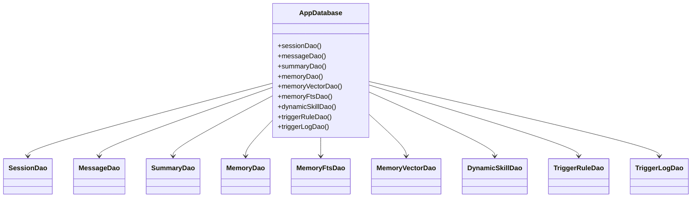
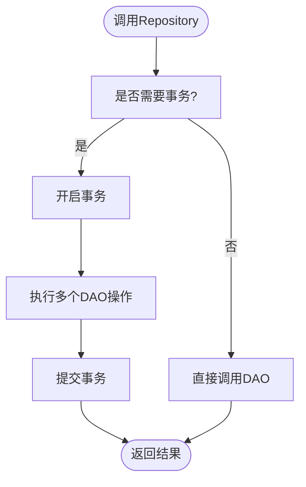

# DAO接口设计

<cite>
**本文引用的文件**
- [AppDatabase.kt](file://app/src/main/java/ai/openclaw/android/data/local/AppDatabase.kt)
- [DynamicSkillDao.kt](file://app/src/main/java/ai/openclaw/android/data/local/DynamicSkillDao.kt)
- [MemoryDao.kt](file://app/src/main/java/ai/openclaw/android/data/local/MemoryDao.kt)
- [MemoryFtsDao.kt](file://app/src/main/java/ai/openclaw/android/data/local/MemoryFtsDao.kt)
- [MemoryVectorDao.kt](file://app/src/main/java/ai/openclaw/android/data/local/MemoryVectorDao.kt)
- [MessageDao.kt](file://app/src/main/java/ai/openclaw/android/data/local/MessageDao.kt)
- [SessionDao.kt](file://app/src/main/java/ai/openclaw/android/data/local/SessionDao.kt)
- [SummaryDao.kt](file://app/src/main/java/ai/openclaw/android/data/local/SummaryDao.kt)
- [TriggerRuleDao.kt](file://app/src/main/java/ai/openclaw/android/trigger/dao/TriggerRuleDao.kt)
- [TriggerLogDao.kt](file://app/src/main/java/ai/openclaw/android/trigger/dao/TriggerLogDao.kt)
- [Converters.kt](file://app/src/main/java/ai/openclaw/android/data/local/Converters.kt)
- [AppModule.kt](file://app/src/main/java/ai/openclaw/android/di/AppModule.kt)
- [DynamicSkillDaoTest.kt](file://app/src/androidTest/java/ai/openclaw/android/data/DynamicSkillDaoTest.kt)
- [MemoryDaoTest.kt](file://app/src/androidTest/java/ai/openclaw/android/data/MemoryDaoTest.kt)
- [SessionDaoTest.kt](file://app/src/androidTest/java/ai/openclaw/android/data/SessionDaoTest.kt)
- [MemoryEntity.kt](file://app/src/main/java/ai/openclaw/android/data/model/MemoryEntity.kt)
- [SessionEntity.kt](file://app/src/main/java/ai/openclaw/android/data/model/SessionEntity.kt)
</cite>

## 目录
1. [简介](#简介)
2. [项目结构](#项目结构)
3. [核心组件](#核心组件)
4. [架构总览](#架构总览)
5. [详细组件分析](#详细组件分析)
6. [依赖关系分析](#依赖关系分析)
7. [性能考虑](#性能考虑)
8. [故障排查指南](#故障排查指南)
9. [结论](#结论)
10. [附录](#附录)

## 简介
本文件系统化梳理了本项目的DAO（数据访问对象）设计与实现，重点覆盖以下方面：
- 设计模式与抽象层次：基于Room的DAO接口如何抽象数据库访问、如何通过Flow实现响应式查询、以及如何通过类型转换器处理复杂字段。
- 方法定义与查询策略：各DAO接口提供的CRUD与定制查询方法、参数化查询与原生查询的组合使用。
- 复杂查询与性能优化：全文检索FTS5、向量相似度检索、分页与限制、索引与迁移策略。
- 事务管理与一致性：Room事务、冲突处理策略、加密数据库与回调初始化。
- 批量操作与异步查询：批量插入、批量删除、Flow流式订阅。
- 可扩展性与可测试性：DI注入、内存数据库测试、DAO接口边界清晰。
- 与Repository模式结合：DAO作为底层数据源，配合上层Repository进行业务封装。

## 项目结构
本项目采用“按功能域+按层”相结合的组织方式：
- 数据层（Room）：数据库定义、DAO接口、实体与类型转换器。
- 领域层（Domain）：业务逻辑与搜索引擎（如混合检索）。
- 应用层（App）：ViewModel、DI模块、服务与工具类。
- 触发器子系统：独立的触发规则与日志DAO，位于trigger包下。

图表来源
- [AppDatabase.kt:25-40](file://app/src/main/java/ai/openclaw/android/data/local/AppDatabase.kt#L25-L40)
- [Converters.kt:10-65](file://app/src/main/java/ai/openclaw/android/data/local/Converters.kt#L10-L65)
- [AppModule.kt:24-53](file://app/src/main/java/ai/openclaw/android/di/AppModule.kt#L24-L53)

章节来源
- [AppDatabase.kt:25-40](file://app/src/main/java/ai/openclaw/android/data/local/AppDatabase.kt#L25-L40)
- [AppModule.kt:24-53](file://app/src/main/java/ai/openclaw/android/di/AppModule.kt#L24-L53)

## 核心组件
- AppDatabase：Room数据库入口，声明所有DAO的访问方法，并负责数据库初始化、加密、迁移与FTS虚拟表创建。
- DAO接口族：围绕会话、消息、摘要、记忆、动态技能、触发规则与日志等实体提供统一的数据访问能力。
- 类型转换器：将枚举、列表、数组等非原生类型映射到Room可持久化的字符串或数组格式。
- DI模块：集中管理数据库单例与上层组件依赖注入。

章节来源
- [AppDatabase.kt:31-40](file://app/src/main/java/ai/openclaw/android/data/local/AppDatabase.kt#L31-L40)
- [Converters.kt:10-65](file://app/src/main/java/ai/openclaw/android/data/local/Converters.kt#L10-L65)
- [AppModule.kt:24-53](file://app/src/main/java/ai/openclaw/android/di/AppModule.kt#L24-L53)

## 架构总览
DAO层位于应用与Room之间，向上提供稳定的接口契约，向下屏蔽SQL细节与Room特性。典型调用链如下：

图表来源
- [MessageDao.kt:10-14](file://app/src/main/java/ai/openclaw/android/data/local/MessageDao.kt#L10-L14)
- [MemoryDao.kt:34-35](file://app/src/main/java/ai/openclaw/android/data/local/MemoryDao.kt#L34-L35)
- [MemoryFtsDao.kt:10-11](file://app/src/main/java/ai/openclaw/android/data/local/MemoryFtsDao.kt#L10-L11)
- [AppDatabase.kt:146-152](file://app/src/main/java/ai/openclaw/android/data/local/AppDatabase.kt#L146-L152)

## 详细组件分析

### AppDatabase：数据库与迁移
- 角色与职责
  - 声明所有DAO的访问方法，作为应用唯一数据库入口。
  - 初始化加密数据库（SqlCipher），配置迁移脚本与回退策略。
  - 在数据库打开时创建FTS5虚拟表，供全文检索使用。
- 关键点
  - 使用单例延迟初始化，线程安全。
  - 迁移脚本覆盖历史版本差异，确保schema演进。
  - 回退迁移策略保障降级场景可用性。
- 与DAO的关系
  - 各DAO接口由该数据库实例暴露，上层通过DI获取数据库后调用对应DAO。

章节来源
- [AppDatabase.kt:42-56](file://app/src/main/java/ai/openclaw/android/data/local/AppDatabase.kt#L42-L56)
- [AppDatabase.kt:58-130](file://app/src/main/java/ai/openclaw/android/data/local/AppDatabase.kt#L58-L130)
- [AppDatabase.kt:132-155](file://app/src/main/java/ai/openclaw/android/data/local/AppDatabase.kt#L132-L155)

### SessionDao：会话数据访问
- 查询策略
  - 按会话ID精确查询。
  - 插入、更新、删除单条记录。
  - 支持Flow订阅全部会话与按状态筛选的流式查询。
- 性能与一致性
  - 主键为字符串，避免自增带来的复杂性。
  - 使用Flow实现UI侧实时刷新。
- 扩展建议
  - 可增加按时间范围、状态聚合等查询。
  - 可引入Room事务以保证多步操作一致性。

章节来源
- [SessionDao.kt:9-31](file://app/src/main/java/ai/openclaw/android/data/local/SessionDao.kt#L9-L31)

### MessageDao：消息数据访问
- 查询策略
  - 基于会话ID排序查询，支持Flow与分页。
  - 批量插入与批量删除（按会话ID、按ID集合、按时间阈值）。
  - 聚合统计：消息总数与token总量。
- 异步与批量
  - 提供suspend方法以支持协程环境下的异步执行。
  - 批量插入与条件删除提升批量操作效率。
- 事务建议
  - 对于跨表或跨实体的一致性写入，建议在上层Repository中使用Room事务包裹。

章节来源
- [MessageDao.kt:7-42](file://app/src/main/java/ai/openclaw/android/data/local/MessageDao.kt#L7-L42)

### SummaryDao：摘要数据访问
- 查询策略
  - 按会话ID查询摘要，支持插入、更新、删除与按时间倒序流式查询。
- 适用场景
  - 适用于需要对长对话进行压缩摘要的场景，便于后续检索与展示。

章节来源
- [SummaryDao.kt:7-27](file://app/src/main/java/ai/openclaw/android/data/local/SummaryDao.kt#L7-L27)

### MemoryDao：记忆数据访问
- 查询策略
  - 按ID、ID集合、类型、高优先级、最近访问、修改时间范围等多维查询。
  - 访问统计：累计访问次数与最近访问时间。
  - 垃圾回收辅助：按阈值与最小访问次数筛选陈旧记忆。
- 性能优化
  - 多种索引与排序策略，满足不同查询场景。
  - 通过Flow实现UI侧增量更新。
- 扩展建议
  - 可结合FTS与向量检索实现混合搜索。

章节来源
- [MemoryDao.kt:11-49](file://app/src/main/java/ai/openclaw/android/data/local/MemoryDao.kt#L11-L49)

### MemoryFtsDao：全文检索DAO
- 查询策略
  - 使用@RawQuery执行原生查询，返回BM25评分结果。
- 适用场景
  - 配合AppDatabase在onOpen回调中创建的FTS5虚拟表，实现高效全文检索。
- 注意事项
  - 原生查询需谨慎构造，避免SQL注入；建议在上层封装查询构建逻辑。

章节来源
- [MemoryFtsDao.kt:8-12](file://app/src/main/java/ai/openclaw/android/data/local/MemoryFtsDao.kt#L8-L12)
- [AppDatabase.kt:149-151](file://app/src/main/java/ai/openclaw/android/data/local/AppDatabase.kt#L149-L151)

### MemoryVectorDao：向量数据访问
- 查询策略
  - 按记忆ID查询向量、最近更新向量、全量查询与按ID删除。
- 适用场景
  - 结合嵌入服务与混合检索引擎，实现语义相似度检索。
- 性能建议
  - 向量表规模较大时，建议控制查询范围与分页。

章节来源
- [MemoryVectorDao.kt:9-26](file://app/src/main/java/ai/openclaw/android/data/local/MemoryVectorDao.kt#L9-L26)

### DynamicSkillDao：动态技能数据访问
- 查询策略
  - 启用技能列表（按创建时间排序）、按ID查询、启用/禁用、最后使用时间更新、按阈值筛选陈旧/停用技能。
  - 批量删除与替换插入。
- 适用场景
  - 动态技能的生命周期管理与清理策略。
- 测试验证
  - 单测覆盖插入、查询、启用/禁用、替换、排序等关键路径。

章节来源
- [DynamicSkillDao.kt:7-47](file://app/src/main/java/ai/openclaw/android/data/local/DynamicSkillDao.kt#L7-L47)
- [DynamicSkillDaoTest.kt:40-229](file://app/src/androidTest/java/ai/openclaw/android/data/DynamicSkillDaoTest.kt#L40-L229)

### TriggerRuleDao / TriggerLogDao：触发器数据访问
- 查询策略
  - 规则：按ID、来源、启用状态、全量查询。
  - 日志：最近N条、按规则ID分页查询、按时间阈值清理。
- 适用场景
  - 事件驱动与自动化执行的规则与审计日志管理。

章节来源
- [TriggerRuleDao.kt:6-32](file://app/src/main/java/ai/openclaw/android/trigger/dao/TriggerRuleDao.kt#L6-L32)
- [TriggerLogDao.kt:6-20](file://app/src/main/java/ai/openclaw/android/trigger/dao/TriggerLogDao.kt#L6-L20)

### 类型转换器：Converters
- 能力范围
  - 枚举类型（会话状态、消息角色、记忆类型、事件来源、匹配模式）与字符串互转。
  - 列表与数组（字符串分隔、浮点数组）的序列化与反序列化。
- 价值
  - 使Room能够持久化复杂类型，减少上层转换成本。

章节来源
- [Converters.kt:10-65](file://app/src/main/java/ai/openclaw/android/data/local/Converters.kt#L10-L65)

### 实体模型：MemoryEntity / SessionEntity
- 字段设计
  - MemoryEntity：主键、内容、类型、优先级、来源、标签、时间戳、访问统计、版本号。
  - SessionEntity：主键（会话ID）、名称（可空表示默认会话）、时间戳、token数、状态。
- 影响
  - 影响DAO查询策略（如按优先级、时间排序、标签过滤）与索引设计。

章节来源
- [MemoryEntity.kt:6-18](file://app/src/main/java/ai/openclaw/android/data/model/MemoryEntity.kt#L6-L18)
- [SessionEntity.kt:6-14](file://app/src/main/java/ai/openclaw/android/data/model/SessionEntity.kt#L6-L14)

## 依赖关系分析

图表来源
- [AppDatabase.kt:32-40](file://app/src/main/java/ai/openclaw/android/data/local/AppDatabase.kt#L32-L40)

章节来源
- [AppDatabase.kt:32-40](file://app/src/main/java/ai/openclaw/android/data/local/AppDatabase.kt#L32-L40)

## 性能考虑
- 查询与索引
  - 通过合理使用LIMIT、ORDER BY与索引（如触发器表的索引）降低扫描开销。
  - 对高频查询字段建立索引，避免全表扫描。
- 分页与流式
  - 使用Flow实现响应式更新，避免频繁全量拉取。
  - 分页查询（带limit/offset）控制单次返回量。
- 全文检索与向量检索
  - FTS5适合关键词检索；向量检索适合语义相似度。
  - 建议在上层根据场景选择合适检索策略或混合检索。
- 批量操作
  - 批量插入/删除优于逐条操作，减少事务开销。
- 事务与一致性
  - 对于多步写入，建议在Repository层使用Room事务，确保原子性。
- 加密与I/O
  - SqlCipher带来额外CPU开销，建议在批量导入阶段临时关闭加密或合并写入。

## 故障排查指南
- 常见问题定位
  - 查询无结果：检查参数是否正确、索引是否存在、FTS表是否已创建。
  - 数据不一致：确认是否使用事务、冲突策略是否符合预期。
  - 性能异常：检查查询计划、是否缺少索引、是否进行了不必要的全表扫描。
- 单元测试参考
  - 通过内存数据库快速验证DAO行为，覆盖插入、查询、更新、删除、排序等路径。
- 诊断步骤
  - 启用Room日志（调试构建）观察SQL执行。
  - 使用事务包裹多步操作，确保一致性。
  - 对复杂查询添加LIMIT与索引，逐步缩小问题范围。

章节来源
- [DynamicSkillDaoTest.kt:40-229](file://app/src/androidTest/java/ai/openclaw/android/data/DynamicSkillDaoTest.kt#L40-L229)
- [MemoryDaoTest.kt:34-166](file://app/src/androidTest/java/ai/openclaw/android/data/MemoryDaoTest.kt#L34-L166)
- [SessionDaoTest.kt:34-154](file://app/src/androidTest/java/ai/openclaw/android/data/SessionDaoTest.kt#L34-L154)

## 结论
本项目的DAO层以Room为核心，通过清晰的接口抽象与完善的类型转换器，实现了对多实体的统一数据访问。结合Flow与原生查询，既满足了响应式UI需求，也兼顾了复杂检索场景。通过DI注入与单例数据库管理，DAO具备良好的可扩展性与可测试性。建议在上层Repository中进一步封装业务逻辑与事务管理，以实现DAO与Repository的协同演进。

## 附录

### DAO与Repository模式结合建议
- DAO：仅负责数据存取与简单查询，保持薄层。
- Repository：封装业务规则、事务管理、缓存与错误处理，向上提供领域友好的接口。
- 示例流程（以会话管理为例）

### DAO方法定义与查询策略一览
- SessionDao：按ID查询、CRUD、Flow订阅全部/按状态。
- MessageDao：按会话ID流式查询、分页、批量插入/删除、统计。
- SummaryDao：按会话ID查询、CRUD、流式查询。
- MemoryDao：按ID/类型/优先级/最近访问/修改时间范围查询、访问统计、陈旧清理。
- MemoryFtsDao：原生查询返回BM25结果。
- MemoryVectorDao：按记忆ID/最近更新查询、向量CRUD。
- DynamicSkillDao：启用列表、按ID查询/删除、启用/禁用、最后使用时间更新、阈值筛选。
- TriggerRuleDao/TriggerLogDao：规则查询与日志查询、清理。

章节来源
- [SessionDao.kt:9-31](file://app/src/main/java/ai/openclaw/android/data/local/SessionDao.kt#L9-L31)
- [MessageDao.kt:7-42](file://app/src/main/java/ai/openclaw/android/data/local/MessageDao.kt#L7-L42)
- [SummaryDao.kt:7-27](file://app/src/main/java/ai/openclaw/android/data/local/SummaryDao.kt#L7-L27)
- [MemoryDao.kt:11-49](file://app/src/main/java/ai/openclaw/android/data/local/MemoryDao.kt#L11-L49)
- [MemoryFtsDao.kt:8-12](file://app/src/main/java/ai/openclaw/android/data/local/MemoryFtsDao.kt#L8-L12)
- [MemoryVectorDao.kt:9-26](file://app/src/main/java/ai/openclaw/android/data/local/MemoryVectorDao.kt#L9-L26)
- [DynamicSkillDao.kt:7-47](file://app/src/main/java/ai/openclaw/android/data/local/DynamicSkillDao.kt#L7-L47)
- [TriggerRuleDao.kt:6-32](file://app/src/main/java/ai/openclaw/android/trigger/dao/TriggerRuleDao.kt#L6-L32)
- [TriggerLogDao.kt:6-20](file://app/src/main/java/ai/openclaw/android/trigger/dao/TriggerLogDao.kt#L6-L20)