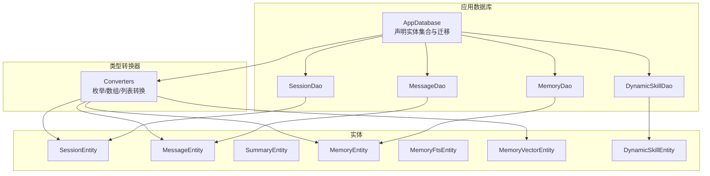
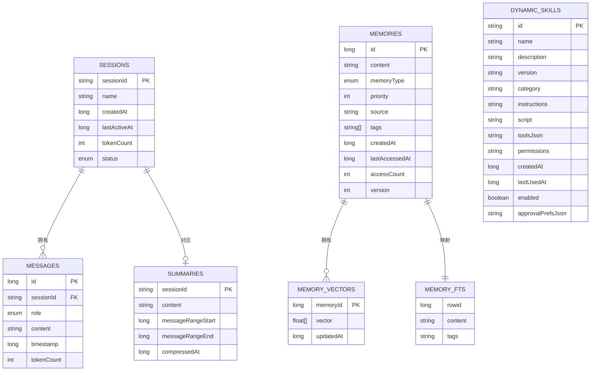
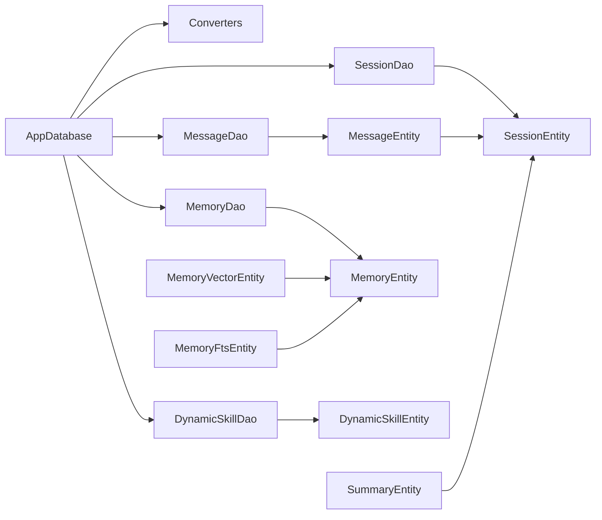

# 实体模型设计

<cite>
**本文引用的文件**
- [AppDatabase.kt](file://app/src/main/java/ai/openclaw/android/data/local/AppDatabase.kt)
- [Converters.kt](file://app/src/main/java/ai/openclaw/android/data/local/Converters.kt)
- [SessionEntity.kt](file://app/src/main/java/ai/openclaw/android/data/model/SessionEntity.kt)
- [MessageEntity.kt](file://app/src/main/java/ai/openclaw/android/data/model/MessageEntity.kt)
- [SummaryEntity.kt](file://app/src/main/java/ai/openclaw/android/data/model/SummaryEntity.kt)
- [MemoryEntity.kt](file://app/src/main/java/ai/openclaw/android/data/model/MemoryEntity.kt)
- [MemoryFtsEntity.kt](file://app/src/main/java/ai/openclaw/android/data/model/MemoryFtsEntity.kt)
- [MemoryVectorEntity.kt](file://app/src/main/java/ai/openclaw/android/data/model/MemoryVectorEntity.kt)
- [DynamicSkillEntity.kt](file://app/src/main/java/ai/openclaw/android/data/model/DynamicSkillEntity.kt)
- [SessionStatus.kt](file://app/src/main/java/ai/openclaw/android/data/model/SessionStatus.kt)
- [MessageRole.kt](file://app/src/main/java/ai/openclaw/android/data/model/MessageRole.kt)
- [MemoryType.kt](file://app/src/main/java/ai/openclaw/android/data/model/MemoryType.kt)
- [SessionDao.kt](file://app/src/main/java/ai/openclaw/android/data/local/SessionDao.kt)
- [MessageDao.kt](file://app/src/main/java/ai/openclaw/android/data/local/MessageDao.kt)
- [MemoryDao.kt](file://app/src/main/java/ai/openclaw/android/data/local/MemoryDao.kt)
- [DynamicSkillDao.kt](file://app/src/main/java/ai/openclaw/android/data/local/DynamicSkillDao.kt)
</cite>

## 目录
1. [引言](#引言)
2. [项目结构](#项目结构)
3. [核心组件](#核心组件)
4. [架构总览](#架构总览)
5. [详细组件分析](#详细组件分析)
6. [依赖分析](#依赖分析)
7. [性能考虑](#性能考虑)
8. [故障排查指南](#故障排查指南)
9. [结论](#结论)
10. [附录](#附录)

## 引言
本文件系统性梳理本项目的实体模型设计，覆盖实体类的设计原则、字段定义、关系映射与外键约束、数据类型与验证规则、生命周期与状态控制、序列化与JSON转换策略、扩展与兼容性设计、与业务逻辑的映射及一致性保障，并给出模型演进与版本管理建议。目标是帮助开发者在不深入源码的情况下理解数据层架构，并为后续迭代提供一致的设计参考。

## 项目结构
实体模型位于数据模块中，采用Room数据库作为ORM层，配合TypeConverters处理复杂类型（如枚举、数组、列表）的持久化；DAO接口提供对各实体的CRUD与查询能力；AppDatabase集中声明实体集合与迁移策略，并在打开数据库时初始化FTS5虚拟表。

图表来源
- [AppDatabase.kt:25-40](file://app/src/main/java/ai/openclaw/android/data/local/AppDatabase.kt#L25-L40)
- [Converters.kt:10-65](file://app/src/main/java/ai/openclaw/android/data/local/Converters.kt#L10-L65)
- [SessionDao.kt:8-31](file://app/src/main/java/ai/openclaw/android/data/local/SessionDao.kt#L8-L31)
- [MessageDao.kt:7-42](file://app/src/main/java/ai/openclaw/android/data/local/MessageDao.kt#L7-L42)
- [MemoryDao.kt:11-49](file://app/src/main/java/ai/openclaw/android/data/local/MemoryDao.kt#L11-L49)
- [DynamicSkillDao.kt:7-47](file://app/src/main/java/ai/openclaw/android/data/local/DynamicSkillDao.kt#L7-L47)

章节来源
- [AppDatabase.kt:25-40](file://app/src/main/java/ai/openclaw/android/data/local/AppDatabase.kt#L25-L40)
- [Converters.kt:10-65](file://app/src/main/java/ai/openclaw/android/data/local/Converters.kt#L10-L65)

## 核心组件
本节概述所有实体及其职责边界：
- 会话实体：承载对话上下文、状态与统计信息。
- 消息实体：记录单条消息内容、角色、时间戳与token计数，并通过外键关联会话。
- 摘要实体：存储会话的压缩摘要范围与时间戳，用于压缩后的消息替代。
- 记忆实体：持久化用户记忆片段，支持类型、优先级、标签、访问统计与版本控制。
- 记忆向量实体：存储向量表示与更新时间，支持相似度检索。
- 记忆FTS实体：FTS5虚拟表的行映射，用于全文检索与标签检索。
- 动态技能实体：可运行的JS脚本与工具定义，支持启用/禁用、权限与审批偏好等元数据。

章节来源
- [SessionEntity.kt:6-14](file://app/src/main/java/ai/openclaw/android/data/model/SessionEntity.kt#L6-L14)
- [MessageEntity.kt:8-25](file://app/src/main/java/ai/openclaw/android/data/model/MessageEntity.kt#L8-L25)
- [SummaryEntity.kt:6-13](file://app/src/main/java/ai/openclaw/android/data/model/SummaryEntity.kt#L6-L13)
- [MemoryEntity.kt:6-19](file://app/src/main/java/ai/openclaw/android/data/model/MemoryEntity.kt#L6-L19)
- [MemoryVectorEntity.kt:6-19](file://app/src/main/java/ai/openclaw/android/data/model/MemoryVectorEntity.kt#L6-L19)
- [MemoryFtsEntity.kt:9-14](file://app/src/main/java/ai/openclaw/android/data/model/MemoryFtsEntity.kt#L9-L14)
- [DynamicSkillEntity.kt:6-22](file://app/src/main/java/ai/openclaw/android/data/model/DynamicSkillEntity.kt#L6-L22)

## 架构总览
下图展示实体间的关系与约束，以及与DAO层的交互：

图表来源
- [SessionEntity.kt:6-14](file://app/src/main/java/ai/openclaw/android/data/model/SessionEntity.kt#L6-L14)
- [MessageEntity.kt:8-25](file://app/src/main/java/ai/openclaw/android/data/model/MessageEntity.kt#L8-L25)
- [SummaryEntity.kt:6-13](file://app/src/main/java/ai/openclaw/android/data/model/SummaryEntity.kt#L6-L13)
- [MemoryEntity.kt:6-19](file://app/src/main/java/ai/openclaw/android/data/model/MemoryEntity.kt#L6-L19)
- [MemoryVectorEntity.kt:6-19](file://app/src/main/java/ai/openclaw/android/data/model/MemoryVectorEntity.kt#L6-L19)
- [MemoryFtsEntity.kt:9-14](file://app/src/main/java/ai/openclaw/android/data/model/MemoryFtsEntity.kt#L9-L14)
- [DynamicSkillEntity.kt:6-22](file://app/src/main/java/ai/openclaw/android/data/model/DynamicSkillEntity.kt#L6-L22)

## 详细组件分析

### 会话实体（SessionEntity）
- 设计原则
  - 使用字符串主键sessionId以支持灵活命名与多会话场景。
  - 状态由SessionStatus枚举统一管理，确保状态值域受控。
  - 统一时间戳字段便于排序与清理策略。
- 字段定义
  - sessionId：主键，唯一标识会话。
  - name：可空，默认会话可为空。
  - createdAt/lastActiveAt：创建与最近活跃时间。
  - tokenCount：会话累计token数，用于配额与成本控制。
  - status：ACTIVE/COMPRESSED/ARCHIVED三态控制。
- 生命周期与状态控制
  - ACTIVE：正常交互；COMPRESSED：消息被摘要替代；ARCHIVED：不再活跃。
  - DAO提供按状态查询与全量流式查询，便于UI与后台任务同步。
- 关系映射
  - 一对多：Session -> Messages（外键在MessageEntity中定义）。
  - 一对一：Session -> Summary（以sessionId关联）。
- 验证规则
  - 主键非空且唯一；状态必须属于枚举集；时间戳为单调递增或可更新。
- 序列化与JSON
  - 通过Converters将SessionStatus序列化为字符串，反序列化还原。
- 扩展与兼容性
  - 新增字段建议默认值与迁移策略配套，避免破坏既有数据。
- 与业务映射
  - 会话状态决定消息压缩策略与存储策略；tokenCount用于成本控制。

章节来源
- [SessionEntity.kt:6-14](file://app/src/main/java/ai/openclaw/android/data/model/SessionEntity.kt#L6-L14)
- [SessionStatus.kt:3-7](file://app/src/main/java/ai/openclaw/android/data/model/SessionStatus.kt#L3-L7)
- [SessionDao.kt:8-31](file://app/src/main/java/ai/openclaw/android/data/local/SessionDao.kt#L8-L31)
- [Converters.kt:10-19](file://app/src/main/java/ai/openclaw/android/data/local/Converters.kt#L10-L19)

### 消息实体（MessageEntity）
- 设计原则
  - 以sessionId外键关联会话，保证消息归属清晰。
  - 角色由MessageRole枚举限定，避免脏数据。
  - 增加tokenCount便于成本与长度统计。
- 字段定义
  - id：自增主键，便于顺序读取与定位。
  - sessionId：外键，指向SessionEntity。
  - role：USER/ASSISTANT/SYSTEM三态。
  - content：消息文本。
  - timestamp：消息时间戳，用于排序。
  - tokenCount：消息token数。
- 关系映射与索引
  - 外键约束：删除会话时级联删除消息，保证引用完整性。
  - 索引：对sessionId建立索引，优化按会话查询。
- 生命周期与状态控制
  - 支持批量插入、更新、删除与按会话清理。
  - 提供流式查询，适配实时聊天界面。
- 验证规则
  - 外键引用必须存在；角色必须合法；时间戳与token数非负。
- 序列化与JSON
  - MessageRole通过Converters转换为字符串存储。
- 扩展与兼容性
  - 可扩展为多模态消息（图片/音频），但需保持sessionId与role的约束。
- 与业务映射
  - 消息排序、统计与清理策略直接映射到UI渲染与成本控制。

章节来源
- [MessageEntity.kt:8-25](file://app/src/main/java/ai/openclaw/android/data/model/MessageEntity.kt#L8-L25)
- [MessageRole.kt:3-7](file://app/src/main/java/ai/openclaw/android/data/model/MessageRole.kt#L3-L7)
- [MessageDao.kt:7-42](file://app/src/main/java/ai/openclaw/android/data/local/MessageDao.kt#L7-L42)
- [Converters.kt:21-29](file://app/src/main/java/ai/openclaw/android/data/local/Converters.kt#L21-L29)

### 摘要实体（SummaryEntity）
- 设计原则
  - 以sessionId作为主键，与Session一一对应。
  - 记录压缩范围与时间，便于回滚与重算。
- 字段定义
  - sessionId：主键，与Session关联。
  - content：摘要文本。
  - messageRangeStart/End：消息范围，用于替换原始消息。
  - compressedAt：压缩时间。
- 关系映射
  - 一对一：Session -> Summary。
- 验证规则
  - 范围必须有效；压缩时间非负。
- 序列化与JSON
  - 无复杂类型，无需转换器。
- 扩展与兼容性
  - 可扩展为多段摘要或增量摘要，但需保持范围连续性。
- 与业务映射
  - 摘要用于长会话压缩，平衡存储与检索成本。

章节来源
- [SummaryEntity.kt:6-13](file://app/src/main/java/ai/openclaw/android/data/model/SummaryEntity.kt#L6-L13)
- [SessionDao.kt:11-18](file://app/src/main/java/ai/openclaw/android/data/local/SessionDao.kt#L11-L18)

### 记忆实体（MemoryEntity）
- 设计原则
  - 支持多种记忆类型（偏好、事实、决策、任务、项目）。
  - 优先级与访问统计驱动热点记忆的保留与淘汰。
  - 版本字段支持并发写入与冲突解决。
- 字段定义
  - id：自增主键。
  - content：记忆内容。
  - memoryType：记忆类型枚举。
  - priority：优先级，影响检索与保留策略。
  - source：来源标识。
  - tags：标签列表，支持快速筛选。
  - createdAt/lastAccessedAt/accessCount/version：生命周期与版本控制。
- 关系映射
  - 与向量表MemoryVectors通过memoryId关联。
  - 与FTS表MemoryFts通过rowid映射（虚拟表）。
- 查询策略
  - 按类型、高优先级、最近修改、最近访问等多维度查询。
  - 支持查找陈旧记忆（阈值+最小访问次数）。
- 验证规则
  - 类型枚举合法；优先级与计数非负；版本单调递增。
- 序列化与JSON
  - tags通过Converters转换为逗号分隔字符串；内存中为List<String>。
- 扩展与兼容性
  - 新增字段建议默认值与迁移策略；tags可扩展为结构化标签。
- 与业务映射
  - 记忆的优先级与版本控制直接影响检索质量与一致性。

章节来源
- [MemoryEntity.kt:6-19](file://app/src/main/java/ai/openclaw/android/data/model/MemoryEntity.kt#L6-L19)
- [MemoryType.kt:3-5](file://app/src/main/java/ai/openclaw/android/data/model/MemoryType.kt#L3-L5)
- [MemoryDao.kt:11-49](file://app/src/main/java/ai/openclaw/android/data/local/MemoryDao.kt#L11-L49)
- [Converters.kt:37-50](file://app/src/main/java/ai/openclaw/android/data/local/Converters.kt#L37-L50)

### 记忆向量实体（MemoryVectorEntity）
- 设计原则
  - 以memoryId为主键，与MemoryEntity形成一对一映射。
  - 向量数组与更新时间用于相似度检索与缓存失效。
- 字段定义
  - memoryId：主键，与MemoryEntity.id关联。
  - vector：浮点数组，向量维度由嵌入模型决定。
  - updatedAt：向量更新时间。
- 相等性与哈希
  - 自定义equals/hashCode，基于memoryId与向量内容判断相等。
- 验证规则
  - memoryId必须存在；向量非空且数值有效。
- 序列化与JSON
  - 向量通过Converters转换为逗号分隔字符串；内存中为FloatArray。
- 扩展与兼容性
  - 向量维度变化需迁移策略与模型版本管理。
- 与业务映射
  - 向量用于语义检索与相似度匹配。

章节来源
- [MemoryVectorEntity.kt:6-19](file://app/src/main/java/ai/openclaw/android/data/model/MemoryVectorEntity.kt#L6-L19)
- [Converters.kt:44-50](file://app/src/main/java/ai/openclaw/android/data/local/Converters.kt#L44-L50)

### 记忆FTS实体（MemoryFtsEntity）
- 设计原则
  - FTS5虚拟表由AppDatabase回调创建，不在Room注解管理范围内。
  - 仅映射虚拟表的rowid/content/tags列，用于全文检索。
- 字段定义
  - rowid：虚拟表行标识。
  - content/tags：检索字段。
- 验证规则
  - 由FTS5引擎维护，应用层仅读取查询结果。
- 序列化与JSON
  - 无复杂类型，无需转换器。
- 扩展与兼容性
  - FTS5表结构变更需在回调中同步迁移。
- 与业务映射
  - 用于快速检索记忆内容与标签。

章节来源
- [MemoryFtsEntity.kt:9-14](file://app/src/main/java/ai/openclaw/android/data/model/MemoryFtsEntity.kt#L9-L14)
- [AppDatabase.kt:146-152](file://app/src/main/java/ai/openclaw/android/data/local/AppDatabase.kt#L146-L152)

### 动态技能实体（DynamicSkillEntity）
- 设计原则
  - 以id为主键，支持启用/禁用与权限控制。
  - 脚本与工具定义以JSON存储，便于动态加载与安全校验。
  - 审批偏好与使用时间用于策略与审计。
- 字段定义
  - id/name/description/version/category：元数据。
  - instructions/script：技能说明与JS脚本源码。
  - toolsJson/permissions/approvalPrefsJson：工具、权限与审批偏好。
  - createdAt/lastUsedAt/enabled：生命周期与状态。
- 查询策略
  - 支持启用技能查询、按最后使用时间筛选、启用/禁用切换、按ID删除。
- 验证规则
  - id唯一；启用状态布尔；权限与JSON格式合规。
- 序列化与JSON
  - toolsJson/approvalPrefsJson为JSON字符串；permissions为逗号分隔字符串。
- 扩展与兼容性
  - 新增字段需迁移策略；脚本与工具schema变更需版本化。
- 与业务映射
  - 技能的启用/禁用与使用统计支撑自动化与安全策略。

章节来源
- [DynamicSkillEntity.kt:6-22](file://app/src/main/java/ai/openclaw/android/data/model/DynamicSkillEntity.kt#L6-L22)
- [DynamicSkillDao.kt:7-47](file://app/src/main/java/ai/openclaw/android/data/local/DynamicSkillDao.kt#L7-L47)

### 类型转换器（Converters）
- 设计原则
  - 将Room不支持的类型（枚举、数组、列表）转换为字符串或逗号分隔串，持久化后再还原。
- 转换范围
  - SessionStatus/MessageRole/MemoryType：枚举转字符串。
  - List<String>：逗号分隔。
  - FloatArray：逗号分隔。
  - 触发模块相关枚举（EventSource/MatchMode）：字符串转换。
- 性能与一致性
  - 转换器在读写时自动执行，保证跨进程/线程一致性。
- 扩展与兼容性
  - 新增类型需补充转换器，避免Room默认序列化失败。

章节来源
- [Converters.kt:10-65](file://app/src/main/java/ai/openclaw/android/data/local/Converters.kt#L10-L65)

### 数据库与迁移（AppDatabase）
- 设计原则
  - 统一声明实体集合与版本号，集中管理迁移与回调。
  - 使用SQLCipher加密数据库，Passphrase来自SecurityKeyManager。
  - FTS5虚拟表在onOpen回调中创建。
- 迁移策略
  - 2->3：为memories增加version列。
  - 3->4/4->5：创建dynamic_skills表（含全部列）。
  - 5->6：创建trigger_rules与trigger_logs表并建索引。
- 回退策略
  - 降级与首次迁移均回退到破坏性重建，确保schema一致性。
- 性能与安全性
  - 索引覆盖常用查询字段；加密存储敏感数据。

章节来源
- [AppDatabase.kt:25-40](file://app/src/main/java/ai/openclaw/android/data/local/AppDatabase.kt#L25-L40)
- [AppDatabase.kt:58-130](file://app/src/main/java/ai/openclaw/android/data/local/AppDatabase.kt#L58-L130)
- [AppDatabase.kt:132-156](file://app/src/main/java/ai/openclaw/android/data/local/AppDatabase.kt#L132-L156)

## 依赖分析
- 组件耦合
  - DAO层依赖实体类与TypeConverters。
  - AppDatabase集中声明实体与迁移，DAO通过数据库实例访问。
  - 实体间通过外键与一对一映射建立关系。
- 外部依赖
  - Room ORM与SQLCipher加密库。
  - FTS5虚拟表由SQLite扩展提供。
- 循环依赖
  - 无循环依赖，遵循单向依赖链：AppDatabase -> DAO -> Entity/Converters。

图表来源
- [AppDatabase.kt:25-40](file://app/src/main/java/ai/openclaw/android/data/local/AppDatabase.kt#L25-L40)
- [Converters.kt:10-65](file://app/src/main/java/ai/openclaw/android/data/local/Converters.kt#L10-L65)
- [SessionDao.kt:8-31](file://app/src/main/java/ai/openclaw/android/data/local/SessionDao.kt#L8-L31)
- [MessageDao.kt:7-42](file://app/src/main/java/ai/openclaw/android/data/local/MessageDao.kt#L7-L42)
- [MemoryDao.kt:11-49](file://app/src/main/java/ai/openclaw/android/data/local/MemoryDao.kt#L11-L49)
- [DynamicSkillDao.kt:7-47](file://app/src/main/java/ai/openclaw/android/data/local/DynamicSkillDao.kt#L7-L47)

## 性能考虑
- 索引与查询
  - 为sessionId建立索引，加速按会话的消息查询。
  - trigger_rules与trigger_logs表建立复合索引，提升过滤与排序效率。
- 写入策略
  - 批量插入（insertMessages）减少事务开销。
  - REPLACE冲突策略用于幂等写入，避免重复数据。
- 存储与压缩
  - 会话压缩后由Summary替代历史消息，降低存储与IO压力。
  - 记忆陈旧检测与访问统计辅助淘汰策略。
- 加密与I/O
  - SQLCipher加密可能带来CPU开销，建议在后台线程执行大事务。
- 向量化检索
  - 向量数组转换为字符串存储，注意序列化/反序列化的成本。

## 故障排查指南
- 外键约束错误
  - 插入消息前确保会话存在；删除会话将级联删除消息。
- 枚举转换异常
  - 确保数据库中存储的是枚举名称字符串，与当前枚举定义一致。
- 列表/数组转换异常
  - 确保逗号分隔格式正确；空值处理符合预期。
- FTS表不可用
  - 确认AppDatabase回调已创建memory_fts虚拟表。
- 迁移失败
  - 检查迁移脚本是否与当前schema一致；必要时允许破坏性迁移。
- 向量数据不一致
  - 比较equals/hashCode实现，确认基于memoryId与向量内容的比较逻辑。

章节来源
- [MessageEntity.kt:10-16](file://app/src/main/java/ai/openclaw/android/data/model/MessageEntity.kt#L10-L16)
- [Converters.kt:37-50](file://app/src/main/java/ai/openclaw/android/data/local/Converters.kt#L37-L50)
- [AppDatabase.kt:146-152](file://app/src/main/java/ai/openclaw/android/data/local/AppDatabase.kt#L146-L152)
- [MemoryVectorEntity.kt:12-19](file://app/src/main/java/ai/openclaw/android/data/model/MemoryVectorEntity.kt#L12-L19)

## 结论
本实体模型围绕“会话-消息-记忆-技能”主线构建，通过Room ORM与TypeConverters实现强类型与可维护性，借助外键与索引保障引用完整与查询性能。迁移策略与加密方案确保了演进过程中的稳定性与安全性。建议在新增字段与复杂类型时，严格配套转换器与迁移脚本，以维持长期一致性与可演进性。

## 附录
- 模型演进与版本管理建议
  - 采用语义化版本管理实体与迁移脚本，明确破坏性变更。
  - 新增字段建议提供默认值与迁移策略，避免Schema校验失败。
  - 对复杂类型（JSON/数组/向量）提供稳定的序列化规范与版本控制。
- 与业务逻辑映射清单
  - 会话状态控制：ACTIVE/COMPRESSED/ARCHIVED -> 压缩与归档策略。
  - 消息角色与token统计：USER/ASSISTANT/SYSTEM -> 成本与长度控制。
  - 记忆类型与优先级：PREFERENCE/FACT/DECISION/TASK/PROJECT -> 检索与保留策略。
  - 动态技能启用/禁用与权限：toolsJson/permissions -> 安全与自动化策略。
- 数据一致性保障
  - 外键约束与级联删除；索引覆盖常用查询；迁移脚本与回调确保Schema一致性；加密存储保护敏感数据。