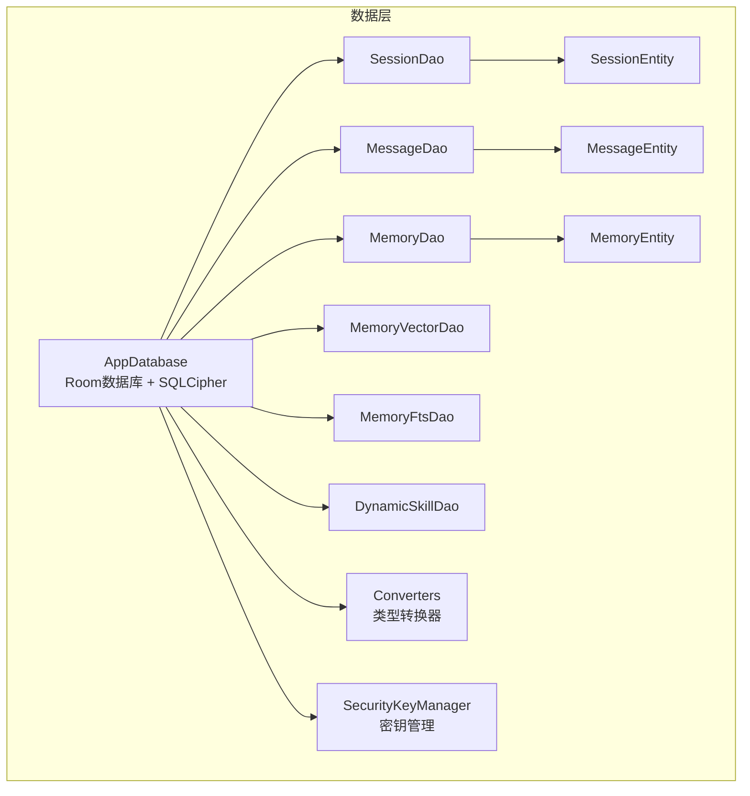
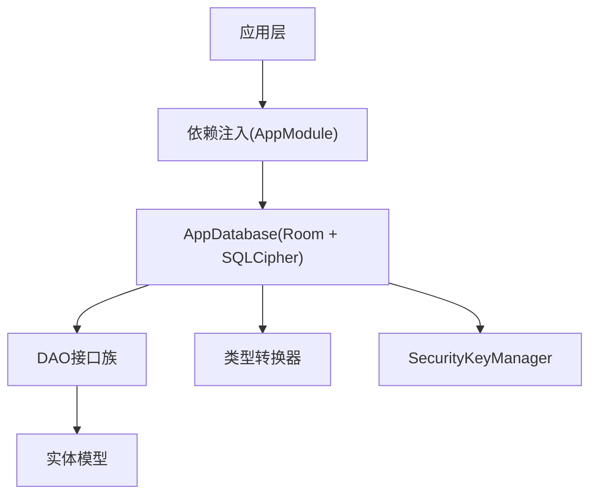
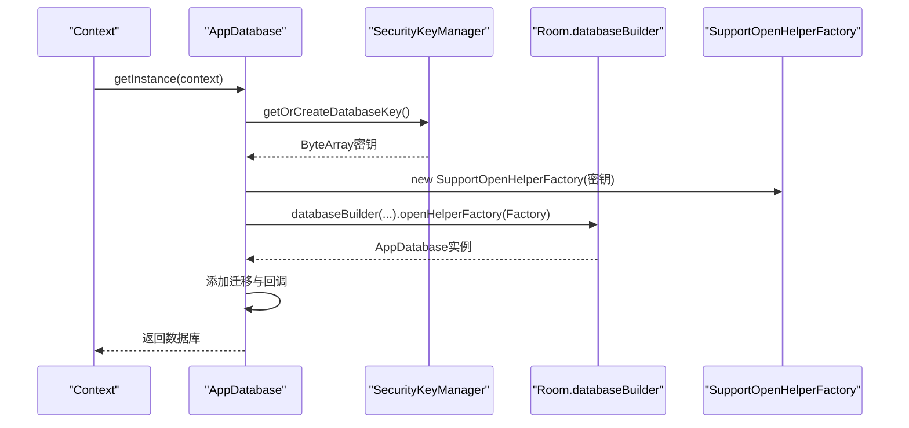
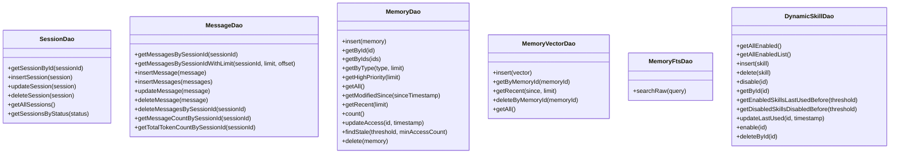
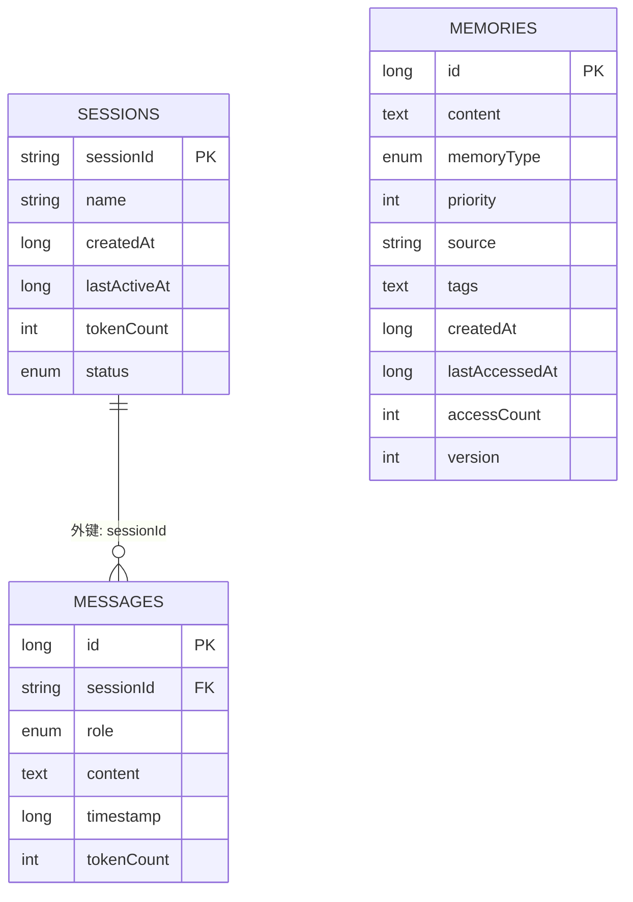
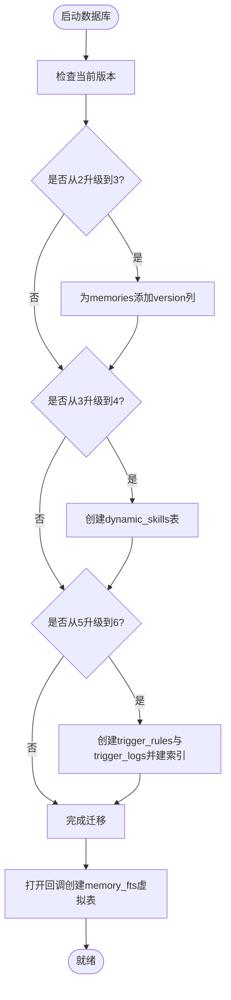
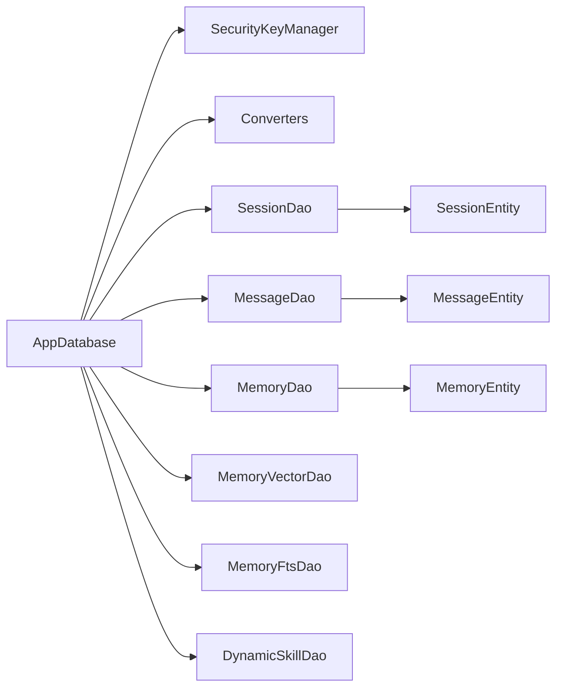

# 数据层设计

<cite>
**本文引用的文件**
- [AppDatabase.kt](file://app/src/main/java/ai/openclaw/android/data/local/AppDatabase.kt)
- [Converters.kt](file://app/src/main/java/ai/openclaw/android/data/local/Converters.kt)
- [SecurityKeyManager.kt](file://app/src/main/java/ai/openclaw/android/security/SecurityKeyManager.kt)
- [SessionDao.kt](file://app/src/main/java/ai/openclaw/android/data/local/SessionDao.kt)
- [MessageDao.kt](file://app/src/main/java/ai/openclaw/android/data/local/MessageDao.kt)
- [MemoryDao.kt](file://app/src/main/java/ai/openclaw/android/data/local/MemoryDao.kt)
- [MemoryVectorDao.kt](file://app/src/main/java/ai/openclaw/android/data/local/MemoryVectorDao.kt)
- [MemoryFtsDao.kt](file://app/src/main/java/ai/openclaw/android/data/local/MemoryFtsDao.kt)
- [DynamicSkillDao.kt](file://app/src/main/java/ai/openclaw/android/data/local/DynamicSkillDao.kt)
- [SessionEntity.kt](file://app/src/main/java/ai/openclaw/android/data/model/SessionEntity.kt)
- [MessageEntity.kt](file://app/src/main/java/ai/openclaw/android/data/model/MessageEntity.kt)
- [MemoryEntity.kt](file://app/src/main/java/ai/openclaw/android/data/model/MemoryEntity.kt)
- [MemoryType.kt](file://app/src/main/java/ai/openclaw/android/data/model/MemoryType.kt)
- [MessageRole.kt](file://app/src/main/java/ai/openclaw/android/data/model/MessageRole.kt)
- [SessionStatus.kt](file://app/src/main/java/ai/openclaw/android/data/model/SessionStatus.kt)
</cite>

## 目录
1. [引言](#引言)
2. [项目结构](#项目结构)
3. [核心组件](#核心组件)
4. [架构总览](#架构总览)
5. [详细组件分析](#详细组件分析)
6. [依赖关系分析](#依赖关系分析)
7. [性能考虑](#性能考虑)
8. [故障排查指南](#故障排查指南)
9. [结论](#结论)
10. [附录](#附录)

## 引言
本文件面向数据层设计，系统阐述基于Room与SQLCipher的本地数据库架构、DAO接口设计模式、实体模型与类型转换器、数据库迁移与版本管理、序列化配置与性能优化、事务管理与最佳实践、安全性与隐私保护，以及扩展与维护建议。内容以仓库中实际代码为依据，辅以可视化图示帮助理解。

## 项目结构
数据层主要位于应用模块的本地数据目录下，采用“按职责分层”的组织方式：
- 数据库入口与迁移：AppDatabase（Room数据库定义、SQLCipher工厂注入、回调初始化FTS）
- 类型转换器：Converters（枚举与集合/数组的双向转换）
- 安全密钥管理：SecurityKeyManager（Android Keystore + EncryptedSharedPreferences生成/持久化数据库密钥）
- DAO接口：SessionDao、MessageDao、MemoryDao、MemoryVectorDao、MemoryFtsDao、DynamicSkillDao
- 实体模型：SessionEntity、MessageEntity、MemoryEntity及相关枚举

图表来源
- [AppDatabase.kt:25-41](file://app/src/main/java/ai/openclaw/android/data/local/AppDatabase.kt#L25-L41)
- [Converters.kt:10-65](file://app/src/main/java/ai/openclaw/android/data/local/Converters.kt#L10-L65)
- [SecurityKeyManager.kt:23-67](file://app/src/main/java/ai/openclaw/android/security/SecurityKeyManager.kt#L23-L67)
- [SessionDao.kt:8-31](file://app/src/main/java/ai/openclaw/android/data/local/SessionDao.kt#L8-L31)
- [MessageDao.kt:7-42](file://app/src/main/java/ai/openclaw/android/data/local/MessageDao.kt#L7-L42)
- [MemoryDao.kt:11-49](file://app/src/main/java/ai/openclaw/android/data/local/MemoryDao.kt#L11-L49)
- [MemoryVectorDao.kt:9-26](file://app/src/main/java/ai/openclaw/android/data/local/MemoryVectorDao.kt#L9-L26)
- [MemoryFtsDao.kt:8-13](file://app/src/main/java/ai/openclaw/android/data/local/MemoryFtsDao.kt#L8-L13)
- [DynamicSkillDao.kt:7-47](file://app/src/main/java/ai/openclaw/android/data/local/DynamicSkillDao.kt#L7-L47)
- [SessionEntity.kt:6-14](file://app/src/main/java/ai/openclaw/android/data/model/SessionEntity.kt#L6-L14)
- [MessageEntity.kt:8-25](file://app/src/main/java/ai/openclaw/android/data/model/MessageEntity.kt#L8-L25)
- [MemoryEntity.kt:6-19](file://app/src/main/java/ai/openclaw/android/data/model/MemoryEntity.kt#L6-L19)

章节来源
- [AppDatabase.kt:25-41](file://app/src/main/java/ai/openclaw/android/data/local/AppDatabase.kt#L25-L41)
- [Converters.kt:10-65](file://app/src/main/java/ai/openclaw/android/data/local/Converters.kt#L10-L65)
- [SecurityKeyManager.kt:23-67](file://app/src/main/java/ai/openclaw/android/security/SecurityKeyManager.kt#L23-L67)

## 核心组件
- Room数据库与SQLCipher集成
  - 在数据库构建阶段加载SQLCipher动态库，并通过SupportOpenHelperFactory注入密钥。
  - 使用回调在首次打开时创建FTS虚拟表，支持后续全文检索能力。
- 类型转换器
  - 统一处理枚举（SessionStatus、MessageRole、MemoryType、EventSource、MatchMode）与字符串互转。
  - 处理List<String>与逗号分隔字符串、FloatArray与逗号分隔字符串之间的双向转换。
- 安全密钥管理
  - 基于Android Keystore与EncryptedSharedPreferences生成并持久化256位AES密钥，作为SQLCipher口令。
- DAO接口族
  - 面向会话、消息、记忆、向量、触发规则与日志等实体，提供查询、插入、更新、删除与批量操作。
  - 部分查询返回Flow，便于响应式观察；部分提供协程挂起函数，便于集中式事务控制。
- 实体模型
  - 明确主键、外键约束、索引与字段语义，确保数据一致性与查询效率。

章节来源
- [AppDatabase.kt:42-156](file://app/src/main/java/ai/openclaw/android/data/local/AppDatabase.kt#L42-L156)
- [Converters.kt:10-65](file://app/src/main/java/ai/openclaw/android/data/local/Converters.kt#L10-L65)
- [SecurityKeyManager.kt:23-67](file://app/src/main/java/ai/openclaw/android/security/SecurityKeyManager.kt#L23-L67)
- [SessionDao.kt:8-31](file://app/src/main/java/ai/openclaw/android/data/local/SessionDao.kt#L8-L31)
- [MessageDao.kt:7-42](file://app/src/main/java/ai/openclaw/android/data/local/MessageDao.kt#L7-L42)
- [MemoryDao.kt:11-49](file://app/src/main/java/ai/openclaw/android/data/local/MemoryDao.kt#L11-L49)
- [MemoryVectorDao.kt:9-26](file://app/src/main/java/ai/openclaw/android/data/local/MemoryVectorDao.kt#L9-L26)
- [MemoryFtsDao.kt:8-13](file://app/src/main/java/ai/openclaw/android/data/local/MemoryFtsDao.kt#L8-L13)
- [DynamicSkillDao.kt:7-47](file://app/src/main/java/ai/openclaw/android/data/local/DynamicSkillDao.kt#L7-L47)
- [SessionEntity.kt:6-14](file://app/src/main/java/ai/openclaw/android/data/model/SessionEntity.kt#L6-L14)
- [MessageEntity.kt:8-25](file://app/src/main/java/ai/openclaw/android/data/model/MessageEntity.kt#L8-L25)
- [MemoryEntity.kt:6-19](file://app/src/main/java/ai/openclaw/android/data/model/MemoryEntity.kt#L6-L19)

## 架构总览
数据层整体采用Room作为ORM框架，结合SQLCipher实现透明数据库加密；通过类型转换器统一复杂类型的序列化/反序列化；DAO层提供清晰的数据访问抽象；实体模型定义数据结构与约束；安全模块负责密钥生成与持久化。

图表来源
- [AppDatabase.kt:25-41](file://app/src/main/java/ai/openclaw/android/data/local/AppDatabase.kt#L25-L41)
- [Converters.kt:10-65](file://app/src/main/java/ai/openclaw/android/data/local/Converters.kt#L10-L65)
- [SecurityKeyManager.kt:23-67](file://app/src/main/java/ai/openclaw/android/security/SecurityKeyManager.kt#L23-L67)

## 详细组件分析

### Room数据库与SQLCipher集成
- 数据库定义
  - 注解声明实体列表、版本号与类型转换器。
  - 提供单例获取方法，线程安全构建数据库实例。
- 加密与密钥
  - 初始化时加载SQLCipher库。
  - 通过SecurityKeyManager生成或读取256位密钥，交由SupportOpenHelperFactory设置到数据库打开工厂。
- 迁移与回调
  - 定义多版本迁移脚本，覆盖新增表与索引。
  - 在数据库打开回调中创建FTS虚拟表，确保全文检索可用。
- 破坏性回滚策略
  - 向下版本降级与首次迁移均采用破坏性重建策略，保证schema一致性。

图表来源
- [AppDatabase.kt:132-155](file://app/src/main/java/ai/openclaw/android/data/local/AppDatabase.kt#L132-L155)
- [SecurityKeyManager.kt:51-67](file://app/src/main/java/ai/openclaw/android/security/SecurityKeyManager.kt#L51-L67)

章节来源
- [AppDatabase.kt:25-41](file://app/src/main/java/ai/openclaw/android/data/local/AppDatabase.kt#L25-L41)
- [AppDatabase.kt:42-156](file://app/src/main/java/ai/openclaw/android/data/local/AppDatabase.kt#L42-L156)
- [SecurityKeyManager.kt:23-67](file://app/src/main/java/ai/openclaw/android/security/SecurityKeyManager.kt#L23-L67)

### DAO接口设计模式与数据访问抽象
- 设计模式要点
  - 接口隔离：每个实体对应独立DAO，职责单一。
  - 协程与响应式：部分查询返回Flow用于实时观察；部分提供suspend函数便于集中事务。
  - 冲突策略：INSERT默认REPLACE，避免重复主键冲突。
- 典型DAO能力
  - SessionDao：按主键查询、插入、更新、删除、按状态流式查询。
  - MessageDao：按会话分页查询、批量插入、统计与清理。
  - MemoryDao：按类型/优先级/最近访问等维度查询、计数、更新访问信息、查找陈旧条目。
  - MemoryVectorDao：向量嵌入的增删查。
  - MemoryFtsDao：原生查询封装，配合FTS进行BM25检索。
  - DynamicSkillDao：启用/禁用、按阈值筛选、更新使用时间、按ID删除。

图表来源
- [SessionDao.kt:8-31](file://app/src/main/java/ai/openclaw/android/data/local/SessionDao.kt#L8-L31)
- [MessageDao.kt:7-42](file://app/src/main/java/ai/openclaw/android/data/local/MessageDao.kt#L7-L42)
- [MemoryDao.kt:11-49](file://app/src/main/java/ai/openclaw/android/data/local/MemoryDao.kt#L11-L49)
- [MemoryVectorDao.kt:9-26](file://app/src/main/java/ai/openclaw/android/data/local/MemoryVectorDao.kt#L9-L26)
- [MemoryFtsDao.kt:8-13](file://app/src/main/java/ai/openclaw/android/data/local/MemoryFtsDao.kt#L8-L13)
- [DynamicSkillDao.kt:7-47](file://app/src/main/java/ai/openclaw/android/data/local/DynamicSkillDao.kt#L7-L47)

章节来源
- [SessionDao.kt:8-31](file://app/src/main/java/ai/openclaw/android/data/local/SessionDao.kt#L8-L31)
- [MessageDao.kt:7-42](file://app/src/main/java/ai/openclaw/android/data/local/MessageDao.kt#L7-L42)
- [MemoryDao.kt:11-49](file://app/src/main/java/ai/openclaw/android/data/local/MemoryDao.kt#L11-L49)
- [MemoryVectorDao.kt:9-26](file://app/src/main/java/ai/openclaw/android/data/local/MemoryVectorDao.kt#L9-L26)
- [MemoryFtsDao.kt:8-13](file://app/src/main/java/ai/openclaw/android/data/local/MemoryFtsDao.kt#L8-L13)
- [DynamicSkillDao.kt:7-47](file://app/src/main/java/ai/openclaw/android/data/local/DynamicSkillDao.kt#L7-L47)

### 实体模型与数据转换器
- 实体模型设计原则
  - 主键唯一：SessionEntity使用字符串sessionId为主键；MemoryEntity使用自增id。
  - 外键与索引：MessageEntity对sessionId建立外键与索引，提升关联查询效率。
  - 字段语义明确：时间戳、计数、状态枚举等字段命名清晰。
- 数据转换器
  - 枚举转换：SessionStatus、MessageRole、MemoryType、EventSource、MatchMode均以名称字符串存储。
  - 列表与数组：List<String>与FloatArray以逗号分隔字符串存储，读取时还原。
  - 作用：保证Room可持久化复杂类型，同时保持schema简洁。

图表来源
- [SessionEntity.kt:6-14](file://app/src/main/java/ai/openclaw/android/data/model/SessionEntity.kt#L6-L14)
- [MessageEntity.kt:8-25](file://app/src/main/java/ai/openclaw/android/data/model/MessageEntity.kt#L8-L25)
- [MemoryEntity.kt:6-19](file://app/src/main/java/ai/openclaw/android/data/model/MemoryEntity.kt#L6-L19)

章节来源
- [SessionEntity.kt:6-14](file://app/src/main/java/ai/openclaw/android/data/model/SessionEntity.kt#L6-L14)
- [MessageEntity.kt:8-25](file://app/src/main/java/ai/openclaw/android/data/model/MessageEntity.kt#L8-L25)
- [MemoryEntity.kt:6-19](file://app/src/main/java/ai/openclaw/android/data/model/MemoryEntity.kt#L6-L19)
- [Converters.kt:10-65](file://app/src/main/java/ai/openclaw/android/data/local/Converters.kt#L10-L65)

### 数据库迁移策略与版本管理
- 版本演进
  - 从2→3：为memories表增加version列。
  - 从3→4/4→5：创建dynamic_skills表，确保所有列存在以避免验证问题。
  - 从5→6：创建trigger_rules与trigger_logs表并建立必要索引。
- 回退策略
  - 向下版本降级与首次迁移均采用破坏性重建，确保schema一致性。
- FTS初始化
  - 在数据库打开回调中创建memory_fts虚拟表，支持BM25检索。

图表来源
- [AppDatabase.kt:58-130](file://app/src/main/java/ai/openclaw/android/data/local/AppDatabase.kt#L58-L130)
- [AppDatabase.kt:146-152](file://app/src/main/java/ai/openclaw/android/data/local/AppDatabase.kt#L146-L152)

章节来源
- [AppDatabase.kt:58-130](file://app/src/main/java/ai/openclaw/android/data/local/AppDatabase.kt#L58-L130)
- [AppDatabase.kt:146-152](file://app/src/main/java/ai/openclaw/android/data/local/AppDatabase.kt#L146-L152)

### 序列化配置与性能优化
- 序列化配置
  - 枚举与集合/数组通过类型转换器序列化为字符串，减少复杂类型依赖。
  - FTS虚拟表用于全文检索，降低SQL LIKE成本。
- 性能优化
  - 为高频查询字段建立索引（如messages的sessionId、trigger_rules的source与enabled、trigger_logs的ruleId与executedAt）。
  - 使用LIMIT与OFFSET进行分页查询，避免一次性加载大量数据。
  - 使用Flow观察数据变化，仅在需要时刷新UI。
  - 对高优先级与最近访问记录提供专用查询，加速热点数据访问。

章节来源
- [Converters.kt:10-65](file://app/src/main/java/ai/openclaw/android/data/local/Converters.kt#L10-L65)
- [AppDatabase.kt:111-129](file://app/src/main/java/ai/openclaw/android/data/local/AppDatabase.kt#L111-L129)
- [MessageDao.kt:10-14](file://app/src/main/java/ai/openclaw/android/data/local/MessageDao.kt#L10-L14)
- [MemoryDao.kt:22-35](file://app/src/main/java/ai/openclaw/android/data/local/MemoryDao.kt#L22-L35)

### 事务管理与最佳实践
- 事务建议
  - 批量写入：使用MessageDao.insertMessages一次提交多条消息，减少事务开销。
  - 跨表一致性：在业务层组合多个DAO操作，使用Room提供的事务回调或协程调度器确保原子性。
  - 清理策略：定期调用MemoryDao.findStale与相关删除接口清理陈旧记忆，避免膨胀。
- 最佳实践
  - 查询尽量带条件与限制，避免全表扫描。
  - 使用Flow观察会话消息流，避免轮询。
  - 对频繁修改的字段（如accessCount、lastAccessedAt）采用原子更新语句。

章节来源
- [MessageDao.kt:19-20](file://app/src/main/java/ai/openclaw/android/data/local/MessageDao.kt#L19-L20)
- [MemoryDao.kt:40-44](file://app/src/main/java/ai/openclaw/android/data/local/MemoryDao.kt#L40-L44)

### 安全性设计与隐私保护
- 密钥管理
  - 使用Android Keystore生成256位AES密钥，通过EncryptedSharedPreferences安全存储。
  - 密钥在运行时解码为ByteArray传递给SQLCipher，避免明文存储口令。
- 数据库加密
  - 通过SupportOpenHelperFactory将密钥注入数据库打开流程，实现透明加密。
- 访问控制
  - DAO层对外暴露最小接口，避免直接SQL泄露内部结构。
  - 敏感字段（如用户输入内容）应结合应用层权限控制与最小化采集策略。

章节来源
- [SecurityKeyManager.kt:23-67](file://app/src/main/java/ai/openclaw/android/security/SecurityKeyManager.kt#L23-L67)
- [AppDatabase.kt:132-143](file://app/src/main/java/ai/openclaw/android/data/local/AppDatabase.kt#L132-L143)

## 依赖关系分析
- 组件耦合
  - AppDatabase集中管理DAO、迁移、回调与加密工厂，是数据层核心。
  - DAO依赖实体模型与类型转换器；实体模型不依赖DAO，保持低耦合。
  - SecurityKeyManager与AppDatabase强耦合，但职责清晰。
- 外部依赖
  - Room与SQLCipher：前者提供ORM与Schema管理，后者提供透明加密。
  - AndroidX Security：提供EncryptedSharedPreferences与MasterKey。

图表来源
- [AppDatabase.kt:25-41](file://app/src/main/java/ai/openclaw/android/data/local/AppDatabase.kt#L25-L41)
- [SecurityKeyManager.kt:23-67](file://app/src/main/java/ai/openclaw/android/security/SecurityKeyManager.kt#L23-L67)
- [Converters.kt:10-65](file://app/src/main/java/ai/openclaw/android/data/local/Converters.kt#L10-L65)
- [SessionDao.kt:8-31](file://app/src/main/java/ai/openclaw/android/data/local/SessionDao.kt#L8-L31)
- [MessageDao.kt:7-42](file://app/src/main/java/ai/openclaw/android/data/local/MessageDao.kt#L7-L42)
- [MemoryDao.kt:11-49](file://app/src/main/java/ai/openclaw/android/data/local/MemoryDao.kt#L11-L49)
- [MemoryVectorDao.kt:9-26](file://app/src/main/java/ai/openclaw/android/data/local/MemoryVectorDao.kt#L9-L26)
- [MemoryFtsDao.kt:8-13](file://app/src/main/java/ai/openclaw/android/data/local/MemoryFtsDao.kt#L8-L13)
- [DynamicSkillDao.kt:7-47](file://app/src/main/java/ai/openclaw/android/data/local/DynamicSkillDao.kt#L7-L47)
- [SessionEntity.kt:6-14](file://app/src/main/java/ai/openclaw/android/data/model/SessionEntity.kt#L6-L14)
- [MessageEntity.kt:8-25](file://app/src/main/java/ai/openclaw/android/data/model/MessageEntity.kt#L8-L25)
- [MemoryEntity.kt:6-19](file://app/src/main/java/ai/openclaw/android/data/model/MemoryEntity.kt#L6-L19)

章节来源
- [AppDatabase.kt:25-41](file://app/src/main/java/ai/openclaw/android/data/local/AppDatabase.kt#L25-L41)

## 性能考虑
- 查询优化
  - 为高频过滤字段建立索引，如messages.sessionId、trigger_rules.source/enabled、trigger_logs.ruleId/executedAt。
  - 使用LIMIT与分页参数控制结果集大小。
- 写入优化
  - 批量插入消息与记忆，减少事务次数。
  - 使用REPLACE策略避免重复主键冲突带来的额外开销。
- 观察与缓存
  - 使用Flow观察会话消息流，避免轮询。
  - 对热点数据（高优先级记忆、最近访问）进行应用层缓存。
- 存储与清理
  - 定期清理陈旧记忆与过期会话，防止数据库膨胀。

## 故障排查指南
- 数据库无法打开
  - 检查SQLCipher库是否正确加载与密钥是否有效。
  - 确认迁移脚本执行顺序与目标版本一致。
- 查询异常或性能差
  - 检查相关索引是否存在，确认WHERE与ORDER子句是否命中索引。
  - 对大数据量查询增加LIMIT与分页。
- 迁移失败
  - 查看迁移脚本是否遗漏字段或表；必要时启用破坏性重建策略。
- FTS不可用
  - 确认数据库打开回调已成功创建memory_fts虚拟表。

章节来源
- [AppDatabase.kt:42-156](file://app/src/main/java/ai/openclaw/android/data/local/AppDatabase.kt#L42-L156)
- [AppDatabase.kt:111-129](file://app/src/main/java/ai/openclaw/android/data/local/AppDatabase.kt#L111-L129)

## 结论
该数据层以Room为核心，结合SQLCipher实现透明加密，通过类型转换器与DAO抽象实现复杂类型与数据访问的解耦。迁移策略覆盖关键表演进，索引与分页保障性能。安全模块通过Keystore与EncryptedSharedPreferences确保密钥安全。遵循本文最佳实践与扩展建议，可在保证性能与安全的前提下持续演进数据层能力。

## 附录
- 关键枚举与类型
  - MemoryType：偏好、事实、决策、任务、项目
  - MessageRole：用户、助手、系统
  - SessionStatus：活跃、压缩、归档
- 建议扩展方向
  - 引入更细粒度的审计日志DAO，记录敏感操作。
  - 为向量检索引入专用DAO与索引策略。
  - 对FTS查询引入评分与高亮功能。