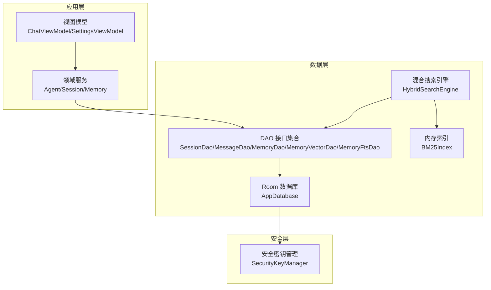
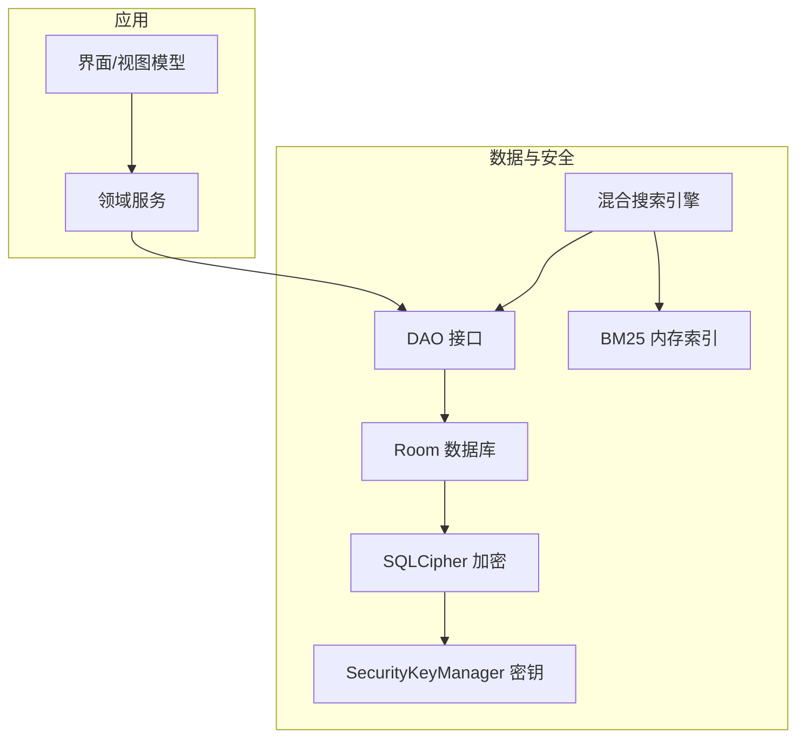
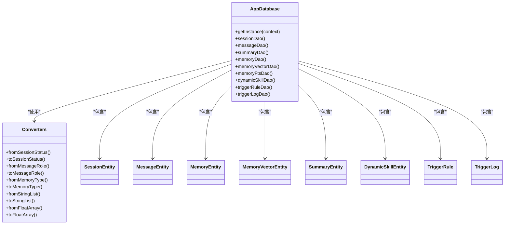
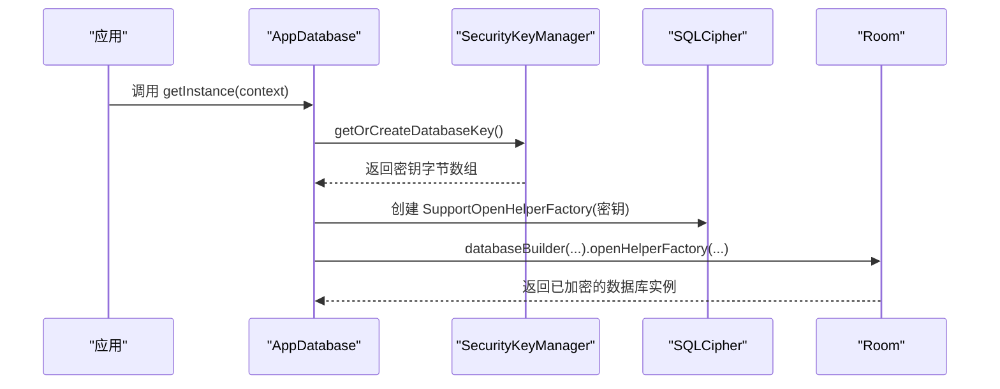
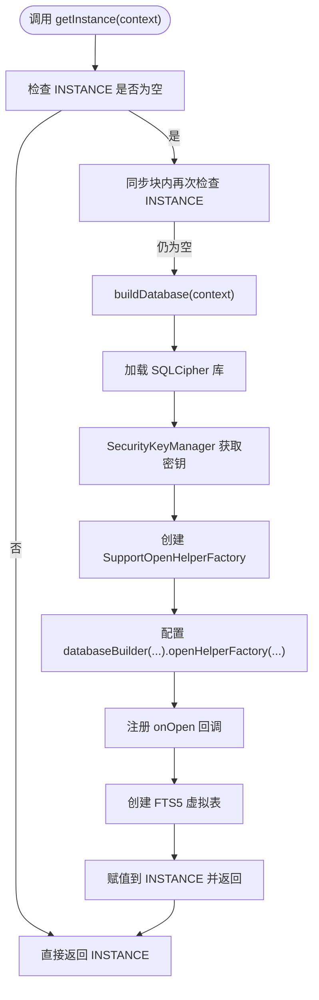
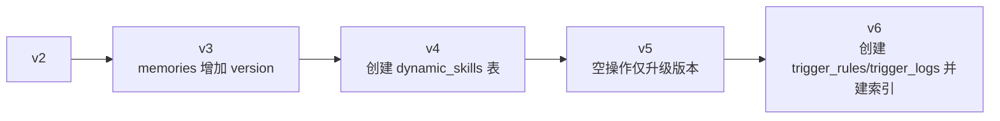
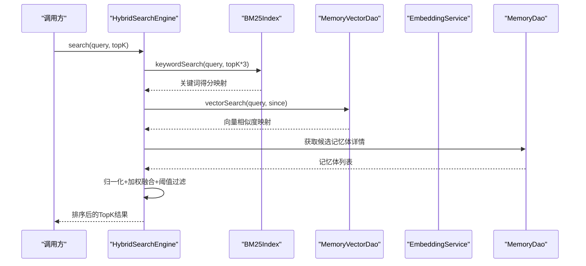
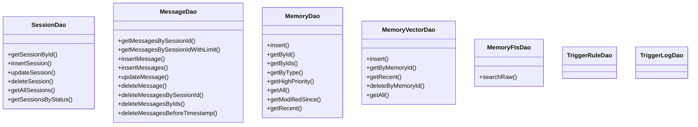
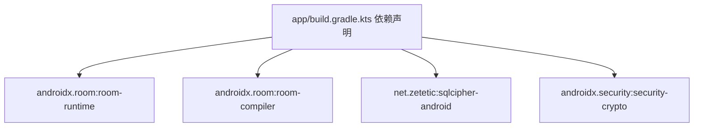

# 数据库架构

<cite>
**本文引用的文件**
- [AppDatabase.kt](file://app/src/main/java/ai/openclaw/android/data/local/AppDatabase.kt)
- [SecurityKeyManager.kt](file://app/src/main/java/ai/openclaw/android/security/SecurityKeyManager.kt)
- [Converters.kt](file://app/src/main/java/ai/openclaw/android/data/local/Converters.kt)
- [AppModule.kt](file://app/src/main/java/ai/openclaw/android/di/AppModule.kt)
- [BM25Index.kt](file://app/src/main/java/ai/openclaw/android/data/local/BM25Index.kt)
- [HybridSearchEngine.kt](file://app/src/main/java/ai/openclaw/android/domain/memory/HybridSearchEngine.kt)
- [MemoryDao.kt](file://app/src/main/java/ai/openclaw/android/data/local/MemoryDao.kt)
- [MemoryVectorDao.kt](file://app/src/main/java/ai/openclaw/android/data/local/MemoryVectorDao.kt)
- [MemoryFtsDao.kt](file://app/src/main/java/ai/openclaw/android/data/local/MemoryFtsDao.kt)
- [SessionDao.kt](file://app/src/main/java/ai/openclaw/android/data/local/SessionDao.kt)
- [MessageDao.kt](file://app/src/main/java/ai/openclaw/android/data/local/MessageDao.kt)
- [MemoryEntity.kt](file://app/src/main/java/ai/openclaw/android/data/model/MemoryEntity.kt)
- [SessionEntity.kt](file://app/src/main/java/ai/openclaw/android/data/model/SessionEntity.kt)
- [MemoryVectorEntity.kt](file://app/src/main/java/ai/openclaw/android/data/model/MemoryVectorEntity.kt)
- [app/build.gradle.kts](file://app/build.gradle.kts)
</cite>

## 目录
1. [简介](#简介)
2. [项目结构](#项目结构)
3. [核心组件](#核心组件)
4. [架构总览](#架构总览)
5. [详细组件分析](#详细组件分析)
6. [依赖关系分析](#依赖关系分析)
7. [性能考量](#性能考量)
8. [故障排查指南](#故障排查指南)
9. [结论](#结论)
10. [附录](#附录)

## 简介
本文件系统性梳理本项目的数据库架构与实现，重点覆盖以下方面：
- Room数据库整体设计与实体模型
- SQLCipher加密实现与密钥管理机制
- 数据库初始化流程、连接池与并发控制
- 版本管理与迁移策略
- 加密密钥安全存储与生命周期
- 性能优化与索引策略
- 最佳实践与扩展建议
- 与上层模块的集成与数据流设计

## 项目结构
数据库相关代码主要分布在如下位置：
- 本地数据库与DAO：data/local
- 数据模型：data/model
- 安全与密钥管理：security
- 依赖注入：di
- 搜索与向量化：domain/memory
- 构建与依赖：app/build.gradle.kts

图表来源
- [AppDatabase.kt:1-158](file://app/src/main/java/ai/openclaw/android/data/local/AppDatabase.kt#L1-L158)
- [AppModule.kt:1-79](file://app/src/main/java/ai/openclaw/android/di/AppModule.kt#L1-L79)
- [BM25Index.kt:1-203](file://app/src/main/java/ai/openclaw/android/data/local/BM25Index.kt#L1-L203)
- [HybridSearchEngine.kt:1-227](file://app/src/main/java/ai/openclaw/android/domain/memory/HybridSearchEngine.kt#L1-L227)
- [SecurityKeyManager.kt:1-69](file://app/src/main/java/ai/openclaw/android/security/SecurityKeyManager.kt#L1-L69)

章节来源
- [AppDatabase.kt:1-158](file://app/src/main/java/ai/openclaw/android/data/local/AppDatabase.kt#L1-L158)
- [AppModule.kt:1-79](file://app/src/main/java/ai/openclaw/android/di/AppModule.kt#L1-L79)
- [app/build.gradle.kts:126-170](file://app/build.gradle.kts#L126-L170)

## 核心组件
- AppDatabase：Room数据库入口，声明实体、DAO、迁移与回调；通过SQLCipher工厂启用加密。
- SecurityKeyManager：基于Android Keystore与EncryptedSharedPreferences生成/读取256位AES密钥，作为SQLCipher口令。
- Converters：Room类型转换器，支持枚举、列表、浮点数组等复杂字段持久化。
- DAO层：围绕会话、消息、记忆体、向量、触发规则与日志等表提供CRUD接口。
- BM25Index：纯Kotlin实现的内存倒排索引，用于关键词检索加速。
- HybridSearchEngine：融合BM25、向量相似度与时间衰减的混合检索引擎。
- DI模块：Koin单例注入，统一提供数据库实例、搜索组件与服务。

章节来源
- [AppDatabase.kt:25-41](file://app/src/main/java/ai/openclaw/android/data/local/AppDatabase.kt#L25-L41)
- [SecurityKeyManager.kt:23-67](file://app/src/main/java/ai/openclaw/android/security/SecurityKeyManager.kt#L23-L67)
- [Converters.kt:10-65](file://app/src/main/java/ai/openclaw/android/data/local/Converters.kt#L10-L65)
- [BM25Index.kt:14-203](file://app/src/main/java/ai/openclaw/android/data/local/BM25Index.kt#L14-L203)
- [HybridSearchEngine.kt:18-227](file://app/src/main/java/ai/openclaw/android/domain/memory/HybridSearchEngine.kt#L18-L227)
- [AppModule.kt:24-79](file://app/src/main/java/ai/openclaw/android/di/AppModule.kt#L24-L79)

## 架构总览
下图展示数据库层与周边模块的交互关系，以及加密与索引的关键路径。

图表来源
- [AppDatabase.kt:132-155](file://app/src/main/java/ai/openclaw/android/data/local/AppDatabase.kt#L132-L155)
- [SecurityKeyManager.kt:31-67](file://app/src/main/java/ai/openclaw/android/security/SecurityKeyManager.kt#L31-L67)
- [HybridSearchEngine.kt:18-23](file://app/src/main/java/ai/openclaw/android/domain/memory/HybridSearchEngine.kt#L18-L23)
- [BM25Index.kt:14-203](file://app/src/main/java/ai/openclaw/android/data/local/BM25Index.kt#L14-L203)

## 详细组件分析

### Room数据库与实体模型
- 实体清单：会话、消息、摘要、记忆体、向量记忆体、动态技能、触发规则、触发日志。
- 类型转换：通过Converters处理枚举、字符串列表、浮点数组等。
- 初始化与加密：在单例构建时加载SQLCipher库，使用SecurityKeyManager提供的密钥构造SupportOpenHelperFactory。
- 打开回调：首次打开时创建FTS5虚拟表以支持全文检索。
- 迁移策略：定义多版本迁移，包含新增列、创建新表及索引。

图表来源
- [AppDatabase.kt:25-41](file://app/src/main/java/ai/openclaw/android/data/local/AppDatabase.kt#L25-L41)
- [Converters.kt:10-65](file://app/src/main/java/ai/openclaw/android/data/local/Converters.kt#L10-L65)
- [SessionEntity.kt:1-14](file://app/src/main/java/ai/openclaw/android/data/model/SessionEntity.kt#L1-L14)
- [MemoryEntity.kt:1-19](file://app/src/main/java/ai/openclaw/android/data/model/MemoryEntity.kt#L1-L19)
- [MemoryVectorEntity.kt:1-19](file://app/src/main/java/ai/openclaw/android/data/model/MemoryVectorEntity.kt#L1-L19)

章节来源
- [AppDatabase.kt:25-155](file://app/src/main/java/ai/openclaw/android/data/local/AppDatabase.kt#L25-L155)
- [Converters.kt:10-65](file://app/src/main/java/ai/openclaw/android/data/local/Converters.kt#L10-L65)
- [SessionEntity.kt:1-14](file://app/src/main/java/ai/openclaw/android/data/model/SessionEntity.kt#L1-L14)
- [MemoryEntity.kt:1-19](file://app/src/main/java/ai/openclaw/android/data/model/MemoryEntity.kt#L1-L19)
- [MemoryVectorEntity.kt:1-19](file://app/src/main/java/ai/openclaw/android/data/model/MemoryVectorEntity.kt#L1-L19)

### SQLCipher加密实现与密钥管理
- 加载库：在静态初始化中加载SQLCipher本地库。
- 密钥来源：SecurityKeyManager使用Android Keystore与MasterKey，结合EncryptedSharedPreferences生成/保存256位AES密钥（Base64存储）。
- 传递给Room：通过SupportOpenHelperFactory将密钥传入Room的OpenHelper，实现数据库级加密。
- 生命周期：密钥只在首次运行生成，后续从安全存储读取，确保跨进程/重启一致性。

图表来源
- [AppDatabase.kt:132-155](file://app/src/main/java/ai/openclaw/android/data/local/AppDatabase.kt#L132-L155)
- [SecurityKeyManager.kt:51-67](file://app/src/main/java/ai/openclaw/android/security/SecurityKeyManager.kt#L51-L67)

章节来源
- [AppDatabase.kt:45-47](file://app/src/main/java/ai/openclaw/android/data/local/AppDatabase.kt#L45-L47)
- [AppDatabase.kt:132-155](file://app/src/main/java/ai/openclaw/android/data/local/AppDatabase.kt#L132-L155)
- [SecurityKeyManager.kt:31-67](file://app/src/main/java/ai/openclaw/android/security/SecurityKeyManager.kt#L31-L67)

### 数据库初始化流程与连接池
- 单例模式：双重检查锁定保证线程安全与唯一实例。
- 连接池：Room默认使用SQLite连接池，具体池大小由SQLite内部策略决定；可通过Room的配置扩展（如自定义OpenHelperFactory时可关注底层连接行为）。
- 并发控制：Room通过协程与Flow进行异步访问；DAO方法返回suspend或Flow，避免主线程阻塞。
- FTS5虚拟表：在数据库打开时创建，用于全文检索能力。

图表来源
- [AppDatabase.kt:52-155](file://app/src/main/java/ai/openclaw/android/data/local/AppDatabase.kt#L52-L155)

章节来源
- [AppDatabase.kt:49-56](file://app/src/main/java/ai/openclaw/android/data/local/AppDatabase.kt#L49-L56)
- [AppDatabase.kt:132-155](file://app/src/main/java/ai/openclaw/android/data/local/AppDatabase.kt#L132-L155)

### 版本管理与迁移策略
- 当前版本：数据库版本为6。
- 迁移历史：
  - 2→3：为memories表增加version列。
  - 3→4：创建dynamic_skills表（含完整列集）。
  - 4→5：空操作，仅提升版本号。
  - 5→6：创建trigger_rules与trigger_logs表，并建立必要索引。
- 降级策略：启用破坏式降级迁移，避免版本回退导致的数据不一致。

图表来源
- [AppDatabase.kt:58-130](file://app/src/main/java/ai/openclaw/android/data/local/AppDatabase.kt#L58-L130)

章节来源
- [AppDatabase.kt:27](file://app/src/main/java/ai/openclaw/android/data/local/AppDatabase.kt#L27)
- [AppDatabase.kt:58-130](file://app/src/main/java/ai/openclaw/android/data/local/AppDatabase.kt#L58-L130)

### 搜索与索引策略
- 关键词检索：BM25Index对中文（双字符词+短词）与英文进行分词，构建倒排索引与文档长度统计，支持按天桶过滤时间范围。
- 向量检索：MemoryVectorDao与EmbeddingService配合，计算查询向量与候选向量的余弦相似度，结果缓存30秒。
- 混合检索：HybridSearchEngine将关键词、向量与时间衰减归一化后加权融合，阈值过滤，支持同步与异步两种执行路径。
- FTS5：AppDatabase在打开时创建FTS5虚拟表，MemoryFtsDao提供原生SQL查询能力。

图表来源
- [HybridSearchEngine.kt:173-227](file://app/src/main/java/ai/openclaw/android/domain/memory/HybridSearchEngine.kt#L173-L227)
- [BM25Index.kt:140-178](file://app/src/main/java/ai/openclaw/android/data/local/BM25Index.kt#L140-L178)
- [MemoryVectorDao.kt:11-25](file://app/src/main/java/ai/openclaw/android/data/local/MemoryVectorDao.kt#L11-L25)
- [MemoryDao.kt:19-35](file://app/src/main/java/ai/openclaw/android/data/local/MemoryDao.kt#L19-L35)

章节来源
- [BM25Index.kt:14-203](file://app/src/main/java/ai/openclaw/android/data/local/BM25Index.kt#L14-L203)
- [HybridSearchEngine.kt:18-227](file://app/src/main/java/ai/openclaw/android/domain/memory/HybridSearchEngine.kt#L18-L227)
- [MemoryFtsDao.kt:1-13](file://app/src/main/java/ai/openclaw/android/data/local/MemoryFtsDao.kt#L1-L13)

### DAO与数据访问模式
- 会话与消息：SessionDao/MessageDao提供基于Flow的实时订阅与分页查询。
- 记忆体与向量：MemoryDao/MemoryVectorDao支持批量插入、最近更新查询、按ID删除等。
- 触发规则与日志：TriggerRuleDao/TriggerLogDao提供CRUD与索引支持。

图表来源
- [SessionDao.kt:1-31](file://app/src/main/java/ai/openclaw/android/data/local/SessionDao.kt#L1-L31)
- [MessageDao.kt:1-37](file://app/src/main/java/ai/openclaw/android/data/local/MessageDao.kt#L1-L37)
- [MemoryDao.kt:1-35](file://app/src/main/java/ai/openclaw/android/data/local/MemoryDao.kt#L1-L35)
- [MemoryVectorDao.kt:1-25](file://app/src/main/java/ai/openclaw/android/data/local/MemoryVectorDao.kt#L1-L25)
- [MemoryFtsDao.kt:1-13](file://app/src/main/java/ai/openclaw/android/data/local/MemoryFtsDao.kt#L1-L13)

章节来源
- [SessionDao.kt:1-31](file://app/src/main/java/ai/openclaw/android/data/local/SessionDao.kt#L1-L31)
- [MessageDao.kt:1-37](file://app/src/main/java/ai/openclaw/android/data/local/MessageDao.kt#L1-L37)
- [MemoryDao.kt:1-35](file://app/src/main/java/ai/openclaw/android/data/local/MemoryDao.kt#L1-L35)
- [MemoryVectorDao.kt:1-25](file://app/src/main/java/ai/openclaw/android/data/local/MemoryVectorDao.kt#L1-L25)
- [MemoryFtsDao.kt:1-13](file://app/src/main/java/ai/openclaw/android/data/local/MemoryFtsDao.kt#L1-L13)

## 依赖关系分析
- 构建依赖：Room运行时与KSP编译器、SQLCipher、AndroidX Security加密偏好库。
- DI注入：Koin将AppDatabase与各DAO、搜索组件、嵌入服务等作为单例注入，便于测试与解耦。
- 组件耦合：HybridSearchEngine依赖BM25Index与DAO，同时通过EmbeddingService进行向量计算；BM25Index依赖MemoryDao重建索引。

图表来源
- [app/build.gradle.kts:164-170](file://app/build.gradle.kts#L164-L170)

章节来源
- [app/build.gradle.kts:126-170](file://app/build.gradle.kts#L126-L170)
- [AppModule.kt:24-79](file://app/src/main/java/ai/openclaw/android/di/AppModule.kt#L24-L79)

## 性能考量
- 索引与查询
  - 会话与消息：SessionDao与MessageDao针对sessionId建立索引，减少关联查询成本。
  - 触发规则：trigger_rules表建立source与enabled索引；trigger_logs表建立ruleId与executedAt索引，支撑高频筛选与排序。
  - FTS5：AppDatabase在打开时创建FTS5虚拟表，MemoryFtsDao提供原生全文检索能力。
- 并发与异步
  - DAO方法采用suspend/Flow，配合协程调度器避免阻塞主线程。
  - HybridSearchEngine的asyncSearch通过并行执行关键词与向量检索，缩短响应时间。
- 缓存与预热
  - 向量结果缓存：30秒TTL，降低重复查询开销。
  - BM25索引重建：在启动或批量变更后重建，保证检索质量。
- 存储与加密
  - 使用SQLCipher对数据库文件进行端到端加密，密钥由Android Keystore保护，避免明文存储。

章节来源
- [SessionDao.kt:27-31](file://app/src/main/java/ai/openclaw/android/data/local/SessionDao.kt#L27-L31)
- [MessageDao.kt:10-14](file://app/src/main/java/ai/openclaw/android/data/local/MessageDao.kt#L10-L14)
- [AppDatabase.kt:111-129](file://app/src/main/java/ai/openclaw/android/data/local/AppDatabase.kt#L111-L129)
- [AppDatabase.kt:149-152](file://app/src/main/java/ai/openclaw/android/data/local/AppDatabase.kt#L149-L152)
- [HybridSearchEngine.kt:41-53](file://app/src/main/java/ai/openclaw/android/domain/memory/HybridSearchEngine.kt#L41-L53)
- [HybridSearchEngine.kt:202-219](file://app/src/main/java/ai/openclaw/android/domain/memory/HybridSearchEngine.kt#L202-L219)
- [BM25Index.kt:183-189](file://app/src/main/java/ai/openclaw/android/data/local/BM25Index.kt#L183-L189)

## 故障排查指南
- 数据库无法打开
  - 检查是否正确加载SQLCipher库与密钥是否有效。
  - 确认SecurityKeyManager是否成功生成/读取密钥。
- 迁移失败
  - 核对迁移脚本与目标版本；必要时启用破坏式降级迁移以清理旧schema。
- 查询性能差
  - 确认相关索引是否存在；检查查询条件是否命中索引。
  - 对于大量写入场景，考虑批量插入与事务封装。
- 搜索结果异常
  - 检查BM25索引是否重建；确认向量维度与缓存状态。
- 日志与监控
  - 使用HybridSearchEngine的日志输出定位关键词/向量/融合阶段耗时。

章节来源
- [AppDatabase.kt:132-155](file://app/src/main/java/ai/openclaw/android/data/local/AppDatabase.kt#L132-L155)
- [SecurityKeyManager.kt:51-67](file://app/src/main/java/ai/openclaw/android/security/SecurityKeyManager.kt#L51-L67)
- [AppDatabase.kt:58-130](file://app/src/main/java/ai/openclaw/android/data/local/AppDatabase.kt#L58-L130)
- [HybridSearchEngine.kt:182-218](file://app/src/main/java/ai/openclaw/android/domain/memory/HybridSearchEngine.kt#L182-L218)

## 结论
本数据库架构以Room为核心，结合SQLCipher实现端到端加密，辅以BM25与向量检索的混合搜索方案，满足高安全性与高性能的本地记忆体管理需求。通过合理的索引设计、缓存策略与并发访问模式，系统在功能完整性与用户体验之间取得平衡。建议持续关注迁移策略与索引维护，确保长期演进中的稳定性与可扩展性。

## 附录
- 最佳实践
  - 迁移脚本必须幂等且具备向后兼容性；必要时提供破坏式降级策略。
  - 对高频查询字段建立索引；对大表查询使用LIMIT与分页。
  - 使用协程与Flow进行异步访问；避免在主线程执行数据库操作。
  - 将敏感密钥与加密偏好存储在受保护的安全容器中。
  - 定期重建BM25索引，保持检索质量。
- 扩展建议
  - 引入Room数据库写入队列与批处理，降低写放大。
  - 针对向量检索引入近似最近邻算法（ANN）以进一步提升性能。
  - 在多进程或多实例场景下，统一密钥轮换与备份策略。