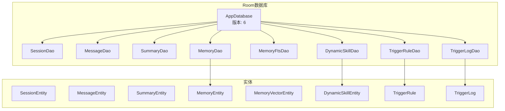
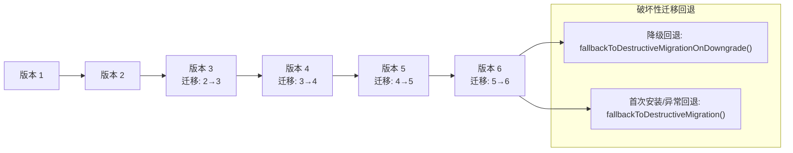
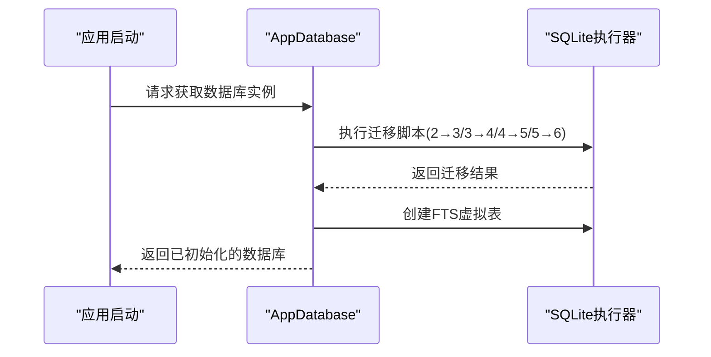
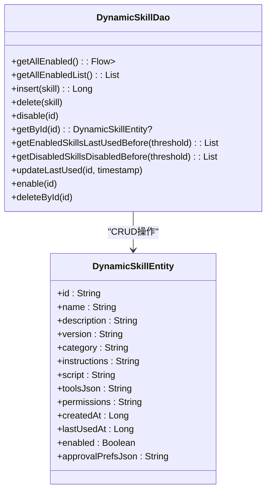
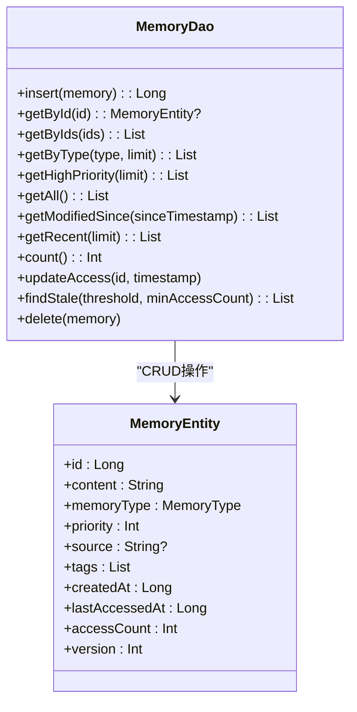
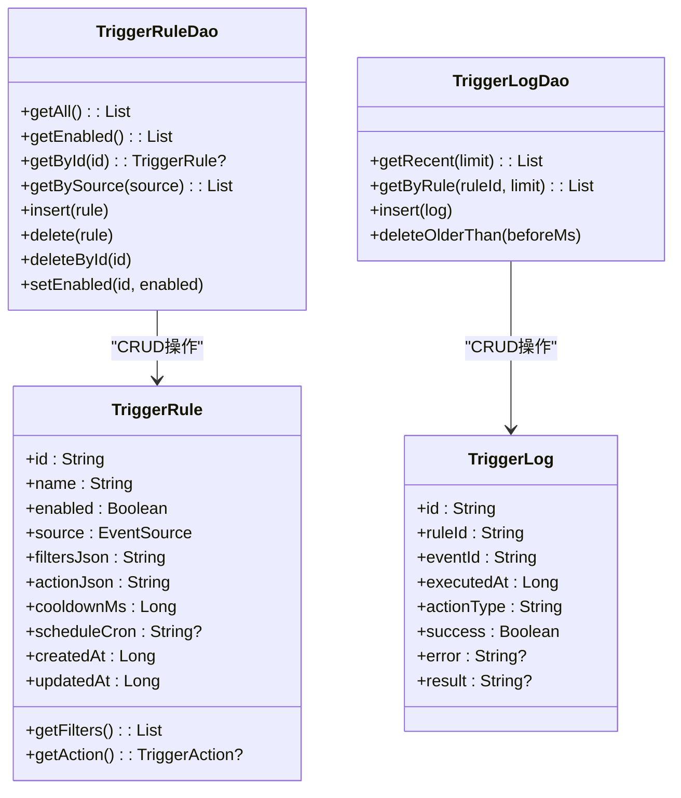
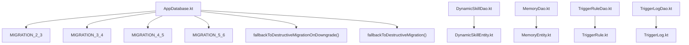

# 数据迁移策略

<cite>
**本文引用的文件**
- [AppDatabase.kt](file://app/src/main/java/ai/openclaw/android/data/local/AppDatabase.kt)
- [DynamicSkillDao.kt](file://app/src/main/java/ai/openclaw/android/data/local/DynamicSkillDao.kt)
- [DynamicSkillEntity.kt](file://app/src/main/java/ai/openclaw/android/data/model/DynamicSkillEntity.kt)
- [MemoryDao.kt](file://app/src/main/java/ai/openclaw/android/data/local/MemoryDao.kt)
- [MemoryEntity.kt](file://app/src/main/java/ai/openclaw/android/data/model/MemoryEntity.kt)
- [Converters.kt](file://app/src/main/java/ai/openclaw/android/data/local/Converters.kt)
- [TriggerRule.kt](file://app/src/main/java/ai/openclaw/android/trigger/models/TriggerRule.kt)
- [TriggerRuleDao.kt](file://app/src/main/java/ai/openclaw/android/trigger/dao/TriggerRuleDao.kt)
- [TriggerLog.kt](file://app/src/main/java/ai/openclaw/android/trigger/models/TriggerLog.kt)
- [TriggerLogDao.kt](file://app/src/main/java/ai/openclaw/android/trigger/dao/TriggerLogDao.kt)
- [DynamicSkillDaoTest.kt](file://app/src/androidTest/java/ai/openclaw/android/data/DynamicSkillDaoTest.kt)
</cite>

## 目录
1. [引言](#引言)
2. [项目结构](#项目结构)
3. [核心组件](#核心组件)
4. [架构总览](#架构总览)
5. [详细组件分析](#详细组件分析)
6. [依赖关系分析](#依赖关系分析)
7. [性能考量](#性能考量)
8. [故障排查指南](#故障排查指南)
9. [结论](#结论)
10. [附录](#附录)

## 引言
本文件系统化梳理并阐述本项目的Room数据库迁移机制与版本管理策略，覆盖以下关键主题：
- 版本间迁移脚本的实现与数据转换逻辑
- 迁移过程中的破坏性迁移与降级处理
- 数据备份与恢复机制建议
- 迁移性能优化与错误处理
- 迁移测试与验证最佳实践
- 对用户体验的影响与补偿措施
- 面向未来的前瞻性设计指导

## 项目结构
本项目采用Room作为本地持久层，数据库版本当前为6。核心结构包括：
- 数据库定义与构建：在数据库类中集中声明实体、类型转换器，并注册各版本迁移脚本与破坏性迁移回退策略
- DAO与实体：围绕会话、消息、摘要、记忆、动态技能、触发规则与日志等实体提供数据访问接口
- 类型转换器：统一管理枚举与复杂类型的序列化/反序列化
- 触发器模型：新增触发规则与日志实体，配套DAO与索引

图表来源
- [AppDatabase.kt:25-40](file://app/src/main/java/ai/openclaw/android/data/local/AppDatabase.kt#L25-L40)
- [MemoryDao.kt:1-49](file://app/src/main/java/ai/openclaw/android/data/local/MemoryDao.kt#L1-L49)
- [DynamicSkillDao.kt:1-47](file://app/src/main/java/ai/openclaw/android/data/local/DynamicSkillDao.kt#L1-L47)
- [TriggerRuleDao.kt:1-32](file://app/src/main/java/ai/openclaw/android/trigger/dao/TriggerRuleDao.kt#L1-L32)
- [TriggerLogDao.kt:1-20](file://app/src/main/java/ai/openclaw/android/trigger/dao/TriggerLogDao.kt#L1-L20)

章节来源
- [AppDatabase.kt:25-40](file://app/src/main/java/ai/openclaw/android/data/local/AppDatabase.kt#L25-L40)
- [Converters.kt:1-65](file://app/src/main/java/ai/openclaw/android/data/local/Converters.kt#L1-L65)

## 核心组件
- 数据库版本与实体清单：数据库版本为6，包含会话、消息、摘要、记忆、向量记忆、动态技能、触发规则与触发日志等实体
- 迁移脚本集合：从2到3、3到4、4到5、5到6的迁移脚本，分别处理列添加、表创建与索引建立
- 破坏性迁移回退：在降级或首次安装时回退到破坏性迁移，确保数据库可用
- FTS虚拟表初始化：数据库打开时创建全文检索虚拟表
- 加密支持：通过SQLCipher工厂加载加密密钥

章节来源
- [AppDatabase.kt:25-29](file://app/src/main/java/ai/openclaw/android/data/local/AppDatabase.kt#L25-L29)
- [AppDatabase.kt:58-130](file://app/src/main/java/ai/openclaw/android/data/local/AppDatabase.kt#L58-L130)
- [AppDatabase.kt:132-155](file://app/src/main/java/ai/openclaw/android/data/local/AppDatabase.kt#L132-L155)

## 架构总览
下图展示数据库版本演进与迁移脚本的关系，以及破坏性迁移回退策略的位置。

图表来源
- [AppDatabase.kt:58-130](file://app/src/main/java/ai/openclaw/android/data/local/AppDatabase.kt#L58-L130)
- [AppDatabase.kt:144-145](file://app/src/main/java/ai/openclaw/android/data/local/AppDatabase.kt#L144-L145)

## 详细组件分析

### 迁移脚本与版本管理
- 版本2→3：为记忆表增加版本列，用于后续版本控制与兼容性判断
- 版本3→4：创建动态技能表，包含技能元数据、脚本、工具、权限、时间戳与启用状态等字段；该版本脚本确保后续版本无需再次创建该表
- 版本4→5：空操作迁移，仅提升版本号以满足Room模式校验
- 版本5→6：创建触发规则表与触发日志表，并建立必要索引；同时在数据库打开回调中创建FTS虚拟表

图表来源
- [AppDatabase.kt:58-130](file://app/src/main/java/ai/openclaw/android/data/local/AppDatabase.kt#L58-L130)
- [AppDatabase.kt:146-152](file://app/src/main/java/ai/openclaw/android/data/local/AppDatabase.kt#L146-L152)

章节来源
- [AppDatabase.kt:58-130](file://app/src/main/java/ai/openclaw/android/data/local/AppDatabase.kt#L58-L130)

### 动态技能实体与DAO
- 实体字段覆盖技能生命周期与运行参数，支持启用/禁用、最近使用时间、权限与审批偏好等
- DAO提供启用列表查询、按ID查询、批量更新最近使用时间、启用/禁用与删除等操作

图表来源
- [DynamicSkillEntity.kt:6-21](file://app/src/main/java/ai/openclaw/android/data/model/DynamicSkillEntity.kt#L6-L21)
- [DynamicSkillDao.kt:7-46](file://app/src/main/java/ai/openclaw/android/data/local/DynamicSkillDao.kt#L7-L46)

章节来源
- [DynamicSkillEntity.kt:6-21](file://app/src/main/java/ai/openclaw/android/data/model/DynamicSkillEntity.kt#L6-L21)
- [DynamicSkillDao.kt:7-46](file://app/src/main/java/ai/openclaw/android/data/local/DynamicSkillDao.kt#L7-L46)

### 记忆实体与DAO
- 记忆实体包含内容、类型、优先级、来源、标签、创建/访问时间戳、访问计数与版本等字段
- DAO提供按类型、高优先级、最近访问、修改时间范围等查询，以及访问统计与清理等操作

图表来源
- [MemoryEntity.kt:6-18](file://app/src/main/java/ai/openclaw/android/data/model/MemoryEntity.kt#L6-L18)
- [MemoryDao.kt:11-48](file://app/src/main/java/ai/openclaw/android/data/local/MemoryDao.kt#L11-L48)

章节来源
- [MemoryEntity.kt:6-18](file://app/src/main/java/ai/openclaw/android/data/model/MemoryEntity.kt#L6-L18)
- [MemoryDao.kt:11-48](file://app/src/main/java/ai/openclaw/android/data/local/MemoryDao.kt#L11-L48)

### 触发规则与日志
- 触发规则实体包含事件源、过滤器JSON、动作JSON、冷却时间、Cron表达式与时间戳等字段，并提供JSON序列化/反序列化辅助方法
- 触发日志实体记录规则执行结果与错误信息，便于审计与排障

图表来源
- [TriggerRule.kt:60-114](file://app/src/main/java/ai/openclaw/android/trigger/models/TriggerRule.kt#L60-L114)
- [TriggerLog.kt:7-20](file://app/src/main/java/ai/openclaw/android/trigger/models/TriggerLog.kt#L7-L20)
- [TriggerRuleDao.kt:6-31](file://app/src/main/java/ai/openclaw/android/trigger/dao/TriggerRuleDao.kt#L6-L31)
- [TriggerLogDao.kt:6-19](file://app/src/main/java/ai/openclaw/android/trigger/dao/TriggerLogDao.kt#L6-L19)

章节来源
- [TriggerRule.kt:60-114](file://app/src/main/java/ai/openclaw/android/trigger/models/TriggerRule.kt#L60-L114)
- [TriggerLog.kt:7-20](file://app/src/main/java/ai/openclaw/android/trigger/models/TriggerLog.kt#L7-L20)
- [TriggerRuleDao.kt:6-31](file://app/src/main/java/ai/openclaw/android/trigger/dao/TriggerRuleDao.kt#L6-L31)
- [TriggerLogDao.kt:6-19](file://app/src/main/java/ai/openclaw/android/trigger/dao/TriggerLogDao.kt#L6-L19)

### 类型转换器
- 统一管理枚举与数组类型的序列化/反序列化，确保Room可正确持久化复杂字段

章节来源
- [Converters.kt:10-65](file://app/src/main/java/ai/openclaw/android/data/local/Converters.kt#L10-L65)

## 依赖关系分析
- 数据库类集中管理迁移脚本与破坏性回退策略，避免分散配置带来的维护成本
- DAO与实体解耦，通过注解映射实现清晰的数据访问层
- 触发规则与日志实体与DAO分离，便于独立扩展与测试

图表来源
- [AppDatabase.kt:58-145](file://app/src/main/java/ai/openclaw/android/data/local/AppDatabase.kt#L58-L145)
- [DynamicSkillDao.kt:7-46](file://app/src/main/java/ai/openclaw/android/data/local/DynamicSkillDao.kt#L7-L46)
- [DynamicSkillEntity.kt:6-21](file://app/src/main/java/ai/openclaw/android/data/model/DynamicSkillEntity.kt#L6-L21)
- [MemoryDao.kt:11-48](file://app/src/main/java/ai/openclaw/android/data/local/MemoryDao.kt#L11-L48)
- [MemoryEntity.kt:6-18](file://app/src/main/java/ai/openclaw/android/data/model/MemoryEntity.kt#L6-L18)
- [TriggerRuleDao.kt:6-31](file://app/src/main/java/ai/openclaw/android/trigger/dao/TriggerRuleDao.kt#L6-L31)
- [TriggerRule.kt:60-114](file://app/src/main/java/ai/openclaw/android/trigger/models/TriggerRule.kt#L60-L114)
- [TriggerLogDao.kt:6-19](file://app/src/main/java/ai/openclaw/android/trigger/dao/TriggerLogDao.kt#L6-L19)
- [TriggerLog.kt:7-20](file://app/src/main/java/ai/openclaw/android/trigger/models/TriggerLog.kt#L7-L20)

## 性能考量
- 迁移脚本最小化：仅在必要时添加列或创建表，避免冗余操作
- 索引优化：在触发规则与日志表上建立常用查询索引，降低查询延迟
- FTS虚拟表：在数据库打开时创建全文检索，减少冷启动开销
- 批量操作：在可能的情况下合并SQL语句，减少事务次数
- 内存数据库测试：单元测试使用内存数据库并启用破坏性迁移回退，缩短测试时间

章节来源
- [AppDatabase.kt:111-128](file://app/src/main/java/ai/openclaw/android/data/local/AppDatabase.kt#L111-L128)
- [AppDatabase.kt:146-152](file://app/src/main/java/ai/openclaw/android/data/local/AppDatabase.kt#L146-L152)
- [DynamicSkillDaoTest.kt:23-33](file://app/src/androidTest/java/ai/openclaw/android/data/DynamicSkillDaoTest.kt#L23-L33)

## 故障排查指南
- 破坏性迁移触发场景
  - 降级：当目标数据库版本低于当前版本时，触发降级回退
  - 首次安装或异常：当无法执行迁移或数据库损坏时，触发破坏性迁移回退
- 建议的备份与恢复机制
  - 备份：在执行重大迁移前，导出关键表数据为JSON或CSV
  - 恢复：若迁移失败，回滚至备份并重新尝试迁移
  - 自动化：在应用内提供“迁移备份”开关，允许用户手动触发备份
- 错误处理与降级策略
  - 迁移失败：记录详细错误日志，提示用户重启应用或清除缓存
  - 数据不一致：在迁移后执行一致性检查，必要时回滚并重试
  - 用户体验：在迁移期间显示进度条与预计耗时，避免阻塞主线程

章节来源
- [AppDatabase.kt:144-145](file://app/src/main/java/ai/openclaw/android/data/local/AppDatabase.kt#L144-L145)
- [DynamicSkillDaoTest.kt:29](file://app/src/androidTest/java/ai/openclaw/android/data/DynamicSkillDaoTest.kt#L29)

## 结论
本项目的Room迁移策略遵循“小步快跑”的演进方式，通过明确的版本迁移脚本与破坏性迁移回退机制，确保数据库演进的稳定性与可维护性。结合索引优化、FTS虚拟表与内存数据库测试，整体迁移流程具备良好的性能与可靠性。建议在后续版本中进一步完善自动化备份与恢复能力，并持续优化迁移脚本的幂等性与可回滚性。

## 附录
- 迁移测试与验证最佳实践
  - 使用内存数据库进行单元测试，启用破坏性迁移回退以模拟真实环境
  - 在集成测试中覆盖多版本升级路径，验证数据完整性与查询正确性
  - 对关键业务表进行迁移前后对比校验，确保字段与索引符合预期
- 对用户体验的影响与补偿措施
  - 迁移期间提供进度反馈与可中断选项
  - 对于破坏性迁移，提前提示用户数据可能被重建，并引导其进行备份
- 未来版本的设计指导
  - 引入自动迁移规范与脚本模板，减少手写SQL的工作量
  - 增强迁移监控与告警，及时发现并处理异常
  - 探索增量迁移与在线DDL变更，降低迁移窗口与停机风险