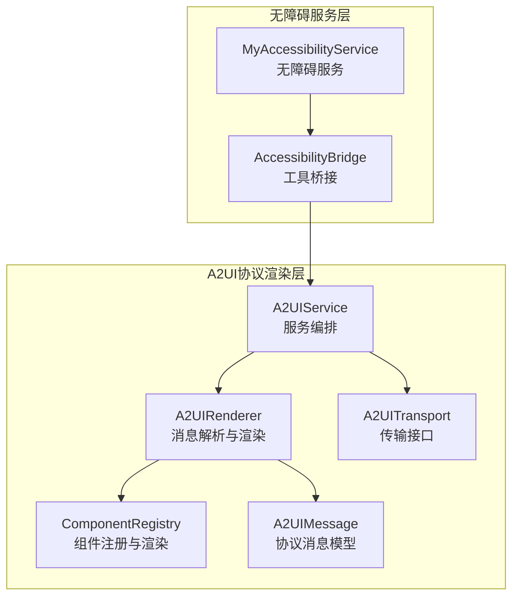
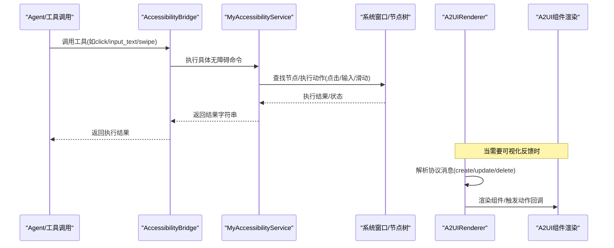
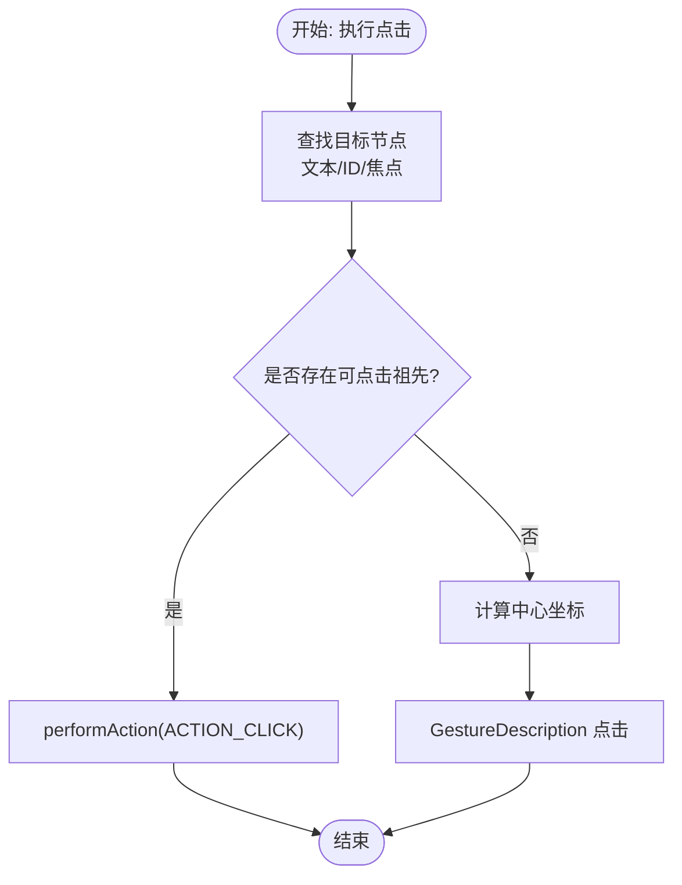
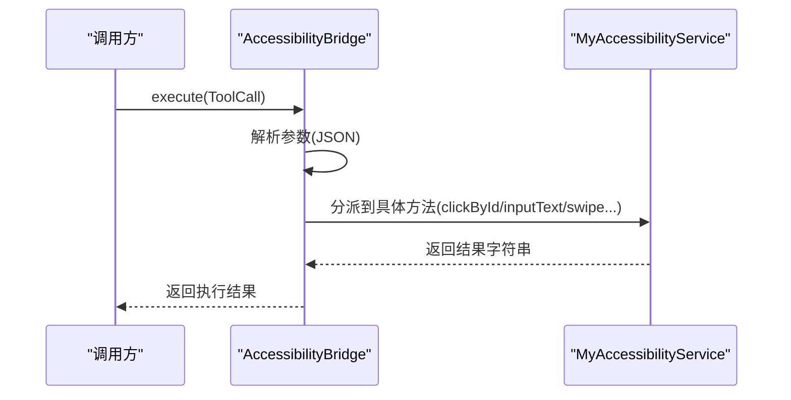
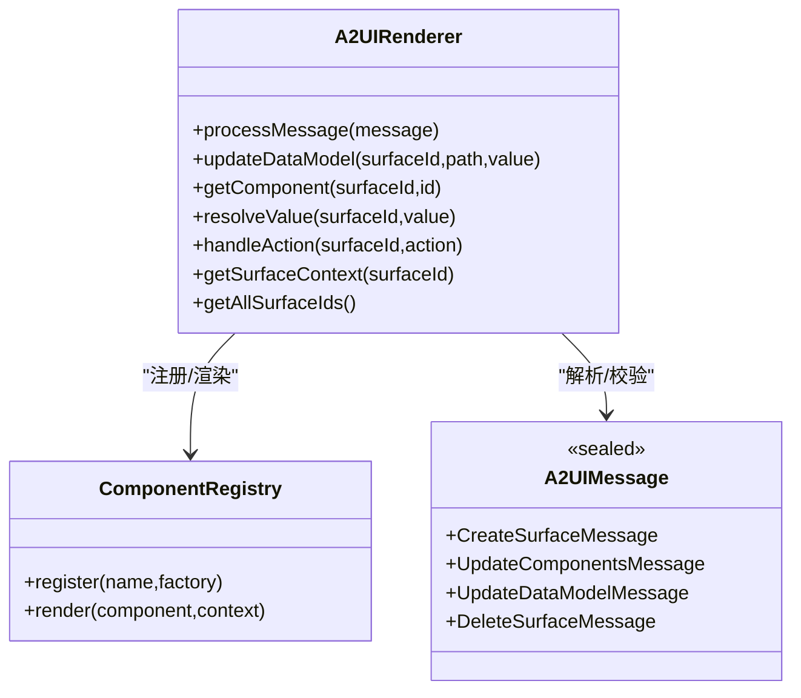
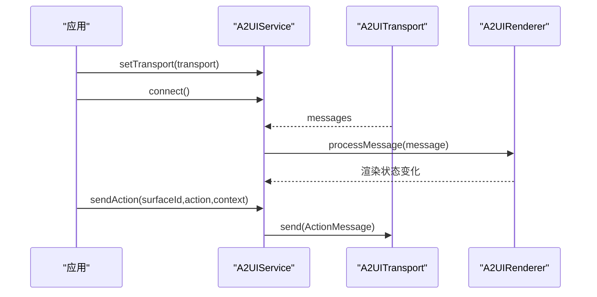
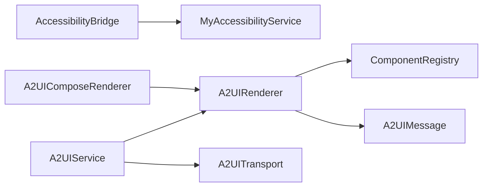

# UI自动化功能

<cite>
**本文引用的文件**
- [MyAccessibilityService.kt](file://app/src/main/java/ai/openclaw/android/MyAccessibilityService.kt)
- [AccessibilityBridge.kt](file://app/src/main/java/ai/openclaw/android/accessibility/AccessibilityBridge.kt)
- [A2UIService.kt](file://android_compose/src/main/java/org/a2ui/compose/service/A2UIService.kt)
- [A2UIMessage.kt](file://android_compose/src/main/java/org/a2ui/compose/data/A2UIMessage.kt)
- [A2UIRenderer.kt](file://android_compose/src/main/java/org/a2ui/compose/rendering/A2UIRenderer.kt)
- [ComponentRegistry.kt](file://android_compose/src/main/java/org/a2ui/compose/rendering/ComponentRegistry.kt)
- [A2UITransport.kt](file://android_compose/src/main/java/org/a2ui/compose/transport/A2UITransport.kt)
- [A2UIComposeRenderer.kt](file://app/src/main/java/ai/openclaw/android/ui/A2UIComposeRenderer.kt)
- [AndroidManifest.xml](file://app/src/main/AndroidManifest.xml)
- [accessibility_config.xml](file://app/src/main/res/xml/accessibility_config.xml)
- [A2UIComprehensiveDemo.kt](file://android_compose/src/main/java/org/a2ui/compose/example/A2UIComprehensiveDemo.kt)
</cite>

## 目录
1. [简介](#简介)
2. [项目结构](#项目结构)
3. [核心组件](#核心组件)
4. [架构总览](#架构总览)
5. [详细组件分析](#详细组件分析)
6. [依赖关系分析](#依赖关系分析)
7. [性能考虑](#性能考虑)
8. [故障排查指南](#故障排查指南)
9. [结论](#结论)
10. [附录](#附录)

## 简介
本文件系统性阐述OpenClaw项目中的UI自动化能力，重点围绕无障碍服务如何实现UI元素的自动查找与操作，覆盖点击、文本输入、滑动等基础交互；说明屏幕读取与内容提取的技术实现；解释自动化操作的时机控制与状态同步机制；给出错误处理与重试策略；并提供可复用的使用场景与最佳实践。同时补充A2UI协议驱动的可视化渲染体系，帮助在聊天界面或应用内以结构化方式呈现自动化结果。

## 项目结构
UI自动化由两部分协同完成：
- 无障碍服务层：负责与系统窗口交互，执行点击、输入、滑动、截图、读屏等底层操作。
- A2UI协议渲染层：负责接收结构化消息，动态渲染UI卡片与组件，支持动作回调与数据模型联动。

图示来源
- [MyAccessibilityService.kt:38-676](file://app/src/main/java/ai/openclaw/android/MyAccessibilityService.kt#L38-L676)
- [AccessibilityBridge.kt:19-328](file://app/src/main/java/ai/openclaw/android/accessibility/AccessibilityBridge.kt#L19-L328)
- [A2UIService.kt:112-232](file://android_compose/src/main/java/org/a2ui/compose/service/A2UIService.kt#L112-L232)
- [A2UIRenderer.kt:64-660](file://android_compose/src/main/java/org/a2ui/compose/rendering/A2UIRenderer.kt#L64-L660)
- [ComponentRegistry.kt:74-800](file://android_compose/src/main/java/org/a2ui/compose/rendering/ComponentRegistry.kt#L74-L800)
- [A2UIMessage.kt:10-314](file://android_compose/src/main/java/org/a2ui/compose/data/A2UIMessage.kt#L10-L314)
- [A2UITransport.kt:7-41](file://android_compose/src/main/java/org/a2ui/compose/transport/A2UITransport.kt#L7-L41)

章节来源
- [AndroidManifest.xml:82-94](file://app/src/main/AndroidManifest.xml#L82-L94)
- [accessibility_config.xml:1-10](file://app/src/main/res/xml/accessibility_config.xml#L1-L10)

## 核心组件
- MyAccessibilityService：系统级无障碍服务，提供节点查找、点击、长按、文本输入、滑动、系统按键、读屏、截图、应用识别与启动等能力。
- AccessibilityBridge：将外部工具调用映射到无障碍服务命令，统一参数解析与错误处理。
- A2UIService：A2UI协议的服务编排器，负责连接、消息分发、动作发送与资源释放。
- A2UIRenderer：协议消息解析器，维护Surface、组件与数据模型，触发渲染与动作处理。
- ComponentRegistry：标准组件注册与渲染，涵盖Text、Button、TextField、CheckBox、ChoicePicker、List、Tabs、Modal、Image、Icon等。
- A2UIMessage：协议消息模型（createSurface、updateComponents、updateDataModel、deleteSurface），支持多版本与校验。
- A2UITransport：传输抽象，定义状态流与消息流，便于扩展WebSocket/HTTP等传输。
- A2UIComposeRenderer：在聊天界面中解析[A2UI]...[/A2UI]包裹的协议消息并渲染。

章节来源
- [MyAccessibilityService.kt:101-676](file://app/src/main/java/ai/openclaw/android/MyAccessibilityService.kt#L101-L676)
- [AccessibilityBridge.kt:29-328](file://app/src/main/java/ai/openclaw/android/accessibility/AccessibilityBridge.kt#L29-L328)
- [A2UIService.kt:112-232](file://android_compose/src/main/java/org/a2ui/compose/service/A2UIService.kt#L112-L232)
- [A2UIRenderer.kt:108-171](file://android_compose/src/main/java/org/a2ui/compose/rendering/A2UIRenderer.kt#L108-L171)
- [ComponentRegistry.kt:131-800](file://android_compose/src/main/java/org/a2ui/compose/rendering/ComponentRegistry.kt#L131-L800)
- [A2UIMessage.kt:23-77](file://android_compose/src/main/java/org/a2ui/compose/data/A2UIMessage.kt#L23-L77)
- [A2UITransport.kt:7-41](file://android_compose/src/main/java/org/a2ui/compose/transport/A2UITransport.kt#L7-L41)
- [A2UIComposeRenderer.kt:27-68](file://app/src/main/java/ai/openclaw/android/ui/A2UIComposeRenderer.kt#L27-L68)

## 架构总览
下图展示从Agent工具调用到系统UI操作与渲染反馈的完整链路：

图示来源
- [AccessibilityBridge.kt:225-254](file://app/src/main/java/ai/openclaw/android/accessibility/AccessibilityBridge.kt#L225-L254)
- [MyAccessibilityService.kt:147-243](file://app/src/main/java/ai/openclaw/android/MyAccessibilityService.kt#L147-L243)
- [A2UIRenderer.kt:108-171](file://android_compose/src/main/java/org/a2ui/compose/rendering/A2UIRenderer.kt#L108-L171)

## 详细组件分析

### 无障碍服务：MyAccessibilityService
- 节点查找
  - 文本匹配：findNodesByText
  - 资源ID匹配：findNodesById
  - 获取当前焦点可编辑节点：findFocusedEditable
- 点击与长按
  - 文本点击：clickByText
  - 资源ID点击：clickById
  - 坐标点击：clickAtPosition
  - 长按：longClickByText
- 文本输入
  - 输入到当前焦点输入框：inputText
  - 指定ID输入：inputTextById
- 手势与系统键
  - 滑动：swipe（方向与距离）
  - 系统键：back/home/recents
- 屏幕读取与截图
  - 读取可见文本：readScreenText
  - 结构化UI树：readScreenStructured
  - 截图：initMediaProjection + takeScreenshot（需授权）
- 应用识别与启动
  - 获取当前应用：getCurrentApp
  - 启动指定包名应用：launchApp

图示来源
- [MyAccessibilityService.kt:147-243](file://app/src/main/java/ai/openclaw/android/MyAccessibilityService.kt#L147-L243)

章节来源
- [MyAccessibilityService.kt:101-676](file://app/src/main/java/ai/openclaw/android/MyAccessibilityService.kt#L101-L676)

### 工具桥接：AccessibilityBridge
- 工具清单：click、click_by_id、long_click、input_text、swipe、press_back、press_home、read_screen、screenshot、find_elements、get_current_app、launch_app
- 参数解析：JSON反序列化，缺失参数返回错误
- 执行流程：在主线程调度到无障碍服务，按工具名分派到对应方法
- 版本与平台限制：对API级别进行前置检查（如swipe需API 24，screenshot需API 26）

图示来源
- [AccessibilityBridge.kt:225-327](file://app/src/main/java/ai/openclaw/android/accessibility/AccessibilityBridge.kt#L225-L327)

章节来源
- [AccessibilityBridge.kt:29-328](file://app/src/main/java/ai/openclaw/android/accessibility/AccessibilityBridge.kt#L29-L328)

### A2UI协议渲染：A2UIRenderer
- 消息处理：支持createSurface、updateComponents、updateDataModel、deleteSurface四种消息类型，带大小限制与未知类型保护
- 数据模型：支持literal/path/functionCall三类动态值解析，双向绑定更新
- 组件渲染：通过ComponentRegistry注册标准组件，支持Collection Scope（列表模板）、Tabs、Modal、Button事件、Icon/Text/Image等
- 错误处理：统一记录错误队列，最多保留100条，支持清空与逐条移除
- 状态管理：Surface上下文、组件集合、变更通知流，保证一次原子快照更新

图示来源
- [A2UIRenderer.kt:64-577](file://android_compose/src/main/java/org/a2ui/compose/rendering/A2UIRenderer.kt#L64-L577)
- [ComponentRegistry.kt:74-800](file://android_compose/src/main/java/org/a2ui/compose/rendering/ComponentRegistry.kt#L74-L800)
- [A2UIMessage.kt:23-77](file://android_compose/src/main/java/org/a2ui/compose/data/A2UIMessage.kt#L23-L77)

章节来源
- [A2UIRenderer.kt:108-171](file://android_compose/src/main/java/org/a2ui/compose/rendering/A2UIRenderer.kt#L108-L171)
- [A2UIMessage.kt:14-27](file://android_compose/src/main/java/org/a2ui/compose/data/A2UIMessage.kt#L14-L27)

### A2UI服务编排：A2UIService
- 生命周期：connect/disconnect，消息收集与分发，动作发送（ActionMessage）
- 资源管理：自动关闭旧传输层，线程隔离（Main + SupervisorJob），幂等close
- 上下文：rendererState封装渲染器状态，支持渲染Surface、获取Surface上下文、获取所有Surface Id

图示来源
- [A2UIService.kt:142-190](file://android_compose/src/main/java/org/a2ui/compose/service/A2UIService.kt#L142-L190)
- [A2UITransport.kt:14-21](file://android_compose/src/main/java/org/a2ui/compose/transport/A2UITransport.kt#L14-L21)

章节来源
- [A2UIService.kt:112-232](file://android_compose/src/main/java/org/a2ui/compose/service/A2UIService.kt#L112-L232)
- [A2UITransport.kt:7-41](file://android_compose/src/main/java/org/a2ui/compose/transport/A2UITransport.kt#L7-L41)

### 聊天内渲染：A2UIComposeRenderer
- 提取[A2UI]...[/A2UI]包裹的协议消息，自动识别标准协议或转换旧格式
- 将协议消息注入A2UIRenderer，触发渲染
- 支持多Surface并行渲染，错误捕获与日志输出

章节来源
- [A2UIComposeRenderer.kt:27-68](file://app/src/main/java/ai/openclaw/android/ui/A2UIComposeRenderer.kt#L27-L68)

## 依赖关系分析
- 无障碍服务依赖系统AccessibilityNodeInfo与GestureDescription，受Android版本API限制
- 工具桥接依赖无障碍服务实例，运行于主线程，避免跨线程UI异常
- A2UI渲染依赖组件注册表与数据模型处理器，支持动态值解析与双向绑定
- 传输层抽象解耦消息来源（本地/远程），便于扩展

图示来源
- [AccessibilityBridge.kt:225-254](file://app/src/main/java/ai/openclaw/android/accessibility/AccessibilityBridge.kt#L225-L254)
- [A2UIService.kt:142-190](file://android_compose/src/main/java/org/a2ui/compose/service/A2UIService.kt#L142-L190)
- [A2UIRenderer.kt:108-171](file://android_compose/src/main/java/org/a2ui/compose/rendering/A2UIRenderer.kt#L108-L171)
- [ComponentRegistry.kt:74-800](file://android_compose/src/main/java/org/a2ui/compose/rendering/ComponentRegistry.kt#L74-L800)
- [A2UIMessage.kt:23-77](file://android_compose/src/main/java/org/a2ui/compose/data/A2UIMessage.kt#L23-L77)
- [A2UITransport.kt:14-21](file://android_compose/src/main/java/org/a2ui/compose/transport/A2UITransport.kt#L14-L21)
- [A2UIComposeRenderer.kt:37-67](file://app/src/main/java/ai/openclaw/android/ui/A2UIComposeRenderer.kt#L37-L67)

章节来源
- [AndroidManifest.xml:82-94](file://app/src/main/AndroidManifest.xml#L82-L94)
- [accessibility_config.xml:1-10](file://app/src/main/res/xml/accessibility_config.xml#L1-L10)

## 性能考虑
- 渲染性能
  - 单次原子快照更新：减少Compose多次重组
  - 组件数量与Surface上限控制，避免内存膨胀
  - 列表渲染采用LazyColumn/LazyRow，模板化渲染降低开销
- 协议解析
  - 最大消息大小限制（1MB），超限直接拒绝
  - 严格JSON解析与未知字段忽略，提升鲁棒性
- 无障碍操作
  - 优先使用performAction，必要时降级为手势，减少误差
  - 滑动距离按屏幕高度比例计算，适配不同分辨率
- 截图与媒体投影
  - 初始化MediaProjection后复用ImageReader，及时释放资源
  - JPEG压缩与Base64编码，注意内存占用

章节来源
- [A2UIRenderer.kt:83-91](file://android_compose/src/main/java/org/a2ui/compose/rendering/A2UIRenderer.kt#L83-L91)
- [MyAccessibilityService.kt:368-417](file://app/src/main/java/ai/openclaw/android/MyAccessibilityService.kt#L368-L417)
- [MyAccessibilityService.kt:485-568](file://app/src/main/java/ai/openclaw/android/MyAccessibilityService.kt#L485-L568)

## 故障排查指南
- 无障碍服务未启用
  - 现象：工具调用返回“无障碍服务未运行”
  - 处理：在系统设置中开启无障碍服务，并授予相应权限
- API版本限制
  - 现象：swipe/screenshot返回“需要更高API版本”
  - 处理：检查设备API级别是否满足要求（swipe>=24，screenshot>=26）
- 节点不可点击
  - 现象：点击失败，回退到手势
  - 处理：确认目标节点存在可点击祖先；必要时使用坐标点击
- 截图初始化失败
  - 现象：提示“未初始化MediaProjection”或截图为null
  - 处理：先调用initMediaProjection再takeScreenshot；确保授权成功
- 协议消息异常
  - 现象：解析失败或消息过大被拒绝
  - 处理：检查消息格式与版本；拆分过大的消息

章节来源
- [AccessibilityBridge.kt:287-304](file://app/src/main/java/ai/openclaw/android/accessibility/AccessibilityBridge.kt#L287-L304)
- [MyAccessibilityService.kt:489-513](file://app/src/main/java/ai/openclaw/android/MyAccessibilityService.kt#L489-L513)
- [A2UIRenderer.kt:116-120](file://android_compose/src/main/java/org/a2ui/compose/rendering/A2UIRenderer.kt#L116-L120)

## 结论
本项目通过“无障碍服务+A2UI协议”的双层架构，实现了从UI元素自动查找、点击、输入、滑动，到屏幕读取与可视化反馈的完整闭环。无障碍层负责底层系统交互，协议层负责结构化表达与渲染，二者配合既保证了自动化能力的普适性，也提供了良好的可观察性与可扩展性。建议在实际使用中结合错误处理与重试策略，关注不同Android版本的兼容性与性能优化。

## 附录

### 使用场景与示例
- 自动化点击
  - 通过文本或资源ID定位元素并点击
  - 参考：[MyAccessibilityService.kt:147-181](file://app/src/main/java/ai/openclaw/android/MyAccessibilityService.kt#L147-L181)、[AccessibilityBridge.kt:265-275](file://app/src/main/java/ai/openclaw/android/accessibility/AccessibilityBridge.kt#L265-L275)
- 文本输入
  - 在当前焦点输入框或指定ID输入框中输入文本
  - 参考：[MyAccessibilityService.kt:299-361](file://app/src/main/java/ai/openclaw/android/MyAccessibilityService.kt#L299-L361)、[AccessibilityBridge.kt:282-285](file://app/src/main/java/ai/openclaw/android/accessibility/AccessibilityBridge.kt#L282-L285)
- 滑动操作
  - 按方向与距离执行滑动，常用于滚动列表或页面切换
  - 参考：[MyAccessibilityService.kt:368-417](file://app/src/main/java/ai/openclaw/android/MyAccessibilityService.kt#L368-L417)、[AccessibilityBridge.kt:287-296](file://app/src/main/java/ai/openclaw/android/accessibility/AccessibilityBridge.kt#L287-L296)
- 屏幕读取与截图
  - 读取可见文本与结构化UI树，必要时进行截图
  - 参考：[MyAccessibilityService.kt:446-482](file://app/src/main/java/ai/openclaw/android/MyAccessibilityService.kt#L446-L482)、[MyAccessibilityService.kt:485-568](file://app/src/main/java/ai/openclaw/android/MyAccessibilityService.kt#L485-L568)
- 可视化反馈
  - 将协议消息注入A2UIRenderer，渲染组件卡片与交互
  - 参考：[A2UIRenderer.kt:108-171](file://android_compose/src/main/java/org/a2ui/compose/rendering/A2UIRenderer.kt#L108-L171)、[A2UIComposeRenderer.kt:27-68](file://app/src/main/java/ai/openclaw/android/ui/A2UIComposeRenderer.kt#L27-L68)

### 兼容性说明
- Android版本
  - swipe：API 24+
  - screenshot：API 26+
  - MediaProjection：API 21+
- 设备权限
  - 无障碍服务：需在系统设置中启用
  - 截图：需MediaProjection授权
- Manifest声明
  - 无障碍服务与配置文件已在清单中声明
  - 参考：[AndroidManifest.xml:82-94](file://app/src/main/AndroidManifest.xml#L82-L94)、[accessibility_config.xml:1-10](file://app/src/main/res/xml/accessibility_config.xml#L1-L10)

### 错误处理与重试策略
- 错误记录
  - A2UIRenderer维护错误队列，最多100条，支持清空与逐条移除
  - 参考：[A2UIRenderer.kt:173-195](file://android_compose/src/main/java/org/a2ui/compose/rendering/A2UIRenderer.kt#L173-L195)
- 重试建议
  - 对于点击/滑动等不确定性操作，可在上层增加指数退避重试
  - 对于截图失败，建议检查MediaProjection授权与资源释放
  - 对于协议消息过大，建议拆分为多个小消息发送