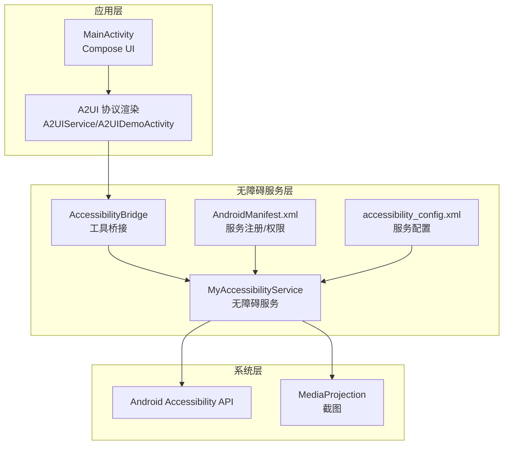
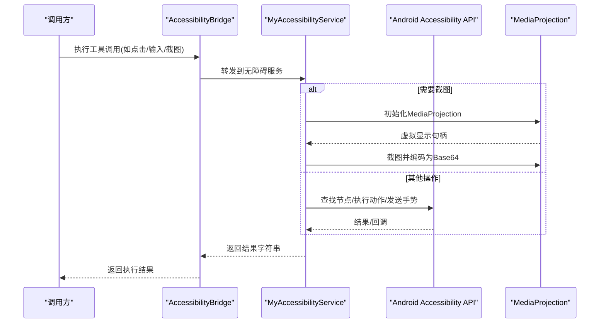
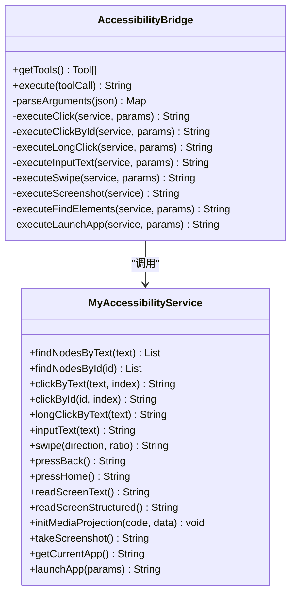
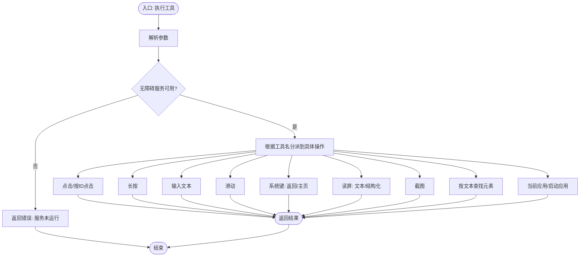
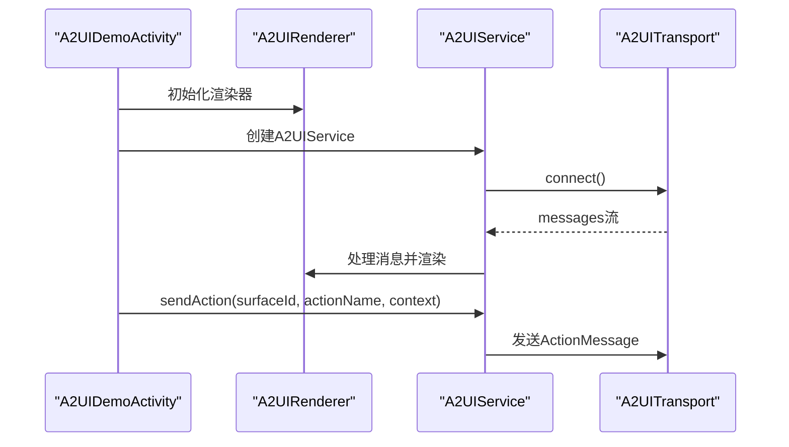
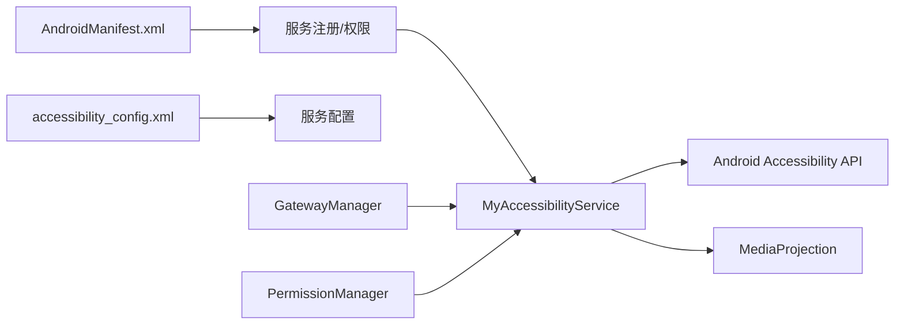

# 无障碍服务

<cite>
**本文引用的文件列表**
- [AccessibilityBridge.kt](file://app/src/main/java/ai/openclaw/android/accessibility/AccessibilityBridge.kt)
- [MyAccessibilityService.kt](file://app/src/main/java/ai/openclaw/android/MyAccessibilityService.kt)
- [accessibility_config.xml](file://app/src/main/res/xml/accessibility_config.xml)
- [AndroidManifest.xml](file://app/src/main/AndroidManifest.xml)
- [A2UIService.kt](file://android_compose/src/main/java/org/a2ui/compose/service/A2UIService.kt)
- [A2UIDemoActivity.kt](file://android_compose/src/main/java/org/a2ui/compose/example/A2UIDemoActivity.kt)
- [README.md](file://README.md)
- [GatewayManager.kt](file://app/src/main/java/ai/openclaw/android/GatewayManager.kt)
- [PermissionManager.kt](file://app/src/main/java/ai/openclaw/android/permission/PermissionManager.kt)
</cite>

## 目录
1. [简介](#简介)
2. [项目结构](#项目结构)
3. [核心组件](#核心组件)
4. [架构总览](#架构总览)
5. [详细组件分析](#详细组件分析)
6. [依赖关系分析](#依赖关系分析)
7. [性能与稳定性](#性能与稳定性)
8. [使用示例与最佳实践](#使用示例与最佳实践)
9. [故障排除指南](#故障排除指南)
10. [结论](#结论)

## 简介
本文件面向无障碍服务与UI自动化能力，系统化阐述以下主题：
- 无障碍桥接设计与Android无障碍服务API使用
- UI自动化实现机制（点击、长按、输入、滑动、截图、读屏、应用切换）
- 权限申请与配置要求
- 屏幕读取、元素点击、文本输入等核心功能实现
- 性能优化与稳定性保障
- 使用示例与故障排除
- 兼容性考虑与最佳实践

## 项目结构
无障碍服务位于主模块 app 中，核心文件包括：
- MyAccessibilityService：无障碍服务实现，负责节点查找、手势、截图、读屏、系统按键等
- AccessibilityBridge：工具函数桥接，将“工具调用”转换为无障碍命令
- accessibility_config.xml：无障碍服务配置
- AndroidManifest.xml：服务注册与权限声明
- A2UIService 与 A2UIDemoActivity：A2UI协议渲染与示例，便于理解UI卡片与交互
- GatewayManager：与无障碍服务协作，初始化屏幕捕获
- PermissionManager：权限管理，辅助无障碍服务运行所需的权限

图表来源
- [AndroidManifest.xml:78-90](file://app/src/main/AndroidManifest.xml#L78-L90)
- [accessibility_config.xml:1-10](file://app/src/main/res/xml/accessibility_config.xml#L1-L10)
- [MyAccessibilityService.kt:38-99](file://app/src/main/java/ai/openclaw/android/MyAccessibilityService.kt#L38-L99)
- [AccessibilityBridge.kt:19-254](file://app/src/main/java/ai/openclaw/android/accessibility/AccessibilityBridge.kt#L19-L254)

章节来源
- [README.md:89-152](file://README.md#L89-L152)
- [AndroidManifest.xml:78-90](file://app/src/main/AndroidManifest.xml#L78-L90)
- [accessibility_config.xml:1-10](file://app/src/main/res/xml/accessibility_config.xml#L1-L10)

## 核心组件
- MyAccessibilityService：实现无障碍服务生命周期、节点查找、点击/长按、输入文本、滑动、系统按键、读屏、截图、应用信息与启动、结构化UI树读取等
- AccessibilityBridge：定义可用工具清单（点击、按ID点击、长按、输入文本、滑动、返回/主页、读屏、截图、按文本查找元素、当前应用、启动应用），并将工具调用转发给无障碍服务执行
- A2UIService/A2UIDemoActivity：展示A2UI协议在无障碍场景中的渲染与交互，便于理解UI卡片与动作分发
- GatewayManager：在需要截图时通过MediaProjection初始化屏幕捕获
- PermissionManager：统一管理各类运行时权限，确保无障碍服务所需权限到位

章节来源
- [MyAccessibilityService.kt:38-676](file://app/src/main/java/ai/openclaw/android/MyAccessibilityService.kt#L38-L676)
- [AccessibilityBridge.kt:19-328](file://app/src/main/java/ai/openclaw/android/accessibility/AccessibilityBridge.kt#L19-L328)
- [A2UIService.kt:112-223](file://android_compose/src/main/java/org/a2ui/compose/service/A2UIService.kt#L112-L223)
- [A2UIDemoActivity.kt:16-72](file://android_compose/src/main/java/org/a2ui/compose/example/A2UIDemoActivity.kt#L16-L72)
- [GatewayManager.kt:307-321](file://app/src/main/java/ai/openclaw/android/GatewayManager.kt#L307-L321)
- [PermissionManager.kt:32-153](file://app/src/main/java/ai/openclaw/android/permission/PermissionManager.kt#L32-L153)

## 架构总览
无障碍服务采用“桥接-服务-系统API”的分层设计：
- 工具层：AccessibilityBridge 将抽象工具映射到具体无障碍操作
- 服务层：MyAccessibilityService 实现节点查找、手势生成、系统按键、读屏、截图等
- 系统层：Android Accessibility API 与 MediaProjection 提供底层能力
- 配置层：AndroidManifest 与 accessibility_config.xml 注册与配置服务
- 协作层：GatewayManager 在需要截图时初始化MediaProjection；A2UIService/A2UIDemoActivity 展示UI卡片与动作

图表来源
- [AccessibilityBridge.kt:225-254](file://app/src/main/java/ai/openclaw/android/accessibility/AccessibilityBridge.kt#L225-L254)
- [MyAccessibilityService.kt:489-546](file://app/src/main/java/ai/openclaw/android/MyAccessibilityService.kt#L489-L546)
- [GatewayManager.kt:307-321](file://app/src/main/java/ai/openclaw/android/GatewayManager.kt#L307-L321)

## 详细组件分析

### 组件一：无障碍桥接（AccessibilityBridge）
- 设计目标：将“工具调用”抽象为可执行的无障碍命令，屏蔽平台差异
- 工具清单与参数：
  - 点击：按可见文本或资源ID点击，支持索引选择
  - 长按：按可见文本长按触发上下文菜单
  - 输入文本：向当前焦点输入框写入文本
  - 滑动：上/下/左/右方向与距离比例
  - 系统键：返回、主页、最近任务
  - 读屏：读取可见文本与结构化UI树
  - 截图：基于MediaProjection的屏幕截图（Base64）
  - 查找元素：按文本查找节点并返回位置
  - 当前应用：获取包名、应用标签、活动类名
  - 启动应用：按包名启动应用
- 执行流程：
  - 解析JSON参数
  - 获取MyAccessibilityService单例
  - 在主线程调度执行对应操作
  - 返回人类可读的结果字符串

图表来源
- [AccessibilityBridge.kt:19-328](file://app/src/main/java/ai/openclaw/android/accessibility/AccessibilityBridge.kt#L19-L328)
- [MyAccessibilityService.kt:106-605](file://app/src/main/java/ai/openclaw/android/MyAccessibilityService.kt#L106-L605)

章节来源
- [AccessibilityBridge.kt:29-220](file://app/src/main/java/ai/openclaw/android/accessibility/AccessibilityBridge.kt#L29-L220)
- [AccessibilityBridge.kt:225-328](file://app/src/main/java/ai/openclaw/android/accessibility/AccessibilityBridge.kt#L225-L328)

### 组件二：无障碍服务（MyAccessibilityService）
- 生命周期与屏幕信息：
  - onServiceConnected：保存实例、获取屏幕尺寸与密度
  - onAccessibilityEvent/onInterrupt/onDestroy：日志记录与资源释放
- 节点查找：
  - 按文本/按ID查找节点，递归查找可编辑且聚焦的输入节点
- 点击与长按：
  - 优先使用performAction，失败回退到手势点击/长按
  - 支持坐标点击
- 文本输入：
  - 清空后设置文本，支持按ID定位输入框
- 滑动：
  - 基于GestureDescription，支持上/下/左/右，距离为屏幕高度比例
- 系统按键：
  - 全局动作：返回、主页、最近任务
- 读屏：
  - 读取可见文本与内容描述
  - 结构化UI树输出（限制深度与子节点数量）
- 截图：
  - MediaProjection初始化虚拟显示，ImageReader采集图像，Bitmap压缩为JPEG并Base64编码
- 应用信息与启动：
  - 获取当前应用包名/标签/活动类名
  - 通过Intent启动指定包名的应用

图表来源
- [AccessibilityBridge.kt:225-254](file://app/src/main/java/ai/openclaw/android/accessibility/AccessibilityBridge.kt#L225-L254)
- [MyAccessibilityService.kt:150-605](file://app/src/main/java/ai/openclaw/android/MyAccessibilityService.kt#L150-L605)

章节来源
- [MyAccessibilityService.kt:58-99](file://app/src/main/java/ai/openclaw/android/MyAccessibilityService.kt#L58-L99)
- [MyAccessibilityService.kt:106-605](file://app/src/main/java/ai/openclaw/android/MyAccessibilityService.kt#L106-L605)

### 组件三：A2UI协议与渲染（A2UIService/A2UIDemoActivity）
- A2UIService：管理渲染器与传输层生命周期，提供消息处理、动作发送、连接/断开、资源释放
- A2UIDemoActivity：演示表单、组件库、列表等卡片渲染，展示动作处理器如何接收事件并处理上下文

图表来源
- [A2UIService.kt:112-223](file://android_compose/src/main/java/org/a2ui/compose/service/A2UIService.kt#L112-L223)
- [A2UIDemoActivity.kt:16-72](file://android_compose/src/main/java/org/a2ui/compose/example/A2UIDemoActivity.kt#L16-L72)

章节来源
- [A2UIService.kt:112-223](file://android_compose/src/main/java/org/a2ui/compose/service/A2UIService.kt#L112-L223)
- [A2UIDemoActivity.kt:16-72](file://android_compose/src/main/java/org/a2ui/compose/example/A2UIDemoActivity.kt#L16-L72)

## 依赖关系分析
- 无障碍服务注册与配置：
  - AndroidManifest 声明绑定无障碍服务权限，并注册服务与配置元数据
  - accessibility_config.xml 指定事件类型、反馈类型、标志位、是否允许手势与窗口内容检索
- 截图依赖：
  - GatewayManager 在需要时调用 MyAccessibilityService.initMediaProjection 完成MediaProjection初始化
- 权限管理：
  - PermissionManager 统一管理位置、联系人、短信、日历、存储等权限组状态，确保无障碍服务运行所需权限到位

图表来源
- [AndroidManifest.xml:78-90](file://app/src/main/AndroidManifest.xml#L78-L90)
- [accessibility_config.xml:1-10](file://app/src/main/res/xml/accessibility_config.xml#L1-L10)
- [MyAccessibilityService.kt:489-546](file://app/src/main/java/ai/openclaw/android/MyAccessibilityService.kt#L489-L546)
- [GatewayManager.kt:307-321](file://app/src/main/java/ai/openclaw/android/GatewayManager.kt#L307-L321)
- [PermissionManager.kt:32-153](file://app/src/main/java/ai/openclaw/android/permission/PermissionManager.kt#L32-L153)

章节来源
- [AndroidManifest.xml:78-90](file://app/src/main/AndroidManifest.xml#L78-L90)
- [accessibility_config.xml:1-10](file://app/src/main/res/xml/accessibility_config.xml#L1-L10)
- [GatewayManager.kt:307-321](file://app/src/main/java/ai/openclaw/android/GatewayManager.kt#L307-L321)
- [PermissionManager.kt:32-153](file://app/src/main/java/ai/openclaw/android/permission/PermissionManager.kt#L32-L153)

## 性能与稳定性
- 节点遍历与读屏
  - 读屏采用深度优先遍历，限制最大深度与每层最大子节点数，避免过深UI树导致卡顿
  - 结构化输出截断超长结果，防止消息过大
- 手势与截图
  - 手势使用固定时长，等待完成或取消回调，避免阻塞主线程
  - 截图在IO线程执行，ImageReader缓冲队列长度为2，降低延迟
- 资源管理
  - 服务销毁时释放MediaProjection与ImageReader，防止内存泄漏
  - A2UIService 使用原子布尔量防止重复关闭，协程作用域统一取消
- 平台兼容
  - 对API级别进行条件判断（如截图需Android 8.0以上，手势需Android 7.0以上）

章节来源
- [MyAccessibilityService.kt:610-668](file://app/src/main/java/ai/openclaw/android/MyAccessibilityService.kt#L610-L668)
- [MyAccessibilityService.kt:368-417](file://app/src/main/java/ai/openclaw/android/MyAccessibilityService.kt#L368-L417)
- [MyAccessibilityService.kt:518-546](file://app/src/main/java/ai/openclaw/android/MyAccessibilityService.kt#L518-L546)
- [MyAccessibilityService.kt:670-676](file://app/src/main/java/ai/openclaw/android/MyAccessibilityService.kt#L670-L676)
- [A2UIService.kt:208-223](file://android_compose/src/main/java/org/a2ui/compose/service/A2UIService.kt#L208-L223)

## 使用示例与最佳实践
- 启用无障碍服务
  - 在系统设置中启用无障碍服务，确保服务已运行
  - 若服务未运行，工具调用会返回提示
- 常见操作
  - 点击：提供可见文本或资源ID，必要时指定索引
  - 输入：先确保输入框已获得焦点，再调用输入文本
  - 滑动：指定方向与距离比例（0.0-1.0）
  - 截图：先初始化MediaProjection，再调用截图
  - 读屏：读取可见文本或结构化UI树以定位元素
  - 应用切换：提供包名启动目标应用
- 最佳实践
  - 优先使用performAction进行点击/输入，失败后再回退到手势
  - 对长文本读屏结果进行截断处理，避免超长输出
  - 截图前检查API级别与MediaProjection状态
  - 在UI卡片中结合A2UI协议，将复杂交互封装为动作事件

章节来源
- [AccessibilityBridge.kt:225-328](file://app/src/main/java/ai/openclaw/android/accessibility/AccessibilityBridge.kt#L225-L328)
- [MyAccessibilityService.kt:217-243](file://app/src/main/java/ai/openclaw/android/MyAccessibilityService.kt#L217-L243)
- [MyAccessibilityService.kt:489-546](file://app/src/main/java/ai/openclaw/android/MyAccessibilityService.kt#L489-L546)
- [A2UIDemoActivity.kt:16-72](file://android_compose/src/main/java/org/a2ui/compose/example/A2UIDemoActivity.kt#L16-L72)

## 故障排除指南
- 服务未运行
  - 现象：工具调用返回“无障碍服务未运行”
  - 处理：在系统设置中启用无障碍服务
- 点击失败
  - 现象：点击无响应或失败
  - 处理：确认元素可点击；若performAction失败，尝试按ID点击或坐标点击
- 输入失败
  - 现象：无法输入文本
  - 处理：确保输入框已获得焦点；若按ID定位，确认元素可编辑
- 滑动无效
  - 现象：滑动无效果
  - 处理：确认方向参数正确；检查API级别（需Android 7.0以上）
- 截图失败
  - 现象：返回错误或空值
  - 处理：确认API级别（需Android 8.0以上）；先调用initMediaProjection初始化；检查ImageReader状态
- 读屏为空
  - 现象：读屏返回无内容
  - 处理：确认当前界面存在可访问文本；检查窗口内容检索权限

章节来源
- [AccessibilityBridge.kt:288-304](file://app/src/main/java/ai/openclaw/android/accessibility/AccessibilityBridge.kt#L288-L304)
- [MyAccessibilityService.kt:226-243](file://app/src/main/java/ai/openclaw/android/MyAccessibilityService.kt#L226-L243)
- [MyAccessibilityService.kt:317-331](file://app/src/main/java/ai/openclaw/android/MyAccessibilityService.kt#L317-L331)
- [MyAccessibilityService.kt:368-417](file://app/src/main/java/ai/openclaw/android/MyAccessibilityService.kt#L368-L417)
- [MyAccessibilityService.kt:518-546](file://app/src/main/java/ai/openclaw/android/MyAccessibilityService.kt#L518-L546)
- [MyAccessibilityService.kt:450-482](file://app/src/main/java/ai/openclaw/android/MyAccessibilityService.kt#L450-L482)

## 结论
本项目通过“工具桥接 + 无障碍服务 + 系统API”的架构，提供了稳定、可扩展的无障碍与UI自动化能力。其优势在于：
- 明确的工具抽象与结果格式，便于上层集成
- 对节点查找、手势、截图、读屏等能力的完整覆盖
- 资源管理与API级别兼容性处理，提升稳定性
- A2UI协议与示例，便于构建丰富的交互卡片

建议在实际部署中：
- 严格遵循权限申请与配置流程
- 在复杂界面中优先使用结构化读屏与按ID定位
- 对高负载场景（大量截图/频繁手势）进行节流与缓存策略设计