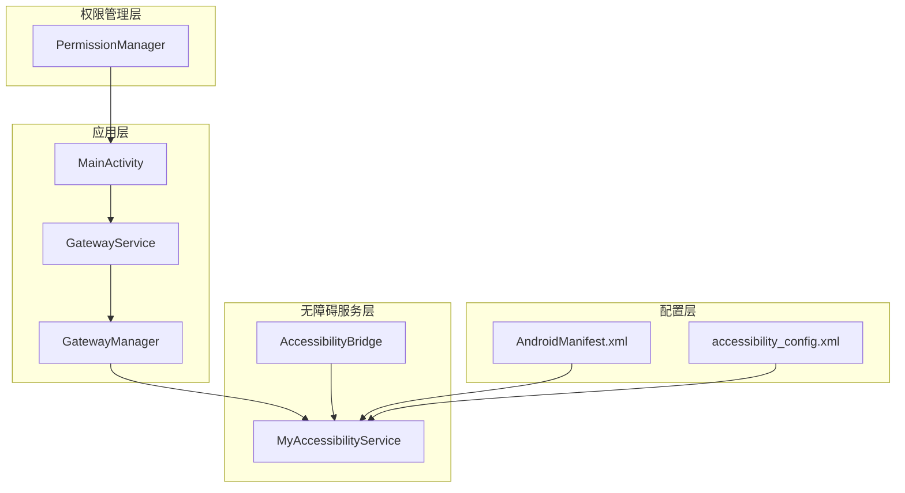
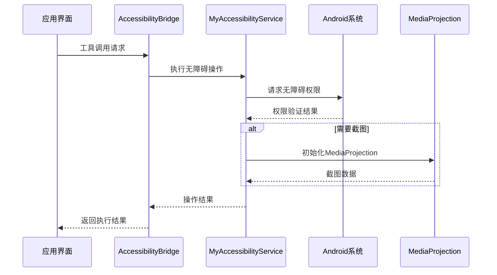
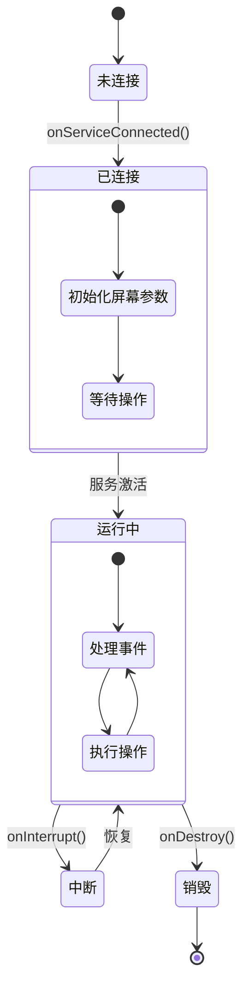
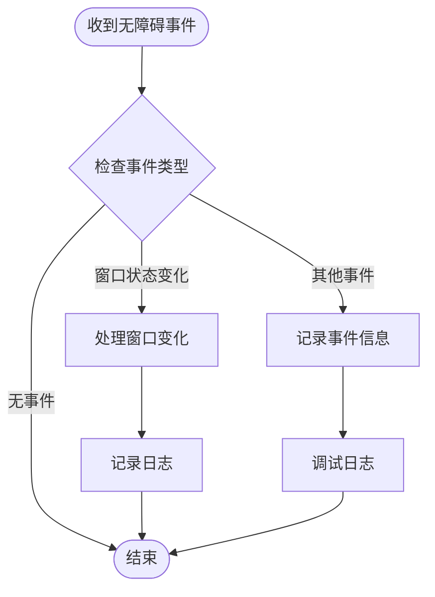
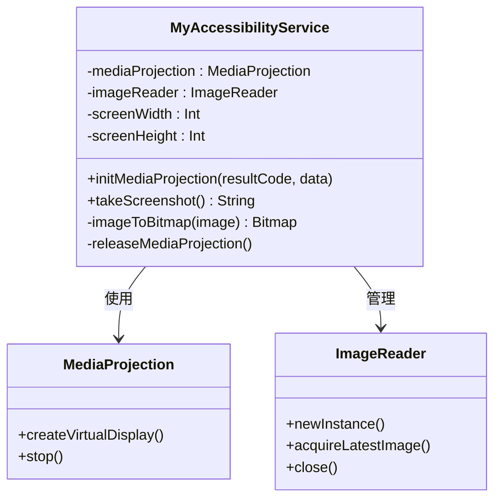
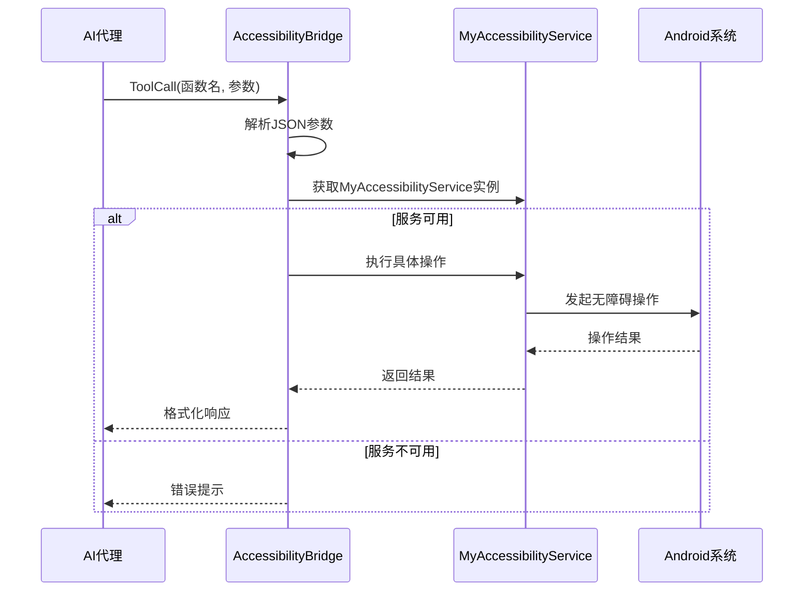
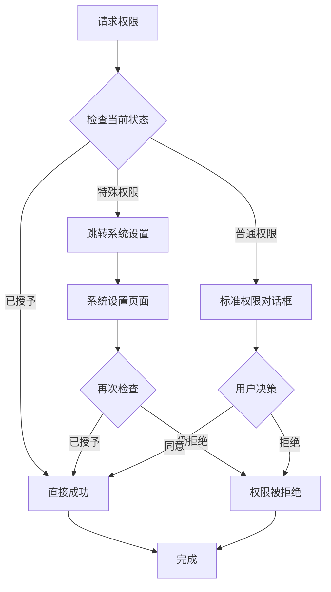
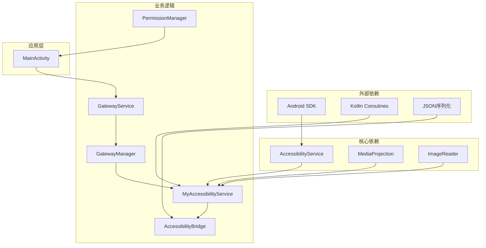
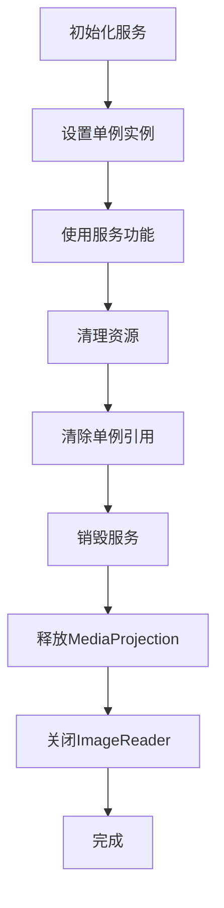

# 无障碍服务核心实现

<cite>
**本文档引用的文件**
- [MyAccessibilityService.kt](file://app/src/main/java/ai/openclaw/android/MyAccessibilityService.kt)
- [AndroidManifest.xml](file://app/src/main/AndroidManifest.xml)
- [accessibility_config.xml](file://app/src/main/res/xml/accessibility_config.xml)
- [AccessibilityBridge.kt](file://app/src/main/java/ai/openclaw/android/accessibility/AccessibilityBridge.kt)
- [GatewayService.kt](file://app/src/main/java/ai/openclaw/android/GatewayService.kt)
- [GatewayManager.kt](file://app/src/main/java/ai/openclaw/android/GatewayManager.kt)
- [PermissionManager.kt](file://app/src/main/java/ai/openclaw/android/permission/PermissionManager.kt)
- [MainActivity.kt](file://app/src/main/java/ai/openclaw/android/MainActivity.kt)
</cite>

## 目录
1. [简介](#简介)
2. [项目结构](#项目结构)
3. [核心组件](#核心组件)
4. [架构概览](#架构概览)
5. [详细组件分析](#详细组件分析)
6. [依赖关系分析](#依赖关系分析)
7. [性能考虑](#性能考虑)
8. [故障排除指南](#故障排除指南)
9. [结论](#结论)

## 简介

OpenClaw Android 项目中的无障碍服务核心实现提供了一个完整的屏幕自动化和交互解决方案。该系统通过 MyAccessibilityService 类实现了 Android 原生无障碍服务功能，结合 GatewayService 和 GatewayManager 提供了强大的后台服务支持。

本项目的核心目标是构建一个智能的无障碍助手，能够：
- 自动化应用程序交互
- 执行复杂的用户界面操作
- 支持截图和屏幕内容读取
- 提供丰富的工具集用于各种自动化任务
- 确保安全性和性能优化

## 项目结构

项目采用模块化的架构设计，主要包含以下关键组件：

**图表来源**
- [AndroidManifest.xml:82-94](file://app/src/main/AndroidManifest.xml#L82-L94)
- [accessibility_config.xml:1-10](file://app/src/main/res/xml/accessibility_config.xml#L1-L10)

**章节来源**
- [AndroidManifest.xml:1-123](file://app/src/main/AndroidManifest.xml#L1-L123)
- [accessibility_config.xml:1-10](file://app/src/main/res/xml/accessibility_config.xml#L1-L10)

## 核心组件

### MyAccessibilityService - 主要无障碍服务类

MyAccessibilityService 是整个无障碍系统的核心，继承自 Android 的 AccessibilityService 类，提供了以下主要功能：

#### 生命周期管理
- **onServiceConnected()**: 服务连接时初始化屏幕尺寸和密度信息
- **onAccessibilityEvent()**: 处理无障碍事件（当前主要用于调试日志）
- **onInterrupt()**: 中断处理
- **onDestroy()**: 销毁时释放 MediaProjection 资源

#### 用户界面交互功能
- **元素查找**: 支持按文本内容和资源 ID 查找 UI 元素
- **点击操作**: 支持基于文本、资源 ID 和坐标点击
- **长按操作**: 支持长按触发上下文菜单
- **文本输入**: 支持向聚焦的输入字段输入文本
- **滑动手势**: 支持上下左右滑动操作

#### 屏幕捕获功能
- **截图支持**: 通过 MediaProjection 实现屏幕截图
- **屏幕内容读取**: 提供结构化和纯文本两种屏幕内容读取方式

**章节来源**
- [MyAccessibilityService.kt:38-99](file://app/src/main/java/ai/openclaw/android/MyAccessibilityService.kt#L38-L99)
- [MyAccessibilityService.kt:101-676](file://app/src/main/java/ai/openclaw/android/MyAccessibilityService.kt#L101-L676)

### AccessibilityBridge - 工具桥接器

AccessibilityBridge 作为工具调用的桥接器，负责将 AI 代理的工具调用转换为实际的无障碍操作：

#### 工具定义
提供 12 种不同的工具类型：
- 点击操作：click, click_by_id
- 长按操作：long_click
- 文本输入：input_text
- 滑动手势：swipe
- 系统按键：press_back, press_home
- 屏幕读取：read_screen
- 截图功能：screenshot
- 元素查找：find_elements
- 应用信息：get_current_app
- 应用启动：launch_app

#### 执行机制
- 参数解析和验证
- 版本兼容性检查
- 异步执行和结果返回
- 错误处理和日志记录

**章节来源**
- [AccessibilityBridge.kt:19-328](file://app/src/main/java/ai/openclaw/android/accessibility/AccessibilityBridge.kt#L19-L328)

### GatewayService - 前台服务

GatewayService 是应用的前台服务，负责维持与后端系统的连接并管理所有后台组件：

#### 服务特性
- **前台服务**: 在通知栏显示持续运行的通知
- **生命周期管理**: 完整的服务生命周期控制
- **状态监控**: 实时监控和广播服务状态
- **资源管理**: 优雅地启动和停止所有组件

#### 通知系统
- 创建专用的通知通道
- 动态更新服务状态通知
- 支持不同 Android 版本的兼容性处理

**章节来源**
- [GatewayService.kt:31-234](file://app/src/main/java/ai/openclaw/android/GatewayService.kt#L31-L234)

### GatewayManager - 组件管理器

GatewayManager 作为核心的组件协调器，管理所有子系统并提供统一的 API 接口：

#### 组件协调
- **模型客户端管理**: 支持本地和云端模型
- **技能系统集成**: 管理各种内置和动态技能
- **内存系统集成**: 协调记忆和会话管理
- **触发器系统**: 管理定时和事件驱动的任务

#### 状态管理
- 连接状态跟踪
- 组件生命周期管理
- 错误处理和恢复机制

**章节来源**
- [GatewayManager.kt:65-677](file://app/src/main/java/ai/openclaw/android/GatewayManager.kt#L65-L677)

## 架构概览

系统采用分层架构设计，确保各组件职责清晰且相互解耦：

**图表来源**
- [AccessibilityBridge.kt:225-254](file://app/src/main/java/ai/openclaw/android/accessibility/AccessibilityBridge.kt#L225-L254)
- [MyAccessibilityService.kt:489-546](file://app/src/main/java/ai/openclaw/android/MyAccessibilityService.kt#L489-L546)

## 详细组件分析

### MyAccessibilityService 详细分析

#### 生命周期管理机制

**图表来源**
- [MyAccessibilityService.kt:58-99](file://app/src/main/java/ai/openclaw/android/MyAccessibilityService.kt#L58-L99)

#### 事件处理机制

MyAccessibilityService 实现了完整的无障碍事件处理流程：

**图表来源**
- [MyAccessibilityService.kt:81-89](file://app/src/main/java/ai/openclaw/android/MyAccessibilityService.kt#L81-L89)

#### 屏幕捕获实现

**图表来源**
- [MyAccessibilityService.kt:489-568](file://app/src/main/java/ai/openclaw/android/MyAccessibilityService.kt#L489-L568)

**章节来源**
- [MyAccessibilityService.kt:489-568](file://app/src/main/java/ai/openclaw/android/MyAccessibilityService.kt#L489-L568)

### AccessibilityBridge 执行流程

**图表来源**
- [AccessibilityBridge.kt:225-254](file://app/src/main/java/ai/openclaw/android/accessibility/AccessibilityBridge.kt#L225-L254)

**章节来源**
- [AccessibilityBridge.kt:225-328](file://app/src/main/java/ai/openclaw/android/accessibility/AccessibilityBridge.kt#L225-L328)

### 权限管理系统

系统实现了完整的权限管理机制，支持多种权限类型的动态请求和状态跟踪：

**图表来源**
- [PermissionManager.kt:41-70](file://app/src/main/java/ai/openclaw/android/permission/PermissionManager.kt#L41-L70)

**章节来源**
- [PermissionManager.kt:32-189](file://app/src/main/java/ai/openclaw/android/permission/PermissionManager.kt#L32-L189)

## 依赖关系分析

系统组件之间的依赖关系体现了清晰的分层架构：

**图表来源**
- [MyAccessibilityService.kt:3-26](file://app/src/main/java/ai/openclaw/android/MyAccessibilityService.kt#L3-L26)
- [AccessibilityBridge.kt:3-14](file://app/src/main/java/ai/openclaw/android/accessibility/AccessibilityBridge.kt#L3-L14)

**章节来源**
- [MyAccessibilityService.kt:1-676](file://app/src/main/java/ai/openclaw/android/MyAccessibilityService.kt#L1-L676)
- [AccessibilityBridge.kt:1-328](file://app/src/main/java/ai/openclaw/android/accessibility/AccessibilityBridge.kt#L1-L328)

## 性能考虑

### 资源管理策略

系统实现了多层资源管理机制以确保最佳性能：

#### 内存管理
- **单例模式**: MyAccessibilityService 使用单例模式避免重复实例化
- **及时释放**: onDestroy() 中确保 MediaProjection 和 ImageReader 资源正确释放
- **协程调度**: 使用 Dispatchers.Main 确保 UI 操作的线程安全性

#### 性能优化技术
- **异步操作**: 所有耗时操作（如截图）使用协程异步执行
- **条件检查**: 在执行复杂操作前进行版本和权限检查
- **资源池化**: 合理管理 ImageReader 和 MediaProjection 的生命周期

#### 内存泄漏防护

**图表来源**
- [MyAccessibilityService.kt:95-99](file://app/src/main/java/ai/openclaw/android/MyAccessibilityService.kt#L95-L99)

**章节来源**
- [MyAccessibilityService.kt:95-99](file://app/src/main/java/ai/openclaw/android/MyAccessibilityService.kt#L95-L99)

### 并发控制

系统采用协程和线程池管理并发操作：

- **主调度器**: 使用 Dispatchers.Main 处理 UI 相关操作
- **IO 调度器**: 使用 Dispatchers.IO 处理网络和文件操作
- **SupervisorJob**: 确保子任务失败不影响整体服务稳定性

## 故障排除指南

### 常见问题诊断

#### 无障碍服务无法启动
1. **检查权限配置**: 确认 AndroidManifest.xml 中的 BIND_ACCESSIBILITY_SERVICE 权限
2. **验证配置文件**: 检查 accessibility_config.xml 的配置是否正确
3. **查看日志输出**: 关注 MyAccessibilityService 的启动日志

#### 截图功能失败
1. **检查 API 级别**: 确认设备满足截图所需的最低 API 版本要求
2. **验证 MediaProjection**: 检查 MediaProjection 的初始化状态
3. **内存分配**: 确认有足够的内存处理大尺寸截图

#### 工具执行失败
1. **服务状态检查**: 确认 MyAccessibilityService.getInstance() 不为空
2. **参数验证**: 检查工具调用参数的完整性和正确性
3. **版本兼容性**: 验证目标设备的 Android 版本支持所需功能

#### 权限相关问题
1. **特殊权限处理**: 对于 MANAGE_EXTERNAL_STORAGE 等特殊权限，需要跳转到系统设置
2. **权限状态监控**: 使用 PermissionManager 监控权限状态变化
3. **用户拒绝处理**: 实现适当的错误处理和用户引导

**章节来源**
- [MyAccessibilityService.kt:489-546](file://app/src/main/java/ai/openclaw/android/MyAccessibilityService.kt#L489-L546)
- [AccessibilityBridge.kt:225-254](file://app/src/main/java/ai/openclaw/android/accessibility/AccessibilityBridge.kt#L225-L254)

### 调试技巧

#### 日志分析
- **启用详细日志**: 在开发环境中增加日志级别
- **事件追踪**: 监控无障碍事件的接收和处理
- **性能监控**: 记录关键操作的执行时间

#### 测试策略
- **单元测试**: 为关键功能编写单元测试
- **集成测试**: 测试组件间的交互
- **用户场景测试**: 验证真实使用场景下的功能

## 结论

OpenClaw Android 项目的无障碍服务核心实现展现了现代 Android 应用开发的最佳实践。通过精心设计的架构和完善的错误处理机制，系统能够在保证安全性的同时提供强大的自动化能力。

### 主要优势

1. **模块化设计**: 清晰的分层架构便于维护和扩展
2. **完整的生命周期管理**: 从启动到销毁的全流程管理
3. **强大的工具集**: 12种不同的自动化工具满足多样化需求
4. **完善的权限管理**: 支持各种权限类型的动态处理
5. **性能优化**: 多层次的资源管理和并发控制

### 技术亮点

- **无障碍服务集成**: 深度集成 Android 原生无障碍 API
- **异步架构**: 基于协程的异步处理机制
- **版本兼容性**: 良好的向后兼容性处理
- **安全考虑**: 严格的权限控制和安全边界

该实现为构建智能无障碍助手提供了坚实的基础，为未来的功能扩展和性能优化奠定了良好的技术基础。