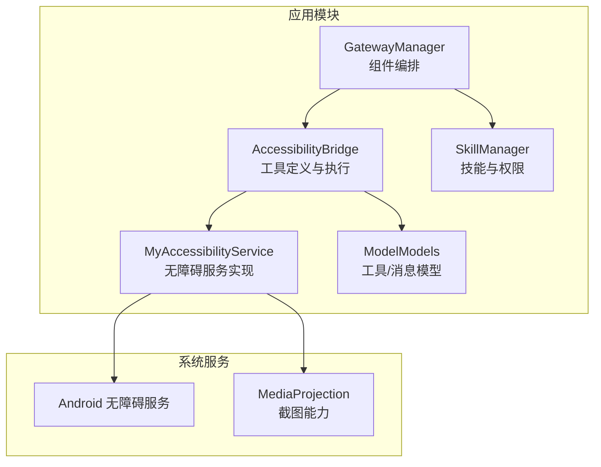
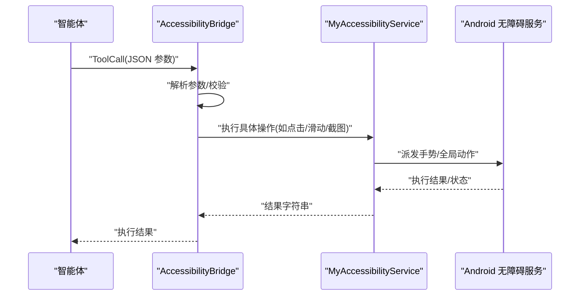
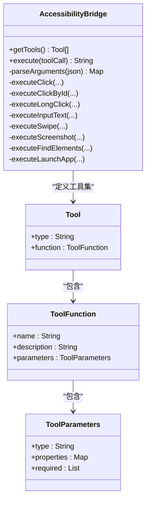
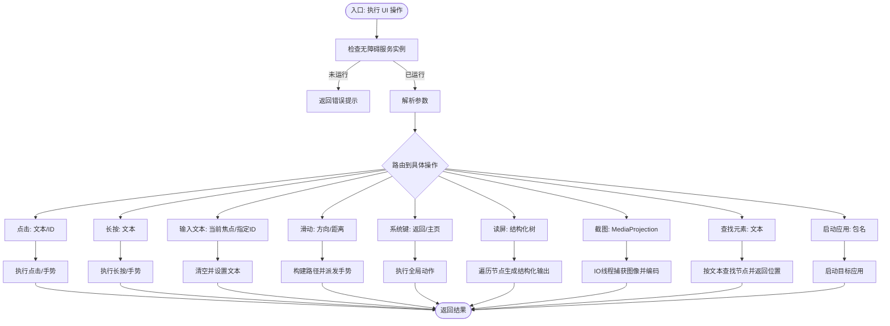
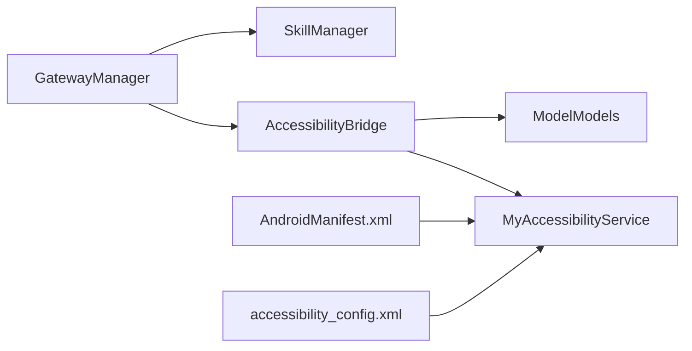

# 无障碍桥接实现

<cite>
**本文引用的文件**
- [AccessibilityBridge.kt](file://app/src/main/java/ai/openclaw/android/accessibility/AccessibilityBridge.kt)
- [MyAccessibilityService.kt](file://app/src/main/java/ai/openclaw/android/MyAccessibilityService.kt)
- [ModelModels.kt](file://app/src/main/java/ai/openclaw/android/model/ModelModels.kt)
- [GatewayManager.kt](file://app/src/main/java/ai/openclaw/android/GatewayManager.kt)
- [AndroidManifest.xml](file://app/src/main/AndroidManifest.xml)
- [accessibility_config.xml](file://app/src/main/res/xml/accessibility_config.xml)
- [SkillManager.kt](file://app/src/main/java/ai/openclaw/android/skill/SkillManager.kt)
</cite>

## 目录
1. [简介](#简介)
2. [项目结构](#项目结构)
3. [核心组件](#核心组件)
4. [架构总览](#架构总览)
5. [详细组件分析](#详细组件分析)
6. [依赖关系分析](#依赖关系分析)
7. [性能考量](#性能考量)
8. [故障排查指南](#故障排查指南)
9. [结论](#结论)
10. [附录：使用示例与最佳实践](#附录使用示例与最佳实践)

## 简介
本文件系统性阐述无障碍桥接实现，围绕 AccessibilityBridge 接口的设计原理与实现机制展开，重点说明桥接层如何在“智能体工具调用”与“Android 无障碍服务”之间建立稳定连接；解释职责分离与解耦设计；梳理 UI 元素查找、操作与状态监控流程；给出错误处理与异常恢复策略；并提供可复用的使用示例与最佳实践，以及性能与内存管理建议。

## 项目结构
无障碍桥接相关的核心代码位于 app 模块中，关键文件包括：
- 无障碍桥接实现：app/src/main/java/ai/openclaw/android/accessibility/AccessibilityBridge.kt
- 无障碍服务实现：app/src/main/java/ai/openclaw/android/MyAccessibilityService.kt
- 工具与消息模型：app/src/main/java/ai/openclaw/android/model/ModelModels.kt
- 网关与生命周期管理：app/src/main/java/ai/openclaw/android/GatewayManager.kt
- 清单与无障碍配置：app/src/main/AndroidManifest.xml、app/src/main/res/xml/accessibility_config.xml
- 技能与权限管理：app/src/main/java/ai/openclaw/android/skill/SkillManager.kt

**图表来源**
- [GatewayManager.kt:64-200](file://app/src/main/java/ai/openclaw/android/GatewayManager.kt#L64-L200)
- [AccessibilityBridge.kt:19-254](file://app/src/main/java/ai/openclaw/android/accessibility/AccessibilityBridge.kt#L19-L254)
- [MyAccessibilityService.kt:38-108](file://app/src/main/java/ai/openclaw/android/MyAccessibilityService.kt#L38-L108)
- [ModelModels.kt:33-73](file://app/src/main/java/ai/openclaw/android/model/ModelModels.kt#L33-L73)
- [SkillManager.kt:8-83](file://app/src/main/java/ai/openclaw/android/skill/SkillManager.kt#L8-L83)

**章节来源**
- [AndroidManifest.xml:78-90](file://app/src/main/AndroidManifest.xml#L78-L90)
- [accessibility_config.xml:1-10](file://app/src/main/res/xml/accessibility_config.xml#L1-L10)

## 核心组件
- AccessibilityBridge：面向智能体的工具集合与执行器，负责将 ToolCall 转换为无障碍命令，并通过 MyAccessibilityService 执行。
- MyAccessibilityService：Android 原生无障碍服务的具体实现，提供节点查找、点击、长按、输入文本、滑动、截图、读屏等能力。
- ModelModels：定义工具与工具调用的数据结构，支撑工具签名、参数与流式增量参数。
- GatewayManager：网关组件编排者，负责初始化无障碍桥接、技能管理器等子系统。
- SkillManager：技能注册与权限检查，确保工具执行前具备必要权限。
- 清单与配置：声明无障碍服务与权限，配置无障碍服务元数据。

**章节来源**
- [AccessibilityBridge.kt:19-254](file://app/src/main/java/ai/openclaw/android/accessibility/AccessibilityBridge.kt#L19-L254)
- [MyAccessibilityService.kt:38-108](file://app/src/main/java/ai/openclaw/android/MyAccessibilityService.kt#L38-L108)
- [ModelModels.kt:33-73](file://app/src/main/java/ai/openclaw/android/model/ModelModels.kt#L33-L73)
- [GatewayManager.kt:64-200](file://app/src/main/java/ai/openclaw/android/GatewayManager.kt#L64-L200)
- [SkillManager.kt:8-83](file://app/src/main/java/ai/openclaw/android/skill/SkillManager.kt#L8-L83)

## 架构总览
无障碍桥接采用“工具定义—工具执行—无障碍服务”的分层设计：
- 上层：智能体生成 ToolCall，携带函数名与 JSON 参数字符串。
- 中层：AccessibilityBridge 解析参数、路由到具体操作，并在主线程调度执行。
- 下层：MyAccessibilityService 提供底层 UI 操作与系统交互能力，必要时使用 MediaProjection 进行屏幕捕获。

**图表来源**
- [AccessibilityBridge.kt:225-254](file://app/src/main/java/ai/openclaw/android/accessibility/AccessibilityBridge.kt#L225-L254)
- [MyAccessibilityService.kt:146-417](file://app/src/main/java/ai/openclaw/android/MyAccessibilityService.kt#L146-L417)

## 详细组件分析

### 组件一：AccessibilityBridge（工具定义与执行）
- 职责分离
  - 工具定义：集中声明一组 UI 操作工具（点击、按住、输入文本、滑动、返回/主页、读屏、截图、元素查找、当前应用、启动应用等），统一参数规范与必填项。
  - 执行路由：根据工具名分发到对应方法，统一参数解析与错误返回。
- 参数解析与健壮性
  - 使用 JSON 解析参数字符串，未知字段被忽略，异常时返回空映射并记录日志。
- 平台版本适配
  - 针对截图与滑动手势设置最低 API 版本限制，避免在低版本设备上崩溃。
- 结果格式
  - 统一返回字符串结果，便于上层直接消费或回传给智能体。

**图表来源**
- [AccessibilityBridge.kt:19-254](file://app/src/main/java/ai/openclaw/android/accessibility/AccessibilityBridge.kt#L19-L254)
- [ModelModels.kt:33-57](file://app/src/main/java/ai/openclaw/android/model/ModelModels.kt#L33-L57)

**章节来源**
- [AccessibilityBridge.kt:29-220](file://app/src/main/java/ai/openclaw/android/accessibility/AccessibilityBridge.kt#L29-L220)
- [AccessibilityBridge.kt:225-328](file://app/src/main/java/ai/openclaw/android/accessibility/AccessibilityBridge.kt#L225-L328)

### 组件二：MyAccessibilityService（无障碍服务实现）
- 节点查找
  - 支持按文本与资源 ID 查找节点，递归定位可编辑且聚焦的输入框。
- 点击与长按
  - 优先使用节点 ACTION_CLICK/ACTION_LONG_CLICK；失败则回退到手势坐标点击/长按。
- 文本输入
  - 清空后设置文本，支持按 ID 定位输入框。
- 滑动与系统键
  - 支持上下左右滑动与返回/主页等全局动作。
- 屏幕读取与截图
  - 结构化读屏输出 UI 树；截图需 MediaProjection 初始化，异步 IO 执行。
- 生命周期与资源释放
  - onServiceConnected 记录屏幕尺寸；onDestroy 释放 MediaProjection 与 ImageReader。

**图表来源**
- [MyAccessibilityService.kt:106-417](file://app/src/main/java/ai/openclaw/android/MyAccessibilityService.kt#L106-L417)
- [MyAccessibilityService.kt:489-546](file://app/src/main/java/ai/openclaw/android/MyAccessibilityService.kt#L489-L546)

**章节来源**
- [MyAccessibilityService.kt:106-181](file://app/src/main/java/ai/openclaw/android/MyAccessibilityService.kt#L106-L181)
- [MyAccessibilityService.kt:186-417](file://app/src/main/java/ai/openclaw/android/MyAccessibilityService.kt#L186-L417)
- [MyAccessibilityService.kt:489-546](file://app/src/main/java/ai/openclaw/android/MyAccessibilityService.kt#L489-L546)

### 组件三：GatewayManager（组件编排与生命周期）
- 初始化顺序
  - 在首次需要时创建 AccessibilityBridge 与 SkillManager，注册内置技能。
  - 初始化屏幕捕获（MediaProjection）时通过 MyAccessibilityService 实例完成。
- 状态管理
  - 使用 ConnectionState 流管理连接状态，异常时返回错误信息。

**章节来源**
- [GatewayManager.kt:174-193](file://app/src/main/java/ai/openclaw/android/GatewayManager.kt#L174-L193)
- [GatewayManager.kt:307-321](file://app/src/main/java/ai/openclaw/android/GatewayManager.kt#L307-L321)

### 组件四：SkillManager（权限与工具聚合）
- 工具聚合
  - 将各技能的工具统一命名并暴露给上层，命名规则为 skillId_toolName。
- 权限检查
  - 对需要系统权限的技能进行权限校验，缺失时返回权限需求信息，便于前端引导授权。

**章节来源**
- [SkillManager.kt:40-83](file://app/src/main/java/ai/openclaw/android/skill/SkillManager.kt#L40-L83)
- [SkillManager.kt:89-138](file://app/src/main/java/ai/openclaw/android/skill/SkillManager.kt#L89-L138)

## 依赖关系分析
- AccessibilityBridge 依赖 MyAccessibilityService 的实例与能力，通过单例访问；同时依赖 ModelModels 的工具/参数模型。
- GatewayManager 负责创建与注入 AccessibilityBridge 与 SkillManager，协调组件生命周期。
- 清单与配置文件声明无障碍服务与权限，确保系统侧正确绑定与启用。

**图表来源**
- [AccessibilityBridge.kt:225-254](file://app/src/main/java/ai/openclaw/android/accessibility/AccessibilityBridge.kt#L225-L254)
- [MyAccessibilityService.kt:38-108](file://app/src/main/java/ai/openclaw/android/MyAccessibilityService.kt#L38-L108)
- [GatewayManager.kt:64-200](file://app/src/main/java/ai/openclaw/android/GatewayManager.kt#L64-L200)
- [AndroidManifest.xml:78-90](file://app/src/main/AndroidManifest.xml#L78-L90)
- [accessibility_config.xml:1-10](file://app/src/main/res/xml/accessibility_config.xml#L1-L10)

**章节来源**
- [AndroidManifest.xml:78-90](file://app/src/main/AndroidManifest.xml#L78-L90)
- [accessibility_config.xml:1-10](file://app/src/main/res/xml/accessibility_config.xml#L1-L10)

## 性能考量
- 主线程调度与协程切换
  - AccessibilityBridge 在主线程执行工具调用，避免跨线程 UI 操作风险；截图等耗时操作在 IO 线程执行，减少阻塞。
- 截图与虚拟显示
  - 截图依赖 MediaProjection 与 ImageReader，注意在销毁时释放资源，避免内存泄漏。
- UI 遍历与输出截断
  - 结构化读屏输出长度超过阈值时进行截断，避免超长文本影响通信效率。
- 滑动手势与坐标计算
  - 滑动距离按屏幕高度比例计算，保证不同分辨率设备的一致体验。

**章节来源**
- [AccessibilityBridge.kt:237-254](file://app/src/main/java/ai/openclaw/android/accessibility/AccessibilityBridge.kt#L237-L254)
- [MyAccessibilityService.kt:518-546](file://app/src/main/java/ai/openclaw/android/MyAccessibilityService.kt#L518-L546)
- [MyAccessibilityService.kt:609-627](file://app/src/main/java/ai/openclaw/android/MyAccessibilityService.kt#L609-L627)
- [MyAccessibilityService.kt:368-417](file://app/src/main/java/ai/openclaw/android/MyAccessibilityService.kt#L368-L417)

## 故障排查指南
- 无障碍服务未运行
  - 现象：执行工具返回“无障碍服务未运行，请在设置中启用”。
  - 处理：确认系统无障碍服务已开启，且应用已授予相应权限。
- 参数解析失败
  - 现象：工具执行返回“参数解析失败”。
  - 处理：检查工具调用的 JSON 字符串格式，确保必填字段齐全。
- 元素未找到或索引越界
  - 现象：点击/长按/输入失败，返回“未找到元素”或“索引越界”。
  - 处理：先使用“查找元素”工具确认可见文本/ID，再进行操作；合理设置 index。
- 设备版本不满足
  - 现象：滑动/截图返回“需要更高 Android 版本”。
  - 处理：升级系统版本至要求的 API 等级。
- 截图未初始化
  - 现象：截图返回“MediaProjection 未初始化，请先初始化”。
  - 处理：在合适的时机调用初始化方法，确保用户授权与回调已处理。
- 权限不足
  - 现象：某些技能工具执行返回“需要权限”。
  - 处理：根据提示申请相应系统权限，如日历、联系人、短信、定位等。

**章节来源**
- [AccessibilityBridge.kt:228-230](file://app/src/main/java/ai/openclaw/android/accessibility/AccessibilityBridge.kt#L228-L230)
- [AccessibilityBridge.kt:257-262](file://app/src/main/java/ai/openclaw/android/accessibility/AccessibilityBridge.kt#L257-L262)
- [MyAccessibilityService.kt:153-159](file://app/src/main/java/ai/openclaw/android/MyAccessibilityService.kt#L153-L159)
- [MyAccessibilityService.kt:288-290](file://app/src/main/java/ai/openclaw/android/MyAccessibilityService.kt#L288-L290)
- [MyAccessibilityService.kt:519-523](file://app/src/main/java/ai/openclaw/android/MyAccessibilityService.kt#L519-L523)
- [SkillManager.kt:89-107](file://app/src/main/java/ai/openclaw/android/skill/SkillManager.kt#L89-L107)

## 结论
无障碍桥接通过清晰的职责划分与稳健的错误处理，实现了从智能体工具调用到 Android 无障碍服务的可靠映射。其设计兼顾易用性与健壮性：工具定义标准化、参数解析容错、平台版本适配、权限前置检查、资源及时释放。配合 GatewayManager 的生命周期管理与 SkillManager 的权限体系，整体方案具备良好的扩展性与可维护性。

## 附录：使用示例与最佳实践
- 使用步骤
  - 启用无障碍服务并授予权限。
  - 通过 GatewayManager 初始化无障碍桥接与技能管理器。
  - 发送工具调用（ToolCall），由 AccessibilityBridge 路由到 MyAccessibilityService 执行。
  - 如需截图，先初始化 MediaProjection 再执行截图工具。
- 最佳实践
  - 先“查找元素”，再“点击/长按/输入”，提高成功率。
  - 对于多实例元素，使用 index 精确定位。
  - 截图与滑动等高开销操作应谨慎使用，避免频繁触发。
  - 对需要系统权限的技能，提前检查并引导用户授权。
  - 注意释放 MediaProjection 与 ImageReader，防止内存泄漏。

**章节来源**
- [GatewayManager.kt:174-193](file://app/src/main/java/ai/openclaw/android/GatewayManager.kt#L174-L193)
- [MyAccessibilityService.kt:489-513](file://app/src/main/java/ai/openclaw/android/MyAccessibilityService.kt#L489-L513)
- [AndroidManifest.xml:78-90](file://app/src/main/AndroidManifest.xml#L78-L90)
- [accessibility_config.xml:1-10](file://app/src/main/res/xml/accessibility_config.xml#L1-L10)