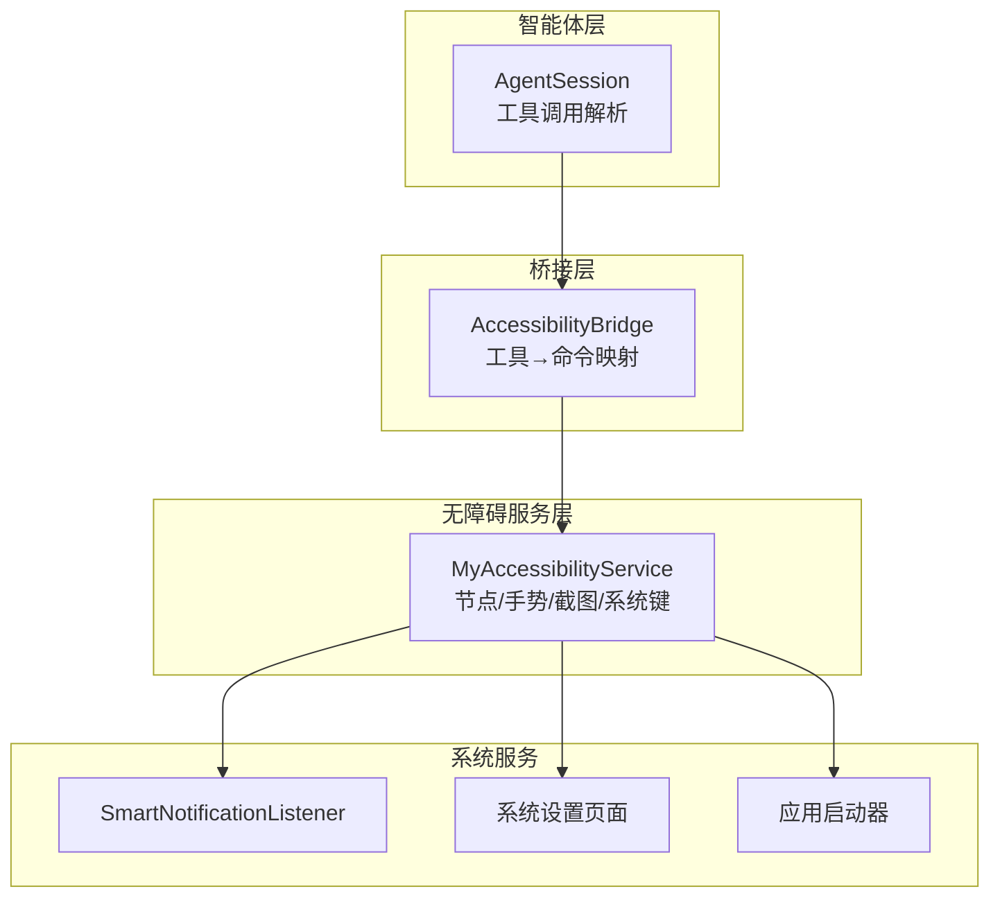
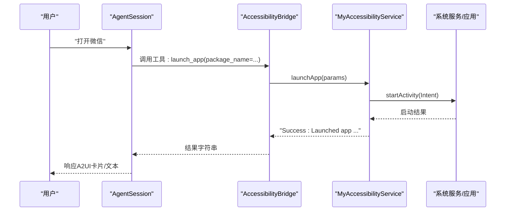
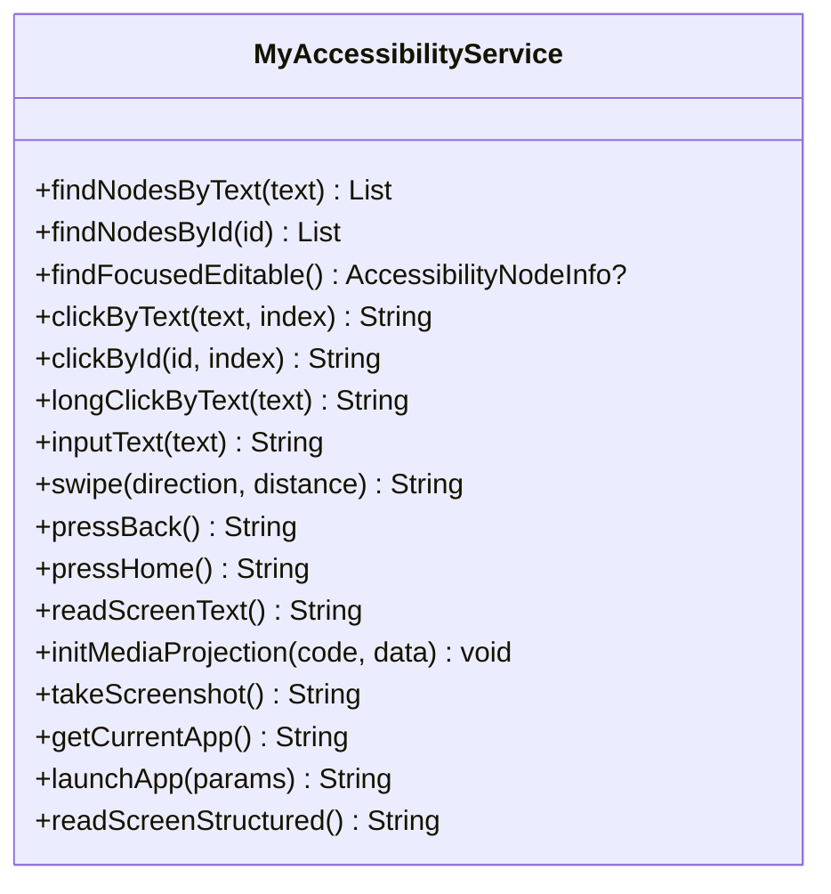
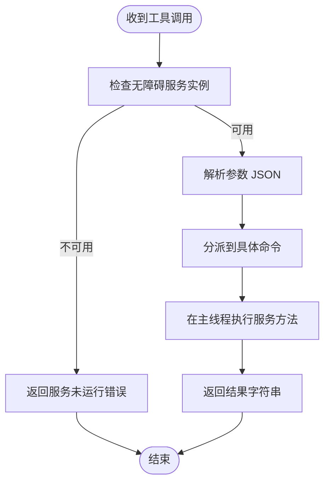
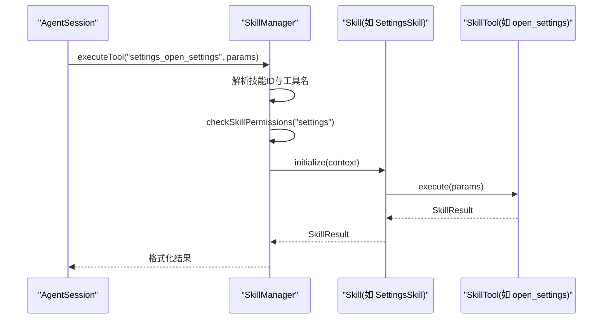
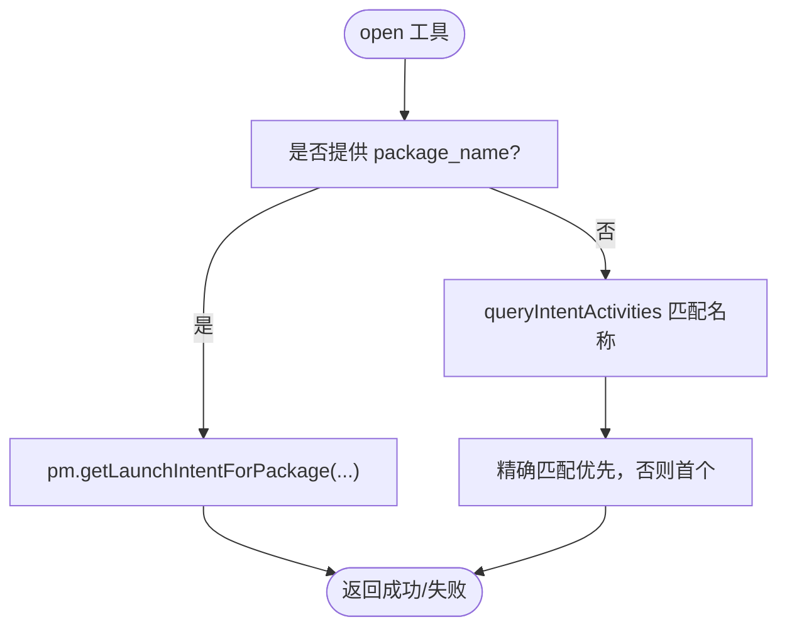
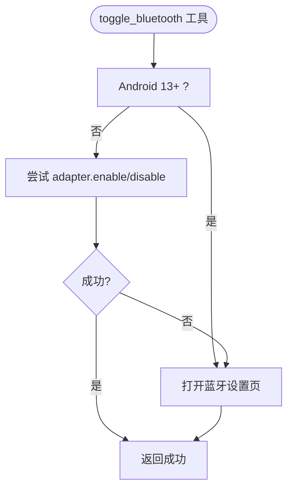
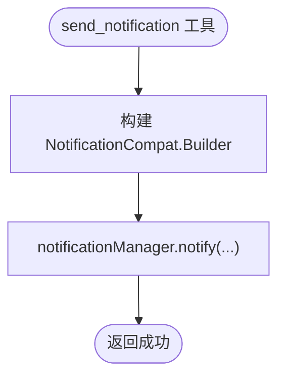
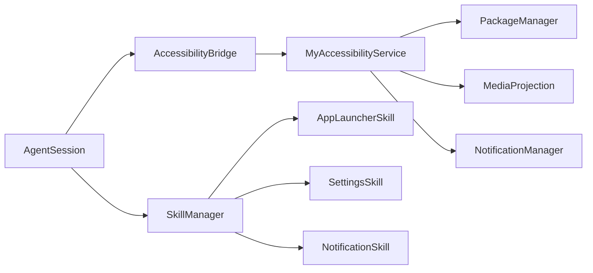

# 设备控制功能

<cite>
**本文档引用的文件**
- [MyAccessibilityService.kt](file://app/src/main/java/ai/openclaw/android/MyAccessibilityService.kt)
- [AccessibilityBridge.kt](file://app/src/main/java/ai/openclaw/android/accessibility/AccessibilityBridge.kt)
- [AppLauncherSkill.kt](file://app/src/main/java/ai/openclaw/android/skill/builtin/AppLauncherSkill.kt)
- [SettingsSkill.kt](file://app/src/main/java/ai/openclaw/android/skill/builtin/SettingsSkill.kt)
- [NotificationSkill.kt](file://app/src/main/java/ai/openclaw/android/skill/builtin/NotificationSkill.kt)
- [SkillManager.kt](file://app/src/main/java/ai/openclaw/android/skill/SkillManager.kt)
- [accessibility_config.xml](file://app/src/main/res/xml/accessibility_config.xml)
- [AndroidManifest.xml](file://app/src/main/AndroidManifest.xml)
- [project-analysis.md](file://docs/project-analysis.md)
- [AuditLogger.kt](file://app/src/main/java/ai/openclaw/android/security/AuditLogger.kt)
- [SecurityKeyManager.kt](file://app/src/main/java/ai/openclaw/android/security/SecurityKeyManager.kt)
</cite>

## 目录
1. [简介](#简介)
2. [项目结构](#项目结构)
3. [核心组件](#核心组件)
4. [架构总览](#架构总览)
5. [详细组件分析](#详细组件分析)
6. [依赖关系分析](#依赖关系分析)
7. [性能考量](#性能考量)
8. [故障排查指南](#故障排查指南)
9. [结论](#结论)
10. [附录](#附录)

## 简介
本文件聚焦于设备控制功能，系统性阐述无障碍服务如何实现设备自动化控制，覆盖应用启动、通知管理、系统设置等控制操作的实现方式与边界；解释控制命令的队列管理与执行顺序；说明安全边界与权限限制；提供使用示例与配置方法；评估性能影响与资源消耗；并给出不同厂商设备的兼容性处理建议。

## 项目结构
设备控制能力由“无障碍服务 + 桥接层 + 技能系统”三层构成：
- 无障碍服务：负责屏幕交互、节点查找、手势、截图、系统键等底层控制
- 桥接层：将智能体工具调用映射到无障碍服务的具体动作
- 技能系统：封装常用控制场景（如应用启动、系统设置、通知管理），统一权限检查与执行

图表来源
- [project-analysis.md:83-91](file://docs/project-analysis.md#L83-L91)
- [AndroidManifest.xml:82-108](file://app/src/main/AndroidManifest.xml#L82-L108)

章节来源
- [project-analysis.md:11-21](file://docs/project-analysis.md#L11-L21)
- [AndroidManifest.xml:82-108](file://app/src/main/AndroidManifest.xml#L82-L108)

## 核心组件
- MyAccessibilityService：提供节点查找、点击、长按、输入文本、滑动、系统键、读屏、截图、应用信息与启动等能力
- AccessibilityBridge：将工具调用（如 click、swipe、screenshot、launch_app 等）转换为无障碍服务命令
- SkillManager：注册内置技能（应用启动、系统设置、通知管理），统一权限校验与执行
- 具体技能：
  - AppLauncherSkill：按名称或包名启动应用，列出已安装应用
  - SettingsSkill：打开系统设置页面，蓝牙开关（Android 13+ 特殊处理），音量控制
  - NotificationSkill：获取通知、发送本地通知、删除/清空通知、标记已读

章节来源
- [MyAccessibilityService.kt:38-676](file://app/src/main/java/ai/openclaw/android/MyAccessibilityService.kt#L38-L676)
- [AccessibilityBridge.kt:19-328](file://app/src/main/java/ai/openclaw/android/accessibility/AccessibilityBridge.kt#L19-L328)
- [SkillManager.kt:8-193](file://app/src/main/java/ai/openclaw/android/skill/SkillManager.kt#L8-L193)
- [AppLauncherSkill.kt:8-193](file://app/src/main/java/ai/openclaw/android/skill/builtin/AppLauncherSkill.kt#L8-L193)
- [SettingsSkill.kt:14-234](file://app/src/main/java/ai/openclaw/android/skill/builtin/SettingsSkill.kt#L14-L234)
- [NotificationSkill.kt:14-216](file://app/src/main/java/ai/openclaw/android/skill/builtin/NotificationSkill.kt#L14-L216)

## 架构总览
设备控制的端到端流程如下：

图表来源
- [AccessibilityBridge.kt:225-254](file://app/src/main/java/ai/openclaw/android/accessibility/AccessibilityBridge.kt#L225-L254)
- [MyAccessibilityService.kt:592-605](file://app/src/main/java/ai/openclaw/android/MyAccessibilityService.kt#L592-L605)

章节来源
- [project-analysis.md:108-125](file://docs/project-analysis.md#L108-L125)
- [AndroidManifest.xml:82-94](file://app/src/main/AndroidManifest.xml#L82-L94)

## 详细组件分析

### 无障碍服务（MyAccessibilityService）
- 节点查找：按文本、按资源 ID 查找，递归定位焦点可编辑节点
- 点击与长按：优先使用节点 ACTION_CLICK，失败回退到坐标手势；长按同理
- 文本输入：定位焦点可编辑节点后，先清空再输入
- 手势滑动：基于屏幕中心与距离比例生成路径，统一时长
- 系统键：back/home/recents 全局动作
- 屏幕读取：遍历可见节点，提取文本与内容描述
- 截图：MediaProjection 初始化虚拟显示，ImageReader 采集图像，转码为 base64
- 应用信息与启动：获取当前应用包名/类名；按包名启动应用
- 结构化读屏：输出树形 UI 描述，含类型、标签、交互属性、位置

图表来源
- [MyAccessibilityService.kt:106-627](file://app/src/main/java/ai/openclaw/android/MyAccessibilityService.kt#L106-L627)

章节来源
- [MyAccessibilityService.kt:106-627](file://app/src/main/java/ai/openclaw/android/MyAccessibilityService.kt#L106-L627)

### 桥接层（AccessibilityBridge）
- 工具清单：click/click_by_id/long_click/input_text/swipe/press_back/press_home/read_screen/screenshot/find_elements/get_current_app/launch_app
- 执行流程：校验无障碍服务实例存在，解析参数，切换主线程执行，分发到具体服务方法
- 版本兼容：对 swipe/screenshot 的 API 级别进行前置校验

图表来源
- [AccessibilityBridge.kt:225-254](file://app/src/main/java/ai/openclaw/android/accessibility/AccessibilityBridge.kt#L225-L254)

章节来源
- [AccessibilityBridge.kt:30-220](file://app/src/main/java/ai/openclaw/android/accessibility/AccessibilityBridge.kt#L30-L220)
- [AccessibilityBridge.kt:225-328](file://app/src/main/java/ai/openclaw/android/accessibility/AccessibilityBridge.kt#L225-L328)

### 技能系统（SkillManager 与内置技能）
- 注册内置技能：天气、多搜索、翻译、日历、位置、联系人、短信、提醒、通知、应用启动、系统设置、文件、脚本等
- 权限检查：针对特定技能（日历、位置、联系人、短信）进行运行时权限校验
- 工具执行：按“技能ID_工具名”格式解析，校验权限后执行

图表来源
- [SkillManager.kt:62-83](file://app/src/main/java/ai/openclaw/android/skill/SkillManager.kt#L62-L83)
- [SettingsSkill.kt:43-86](file://app/src/main/java/ai/openclaw/android/skill/builtin/SettingsSkill.kt#L43-L86)

章节来源
- [SkillManager.kt:13-33](file://app/src/main/java/ai/openclaw/android/skill/SkillManager.kt#L13-L33)
- [SkillManager.kt:89-138](file://app/src/main/java/ai/openclaw/android/skill/SkillManager.kt#L89-L138)

### 应用启动（AppLauncherSkill）
- 功能：按应用名称或包名启动应用；列出已安装应用（支持过滤）
- 实现要点：PackageManager 查询、Intent 启动、兼容不同 SDK 的查询接口

图表来源
- [AppLauncherSkill.kt:45-125](file://app/src/main/java/ai/openclaw/android/skill/builtin/AppLauncherSkill.kt#L45-L125)

章节来源
- [AppLauncherSkill.kt:29-125](file://app/src/main/java/ai/openclaw/android/skill/builtin/AppLauncherSkill.kt#L29-L125)

### 系统设置（SettingsSkill）
- 功能：打开系统设置页面（WiFi/蓝牙/声音/显示/关于/位置/存储/电池/应用/辅助功能/安全/日期/语言/开发者选项等）；蓝牙开关（Android 13+ 特殊处理）；音量控制
- 实现要点：Intent 跳转对应设置页面；蓝牙开关在高版本回退到设置页；音量控制按流类型调整

图表来源
- [SettingsSkill.kt:99-147](file://app/src/main/java/ai/openclaw/android/skill/builtin/SettingsSkill.kt#L99-L147)

章节来源
- [SettingsSkill.kt:43-234](file://app/src/main/java/ai/openclaw/android/skill/builtin/SettingsSkill.kt#L43-L234)

### 通知管理（NotificationSkill）
- 功能：获取通知列表、发送本地通知、删除指定通知、清空通知、标记已读
- 实现要点：通过 NotificationManager 发送本地通知；SmartNotificationListener 协助存储与状态管理

图表来源
- [NotificationSkill.kt:106-140](file://app/src/main/java/ai/openclaw/android/skill/builtin/NotificationSkill.kt#L106-L140)

章节来源
- [NotificationSkill.kt:40-216](file://app/src/main/java/ai/openclaw/android/skill/builtin/NotificationSkill.kt#L40-L216)

## 依赖关系分析
- 组件耦合
  - AccessibilityBridge 依赖 MyAccessibilityService 单例
  - SkillManager 统一注册与执行内置技能，并进行权限校验
  - MyAccessibilityService 依赖系统服务（PackageManager、MediaProjection、NotificationManager 等）
- 外部依赖
  - Android AccessibilityService、NotificationListenerService、前台服务
  - Manifest 声明与权限声明

图表来源
- [AndroidManifest.xml:82-108](file://app/src/main/AndroidManifest.xml#L82-L108)
- [SkillManager.kt:13-33](file://app/src/main/java/ai/openclaw/android/skill/SkillManager.kt#L13-L33)

章节来源
- [AndroidManifest.xml:51-121](file://app/src/main/AndroidManifest.xml#L51-L121)
- [accessibility_config.xml:1-10](file://app/src/main/res/xml/accessibility_config.xml#L1-L10)

## 性能考量
- 截图成本
  - MediaProjection 创建虚拟显示与 ImageReader 采集，CPU/GPU 参与度较高，建议按需触发并及时释放
- 节点遍历
  - 结构化读屏与文本读取采用递归遍历，深度与子节点数量受控（最大深度与每层最多子节点），避免过深 UI 树导致卡顿
- 手势与点击
  - 点击优先使用节点 ACTION_CLICK，失败回退到手势，建议优先使用更稳定的节点定位
- 网络与 I/O
  - 通知发送为本地操作，无网络开销；应用启动与系统设置为系统级调用，主要影响系统响应时间
- 建议
  - 对高频操作（如滑动、截图）增加节流与缓存策略
  - 在后台任务中谨慎使用阻塞 I/O，尽量异步执行

[本节为通用性能讨论，无需特定文件引用]

## 故障排查指南
- 无障碍服务未运行
  - 现象：工具调用返回“无障碍服务未运行”
  - 排查：确认系统设置中已启用无障碍服务，查看服务连接日志
- 权限不足
  - 现象：某些技能执行失败并提示需要权限
  - 排查：检查 Manifest 权限声明与运行时权限授予情况
- API 级别限制
  - 现象：swipe/screenshot 返回“需要更高 API 级别”
  - 排查：确认设备系统版本满足要求
- 蓝牙开关失败（Android 13+）
  - 现象：无法直接开关蓝牙，自动跳转设置页
  - 排查：这是系统限制，需引导用户手动操作
- 截图失败
  - 现象：返回“MediaProjection 未初始化”或“无法捕获图像”
  - 排查：确保已正确初始化 MediaProjection 并在前台服务中执行

章节来源
- [AccessibilityBridge.kt:228-230](file://app/src/main/java/ai/openclaw/android/accessibility/AccessibilityBridge.kt#L228-L230)
- [AccessibilityBridge.kt:288-301](file://app/src/main/java/ai/openclaw/android/accessibility/AccessibilityBridge.kt#L288-L301)
- [SettingsSkill.kt:111-122](file://app/src/main/java/ai/openclaw/android/skill/builtin/SettingsSkill.kt#L111-L122)
- [MyAccessibilityService.kt:489-513](file://app/src/main/java/ai/openclaw/android/MyAccessibilityService.kt#L489-L513)

## 结论
设备控制功能以无障碍服务为核心，结合桥接层与技能系统，实现了从“意图识别到设备执行”的完整链路。通过严格的权限校验、版本兼容与错误处理，系统在保证安全性的同时提供了丰富的控制能力。建议在实际部署中关注性能与资源消耗，合理设计控制频率与并发策略，并针对不同厂商设备进行兼容性验证与适配。

[本节为总结性内容，无需特定文件引用]

## 附录

### 使用示例与配置方法
- 启用无障碍服务
  - 在系统设置中启用无障碍服务，确保具备“允许触摸探索”“检索窗口内容”“执行手势”等权限
  - 配置文件参考：[accessibility_config.xml:1-10](file://app/src/main/res/xml/accessibility_config.xml#L1-L10)
- 在应用中注册与使用
  - 无障碍服务与通知监听服务已在 Manifest 中声明：[AndroidManifest.xml:82-108](file://app/src/main/AndroidManifest.xml#L82-L108)
- 常见工具调用
  - 应用启动：launch_app(package_name=...)
  - 系统设置：settings_open_settings(type=...)
  - 通知管理：notification_list_notifications / send_notification / delete_notification / clear_notifications / mark_notification_read
  - 无障碍控制：click/click_by_id/long_click/input_text/swipe/press_back/press_home/read_screen/screenshot/find_elements/get_current_app

章节来源
- [accessibility_config.xml:1-10](file://app/src/main/res/xml/accessibility_config.xml#L1-L10)
- [AndroidManifest.xml:82-108](file://app/src/main/AndroidManifest.xml#L82-L108)
- [AccessibilityBridge.kt:30-220](file://app/src/main/java/ai/openclaw/android/accessibility/AccessibilityBridge.kt#L30-L220)
- [SettingsSkill.kt:43-86](file://app/src/main/java/ai/openclaw/android/skill/builtin/SettingsSkill.kt#L43-L86)
- [NotificationSkill.kt:40-104](file://app/src/main/java/ai/openclaw/android/skill/builtin/NotificationSkill.kt#L40-L104)

### 安全边界与权限限制
- 运行时权限
  - 日历、位置、联系人、短信等技能需要相应权限
  - 权限检查与缺失提示由 SkillManager 统一处理
- 数据安全
  - API 密钥与敏感配置使用 EncryptedSharedPreferences 存储
  - 审计日志采用哈希链记录关键操作，防止篡改
- 系统限制
  - Android 13+ 对蓝牙开关进行限制，需跳转设置页
  - 截图与媒体投影需要前台服务与用户授权

章节来源
- [SkillManager.kt:89-138](file://app/src/main/java/ai/openclaw/android/skill/SkillManager.kt#L89-L138)
- [SecurityKeyManager.kt:23-68](file://app/src/main/java/ai/openclaw/android/security/SecurityKeyManager.kt#L23-L68)
- [AuditLogger.kt:16-99](file://app/src/main/java/ai/openclaw/android/security/AuditLogger.kt#L16-L99)
- [SettingsSkill.kt:111-122](file://app/src/main/java/ai/openclaw/android/skill/builtin/SettingsSkill.kt#L111-L122)

### 控制命令的队列管理与执行顺序
- 当前实现
  - 工具执行在主线程同步执行，返回结果后反馈给智能体
  - 无障碍服务内部使用 CountDownLatch 等同步等待手势完成
- 建议
  - 对高频连续操作引入串行队列，避免并发冲突
  - 对耗时操作（截图、滑动）增加超时与重试机制
  - 对复杂流程（如“打开应用→等待界面→点击按钮”）拆分为多个工具调用并串联执行

章节来源
- [AccessibilityBridge.kt:237-253](file://app/src/main/java/ai/openclaw/android/accessibility/AccessibilityBridge.kt#L237-L253)
- [MyAccessibilityService.kt:198-215](file://app/src/main/java/ai/openclaw/android/MyAccessibilityService.kt#L198-L215)

### 错误恢复与异常处理机制
- 无障碍服务
  - 节点不存在、索引越界、手势失败均有明确错误返回
  - 截图失败捕获异常并返回错误信息
- 技能系统
  - 权限不足时返回缺失权限列表，引导用户授予权限
  - 蓝牙开关失败回退到设置页，提示用户手动操作
- 建议
  - 引入重试与降级策略（如点击失败回退长按、或二次查找节点）
  - 记录关键操作审计日志，便于问题追踪

章节来源
- [MyAccessibilityService.kt:153-159](file://app/src/main/java/ai/openclaw/android/MyAccessibilityService.kt#L153-L159)
- [MyAccessibilityService.kt:541-544](file://app/src/main/java/ai/openclaw/android/MyAccessibilityService.kt#L541-L544)
- [SkillManager.kt:75-83](file://app/src/main/java/ai/openclaw/android/skill/SkillManager.kt#L75-L83)
- [SettingsSkill.kt:137-147](file://app/src/main/java/ai/openclaw/android/skill/builtin/SettingsSkill.kt#L137-L147)

### 不同厂商设备的兼容性处理与特殊适配
- 蓝牙开关
  - Android 13+ 回退到设置页，避免直接开关失败
- 截图与媒体投影
  - 需要前台服务与用户授权，确保在前台运行时执行
- 系统设置页面差异
  - 不同厂商定制的设置页面可能不同，建议通过 Intent 打开对应页面而非硬编码路径
- 建议
  - 增加设备能力检测（如 API 级别、系统版本、厂商标识），动态选择最优策略
  - 提供可配置的降级方案与用户提示

章节来源
- [SettingsSkill.kt:111-122](file://app/src/main/java/ai/openclaw/android/skill/builtin/SettingsSkill.kt#L111-L122)
- [AndroidManifest.xml:82-94](file://app/src/main/AndroidManifest.xml#L82-L94)