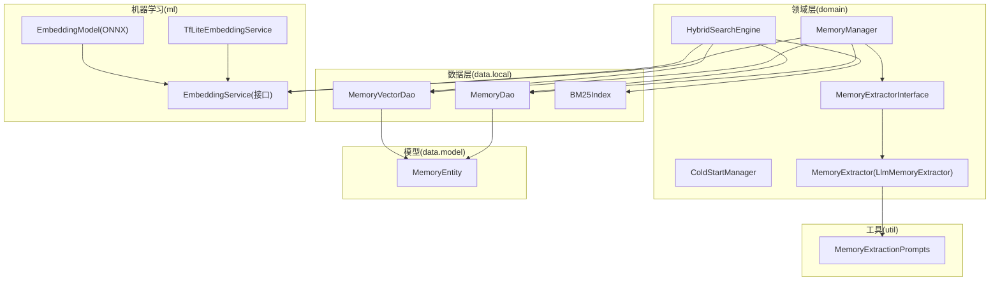
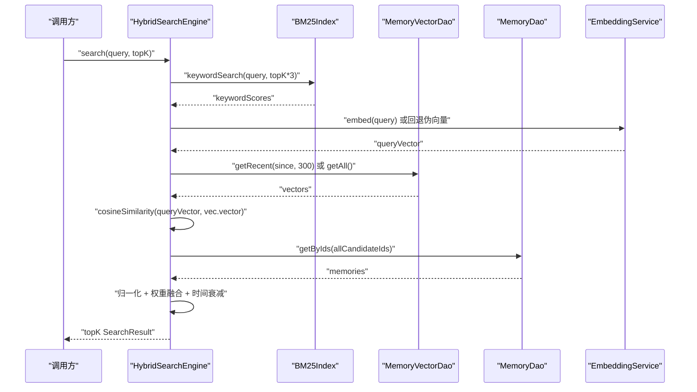
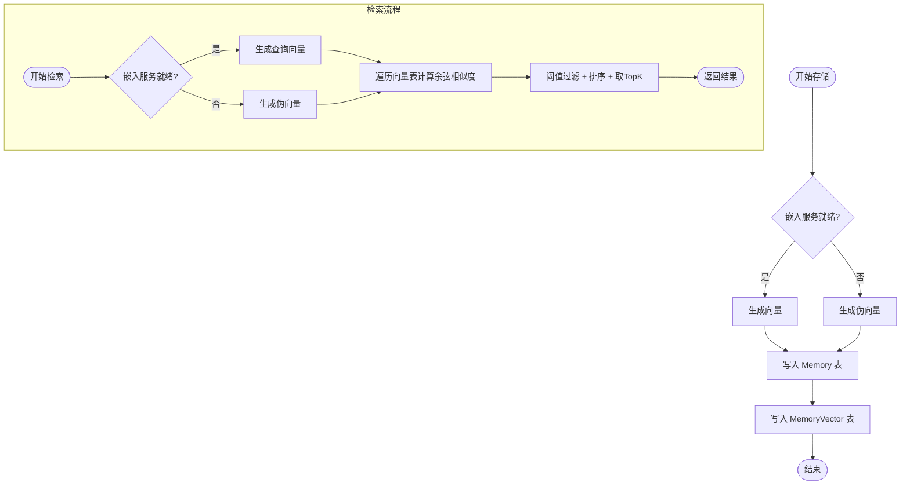
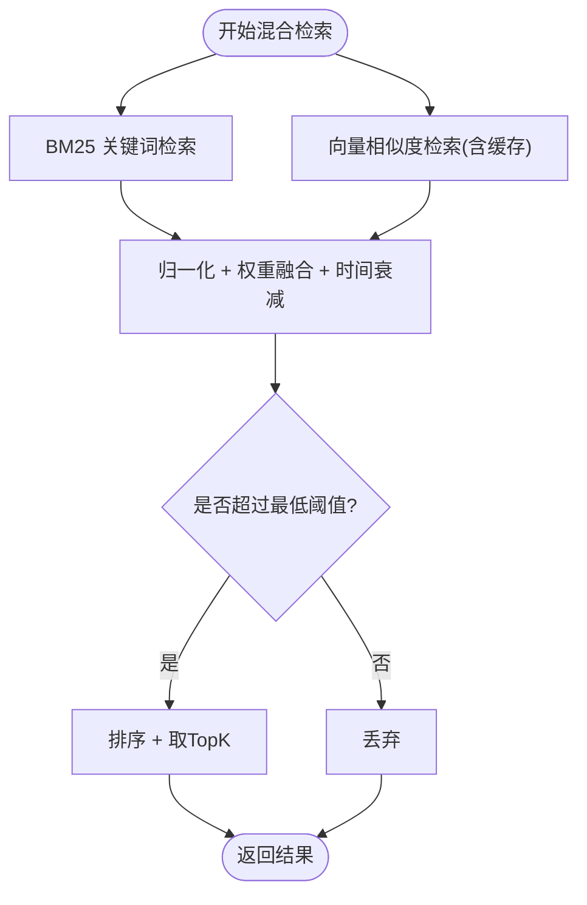
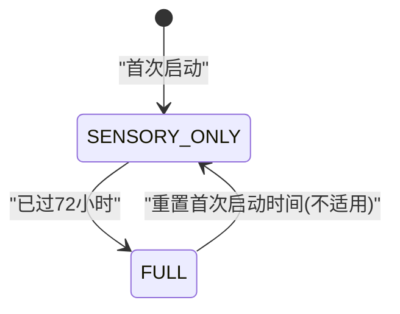
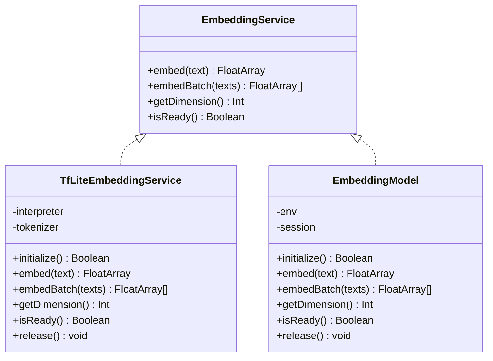
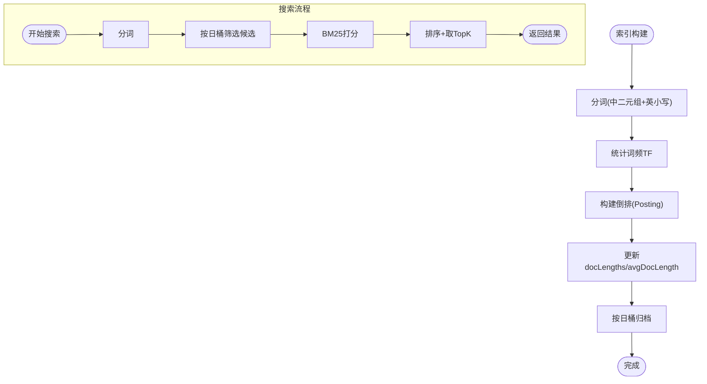
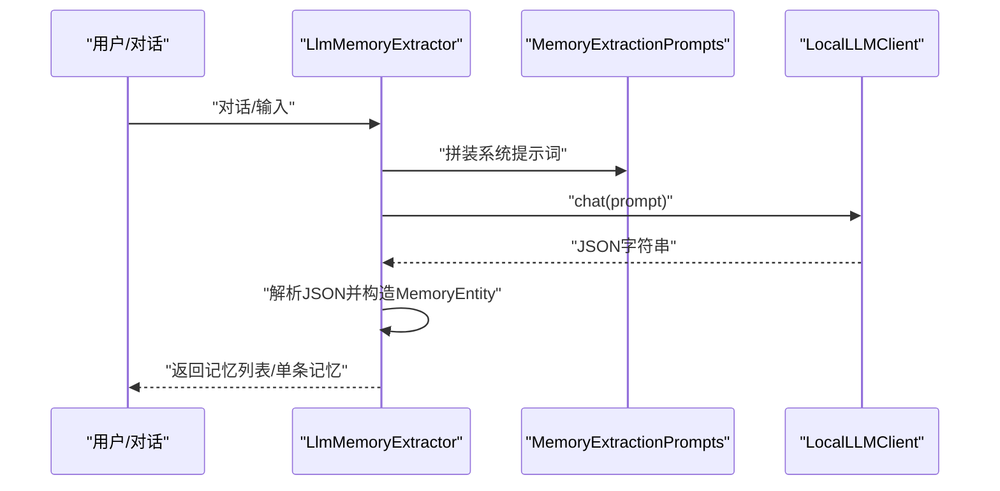
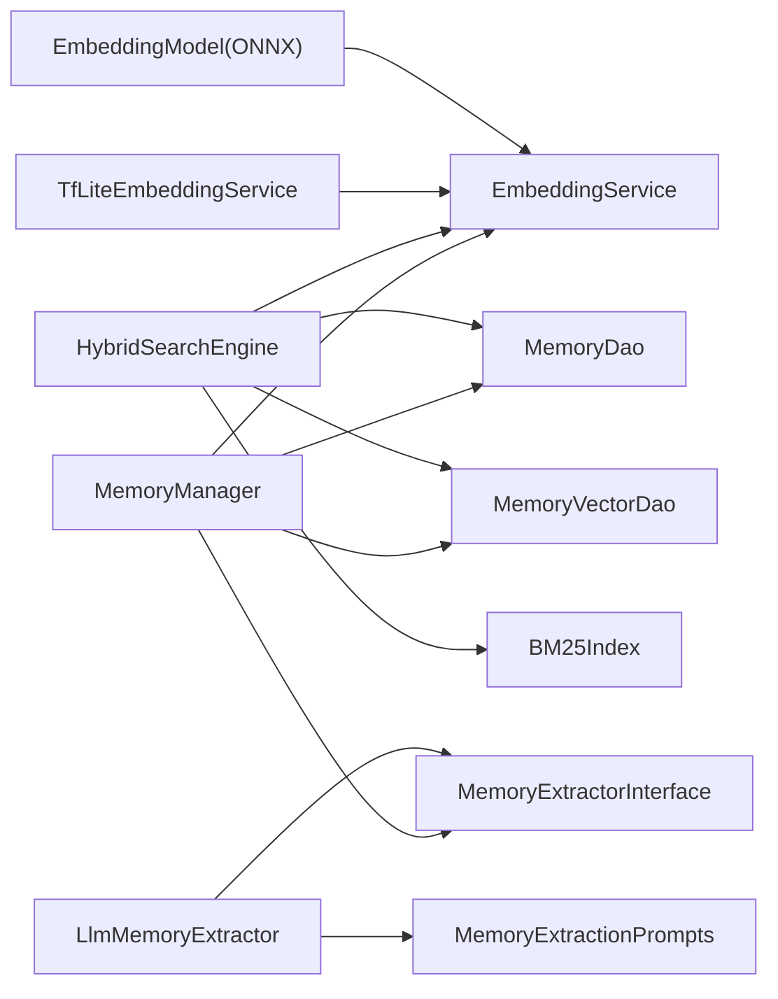

# 内存系统集成

<cite>
**本文引用的文件**
- [MemoryManager.kt](file://app/src/main/java/ai/openclaw/android/domain/memory/MemoryManager.kt)
- [HybridSearchEngine.kt](file://app/src/main/java/ai/openclaw/android/domain/memory/HybridSearchEngine.kt)
- [ColdStartManager.kt](file://app/src/main/java/ai/openclaw/android/domain/memory/ColdStartManager.kt)
- [EmbeddingService.kt](file://app/src/main/java/ai/openclaw/android/domain/memory/EmbeddingService.kt)
- [TfLiteEmbeddingService.kt](file://app/src/main/java/ai/openclaw/android/ml/TfLiteEmbeddingService.kt)
- [EmbeddingModel.kt](file://app/src/main/java/ai/openclaw/android/ml/EmbeddingModel.kt)
- [BM25Index.kt](file://app/src/main/java/ai/openclaw/android/data/local/BM25Index.kt)
- [MemoryDao.kt](file://app/src/main/java/ai/openclaw/android/data/local/MemoryDao.kt)
- [MemoryVectorDao.kt](file://app/src/main/java/ai/openclaw/android/data/local/MemoryVectorDao.kt)
- [MemoryEntity.kt](file://app/src/main/java/ai/openclaw/android/data/model/MemoryEntity.kt)
- [MemoryExtractorInterface.kt](file://app/src/main/java/ai/openclaw/android/domain/memory/MemoryExtractorInterface.kt)
- [MemoryExtractor.kt](file://app/src/main/java/ai/openclaw/android/domain/memory/MemoryExtractor.kt)
- [MemorySearchResult.kt](file://app/src/main/java/ai/openclaw/android/domain/memory/MemorySearchResult.kt)
- [MemoryExtractionPrompts.kt](file://app/src/main/java/ai/openclaw/android/util/MemoryExtractionPrompts.kt)
</cite>

## 目录
1. [简介](#简介)
2. [项目结构](#项目结构)
3. [核心组件](#核心组件)
4. [架构总览](#架构总览)
5. [详细组件分析](#详细组件分析)
6. [依赖关系分析](#依赖关系分析)
7. [性能考量](#性能考量)
8. [故障排查指南](#故障排查指南)
9. [结论](#结论)
10. [附录](#附录)

## 简介
本技术文档聚焦于“机器学习与内存系统的集成”，围绕以下目标展开：
- 深入解释 MemoryManager 如何利用嵌入向量进行智能记忆管理
- 详解 HybridSearchEngine 的混合检索策略（BM25、向量与时间衰减的融合）
- 阐述 ColdStartManager 的冷启动优化机制与初始向量生成策略
- 解释机器学习模型在内存检索中的作用与贡献
- 给出内存系统的性能监控与质量评估指标
- 提供调优与扩展的最佳实践
- 说明 ML 功能对整体系统性能的影响与优化方向

## 项目结构
该仓库采用按领域与层次结合的组织方式：domain 层负责业务域逻辑（如 memory 域），data 层负责本地持久化（Room DAO 与实体），ml 层封装 ONNX/TFLite 推理服务，util 提供提示词等辅助。

图表来源
- [MemoryManager.kt:10-116](file://app/src/main/java/ai/openclaw/android/domain/memory/MemoryManager.kt#L10-L116)
- [HybridSearchEngine.kt:18-227](file://app/src/main/java/ai/openclaw/android/domain/memory/HybridSearchEngine.kt#L18-L227)
- [ColdStartManager.kt:14-61](file://app/src/main/java/ai/openclaw/android/domain/memory/ColdStartManager.kt#L14-L61)
- [EmbeddingService.kt:3-8](file://app/src/main/java/ai/openclaw/android/domain/memory/EmbeddingService.kt#L3-L8)
- [TfLiteEmbeddingService.kt:13-97](file://app/src/main/java/ai/openclaw/android/ml/TfLiteEmbeddingService.kt#L13-L97)
- [EmbeddingModel.kt:20-134](file://app/src/main/java/ai/openclaw/android/ml/EmbeddingModel.kt#L20-L134)
- [BM25Index.kt:14-203](file://app/src/main/java/ai/openclaw/android/data/local/BM25Index.kt#L14-L203)
- [MemoryDao.kt:11-49](file://app/src/main/java/ai/openclaw/android/data/local/MemoryDao.kt#L11-L49)
- [MemoryVectorDao.kt:9-26](file://app/src/main/java/ai/openclaw/android/data/local/MemoryVectorDao.kt#L9-L26)
- [MemoryEntity.kt:6-19](file://app/src/main/java/ai/openclaw/android/data/model/MemoryEntity.kt#L6-L19)
- [MemoryExtractorInterface.kt:7-11](file://app/src/main/java/ai/openclaw/android/domain/memory/MemoryExtractorInterface.kt#L7-L11)
- [MemoryExtractor.kt:16-99](file://app/src/main/java/ai/openclaw/android/domain/memory/MemoryExtractor.kt#L16-L99)
- [MemoryExtractionPrompts.kt:3-28](file://app/src/main/java/ai/openclaw/android/util/MemoryExtractionPrompts.kt#L3-L28)

章节来源
- [MemoryManager.kt:1-116](file://app/src/main/java/ai/openclaw/android/domain/memory/MemoryManager.kt#L1-L116)
- [HybridSearchEngine.kt:1-227](file://app/src/main/java/ai/openclaw/android/domain/memory/HybridSearchEngine.kt#L1-L227)
- [BM25Index.kt:1-203](file://app/src/main/java/ai/openclaw/android/data/local/BM25Index.kt#L1-L203)

## 核心组件
- MemoryManager：负责记忆的存储、检索、清理与访问更新；在有可用嵌入服务时生成向量，否则使用伪向量；支持基于余弦相似度的向量检索。
- HybridSearchEngine：融合 BM25 关键词检索、向量相似度与时间衰减，通过加权融合得到最终排序；内置向量结果缓存与并发搜索能力。
- ColdStartManager：控制冷启动阶段（前72小时）的记忆系统行为，限制资源消耗，72小时后切换到全量模式。
- EmbeddingService 及其实现：抽象嵌入服务接口，TfLiteEmbeddingService 与 EmbeddingModel 分别基于 TensorFlow Lite 与 ONNX Runtime 提供推理能力。
- BM25Index：纯 Kotlin 实现的 BM25 倒排索引，支持中文（二元组）+ 英文小写词分词与日级时间桶过滤。
- MemoryExtractor/LlmMemoryExtractor：从对话或用户输入中抽取记忆，解析 JSON 并分类优先级与标签。
- 数据层：MemoryDao/MemoryVectorDao 负责持久化；MemoryEntity 定义记忆实体字段。

章节来源
- [MemoryManager.kt:10-116](file://app/src/main/java/ai/openclaw/android/domain/memory/MemoryManager.kt#L10-L116)
- [HybridSearchEngine.kt:18-227](file://app/src/main/java/ai/openclaw/android/domain/memory/HybridSearchEngine.kt#L18-L227)
- [ColdStartManager.kt:14-61](file://app/src/main/java/ai/openclaw/android/domain/memory/ColdStartManager.kt#L14-L61)
- [EmbeddingService.kt:3-8](file://app/src/main/java/ai/openclaw/android/domain/memory/EmbeddingService.kt#L3-L8)
- [TfLiteEmbeddingService.kt:13-97](file://app/src/main/java/ai/openclaw/android/ml/TfLiteEmbeddingService.kt#L13-L97)
- [EmbeddingModel.kt:20-134](file://app/src/main/java/ai/openclaw/android/ml/EmbeddingModel.kt#L20-L134)
- [BM25Index.kt:14-203](file://app/src/main/java/ai/openclaw/android/data/local/BM25Index.kt#L14-L203)
- [MemoryExtractorInterface.kt:7-11](file://app/src/main/java/ai/openclaw/android/domain/memory/MemoryExtractorInterface.kt#L7-L11)
- [MemoryExtractor.kt:16-99](file://app/src/main/java/ai/openclaw/android/domain/memory/MemoryExtractor.kt#L16-L99)
- [MemoryDao.kt:11-49](file://app/src/main/java/ai/openclaw/android/data/local/MemoryDao.kt#L11-L49)
- [MemoryVectorDao.kt:9-26](file://app/src/main/java/ai/openclaw/android/data/local/MemoryVectorDao.kt#L9-L26)
- [MemoryEntity.kt:6-19](file://app/src/main/java/ai/openclaw/android/data/model/MemoryEntity.kt#L6-L19)

## 架构总览
下图展示内存系统与 ML 的交互关系：MemoryManager 与 HybridSearchEngine 依赖 EmbeddingService 生成/使用向量；BM25Index 提供关键词检索；MemoryExtractor 负责从对话中抽取记忆并写入数据库。

图表来源
- [HybridSearchEngine.kt:173-185](file://app/src/main/java/ai/openclaw/android/domain/memory/HybridSearchEngine.kt#L173-L185)
- [BM25Index.kt:137-178](file://app/src/main/java/ai/openclaw/android/data/local/BM25Index.kt#L137-L178)
- [MemoryVectorDao.kt:17-25](file://app/src/main/java/ai/openclaw/android/data/local/MemoryVectorDao.kt#L17-L25)
- [MemoryDao.kt:19-21](file://app/src/main/java/ai/openclaw/android/data/local/MemoryDao.kt#L19-L21)
- [EmbeddingService.kt:3-8](file://app/src/main/java/ai/openclaw/android/domain/memory/EmbeddingService.kt#L3-L8)

## 详细组件分析

### MemoryManager：基于嵌入向量的智能记忆管理
- 存储流程：当嵌入服务就绪时，对内容生成向量并持久化；否则生成伪向量以保证检索可用性。
- 检索流程：生成查询向量，暴力遍历向量表计算余弦相似度，过滤阈值后排序返回。
- 访问更新：每次命中会更新最近访问时间与计数，用于后续清理与热度评估。
- 清理策略：基于访问时间与访问次数的“陈旧”判定，定期删除低价值记忆及其向量。
- 扩展点：可替换为近似最近邻（ANN）加速；引入向量压缩与分片；增加向量缓存与批量预热。

图表来源
- [MemoryManager.kt:16-95](file://app/src/main/java/ai/openclaw/android/domain/memory/MemoryManager.kt#L16-L95)

章节来源
- [MemoryManager.kt:10-116](file://app/src/main/java/ai/openclaw/android/domain/memory/MemoryManager.kt#L10-L116)

### HybridSearchEngine：混合检索策略（BM25 + 向量 + 时间衰减）
- 检索路径：
  - BM25：关键词匹配，返回候选集合与原始分数
  - 向量：查询文本嵌入，暴力遍历近期/全部向量，计算相似度并缓存结果（30秒TTL）
  - 融合：对两类分数分别做最大值归一，乘以权重（关键词0.35、向量0.55、时间0.10），并设置最低合并阈值
- 时间衰减：基于指数衰减函数，半衰期约30天，越新的记忆得分越高
- 并发搜索：BM25 与向量两条路径并发执行，提升响应速度
- 可观测性：提供带明细的融合结果，便于诊断各分项贡献

图表来源
- [HybridSearchEngine.kt:82-135](file://app/src/main/java/ai/openclaw/android/domain/memory/HybridSearchEngine.kt#L82-L135)
- [HybridSearchEngine.kt:172-185](file://app/src/main/java/ai/openclaw/android/domain/memory/HybridSearchEngine.kt#L172-L185)
- [HybridSearchEngine.kt:202-219](file://app/src/main/java/ai/openclaw/android/domain/memory/HybridSearchEngine.kt#L202-L219)

章节来源
- [HybridSearchEngine.kt:18-227](file://app/src/main/java/ai/openclaw/android/domain/memory/HybridSearchEngine.kt#L18-L227)

### ColdStartManager：冷启动优化与初始向量生成
- 模式切换：前72小时为 SENSORY_ONLY（仅存储偏好/事实类型，禁用向量操作），之后进入 FULL 模式
- 记录机制：首次启动时间记录在 SharedPreferences 中，作为模式判断依据
- 人性化设计：避免冷启动阶段因向量计算导致卡顿，保障流畅体验

图表来源
- [ColdStartManager.kt:44-60](file://app/src/main/java/ai/openclaw/android/domain/memory/ColdStartManager.kt#L44-L60)

章节来源
- [ColdStartManager.kt:14-61](file://app/src/main/java/ai/openclaw/android/domain/memory/ColdStartManager.kt#L14-L61)

### 机器学习模型在内存检索中的角色
- EmbeddingService 抽象：统一不同后端（TFLite/ONNX）的嵌入接口
- TfLiteEmbeddingService：加载本地模型与词表，支持批处理与维度查询
- EmbeddingModel（ONNX）：优先外部存储模型，具备缓存与优化级别配置
- 在 MemoryManager 与 HybridSearchEngine 中，ML 主要用于：
  - 将文本映射到稠密向量空间，提升语义检索效果
  - 作为 HybridSearchEngine 的向量分支，与 BM25 形成互补
  - 为冷启动阶段提供降级向量（伪向量）

图表来源
- [EmbeddingService.kt:3-8](file://app/src/main/java/ai/openclaw/android/domain/memory/EmbeddingService.kt#L3-L8)
- [TfLiteEmbeddingService.kt:13-97](file://app/src/main/java/ai/openclaw/android/ml/TfLiteEmbeddingService.kt#L13-L97)
- [EmbeddingModel.kt:20-134](file://app/src/main/java/ai/openclaw/android/ml/EmbeddingModel.kt#L20-L134)

章节来源
- [EmbeddingService.kt:3-8](file://app/src/main/java/ai/openclaw/android/domain/memory/EmbeddingService.kt#L3-L8)
- [TfLiteEmbeddingService.kt:13-97](file://app/src/main/java/ai/openclaw/android/ml/TfLiteEmbeddingService.kt#L13-L97)
- [EmbeddingModel.kt:20-134](file://app/src/main/java/ai/openclaw/android/ml/EmbeddingModel.kt#L20-L134)

### BM25Index：关键词检索的高效实现
- 分词策略：中文字符大二元组 + 英文小写单词，兼顾语义与检索效率
- 倒排索引：支持动态增删，维护文档长度与平均长度，便于 BM25 计算
- 时间过滤：按日级桶快速筛选时间范围内的候选，降低 BM25 计算开销
- 重建能力：支持从 DAO 全量重建索引，适配启动或批量变更场景

图表来源
- [BM25Index.kt:91-135](file://app/src/main/java/ai/openclaw/android/data/local/BM25Index.kt#L91-L135)
- [BM25Index.kt:140-178](file://app/src/main/java/ai/openclaw/android/data/local/BM25Index.kt#L140-L178)

章节来源
- [BM25Index.kt:14-203](file://app/src/main/java/ai/openclaw/android/data/local/BM25Index.kt#L14-L203)

### MemoryExtractor：从对话与输入中抽取记忆
- 对话抽取：截断最近若干条消息，拼接为提示词，交由本地 LLM 客户端解析 JSON，提取多条记忆
- 用户输入抽取：根据内容特征自动分类记忆类型与优先级，提取标签
- 提示词规范：明确记忆类型、优先级与标签规则，确保抽取一致性

图表来源
- [MemoryExtractor.kt:18-52](file://app/src/main/java/ai/openclaw/android/domain/memory/MemoryExtractor.kt#L18-L52)
- [MemoryExtractionPrompts.kt:3-28](file://app/src/main/java/ai/openclaw/android/util/MemoryExtractionPrompts.kt#L3-L28)

章节来源
- [MemoryExtractorInterface.kt:7-11](file://app/src/main/java/ai/openclaw/android/domain/memory/MemoryExtractorInterface.kt#L7-L11)
- [MemoryExtractor.kt:16-99](file://app/src/main/java/ai/openclaw/android/domain/memory/MemoryExtractor.kt#L16-L99)
- [MemoryExtractionPrompts.kt:3-28](file://app/src/main/java/ai/openclaw/android/util/MemoryExtractionPrompts.kt#L3-L28)

## 依赖关系分析
- MemoryManager 依赖 EmbeddingService、MemoryDao、MemoryVectorDao、MemoryExtractorInterface
- HybridSearchEngine 依赖 BM25Index、MemoryDao、MemoryVectorDao、EmbeddingService
- EmbeddingService 由 TfLiteEmbeddingService 与 EmbeddingModel 实现
- MemoryExtractor 依赖 LocalLLMClient 与 MemoryExtractionPrompts
- 数据层通过 Room DAO 与实体进行持久化

图表来源
- [MemoryManager.kt:3-15](file://app/src/main/java/ai/openclaw/android/domain/memory/MemoryManager.kt#L3-L15)
- [HybridSearchEngine.kt:18-23](file://app/src/main/java/ai/openclaw/android/domain/memory/HybridSearchEngine.kt#L18-L23)
- [TfLiteEmbeddingService.kt:13-25](file://app/src/main/java/ai/openclaw/android/ml/TfLiteEmbeddingService.kt#L13-L25)
- [EmbeddingModel.kt:20-34](file://app/src/main/java/ai/openclaw/android/ml/EmbeddingModel.kt#L20-L34)
- [MemoryExtractor.kt:16-16](file://app/src/main/java/ai/openclaw/android/domain/memory/MemoryExtractor.kt#L16-L16)

章节来源
- [MemoryManager.kt:3-15](file://app/src/main/java/ai/openclaw/android/domain/memory/MemoryManager.kt#L3-L15)
- [HybridSearchEngine.kt:18-23](file://app/src/main/java/ai/openclaw/android/domain/memory/HybridSearchEngine.kt#L18-L23)
- [TfLiteEmbeddingService.kt:13-25](file://app/src/main/java/ai/openclaw/android/ml/TfLiteEmbeddingService.kt#L13-L25)
- [EmbeddingModel.kt:20-34](file://app/src/main/java/ai/openclaw/android/ml/EmbeddingModel.kt#L20-L34)
- [MemoryExtractor.kt:16-16](file://app/src/main/java/ai/openclaw/android/domain/memory/MemoryExtractor.kt#L16-L16)

## 性能考量
- 向量检索复杂度：MemoryManager 当前为暴力遍历，时间复杂度 O(N·D)，N 为向量数量，D 为维度；建议引入 ANN（如 FAISS/MLX）与向量索引
- 缓存策略：HybridSearchEngine 对向量结果缓存30秒，减少重复查询开销；可考虑向量向量化缓存与LRU淘汰
- 并发优化：HybridSearchEngine 的异步搜索使用默认调度器并发执行 BM25 与向量路径，缩短端到端延迟
- 冷启动：ColdStartManager 在前72小时禁用向量，显著降低初始化成本；72小时后逐步启用全量功能
- 索引重建：BM25Index 支持从 DAO 重建，适合批量导入或迁移场景，但需注意后台线程与 UI 阻塞风险
- 模型加载：ONNX/TFLite 模型加载与初始化应放在后台线程，避免阻塞主线程；可考虑懒加载与预热

[本节为通用性能讨论，无需特定文件来源]

## 故障排查指南
- 嵌入服务未初始化
  - 现象：调用 embed 抛出未初始化异常
  - 处理：确保在应用启动阶段调用 initialize，并检查模型文件是否存在
- 向量维度不一致
  - 现象：余弦相似度计算报错或结果异常
  - 处理：确认查询与存储向量维度一致，检查 EmbeddingService.getDimension 返回值
- 搜索结果为空
  - 关键检查：查询为空、阈值过高、缓存过期、向量表为空
  - 建议：降低阈值、检查缓存清理周期、确认向量生成与持久化流程
- 冷启动模式误判
  - 现象：长时间仍处于 SENSORY_ONLY
  - 处理：确认首次启动时间记录存在且未被重置
- BM25 索引缺失
  - 现象：关键词检索无结果
  - 处理：调用重建索引方法，或在启动时触发重建

章节来源
- [TfLiteEmbeddingService.kt:27-48](file://app/src/main/java/ai/openclaw/android/ml/TfLiteEmbeddingService.kt#L27-L48)
- [EmbeddingModel.kt:36-54](file://app/src/main/java/ai/openclaw/android/ml/EmbeddingModel.kt#L36-L54)
- [MemoryManager.kt:101-114](file://app/src/main/java/ai/openclaw/android/domain/memory/MemoryManager.kt#L101-L114)
- [HybridSearchEngine.kt:41-53](file://app/src/main/java/ai/openclaw/android/domain/memory/HybridSearchEngine.kt#L41-L53)
- [ColdStartManager.kt:35-50](file://app/src/main/java/ai/openclaw/android/domain/memory/ColdStartManager.kt#L35-L50)
- [BM25Index.kt:183-189](file://app/src/main/java/ai/openclaw/android/data/local/BM25Index.kt#L183-L189)

## 结论
本内存系统通过“关键词 + 语义向量 + 时间衰减”的混合策略，在保证检索质量的同时兼顾性能与资源占用。MemoryManager 与 HybridSearchEngine 将 ML 能力无缝集成至检索链路，ColdStartManager 则在初期阶段平衡体验与成本。未来可在向量索引、缓存策略、并发与懒加载等方面进一步优化，以支撑更大规模与更复杂场景。

[本节为总结性内容，无需特定文件来源]

## 附录
- 性能监控与质量评估建议
  - 指标：检索延迟（p50/p90/p99）、召回率@K、准确率@K、向量命中率、缓存命中率、索引重建耗时
  - 观测：HybridSearchEngine 提供带明细的融合结果，可用于分析关键词/向量/时间三路贡献
- 调优与扩展最佳实践
  - 向量检索：引入 ANN 索引与分片；对向量进行压缩或量化；按时间窗口分片检索
  - 缓存：扩大向量缓存容量与TTL；对热点查询进行预热
  - 并发：合理设置协程调度器与并发度；避免过度并发导致抖动
  - 冷启动：在72小时后渐进启用向量；对新用户进行引导与降噪
  - 模型：优先外部模型目录；启用 ONNX 优化级别；实现模型版本管理与灰度发布

[本节为通用指导，无需特定文件来源]