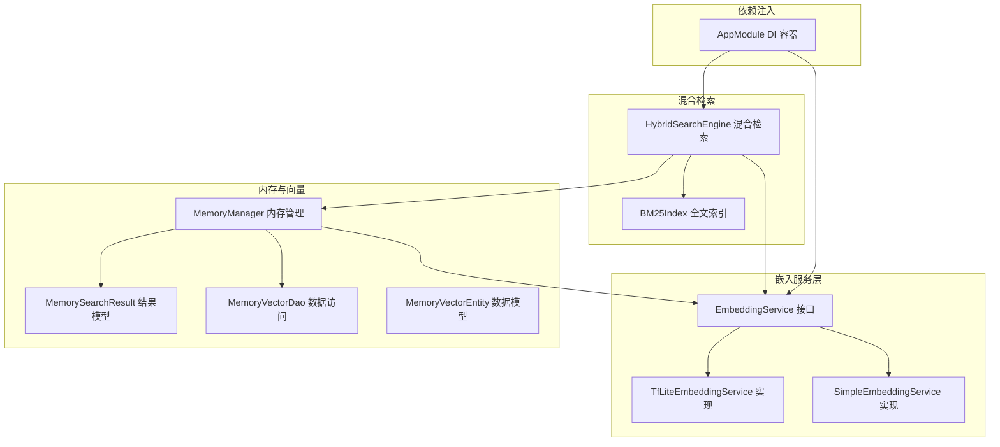
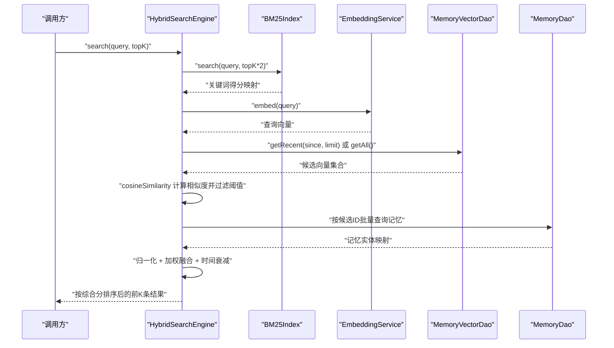
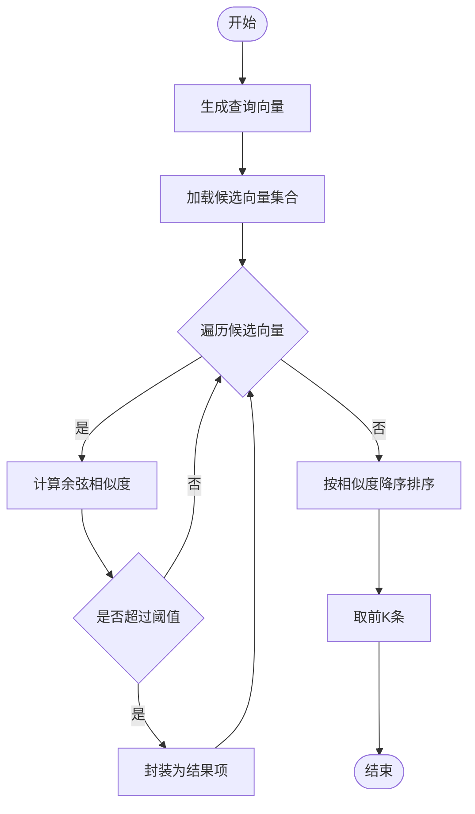
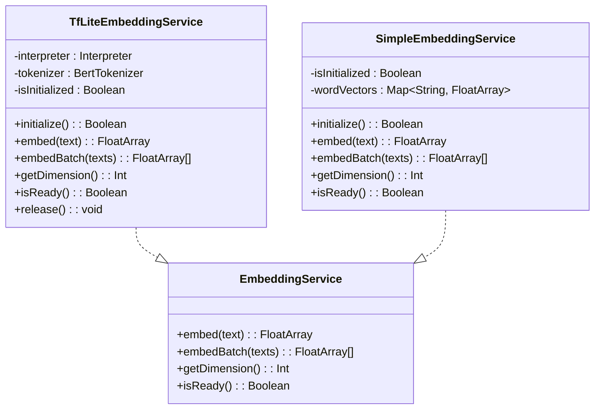
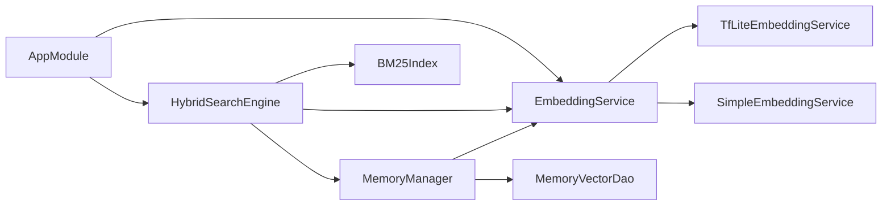
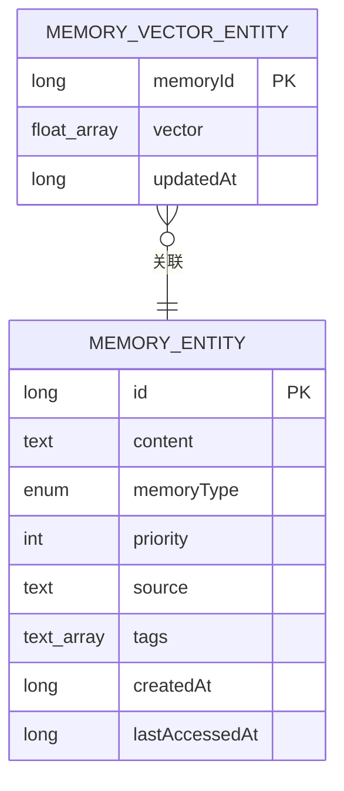

# 向量相似度搜索

<cite>
**本文引用的文件**
- [EmbeddingService.kt](file://app/src/main/java/ai/openclaw/android/domain/memory/EmbeddingService.kt)
- [TfLiteEmbeddingService.kt](file://app/src/main/java/ai/openclaw/android/ml/TfLiteEmbeddingService.kt)
- [SimpleEmbeddingService.kt](file://app/src/main/java/ai/openclaw/android/ml/SimpleEmbeddingService.kt)
- [MemoryManager.kt](file://app/src/main/java/ai/openclaw/android/domain/memory/MemoryManager.kt)
- [MemorySearchResult.kt](file://app/src/main/java/ai/openclaw/android/domain/memory/MemorySearchResult.kt)
- [HybridSearchEngine.kt](file://app/src/main/java/ai/openclaw/android/domain/memory/HybridSearchEngine.kt)
- [MemoryVectorDao.kt](file://app/src/main/java/ai/openclaw/android/data/local/MemoryVectorDao.kt)
- [MemoryVectorEntity.kt](file://app/src/main/java/ai/openclaw/android/data/model/MemoryVectorEntity.kt)
- [AppModule.kt](file://app/src/main/java/ai/openclaw/android/di/AppModule.kt)
- [VectorSearchTest.kt](file://app/src/test/java/ai/openclaw/android/domain/memory/VectorSearchTest.kt)
- [BM25Index.kt](file://docs/memory-plan-ref/BM25Index.kt)
- [ColdStartManager.kt](file://app/src/main/java/ai/openclaw/android/domain/memory/ColdStartManager.kt)
</cite>

## 目录
1. [简介](#简介)
2. [项目结构](#项目结构)
3. [核心组件](#核心组件)
4. [架构总览](#架构总览)
5. [详细组件分析](#详细组件分析)
6. [依赖关系分析](#依赖关系分析)
7. [性能考量](#性能考量)
8. [故障排查指南](#故障排查指南)
9. [结论](#结论)
10. [附录](#附录)

## 简介
本技术文档围绕向量相似度搜索系统展开，重点解释以下内容：
- 向量相似度计算算法：余弦相似度与欧几里得距离的适用场景与实现要点
- EmbeddingService 在内存检索中的作用与实现原理
- MemorySearchResult 的数据结构与结果排序机制
- 向量索引的构建与查询优化策略
- 相似度阈值设置与结果过滤逻辑
- 性能优化技巧与内存管理策略
- 向量搜索在混合检索系统中的集成方式

## 项目结构
该系统由“嵌入服务”“内存管理”“混合检索引擎”“向量持久化DAO/实体”以及“DI模块”组成，形成清晰的分层架构。

图表来源
- [AppModule.kt:37-53](file://app/src/main/java/ai/openclaw/android/di/AppModule.kt#L37-L53)
- [EmbeddingService.kt:3-8](file://app/src/main/java/ai/openclaw/android/domain/memory/EmbeddingService.kt#L3-L8)
- [TfLiteEmbeddingService.kt:13-78](file://app/src/main/java/ai/openclaw/android/ml/TfLiteEmbeddingService.kt#L13-L78)
- [SimpleEmbeddingService.kt:19-107](file://app/src/main/java/ai/openclaw/android/ml/SimpleEmbeddingService.kt#L19-L107)
- [MemoryManager.kt:10-36](file://app/src/main/java/ai/openclaw/android/domain/memory/MemoryManager.kt#L10-L36)
- [MemorySearchResult.kt:5-8](file://app/src/main/java/ai/openclaw/android/domain/memory/MemorySearchResult.kt#L5-L8)
- [MemoryVectorDao.kt:9-25](file://app/src/main/java/ai/openclaw/android/data/local/MemoryVectorDao.kt#L9-L25)
- [MemoryVectorEntity.kt:6-11](file://app/src/main/java/ai/openclaw/android/data/model/MemoryVectorEntity.kt#L6-L11)
- [HybridSearchEngine.kt:18-23](file://app/src/main/java/ai/openclaw/android/domain/memory/HybridSearchEngine.kt#L18-L23)
- [BM25Index.kt:15-81](file://docs/memory-plan-ref/BM25Index.kt#L15-L81)

章节来源
- [AppModule.kt:24-79](file://app/src/main/java/ai/openclaw/android/di/AppModule.kt#L24-L79)
- [EmbeddingService.kt:1-8](file://app/src/main/java/ai/openclaw/android/domain/memory/EmbeddingService.kt#L1-L8)
- [TfLiteEmbeddingService.kt:13-97](file://app/src/main/java/ai/openclaw/android/ml/TfLiteEmbeddingService.kt#L13-L97)
- [SimpleEmbeddingService.kt:19-107](file://app/src/main/java/ai/openclaw/android/ml/SimpleEmbeddingService.kt#L19-L107)
- [MemoryManager.kt:10-116](file://app/src/main/java/ai/openclaw/android/domain/memory/MemoryManager.kt#L10-L116)
- [MemorySearchResult.kt:1-8](file://app/src/main/java/ai/openclaw/android/domain/memory/MemorySearchResult.kt#L1-L8)
- [MemoryVectorDao.kt:1-26](file://app/src/main/java/ai/openclaw/android/data/local/MemoryVectorDao.kt#L1-L26)
- [MemoryVectorEntity.kt:1-19](file://app/src/main/java/ai/openclaw/android/data/model/MemoryVectorEntity.kt#L1-L19)
- [HybridSearchEngine.kt:18-227](file://app/src/main/java/ai/openclaw/android/domain/memory/HybridSearchEngine.kt#L18-L227)
- [BM25Index.kt:15-91](file://docs/memory-plan-ref/BM25Index.kt#L15-L91)

## 核心组件
- EmbeddingService 接口：统一抽象嵌入生成能力，支持单条与批量嵌入、维度查询与就绪状态检查。
- TfLiteEmbeddingService：基于 TensorFlow Lite 的神经网络嵌入实现，具备分词、模型加载、推理执行与资源释放能力。
- SimpleEmbeddingService：轻量级哈希嵌入实现，适合无模型或冷启动阶段使用。
- MemoryManager：负责向量存储、内存检索、相似度计算与结果过滤；提供余弦相似度计算工具。
- MemorySearchResult：内存检索结果的数据载体，包含记忆实体与相似度分数。
- HybridSearchEngine：融合 BM25 关键词检索与向量相似度，并引入时间衰减进行综合评分与排序。
- MemoryVectorDao/MemoryVectorEntity：向量持久化访问层与实体模型。
- AppModule：依赖注入容器，统一装配嵌入服务、BM25 索引与混合检索引擎。

章节来源
- [EmbeddingService.kt:3-8](file://app/src/main/java/ai/openclaw/android/domain/memory/EmbeddingService.kt#L3-L8)
- [TfLiteEmbeddingService.kt:13-78](file://app/src/main/java/ai/openclaw/android/ml/TfLiteEmbeddingService.kt#L13-L78)
- [SimpleEmbeddingService.kt:19-107](file://app/src/main/java/ai/openclaw/android/ml/SimpleEmbeddingService.kt#L19-L107)
- [MemoryManager.kt:10-116](file://app/src/main/java/ai/openclaw/android/domain/memory/MemoryManager.kt#L10-L116)
- [MemorySearchResult.kt:5-8](file://app/src/main/java/ai/openclaw/android/domain/memory/MemorySearchResult.kt#L5-L8)
- [HybridSearchEngine.kt:18-227](file://app/src/main/java/ai/openclaw/android/domain/memory/HybridSearchEngine.kt#L18-L227)
- [MemoryVectorDao.kt:9-25](file://app/src/main/java/ai/openclaw/android/data/local/MemoryVectorDao.kt#L9-L25)
- [MemoryVectorEntity.kt:6-11](file://app/src/main/java/ai/openclaw/android/data/model/MemoryVectorEntity.kt#L6-L11)
- [AppModule.kt:37-53](file://app/src/main/java/ai/openclaw/android/di/AppModule.kt#L37-L53)

## 架构总览
混合检索系统采用“双路径召回 + 重排序”的范式：
- 关键词路径（BM25）：快速召回高相关性候选集
- 语义路径（向量相似度）：对候选集进行细粒度语义重排
- 时间衰减：对近期访问的记忆赋予更高权重
- 综合评分：加权融合三路信号，输出最终排序结果

图表来源
- [HybridSearchEngine.kt:137-219](file://app/src/main/java/ai/openclaw/android/domain/memory/HybridSearchEngine.kt#L137-L219)
- [BM25Index.kt:53-81](file://docs/memory-plan-ref/BM25Index.kt#L53-L81)
- [MemoryVectorDao.kt:17-24](file://app/src/main/java/ai/openclaw/android/data/local/MemoryVectorDao.kt#L17-L24)
- [MemoryManager.kt:101-114](file://app/src/main/java/ai/openclaw/android/domain/memory/MemoryManager.kt#L101-L114)

## 详细组件分析

### 向量相似度计算与过滤
- 余弦相似度：用于衡量向量方向一致性，不考虑模长差异，适配嵌入向量通常已归一化的特性。
- 欧几里得距离：衡量向量在欧氏空间中的直线距离，数值越小越相似；在嵌入向量未归一化时更常用。
- 过滤与排序：通过阈值过滤低相似度项，随后按相似度降序取Top-K。

图表来源
- [MemoryManager.kt:38-61](file://app/src/main/java/ai/openclaw/android/domain/memory/MemoryManager.kt#L38-L61)
- [MemoryManager.kt:101-114](file://app/src/main/java/ai/openclaw/android/domain/memory/MemoryManager.kt#L101-L114)

章节来源
- [MemoryManager.kt:38-61](file://app/src/main/java/ai/openclaw/android/domain/memory/MemoryManager.kt#L38-L61)
- [VectorSearchTest.kt:194-220](file://app/src/test/java/ai/openclaw/android/domain/memory/VectorSearchTest.kt#L194-L220)
- [VectorSearchTest.kt:222-249](file://app/src/test/java/ai/openclaw/android/domain/memory/VectorSearchTest.kt#L222-L249)

### EmbeddingService 在内存检索中的作用与实现原理
- 抽象职责：统一嵌入生成接口，支持批量嵌入、维度查询与就绪状态检查。
- TfLite 实现：加载词表与模型，执行推理，返回固定维度的浮点数组；提供资源释放能力。
- 简化实现：在模型不可用时，使用哈希与归一化策略生成一致的伪向量，保障系统可用性。

图表来源
- [EmbeddingService.kt:3-8](file://app/src/main/java/ai/openclaw/android/domain/memory/EmbeddingService.kt#L3-L8)
- [TfLiteEmbeddingService.kt:13-78](file://app/src/main/java/ai/openclaw/android/ml/TfLiteEmbeddingService.kt#L13-L78)
- [SimpleEmbeddingService.kt:19-107](file://app/src/main/java/ai/openclaw/android/ml/SimpleEmbeddingService.kt#L19-L107)

章节来源
- [EmbeddingService.kt:3-8](file://app/src/main/java/ai/openclaw/android/domain/memory/EmbeddingService.kt#L3-L8)
- [TfLiteEmbeddingService.kt:27-78](file://app/src/main/java/ai/openclaw/android/ml/TfLiteEmbeddingService.kt#L27-L78)
- [SimpleEmbeddingService.kt:31-107](file://app/src/main/java/ai/openclaw/android/ml/SimpleEmbeddingService.kt#L31-L107)

### MemorySearchResult 的数据结构与结果排序机制
- 数据结构：包含记忆实体与相似度分数，便于上层直接消费。
- 排序机制：以相似度为唯一排序键，降序排列，确保最相关的结果优先展示。
- 过滤逻辑：在生成阶段即按阈值过滤，减少后续处理开销。

章节来源
- [MemorySearchResult.kt:5-8](file://app/src/main/java/ai/openclaw/android/domain/memory/MemorySearchResult.kt#L5-L8)
- [MemoryManager.kt:38-61](file://app/src/main/java/ai/openclaw/android/domain/memory/MemoryManager.kt#L38-L61)

### 向量索引的构建与查询优化策略
- 索引构建：BM25Index 基于 SQLite FTS5 虚拟表，对 content 与 tags 建立索引，支持高效关键词检索。
- 查询优化：
  - 关键词路径：先以 topK*2 的规模召回，再与向量路径合并，平衡召回率与延迟。
  - 向量路径：默认对最近 N 条向量进行检索，若为空则回退到全量向量；同时启用向量结果缓存（TTL），降低重复查询成本。
  - 归一化与融合：对关键词与向量分数分别做最大值归一化，再按权重融合，并加入时间衰减提升新鲜度感知。

章节来源
- [BM25Index.kt:19-81](file://docs/memory-plan-ref/BM25Index.kt#L19-L81)
- [HybridSearchEngine.kt:137-219](file://app/src/main/java/ai/openclaw/android/domain/memory/HybridSearchEngine.kt#L137-L219)

### 相似度阈值设置与结果过滤逻辑
- 阈值设置：内存检索提供可配置阈值参数，低于阈值的候选被过滤掉。
- 过滤时机：在相似度计算后立即过滤，避免无效数据进入排序阶段。
- 测试验证：单元测试覆盖阈值过滤、排序稳定性与边界条件。

章节来源
- [MemoryManager.kt:38-61](file://app/src/main/java/ai/openclaw/android/domain/memory/MemoryManager.kt#L38-L61)
- [VectorSearchTest.kt:222-249](file://app/src/test/java/ai/openclaw/android/domain/memory/VectorSearchTest.kt#L222-L249)

### 性能优化技巧与内存管理策略
- 并发执行：混合检索支持并行执行关键词与向量两条路径，显著降低端到端延迟。
- 缓存策略：向量路径结果缓存（TTL 清理），减少重复计算。
- 时间窗口限制：向量检索默认限定最近 N 条记录，必要时回退全量，兼顾性能与召回。
- 冷启动策略：冷启动阶段（前72小时）采用轻量模式，仅保留关键类型记忆，避免昂贵的向量操作。
- 资源释放：TFLite 嵌入服务提供显式释放接口，避免内存泄漏。

章节来源
- [HybridSearchEngine.kt:202-219](file://app/src/main/java/ai/openclaw/android/domain/memory/HybridSearchEngine.kt#L202-L219)
- [HybridSearchEngine.kt:41-53](file://app/src/main/java/ai/openclaw/android/domain/memory/HybridSearchEngine.kt#L41-L53)
- [HybridSearchEngine.kt:159-169](file://app/src/main/java/ai/openclaw/android/domain/memory/HybridSearchEngine.kt#L159-L169)
- [ColdStartManager.kt:14-33](file://app/src/main/java/ai/openclaw/android/domain/memory/ColdStartManager.kt#L14-L33)
- [TfLiteEmbeddingService.kt:91-97](file://app/src/main/java/ai/openclaw/android/ml/TfLiteEmbeddingService.kt#L91-L97)

### 向量搜索在混合检索系统中的集成方式
- 依赖注入：通过 AppModule 统一装配 BM25 索引、嵌入服务与混合检索引擎，确保运行期解耦与可替换性。
- 调用链路：HybridSearchEngine 作为门面，协调 BM25 与向量路径，统一输出融合结果。
- 扩展点：可通过替换 EmbeddingService 实现（如更换模型或算法）或调整融合权重，灵活适配不同业务场景。

章节来源
- [AppModule.kt:37-53](file://app/src/main/java/ai/openclaw/android/di/AppModule.kt#L37-L53)
- [HybridSearchEngine.kt:18-23](file://app/src/main/java/ai/openclaw/android/domain/memory/HybridSearchEngine.kt#L18-L23)

## 依赖关系分析
- 耦合与内聚：各层职责清晰，嵌入服务与检索引擎通过接口解耦；向量 DAO 与实体模型保持稳定契约。
- 外部依赖：BM25 基于 SQLite FTS5；TFLite 嵌入服务依赖模型与词表资源。
- 循环依赖：未发现循环依赖迹象，整体呈单向依赖链。

图表来源
- [AppModule.kt:37-53](file://app/src/main/java/ai/openclaw/android/di/AppModule.kt#L37-L53)
- [HybridSearchEngine.kt:18-23](file://app/src/main/java/ai/openclaw/android/domain/memory/HybridSearchEngine.kt#L18-L23)
- [MemoryManager.kt:10-15](file://app/src/main/java/ai/openclaw/android/domain/memory/MemoryManager.kt#L10-L15)

## 性能考量
- 算法复杂度：内存检索为暴力扫描，时间复杂度 O(N×D)，其中 N 为向量数量，D 为维度；建议控制向量规模或引入时间窗口。
- I/O 优化：向量读取尽量批量化；BM25 查询使用 SQLite 索引与 LIMIT 控制结果规模。
- 并发与缓存：并行执行与向量结果缓存显著降低延迟；合理设置 TTL 与清理策略。
- 冷启动：冷启动阶段禁用向量路径，待资源充足后再切换至全量模式。

## 故障排查指南
- 嵌入服务未初始化：检查 isReady 状态与模型/词表加载是否成功；必要时调用 release 释放并重新初始化。
- 相似度异常：确认输入向量维度一致且非零；检查归一化与阈值设置。
- 结果为空：核对向量存储是否正确、BM25 索引是否重建、时间窗口是否过窄。
- 性能问题：评估向量数量增长趋势，考虑引入近似最近邻索引（ANN）替代全量扫描；优化阈值与 Top-K 参数。

章节来源
- [TfLiteEmbeddingService.kt:27-48](file://app/src/main/java/ai/openclaw/android/ml/TfLiteEmbeddingService.kt#L27-L48)
- [MemoryManager.kt:101-114](file://app/src/main/java/ai/openclaw/android/domain/memory/MemoryManager.kt#L101-L114)
- [HybridSearchEngine.kt:221-225](file://app/src/main/java/ai/openclaw/android/domain/memory/HybridSearchEngine.kt#L221-L225)

## 结论
本系统通过“关键词 + 语义 + 时间”的多信号融合实现了高效稳定的向量相似度搜索。EmbeddingService 提供可插拔的嵌入能力，MemoryManager 与 HybridSearchEngine 分别承担存储检索与融合排序职责，BM25Index 与向量缓存共同保障性能。通过阈值过滤、并发执行与冷启动策略，系统在准确性与响应速度之间取得良好平衡。未来可在向量规模扩大时引入 ANN 等高级索引技术进一步优化性能。

## 附录
- 数据模型关系图

图表来源
- [MemoryVectorEntity.kt:6-11](file://app/src/main/java/ai/openclaw/android/data/model/MemoryVectorEntity.kt#L6-L11)
- [MemoryVectorDao.kt:14-24](file://app/src/main/java/ai/openclaw/android/data/local/MemoryVectorDao.kt#L14-L24)