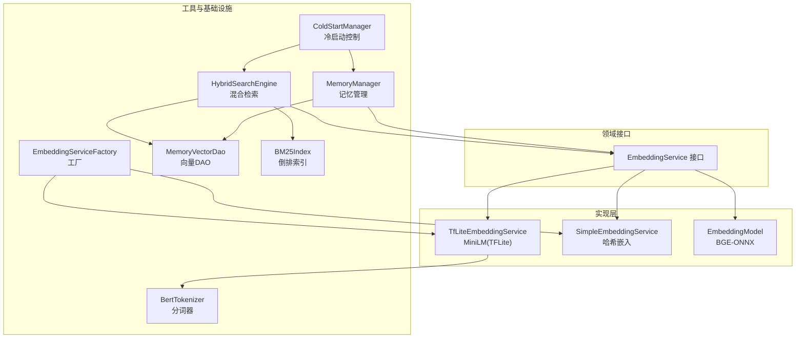
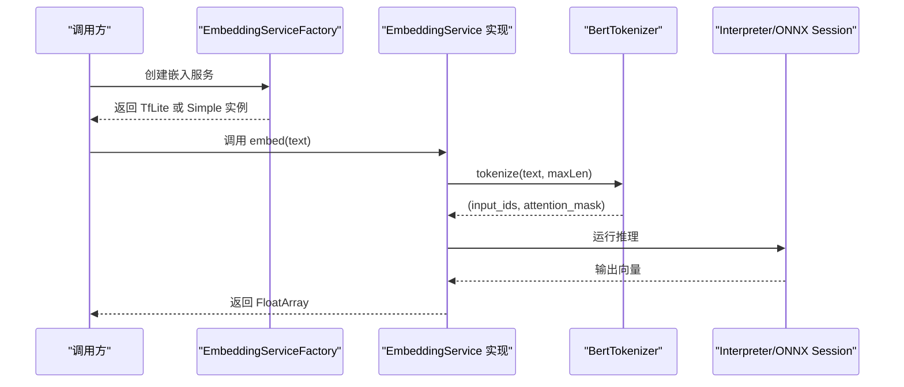
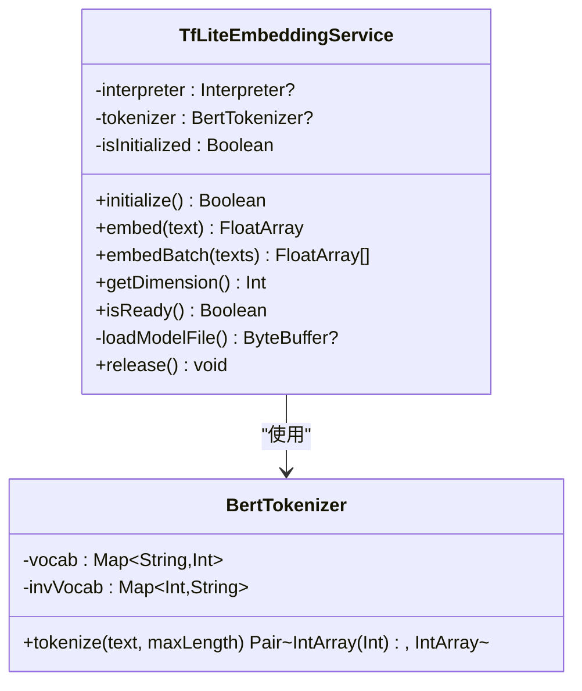
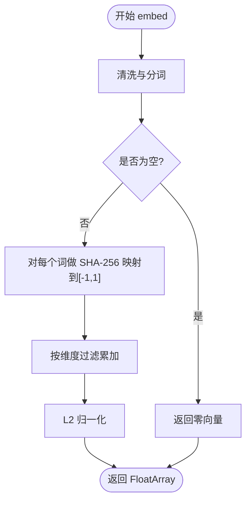
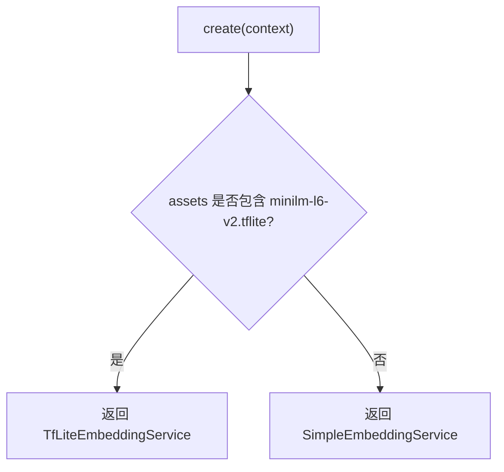
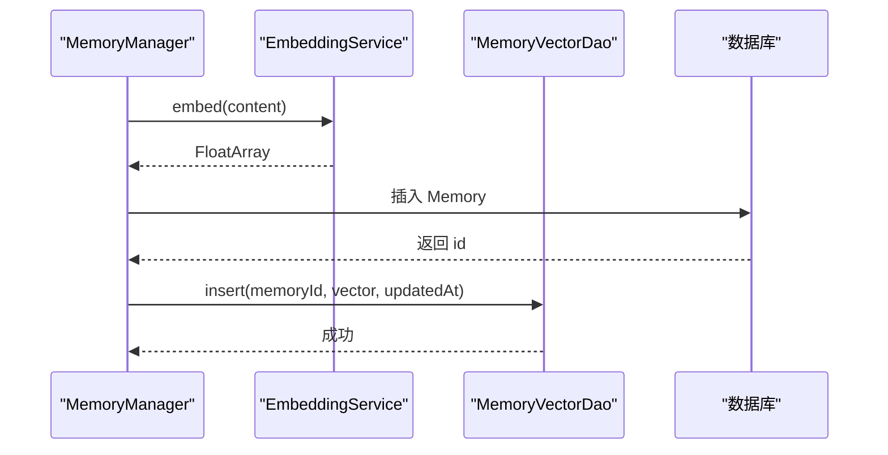
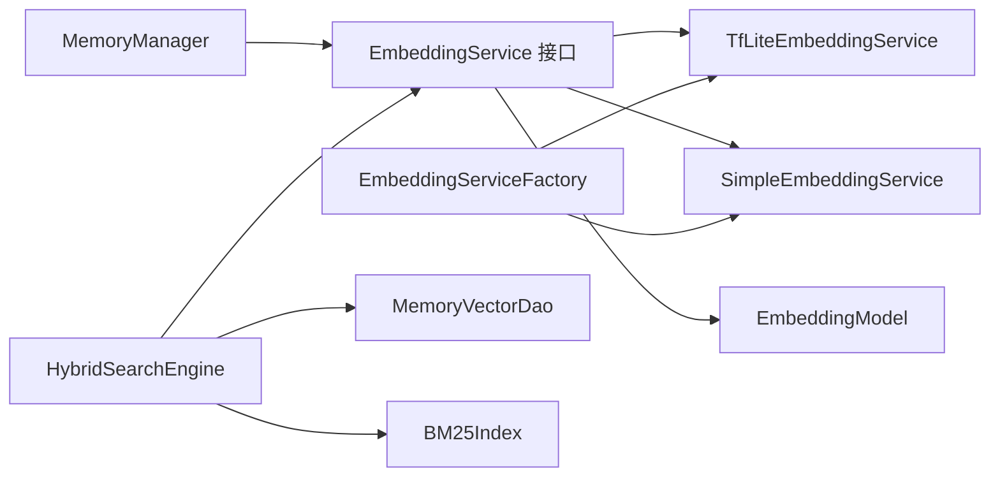
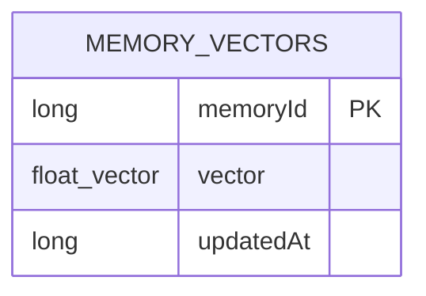

# 嵌入向量服务

<cite>
**本文引用的文件**
- [TfLiteEmbeddingService.kt](file://app/src/main/java/ai/openclaw/android/ml/TfLiteEmbeddingService.kt)
- [SimpleEmbeddingService.kt](file://app/src/main/java/ai/openclaw/android/ml/SimpleEmbeddingService.kt)
- [EmbeddingServiceFactory.kt](file://app/src/main/java/ai/openclaw/android/ml/EmbeddingServiceFactory.kt)
- [BertTokenizer.kt](file://app/src/main/java/ai/openclaw/android/ml/BertTokenizer.kt)
- [EmbeddingService.kt](file://app/src/main/java/ai/openclaw/android/domain/memory/EmbeddingService.kt)
- [EmbeddingModel.kt](file://app/src/main/java/ai/openclaw/android/memory/EmbeddingModel.kt)
- [MemoryVectorDao.kt](file://app/src/main/java/ai/openclaw/android/data/local/MemoryVectorDao.kt)
- [BM25Index.kt](file://app/src/main/java/ai/openclaw/android/data/local/BM25Index.kt)
- [HybridSearchEngine.kt](file://app/src/main/java/ai/openclaw/android/domain/memory/HybridSearchEngine.kt)
- [MemoryManager.kt](file://app/src/main/java/ai/openclaw/android/domain/memory/MemoryManager.kt)
- [AppModule.kt](file://app/src/main/java/ai/openclaw/android/di/AppModule.kt)
- [MemoryVectorEntity.kt](file://app/src/main/java/ai/openclaw/android/data/model/MemoryVectorEntity.kt)
- [vocab.txt](file://app/src/main/assets/vocab.txt)
- [SimpleEmbeddingServiceTest.kt](file://app/src/test/java/ai/openclaw/android/ml/SimpleEmbeddingServiceTest.kt)
- [ColdStartManager.kt](file://app/src/main/java/ai/openclaw/android/domain/memory/ColdStartManager.kt)
</cite>

## 目录
1. [简介](#简介)
2. [项目结构](#项目结构)
3. [核心组件](#核心组件)
4. [架构总览](#架构总览)
5. [详细组件分析](#详细组件分析)
6. [依赖关系分析](#依赖关系分析)
7. [性能考量与调优](#性能考量与调优)
8. [故障排查指南](#故障排查指南)
9. [结论](#结论)
10. [附录](#附录)

## 简介
本文件面向嵌入向量服务的技术文档，重点解析以下内容：
- TfLiteEmbeddingService 的实现原理：MiniLM 模型的 TensorFlow Lite 集成、模型加载与推理流程。
- SimpleEmbeddingService 的简化实现与回退机制：基于哈希的轻量级嵌入生成策略。
- EmbeddingServiceFactory 的工厂模式设计与模型选择策略：优先使用 TFLite，否则回退到简单嵌入。
- BERT 分词器的工作原理与文本预处理流程：简化的 WordPiece 风格分词与掩码构造。
- 向量生成、存储与查询优化：向量持久化、缓存与相似度计算。
- 配置选项与性能调优建议：维度、批处理、缓存与线程调度。
- 不同模型的适用场景与选择标准：TFLite 与 ONNX Runtime 的对比。

## 项目结构
嵌入向量服务位于应用模块中，采用“领域接口 + 多实现 + 工厂 + 数据层”的分层组织：
- 领域接口：EmbeddingService 定义统一能力。
- 实现层：
  - TfLiteEmbeddingService：基于 TensorFlow Lite 的 MiniLM 嵌入。
  - SimpleEmbeddingService：基于哈希的轻量级嵌入。
  - EmbeddingModel：基于 ONNX Runtime 的 BGE 小模型（用于内存子系统）。
- 工具与基础设施：
  - BertTokenizer：BERT 风格分词器。
  - EmbeddingServiceFactory：按资源可用性选择最佳实现。
  - MemoryVectorDao：向量持久化数据访问对象。
  - HybridSearchEngine：融合 BM25 与向量相似度的混合检索引擎。
  - MemoryManager：记忆管理与向量生成、查询入口。
  - ColdStartManager：冷启动阶段的模式控制。
- 依赖注入：通过 Koin 在 AppModule 中注册单例。

图表来源
- [EmbeddingService.kt](file://app/src/main/java/ai/openclaw/android/domain/memory/EmbeddingService.kt)
- [TfLiteEmbeddingService.kt](file://app/src/main/java/ai/openclaw/android/ml/TfLiteEmbeddingService.kt)
- [SimpleEmbeddingService.kt](file://app/src/main/java/ai/openclaw/android/ml/SimpleEmbeddingService.kt)
- [EmbeddingModel.kt](file://app/src/main/java/ai/openclaw/android/memory/EmbeddingModel.kt)
- [BertTokenizer.kt](file://app/src/main/java/ai/openclaw/android/ml/BertTokenizer.kt)
- [EmbeddingServiceFactory.kt](file://app/src/main/java/ai/openclaw/android/ml/EmbeddingServiceFactory.kt)
- [MemoryVectorDao.kt](file://app/src/main/java/ai/openclaw/android/data/local/MemoryVectorDao.kt)
- [BM25Index.kt](file://app/src/main/java/ai/openclaw/android/data/local/BM25Index.kt)
- [HybridSearchEngine.kt](file://app/src/main/java/ai/openclaw/android/domain/memory/HybridSearchEngine.kt)
- [MemoryManager.kt](file://app/src/main/java/ai/openclaw/android/domain/memory/MemoryManager.kt)
- [ColdStartManager.kt](file://app/src/main/java/ai/openclaw/android/domain/memory/ColdStartManager.kt)

章节来源
- [AppModule.kt](file://app/src/main/java/ai/openclaw/android/di/AppModule.kt)

## 核心组件
- EmbeddingService 接口：定义 embed、embedBatch、getDimension、isReady 四项能力，作为所有嵌入实现的契约。
- TfLiteEmbeddingService：加载 vocab.txt 构建分词器，读取 minilm-l6-v2.tflite 到 ByteBuffer 并用 Interpreter 执行推理，输出固定维度的浮点向量。
- SimpleEmbeddingService：在无模型时的回退实现，对文本进行清洗与分词，使用 SHA-256 对单词哈希并映射到 [-1,1] 区间，最终归一化得到向量。
- EmbeddingModel：ONNX Runtime 版本的嵌入模型，支持外部存储与资产双重加载路径，提供与 EmbeddingService 兼容的接口。
- BertTokenizer：从 vocab.txt 构建词表，提供简化版分词与掩码生成，便于与 MiniLM 输入格式对齐。
- EmbeddingServiceFactory：根据是否存在 minilm-l6-v2.tflite 文件选择 TfLite 或 Simple 实现。
- MemoryVectorDao：Room DAO，负责向量实体的插入、查询、删除与批量读取。
- HybridSearchEngine：融合 BM25 关键词匹配与向量相似度评分，并结合时间衰减进行综合排序。
- MemoryManager：记忆写入与查询的门面，负责生成向量、持久化、暴力相似度检索与阈值过滤。
- ColdStartManager：冷启动阶段限制高开销操作，72 小时后切换至全功能模式。

章节来源
- [EmbeddingService.kt](file://app/src/main/java/ai/openclaw/android/domain/memory/EmbeddingService.kt)
- [TfLiteEmbeddingService.kt](file://app/src/main/java/ai/openclaw/android/ml/TfLiteEmbeddingService.kt)
- [SimpleEmbeddingService.kt](file://app/src/main/java/ai/openclaw/android/ml/SimpleEmbeddingService.kt)
- [EmbeddingModel.kt](file://app/src/main/java/ai/openclaw/android/memory/EmbeddingModel.kt)
- [BertTokenizer.kt](file://app/src/main/java/ai/openclaw/android/ml/BertTokenizer.kt)
- [EmbeddingServiceFactory.kt](file://app/src/main/java/ai/openclaw/android/ml/EmbeddingServiceFactory.kt)
- [MemoryVectorDao.kt](file://app/src/main/java/ai/openclaw/android/data/local/MemoryVectorDao.kt)
- [HybridSearchEngine.kt](file://app/src/main/java/ai/openclaw/android/domain/memory/HybridSearchEngine.kt)
- [MemoryManager.kt](file://app/src/main/java/ai/openclaw/android/domain/memory/MemoryManager.kt)
- [ColdStartManager.kt](file://app/src/main/java/ai/openclaw/android/domain/memory/ColdStartManager.kt)

## 架构总览
嵌入服务的运行时交互如下：
- 初始化阶段：由工厂根据资源可用性创建具体实现；TfLite 实现会加载 vocab.txt 与模型文件。
- 推理阶段：输入文本经分词器编码为 input_ids 与 attention_mask，交由 Interpreter/ONNX Runtime 执行，输出固定维度向量。
- 存储阶段：MemoryManager 将生成的向量与记忆实体一起持久化到数据库。
- 查询阶段：HybridSearchEngine 并行执行 BM25 与向量相似度，融合评分并返回候选结果。

图表来源
- [EmbeddingServiceFactory.kt](file://app/src/main/java/ai/openclaw/android/ml/EmbeddingServiceFactory.kt)
- [TfLiteEmbeddingService.kt](file://app/src/main/java/ai/openclaw/android/ml/TfLiteEmbeddingService.kt)
- [SimpleEmbeddingService.kt](file://app/src/main/java/ai/openclaw/android/ml/SimpleEmbeddingService.kt)
- [BertTokenizer.kt](file://app/src/main/java/ai/openclaw/android/ml/BertTokenizer.kt)

## 详细组件分析

### TfLiteEmbeddingService 组件分析
- 设计要点
  - 使用协程在 IO 线程池执行耗时操作，避免阻塞主线程。
  - 通过 assets 读取 vocab.txt 与 minilm-l6-v2.tflite，构建 ByteBuffer 传入 Interpreter。
  - 分词器 BertTokenizer 提供 CLS/SEP 头尾标记与注意力掩码。
  - 推理时以 Map 形式传入 input_ids 与 attention_mask，输出形状为 [1, EMBEDDING_DIM]。
- 数据结构与复杂度
  - 词表大小由 vocab.txt 决定；分词复杂度近似 O(n)，推理复杂度取决于模型结构与输入长度。
- 错误处理
  - 初始化失败或未就绪时抛出异常；模型文件缺失时返回 false。
- 性能影响
  - Interpreter 首次加载与 warm-up 成本较高；建议在后台尽早初始化。

图表来源
- [TfLiteEmbeddingService.kt](file://app/src/main/java/ai/openclaw/android/ml/TfLiteEmbeddingService.kt)
- [BertTokenizer.kt](file://app/src/main/java/ai/openclaw/android/ml/BertTokenizer.kt)

章节来源
- [TfLiteEmbeddingService.kt](file://app/src/main/java/ai/openclaw/android/ml/TfLiteEmbeddingService.kt)
- [BertTokenizer.kt](file://app/src/main/java/ai/openclaw/android/ml/BertTokenizer.kt)
- [vocab.txt](file://app/src/main/assets/vocab.txt)

### SimpleEmbeddingService 组件分析
- 设计要点
  - 无模型回退方案，适合离线或资源受限环境。
  - 文本清洗后按空格切分，对每个词做 SHA-256 哈希并映射到 [-1,1]，累加后归一化。
  - 支持动态维度，便于与 TFLite 维度对齐。
- 数据结构与复杂度
  - 单词向量缓存为 Map，平均查找 O(1)；整体 O(n) 与文本长度线性相关。
- 错误处理
  - 初始化异常时记录日志并返回失败；首次 embed 时自动触发初始化。
- 适用场景
  - 低延迟、低资源占用；语义质量不如神经模型，但具备一致性与可重复性。

图表来源
- [SimpleEmbeddingService.kt](file://app/src/main/java/ai/openclaw/android/ml/SimpleEmbeddingService.kt)

章节来源
- [SimpleEmbeddingService.kt](file://app/src/main/java/ai/openclaw/android/ml/SimpleEmbeddingService.kt)
- [SimpleEmbeddingServiceTest.kt](file://app/src/test/java/ai/openclaw/android/ml/SimpleEmbeddingServiceTest.kt)

### EmbeddingServiceFactory 工厂模式与模型选择策略
- 设计要点
  - 优先检测 assets 中是否存在 minilm-l6-v2.tflite；存在则创建 TfLite 实现，否则创建 Simple 实现。
  - 日志记录当前选择，便于诊断。
- 选择标准
  - 资源可用性优先；TFLite 提供更高质量嵌入；Simple 保证可用性与一致性。

图表来源
- [EmbeddingServiceFactory.kt](file://app/src/main/java/ai/openclaw/android/ml/EmbeddingServiceFactory.kt)

章节来源
- [EmbeddingServiceFactory.kt](file://app/src/main/java/ai/openclaw/android/ml/EmbeddingServiceFactory.kt)

### BertTokenizer 分词器与文本预处理
- 设计要点
  - 从 vocab.txt 构建正向与逆向词表；tokenize 简化为按空白分割，添加 [CLS]/[SEP]，填充至最大长度并生成 attention_mask。
- 预处理流程
  - 小写化、去除非字母数字与空格字符、按空白切分、截断至最大长度 - 2，拼接头尾标记。
- 注意
  - 当前实现为简化版本，非完整 WordPiece；实际 MiniLM 训练词表规模较大，需配合真实 vocab 文件使用。

章节来源
- [BertTokenizer.kt](file://app/src/main/java/ai/openclaw/android/ml/BertTokenizer.kt)
- [vocab.txt](file://app/src/main/assets/vocab.txt)

### 向量生成、存储与查询优化
- 生成与存储
  - MemoryManager.store：若嵌入服务可用则生成向量，否则生成伪向量；随后写入 Memory 与 MemoryVector。
  - MemoryVectorDao：提供按记忆 ID、最近更新、全量查询与删除。
- 查询与融合
  - MemoryManager.search：暴力遍历向量集合，计算余弦相似度并按阈值过滤。
  - HybridSearchEngine：并行执行 BM25 与向量相似度，融合评分并加入指数时间衰减；内置向量查询缓存（30 秒 TTL）。
- 优化建议
  - 批量生成与异步查询：利用 embedBatch 与 asyncSearch 降低调用次数与等待时间。
  - 缓存命中：合理设置缓存 TTL，平衡新鲜度与性能。
  - 索引重建：BM25Index 支持从 DAO 重建，确保检索准确性。

图表来源
- [MemoryManager.kt](file://app/src/main/java/ai/openclaw/android/domain/memory/MemoryManager.kt)
- [MemoryVectorDao.kt](file://app/src/main/java/ai/openclaw/android/data/local/MemoryVectorDao.kt)

章节来源
- [MemoryManager.kt](file://app/src/main/java/ai/openclaw/android/domain/memory/MemoryManager.kt)
- [MemoryVectorDao.kt](file://app/src/main/java/ai/openclaw/android/data/local/MemoryVectorDao.kt)
- [HybridSearchEngine.kt](file://app/src/main/java/ai/openclaw/android/domain/memory/HybridSearchEngine.kt)
- [BM25Index.kt](file://app/src/main/java/ai/openclaw/android/data/local/BM25Index.kt)

### ONNX Runtime EmbeddingModel（补充说明）
- 设计要点
  - 支持外部存储与 assets 双重加载路径；启用 ALL_OPT 优化级别；提供与 EmbeddingService 兼容接口。
- 适用场景
  - 与 TfLite 不同的硬件/平台适配需求；或已有 ONNX 模型管线。

章节来源
- [EmbeddingModel.kt](file://app/src/main/java/ai/openclaw/android/memory/EmbeddingModel.kt)

## 依赖关系分析
- 接口与实现
  - EmbeddingService 是所有嵌入实现的统一抽象，TfLiteEmbeddingService、SimpleEmbeddingService、EmbeddingModel 均实现该接口。
- 工厂与选择
  - EmbeddingServiceFactory 在运行时根据资源存在性选择实现，解耦上层调用方。
- 数据层
  - MemoryVectorDao 与 Room 数据库交互，承载向量持久化；BM25Index 为关键词检索提供倒排索引。
- 搜索引擎
  - HybridSearchEngine 并行调用 BM25 与向量路径，融合评分；MemoryManager 提供直接向量检索入口。
- 依赖注入
  - AppModule 注册 EmbeddingService 单例，确保全局一致的实现选择与生命周期管理。

图表来源
- [EmbeddingService.kt](file://app/src/main/java/ai/openclaw/android/domain/memory/EmbeddingService.kt)
- [EmbeddingServiceFactory.kt](file://app/src/main/java/ai/openclaw/android/ml/EmbeddingServiceFactory.kt)
- [TfLiteEmbeddingService.kt](file://app/src/main/java/ai/openclaw/android/ml/TfLiteEmbeddingService.kt)
- [SimpleEmbeddingService.kt](file://app/src/main/java/ai/openclaw/android/ml/SimpleEmbeddingService.kt)
- [EmbeddingModel.kt](file://app/src/main/java/ai/openclaw/android/memory/EmbeddingModel.kt)
- [MemoryManager.kt](file://app/src/main/java/ai/openclaw/android/domain/memory/MemoryManager.kt)
- [HybridSearchEngine.kt](file://app/src/main/java/ai/openclaw/android/domain/memory/HybridSearchEngine.kt)
- [MemoryVectorDao.kt](file://app/src/main/java/ai/openclaw/android/data/local/MemoryVectorDao.kt)
- [BM25Index.kt](file://app/src/main/java/ai/openclaw/android/data/local/BM25Index.kt)

章节来源
- [AppModule.kt](file://app/src/main/java/ai/openclaw/android/di/AppModule.kt)

## 性能考量与调优
- 线程与协程
  - 所有嵌入操作在 Dispatchers.IO 执行，避免阻塞主线程；建议在后台尽早初始化嵌入服务。
- 批处理
  - 使用 embedBatch 减少多次调用开销；HybridSearchEngine 的 asyncSearch 并行执行 BM25 与向量路径。
- 缓存策略
  - HybridSearchEngine 内置向量查询缓存（30 秒），减少重复相似度计算；BM25Index 使用 LRU 缓存查询分词结果。
- 模型选择
  - 优先使用 TFLite（MiniLM）获得更高语义质量；Simple（哈希）保证可用性与一致性，适合离线或资源受限场景。
- 索引维护
  - 定期重建 BM25Index（rebuildFromDao），确保倒排索引与最新数据一致。
- 冷启动控制
  - ColdStartManager 在前 72 小时限制高开销操作，72 小时后切换至全功能模式，平衡体验与性能。

## 故障排查指南
- 初始化失败
  - 检查 assets 中是否存在 minilm-l6-v2.tflite 与 vocab.txt；确认 hasTFLiteModel 返回 true。
  - 查看日志输出，定位异常堆栈。
- 嵌入服务未就绪
  - 确保 initialize() 成功返回；调用 embed 前检查 isReady()。
- 向量维度不匹配
  - 确认 getDimension() 返回值与数据库/查询逻辑一致；Simple 与 TFLite 默认维度均为 384。
- 查询结果为空
  - 检查向量是否成功写入 MemoryVectorDao；确认 HybridSearchEngine 的时间范围与阈值设置。
- 性能问题
  - 开启 asyncSearch 并启用缓存；评估是否需要重建 BM25 索引。

章节来源
- [TfLiteEmbeddingService.kt](file://app/src/main/java/ai/openclaw/android/ml/TfLiteEmbeddingService.kt)
- [SimpleEmbeddingService.kt](file://app/src/main/java/ai/openclaw/android/ml/SimpleEmbeddingService.kt)
- [EmbeddingServiceFactory.kt](file://app/src/main/java/ai/openclaw/android/ml/EmbeddingServiceFactory.kt)
- [HybridSearchEngine.kt](file://app/src/main/java/ai/openclaw/android/domain/memory/HybridSearchEngine.kt)
- [MemoryVectorDao.kt](file://app/src/main/java/ai/openclaw/android/data/local/MemoryVectorDao.kt)

## 结论
本嵌入向量服务通过统一接口与工厂模式实现了灵活的模型选择与回退机制。TfLiteEmbeddingService 提供高质量语义嵌入，SimpleEmbeddingService 确保在资源不足时仍可稳定工作。结合 BM25 与向量相似度的混合检索、缓存与并行优化，系统在准确性和性能之间取得良好平衡。通过合理的配置与调优，可在不同设备与场景下获得稳定的用户体验。

## 附录
- 数据模型（向量实体）
  - 表名：memory_vectors
  - 字段：memoryId（主键）、vector（FloatArray）、updatedAt（时间戳）

图表来源
- [MemoryVectorEntity.kt](file://app/src/main/java/ai/openclaw/android/data/model/MemoryVectorEntity.kt)