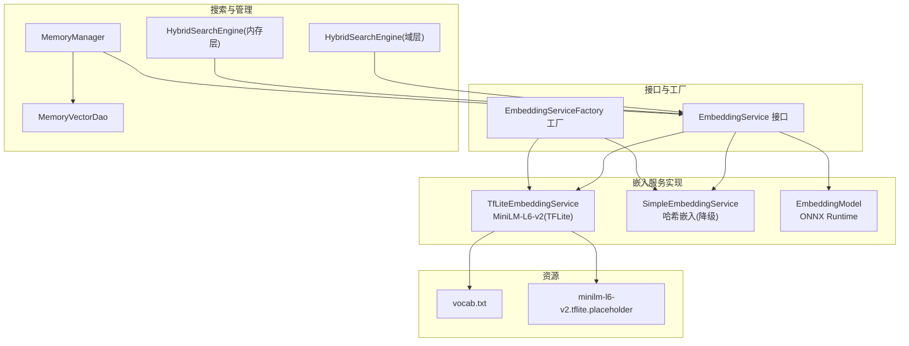
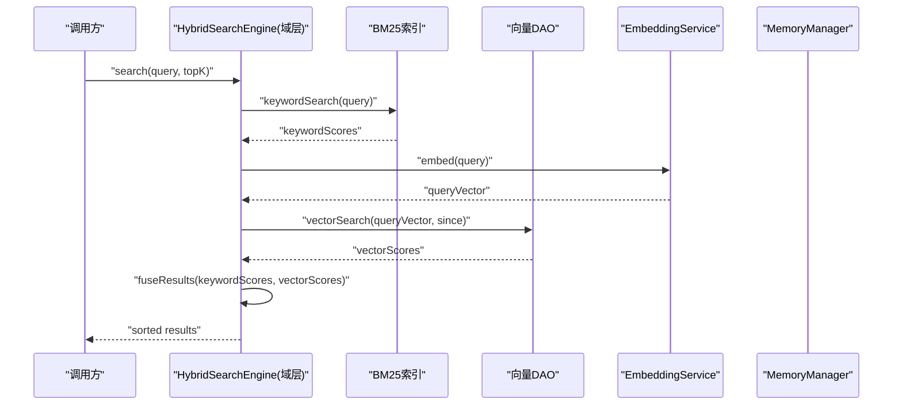
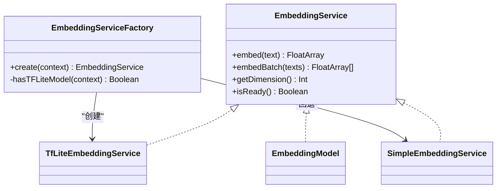
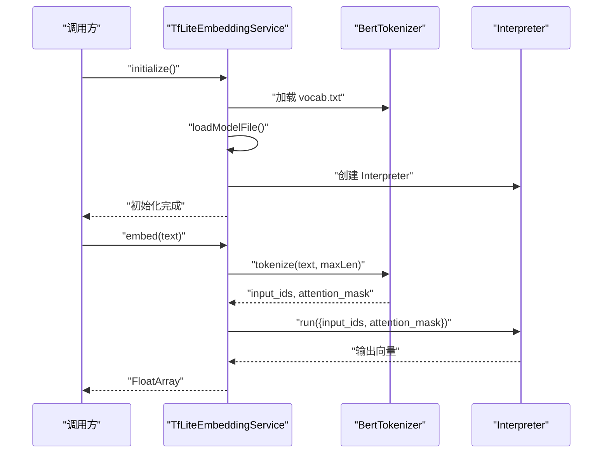
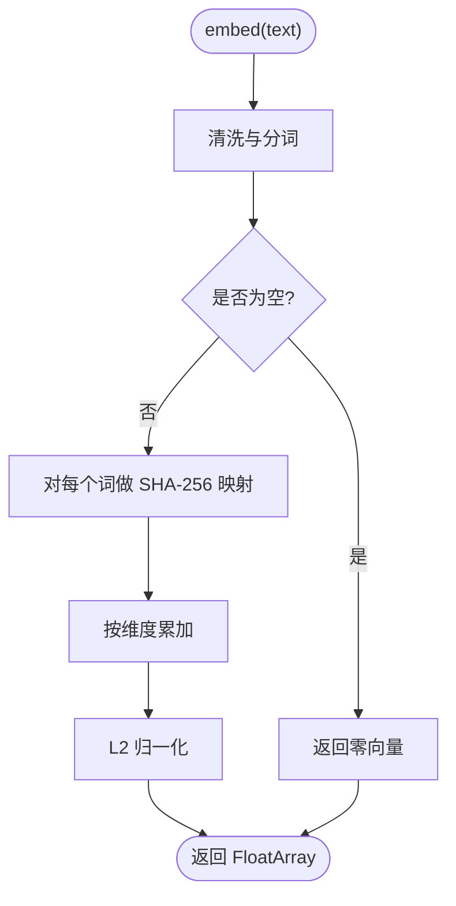
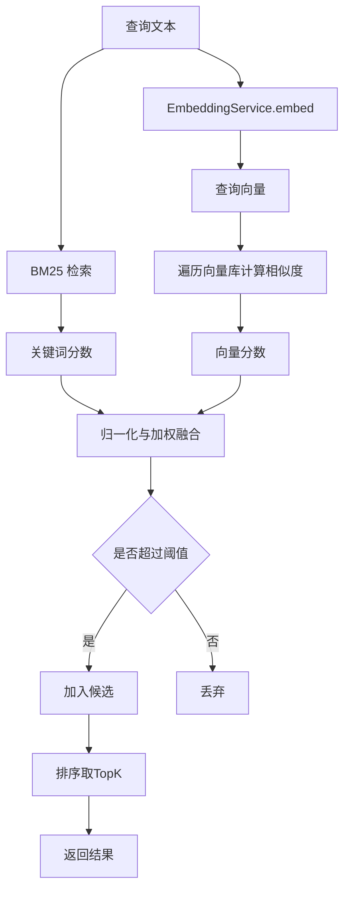
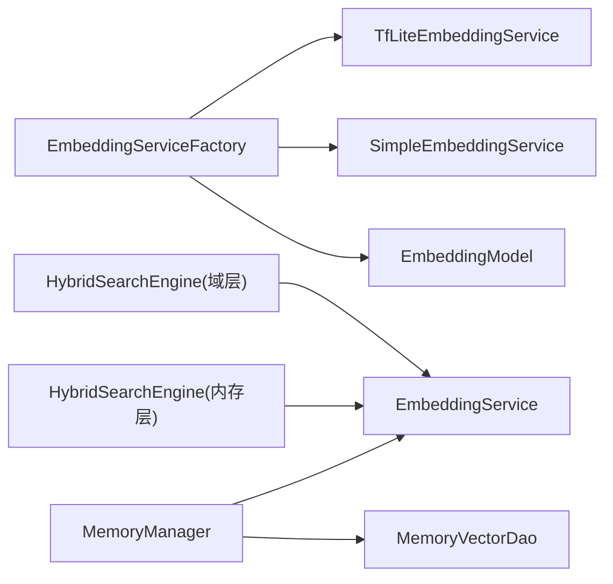

# 机器学习

<cite>
**本文引用的文件**
- [EmbeddingService.kt](file://app/src/main/java/ai/openclaw/android/domain/memory/EmbeddingService.kt)
- [EmbeddingServiceFactory.kt](file://app/src/main/java/ai/openclaw/android/ml/EmbeddingServiceFactory.kt)
- [TfLiteEmbeddingService.kt](file://app/src/main/java/ai/openclaw/android/ml/TfLiteEmbeddingService.kt)
- [SimpleEmbeddingService.kt](file://app/src/main/java/ai/openclaw/android/ml/SimpleEmbeddingService.kt)
- [EmbeddingModel.kt](file://app/src/main/java/ai/openclaw/android/ml/EmbeddingModel.kt)
- [BertTokenizer.kt](file://app/src/main/java/ai/openclaw/android/ml/BertTokenizer.kt)
- [HybridSearchEngine.kt（域层）](file://app/src/main/java/ai/openclaw/android/domain/memory/HybridSearchEngine.kt)
- [HybridSearchEngine.kt（内存层）](file://app/src/main/java/ai/openclaw/android/memory/HybridSearchEngine.kt)
- [MemoryManager.kt](file://app/src/main/java/ai/openclaw/android/domain/memory/MemoryManager.kt)
- [MemoryVectorDao.kt](file://app/src/main/java/ai/openclaw/android/data/local/MemoryVectorDao.kt)
- [minilm-l6-v2.tflite.placeholder](file://app/src/main/assets/minilm-l6-v2.tflite.placeholder)
- [vocab.txt](file://app/src/main/assets/vocab.txt)
- [models/README.md](file://app/src/main/assets/models/README.md)
- [SimpleEmbeddingServiceTest.kt](file://app/src/test/java/ai/openclaw/android/ml/SimpleEmbeddingServiceTest.kt)
</cite>

## 目录
1. [简介](#简介)
2. [项目结构](#项目结构)
3. [核心组件](#核心组件)
4. [架构总览](#架构总览)
5. [组件详解](#组件详解)
6. [依赖关系分析](#依赖关系分析)
7. [性能与资源优化](#性能与资源优化)
8. [故障排查指南](#故障排查指南)
9. [结论](#结论)
10. [附录](#附录)

## 简介
本技术文档聚焦于应用中的机器学习模块，系统性阐述嵌入向量服务的设计与实现，涵盖：
- MiniLM 模型的 TensorFlow Lite 集成与词汇表适配
- 嵌入服务的工厂模式与模型选择策略
- 向量相似度计算与语义搜索的融合算法
- 性能优化与资源管理策略
- 模型训练、部署与监控建议
- 使用示例、调优指导与扩展定制能力

## 项目结构
机器学习相关代码主要分布在以下位置：
- 接口与工厂：domain/memory 与 ml 包
- 服务实现：ml 包内包含 TfLite、Simple、EmbeddingModel 三种实现
- 搜索引擎：domain/memory 与 memory 两个层级的混合检索
- 数据访问：data/local 的向量存储 DAO
- 资源文件：assets 下的模型占位与词汇表

图表来源
- [EmbeddingService.kt:1-8](file://app/src/main/java/ai/openclaw/android/domain/memory/EmbeddingService.kt#L1-L8)
- [EmbeddingServiceFactory.kt:1-45](file://app/src/main/java/ai/openclaw/android/ml/EmbeddingServiceFactory.kt#L1-L45)
- [TfLiteEmbeddingService.kt:1-97](file://app/src/main/java/ai/openclaw/android/ml/TfLiteEmbeddingService.kt#L1-L97)
- [SimpleEmbeddingService.kt:1-107](file://app/src/main/java/ai/openclaw/android/ml/SimpleEmbeddingService.kt#L1-L107)
- [EmbeddingModel.kt:1-134](file://app/src/main/java/ai/openclaw/android/ml/EmbeddingModel.kt#L1-L134)
- [HybridSearchEngine.kt（域层）:1-227](file://app/src/main/java/ai/openclaw/android/domain/memory/HybridSearchEngine.kt#L1-L227)
- [HybridSearchEngine.kt（内存层）:1-143](file://app/src/main/java/ai/openclaw/android/memory/HybridSearchEngine.kt#L1-L143)
- [MemoryManager.kt:1-116](file://app/src/main/java/ai/openclaw/android/domain/memory/MemoryManager.kt#L1-L116)
- [MemoryVectorDao.kt:1-26](file://app/src/main/java/ai/openclaw/android/data/local/MemoryVectorDao.kt#L1-L26)
- [minilm-l6-v2.tflite.placeholder:1-47](file://app/src/main/assets/minilm-l6-v2.tflite.placeholder#L1-L47)
- [vocab.txt:1-800](file://app/src/main/assets/vocab.txt#L1-L800)

章节来源
- [EmbeddingService.kt:1-8](file://app/src/main/java/ai/openclaw/android/domain/memory/EmbeddingService.kt#L1-L8)
- [EmbeddingServiceFactory.kt:1-45](file://app/src/main/java/ai/openclaw/android/ml/EmbeddingServiceFactory.kt#L1-L45)
- [TfLiteEmbeddingService.kt:1-97](file://app/src/main/java/ai/openclaw/android/ml/TfLiteEmbeddingService.kt#L1-L97)
- [SimpleEmbeddingService.kt:1-107](file://app/src/main/java/ai/openclaw/android/ml/SimpleEmbeddingService.kt#L1-L107)
- [EmbeddingModel.kt:1-134](file://app/src/main/java/ai/openclaw/android/ml/EmbeddingModel.kt#L1-L134)
- [HybridSearchEngine.kt（域层）:1-227](file://app/src/main/java/ai/openclaw/android/domain/memory/HybridSearchEngine.kt#L1-L227)
- [HybridSearchEngine.kt（内存层）:1-143](file://app/src/main/java/ai/openclaw/android/memory/HybridSearchEngine.kt#L1-L143)
- [MemoryManager.kt:1-116](file://app/src/main/java/ai/openclaw/android/domain/memory/MemoryManager.kt#L1-L116)
- [MemoryVectorDao.kt:1-26](file://app/src/main/java/ai/openclaw/android/data/local/MemoryVectorDao.kt#L1-L26)
- [minilm-l6-v2.tflite.placeholder:1-47](file://app/src/main/assets/minilm-l6-v2.tflite.placeholder#L1-L47)
- [vocab.txt:1-800](file://app/src/main/assets/vocab.txt#L1-L800)

## 核心组件
- 嵌入服务接口：统一 embed/embedBatch/getDimension/isReady 等能力
- 工厂类：根据资源是否存在选择 TfLite 或 Simple 实现
- TfLite 实现：加载 MiniLM-L6-v2 模型与词汇表，执行推理
- Simple 实现：基于哈希的轻量降级方案
- ONNX 实现：可选的高性能替代（通过 ORT）
- 混合搜索：结合 BM25 关键词与向量相似度，并引入时间衰减
- 内存管理：统一生成、存储、检索与清理流程

章节来源
- [EmbeddingService.kt:1-8](file://app/src/main/java/ai/openclaw/android/domain/memory/EmbeddingService.kt#L1-L8)
- [EmbeddingServiceFactory.kt:1-45](file://app/src/main/java/ai/openclaw/android/ml/EmbeddingServiceFactory.kt#L1-L45)
- [TfLiteEmbeddingService.kt:1-97](file://app/src/main/java/ai/openclaw/android/ml/TfLiteEmbeddingService.kt#L1-L97)
- [SimpleEmbeddingService.kt:1-107](file://app/src/main/java/ai/openclaw/android/ml/SimpleEmbeddingService.kt#L1-L107)
- [EmbeddingModel.kt:1-134](file://app/src/main/java/ai/openclaw/android/ml/EmbeddingModel.kt#L1-L134)
- [HybridSearchEngine.kt（域层）:1-227](file://app/src/main/java/ai/openclaw/android/domain/memory/HybridSearchEngine.kt#L1-L227)
- [MemoryManager.kt:1-116](file://app/src/main/java/ai/openclaw/android/domain/memory/MemoryManager.kt#L1-L116)

## 架构总览
下图展示从“查询”到“返回结果”的端到端流程，包括嵌入生成、向量检索、关键词匹配与融合排序。

图表来源
- [HybridSearchEngine.kt（域层）:172-185](file://app/src/main/java/ai/openclaw/android/domain/memory/HybridSearchEngine.kt#L172-L185)
- [MemoryManager.kt:38-61](file://app/src/main/java/ai/openclaw/android/domain/memory/MemoryManager.kt#L38-L61)
- [MemoryVectorDao.kt:17-24](file://app/src/main/java/ai/openclaw/android/data/local/MemoryVectorDao.kt#L17-L24)

## 组件详解

### 嵌入服务接口与工厂
- 接口职责：定义统一的嵌入生成能力与维度查询
- 工厂策略：
  - 若资产中存在 MiniLM-TFLite 模型，则优先创建 TfLite 实例
  - 否则回退到 Simple 实现，保证功能可用性
- 设计优势：对上层透明切换，便于灰度与降级

图表来源
- [EmbeddingService.kt:1-8](file://app/src/main/java/ai/openclaw/android/domain/memory/EmbeddingService.kt#L1-L8)
- [EmbeddingServiceFactory.kt:1-45](file://app/src/main/java/ai/openclaw/android/ml/EmbeddingServiceFactory.kt#L1-L45)
- [TfLiteEmbeddingService.kt:13-25](file://app/src/main/java/ai/openclaw/android/ml/TfLiteEmbeddingService.kt#L13-L25)
- [SimpleEmbeddingService.kt:19-26](file://app/src/main/java/ai/openclaw/android/ml/SimpleEmbeddingService.kt#L19-L26)
- [EmbeddingModel.kt:20-23](file://app/src/main/java/ai/openclaw/android/ml/EmbeddingModel.kt#L20-L23)

章节来源
- [EmbeddingService.kt:1-8](file://app/src/main/java/ai/openclaw/android/domain/memory/EmbeddingService.kt#L1-L8)
- [EmbeddingServiceFactory.kt:1-45](file://app/src/main/java/ai/openclaw/android/ml/EmbeddingServiceFactory.kt#L1-L45)

### TfLite 嵌入服务（MiniLM 集成）
- 初始化流程：读取 vocab.txt 构建分词表；从 assets 加载 minilm-l6-v2.tflite 并创建 Interpreter
- 推理流程：文本经简化分词器编码，构造 input_ids 与 attention_mask，喂入模型得到 384 维向量
- 资源管理：提供 release 释放 Interpreter 与分词器
- 备注：当前分词器为简化实现，实际应采用 WordPiece；占位文件提示模型放置与转换步骤

图表来源
- [TfLiteEmbeddingService.kt:27-69](file://app/src/main/java/ai/openclaw/android/ml/TfLiteEmbeddingService.kt#L27-L69)
- [BertTokenizer.kt:21-43](file://app/src/main/java/ai/openclaw/android/ml/BertTokenizer.kt#L21-L43)
- [minilm-l6-v2.tflite.placeholder:1-47](file://app/src/main/assets/minilm-l6-v2.tflite.placeholder#L1-L47)
- [vocab.txt:1-800](file://app/src/main/assets/vocab.txt#L1-L800)

章节来源
- [TfLiteEmbeddingService.kt:1-97](file://app/src/main/java/ai/openclaw/android/ml/TfLiteEmbeddingService.kt#L1-L97)
- [BertTokenizer.kt:1-44](file://app/src/main/java/ai/openclaw/android/ml/BertTokenizer.kt#L1-L44)
- [minilm-l6-v2.tflite.placeholder:1-47](file://app/src/main/assets/minilm-l6-v2.tflite.placeholder#L1-L47)
- [vocab.txt:1-800](file://app/src/main/assets/vocab.txt#L1-L800)

### Simple 嵌入服务（降级方案）
- 特点：无外部模型依赖，基于 SHA-256 对单词进行哈希映射，生成固定维度向量并归一化
- 适用场景：设备不携带模型或初始化失败时的降级路径
- 单元测试覆盖：维度一致性、归一化、批处理、空文本等

图表来源
- [SimpleEmbeddingService.kt:43-78](file://app/src/main/java/ai/openclaw/android/ml/SimpleEmbeddingService.kt#L43-L78)
- [SimpleEmbeddingServiceTest.kt:17-55](file://app/src/test/java/ai/openclaw/android/ml/SimpleEmbeddingServiceTest.kt#L17-L55)

章节来源
- [SimpleEmbeddingService.kt:1-107](file://app/src/main/java/ai/openclaw/android/ml/SimpleEmbeddingService.kt#L1-L107)
- [SimpleEmbeddingServiceTest.kt:1-113](file://app/src/test/java/ai/openclaw/android/ml/SimpleEmbeddingServiceTest.kt#L1-L113)

### ONNX 嵌入模型（可选实现）
- 特点：支持从外部存储或 assets 加载 ONNX 模型，使用 ORT 运行时进行推理
- 优化：SessionOptions 设置为 ALL_OPT，内置 LRU 缓存加速重复查询
- 降级：未找到模型时返回 false，不影响整体流程

章节来源
- [EmbeddingModel.kt:1-134](file://app/src/main/java/ai/openclaw/android/ml/EmbeddingModel.kt#L1-L134)
- [models/README.md:1-26](file://app/src/main/assets/models/README.md#L1-L26)

### 向量相似度与语义搜索
- 相似度：余弦相似度，MemoryManager 提供通用实现
- 混合搜索（域层）：
  - 关键词：BM25 索引检索
  - 向量：对候选集计算余弦相似度
  - 时间衰减：指数衰减函数，考虑最近访问时间
  - 融合：加权求和（关键词权重、向量权重、时间权重），并设置最小阈值过滤
- 并发：异步并行执行关键词与向量两条路径，提升延迟表现

图表来源
- [HybridSearchEngine.kt（域层）:82-135](file://app/src/main/java/ai/openclaw/android/domain/memory/HybridSearchEngine.kt#L82-L135)
- [MemoryManager.kt:101-114](file://app/src/main/java/ai/openclaw/android/domain/memory/MemoryManager.kt#L101-L114)
- [MemoryVectorDao.kt:17-24](file://app/src/main/java/ai/openclaw/android/data/local/MemoryVectorDao.kt#L17-L24)

章节来源
- [HybridSearchEngine.kt（域层）:1-227](file://app/src/main/java/ai/openclaw/android/domain/memory/HybridSearchEngine.kt#L1-L227)
- [MemoryManager.kt:1-116](file://app/src/main/java/ai/openclaw/android/domain/memory/MemoryManager.kt#L1-L116)
- [MemoryVectorDao.kt:1-26](file://app/src/main/java/ai/openclaw/android/data/local/MemoryVectorDao.kt#L1-L26)

### 内存管理与持久化
- 存储：生成向量后写入 memory_vectors 表，同时记录更新时间
- 查询：按阈值筛选并排序，支持手动添加与批量提取
- 清理：基于时间与访问次数的淘汰策略，避免无限增长

章节来源
- [MemoryManager.kt:16-95](file://app/src/main/java/ai/openclaw/android/domain/memory/MemoryManager.kt#L16-L95)
- [MemoryVectorDao.kt:1-26](file://app/src/main/java/ai/openclaw/android/data/local/MemoryVectorDao.kt#L1-L26)

## 依赖关系分析
- 低耦合高内聚：EmbeddingService 抽象隔离具体实现；工厂负责选择策略
- 可替换性：TfLite/ONNX/Simple 三者均可注入到上层组件
- 搜索链路：HybridSearchEngine 依赖 EmbeddingService 与 BM25/向量库，形成闭环

图表来源
- [EmbeddingServiceFactory.kt:21-32](file://app/src/main/java/ai/openclaw/android/ml/EmbeddingServiceFactory.kt#L21-L32)
- [HybridSearchEngine.kt（域层）:18-23](file://app/src/main/java/ai/openclaw/android/domain/memory/HybridSearchEngine.kt#L18-L23)
- [HybridSearchEngine.kt（内存层）:24-29](file://app/src/main/java/ai/openclaw/android/memory/HybridSearchEngine.kt#L24-L29)
- [MemoryManager.kt:10-15](file://app/src/main/java/ai/openclaw/android/domain/memory/MemoryManager.kt#L10-L15)

章节来源
- [EmbeddingServiceFactory.kt:1-45](file://app/src/main/java/ai/openclaw/android/ml/EmbeddingServiceFactory.kt#L1-L45)
- [HybridSearchEngine.kt（域层）:1-227](file://app/src/main/java/ai/openclaw/android/domain/memory/HybridSearchEngine.kt#L1-L227)
- [HybridSearchEngine.kt（内存层）:1-143](file://app/src/main/java/ai/openclaw/android/memory/HybridSearchEngine.kt#L1-L143)
- [MemoryManager.kt:1-116](file://app/src/main/java/ai/openclaw/android/domain/memory/MemoryManager.kt#L1-L116)

## 性能与资源优化
- 推理优化
  - TfLite：在 Interpreter 选项中启用量化与内核优化；合理设置最大序列长度与维度
  - ONNX：SessionOptions 设置为 ALL_OPT；缓存热点查询结果
- 计算优化
  - 余弦相似度：先归一化再点积，减少开销；批量计算时尽量复用中间向量
  - 向量库扫描：限制时间窗口与候选数量，避免全量遍历
- 资源管理
  - 初始化与释放：确保 release 关闭 Interpreter/Session，避免内存泄漏
  - 缓存策略：向量搜索结果 TTL 控制，定期清理过期条目
- 并发与延迟
  - 异步并行：关键词与向量两条路径并发执行，缩短首包时间
  - 热点命中：Simple 嵌入作为兜底，保证可用性

[本节为通用性能讨论，无需列出章节来源]

## 故障排查指南
- 模型未加载
  - 现象：initialize 返回 false 或抛出异常
  - 排查：确认 assets 中存在 minilm-l6-v2.tflite 与 vocab.txt；检查工厂 hasTFLiteModel 判断逻辑
- 推理失败
  - 现象：embed 抛出未初始化异常或返回异常向量
  - 排查：确认 isReady 返回 true；检查输入 ids/attention_mask 维度与范围
- 相似度异常
  - 现象：cosineSimilarity 返回 NaN/Inf 或极小
  - 排查：检查向量是否归一化；确认维度一致；避免零向量参与计算
- 搜索结果为空
  - 现象：融合后无候选或低于阈值
  - 排查：降低阈值或扩大时间窗口；检查 BM25 索引是否重建

章节来源
- [TfLiteEmbeddingService.kt:27-48](file://app/src/main/java/ai/openclaw/android/ml/TfLiteEmbeddingService.kt#L27-L48)
- [EmbeddingServiceFactory.kt:37-44](file://app/src/main/java/ai/openclaw/android/ml/EmbeddingServiceFactory.kt#L37-L44)
- [MemoryManager.kt:101-114](file://app/src/main/java/ai/openclaw/android/domain/memory/MemoryManager.kt#L101-L114)
- [HybridSearchEngine.kt（域层）:172-185](file://app/src/main/java/ai/openclaw/android/domain/memory/HybridSearchEngine.kt#L172-L185)

## 结论
该机器学习模块以接口抽象为核心，通过工厂模式实现模型选择与降级，结合 TfLite/ONNX/Simple 多实现策略，兼顾性能与可用性。混合搜索融合关键词与语义相似度，并引入时间衰减，形成稳健的召回与重排链路。配合缓存、并发与资源管理策略，可在移动端实现高效稳定的语义检索能力。

[本节为总结性内容，无需列出章节来源]

## 附录

### 使用示例与调优建议
- 基本用法
  - 通过工厂创建嵌入服务实例，调用 embed 获取向量
  - 将向量与对应记忆实体写入向量库
  - 使用 HybridSearchEngine 执行混合检索
- 调优要点
  - 模型侧：优先使用 MiniLM-TFLite；若资源受限可启用 Simple 降级
  - 搜索侧：根据业务调整关键词/向量/时间权重与最小阈值；扩大 TopK 以提升召回
  - 性能侧：开启 ORT ALL_OPT；启用向量搜索缓存；并发执行双路径

[本节为通用指导，无需列出章节来源]

### 训练、部署与监控
- 训练
  - 使用句子级标注数据训练 MiniLM 变体；导出为 TFLite/ONNX 格式
- 部署
  - 将模型与 vocab 放置到 assets；提供 placeholder 文档指引
- 监控
  - 记录初始化成功率、推理耗时、缓存命中率与搜索命中分布

章节来源
- [minilm-l6-v2.tflite.placeholder:1-47](file://app/src/main/assets/minilm-l6-v2.tflite.placeholder#L1-L47)
- [models/README.md:1-26](file://app/src/main/assets/models/README.md#L1-L26)