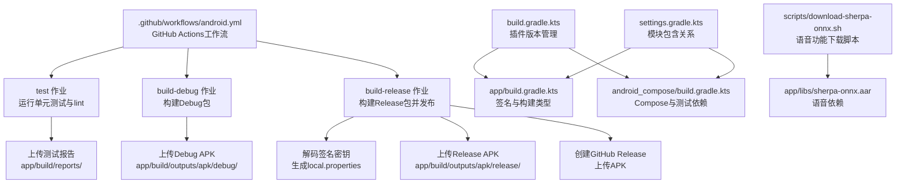
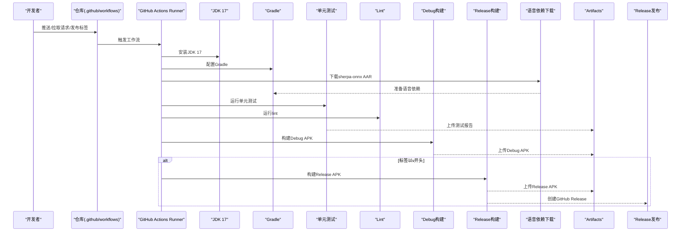
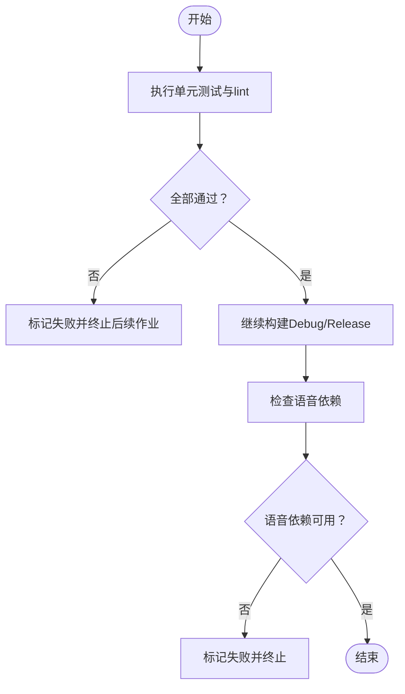
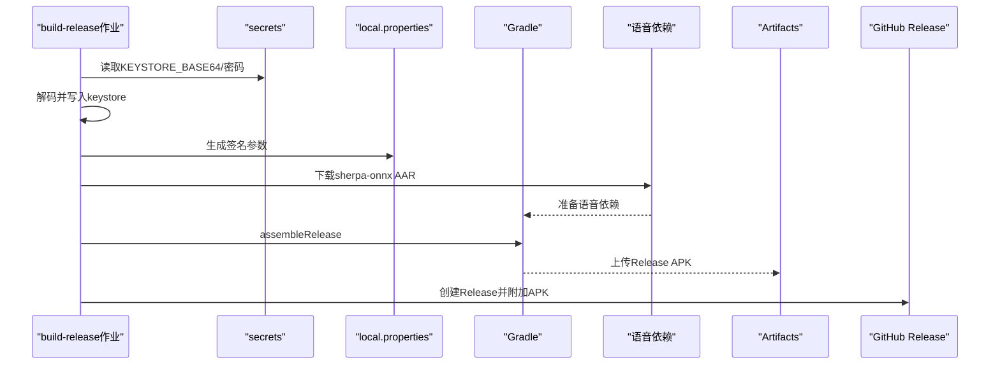
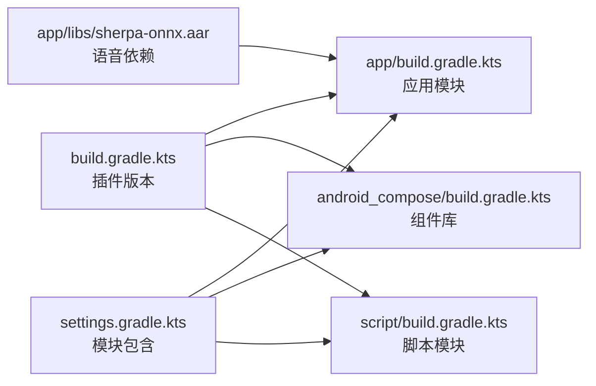

# CI/CD流水线

<cite>
**本文档引用的文件**
- [.github/workflows/android.yml](file://.github/workflows/android.yml)
- [build.gradle.kts](file://build.gradle.kts)
- [app/build.gradle.kts](file://app/build.gradle.kts)
- [android_compose/build.gradle.kts](file://android_compose/build.gradle.kts)
- [settings.gradle.kts](file://settings.gradle.kts)
- [gradle.properties](file://gradle.properties)
- [gradle/wrapper/gradle-wrapper.properties](file://gradle/wrapper/gradle-wrapper.properties)
- [scripts/e2e-test.sh](file://scripts/e2e-test.sh)
- [scripts/download-sherpa-onnx.sh](file://scripts/download-sherpa-onnx.sh)
- [README.md](file://README.md)
- [SHERPA_INTEGRATION.md](file://SHERPA_INTEGRATION.md)
- [app/src/androidTest/java/ai/openclaw/android/ChatScreenTest.kt](file://app/src/androidTest/java/ai/openclaw/android/ChatScreenTest.kt)
- [app/src/androidTest/java/ai/openclaw/android/agent/AgentSessionTest.kt](file://app/src/androidTest/java/ai/openclaw/android/agent/AgentSessionTest.kt)
- [app/src/test/java/ai/openclaw/android/ActionCallbackTest.kt](file://app/src/test/java/ai/openclaw/android/ActionCallbackTest.kt)
- [app/src/androidTest/java/ai/openclaw/android/TestUtils.kt](file://app/src/androidTest/java/ai/openclaw/android/TestUtils.kt)
</cite>

## 更新摘要
**变更内容**
- 在CI/CD流水线中新增sherpa-onnx AAR下载步骤，确保在test、build-debug、build-release三个作业中都包含完整的依赖下载配置
- 更新了语音功能集成的构建要求和依赖管理
- 增强了构建过程的可靠性和一致性，特别是在语音识别和语音合成功能方面

## 目录
1. [简介](#简介)
2. [项目结构](#项目结构)
3. [核心组件](#核心组件)
4. [架构总览](#架构总览)
5. [详细组件分析](#详细组件分析)
6. [依赖关系分析](#依赖关系分析)
7. [性能考虑](#性能考虑)
8. [故障排除指南](#故障排除指南)
9. [结论](#结论)
10. [附录](#附录)

## 简介
本文件面向CI/CD流水线的技术实现与运维实践，围绕GitHub Actions工作流、自动化构建与测试、质量门禁、自动化部署与发布、构建缓存与并行优化、环境变量与密钥安全、端到端测试与报告、监控与故障排除以及扩展与定制化等方面进行系统化说明。特别关注语音功能集成（sherpa-onnx）对CI/CD流程的影响和优化。

## 项目结构
该项目采用多模块Gradle工程组织，包含应用模块、Compose组件库与脚本模块，并通过GitHub Actions在Ubuntu Runner上完成全量构建与测试。关键目录与文件如下：
- GitHub Actions工作流：.github/workflows/android.yml
- Gradle根配置：build.gradle.kts、settings.gradle.kts、gradle.properties、gradle/wrapper/gradle-wrapper.properties
- 应用模块：app/build.gradle.kts（含签名配置、构建类型、依赖）
- 组件库：android_compose/build.gradle.kts（Compose支持、测试依赖）
- 端到端测试脚本：scripts/e2e-test.sh
- 语音功能脚本：scripts/download-sherpa-onnx.sh
- 项目说明：README.md
- 语音集成文档：SHERPA_INTEGRATION.md

**图表来源**
- [.github/workflows/android.yml:11-145](file://.github/workflows/android.yml#L11-L145)
- [build.gradle.kts:1-9](file://build.gradle.kts#L1-L9)
- [app/build.gradle.kts:11-217](file://app/build.gradle.kts#L11-L217)
- [android_compose/build.gradle.kts:1-84](file://android_compose/build.gradle.kts#L1-L84)
- [settings.gradle.kts:21-26](file://settings.gradle.kts#L21-L26)
- [scripts/download-sherpa-onnx.sh:1-63](file://scripts/download-sherpa-onnx.sh#L1-L63)

**章节来源**
- [.github/workflows/android.yml:1-145](file://.github/workflows/android.yml#L1-L145)
- [build.gradle.kts:1-9](file://build.gradle.kts#L1-L9)
- [app/build.gradle.kts:1-217](file://app/build.gradle.kts#L1-L217)
- [android_compose/build.gradle.kts:1-84](file://android_compose/build.gradle.kts#L1-L84)
- [settings.gradle.kts:1-26](file://settings.gradle.kts#L1-L26)
- [gradle.properties:1-11](file://gradle.properties#L1-L11)
- [gradle/wrapper/gradle-wrapper.properties:1-5](file://gradle/wrapper/gradle-wrapper.properties#L1-L5)
- [scripts/download-sherpa-onnx.sh:1-63](file://scripts/download-sherpa-onnx.sh#L1-L63)

## 核心组件
- GitHub Actions工作流：定义触发条件、作业依赖与步骤，覆盖测试、Debug构建、Release构建与发布，现已包含sherpa-onnx AAR下载步骤。
- Gradle配置：统一插件版本、并行与缓存配置；应用模块负责签名与构建类型，包含sherpa-onnx语音依赖。
- 端到端测试脚本：在本地设备或模拟器上安装APK、启动应用、检查可访问性与截图输出。
- 测试套件：单元测试与UI测试，覆盖业务逻辑、会话流式处理、Compose UI交互等。
- 语音功能集成：通过scripts/download-sherpa-onnx.sh脚本管理sherpa-onnx AAR依赖。

**章节来源**
- [.github/workflows/android.yml:11-145](file://.github/workflows/android.yml#L11-L145)
- [app/build.gradle.kts:11-217](file://app/build.gradle.kts#L11-L217)
- [android_compose/build.gradle.kts:41-76](file://android_compose/build.gradle.kts#L41-L76)
- [scripts/e2e-test.sh:1-108](file://scripts/e2e-test.sh#L1-L108)
- [scripts/download-sherpa-onnx.sh:1-63](file://scripts/download-sherpa-onnx.sh#L1-L63)

## 架构总览
下图展示CI/CD流水线从代码提交到产物发布的整体流程，包括质量门禁与发布策略，现已集成语音功能依赖管理。

**图表来源**
- [.github/workflows/android.yml:3-145](file://.github/workflows/android.yml#L3-L145)

## 详细组件分析

### GitHub Actions工作流
- 触发条件：master/main分支推送、PR、release创建。
- 作业编排：
  - test：在ubuntu-latest上运行单元测试与lint，并上传测试报告。**新增**：包含sherpa-onnx AAR下载步骤。
  - build-debug：依赖test完成后构建Debug APK并上传。**新增**：包含sherpa-onnx AAR下载步骤。
  - build-release：依赖test且ref以v开头时构建Release APK，解码密钥、生成local.properties，构建后上传并创建GitHub Release。**新增**：包含sherpa-onnx AAR下载步骤。
- 关键点：
  - 使用actions/checkout、actions/setup-java、gradle/actions/setup-gradle。
  - 通过secrets访问密钥，避免明文存储。
  - 通过artifacts上传构建产物，便于后续审计与分发。
  - **新增**：每个作业都包含相同的sherpa-onnx AAR下载配置，确保构建一致性。

**章节来源**
- [.github/workflows/android.yml:3-145](file://.github/workflows/android.yml#L3-L145)

### Gradle配置与构建优化
- 插件版本集中管理：根build.gradle.kts统一声明Android、Kotlin、KSP、Compose等插件版本。
- 并行与缓存：gradle.properties启用并行、缓存与配置缓存，显著提升构建速度。
- 应用模块签名与构建类型：
  - 支持从local.properties或环境变量读取签名参数。
  - debug使用统一调试签名，release启用混淆与资源收缩。
  - NDK ABI过滤为arm64-v8a，减少包体与构建时间。
  - **新增**：添加sherpa-onnx AAR依赖，支持本地语音识别和语音合成功能。
- 组件库模块：启用Compose与测试依赖，便于UI与数据层测试。

**章节来源**
- [build.gradle.kts:1-9](file://build.gradle.kts#L1-L9)
- [gradle.properties:8-11](file://gradle.properties#L8-L11)
- [app/build.gradle.kts:11-217](file://app/build.gradle.kts#L11-L217)
- [android_compose/build.gradle.kts:1-39](file://android_compose/build.gradle.kts#L1-L39)

### 测试策略与质量门禁
- 单元测试：app模块与android_compose模块均包含单元测试，覆盖数据处理、渲染、主题、网络传输、验证器等。
- UI测试：使用Compose测试规则验证消息列表、输入框、发送按钮等交互行为。
- 仪器化测试：AgentSession流式处理测试，验证工具调用、历史维护、错误传播等场景。
- 质量门禁：lint与单元测试在test作业中执行，任何失败都会阻断后续构建；测试报告上传便于问题定位。
- **新增**：语音功能测试，包括sherpa-onnx引擎初始化、模型加载和语音处理功能验证。

**图表来源**
- [.github/workflows/android.yml:32-36](file://.github/workflows/android.yml#L32-L36)

**章节来源**
- [app/src/androidTest/java/ai/openclaw/android/ChatScreenTest.kt:1-125](file://app/src/androidTest/java/ai/openclaw/android/ChatScreenTest.kt#L1-L125)
- [app/src/androidTest/java/ai/openclaw/android/agent/AgentSessionTest.kt:1-282](file://app/src/androidTest/java/ai/openclaw/android/agent/AgentSessionTest.kt#L1-L282)
- [app/src/test/java/ai/openclaw/android/ActionCallbackTest.kt:1-140](file://app/src/test/java/ai/openclaw/android/ActionCallbackTest.kt#L1-L140)
- [android_compose/build.gradle.kts:65-76](file://android_compose/build.gradle.kts#L65-L76)

### 自动化部署与发布管理
- Release构建条件：仅当ref为版本标签（以v开头）时触发。
- 密钥管理：通过secrets解码base64密钥，生成local.properties注入签名参数。
- 产物上传：Debug与Release APK分别上传为artifact。
- 发布：使用softprops/action-gh-release自动创建Release并附加APK。
- **新增**：语音功能集成，确保发布版本包含完整的语音依赖。

**图表来源**
- [.github/workflows/android.yml:79-145](file://.github/workflows/android.yml#L79-L145)

**章节来源**
- [.github/workflows/android.yml:79-145](file://.github/workflows/android.yml#L79-L145)

### 端到端测试自动化与结果报告
- 本地脚本：scripts/e2e-test.sh在WSL/Windows环境下连接ADB，安装Debug APK、启动应用、检查可访问性、截图并输出结果摘要。
- 手动检查清单：UI显示、服务启动、技能数量、电池优化状态等。
- 建议：可在CI中集成设备连接与自动化校验，结合截图与日志归档，形成可追溯的E2E报告。
- **新增**：语音功能E2E测试，验证sherpa-onnx引擎在实际设备上的运行效果。

**章节来源**
- [scripts/e2e-test.sh:1-108](file://scripts/e2e-test.sh#L1-L108)

### 环境变量管理与密钥安全
- 密钥注入：通过secrets.KEYSTORE_BASE64、RELEASE_STORE_PASSWORD、RELEASE_KEY_PASSWORD注入。
- 本地属性：在CI中动态生成local.properties，确保签名参数与SDK路径正确。
- 最佳实践：不在工作流中硬编码敏感信息，使用仓库密钥管理；对keystore进行base64编码存储。
- **新增**：语音依赖管理，通过固定版本的AAR文件确保构建一致性。

**章节来源**
- [.github/workflows/android.yml:97-114](file://.github/workflows/android.yml#L97-L114)
- [app/build.gradle.kts:11-24](file://app/build.gradle.kts#L11-L24)

### 构建缓存与并行执行优化
- Gradle并行与缓存：gradle.properties开启并行、缓存与配置缓存，降低重复构建时间。
- 任务粒度：将测试、Debug构建、Release构建拆分为独立作业，利用needs实现有序依赖，最大化并行度。
- 产物复用：通过artifacts在作业间传递APK，避免重复打包。
- **新增**：语音依赖缓存，通过固定版本的AAR文件减少网络依赖和构建时间。

**章节来源**
- [gradle.properties:8-11](file://gradle.properties#L8-L11)
- [.github/workflows/android.yml:48-78](file://.github/workflows/android.yml#L48-L78)

### 语音功能集成与依赖管理
- **新增**：Sherpa-ONNX语音引擎集成，支持本地语音识别和语音合成。
- **新增**：通过scripts/download-sherpa-onnx.sh脚本管理语音依赖，包含版本控制和完整性检查。
- **新增**：app/build.gradle.kts中添加sherpa-onnx AAR依赖，支持本地语音处理。
- **新增**：语音功能的ProGuard规则配置，确保发布版本的代码压缩和混淆不影响语音引擎。
- **新增**：语音模型下载管理器，支持断点续传和SHA256校验。

**章节来源**
- [scripts/download-sherpa-onnx.sh:1-63](file://scripts/download-sherpa-onnx.sh#L1-L63)
- [app/build.gradle.kts:126-128](file://app/build.gradle.kts#L126-L128)
- [SHERPA_INTEGRATION.md:1-173](file://SHERPA_INTEGRATION.md#L1-L173)

## 依赖关系分析
- 模块依赖：settings.gradle.kts包含app、android_compose、script三个模块；app依赖android_compose与script。
- 插件依赖：根build.gradle.kts统一声明插件版本，app与android_compose按需启用Compose/KSP等。
- 作业依赖：test作业为所有构建作业的前置条件，保证质量门禁。
- **新增**：语音依赖：app/libs/sherpa-onnx.aar作为所有构建作业的前置依赖，确保语音功能的完整性。

**图表来源**
- [build.gradle.kts:1-9](file://build.gradle.kts#L1-L9)
- [settings.gradle.kts:21-26](file://settings.gradle.kts#L21-L26)
- [app/build.gradle.kts:1-9](file://app/build.gradle.kts#L1-L9)
- [android_compose/build.gradle.kts:1-6](file://android_compose/build.gradle.kts#L1-L6)

**章节来源**
- [build.gradle.kts:1-9](file://build.gradle.kts#L1-L9)
- [settings.gradle.kts:21-26](file://settings.gradle.kts#L21-L26)
- [app/build.gradle.kts:1-9](file://app/build.gradle.kts#L1-L9)
- [android_compose/build.gradle.kts:1-6](file://android_compose/build.gradle.kts#L1-L6)

## 性能考虑
- 构建加速
  - 启用Gradle并行与配置缓存，减少重复计算。
  - 限制NDK ABI为arm64-v8a，缩小包体与构建时间。
  - Debug构建适度启用优化以减小体积，同时保持可调试性。
  - **新增**：语音依赖预下载，通过固定版本的AAR文件减少网络I/O开销。
- 作业并行
  - 将测试与构建拆分为独立作业，利用needs串行依赖，最大化并行度。
  - **新增**：语音依赖下载与主构建流程并行执行，提高整体效率。
- 产物管理
  - 通过artifacts上传APK，便于后续审计与分发，避免重复构建。
  - **新增**：语音依赖缓存，避免重复下载大型AAR文件。

**章节来源**
- [gradle.properties:8-11](file://gradle.properties#L8-L11)
- [app/build.gradle.kts:38-41](file://app/build.gradle.kts#L38-L41)
- [app/build.gradle.kts:84-90](file://app/build.gradle.kts#L84-L90)
- [.github/workflows/android.yml:48-78](file://.github/workflows/android.yml#L48-L78)

## 故障排除指南
- 工作流失败
  - 检查test作业中的单元测试与lint是否通过；查看上传的测试报告定位问题。
  - 若Release构建失败，检查secrets是否正确配置，keystore是否成功解码，local.properties是否生成。
  - **新增**：语音依赖下载失败：检查网络连接、GitHub Releases访问权限、AAR文件完整性。
- 构建异常
  - 确认JDK版本与Gradle版本匹配；核对插件版本与Android Gradle Plugin版本兼容。
  - 检查NDK ABI过滤与SDK路径配置。
  - **新增**：语音引擎初始化失败：确认AAR文件正确下载、JNI库可用、模型文件路径正确。
- 端到端测试
  - 确保ADB可用且已连接设备；检查APK路径与安装命令；关注可访问性状态与截图输出。
  - **新增**：语音功能测试失败：验证设备麦克风权限、存储权限、网络连接状态。

**章节来源**
- [.github/workflows/android.yml:32-43](file://.github/workflows/android.yml#L32-L43)
- [.github/workflows/android.yml:97-114](file://.github/workflows/android.yml#L97-L114)
- [scripts/e2e-test.sh:23-94](file://scripts/e2e-test.sh#L23-L94)

## 结论
该CI/CD流水线通过清晰的作业划分、严格的测试门禁、完善的构建与发布流程，实现了从代码提交到产物发布的自动化闭环。配合Gradle并行与缓存、精简的NDK ABI、统一的签名策略与密钥管理，整体具备良好的可维护性与扩展性。

**重要更新**：新增的sherpa-onnx语音功能集成显著增强了项目的语音处理能力，通过在所有构建作业中统一包含语音依赖下载步骤，确保了构建过程的一致性和可靠性。语音功能的集成包括本地语音识别、语音合成、模型下载管理等多个方面，为用户提供了更加丰富的交互体验。

建议在现有基础上进一步完善设备端E2E自动化与报告归档，特别是语音功能的自动化测试，以实现更全面的质量保障。

## 附录
- 术语
  - NDK ABI：原生库架构过滤，arm64-v8a为当前配置。
  - 配置缓存：Gradle特性，缓存任务配置以加速后续构建。
  - **新增**：Sherpa-ONNX：开源的语音识别和语音合成框架，支持本地部署。
  - **新增**：语音引擎：支持多种语音处理模式，包括在线识别、离线合成等。
- 参考
  - 项目说明与模块结构：README.md
  - **新增**：语音功能集成指南：SHERPA_INTEGRATION.md

**章节来源**
- [README.md:162-170](file://README.md#L162-L170)
- [SHERPA_INTEGRATION.md:1-173](file://SHERPA_INTEGRATION.md#L1-L173)