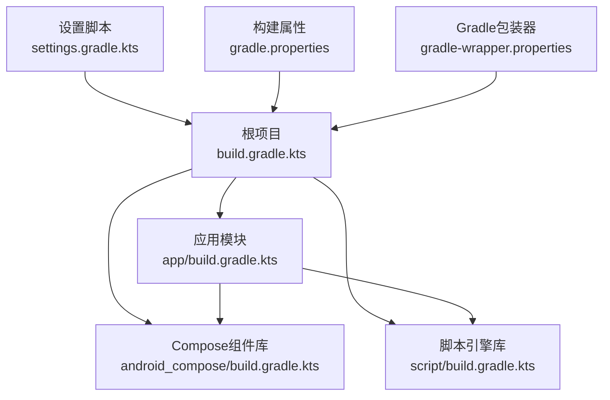
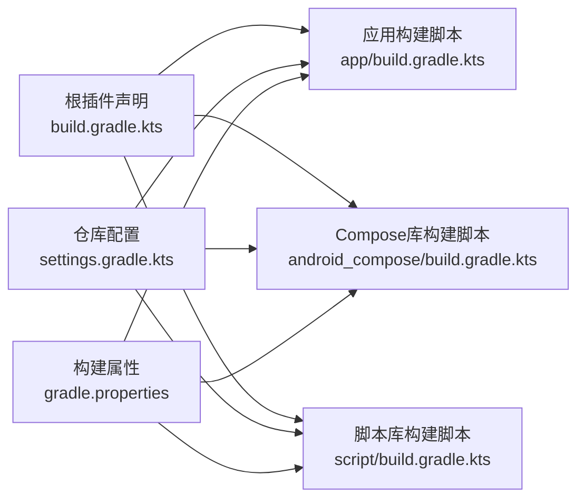
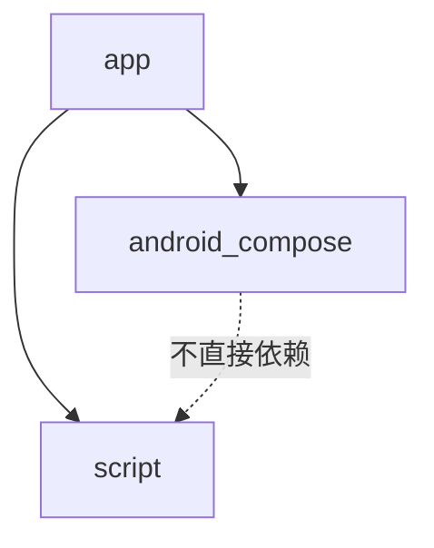

# Gradle构建配置

<cite>
**本文档引用的文件**
- [build.gradle.kts](file://build.gradle.kts)
- [settings.gradle.kts](file://settings.gradle.kts)
- [gradle.properties](file://gradle.properties)
- [gradle-wrapper.properties](file://gradle/wrapper/gradle-wrapper.properties)
- [app/build.gradle.kts](file://app/build.gradle.kts)
- [android_compose/build.gradle.kts](file://android_compose/build.gradle.kts)
- [script/build.gradle.kts](file://script/build.gradle.kts)
- [app/proguard-rules.pro](file://app/proguard-rules.pro)
</cite>

## 更新摘要
**所做变更**
- 更新仓库配置章节，反映settings.gradle.kts中官方源优先的Maven仓库配置
- 新增Kotlin 2.3.0兼容性问题临时解决方案章节，说明RememberInComposition lint检测器禁用配置
- 新增仓库配置最佳实践章节，说明官方源优先和镜像后备策略
- 更新故障排除指南中的仓库相关问题解决方案
- 增强国际化开发者的仓库配置指导

## 目录
1. [简介](#简介)
2. [项目结构](#项目结构)
3. [核心组件](#核心组件)
4. [架构总览](#架构总览)
5. [详细组件分析](#详细组件分析)
6. [依赖分析](#依赖分析)
7. [性能考虑](#性能考虑)
8. [故障排除指南](#故障排除指南)
9. [结论](#结论)
10. [附录](#附录)

## 简介
本文件系统化梳理了该Android项目的Gradle构建配置，覆盖根级构建脚本、插件版本管理、全局依赖声明、多模块结构与模块间依赖关系、各子模块差异化配置、构建属性管理策略、最佳实践与性能优化建议，并提供常见问题排查与解决方案，以及扩展新构建变体与自定义任务的方法指导。

## 项目结构
该项目采用多模块结构，包含应用模块、可复用的Compose组件库模块与脚本引擎模块。根级配置集中管理插件版本与仓库源，子模块各自声明构建类型、编译选项与依赖。

**图表来源**
- [settings.gradle.kts:23-26](file://settings.gradle.kts#L23-L26)
- [build.gradle.kts:1-9](file://build.gradle.kts#L1-L9)
- [app/build.gradle.kts:126-216](file://app/build.gradle.kts#L126-L216)
- [android_compose/build.gradle.kts:41-84](file://android_compose/build.gradle.kts#L41-L84)
- [script/build.gradle.kts:27-40](file://script/build.gradle.kts#L27-L40)

**章节来源**
- [settings.gradle.kts:1-26](file://settings.gradle.kts#L1-L26)
- [build.gradle.kts:1-9](file://build.gradle.kts#L1-L9)
- [gradle.properties:1-11](file://gradle.properties#L1-L11)
- [gradle-wrapper.properties:1-5](file://gradle/wrapper/gradle-wrapper.properties#L1-L5)

## 核心组件
- 根级构建脚本：统一声明插件版本，避免在子模块重复指定，确保版本一致性与可维护性。
- 设置脚本：集中配置仓库源与仓库模式，保证依赖解析稳定可靠。
- 构建属性：启用并行、缓存与配置缓存，提升构建性能；开启AndroidX与非传递R类等现代化开关。
- 包装器：锁定Gradle分发版本，确保团队环境一致。

**章节来源**
- [build.gradle.kts:1-9](file://build.gradle.kts#L1-L9)
- [settings.gradle.kts:1-21](file://settings.gradle.kts#L1-L21)
- [gradle.properties:1-11](file://gradle.properties#L1-L11)
- [gradle-wrapper.properties:1-5](file://gradle/wrapper/gradle-wrapper.properties#L1-L5)

## 架构总览
下图展示根级与子模块的构建关系及依赖方向：

**图表来源**
- [build.gradle.kts:2-8](file://build.gradle.kts#L2-L8)
- [settings.gradle.kts:12-20](file://settings.gradle.kts#L12-L20)
- [gradle.properties:3-10](file://gradle.properties#L3-L10)

## 详细组件分析

### 根级构建脚本（插件版本管理）
- 统一声明Android应用、Kotlin Android、Kotlin序列化、Kotlin Compose与KSP插件版本，避免子模块重复声明，降低维护成本。
- 插件apply设为false，由子模块按需显式应用，保持清晰的模块边界。

**章节来源**
- [build.gradle.kts:2-8](file://build.gradle.kts#L2-L8)

### 设置脚本（仓库与模块包含）
- **更新** 仓库配置采用官方源优先策略：google()和mavenCentral()位于前两位，确保国际开发者能够稳定访问官方依赖源。
- **更新** 阿里云镜像作为后备选择：在配置末尾保留阿里云镜像，专门服务于中国内地用户，解决maven.aliyun.com的HTTP 502错误问题。
- 使用FAIL_ON_PROJECT_REPOS策略，禁止模块内自定义仓库导致的不一致。
- 明确包含app、android_compose、script三个模块。

**章节来源**
- [settings.gradle.kts:1-21](file://settings.gradle.kts#L1-L21)
- [settings.gradle.kts:23-26](file://settings.gradle.kts#L23-L26)

### 构建属性（全局配置策略）
- JVM参数与并行/缓存/配置缓存：提升构建速度与内存利用效率。
- AndroidX与非传递R类：现代化支持与减少资源膨胀。
- 编译SDK与兼容性：suppressUnsupportedCompileSdk允许在特定场景下规避警告。

**章节来源**
- [gradle.properties:2-10](file://gradle.properties#L2-L10)

### 应用模块（app）
- 插件与签名：显式应用根插件，支持从local.properties或环境变量加载签名信息；提供统一调试签名以跨平台一致签名。
- 编译与ABI：compileSdk/targetSdk/minSdk设定；NDK ABI过滤仅保留arm64-v8a以缩小包体。
- 构建类型：release启用混淆与资源压缩；debug同样启用统一调试签名。
- 编译选项：JDK 17目标与Kotlin JVM目标一致。
- Compose与测试：启用Compose；单元测试默认返回值；打包排除部分元数据与JNI合并策略。
- **新增** Kotlin 2.3.0兼容性问题临时解决方案：在lint配置中禁用RememberInComposition检测器，解决内部API变更导致的IncompatibleClassChangeError问题。
- 依赖：Sherpa-ONNX本地AAR、AndroidX、Koin、Compose BOM、网络、序列化、协程、安全加密、SQLCipher、Room+KSP、WorkManager、LiteRT/LiteRT-LM、ONNX Runtime、Rhino、A2UI组件库、SnakeYAML；测试框架与Compose UI测试依赖齐全。

**章节来源**
- [app/build.gradle.kts:3-9](file://app/build.gradle.kts#L3-L9)
- [app/build.gradle.kts:11-24](file://app/build.gradle.kts#L11-L24)
- [app/build.gradle.kts:26-124](file://app/build.gradle.kts#L26-L124)
- [app/build.gradle.kts:96-99](file://app/build.gradle.kts#L96-L99)
- [app/build.gradle.kts:126-216](file://app/build.gradle.kts#L126-L216)

### Compose组件库模块（android_compose）
- 插件：Android库、Kotlin Android、Kotlin Compose、Kotlin序列化。
- 配置：compileSdk/minSdk、Compose启用、consumerProguard文件、测试运行器。
- 依赖：AndroidX核心、Lifecycle、Activity Compose、Compose BOM、Material、序列化、协程、OkHttp、Coil、测试依赖。

**章节来源**
- [android_compose/build.gradle.kts:1-6](file://android_compose/build.gradle.kts#L1-L6)
- [android_compose/build.gradle.kts:8-39](file://android_compose/build.gradle.kts#L8-L39)
- [android_compose/build.gradle.kts:41-84](file://android_compose/build.gradle.kts#L41-L84)

### 脚本引擎模块（script）
- 插件：Android库、Kotlin Android。
- 配置：compileSdk/minSdk、测试运行器。
- 依赖：AndroidX核心、协程、OkHttp、QuickJS-Android（正式版）、Rhino（回退）；测试依赖。

**章节来源**
- [script/build.gradle.kts:1-4](file://script/build.gradle.kts#L1-L4)
- [script/build.gradle.kts:6-25](file://script/build.gradle.kts#L6-L25)
- [script/build.gradle.kts:27-40](file://script/build.gradle.kts#L27-L40)

### ProGuard规则（app）
- 保持Kotlinx序列化注解与类成员。
- 保持TensorFlow Lite、LiteRT-LM相关类。
- 保持Kotlin 2.3.0兼容类与反射元数据。
- 保持OkHttp/Okio相关类。
- 保持Room实体与相关类。
- 保持Sherpa-ONNX相关类与native方法。
- 保持PersonalCenter ViewModel工厂与相关类。

**章节来源**
- [app/proguard-rules.pro:7-66](file://app/proguard-rules.pro#L7-L66)

## 依赖分析
- 模块依赖：app依赖android_compose与script；android_compose与script互不直接依赖。
- 版本一致性：根级统一插件版本，子模块依赖通过BOM与固定版本管理，降低冲突风险。
- 仓库策略：settings中集中仓库配置，避免模块内分散配置。

**图表来源**
- [app/build.gradle.kts:140](file://app/build.gradle.kts#L140)
- [android_compose/build.gradle.kts:188](file://app/build.gradle.kts#L188)

**章节来源**
- [app/build.gradle.kts:140](file://app/build.gradle.kts#L140)
- [android_compose/build.gradle.kts:188](file://app/build.gradle.kts#L188)

## 性能考虑
- 并行与缓存：启用并行执行、构建缓存与配置缓存，显著缩短增量构建时间。
- 依赖管理：使用BOM统一Compose版本，减少传递依赖版本漂移。
- 包体优化：NDK仅保留arm64-v8a；release启用代码与资源压缩；排除无用META-INF元数据。
- 编译目标：统一JDK 17目标，避免多版本兼容成本。

**章节来源**
- [gradle.properties:3-10](file://gradle.properties#L3-L10)
- [app/build.gradle.kts:38-41](file://app/build.gradle.kts#L38-L41)
- [app/build.gradle.kts:76-82](file://app/build.gradle.kts#L76-L82)
- [app/build.gradle.kts:111-116](file://app/build.gradle.kts#L111-L116)
- [app/build.gradle.kts:92-100](file://app/build.gradle.kts#L92-L100)

## 故障排除指南

### Kotlin 2.3.0兼容性问题

**新增** RememberInComposition lint检测器问题
- **现象** 构建过程中出现IncompatibleClassChangeError，与Kotlin 2.3.0内部API变更相关。
- **原因** Kotlin 2.3.0引入的内部API变更影响了RememberInComposition lint检测器的正常工作。
- **解决方案** 在app/build.gradle.kts的lint配置中禁用RememberInComposition检测器，作为临时解决方案确保构建稳定性。
- **临时性** 此为临时解决方案，待Kotlin团队修复相关问题后可移除此配置。

**章节来源**
- [app/build.gradle.kts:96-99](file://app/build.gradle.kts#L96-L99)

### 仓库配置问题

**更新** 国际开发者访问maven.aliyun.com时的HTTP 502错误
- **现象** 依赖下载失败，出现HTTP 502错误。
- **原因** maven.aliyun.com在中国大陆地区可能出现网络波动。
- **解决方案** settings.gradle.kts已重新配置仓库顺序，将官方源(google()和mavenCentral())置于优先位置，确保国际开发者能够稳定访问官方依赖源。
- **后备方案** 阿里云镜像作为中国内地用户的后备选择，自动在官方源不可用时生效。

**章节来源**
- [settings.gradle.kts:1-21](file://settings.gradle.kts#L1-L21)

### 签名配置缺失
- 现象：release构建失败或签名不一致。
- 排查：确认local.properties或环境变量中存在RELEASE_*相关键；检查store文件路径是否正确。
- 解决：补齐签名参数或使用统一调试签名配置。

**章节来源**
- [app/build.gradle.kts:11-24](file://app/build.gradle.kts#L11-L24)
- [app/build.gradle.kts:49-72](file://app/build.gradle.kts#L49-L72)

### ABI与NDK相关问题
- 现象：运行时崩溃或包体异常。
- 排查：确认ABI过滤是否符合设备需求；检查本地库是否随架构打包。
- 解决：根据实际设备调整abiFilters；确保本地AAR包含所需架构。

**章节来源**
- [app/build.gradle.kts:38-41](file://app/build.gradle.kts#L38-L41)
- [app/build.gradle.kts:117-122](file://app/build.gradle.kts#L117-L122)

### ProGuard规则误删
- 现象：运行时序列化失败、反射报错或模型类被混淆。
- 排查：核对proguard-rules.pro中对应keep规则。
- 解决：补充缺失的keep规则，确保关键类与序列化元数据保留。

**章节来源**
- [app/proguard-rules.pro:7-66](file://app/proguard-rules.pro#L7-L66)

### 测试无法运行或覆盖率异常
- 现象：测试任务失败或报告缺失。
- 排查：确认测试依赖与Compose UI测试BOM版本匹配；检查单元测试默认返回值设置。
- 解决：统一测试框架版本；确保Compose测试依赖与BOM一致。

**章节来源**
- [app/build.gradle.kts:104-108](file://app/build.gradle.kts#L104-L108)
- [app/build.gradle.kts:212-216](file://app/build.gradle.kts#L212-L216)

## 结论
该构建配置通过根级统一插件版本、集中仓库与属性管理、模块化依赖与严格的ProGuard规则，实现了高一致性与高性能的构建体系。最新的仓库配置优化解决了国际开发者访问maven.aliyun.com时的HTTP 502错误问题，通过官方源优先和镜像后备策略确保全球开发者的稳定依赖访问。针对Kotlin 2.3.0兼容性问题的临时解决方案（禁用RememberInComposition lint检测器）确保了构建稳定性，同时保持了项目的现代化配置。遵循本文档的最佳实践与排障建议，可进一步提升构建稳定性与效率。

## 附录

### 如何添加新的构建变体
- 在应用模块的android.buildTypes中新增变体，复制现有release/debug的配置并调整混淆、签名与资源处理策略。
- 若需自定义签名，可在signingConfigs中新增配置并在对应变体引用。
- 注意保持JDK与Kotlin目标一致，避免编译链不匹配。

**章节来源**
- [app/build.gradle.kts:74-91](file://app/build.gradle.kts#L74-L91)
- [app/build.gradle.kts:49-72](file://app/build.gradle.kts#L49-L72)

### 如何自定义构建任务
- 在模块的build.gradle.kts中使用tasks.register或tasks.create定义新任务，设置输入输出与依赖。
- 将任务挂载到现有生命周期（如assemble、verify），或创建独立任务供CI调用。
- 保持任务幂等与增量构建友好，避免不必要的全量重算。

**章节来源**
- [app/build.gradle.kts:126-216](file://app/build.gradle.kts#L126-L216)

### Kotlin 2.3.0兼容性问题临时解决方案

**新增** RememberInComposition检测器禁用配置
- **背景** Kotlin 2.3.0发布后，内部API变更导致RememberInComposition lint检测器出现IncompatibleClassChangeError。
- **解决方案** 在app/build.gradle.kts中添加`disable += "RememberInComposition"`配置，临时禁用该检测器。
- **目的** 确保构建过程不受此兼容性问题影响，维持项目稳定性。
- **状态** 临时解决方案，待Kotlin团队修复相关问题后可移除此配置。

**章节来源**
- [app/build.gradle.kts:96-99](file://app/build.gradle.kts#L96-L99)

### 仓库配置最佳实践

**新增** 官方源优先策略
- 将google()和mavenCentral()置于仓库列表前两位，确保国际开发者能够稳定访问官方依赖源。
- 这种配置解决了maven.aliyun.com在某些网络环境下可能出现的HTTP 502错误问题。

**新增** 镜像后备策略
- 在官方源之后保留阿里云镜像作为中国内地用户的后备选择。
- 阿里云镜像配置包括gradle-plugin、google、public三个仓库，覆盖不同类型的依赖需求。

**新增** 仓库优先级建议
- 优先使用官方源获取最新、最稳定的依赖版本。
- 当官方源网络不稳定时，自动回退到阿里云镜像。
- 避免在单个模块中单独配置仓库，统一在settings.gradle.kts中管理。

**章节来源**
- [settings.gradle.kts:1-21](file://settings.gradle.kts#L1-L21)