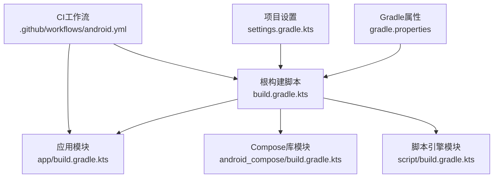
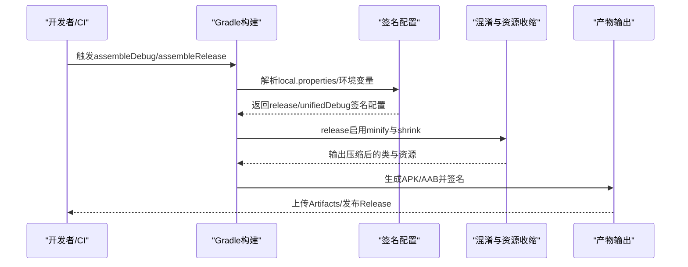
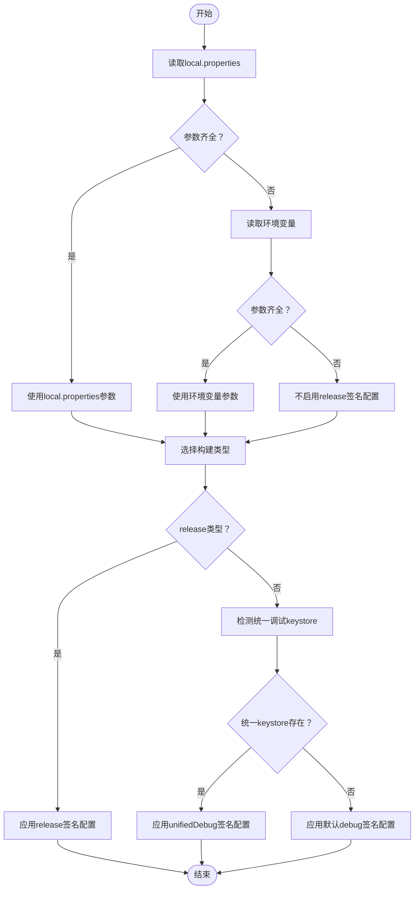
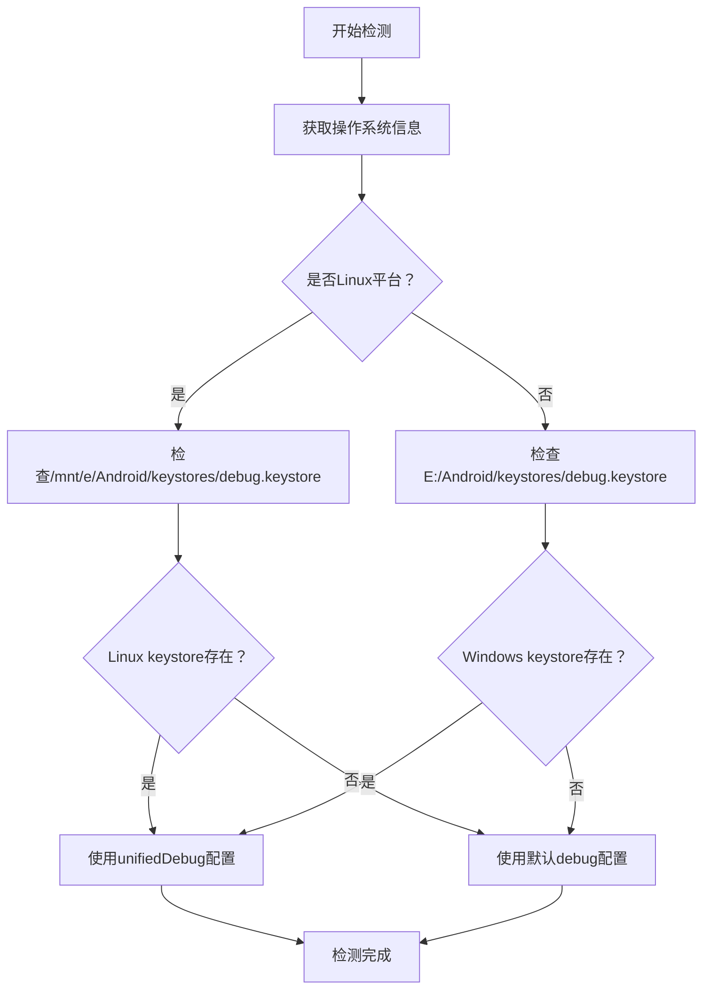
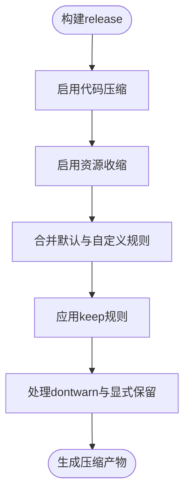
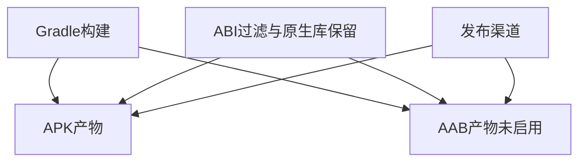
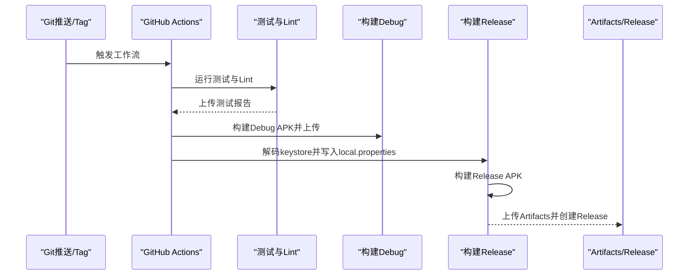
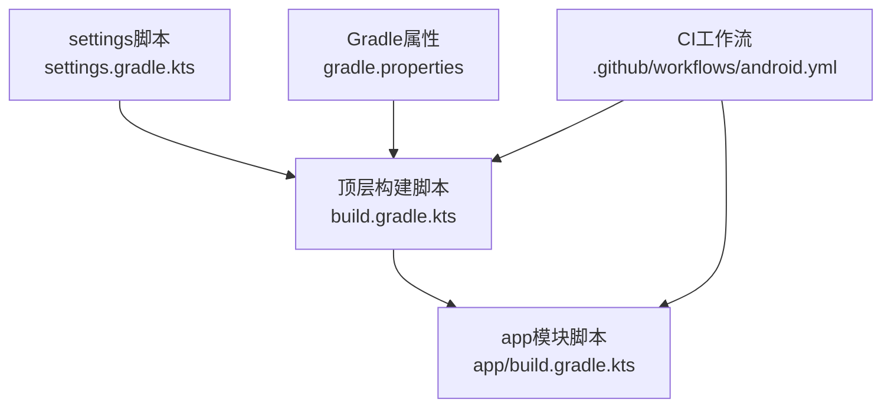

# 代码签名与发布

<cite>
**本文引用的文件**
- [build.gradle.kts](file://build.gradle.kts)
- [gradle.properties](file://gradle.properties)
- [settings.gradle.kts](file://settings.gradle.kts)
- [app/build.gradle.kts](file://app/build.gradle.kts)
- [app/proguard-rules.pro](file://app/proguard-rules.pro)
- [.github/workflows/android.yml](file://.github/workflows/android.yml)
- [scripts/auto-fix-compilation-errors.ps1](file://scripts/auto-fix-compilation-errors.ps1)
- [scripts/e2e-test.sh](file://scripts/e2e-test.sh)
- [docs/QA-TEST-CASES.md](file://docs/QA-TEST-CASES.md)
- [docs/verification-report-2026-04-15.md](file://docs/verification-report-2026-04-15.md)
- [docs/QA-VERIFICATION-REPORT-20260425.md](file://docs/QA-VERIFICATION-REPORT-20260425.md)
</cite>

## 更新摘要
**变更内容**
- 新增统一调试keystore检测逻辑章节，详细说明CI环境下的跨平台兼容性实现
- 更新调试签名管理章节，增加自动回退机制的描述
- 补充跨平台keystore路径处理的技术细节
- 增强调试签名配置的安全性和可靠性说明

## 目录
1. [简介](#简介)
2. [项目结构](#项目结构)
3. [核心组件](#核心组件)
4. [架构总览](#架构总览)
5. [详细组件分析](#详细组件分析)
6. [依赖关系分析](#依赖关系分析)
7. [性能考量](#性能考量)
8. [故障排查指南](#故障排查指南)
9. [结论](#结论)
10. [附录](#附录)

## 简介
本文件面向Android应用的签名与发布流程，结合仓库中的Gradle配置、ProGuard/R8混淆规则、GitHub Actions自动化流水线以及质量验证文档，系统梳理调试签名与发布签名的配置方式、混淆与资源压缩策略、发布产物生成与优化、签名验证与安全注意事项，并提供发布前质量检查清单与自动化验证建议。

## 项目结构
本仓库采用多模块结构，核心发布配置集中在app模块的Gradle脚本中，顶层构建脚本统一插件版本，仓库根目录提供Gradle属性与仓库源配置，CI由GitHub Actions驱动。

**图表来源**
- [build.gradle.kts:1-9](file://build.gradle.kts#L1-L9)
- [settings.gradle.kts:1-26](file://settings.gradle.kts#L1-L26)
- [app/build.gradle.kts:1-229](file://app/build.gradle.kts#L1-L229)
- [.github/workflows/android.yml:1-148](file://.github/workflows/android.yml#L1-L148)

**章节来源**
- [build.gradle.kts:1-9](file://build.gradle.kts#L1-L9)
- [gradle.properties:1-11](file://gradle.properties#L1-L11)
- [settings.gradle.kts:1-26](file://settings.gradle.kts#L1-L26)

## 核心组件
- 签名配置与加载
  - 从local.properties或环境变量加载发布签名参数，若参数齐全则启用release签名配置；否则release类型仍可构建但未签名。
  - 提供统一的调试签名配置，跨Windows与WSL环境共享同一调试keystore，便于联调一致性。
  - **新增**：CI环境下的统一调试keystore检测逻辑，自动处理Linux(Win10 WSL2)和Windows平台的路径差异。
- 混淆与资源压缩
  - release构建启用代码压缩与资源收缩，使用默认优化规则与项目自定义规则文件。
- 包输出与优化
  - 限定ABI为arm64-v8a，移除x86/x86_64以缩小体积；打包时保留Sherpa-ONNX与ONNX Runtime所需的原生库。
- CI发布流水线
  - GitHub Actions在推送/PR/Tag触发，构建Debug与Release APK，Release阶段解码Base64 keystore并写入local.properties后构建发布包，上传Artifacts并创建GitHub Release。

**章节来源**
- [app/build.gradle.kts:11-24](file://app/build.gradle.kts#L11-L24)
- [app/build.gradle.kts:49-91](file://app/build.gradle.kts#L49-L91)
- [app/build.gradle.kts:109-123](file://app/build.gradle.kts#L109-L123)
- [.github/workflows/android.yml:88-148](file://.github/workflows/android.yml#L88-L148)

## 架构总览
下图展示从本地开发到CI发布的签名与构建链路，包括签名参数来源、构建类型、混淆策略与产物输出。

**图表来源**
- [app/build.gradle.kts:11-24](file://app/build.gradle.kts#L11-L24)
- [app/build.gradle.kts:74-91](file://app/build.gradle.kts#L74-L91)
- [.github/workflows/android.yml:88-148](file://.github/workflows/android.yml#L88-L148)

## 详细组件分析

### 组件A：签名配置与加载
- 参数来源与优先级
  - 优先从根目录local.properties读取，其次从环境变量加载，确保本地与CI一致。
  - release签名参数包括storeFile、storePassword、keyAlias、keyPassword。
- 构建类型签名策略
  - release：当参数齐全时使用release签名配置；否则release构建仍可执行但未签名。
  - debug：使用统一的unifiedDebug签名配置，跨平台共享keystore，便于WSL与Windows联调。
  - **新增**：CI环境下的智能检测机制，自动判断统一keystore是否存在并进行相应的签名配置。
- 安全建议
  - 在CI中使用Secrets存储敏感参数，避免明文写入仓库。
  - 本地开发建议将keystore置于受控位置，配合权限控制与备份策略。

**图表来源**
- [app/build.gradle.kts:11-24](file://app/build.gradle.kts#L11-L24)
- [app/build.gradle.kts:49-91](file://app/build.gradle.kts#L49-L91)
- [app/build.gradle.kts:88-96](file://app/build.gradle.kts#L88-L96)

**章节来源**
- [app/build.gradle.kts:11-24](file://app/build.gradle.kts#L11-L24)
- [app/build.gradle.kts:49-91](file://app/build.gradle.kts#L49-L91)
- [app/build.gradle.kts:88-96](file://app/build.gradle.kts#L88-L96)

### 组件B：统一调试keystore检测逻辑
- **新增功能**：CI环境下的智能keystore检测机制
- 跨平台路径处理
  - Linux(WSL2)平台：使用/mnt/e/Android/keystores/debug.keystore路径
  - Windows平台：使用E:/Android/keystores/debug.keystore路径
- 检测与回退机制
  - 首先检测统一keystore是否存在
  - 存在时使用unifiedDebug配置，确保所有平台签名一致性
  - 不存在时自动回退到默认debug配置，保证CI环境正常构建
- 平台识别逻辑
  - 通过System.getProperty("os.name")判断操作系统类型
  - Linux字符串包含"linux"关键字进行识别
  - 其他平台默认识别为Windows

**图表来源**
- [app/build.gradle.kts:88-96](file://app/build.gradle.kts#L88-L96)

**章节来源**
- [app/build.gradle.kts:88-96](file://app/build.gradle.kts#L88-L96)

### 组件C：ProGuard/R8混淆与资源压缩
- 启用策略
  - release构建开启minifyEnabled与shrinkResources，使用默认优化规则与项目自定义规则文件。
- 关键规则要点
  - 保留Kotlinx Serialization注解与序列化器，避免运行时反射失败。
  - 保留TensorFlow Lite、LiteRT-LM、OkHttp、Okio、Room、Sherpa-ONNX等第三方库的类与native声明，防止混淆导致崩溃。
  - 保留PersonalCenter相关ViewModel与工厂类，确保反射调用可用。
- 建议
  - 针对新增三方库补充相应keep规则；定期评估混淆对功能的影响，必要时放宽特定包的混淆策略。

**图表来源**
- [app/build.gradle.kts:74-82](file://app/build.gradle.kts#L74-L82)
- [app/proguard-rules.pro:1-66](file://app/proguard-rules.pro#L1-L66)

**章节来源**
- [app/build.gradle.kts:74-82](file://app/build.gradle.kts#L74-L82)
- [app/proguard-rules.pro:1-66](file://app/proguard-rules.pro#L1-L66)

### 组件D：发布渠道与产物生成
- 产物类型
  - 当前配置支持生成APK（Debug/Release）。仓库未包含AAB相关配置与任务。
- 产物优化
  - ABI限定为arm64-v8a，移除x86/x86_64以减少体积。
  - 打包时保留Sherpa-ONNX与ONNX Runtime所需的原生库，避免运行时缺失。
- 发布渠道
  - 仓库未提供Play Console或内部测试轨道配置；Release产物通过GitHub Release发布。

**图表来源**
- [app/build.gradle.kts:38-41](file://app/build.gradle.kts#L38-L41)
- [app/build.gradle.kts:117-122](file://app/build.gradle.kts#L117-L122)
- [.github/workflows/android.yml:88-148](file://.github/workflows/android.yml#L88-L148)

**章节来源**
- [app/build.gradle.kts:38-41](file://app/build.gradle.kts#L38-L41)
- [app/build.gradle.kts:117-122](file://app/build.gradle.kts#L117-L122)
- [.github/workflows/android.yml:88-148](file://.github/workflows/android.yml#L88-L148)

### 组件E：CI自动化发布流程
- 触发条件
  - Push到master/main、Pull Request到master/main、创建release tag。
- 步骤概览
  - 测试与Lint：运行单元测试与lint任务，上传测试报告。
  - 构建Debug APK：在Ubuntu Runner上构建并上传Artifacts。
  - 构建Release APK：解码Base64 keystore，写入local.properties，构建release并上传Artifacts，随后创建GitHub Release。
- 安全与可重复性
  - keystore与密码通过Secrets注入，避免硬编码；使用固定JDK版本与Gradle缓存提升可重复性。

**图表来源**
- [.github/workflows/android.yml:1-148](file://.github/workflows/android.yml#L1-L148)

**章节来源**
- [.github/workflows/android.yml:1-148](file://.github/workflows/android.yml#L1-L148)

## 依赖关系分析
- 构建脚本依赖
  - 顶层脚本统一插件版本，settings脚本配置仓库源，app模块脚本负责签名、混淆与打包。
- CI依赖
  - Actions使用setup-java与setup-gradle，依赖固定JDK与Gradle版本，依赖Secrets中的keystore与密码。
- 第三方库影响
  - TensorFlow Lite、LiteRT-LM、OkHttp、Room、Sherpa-ONNX等库对混淆规则有强约束，需在proguard-rules.pro中显式保留。

**图表来源**
- [build.gradle.kts:1-9](file://build.gradle.kts#L1-L9)
- [settings.gradle.kts:1-26](file://settings.gradle.kts#L1-L26)
- [app/build.gradle.kts:1-229](file://app/build.gradle.kts#L1-L229)
- [.github/workflows/android.yml:1-148](file://.github/workflows/android.yml#L1-L148)

**章节来源**
- [build.gradle.kts:1-9](file://build.gradle.kts#L1-L9)
- [settings.gradle.kts:1-26](file://settings.gradle.kts#L1-L26)
- [app/build.gradle.kts:1-229](file://app/build.gradle.kts#L1-L229)
- [.github/workflows/android.yml:1-148](file://.github/workflows/android.yml#L1-L148)

## 性能考量
- 构建性能
  - 启用并行、缓存与配置缓存，提升本地与CI构建速度。
  - ABI限定与原生库保留策略有助于减小包体，间接改善安装与启动性能。
- 混淆与资源收缩
  - release启用minify与shrink，显著降低APK体积；需配合keep规则保证功能稳定。
- CI稳定性
  - 使用固定JDK与Gradle版本，避免因工具链变更导致的构建波动。

**章节来源**
- [gradle.properties:8-11](file://gradle.properties#L8-L11)
- [app/build.gradle.kts:74-82](file://app/build.gradle.kts#L74-L82)
- [app/build.gradle.kts:38-41](file://app/build.gradle.kts#L38-L41)

## 故障排查指南
- 签名相关
  - 本地无法签名：检查local.properties与环境变量是否正确配置；确认keystore路径与权限。
  - CI签名失败：确认Secrets中KEYSTORE_BASE64、RELEASE_STORE_PASSWORD、RELEASE_KEY_PASSWORD已设置且Base64有效。
  - **新增**：统一keystore检测失败：检查/mnt/e/Android/keystores/debug.keystore（Linux）或E:/Android/keystores/debug.keystore（Windows）路径是否正确。
- 混淆相关
  - 运行时崩溃或反射失败：检查proguard-rules.pro中是否遗漏第三方库的keep规则。
- CI构建失败
  - 使用自动化脚本收集构建错误并分析，定位问题后修复再重新构建。
- 端到端验证
  - 使用e2e脚本在真实设备上安装、启动并截图，检查Accessibility状态与界面显示。

**章节来源**
- [app/build.gradle.kts:11-24](file://app/build.gradle.kts#L11-L24)
- [.github/workflows/android.yml:115-132](file://.github/workflows/android.yml#L115-L132)
- [scripts/auto-fix-compilation-errors.ps1:1-27](file://scripts/auto-fix-compilation-errors.ps1#L1-L27)
- [scripts/e2e-test.sh:1-108](file://scripts/e2e-test.sh#L1-L108)

## 结论
本仓库提供了完善的本地与CI签名配置、混淆与资源优化策略，以及可复用的自动化发布流程。**新增的统一调试keystore检测逻辑显著提升了CI环境的跨平台兼容性**，通过智能路径检测和自动回退机制，确保了在Linux(Win10 WSL2)和Windows平台上的签名一致性。建议在现有基础上进一步完善AAB构建与发布渠道配置，并持续完善混淆规则与质量验证体系，以满足更严格的发布要求。

## 附录

### 发布前质量检查清单
- 本地构建
  - 本地构建Debug与Release，确认签名配置生效。
  - 运行单元测试与Lint，确保无严重问题。
- CI构建
  - 确认Actions工作流在Push/PR/Tag触发正常。
  - 验证Artifacts上传与Release创建。
- 功能验证
  - 使用QA测试用例与自动化广播验证核心功能。
  - 执行端到端脚本在目标设备上安装与截图验证。

**章节来源**
- [docs/QA-TEST-CASES.md:7-50](file://docs/QA-TEST-CASES.md#L7-L50)
- [docs/verification-report-2026-04-15.md:1-87](file://docs/verification-report-2026-04-15.md#L1-L87)
- [docs/QA-VERIFICATION-REPORT-20260425.md:1-31](file://docs/QA-VERIFICATION-REPORT-20260425.md#L1-L31)

### 自动化验证流程建议
- 基于广播的自动化测试
  - 使用DEBUG广播触发消息发送与批量处理，验证并发与顺序。
- 端到端脚本
  - 在WSL/Windows环境下统一ADB路径，自动安装、启动、截图并校验Accessibility状态。
- 日志与报告
  - 构建完成后收集测试报告与日志，形成可追溯的验证报告。

**章节来源**
- [docs/QA-TEST-CASES.md:38-50](file://docs/QA-TEST-CASES.md#L38-L50)
- [scripts/e2e-test.sh:1-108](file://scripts/e2e-test.sh#L1-L108)

### 统一调试keystore配置详情
- keystore位置
  - Linux(Win10 WSL2)：/mnt/e/Android/keystores/debug.keystore
  - Windows：E:/Android/keystores/debug.keystore
- 默认凭据
  - storePassword：openclaw123
  - keyAlias：openclaw-debug
  - keyPassword：openclaw123
- 配置特点
  - 跨平台共享，确保所有开发者使用相同的签名密钥
  - 支持自动检测和回退机制，提升CI环境稳定性
  - 专门用于调试目的，不适用于发布签名

**章节来源**
- [app/build.gradle.kts:60-71](file://app/build.gradle.kts#L60-L71)
- [app/build.gradle.kts:88-96](file://app/build.gradle.kts#L88-L96)